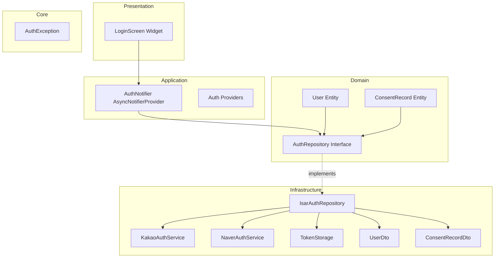

# Authentication Implementation Plan (F-001)

## 1. Overview

**Feature**: Social Login & Authentication (Kakao, Naver)
**TDD Strategy**: Inside-Out (Domain → Infrastructure → Application → Presentation)
**Test Coverage Target**: Unit 70% / Integration 20% / Acceptance 10%

### Module Summary

| Module | Location | Layer | Test Type |
|--------|----------|-------|-----------|
| User Entity | domain/entities/ | Domain | Unit |
| AuthRepository Interface | domain/repositories/ | Domain | Unit (Mock) |
| AuthException | core/errors/ | Core | Unit |
| IsarAuthRepository | infrastructure/repositories/ | Infrastructure | Integration |
| KakaoAuthService | infrastructure/services/ | Infrastructure | Integration |
| NaverAuthService | infrastructure/services/ | Infrastructure | Integration |
| TokenStorage | infrastructure/storage/ | Infrastructure | Integration |
| AuthNotifier | application/notifiers/ | Application | Integration |
| LoginScreen | presentation/screens/ | Presentation | Widget/Acceptance |

---

## 2. Architecture Diagram



---

## 3. Implementation Plan

### 3.1. Core Layer: Exceptions

**Location**: `lib/core/errors/auth_exception.dart`

**Responsibility**: Domain-level authentication error types

**Test Strategy**: Unit Tests

**Test Scenarios (Red Phase)**:
```dart
// AAA Pattern
test('AuthException.cancelled should have correct message', () {
  // Arrange & Act
  final exception = AuthException.cancelled();

  // Assert
  expect(exception.message, '로그인이 취소되었습니다.');
  expect(exception.type, AuthExceptionType.cancelled);
});

test('AuthException.networkError should have correct message', () {
  // Arrange & Act
  final exception = AuthException.networkError();

  // Assert
  expect(exception.message, contains('네트워크'));
});

test('AuthException.tokenExpired should be recoverable', () {
  // Arrange & Act
  final exception = AuthException.tokenExpired();

  // Assert
  expect(exception.isRecoverable, true);
});
```

**Implementation Order**:
1. Define AuthExceptionType enum
2. Create AuthException class with factory constructors
3. Add message, type, isRecoverable properties

**Edge Cases**:
- Unknown error type fallback
- Null/empty error messages

---

### 3.2. Domain Layer: Entities

#### 3.2.1. User Entity

**Location**: `lib/features/authentication/domain/entities/user.dart`

**Responsibility**: User domain model (immutable, business logic only)

**Test Strategy**: Unit Tests

**Test Scenarios (Red Phase)**:
```dart
test('User should be created with required fields', () {
  // Arrange & Act
  final user = User(
    id: 'user-123',
    oauthProvider: OAuthProvider.kakao,
    oauthUserId: 'kakao-456',
    name: 'Test User',
    email: 'test@example.com',
  );

  // Assert
  expect(user.id, 'user-123');
  expect(user.oauthProvider, OAuthProvider.kakao);
  expect(user.name, 'Test User');
});

test('User equality should compare all fields', () {
  // Arrange
  final user1 = User(id: '1', oauthProvider: OAuthProvider.kakao, oauthUserId: 'k1', name: 'A', email: 'a@b.com');
  final user2 = User(id: '1', oauthProvider: OAuthProvider.kakao, oauthUserId: 'k1', name: 'A', email: 'a@b.com');
  final user3 = User(id: '2', oauthProvider: OAuthProvider.kakao, oauthUserId: 'k1', name: 'A', email: 'a@b.com');

  // Act & Assert
  expect(user1, equals(user2));
  expect(user1, isNot(equals(user3)));
});

test('User copyWith should create new instance with updated fields', () {
  // Arrange
  final user = User(id: '1', oauthProvider: OAuthProvider.kakao, oauthUserId: 'k1', name: 'Old', email: 'old@b.com');

  // Act
  final updated = user.copyWith(name: 'New');

  // Assert
  expect(updated.name, 'New');
  expect(updated.email, 'old@b.com');
  expect(updated, isNot(same(user)));
});
```

**Implementation Order**:
1. Define OAuthProvider enum
2. Create User class with required fields
3. Add copyWith method
4. Override equality and hashCode

**Edge Cases**:
- Null profileImageUrl handling
- Empty string validation
- Very long name/email handling

#### 3.2.2. ConsentRecord Entity

**Location**: `lib/features/authentication/domain/entities/consent_record.dart`

**Responsibility**: User consent tracking

**Test Strategy**: Unit Tests

**Test Scenarios (Red Phase)**:
```dart
test('ConsentRecord requires both consents to be true for isComplete', () {
  // Arrange
  final complete = ConsentRecord(
    userId: '1',
    termsOfService: true,
    privacyPolicy: true,
    agreedAt: DateTime.now(),
  );
  final incomplete = ConsentRecord(
    userId: '1',
    termsOfService: true,
    privacyPolicy: false,
    agreedAt: DateTime.now(),
  );

  // Act & Assert
  expect(complete.isComplete, true);
  expect(incomplete.isComplete, false);
});
```

**Implementation Order**:
1. Create ConsentRecord class
2. Add isComplete getter

---

### 3.3. Domain Layer: Repository Interface

**Location**: `lib/features/authentication/domain/repositories/auth_repository.dart`

**Responsibility**: Define data access contract (no implementation)

**Test Strategy**: Mock-based Unit Tests

**Test Scenarios (Red Phase)**:
```dart
// Using Mockito
test('loginWithKakao should return User on success', () async {
  // Arrange
  final mockRepo = MockAuthRepository();
  final expectedUser = User(id: '1', oauthProvider: OAuthProvider.kakao, oauthUserId: 'k1', name: 'Test', email: 'test@test.com');
  when(mockRepo.loginWithKakao()).thenAnswer((_) async => expectedUser);

  // Act
  final user = await mockRepo.loginWithKakao();

  // Assert
  expect(user, expectedUser);
  verify(mockRepo.loginWithKakao()).called(1);
});

test('getCurrentUser should return null when not logged in', () async {
  // Arrange
  final mockRepo = MockAuthRepository();
  when(mockRepo.getCurrentUser()).thenAnswer((_) async => null);

  // Act
  final user = await mockRepo.getCurrentUser();

  // Assert
  expect(user, isNull);
});

test('logout should complete without error', () async {
  // Arrange
  final mockRepo = MockAuthRepository();
  when(mockRepo.logout()).thenAnswer((_) async => {});

  // Act & Assert
  await expectLater(mockRepo.logout(), completes);
});
```

**Implementation Order**:
1. Define abstract AuthRepository class
2. Declare method signatures (loginWithKakao, loginWithNaver, getCurrentUser, logout, refreshToken, saveConsent)

**Interface Methods**:
```dart
abstract class AuthRepository {
  Future<User> loginWithKakao();
  Future<User> loginWithNaver();
  Future<User?> getCurrentUser();
  Future<void> logout();
  Future<void> refreshToken();
  Future<void> saveConsent(ConsentRecord consent);
  Future<ConsentRecord?> getConsent(String userId);
}
```

---

### 3.4. Infrastructure Layer: DTOs

#### 3.4.1. UserDto

**Location**: `lib/features/authentication/infrastructure/dtos/user_dto.dart`

**Responsibility**: Isar DB model for User

**Test Strategy**: Unit Tests

**Test Scenarios (Red Phase)**:
```dart
test('UserDto.fromEntity should convert User to UserDto', () {
  // Arrange
  final user = User(
    id: '1',
    oauthProvider: OAuthProvider.kakao,
    oauthUserId: 'k1',
    name: 'Test',
    email: 'test@test.com',
    profileImageUrl: 'https://image.url',
  );

  // Act
  final dto = UserDto.fromEntity(user);

  // Assert
  expect(dto.id, '1');
  expect(dto.oauthProvider, 'kakao');
  expect(dto.name, 'Test');
});

test('UserDto.toEntity should convert UserDto to User', () {
  // Arrange
  final dto = UserDto()
    ..id = '1'
    ..oauthProvider = 'kakao'
    ..oauthUserId = 'k1'
    ..name = 'Test'
    ..email = 'test@test.com';

  // Act
  final user = dto.toEntity();

  // Assert
  expect(user.id, '1');
  expect(user.oauthProvider, OAuthProvider.kakao);
  expect(user.name, 'Test');
});

test('UserDto should handle null profileImageUrl', () {
  // Arrange
  final user = User(
    id: '1',
    oauthProvider: OAuthProvider.kakao,
    oauthUserId: 'k1',
    name: 'Test',
    email: 'test@test.com',
  );

  // Act
  final dto = UserDto.fromEntity(user);
  final converted = dto.toEntity();

  // Assert
  expect(converted.profileImageUrl, isNull);
});
```

**Implementation Order**:
1. Define Isar collection with annotations
2. Implement fromEntity factory
3. Implement toEntity method

**Edge Cases**:
- Enum string conversion (kakao ↔ OAuthProvider.kakao)
- Null field handling
- DateTime serialization

---

### 3.5. Infrastructure Layer: Services

#### 3.5.1. TokenStorage

**Location**: `lib/features/authentication/infrastructure/storage/token_storage.dart`

**Responsibility**: Secure token persistence (FlutterSecureStorage)

**Test Strategy**: Integration Tests (with mock storage)

**Test Scenarios (Red Phase)**:
```dart
testWidgets('saveAccessToken should store token securely', (tester) async {
  // Arrange
  final mockStorage = MockFlutterSecureStorage();
  final tokenStorage = TokenStorage(mockStorage);
  const token = 'access-token-123';

  // Act
  await tokenStorage.saveAccessToken(token);

  // Assert
  verify(mockStorage.write(key: 'access_token', value: token)).called(1);
});

testWidgets('getAccessToken should retrieve stored token', (tester) async {
  // Arrange
  final mockStorage = MockFlutterSecureStorage();
  when(mockStorage.read(key: 'access_token')).thenAnswer((_) async => 'stored-token');
  final tokenStorage = TokenStorage(mockStorage);

  // Act
  final token = await tokenStorage.getAccessToken();

  // Assert
  expect(token, 'stored-token');
});

testWidgets('clearAllTokens should delete all tokens', (tester) async {
  // Arrange
  final mockStorage = MockFlutterSecureStorage();
  final tokenStorage = TokenStorage(mockStorage);

  // Act
  await tokenStorage.clearAllTokens();

  // Assert
  verify(mockStorage.delete(key: 'access_token')).called(1);
  verify(mockStorage.delete(key: 'refresh_token')).called(1);
});
```

**Implementation Order**:
1. Create TokenStorage class with FlutterSecureStorage dependency
2. Implement saveAccessToken, saveRefreshToken
3. Implement getAccessToken, getRefreshToken
4. Implement clearAllTokens

**Edge Cases**:
- Storage write failure
- Null token retrieval
- Concurrent access handling

#### 3.5.2. KakaoAuthService

**Location**: `lib/features/authentication/infrastructure/services/kakao_auth_service.dart`

**Responsibility**: Kakao OAuth integration

**Test Strategy**: Integration Tests (mock SDK)

**Test Scenarios (Red Phase)**:
```dart
test('login should return user profile on success', () async {
  // Arrange
  final mockKakaoSdk = MockKakaoSdk();
  final service = KakaoAuthService(mockKakaoSdk);
  final mockProfile = KakaoProfile(id: 'k123', name: 'Test', email: 'test@kakao.com');
  when(mockKakaoSdk.loginWithKakao()).thenAnswer((_) async => mockProfile);

  // Act
  final result = await service.login();

  // Assert
  expect(result.oauthUserId, 'k123');
  expect(result.name, 'Test');
  expect(result.email, 'test@kakao.com');
});

test('login should throw AuthException.cancelled when user cancels', () async {
  // Arrange
  final mockKakaoSdk = MockKakaoSdk();
  when(mockKakaoSdk.loginWithKakao()).thenThrow(KakaoCancelledException());
  final service = KakaoAuthService(mockKakaoSdk);

  // Act & Assert
  expect(
    () => service.login(),
    throwsA(isA<AuthException>().having((e) => e.type, 'type', AuthExceptionType.cancelled)),
  );
});

test('login should retry 3 times on network error', () async {
  // Arrange
  final mockKakaoSdk = MockKakaoSdk();
  when(mockKakaoSdk.loginWithKakao()).thenThrow(NetworkException());
  final service = KakaoAuthService(mockKakaoSdk);

  // Act & Assert
  await expectLater(() => service.login(), throwsA(isA<AuthException>()));
  verify(mockKakaoSdk.loginWithKakao()).called(3);
});
```

**Implementation Order**:
1. Create KakaoAuthService with kakao_flutter_sdk dependency
2. Implement login method with OAuth flow
3. Add retry logic (3 attempts)
4. Map SDK exceptions to AuthException

**Edge Cases**:
- User cancellation
- Network timeout
- Invalid token response
- SDK version mismatch

#### 3.5.3. NaverAuthService

**Location**: `lib/features/authentication/infrastructure/services/naver_auth_service.dart`

**Test Strategy**: Integration Tests (similar to KakaoAuthService)

**Test Scenarios**: Same pattern as KakaoAuthService

**Implementation Order**: Same as KakaoAuthService

---

### 3.6. Infrastructure Layer: Repository Implementation

**Location**: `lib/features/authentication/infrastructure/repositories/isar_auth_repository.dart`

**Responsibility**: AuthRepository implementation with Isar + OAuth services

**Test Strategy**: Integration Tests

**Test Scenarios (Red Phase)**:
```dart
test('loginWithKakao should save user to Isar and return User', () async {
  // Arrange
  final isar = await openTestIsar();
  final mockKakaoService = MockKakaoAuthService();
  final mockTokenStorage = MockTokenStorage();
  final repo = IsarAuthRepository(isar, mockKakaoService, MockNaverAuthService(), mockTokenStorage);

  final authResult = AuthResult(
    oauthUserId: 'k123',
    name: 'Test',
    email: 'test@kakao.com',
    accessToken: 'access',
    refreshToken: 'refresh',
  );
  when(mockKakaoService.login()).thenAnswer((_) async => authResult);

  // Act
  final user = await repo.loginWithKakao();

  // Assert
  expect(user.oauthProvider, OAuthProvider.kakao);
  expect(user.name, 'Test');
  verify(mockTokenStorage.saveAccessToken('access')).called(1);

  final savedUser = await isar.userDtos.get(user.id);
  expect(savedUser, isNotNull);

  await isar.close();
});

test('getCurrentUser should return null when no user exists', () async {
  // Arrange
  final isar = await openTestIsar();
  final repo = IsarAuthRepository(isar, MockKakaoAuthService(), MockNaverAuthService(), MockTokenStorage());

  // Act
  final user = await repo.getCurrentUser();

  // Assert
  expect(user, isNull);

  await isar.close();
});

test('logout should clear tokens and user data', () async {
  // Arrange
  final isar = await openTestIsar();
  final mockTokenStorage = MockTokenStorage();
  final repo = IsarAuthRepository(isar, MockKakaoAuthService(), MockNaverAuthService(), mockTokenStorage);

  // Save a user first
  await isar.writeTxn(() async {
    await isar.userDtos.put(UserDto()..id = '1'..name = 'Test');
  });

  // Act
  await repo.logout();

  // Assert
  verify(mockTokenStorage.clearAllTokens()).called(1);
  final users = await isar.userDtos.where().findAll();
  expect(users, isEmpty);

  await isar.close();
});

test('saveConsent should store consent record', () async {
  // Arrange
  final isar = await openTestIsar();
  final repo = IsarAuthRepository(isar, MockKakaoAuthService(), MockNaverAuthService(), MockTokenStorage());
  final consent = ConsentRecord(
    userId: 'user-1',
    termsOfService: true,
    privacyPolicy: true,
    agreedAt: DateTime.now(),
  );

  // Act
  await repo.saveConsent(consent);

  // Assert
  final saved = await repo.getConsent('user-1');
  expect(saved, isNotNull);
  expect(saved!.termsOfService, true);

  await isar.close();
});
```

**Implementation Order**:
1. Create IsarAuthRepository with dependencies
2. Implement loginWithKakao (call service, save to Isar, save tokens)
3. Implement loginWithNaver
4. Implement getCurrentUser (query Isar)
5. Implement logout (clear tokens, delete Isar user)
6. Implement saveConsent, getConsent

**Edge Cases**:
- Isar transaction failures
- Token save failures
- Network errors during login
- Concurrent login attempts

---

### 3.7. Application Layer: Notifier

**Location**: `lib/features/authentication/application/notifiers/auth_notifier.dart`

**Responsibility**: State management for authentication

**Test Strategy**: Integration Tests

**Test Scenarios (Red Phase)**:
```dart
test('initial state should be loading', () async {
  // Arrange
  final container = ProviderContainer(
    overrides: [
      authRepositoryProvider.overrideWithValue(MockAuthRepository()),
    ],
  );

  // Act
  final state = container.read(authNotifierProvider);

  // Assert
  expect(state, isA<AsyncLoading>());
});

test('build should load current user on init', () async {
  // Arrange
  final mockRepo = MockAuthRepository();
  final user = User(id: '1', oauthProvider: OAuthProvider.kakao, oauthUserId: 'k1', name: 'Test', email: 'test@test.com');
  when(mockRepo.getCurrentUser()).thenAnswer((_) async => user);

  final container = ProviderContainer(
    overrides: [authRepositoryProvider.overrideWithValue(mockRepo)],
  );

  // Act
  final state = await container.read(authNotifierProvider.future);

  // Assert
  expect(state, user);
});

test('loginWithKakao should update state to user on success', () async {
  // Arrange
  final mockRepo = MockAuthRepository();
  final user = User(id: '1', oauthProvider: OAuthProvider.kakao, oauthUserId: 'k1', name: 'Test', email: 'test@test.com');
  when(mockRepo.getCurrentUser()).thenAnswer((_) async => null);
  when(mockRepo.loginWithKakao()).thenAnswer((_) async => user);

  final container = ProviderContainer(
    overrides: [authRepositoryProvider.overrideWithValue(mockRepo)],
  );

  // Act
  await container.read(authNotifierProvider.notifier).loginWithKakao();

  // Assert
  final state = container.read(authNotifierProvider).value;
  expect(state, user);
});

test('loginWithKakao should set error state on failure', () async {
  // Arrange
  final mockRepo = MockAuthRepository();
  when(mockRepo.getCurrentUser()).thenAnswer((_) async => null);
  when(mockRepo.loginWithKakao()).thenThrow(AuthException.networkError());

  final container = ProviderContainer(
    overrides: [authRepositoryProvider.overrideWithValue(mockRepo)],
  );

  // Act
  await container.read(authNotifierProvider.notifier).loginWithKakao();

  // Assert
  final state = container.read(authNotifierProvider);
  expect(state, isA<AsyncError>());
});

test('logout should set state to null', () async {
  // Arrange
  final mockRepo = MockAuthRepository();
  final user = User(id: '1', oauthProvider: OAuthProvider.kakao, oauthUserId: 'k1', name: 'Test', email: 'test@test.com');
  when(mockRepo.getCurrentUser()).thenAnswer((_) async => user);
  when(mockRepo.logout()).thenAnswer((_) async => {});

  final container = ProviderContainer(
    overrides: [authRepositoryProvider.overrideWithValue(mockRepo)],
  );

  await container.read(authNotifierProvider.future);

  // Act
  await container.read(authNotifierProvider.notifier).logout();

  // Assert
  final state = container.read(authNotifierProvider).value;
  expect(state, isNull);
});
```

**Implementation Order**:
1. Create AuthNotifier extending AsyncNotifier<User?>
2. Implement build() to load current user
3. Implement loginWithKakao()
4. Implement loginWithNaver()
5. Implement logout()

**Edge Cases**:
- Concurrent login attempts
- Logout during login
- Token refresh during login

---

### 3.8. Presentation Layer: LoginScreen

**Location**: `lib/features/authentication/presentation/screens/login_screen.dart`

**Responsibility**: UI for social login

**Test Strategy**: Widget Tests + Acceptance Tests

**Test Scenarios (Red Phase)**:
```dart
testWidgets('LoginScreen should display Kakao and Naver buttons', (tester) async {
  // Arrange & Act
  await tester.pumpWidget(
    ProviderScope(
      child: MaterialApp(home: LoginScreen()),
    ),
  );

  // Assert
  expect(find.text('카카오 로그인'), findsOneWidget);
  expect(find.text('네이버 로그인'), findsOneWidget);
});

testWidgets('LoginScreen should display consent checkboxes', (tester) async {
  // Arrange & Act
  await tester.pumpWidget(
    ProviderScope(
      child: MaterialApp(home: LoginScreen()),
    ),
  );

  // Assert
  expect(find.byType(Checkbox), findsNWidgets(2));
  expect(find.text('이용약관 동의'), findsOneWidget);
  expect(find.text('개인정보처리방침 동의'), findsOneWidget);
});

testWidgets('Login buttons should be disabled when consents not checked', (tester) async {
  // Arrange
  await tester.pumpWidget(
    ProviderScope(
      child: MaterialApp(home: LoginScreen()),
    ),
  );

  // Act
  final kakaoButton = find.text('카카오 로그인');

  // Assert
  expect(
    tester.widget<ElevatedButton>(kakaoButton).onPressed,
    isNull,
  );
});

testWidgets('Login buttons should be enabled after checking consents', (tester) async {
  // Arrange
  await tester.pumpWidget(
    ProviderScope(
      child: MaterialApp(home: LoginScreen()),
    ),
  );

  // Act
  await tester.tap(find.byType(Checkbox).first);
  await tester.tap(find.byType(Checkbox).last);
  await tester.pump();

  // Assert
  expect(
    tester.widget<ElevatedButton>(find.text('카카오 로그인')).onPressed,
    isNotNull,
  );
});

testWidgets('Tapping Kakao button should call loginWithKakao', (tester) async {
  // Arrange
  final mockNotifier = MockAuthNotifier();
  await tester.pumpWidget(
    ProviderScope(
      overrides: [
        authNotifierProvider.overrideWith(() => mockNotifier),
      ],
      child: MaterialApp(home: LoginScreen()),
    ),
  );

  await tester.tap(find.byType(Checkbox).first);
  await tester.tap(find.byType(Checkbox).last);
  await tester.pump();

  // Act
  await tester.tap(find.text('카카오 로그인'));
  await tester.pump();

  // Assert
  verify(mockNotifier.loginWithKakao()).called(1);
});

testWidgets('Should show loading indicator during login', (tester) async {
  // Arrange
  final mockNotifier = MockAuthNotifier();
  when(mockNotifier.loginWithKakao()).thenAnswer((_) async => Future.delayed(Duration(seconds: 1)));

  await tester.pumpWidget(
    ProviderScope(
      overrides: [
        authNotifierProvider.overrideWith(() => mockNotifier),
      ],
      child: MaterialApp(home: LoginScreen()),
    ),
  );

  await tester.tap(find.byType(Checkbox).first);
  await tester.tap(find.byType(Checkbox).last);
  await tester.pump();

  // Act
  await tester.tap(find.text('카카오 로그인'));
  await tester.pump();

  // Assert
  expect(find.byType(CircularProgressIndicator), findsOneWidget);
});

testWidgets('Should show error message on login failure', (tester) async {
  // Arrange
  final mockNotifier = MockAuthNotifier();
  when(mockNotifier.loginWithKakao()).thenThrow(AuthException.networkError());

  await tester.pumpWidget(
    ProviderScope(
      overrides: [
        authNotifierProvider.overrideWith(() => mockNotifier),
      ],
      child: MaterialApp(home: LoginScreen()),
    ),
  );

  await tester.tap(find.byType(Checkbox).first);
  await tester.tap(find.byType(Checkbox).last);
  await tester.pump();

  // Act
  await tester.tap(find.text('카카오 로그인'));
  await tester.pumpAndSettle();

  // Assert
  expect(find.text('네트워크 연결을 확인해주세요'), findsOneWidget);
});
```

**Implementation Order**:
1. Create LoginScreen StatefulWidget
2. Add consent checkboxes state
3. Add Kakao/Naver login buttons
4. Implement button enable/disable logic
5. Connect to AuthNotifier
6. Add loading and error states
7. Add navigation on success

**QA Sheet (Manual Testing)**:
- [ ] Kakao login button launches Kakao auth page
- [ ] Naver login button launches Naver auth page
- [ ] Consent checkboxes must be checked to enable buttons
- [ ] Loading indicator appears during login
- [ ] Error message appears on network failure
- [ ] Successful login navigates to onboarding (first time) or home (returning)
- [ ] User cancellation shows appropriate message
- [ ] Visual design matches Figma specs
- [ ] Touch targets are at least 44x44 points

**Edge Cases**:
- Back button during OAuth flow
- App background during OAuth
- Multiple rapid taps on login button
- Orientation change during login

---

## 4. TDD Workflow

### Phase 1: Core & Domain (Day 1)
1. **Start**: AuthException tests
2. **Red**: Write failing test for AuthException.cancelled
3. **Green**: Implement minimal AuthException
4. **Refactor**: Add all exception types
5. **Commit**: "feat(auth): add AuthException"

6. **Red**: User entity equality test
7. **Green**: Implement User with Equatable
8. **Refactor**: Add copyWith
9. **Commit**: "feat(auth): add User entity"

10. **Red**: ConsentRecord isComplete test
11. **Green**: Implement ConsentRecord
12. **Commit**: "feat(auth): add ConsentRecord entity"

13. **Red**: AuthRepository interface mock tests
14. **Green**: Define interface
15. **Commit**: "feat(auth): add AuthRepository interface"

### Phase 2: Infrastructure (Day 2-3)
16. **Red**: UserDto conversion tests
17. **Green**: Implement UserDto with Isar annotations
18. **Refactor**: Generate Isar code
19. **Commit**: "feat(auth): add UserDto"

20. **Red**: TokenStorage save/retrieve tests
21. **Green**: Implement TokenStorage
22. **Refactor**: Add error handling
23. **Commit**: "feat(auth): add TokenStorage"

24. **Red**: KakaoAuthService login test
25. **Green**: Implement KakaoAuthService
26. **Refactor**: Add retry logic
27. **Commit**: "feat(auth): add KakaoAuthService"

28. **Red**: NaverAuthService login test
29. **Green**: Implement NaverAuthService
30. **Commit**: "feat(auth): add NaverAuthService"

31. **Red**: IsarAuthRepository loginWithKakao test
32. **Green**: Implement repository methods
33. **Refactor**: Extract common logic
34. **Commit**: "feat(auth): add IsarAuthRepository"

### Phase 3: Application (Day 4)
35. **Red**: AuthNotifier initial state test
36. **Green**: Implement AuthNotifier skeleton
37. **Red**: loginWithKakao updates state test
38. **Green**: Implement loginWithKakao
39. **Refactor**: Add error handling
40. **Commit**: "feat(auth): add AuthNotifier"

### Phase 4: Presentation (Day 5)
41. **Red**: LoginScreen displays buttons test
42. **Green**: Create LoginScreen widget
43. **Red**: Consent checkboxes enable buttons test
44. **Green**: Add checkbox logic
45. **Refactor**: Extract widgets
46. **Commit**: "feat(auth): add LoginScreen"

### Phase 5: Integration & Acceptance (Day 6)
47. **Red**: End-to-end login flow test
48. **Green**: Wire all layers together
49. **Refactor**: Clean up, performance check
50. **Commit**: "test(auth): add acceptance tests"

### Completion Criteria
- [ ] All unit tests pass (70%+ coverage)
- [ ] All integration tests pass
- [ ] Acceptance tests pass (E2E happy path)
- [ ] No warnings from flutter analyze
- [ ] QA sheet items manually verified
- [ ] Code review approved

---

## 5. Notes

**Dependencies**:
- kakao_flutter_sdk: ^1.7.0
- flutter_naver_login: ^1.8.0
- flutter_secure_storage: ^9.0.0
- isar: ^3.1.0
- riverpod: ^2.4.0
- equatable: ^2.0.5

**Test Dependencies**:
- flutter_test
- mockito: ^5.4.0
- build_runner: ^2.4.0

**Critical Rules**:
- NO direct Isar access in Application/Presentation layers
- ALL repository calls through AuthRepository interface
- ALWAYS write test BEFORE implementation
- One test scenario at a time
- Commit after each Red-Green-Refactor cycle
