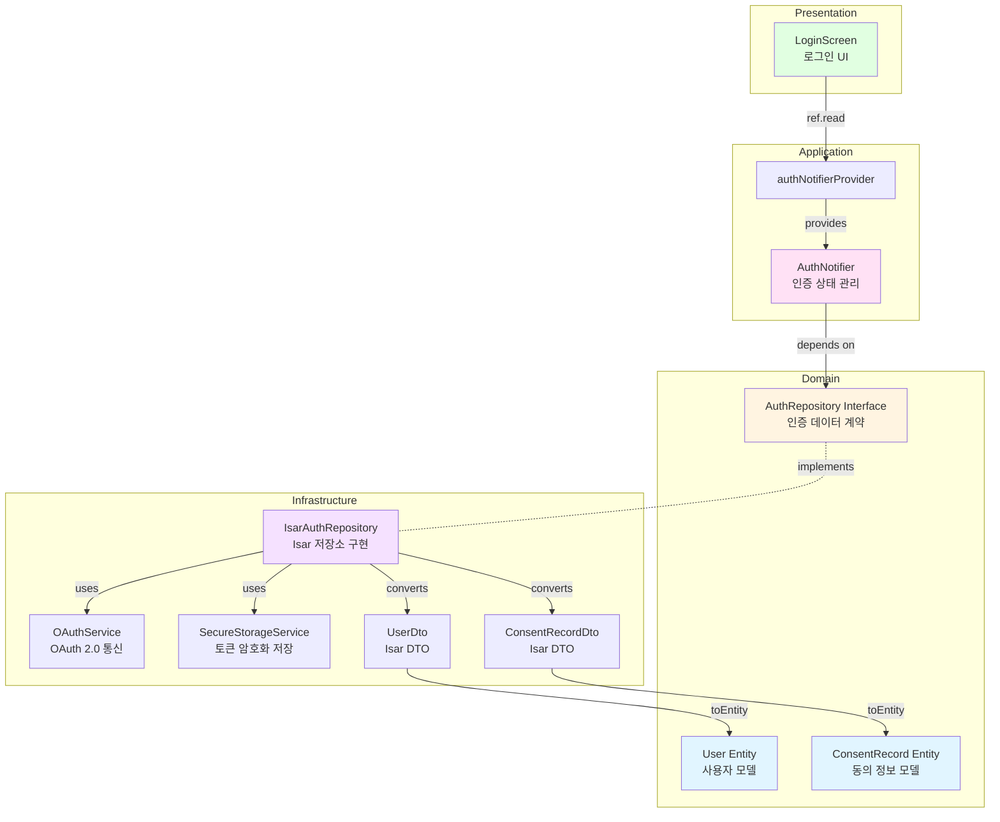

# 소셜 로그인 및 인증 Implementation Plan

## 1. 개요

**Feature**: UF-F-001 소셜 로그인 및 인증
**TDD 전략**: Outside-In (UI → Application → Domain → Infrastructure)
**핵심 목표**: OAuth 2.0 기반 네이버/카카오 로그인 구현 및 토큰 기반 세션 관리

### 모듈 목록

| 모듈 | 위치 | 책임 | TDD 적용 |
|------|------|------|----------|
| User Entity | `features/authentication/domain/entities/user.dart` | 사용자 도메인 모델 | Unit |
| Consent Entity | `features/authentication/domain/entities/consent_record.dart` | 동의 정보 도메인 모델 | Unit |
| AuthRepository Interface | `features/authentication/domain/repositories/auth_repository.dart` | 인증 데이터 접근 계약 | Unit |
| AuthNotifier | `features/authentication/application/notifiers/auth_notifier.dart` | 인증 상태 관리 | Unit + Integration |
| LoginScreen | `features/authentication/presentation/screens/login_screen.dart` | 로그인 UI | Widget + Acceptance |
| UserDto | `features/authentication/infrastructure/dtos/user_dto.dart` | 사용자 DTO (Isar) | Unit |
| ConsentDto | `features/authentication/infrastructure/dtos/consent_record_dto.dart` | 동의 정보 DTO | Unit |
| IsarAuthRepository | `features/authentication/infrastructure/repositories/isar_auth_repository.dart` | Isar 기반 인증 저장소 | Integration |
| OAuthService | `features/authentication/infrastructure/services/oauth_service.dart` | OAuth 2.0 통신 | Integration |
| SecureStorageService | `core/services/secure_storage_service.dart` | 토큰 암호화 저장 | Unit |

---

## 2. Architecture Diagram



---

## 3. Implementation Plan

### 3.1. Domain Layer

#### User Entity
- **Location**: `features/authentication/domain/entities/user.dart`
- **Responsibility**: 사용자 계정 정보를 표현하는 불변 모델
- **Test Strategy**: Unit Test
- **Test Scenarios**:
  ```dart
  // Red Phase
  test('should create User with all required fields', () {
    // Arrange
    final user = User(
      id: 'user123',
      oauthProvider: 'kakao',
      oauthUserId: 'kakao_123',
      name: '홍길동',
      email: 'test@example.com',
    );

    // Assert
    expect(user.id, 'user123');
    expect(user.oauthProvider, 'kakao');
  });

  test('should create User with optional profileImageUrl', () {});
  test('should support copyWith for immutability', () {});
  test('should support equality comparison', () {});
  ```
- **Implementation Order**:
  1. 기본 생성자 및 필드 정의
  2. copyWith 메서드
  3. Equatable 구현
- **Dependencies**: None

---

#### ConsentRecord Entity
- **Location**: `features/authentication/domain/entities/consent_record.dart`
- **Responsibility**: 이용약관 동의 정보 표현
- **Test Strategy**: Unit Test
- **Test Scenarios**:
  ```dart
  // Red Phase
  test('should create ConsentRecord with agreement flags', () {
    final consent = ConsentRecord(
      id: 'consent123',
      userId: 'user123',
      termsOfService: true,
      privacyPolicy: true,
      agreedAt: DateTime.now(),
    );

    expect(consent.termsOfService, true);
    expect(consent.privacyPolicy, true);
  });

  test('should allow partial consent (false flags)', () {});
  test('should record agreedAt timestamp', () {});
  ```
- **Implementation Order**: Entity 생성 → 필드 검증
- **Dependencies**: None

---

#### AuthRepository Interface
- **Location**: `features/authentication/domain/repositories/auth_repository.dart`
- **Responsibility**: 인증 데이터 접근 계약 정의
- **Test Strategy**: Unit Test (Mock 사용)
- **Test Scenarios**:
  ```dart
  // Red Phase
  test('should define loginWithKakao method signature', () async {
    // Arrange
    final mockRepo = MockAuthRepository();
    when(mockRepo.loginWithKakao()).thenAnswer((_) async => mockUser);

    // Act
    final user = await mockRepo.loginWithKakao();

    // Assert
    expect(user, isA<User>());
  });

  test('should define loginWithNaver method signature', () {});
  test('should define logout method signature', () {});
  test('should define getCurrentUser method signature', () {});
  test('should define saveConsentRecord method signature', () {});
  test('should define refreshAccessToken method signature', () {});
  ```
- **Method Signatures**:
  ```dart
  abstract class AuthRepository {
    Future<User> loginWithKakao();
    Future<User> loginWithNaver();
    Future<void> logout();
    Future<User?> getCurrentUser();
    Future<void> saveConsentRecord(ConsentRecord consent);
    Future<String> refreshAccessToken(String refreshToken);
  }
  ```
- **Dependencies**: User, ConsentRecord

---

### 3.2. Infrastructure Layer

#### SecureStorageService
- **Location**: `core/services/secure_storage_service.dart`
- **Responsibility**: FlutterSecureStorage를 통한 토큰 암호화 저장
- **Test Strategy**: Unit Test (MockSecureStorage)
- **Test Scenarios**:
  ```dart
  // Red Phase
  test('should save access token securely', () async {
    // Arrange
    final service = SecureStorageService();

    // Act
    await service.saveAccessToken('token123');

    // Assert
    final token = await service.getAccessToken();
    expect(token, 'token123');
  });

  test('should save refresh token securely', () {});
  test('should delete all tokens on logout', () {});
  test('should return null when no token exists', () {});
  test('should save token expiry time', () {});
  ```
- **Implementation Order**:
  1. FlutterSecureStorage 인스턴스 생성
  2. saveAccessToken / getAccessToken
  3. saveRefreshToken / getRefreshToken
  4. deleteAllTokens
- **Dependencies**: flutter_secure_storage

---

#### OAuthService
- **Location**: `features/authentication/infrastructure/services/oauth_service.dart`
- **Responsibility**: 카카오/네이버 OAuth 2.0 통신 처리
- **Test Strategy**: Integration Test (실제 SDK 또는 Mock)
- **Test Scenarios**:
  ```dart
  // Red Phase
  test('should authenticate with Kakao and return tokens', () async {
    // Arrange
    final service = OAuthService();

    // Act
    final result = await service.authenticateWithKakao();

    // Assert
    expect(result.accessToken, isNotEmpty);
    expect(result.refreshToken, isNotEmpty);
    expect(result.userInfo, isA<Map<String, dynamic>>());
  });

  test('should authenticate with Naver and return tokens', () {});
  test('should throw exception when user cancels OAuth', () {});
  test('should retry on network failure (max 3 times)', () {});
  test('should refresh access token using refresh token', () {});
  test('should handle token expiry gracefully', () {});
  ```
- **Edge Cases**:
  - 사용자가 OAuth 취소: `OAuthCancelledException`
  - 네트워크 오류: 3회 재시도 후 `NetworkException`
  - 토큰 만료: `TokenExpiredException`
- **Implementation Order**:
  1. Kakao SDK 통합
  2. Naver SDK 통합
  3. 재시도 로직
  4. 토큰 갱신 로직
- **Dependencies**: kakao_flutter_sdk, flutter_naver_login, dio

---

#### UserDto / ConsentRecordDto
- **Location**: `features/authentication/infrastructure/dtos/`
- **Responsibility**: Isar 저장을 위한 DTO 변환
- **Test Strategy**: Unit Test
- **Test Scenarios**:
  ```dart
  // UserDto
  test('should convert UserDto to User entity', () {
    final dto = UserDto()
      ..id = 'user123'
      ..oauthProvider = 'kakao'
      ..oauthUserId = 'kakao_123'
      ..name = '홍길동'
      ..email = 'test@example.com';

    final entity = dto.toEntity();

    expect(entity.id, 'user123');
    expect(entity.name, '홍길동');
  });

  test('should convert User entity to UserDto', () {});
  test('should handle null profileImageUrl', () {});

  // ConsentRecordDto
  test('should convert ConsentRecordDto to ConsentRecord entity', () {});
  test('should convert ConsentRecord entity to ConsentRecordDto', () {});
  ```
- **Implementation Order**: DTO 클래스 정의 → toEntity → fromEntity
- **Dependencies**: Isar, User, ConsentRecord

---

#### IsarAuthRepository
- **Location**: `features/authentication/infrastructure/repositories/isar_auth_repository.dart`
- **Responsibility**: AuthRepository 인터페이스 구현 (Isar + OAuth)
- **Test Strategy**: Integration Test (실제 Isar 인스턴스)
- **Test Scenarios**:
  ```dart
  // Red Phase
  testWidgets('should login with Kakao and save user to Isar', () async {
    // Arrange
    final isar = await openTestIsar();
    final oauthService = MockOAuthService();
    final secureStorage = MockSecureStorageService();
    final repo = IsarAuthRepository(isar, oauthService, secureStorage);

    when(oauthService.authenticateWithKakao()).thenAnswer((_) async => mockOAuthResult);

    // Act
    final user = await repo.loginWithKakao();

    // Assert
    expect(user.oauthProvider, 'kakao');
    verify(secureStorage.saveAccessToken(any)).called(1);
    final savedUser = await isar.userDtos.get(user.id);
    expect(savedUser, isNotNull);
  });

  testWidgets('should save consent record to Isar', () {});
  testWidgets('should logout and delete all tokens', () {});
  testWidgets('should get current user from Isar', () {});
  testWidgets('should refresh access token and update storage', () {});
  testWidgets('should throw exception on OAuth failure', () {});
  testWidgets('should retry 3 times on network error', () {});
  ```
- **Edge Cases**:
  - OAuth 취소: 예외 전파
  - 네트워크 오류: 3회 재시도
  - 토큰 갱신 실패: 재로그인 유도
- **Implementation Order**:
  1. loginWithKakao 구현
  2. loginWithNaver 구현
  3. saveConsentRecord 구현
  4. logout 구현
  5. getCurrentUser 구현
  6. refreshAccessToken 구현
- **Dependencies**: Isar, OAuthService, SecureStorageService, UserDto, ConsentRecordDto

---

### 3.3. Application Layer

#### AuthNotifier
- **Location**: `features/authentication/application/notifiers/auth_notifier.dart`
- **Responsibility**: 인증 상태 관리 및 UseCase 오케스트레이션
- **Test Strategy**: Unit Test (MockAuthRepository)
- **Test Scenarios**:
  ```dart
  // Red Phase
  test('should initialize with loading state', () {
    final container = ProviderContainer(
      overrides: [
        authRepositoryProvider.overrideWithValue(mockRepo),
      ],
    );

    final state = container.read(authNotifierProvider);

    expect(state, isA<AsyncLoading>());
  });

  test('should load current user on build', () async {
    when(mockRepo.getCurrentUser()).thenAnswer((_) async => mockUser);

    final container = ProviderContainer(
      overrides: [authRepositoryProvider.overrideWithValue(mockRepo)],
    );

    await container.read(authNotifierProvider.future);

    final state = container.read(authNotifierProvider);
    expect(state.value, mockUser);
  });

  test('should login with Kakao and update state', () async {
    when(mockRepo.loginWithKakao()).thenAnswer((_) async => mockUser);

    final container = ProviderContainer(
      overrides: [authRepositoryProvider.overrideWithValue(mockRepo)],
    );
    final notifier = container.read(authNotifierProvider.notifier);

    await notifier.loginWithKakao();

    final state = container.read(authNotifierProvider);
    expect(state.value, mockUser);
  });

  test('should login with Naver and update state', () {});
  test('should logout and clear state', () {});
  test('should handle OAuth cancellation gracefully', () {});
  test('should handle network error and show message', () {});
  test('should refresh token automatically on expiry', () {});
  ```
- **Implementation Order**:
  1. build() 메서드 (getCurrentUser 호출)
  2. loginWithKakao()
  3. loginWithNaver()
  4. logout()
  5. 에러 핸들링
- **Dependencies**: AuthRepository

---

### 3.4. Presentation Layer

#### LoginScreen
- **Location**: `features/authentication/presentation/screens/login_screen.dart`
- **Responsibility**: 로그인 UI 렌더링 및 사용자 입력 처리
- **Test Strategy**: Widget Test + Acceptance Test
- **Test Scenarios**:
  ```dart
  // Widget Test - Red Phase
  testWidgets('should display Kakao and Naver login buttons', (tester) async {
    await tester.pumpWidget(
      ProviderScope(
        child: MaterialApp(home: LoginScreen()),
      ),
    );

    expect(find.text('카카오 로그인'), findsOneWidget);
    expect(find.text('네이버 로그인'), findsOneWidget);
  });

  testWidgets('should display terms of service checkbox', (tester) async {});
  testWidgets('should disable login buttons when terms not agreed', (tester) async {});
  testWidgets('should enable login buttons when terms agreed', (tester) async {});

  testWidgets('should call loginWithKakao when button pressed', (tester) async {
    final mockNotifier = MockAuthNotifier();

    await tester.pumpWidget(
      ProviderScope(
        overrides: [
          authNotifierProvider.overrideWith(() => mockNotifier),
        ],
        child: MaterialApp(home: LoginScreen()),
      ),
    );

    await tester.tap(find.byKey(Key('kakao_login_button')));
    await tester.pump();

    verify(mockNotifier.loginWithKakao()).called(1);
  });

  testWidgets('should navigate to onboarding on first login', (tester) async {});
  testWidgets('should navigate to home dashboard on returning user', (tester) async {});
  testWidgets('should show error message on OAuth cancellation', (tester) async {});
  testWidgets('should show network error message and retry option', (tester) async {});
  ```
- **QA Sheet** (수동 테스트):
  | 항목 | 체크 |
  |------|------|
  | 카카오 로그인 버튼 클릭 시 카카오 인증 페이지로 이동 | ☐ |
  | 네이버 로그인 버튼 클릭 시 네이버 인증 페이지로 이동 | ☐ |
  | 동의 체크박스 미선택 시 버튼 비활성화 | ☐ |
  | 동의 체크박스 선택 시 버튼 활성화 | ☐ |
  | OAuth 취소 시 안내 메시지 표시 | ☐ |
  | 네트워크 오류 시 재시도 옵션 표시 | ☐ |
  | 최초 로그인 시 온보딩 화면으로 이동 | ☐ |
  | 재방문 사용자 자동 로그인 후 홈 대시보드 이동 | ☐ |
- **Implementation Order**:
  1. UI 레이아웃 구성
  2. 동의 체크박스 상태 관리
  3. 로그인 버튼 활성화 로직
  4. AuthNotifier 연동
  5. 네비게이션 로직
  6. 에러 처리 UI
- **Dependencies**: AuthNotifier

---

## 4. TDD Workflow

### Phase 1: Domain Layer (Inside-Out)
1. **시작**: User Entity 테스트 작성
2. **Red → Green → Refactor**:
   - User Entity 구현
   - ConsentRecord Entity 구현
   - AuthRepository Interface 정의
3. **Commit**: "feat(auth): add domain entities and repository interface"

### Phase 2: Infrastructure Layer
1. **시작**: SecureStorageService 테스트 작성
2. **Red → Green → Refactor**:
   - SecureStorageService 구현
   - OAuthService 구현 (Kakao 먼저)
   - UserDto / ConsentRecordDto 구현
   - IsarAuthRepository 구현
3. **Commit**: "feat(auth): implement infrastructure layer with Isar and OAuth"

### Phase 3: Application Layer
1. **시작**: AuthNotifier 테스트 작성
2. **Red → Green → Refactor**:
   - AuthNotifier build() 구현
   - loginWithKakao / loginWithNaver 구현
   - logout 구현
3. **Commit**: "feat(auth): add authentication state management"

### Phase 4: Presentation Layer
1. **시작**: LoginScreen 위젯 테스트 작성
2. **Red → Green → Refactor**:
   - LoginScreen UI 구현
   - 동의 체크박스 로직
   - AuthNotifier 연동
   - 네비게이션 로직
3. **Commit**: "feat(auth): implement login screen UI"

### Phase 5: Acceptance Testing
1. **시작**: E2E 시나리오 작성
2. **Red → Green → Refactor**:
   - 최초 로그인 → 온보딩 플로우
   - 재방문 자동 로그인 → 홈 대시보드 플로우
   - OAuth 취소 처리
   - 네트워크 오류 재시도
3. **Commit**: "test(auth): add acceptance tests for login flows"

### Phase 6: Refactoring
1. 중복 코드 제거
2. 에러 메시지 상수화
3. 재시도 로직 추출
4. **Commit**: "refactor(auth): extract retry logic and error messages"

---

## 5. 핵심 원칙

### Repository Pattern
- Application/Presentation은 **AuthRepository Interface**만 의존
- Infrastructure는 **IsarAuthRepository 구현체** 제공
- Phase 1 전환 시 **SupabaseAuthRepository**로 1줄 변경

### Test Pyramid
- **Unit Tests (70%)**: Entity, DTO, SecureStorage, AuthNotifier
- **Integration Tests (20%)**: IsarAuthRepository, OAuthService
- **Acceptance Tests (10%)**: LoginScreen E2E 플로우

### TDD 사이클
1. **Red**: 실패하는 테스트 작성
2. **Green**: 최소한의 코드로 통과
3. **Refactor**: 중복 제거 및 최적화

### Edge Case 처리
- OAuth 취소: 사용자 친화적 메시지
- 네트워크 오류: 3회 재시도 + 재시도 옵션
- 토큰 만료: 자동 갱신 또는 재로그인 유도
- 동시 다중 기기 로그인: 독립 세션 허용

---

## 6. 성공 기준

### 기능 요구사항
- [x] 카카오/네이버 OAuth 2.0 로그인 성공
- [x] 토큰 암호화 저장 (FlutterSecureStorage)
- [x] 동의 정보 Isar DB 저장
- [x] 최초 로그인 시 온보딩 화면 이동
- [x] 재방문 사용자 자동 로그인
- [x] 토큰 갱신 자동 처리
- [x] 네트워크 오류 재시도 (3회)

### 비기능 요구사항
- [x] 모든 테스트 통과 (Unit + Integration + Acceptance)
- [x] Layer 간 의존성 규칙 준수
- [x] Repository Pattern 엄격히 적용
- [x] 보안: HTTPS 통신, 토큰 암호화
- [x] 성능: OAuth 흐름 3초 이내 완료

### 코드 품질
- [x] Test Coverage > 80%
- [x] No warnings (flutter analyze)
- [x] TDD 사이클 완료 (모든 모듈)
- [x] Commit 메시지 규칙 준수
