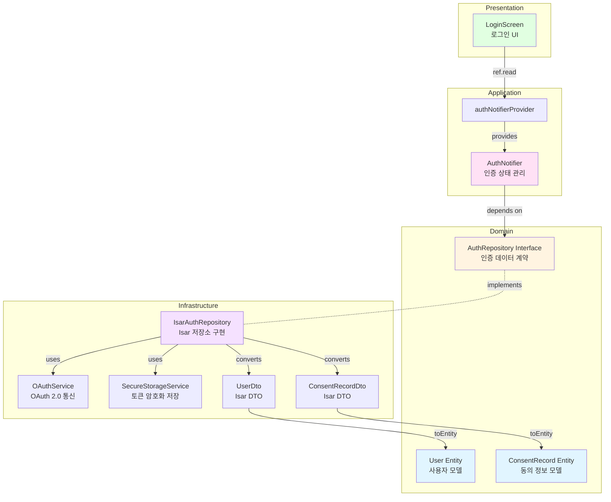

# 소셜 로그인 및 인증 Implementation Plan

## 1. 개요

**Feature**: UF-F-001 소셜 로그인 및 인증
**TDD 전략**: Outside-In (UI → Application → Domain → Infrastructure)
**핵심 목표**: OAuth 2.0 기반 네이버/카카오 로그인 구현 및 토큰 기반 세션 관리

### 모듈 목록

| 모듈 | 위치 | 책임 | TDD 적용 |
|------|------|------|----------|
| User Entity | `features/authentication/domain/entities/user.dart` | 사용자 도메인 모델 | Unit |
| Consent Entity | `features/authentication/domain/entities/consent_record.dart` | 동의 정보 도메인 모델 | Unit |
| AuthRepository Interface | `features/authentication/domain/repositories/auth_repository.dart` | 인증 데이터 접근 계약 | Unit |
| AuthNotifier | `features/authentication/application/notifiers/auth_notifier.dart` | 인증 상태 관리 | Unit + Integration |
| LoginScreen | `features/authentication/presentation/screens/login_screen.dart` | 로그인 UI | Widget + Acceptance |
| UserDto | `features/authentication/infrastructure/dtos/user_dto.dart` | 사용자 DTO (Isar) | Unit |
| ConsentDto | `features/authentication/infrastructure/dtos/consent_record_dto.dart` | 동의 정보 DTO | Unit |
| IsarAuthRepository | `features/authentication/infrastructure/repositories/isar_auth_repository.dart` | Isar 기반 인증 저장소 | Integration |
| OAuthService | `features/authentication/infrastructure/services/oauth_service.dart` | OAuth 2.0 통신 | Integration |
| SecureStorageService | `core/services/secure_storage_service.dart` | 토큰 암호화 저장 | Unit |

---

## 2. Architecture Diagram



---

## 3. Implementation Plan

### 3.1. Domain Layer

#### User Entity
- **Location**: `features/authentication/domain/entities/user.dart`
- **Responsibility**: 사용자 계정 정보를 표현하는 불변 모델
- **Test Strategy**: Unit Test
- **Test Scenarios**:
  ```dart
  // Red Phase
  test('should create User with all required fields', () {
    // Arrange
    final user = User(
      id: 'user123',
      oauthProvider: 'kakao',
      oauthUserId: 'kakao_123',
      name: '홍길동',
      email: 'test@example.com',
      lastLoginAt: DateTime.now(),
    );

    // Assert
    expect(user.id, 'user123');
    expect(user.oauthProvider, 'kakao');
    expect(user.lastLoginAt, isNotNull);
  });

  test('should create User with optional profileImageUrl', () {});
  test('should create User with null lastLoginAt for first login', () {});
  test('should support copyWith for immutability', () {});
  test('should support equality comparison', () {});
  ```
- **Implementation Order**:
  1. 기본 생성자 및 필드 정의 (lastLoginAt 포함)
  2. copyWith 메서드
  3. Equatable 구현
- **Dependencies**: None

---

#### ConsentRecord Entity
- **Location**: `features/authentication/domain/entities/consent_record.dart`
- **Responsibility**: 이용약관 동의 정보 표현
- **Test Strategy**: Unit Test
- **Test Scenarios**:
  ```dart
  // Red Phase
  test('should create ConsentRecord with agreement flags', () {
    final consent = ConsentRecord(
      id: 'consent123',
      userId: 'user123',
      termsOfService: true,
      privacyPolicy: true,
      agreedAt: DateTime.now(),
    );

    expect(consent.termsOfService, true);
    expect(consent.privacyPolicy, true);
  });

  test('should allow partial consent (false flags)', () {});
  test('should record agreedAt timestamp', () {});
  ```
- **Implementation Order**: Entity 생성 → 필드 검증
- **Dependencies**: None

---

#### AuthRepository Interface
- **Location**: `features/authentication/domain/repositories/auth_repository.dart`
- **Responsibility**: 인증 데이터 접근 계약 정의
- **Test Strategy**: Unit Test (Mock 사용)
- **Test Scenarios**:
  ```dart
  // Red Phase
  test('should define loginWithKakao method signature', () async {
    // Arrange
    final mockRepo = MockAuthRepository();
    when(mockRepo.loginWithKakao(
      agreedToTerms: true,
      agreedToPrivacy: true,
    )).thenAnswer((_) async => mockUser);

    // Act
    final user = await mockRepo.loginWithKakao(
      agreedToTerms: true,
      agreedToPrivacy: true,
    );

    // Assert
    expect(user, isA<User>());
  });

  test('should define loginWithNaver method signature', () {});
  test('should define logout method signature', () {});
  test('should define getCurrentUser method signature', () {});
  test('should define isFirstLogin method signature', () async {
    final mockRepo = MockAuthRepository();
    when(mockRepo.isFirstLogin()).thenAnswer((_) async => true);

    final isFirst = await mockRepo.isFirstLogin();

    expect(isFirst, isA<bool>());
  });
  test('should define isAccessTokenValid method signature', () {});
  test('should define refreshAccessToken method signature', () {});
  ```
- **Method Signatures**:
  ```dart
  abstract class AuthRepository {
    Future<User> loginWithKakao({
      required bool agreedToTerms,
      required bool agreedToPrivacy,
    });
    Future<User> loginWithNaver({
      required bool agreedToTerms,
      required bool agreedToPrivacy,
    });
    Future<void> logout();
    Future<User?> getCurrentUser();
    Future<bool> isFirstLogin();
    Future<bool> isAccessTokenValid();
    Future<String> refreshAccessToken(String refreshToken);
  }
  ```
- **Dependencies**: User, ConsentRecord

---

### 3.2. Infrastructure Layer

#### SecureStorageService
- **Location**: `core/services/secure_storage_service.dart`
- **Responsibility**: FlutterSecureStorage를 통한 토큰 암호화 저장 및 만료 시간 관리
- **Test Strategy**: Unit Test (MockSecureStorage)
- **Test Scenarios**:
  ```dart
  // Red Phase
  test('should save access token with expiry time', () async {
    // Arrange
    final service = SecureStorageService();
    final expiresAt = DateTime.now().add(Duration(hours: 2));

    // Act
    await service.saveAccessToken('token123', expiresAt);

    // Assert
    final token = await service.getAccessToken();
    expect(token, 'token123');
  });

  test('should save refresh token securely', () {});
  test('should delete all tokens on logout', () {});
  test('should return null when no token exists', () {});
  test('should detect expired access token', () async {
    final service = SecureStorageService();
    final expiredTime = DateTime.now().subtract(Duration(hours: 1));
    await service.saveAccessToken('token123', expiredTime);

    expect(await service.isAccessTokenExpired(), true);
  });
  test('should return null for expired token', () async {});
  test('should return token if still valid', () async {});
  ```
- **Implementation Order**:
  1. FlutterSecureStorage 인스턴스 생성
  2. saveAccessToken / getAccessToken (만료 시간 포함)
  3. saveRefreshToken / getRefreshToken
  4. isAccessTokenExpired / getAccessTokenIfValid
  5. deleteAllTokens
- **Dependencies**: flutter_secure_storage

---

#### OAuthService
- **Location**: `features/authentication/infrastructure/services/oauth_service.dart`
- **Responsibility**: 카카오/네이버 OAuth 2.0 SDK 통신 (재시도 로직 제외)
- **Test Strategy**: Integration Test (실제 SDK 또는 Mock)
- **Test Scenarios**:
  ```dart
  // Red Phase
  test('should authenticate with Kakao and return OAuthResult', () async {
    // Arrange
    final service = OAuthService();

    // Act
    final result = await service.authenticateWithKakao();

    // Assert
    expect(result.accessToken, isNotEmpty);
    expect(result.refreshToken, isNotEmpty);
    expect(result.expiresAt, isA<DateTime>());
    expect(result.userInfo['name'], isNotEmpty);
    expect(result.userInfo['email'], isNotEmpty);
  });

  test('should authenticate with Naver and return OAuthResult', () async {
    final service = OAuthService();
    final result = await service.authenticateWithNaver();

    expect(result.accessToken, isNotEmpty);
    expect(result.refreshToken, isNotEmpty);
    expect(result.userInfo['name'], isNotEmpty);
  });

  test('should throw exception when user cancels OAuth', () {});
  test('should handle Naver-specific OAuth errors', () {});
  test('should refresh Kakao access token', () {});
  test('should refresh Naver access token', () {});
  test('should handle token expiry gracefully', () {});
  test('should revoke token on logout', () {});
  ```
- **OAuthResult Type Definition**:
  ```dart
  class OAuthResult {
    final String accessToken;
    final String refreshToken;
    final DateTime expiresAt;
    final Map<String, dynamic> userInfo; // name, email, profileImageUrl

    OAuthResult({
      required this.accessToken,
      required this.refreshToken,
      required this.expiresAt,
      required this.userInfo,
    });
  }
  ```
- **Edge Cases**:
  - 사용자가 OAuth 취소: `OAuthCancelledException`
  - 토큰 만료: `TokenExpiredException`
- **Implementation Order**:
  1. OAuthResult 타입 정의
  2. Kakao SDK 통합
  3. Naver SDK 통합
  4. 토큰 갱신 로직
  5. 토큰 해제 로직
- **Dependencies**: kakao_flutter_sdk, flutter_naver_login, dio
- **Note**: 재시도 로직은 IsarAuthRepository에서 처리

---

#### UserDto / ConsentRecordDto
- **Location**: `features/authentication/infrastructure/dtos/`
- **Responsibility**: Isar 저장을 위한 DTO 변환
- **Test Strategy**: Unit Test
- **Test Scenarios**:
  ```dart
  // UserDto
  test('should convert UserDto to User entity', () {
    final dto = UserDto()
      ..id = 'user123'
      ..oauthProvider = 'kakao'
      ..oauthUserId = 'kakao_123'
      ..name = '홍길동'
      ..email = 'test@example.com';

    final entity = dto.toEntity();

    expect(entity.id, 'user123');
    expect(entity.name, '홍길동');
  });

  test('should convert User entity to UserDto', () {});
  test('should handle null profileImageUrl', () {});

  // ConsentRecordDto
  test('should convert ConsentRecordDto to ConsentRecord entity', () {});
  test('should convert ConsentRecord entity to ConsentRecordDto', () {});
  ```
- **Implementation Order**: DTO 클래스 정의 → toEntity → fromEntity
- **Dependencies**: Isar, User, ConsentRecord

---

#### IsarAuthRepository
- **Location**: `features/authentication/infrastructure/repositories/isar_auth_repository.dart`
- **Responsibility**: AuthRepository 인터페이스 구현 (Isar + OAuth + 재시도 로직)
- **Test Strategy**: Integration Test (실제 Isar 인스턴스)
- **Test Scenarios**:
  ```dart
  // Red Phase
  testWidgets('should login with Kakao and save user with consent to Isar', () async {
    // Arrange
    final isar = await openTestIsar();
    final oauthService = MockOAuthService();
    final secureStorage = MockSecureStorageService();
    final repo = IsarAuthRepository(isar, oauthService, secureStorage);

    when(oauthService.authenticateWithKakao()).thenAnswer((_) async => mockOAuthResult);

    // Act
    final user = await repo.loginWithKakao(
      agreedToTerms: true,
      agreedToPrivacy: true,
    );

    // Assert
    expect(user.oauthProvider, 'kakao');
    expect(user.lastLoginAt, isNotNull);
    verify(secureStorage.saveAccessToken(any, any)).called(1);
    final savedUser = await isar.userDtos.get(user.id);
    expect(savedUser, isNotNull);
    final consent = await isar.consentRecordDtos.filter().userIdEqualTo(user.id).findFirst();
    expect(consent, isNotNull);
    expect(consent?.termsOfService, true);
  });

  testWidgets('should login with Naver and save user to Isar', () async {
    final isar = await openTestIsar();
    final oauthService = MockOAuthService();
    final secureStorage = MockSecureStorageService();
    final repo = IsarAuthRepository(isar, oauthService, secureStorage);

    when(oauthService.authenticateWithNaver()).thenAnswer((_) async => mockNaverResult);

    final user = await repo.loginWithNaver(
      agreedToTerms: true,
      agreedToPrivacy: true,
    );

    expect(user.oauthProvider, 'naver');
    verify(secureStorage.saveAccessToken(any, any)).called(1);
  });

  testWidgets('should update lastLoginAt for returning user', () {});
  testWidgets('should return true for first login', () async {
    final repo = IsarAuthRepository(isar, oauthService, secureStorage);

    expect(await repo.isFirstLogin(), true);
  });
  testWidgets('should return false for returning user', () async {});
  testWidgets('should logout and delete all tokens even on network error', () async {
    final mockOAuthService = MockOAuthService();
    when(mockOAuthService.revokeToken()).thenThrow(NetworkException('Timeout'));

    final repo = IsarAuthRepository(isar, mockOAuthService, secureStorage);

    await repo.logout(); // 예외 발생하지 않아야 함

    verify(secureStorage.deleteAllTokens()).called(1);
  });
  testWidgets('should get current user from Isar', () {});
  testWidgets('should refresh access token and update storage', () {});
  testWidgets('should throw exception on OAuth failure', () {});
  testWidgets('should retry exactly 3 times on network error', () async {
    final mockOAuthService = MockOAuthService();
    when(mockOAuthService.authenticateWithKakao())
        .thenThrow(NetworkException('Connection failed'));

    final repo = IsarAuthRepository(isar, mockOAuthService, secureStorage);

    expect(
      () => repo.loginWithKakao(agreedToTerms: true, agreedToPrivacy: true),
      throwsA(isA<MaxRetriesExceededException>()),
    );

    verify(mockOAuthService.authenticateWithKakao()).called(3);
  });
  testWidgets('should succeed on second retry', () async {
    final mockOAuthService = MockOAuthService();
    when(mockOAuthService.authenticateWithKakao())
        .thenThrow(NetworkException('Connection failed'))
        .thenAnswer((_) async => mockOAuthResult);

    final user = await repo.loginWithKakao(agreedToTerms: true, agreedToPrivacy: true);

    expect(user, isNotNull);
    verify(mockOAuthService.authenticateWithKakao()).called(2);
  });
  testWidgets('should validate access token expiry', () {});
  ```
- **Edge Cases**:
  - OAuth 취소: 예외 전파
  - 네트워크 오류: 정확히 3회 재시도 (exponential backoff)
  - 토큰 갱신 실패: 재로그인 유도
  - 로그아웃 중 네트워크 오류: 로컬 토큰 삭제는 반드시 수행
- **Implementation Order**:
  1. loginWithKakao 구현 (동의 정보 저장 포함, 재시도 로직 포함)
  2. loginWithNaver 구현 (동의 정보 저장 포함, 재시도 로직 포함)
  3. isFirstLogin 구현
  4. logout 구현 (네트워크 오류 무시)
  5. getCurrentUser 구현
  6. isAccessTokenValid 구현
  7. refreshAccessToken 구현
- **Dependencies**: Isar, OAuthService, SecureStorageService, UserDto, ConsentRecordDto

---

### 3.3. Application Layer

#### AuthNotifier
- **Location**: `features/authentication/application/notifiers/auth_notifier.dart`
- **Responsibility**: 인증 상태 관리, 최초 로그인 판단, 토큰 갱신 오케스트레이션
- **Test Strategy**: Unit Test (MockAuthRepository)
- **Test Scenarios**:
  ```dart
  // Red Phase
  test('should initialize with loading state', () {
    final container = ProviderContainer(
      overrides: [
        authRepositoryProvider.overrideWithValue(mockRepo),
      ],
    );

    final state = container.read(authNotifierProvider);

    expect(state, isA<AsyncLoading>());
  });

  test('should load current user on build', () async {
    when(mockRepo.getCurrentUser()).thenAnswer((_) async => mockUser);

    final container = ProviderContainer(
      overrides: [authRepositoryProvider.overrideWithValue(mockRepo)],
    );

    await container.read(authNotifierProvider.future);

    final state = container.read(authNotifierProvider);
    expect(state.value, mockUser);
  });

  test('should login with Kakao and update state', () async {
    when(mockRepo.loginWithKakao(
      agreedToTerms: true,
      agreedToPrivacy: true,
    )).thenAnswer((_) async => mockUser);

    final container = ProviderContainer(
      overrides: [authRepositoryProvider.overrideWithValue(mockRepo)],
    );
    final notifier = container.read(authNotifierProvider.notifier);

    await notifier.loginWithKakao(
      agreedToTerms: true,
      agreedToPrivacy: true,
    );

    final state = container.read(authNotifierProvider);
    expect(state.value, mockUser);
  });

  test('should login with Naver and update state', () async {
    when(mockRepo.loginWithNaver(
      agreedToTerms: true,
      agreedToPrivacy: true,
    )).thenAnswer((_) async => mockNaverUser);

    await notifier.loginWithNaver(
      agreedToTerms: true,
      agreedToPrivacy: true,
    );

    final state = container.read(authNotifierProvider);
    expect(state.value?.oauthProvider, 'naver');
  });

  test('should logout and clear state', () {});
  test('should handle OAuth cancellation gracefully', () {});
  test('should handle network error and show message', () {});
  test('should refresh token automatically before expiry', () async {
    when(mockRepo.isAccessTokenValid()).thenAnswer((_) async => false);
    when(mockRepo.refreshAccessToken(any)).thenAnswer((_) async => 'newToken');

    await notifier.ensureValidToken();

    verify(mockRepo.refreshAccessToken(any)).called(1);
  });
  test('should logout if refresh token is also expired', () async {});
  ```
- **Implementation Order**:
  1. build() 메서드 (getCurrentUser 호출)
  2. loginWithKakao() (동의 정보 파라미터 포함)
  3. loginWithNaver() (동의 정보 파라미터 포함)
  4. logout()
  5. ensureValidToken() (자동 토큰 갱신)
  6. 에러 핸들링
- **Dependencies**: AuthRepository

---

### 3.4. Presentation Layer

#### LoginScreen
- **Location**: `features/authentication/presentation/screens/login_screen.dart`
- **Responsibility**: 로그인 UI 렌더링, 사용자 입력 처리, 최초 로그인 여부에 따른 네비게이션
- **Test Strategy**: Widget Test + Acceptance Test
- **Test Scenarios**:
  ```dart
  // Widget Test - Red Phase
  testWidgets('should display Kakao and Naver login buttons', (tester) async {
    await tester.pumpWidget(
      ProviderScope(
        child: MaterialApp(home: LoginScreen()),
      ),
    );

    expect(find.text('카카오 로그인'), findsOneWidget);
    expect(find.text('네이버 로그인'), findsOneWidget);
  });

  testWidgets('should display terms of service checkbox', (tester) async {});
  testWidgets('should disable login buttons when terms not agreed', (tester) async {});
  testWidgets('should enable login buttons when terms agreed', (tester) async {});

  testWidgets('should call loginWithKakao with consent when button pressed', (tester) async {
    final mockNotifier = MockAuthNotifier();

    await tester.pumpWidget(
      ProviderScope(
        overrides: [
          authNotifierProvider.overrideWith(() => mockNotifier),
        ],
        child: MaterialApp(home: LoginScreen()),
      ),
    );

    // 동의 체크박스 선택
    await tester.tap(find.byKey(Key('terms_checkbox')));
    await tester.tap(find.byKey(Key('privacy_checkbox')));
    await tester.pump();

    await tester.tap(find.byKey(Key('kakao_login_button')));
    await tester.pump();

    verify(mockNotifier.loginWithKakao(
      agreedToTerms: true,
      agreedToPrivacy: true,
    )).called(1);
  });

  testWidgets('should call loginWithNaver when button pressed', (tester) async {
    await tester.pumpWidget(
      ProviderScope(
        overrides: [
          authNotifierProvider.overrideWith(() => mockNotifier),
        ],
        child: MaterialApp(home: LoginScreen()),
      ),
    );

    await tester.tap(find.byKey(Key('terms_checkbox')));
    await tester.tap(find.byKey(Key('privacy_checkbox')));
    await tester.pump();

    await tester.tap(find.byKey(Key('naver_login_button')));
    await tester.pump();

    verify(mockNotifier.loginWithNaver(
      agreedToTerms: true,
      agreedToPrivacy: true,
    )).called(1);
  });

  testWidgets('should navigate to onboarding on first login', (tester) async {
    when(mockRepo.isFirstLogin()).thenAnswer((_) async => true);

    await tester.tap(find.byKey(Key('kakao_login_button')));
    await tester.pumpAndSettle();

    expect(find.byType(OnboardingScreen), findsOneWidget);
  });
  testWidgets('should navigate to home dashboard on returning user', (tester) async {
    when(mockRepo.isFirstLogin()).thenAnswer((_) async => false);

    await tester.tap(find.byKey(Key('kakao_login_button')));
    await tester.pumpAndSettle();

    expect(find.byType(HomeDashboardScreen), findsOneWidget);
  });
  testWidgets('should show error message on OAuth cancellation', (tester) async {});
  testWidgets('should show network error message and retry option', (tester) async {});
  ```
- **QA Sheet** (수동 테스트):
  | 항목 | 체크 |
  |------|------|
  | 카카오 로그인 버튼 클릭 시 카카오 인증 페이지로 이동 | ☐ |
  | 네이버 로그인 버튼 클릭 시 네이버 인증 페이지로 이동 | ☐ |
  | 동의 체크박스 미선택 시 버튼 비활성화 | ☐ |
  | 동의 체크박스 선택 시 버튼 활성화 | ☐ |
  | OAuth 취소 시 안내 메시지 표시 | ☐ |
  | 네트워크 오류 시 재시도 옵션 표시 | ☐ |
  | 최초 로그인 시 온보딩 화면으로 이동 | ☐ |
  | 재방문 사용자 로그인 후 홈 대시보드로 이동 | ☐ |
- **Implementation Order**:
  1. UI 레이아웃 구성
  2. 동의 체크박스 상태 관리
  3. 로그인 버튼 활성화 로직
  4. AuthNotifier 연동 (동의 정보 전달)
  5. 최초 로그인 여부 확인 및 네비게이션 분기 로직
  6. 에러 처리 UI
- **Dependencies**: AuthNotifier

---

## 4. TDD Workflow

### Phase 1: Domain Layer (Inside-Out)
1. **시작**: User Entity 테스트 작성
2. **Red → Green → Refactor**:
   - User Entity 구현
   - ConsentRecord Entity 구현
   - AuthRepository Interface 정의
3. **Commit**: "feat(auth): add domain entities and repository interface"

### Phase 2: Infrastructure Layer
1. **시작**: SecureStorageService 테스트 작성
2. **Red → Green → Refactor**:
   - SecureStorageService 구현 (토큰 만료 시간 관리 포함)
   - OAuthResult 타입 정의
   - OAuthService 구현 (Kakao, Naver 모두)
   - UserDto / ConsentRecordDto 구현
   - IsarAuthRepository 구현 (재시도 로직, 동의 정보 저장 통합)
3. **Commit**: "feat(auth): implement infrastructure layer with Isar and OAuth"

### Phase 3: Application Layer
1. **시작**: AuthNotifier 테스트 작성
2. **Red → Green → Refactor**:
   - AuthNotifier build() 구현
   - loginWithKakao / loginWithNaver 구현 (동의 정보 파라미터 포함)
   - ensureValidToken() 구현 (자동 토큰 갱신)
   - logout 구현
3. **Commit**: "feat(auth): add authentication state management"

### Phase 4: Presentation Layer
1. **시작**: LoginScreen 위젯 테스트 작성
2. **Red → Green → Refactor**:
   - LoginScreen UI 구현
   - 동의 체크박스 로직
   - AuthNotifier 연동 (동의 정보 전달)
   - 최초 로그인 여부 확인 및 네비게이션 분기 로직
3. **Commit**: "feat(auth): implement login screen UI"

### Phase 5: Acceptance Testing
1. **시작**: E2E 시나리오 작성
2. **Red → Green → Refactor**:
   - 최초 로그인 (Kakao/Naver) → 온보딩 플로우
   - 재방문 로그인 → 홈 대시보드 플로우
   - OAuth 취소 처리
   - 네트워크 오류 3회 재시도
   - 로그아웃 중 네트워크 오류 처리
3. **Commit**: "test(auth): add acceptance tests for login flows"

### Phase 6: Refactoring
1. 중복 코드 제거
2. 에러 메시지 상수화
3. 토큰 만료 검증 로직 최적화
4. **Commit**: "refactor(auth): optimize token validation and error handling"

---

## 5. 핵심 원칙

### Repository Pattern
- Application/Presentation은 **AuthRepository Interface**만 의존
- Infrastructure는 **IsarAuthRepository 구현체** 제공
- Phase 1 전환 시 **SupabaseAuthRepository**로 1줄 변경

### Test Pyramid
- **Unit Tests (70%)**: Entity, DTO, SecureStorage, AuthNotifier
- **Integration Tests (20%)**: IsarAuthRepository, OAuthService
- **Acceptance Tests (10%)**: LoginScreen E2E 플로우

### TDD 사이클
1. **Red**: 실패하는 테스트 작성
2. **Green**: 최소한의 코드로 통과
3. **Refactor**: 중복 제거 및 최적화

### Edge Case 처리
- OAuth 취소: 사용자 친화적 메시지
- 네트워크 오류: Repository에서 정확히 3회 재시도 (exponential backoff)
- 토큰 만료: SecureStorageService에서 만료 시간 검증, 자동 갱신 또는 재로그인 유도
- 로그아웃 중 네트워크 오류: 로컬 토큰 삭제는 반드시 수행
- 최초 로그인 판단: lastLoginAt 필드로 확인, 온보딩/홈 네비게이션 분기
- 동의 정보 저장: 로그인 프로세스 내 통합 처리

---

## 6. 성공 기준

### 기능 요구사항
- [ ] 카카오/네이버 OAuth 2.0 로그인 성공 (동의 정보 포함)
- [ ] 토큰 암호화 저장 (FlutterSecureStorage, 만료 시간 포함)
- [ ] 동의 정보 로그인 시점에 Isar DB 저장
- [ ] 최초 로그인 판단 (lastLoginAt 필드 기반)
- [ ] 최초 로그인 시 온보딩 화면 이동
- [ ] 재방문 사용자 홈 대시보드 이동
- [ ] 토큰 만료 자동 검증 및 갱신 처리
- [ ] 네트워크 오류 정확히 3회 재시도
- [ ] 로그아웃 중 네트워크 오류 발생해도 로컬 토큰 삭제

### 비기능 요구사항
- [ ] 모든 테스트 통과 (Unit + Integration + Acceptance)
- [ ] Layer 간 의존성 규칙 준수
- [ ] Repository Pattern 엄격히 적용
- [ ] 보안: HTTPS 통신, 토큰 암호화
- [ ] 성능: OAuth 흐름 3초 이내 완료

### 코드 품질
- [ ] Test Coverage > 80%
- [ ] No warnings (flutter analyze)
- [ ] TDD 사이클 완료 (모든 모듈)
- [ ] Commit 메시지 규칙 준수

### 검증 항목 (plancheck.md 기반)
- [ ] User Entity에 lastLoginAt 필드 추가
- [ ] AuthRepository에 isFirstLogin() 및 isAccessTokenValid() 메서드 추가
- [ ] 로그인 메서드에 동의 정보 파라미터 추가 (agreedToTerms, agreedToPrivacy)
- [ ] SecureStorageService에 토큰 만료 시간 저장 및 검증 메서드 추가
- [ ] OAuthResult 타입 명시적 정의
- [ ] OAuthService는 SDK 통신만, 재시도 로직은 IsarAuthRepository에 집중
- [ ] IsarAuthRepository에서 동의 정보 자동 저장
- [ ] 네이버 OAuth 관련 상세 테스트 케이스 추가
- [ ] 로그아웃 네트워크 오류 처리 테스트 추가
- [ ] LoginScreen에서 최초 로그인 여부에 따른 네비게이션 분기
