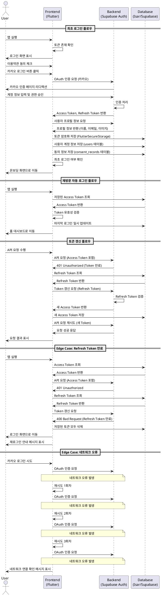

# UF-F-001: 소셜 로그인 및 인증 상세 명세

## Use Case Overview

**Use Case ID**: UF-F-001
**Use Case Name**: 소셜 로그인 및 인증
**Primary Actor**: GLP-1 치료 관리 앱 사용자
**Level**: User Goal
**Scope**: 소셜 인증을 통한 앱 접근 권한 획득 및 사용자 계정 관리

---

## Precondition

- 사용자가 앱을 다운로드하여 설치 완료
- 사용자가 네이버 또는 카카오 계정 보유
- 디바이스가 인터넷에 연결됨
- 앱이 네트워크 접근 권한 보유

---

## Trigger

- 사용자가 앱을 최초 실행
- 사용자가 로그아웃 후 재로그인 시도
- 세션 만료 후 자동 로그인 실패

---

## Main Scenario

### 최초 로그인 플로우

1. 사용자가 앱 실행
2. 앱이 저장된 인증 토큰 확인
3. 유효한 토큰이 없음을 감지하고 로그인 화면 표시
4. 로그인 화면에 네이버/카카오 로그인 버튼과 이용약관 동의 체크박스 표시
5. 사용자가 이용약관 및 개인정보처리방침 동의 체크박스 선택
6. 사용자가 카카오 로그인 버튼 클릭
7. 앱이 카카오 OAuth 인증 페이지로 리디렉션
8. 사용자가 카카오 계정 정보 입력 및 앱 권한 승인
9. 카카오 인증 성공 후 Access Token 및 Refresh Token 수신
10. 앱이 사용자 프로필 정보 수신 (이름, 이메일, 프로필 이미지 URL)
11. 앱이 토큰 및 프로필 정보를 안전한 저장소에 저장
12. 앱이 동의 정보를 내부 DB에 기록
13. 앱이 최초 로그인임을 확인하고 온보딩 화면으로 전환

### 재방문 자동 로그인 플로우

1. 사용자가 앱 실행
2. 앱이 저장된 인증 토큰 확인
3. Access Token이 유효함을 확인
4. 마지막 로그인 일시 업데이트
5. 홈 대시보드 화면으로 직접 이동

### 토큰 갱신 플로우

1. 사용자가 앱 실행 또는 API 요청 수행
2. 앱이 Access Token 만료 감지
3. 저장된 Refresh Token으로 새 Access Token 요청
4. 새 Access Token 수신 및 저장
5. 사용자 세션 유지하며 요청 재시도

---

## Edge Cases

### E1: 사용자가 OAuth 인증 과정 취소

**Condition**: 사용자가 소셜 로그인 화면에서 취소 버튼 클릭
**Action**: 로그인 화면 유지, 안내 메시지 표시 ("로그인이 취소되었습니다. 다시 시도해주세요.")

### E2: Access Token 만료

**Condition**: API 요청 시 Access Token 만료 응답 수신
**Action**: Refresh Token으로 자동 갱신 시도, 갱신 성공 시 요청 재시도

### E3: Refresh Token 만료

**Condition**: Refresh Token 갱신 시도 실패
**Action**: 저장된 토큰 모두 삭제, 로그인 화면으로 이동, 재로그인 유도 메시지 표시

### E4: 네트워크 연결 오류

**Condition**: OAuth 인증 요청 중 네트워크 오류 발생
**Action**: 최대 3회 재시도, 실패 시 "네트워크 연결을 확인해주세요" 메시지 표시

### E5: OAuth 제공자 서버 오류

**Condition**: 카카오 또는 네이버 서버 응답 없음 또는 오류
**Action**: "현재 로그인 서비스에 일시적인 문제가 발생했습니다. 잠시 후 다시 시도해주세요." 메시지 표시, 다른 로그인 방법 제안

### E6: 동의 체크박스 미선택

**Condition**: 사용자가 이용약관 동의하지 않음
**Action**: 로그인 버튼 비활성화 유지, 체크박스 옆에 안내 메시지 표시

### E7: 동일 계정 여러 기기 로그인

**Condition**: 사용자가 동시에 여러 기기에서 로그인
**Action**: 각 기기의 세션 독립적으로 유지, 제한 없음

### E8: 로그아웃 중 네트워크 오류

**Condition**: 로그아웃 요청 중 네트워크 오류
**Action**: 로컬 토큰 삭제 후 로그인 화면 이동 (로컬 로그아웃)

---

## Business Rules

### BR1: 인증 제공자 제한

- 네이버 OAuth 2.0과 카카오 OAuth 2.0만 지원
- 이메일/비밀번호 로그인 미지원

### BR2: 토큰 저장 보안

- Access Token 및 Refresh Token은 FlutterSecureStorage를 통해 암호화 저장
- 평문 저장 금지
- 디바이스 잠금 해제 시에만 접근 가능

### BR3: 동의 정보 저장

- 이용약관 및 개인정보처리방침 동의 여부 및 일시를 내부 DB에 영구 기록
- 동의 철회 시 별도 처리 절차 필요 (MVP 범위 외)

### BR4: 자동 로그인

- 유효한 토큰이 존재하면 자동 로그인 수행
- 최초 로그인 여부에 따라 온보딩 또는 홈 대시보드로 이동

### BR5: 토큰 갱신 정책

- Access Token 만료 시 자동으로 Refresh Token으로 갱신 시도
- Refresh Token 만료 시 재로그인 필수
- 갱신 실패 시 사용자에게 명확히 안내

### BR6: 네트워크 오류 재시도

- OAuth 인증 요청 실패 시 최대 3회 자동 재시도
- 3회 실패 후 사용자에게 에러 메시지 표시

### BR7: HTTPS 통신 필수

- 모든 OAuth 통신은 HTTPS를 통해 암호화
- HTTP 통신 차단

---

## Sequence Diagram

---

## Postcondition

### Success

- 사용자 인증 완료 및 세션 생성
- Access Token 및 Refresh Token이 안전한 저장소에 저장
- 사용자 계정 정보가 내부 DB에 저장
- 동의 정보가 내부 DB에 기록
- 최초 로그인 시 온보딩 화면으로 이동
- 재방문 시 홈 대시보드로 이동

### Failure

- 로그인 화면 유지
- 적절한 에러 메시지 표시
- 재시도 옵션 제공
