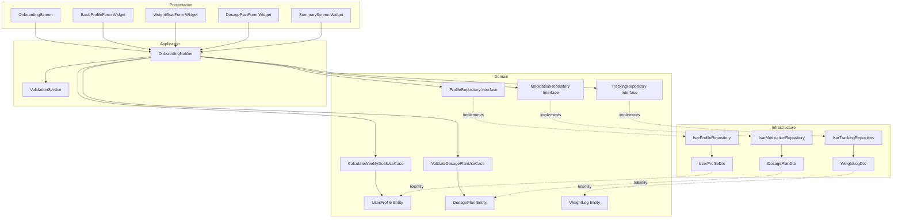

# UF-F000: 온보딩 및 목표 설정 - Implementation Plan

## 1. 개요

온보딩 기능은 신규 사용자가 치료 프로필과 목표를 설정하여 앱 사용을 시작하는 핵심 기능이다. Repository Pattern을 적용하여 Phase 1 전환을 준비하며, TDD 사이클을 통해 각 모듈을 독립적으로 검증한다.

### 모듈 목록
- **Domain Layer**: 비즈니스 로직 및 엔티티 정의
- **Infrastructure Layer**: Isar 기반 Repository 구현 및 DTO
- **Application Layer**: Riverpod 기반 상태 관리 및 UseCase 오케스트레이션
- **Presentation Layer**: Flutter UI 및 사용자 입력 처리

### TDD 적용 범위
- Unit Tests: Domain, Infrastructure, Application (70%)
- Integration Tests: Repository ↔ Application (20%)
- Acceptance Tests: Presentation 시나리오 (10%)

---

## 2. Architecture Diagram

---

## 3. Implementation Plan

### 3.1 Domain Layer

#### 3.1.1 UserProfile Entity
- **Location**: `lib/features/onboarding/domain/entities/user_profile.dart`
- **Responsibility**: 사용자 프로필 및 목표 데이터 모델
- **Test Strategy**: Unit
- **Test Scenarios (Red Phase)**:
  1. UserProfile 생성 시 필수 필드 검증
     - Arrange: targetWeightKg, weeklyWeightRecordGoal, weeklySymptomRecordGoal 값 준비
     - Act: UserProfile 생성
     - Assert: 모든 필드가 올바르게 할당됨
  2. weeklyLossGoalKg 계산 로직 검증
     - Arrange: currentWeight=80kg, targetWeight=70kg, periodWeeks=10
     - Act: UserProfile.calculateWeeklyGoal() 호출
     - Assert: 1.0kg/주 반환
  3. 기본값 설정 검증
     - Arrange: weeklyWeightRecordGoal, weeklySymptomRecordGoal 미입력
     - Act: UserProfile 생성
     - Assert: 각각 7로 설정됨
  4. Edge: targetWeightKg가 0 이하인 경우 ArgumentError 발생
  5. Edge: targetPeriodWeeks가 0인 경우 주간 목표 계산 건너뛰기
- **Implementation Order**:
  1. 기본 생성자 및 필드 정의 (Test 1)
  2. 기본값 로직 추가 (Test 3)
  3. 검증 로직 추가 (Test 4, 5)
  4. Refactor: copyWith, equality

#### 3.1.2 DosagePlan Entity
- **Location**: `lib/features/onboarding/domain/entities/dosage_plan.dart`
- **Responsibility**: 투여 계획 데이터 모델
- **Test Strategy**: Unit
- **Test Scenarios (Red Phase)**:
  1. DosagePlan 생성 시 필수 필드 검증
     - Arrange: medicationName, startDate, cycleDays, initialDoseMg
     - Act: DosagePlan 생성
     - Assert: 모든 필드 할당 확인
  2. escalationPlan null 허용 검증
     - Arrange: escalationPlan 미입력
     - Act: DosagePlan 생성
     - Assert: null로 저장됨
  3. Edge: cycleDays가 0 이하인 경우 ArgumentError
  4. Edge: initialDoseMg가 0 이하인 경우 ArgumentError
  5. Edge: startDate가 7일 이상 과거인 경우 경고 (허용)
- **Implementation Order**:
  1. 기본 생성자 및 필드 (Test 1, 2)
  2. 검증 로직 (Test 3, 4, 5)
  3. Refactor: equality, toString

#### 3.1.3 EscalationStep Value Object
- **Location**: `lib/features/onboarding/domain/entities/escalation_step.dart`
- **Responsibility**: 증량 계획 단계 데이터
- **Test Strategy**: Unit
- **Test Scenarios (Red Phase)**:
  1. EscalationStep 생성 검증
     - Arrange: weeks=4, doseMg=0.5
     - Act: EscalationStep 생성
     - Assert: 필드 확인
  2. Edge: weeks가 0 이하인 경우 ArgumentError
  3. Edge: doseMg가 0 이하인 경우 ArgumentError
- **Implementation Order**:
  1. 생성자 및 검증 (Test 1, 2, 3)
  2. Refactor: equality

#### 3.1.4 WeightLog Entity
- **Location**: `lib/features/onboarding/domain/entities/weight_log.dart`
- **Responsibility**: 체중 기록 (온보딩 시 초기 기록 생성용)
- **Test Strategy**: Unit
- **Test Scenarios (Red Phase)**:
  1. WeightLog 생성 검증
     - Arrange: userId, logDate, weightKg
     - Act: WeightLog 생성
     - Assert: 필드 확인
  2. Edge: weightKg가 0 이하인 경우 ArgumentError
  3. Edge: weightKg가 300 초과인 경우 경고
- **Implementation Order**:
  1. 생성자 및 기본 검증 (Test 1, 2)
  2. 범위 검증 (Test 3)
  3. Refactor: equality

#### 3.1.5 CalculateWeeklyGoalUseCase
- **Location**: `lib/features/onboarding/domain/usecases/calculate_weekly_goal_usecase.dart`
- **Responsibility**: 주간 감량 목표 계산 비즈니스 로직
- **Test Strategy**: Unit
- **Test Scenarios (Red Phase)**:
  1. 정상 계산 검증
     - Arrange: currentWeight=80, targetWeight=70, periodWeeks=10
     - Act: execute()
     - Assert: 1.0kg/주 반환
  2. 소수점 처리 검증
     - Arrange: currentWeight=80.5, targetWeight=75.2, periodWeeks=7
     - Act: execute()
     - Assert: 0.76kg/주 (소수점 2자리 반올림)
  3. Edge: periodWeeks가 null인 경우 null 반환
  4. Edge: 주간 목표가 1kg 초과 시 경고 플래그 반환
  5. Edge: currentWeight <= targetWeight인 경우 ArgumentError
- **Implementation Order**:
  1. 기본 계산 로직 (Test 1, 2)
  2. null 처리 (Test 3)
  3. 안전성 검증 (Test 4, 5)
  4. Refactor: 계산 함수 분리

#### 3.1.6 ValidateDosagePlanUseCase
- **Location**: `lib/features/onboarding/domain/usecases/validate_dosage_plan_usecase.dart`
- **Responsibility**: 투여 계획 논리 검증
- **Test Strategy**: Unit
- **Test Scenarios (Red Phase)**:
  1. 증량 계획 순서 검증
     - Arrange: escalationPlan = [{weeks:4, dose:0.5}, {weeks:8, dose:1.0}]
     - Act: execute()
     - Assert: valid 반환
  2. Edge: 용량이 감소하는 경우 invalid 반환
  3. Edge: 시기가 역순인 경우 invalid 반환
  4. Edge: 중복 시기인 경우 invalid 반환
  5. Edge: escalationPlan이 null인 경우 valid 반환
- **Implementation Order**:
  1. 순서 검증 로직 (Test 1, 2, 3)
  2. 중복 검증 (Test 4)
  3. null 처리 (Test 5)
  4. Refactor: 검증 규칙 분리

#### 3.1.7 Repository Interfaces
- **Location**:
  - `lib/features/onboarding/domain/repositories/profile_repository.dart`
  - `lib/features/onboarding/domain/repositories/medication_repository.dart`
  - `lib/features/onboarding/domain/repositories/tracking_repository.dart`
- **Responsibility**: 데이터 접근 계약 정의
- **Test Strategy**: Interface는 구현체에서 테스트
- **Implementation Order**:
  1. 메서드 시그니처 정의
  2. Refactor: 문서화 주석 추가

---

### 3.2 Infrastructure Layer

#### 3.2.1 UserProfileDto
- **Location**: `lib/features/onboarding/infrastructure/dtos/user_profile_dto.dart`
- **Responsibility**: Isar ↔ UserProfile 변환
- **Test Strategy**: Unit
- **Test Scenarios (Red Phase)**:
  1. toEntity() 정상 변환 검증
     - Arrange: UserProfileDto 인스턴스
     - Act: toEntity() 호출
     - Assert: UserProfile 필드 일치
  2. fromEntity() 정상 변환 검증
     - Arrange: UserProfile 인스턴스
     - Act: fromEntity() 호출
     - Assert: Dto 필드 일치
  3. Edge: null 필드 변환 (targetPeriodWeeks, weeklyLossGoalKg)
- **Implementation Order**:
  1. @collection 및 필드 정의
  2. toEntity() 구현 (Test 1)
  3. fromEntity() 구현 (Test 2)
  4. null 처리 (Test 3)
  5. Refactor: 코드 중복 제거

#### 3.2.2 DosagePlanDto
- **Location**: `lib/features/onboarding/infrastructure/dtos/dosage_plan_dto.dart`
- **Responsibility**: Isar ↔ DosagePlan 변환
- **Test Strategy**: Unit
- **Test Scenarios (Red Phase)**:
  1. toEntity() 검증
  2. fromEntity() 검증
  3. Edge: escalationPlan JSON 직렬화/역직렬화
- **Implementation Order**:
  1. @collection 및 필드
  2. toEntity(), fromEntity()
  3. JSON 변환 로직
  4. Refactor: 변환 유틸 분리

#### 3.2.3 WeightLogDto
- **Location**: `lib/features/onboarding/infrastructure/dtos/weight_log_dto.dart`
- **Responsibility**: Isar ↔ WeightLog 변환
- **Test Strategy**: Unit
- **Test Scenarios (Red Phase)**:
  1. toEntity() 검증
  2. fromEntity() 검증
- **Implementation Order**:
  1. @collection, 필드, 변환 메서드
  2. Refactor: 공통 DTO 패턴 추출

#### 3.2.4 IsarProfileRepository
- **Location**: `lib/features/onboarding/infrastructure/repositories/isar_profile_repository.dart`
- **Responsibility**: ProfileRepository 구현 (Isar 기반)
- **Test Strategy**: Integration (Isar 의존)
- **Test Scenarios (Red Phase)**:
  1. saveUserProfile() 정상 저장 검증
     - Arrange: Mock Isar, UserProfile 인스턴스
     - Act: saveUserProfile() 호출
     - Assert: Isar.writeTxn() 호출됨, Dto로 변환 확인
  2. getUserProfile() 정상 조회 검증
     - Arrange: Dto가 Isar에 저장된 상태
     - Act: getUserProfile(userId) 호출
     - Assert: Entity 반환 확인
  3. updateUserProfile() 수정 검증
  4. Edge: 존재하지 않는 userId 조회 시 null 반환
  5. Edge: Isar writeTxn 실패 시 Exception throw
- **Implementation Order**:
  1. save 구현 (Test 1)
  2. get 구현 (Test 2, 4)
  3. update 구현 (Test 3)
  4. 예외 처리 (Test 5)
  5. Refactor: 중복 코드 제거

#### 3.2.5 IsarMedicationRepository (온보딩 관련 메서드만)
- **Location**: `lib/features/onboarding/infrastructure/repositories/isar_medication_repository.dart`
- **Responsibility**: DosagePlan 저장
- **Test Strategy**: Integration
- **Test Scenarios (Red Phase)**:
  1. saveDosagePlan() 정상 저장
  2. getActiveDosagePlan() 조회
  3. Edge: 중복 활성 플랜 시 가장 최근 플랜 반환
- **Implementation Order**:
  1. save 구현
  2. get 구현
  3. 중복 처리 로직
  4. Refactor

#### 3.2.6 IsarTrackingRepository (온보딩 관련 메서드만)
- **Location**: `lib/features/onboarding/infrastructure/repositories/isar_tracking_repository.dart`
- **Responsibility**: 초기 WeightLog 저장
- **Test Strategy**: Integration
- **Test Scenarios (Red Phase)**:
  1. saveWeightLog() 정상 저장
  2. Edge: 같은 날짜 중복 저장 시 덮어쓰기
- **Implementation Order**:
  1. save 구현
  2. 중복 처리
  3. Refactor

---

### 3.3 Application Layer

#### 3.3.1 ValidationService
- **Location**: `lib/features/onboarding/application/services/validation_service.dart`
- **Responsibility**: 입력 검증 로직 집중화
- **Test Strategy**: Unit
- **Test Scenarios (Red Phase)**:
  1. validateName() - 비어있지 않은지 검증
     - Arrange: name = "홍길동"
     - Act: validateName()
     - Assert: true 반환
  2. Edge: name이 빈 문자열인 경우 false 반환
  3. validateWeight() - 범위 검증
     - Arrange: weight = 70.5
     - Act: validateWeight()
     - Assert: true 반환
  4. Edge: weight < 20 또는 > 300인 경우 경고 반환
  5. validateMedicationName() - 비어있지 않은지 검증
  6. validateStartDate() - 과거 7일 이내 검증
  7. Edge: startDate가 7일 이상 과거인 경우 경고 반환
- **Implementation Order**:
  1. validateName, validateMedicationName (Test 1, 2, 5)
  2. validateWeight (Test 3, 4)
  3. validateStartDate (Test 6, 7)
  4. Refactor: 공통 검증 함수 추출

#### 3.3.2 OnboardingNotifier
- **Location**: `lib/features/onboarding/application/notifiers/onboarding_notifier.dart`
- **Responsibility**: 온보딩 상태 관리 및 저장 오케스트레이션
- **Test Strategy**: Integration (Repository Mock)
- **Test Scenarios (Red Phase)**:
  1. saveOnboardingData() 정상 저장 시나리오
     - Arrange: 모든 필수 입력값, Mock Repository
     - Act: saveOnboardingData() 호출
     - Assert:
       - ProfileRepository.save() 호출됨
       - MedicationRepository.save() 호출됨
       - TrackingRepository.save() 호출됨 (초기 체중)
       - state가 AsyncValue.data(void)로 전환
  2. Edge: 저장 중 ProfileRepository 실패 시 state가 AsyncValue.error로 전환
  3. Edge: 저장 중 MedicationRepository 실패 시 트랜잭션 롤백 (모두 저장 안 됨)
  4. Edge: 주간 목표가 1kg 초과 시 경고 플래그 설정
  5. 투여 계획 검증 실패 시 저장 차단
- **Dependencies**:
  - ProfileRepository
  - MedicationRepository
  - TrackingRepository
  - ValidationService
  - CalculateWeeklyGoalUseCase
  - ValidateDosagePlanUseCase
- **Implementation Order**:
  1. 기본 save 흐름 (Test 1)
  2. 예외 처리 (Test 2, 3)
  3. 검증 로직 통합 (Test 4, 5)
  4. Refactor: 상태 전환 로직 분리

#### 3.3.3 Providers
- **Location**: `lib/features/onboarding/application/providers.dart`
- **Responsibility**: DI 및 Provider 정의
- **Test Strategy**: Integration
- **Test Scenarios (Red Phase)**:
  1. onboardingNotifierProvider 정상 생성
  2. validationServiceProvider 정상 생성
  3. 각 Repository Provider 정상 생성
- **Implementation Order**:
  1. Provider 정의
  2. DI 연결
  3. Refactor: 문서화

---

### 3.4 Presentation Layer

#### 3.4.1 OnboardingScreen
- **Location**: `lib/features/onboarding/presentation/screens/onboarding_screen.dart`
- **Responsibility**: 온보딩 단계 네비게이션
- **Test Strategy**: Acceptance (Widget Test)
- **Test Scenarios (Red Phase)**:
  1. 초기 화면 렌더링 검증
     - Arrange: Widget 준비
     - Act: pumpWidget()
     - Assert: 진행 표시기, BasicProfileForm 표시됨
  2. 다음 단계 이동 시나리오
     - Arrange: BasicProfileForm에서 이름 입력
     - Act: 다음 버튼 클릭
     - Assert: WeightGoalForm 표시됨
  3. 최종 저장 시나리오
     - Arrange: 모든 단계 완료
     - Act: 확인 버튼 클릭
     - Assert: OnboardingNotifier.saveOnboardingData() 호출됨
  4. Edge: 필수 입력 누락 시 다음 버튼 비활성화
- **Implementation Order**:
  1. StatefulWidget 및 PageView 구조 (Test 1)
  2. 단계 전환 로직 (Test 2)
  3. 저장 연동 (Test 3)
  4. 검증 연동 (Test 4)
  5. Refactor: 상태 관리 개선

#### 3.4.2 BasicProfileForm
- **Location**: `lib/features/onboarding/presentation/widgets/basic_profile_form.dart`
- **Responsibility**: 이름 입력 폼
- **Test Strategy**: Acceptance
- **Test Scenarios (Red Phase)**:
  1. TextFormField 렌더링 검증
  2. 입력값 변경 시 콜백 호출 검증
  3. Edge: 빈 문자열 입력 시 에러 메시지 표시
- **Implementation Order**:
  1. UI 구조 (Test 1)
  2. 입력 핸들링 (Test 2)
  3. 검증 연동 (Test 3)
  4. Refactor

#### 3.4.3 WeightGoalForm
- **Location**: `lib/features/onboarding/presentation/widgets/weight_goal_form.dart`
- **Responsibility**: 체중 및 목표 입력 폼
- **Test Strategy**: Acceptance
- **Test Scenarios (Red Phase)**:
  1. 현재 체중, 목표 체중, 목표 기간 필드 렌더링
  2. 입력 시 주간 감량 목표 자동 계산 및 표시
  3. Edge: 목표 체중 > 현재 체중 시 에러 메시지
  4. Edge: 주간 목표 > 1kg 시 경고 메시지
- **Implementation Order**:
  1. UI 구조 (Test 1)
  2. 계산 로직 연동 (Test 2)
  3. 검증 및 경고 (Test 3, 4)
  4. Refactor

#### 3.4.4 DosagePlanForm
- **Location**: `lib/features/onboarding/presentation/widgets/dosage_plan_form.dart`
- **Responsibility**: 투여 계획 입력 폼
- **Test Strategy**: Acceptance
- **Test Scenarios (Red Phase)**:
  1. 약물명, 시작일, 주기, 초기 용량 필드 렌더링
  2. 증량 계획 동적 추가/삭제
  3. Edge: 시작일이 과거 7일 이상인 경우 경고
  4. Edge: 증량 계획 순서 오류 시 에러 메시지
- **Implementation Order**:
  1. 기본 필드 (Test 1)
  2. 증량 계획 UI (Test 2)
  3. 검증 연동 (Test 3, 4)
  4. Refactor

#### 3.4.5 SummaryScreen
- **Location**: `lib/features/onboarding/presentation/widgets/summary_screen.dart`
- **Responsibility**: 입력 정보 요약 및 확인
- **Test Strategy**: Acceptance
- **Test Scenarios (Red Phase)**:
  1. 모든 입력 정보 표시 검증
  2. 확인 버튼 클릭 시 저장 트리거
  3. Edge: 저장 실패 시 에러 메시지 표시
- **Implementation Order**:
  1. UI 구조 (Test 1)
  2. 저장 연동 (Test 2)
  3. 에러 처리 (Test 3)
  4. Refactor

#### 3.4.6 QA Sheet (Presentation Layer 수동 테스트)
- 진행 표시기 애니메이션 확인
- 단계별 전환 제스처 확인
- 키보드 입력 UX 확인
- 로딩 인디케이터 표시 확인
- 성공 메시지 표시 확인
- 홈 대시보드로 자동 이동 확인

---

## 4. TDD Workflow

### 시작점
1. **첫 번째 테스트**: `UserProfile Entity 생성 검증`
2. **이유**: 도메인 엔티티는 외부 의존성이 없어 테스트하기 가장 쉬움

### 진행 순서 (Inside-Out 전략)

#### Phase 1: Domain Layer (Unit Tests)
1. UserProfile Entity → CalculateWeeklyGoalUseCase
2. DosagePlan Entity → ValidateDosagePlanUseCase
3. EscalationStep Value Object
4. WeightLog Entity
5. Repository Interfaces 정의

**Commit Point 1**: Domain Layer 완료 (모든 Unit Test 통과)

#### Phase 2: Infrastructure Layer (Integration Tests)
1. UserProfileDto → IsarProfileRepository
2. DosagePlanDto → IsarMedicationRepository
3. WeightLogDto → IsarTrackingRepository

**Commit Point 2**: Infrastructure Layer 완료 (Integration Test 통과)

#### Phase 3: Application Layer (Integration Tests with Mock)
1. ValidationService
2. OnboardingNotifier
3. Providers

**Commit Point 3**: Application Layer 완료 (Mock 기반 Test 통과)

#### Phase 4: Presentation Layer (Acceptance Tests)
1. BasicProfileForm → WeightGoalForm → DosagePlanForm → SummaryScreen
2. OnboardingScreen (통합)

**Commit Point 4**: Presentation Layer 완료 (Widget Test 통과)

#### Phase 5: End-to-End Integration
1. 전체 시나리오 테스트 (로그인 → 온보딩 → 홈)
2. QA Sheet 수동 테스트

**Final Commit**: UF-F000 완료 (모든 테스트 통과)

### Refactoring Checkpoints
- Phase 1 완료 후: Entity 공통 패턴 추출
- Phase 2 완료 후: DTO 변환 로직 통합
- Phase 3 완료 후: Notifier 상태 전환 로직 분리
- Phase 4 완료 후: Form 위젯 공통 컴포넌트 추출

---

## 5. 핵심 원칙

### Test First
- 코드보다 테스트를 먼저 작성
- 실패하는 테스트 확인 후 구현

### Small Steps
- 한 번에 하나의 시나리오만 구현
- 각 테스트는 독립적으로 실행 가능

### FIRST
- Fast: 모든 Unit Test는 1ms 이내
- Independent: 테스트 간 의존성 없음
- Repeatable: 항상 동일한 결과
- Self-validating: Pass/Fail 명확
- Timely: 구현 직전에 작성

### Test Pyramid
- Unit: 70% (Domain, Infrastructure, Application)
- Integration: 20% (Repository ↔ Application)
- Acceptance: 10% (Presentation 시나리오)

### Architecture
- Repository Pattern 엄격히 준수
- Domain은 Infrastructure 의존 금지
- Application은 Repository Interface만 의존
- Presentation은 Application만 의존

---

## 6. Edge Cases Summary

### 데이터 검증
- 체중 범위: 20kg ~ 300kg (경고)
- 주간 감량 목표: 1kg 초과 시 경고
- 시작일: 7일 이상 과거 시 경고
- 증량 계획: 순서, 중복, 용량 감소 검증

### 트랜잭션
- 모든 온보딩 데이터는 원자적 저장
- 일부 실패 시 전체 롤백
- 재시도 로직 제공

### 세션 관리
- 온보딩 중 앱 종료 시 데이터 폐기
- 다음 실행 시 온보딩 재시작

### 네트워크/저장 오류
- 저장 실패 시 명확한 에러 메시지
- 재시도 옵션 제공
