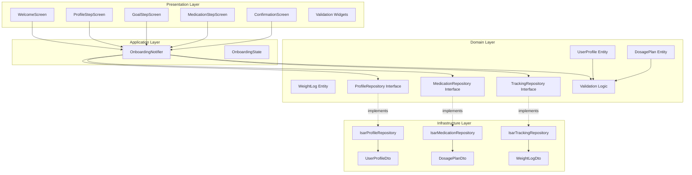

# F000: Onboarding and Goal Setting - TDD Implementation Plan

## 1. Overview

### Modules
- **Domain Layer**: UserProfile, DosagePlan, WeightLog entities, validation logic, repository interfaces
- **Infrastructure Layer**: Isar DTOs, repository implementations
- **Application Layer**: OnboardingNotifier, state management
- **Presentation Layer**: Onboarding screens (4 steps), widgets, form validation

### TDD Scope
- Unit Tests: 70% (Domain entities, validation, repository logic)
- Integration Tests: 20% (Notifier + Repository interaction)
- Widget Tests: 10% (UI validation, form behavior)

---

## 2. Architecture Diagram



---

## 3. Implementation Plan

### 3.1 Domain Layer - UserProfile Entity

**Location**: `lib/features/onboarding/domain/entities/user_profile.dart`

**Responsibility**:
- User profile data model
- Weekly goal calculation
- Validation business rules

**Test Strategy**: Unit Tests (TDD)

**Test Scenarios (Red Phase)**:
```dart
// Arrange: Set up test data
// Act: Create entity or call method
// Assert: Verify expected behavior

1. should create UserProfile with valid data
2. should calculate weeklyLossGoalKg when targetPeriodWeeks provided
3. should set weeklyLossGoalKg to null when targetPeriodWeeks is null
4. should use default weekly goals (7 days)
5. should throw exception when targetWeightKg >= currentWeightKg
6. should throw exception when targetWeightKg < 20kg
7. should throw exception when targetWeightKg > 300kg
8. should throw exception when currentWeightKg < 20kg
9. should throw exception when currentWeightKg > 300kg
10. should warn when weeklyLossGoalKg > 1kg (business rule)
```

**Implementation Order**:
1. Test: Create entity with valid data → Implement: Basic constructor
2. Test: Validation rules → Implement: Validation logic
3. Test: Weekly goal calculation → Implement: Calculation method
4. Refactor: Extract validation to separate methods

**Dependencies**: None (Pure Dart)

---

### 3.2 Domain Layer - DosagePlan Entity

**Location**: `lib/features/onboarding/domain/entities/dosage_plan.dart`

**Responsibility**:
- Dosage plan data model
- Escalation plan validation
- Date validation

**Test Strategy**: Unit Tests (TDD)

**Test Scenarios (Red Phase)**:
```dart
1. should create DosagePlan with valid data
2. should create DosagePlan without escalation plan
3. should validate escalation plan is increasing
4. should throw exception when medicationName is empty
5. should throw exception when startDate is more than 7 days in past
6. should throw exception when cycleDays <= 0
7. should throw exception when initialDoseMg <= 0
8. should throw exception when escalation doses are decreasing
9. should throw exception when escalation weeks are not sequential
10. should allow startDate within 7 days past
```

**Implementation Order**:
1. Test: Create entity with valid data → Implement: Basic constructor
2. Test: Medication name validation → Implement: Validation
3. Test: Date validation → Implement: Date check logic
4. Test: Escalation plan validation → Implement: Escalation validation
5. Refactor: Extract validation methods

**Dependencies**: None (Pure Dart)

---

### 3.3 Domain Layer - Validation Logic

**Location**: `lib/features/onboarding/domain/validators/onboarding_validators.dart`

**Responsibility**:
- Centralized validation logic
- Weight range validation
- Name validation
- Dosage validation

**Test Strategy**: Unit Tests (TDD)

**Test Scenarios (Red Phase)**:
```dart
1. validateName should return null for valid name
2. validateName should return error for empty name
3. validateName should return error for whitespace-only name
4. validateWeight should return null for valid weight (20-300kg)
5. validateWeight should return error for weight < 20kg
6. validateWeight should return error for weight > 300kg
7. validateWeight should return error for negative weight
8. validateTargetWeight should return error when >= current weight
9. validateCycleDays should return null for positive integer
10. validateCycleDays should return error for zero or negative
11. validateDoseMg should return null for positive dose
12. validateDoseMg should return error for zero or negative dose
13. isWeeklyGoalExcessive should return true for > 1kg/week
14. isWeeklyGoalExcessive should return false for <= 1kg/week
```

**Implementation Order**:
1. Test: Name validation → Implement: Name validator
2. Test: Weight validation → Implement: Weight validator
3. Test: Dosage validation → Implement: Dosage validator
4. Test: Weekly goal check → Implement: Goal checker
5. Refactor: Consolidate error messages

**Dependencies**: None (Pure Dart)

---

### 3.4 Domain Layer - Repository Interfaces

**Location**:
- `lib/features/onboarding/domain/repositories/profile_repository.dart`
- `lib/features/medication/domain/repositories/medication_repository.dart`
- `lib/features/tracking/domain/repositories/tracking_repository.dart`

**Responsibility**: Define data access contracts

**Test Strategy**: Integration Tests (with mock implementations)

**Test Scenarios (Red Phase)**:
```dart
ProfileRepository:
1. should save UserProfile successfully
2. should retrieve UserProfile by userId
3. should update UserProfile successfully
4. should throw exception when save fails

MedicationRepository:
5. should save DosagePlan successfully
6. should generate dose schedules after saving plan
7. should throw exception when save fails

TrackingRepository:
8. should save initial WeightLog successfully
9. should throw exception when save fails
```

**Implementation Order**:
1. Test: Define interface → Implement: Abstract class
2. Test: Mock implementation for tests → Implement: Mock repository
3. Integration test preparation (actual implementation in 3.6)

**Dependencies**: Domain entities

---

### 3.5 Infrastructure Layer - DTOs

**Location**:
- `lib/features/onboarding/infrastructure/dtos/user_profile_dto.dart`
- `lib/features/medication/infrastructure/dtos/dosage_plan_dto.dart`
- `lib/features/tracking/infrastructure/dtos/weight_log_dto.dart`

**Responsibility**:
- Isar schema definitions
- Entity ↔ DTO conversion

**Test Strategy**: Unit Tests

**Test Scenarios (Red Phase)**:
```dart
UserProfileDto:
1. should convert from UserProfile entity
2. should convert to UserProfile entity
3. should preserve all fields during conversion
4. should handle null targetPeriodWeeks
5. should handle null weeklyLossGoalKg

DosagePlanDto:
6. should convert from DosagePlan entity
7. should convert to DosagePlan entity
8. should serialize escalation plan to JSON
9. should deserialize escalation plan from JSON
10. should handle null escalation plan

WeightLogDto:
11. should convert from WeightLog entity
12. should convert to WeightLog entity
13. should preserve date and weight values
```

**Implementation Order**:
1. Test: UserProfileDto conversion → Implement: DTO + converters
2. Test: DosagePlanDto conversion → Implement: DTO + converters
3. Test: WeightLogDto conversion → Implement: DTO + converters
4. Refactor: Extract common conversion patterns

**Dependencies**: Domain entities, Isar annotations

---

### 3.6 Infrastructure Layer - Repository Implementations

**Location**:
- `lib/features/onboarding/infrastructure/repositories/isar_profile_repository.dart`
- `lib/features/medication/infrastructure/repositories/isar_medication_repository.dart`
- `lib/features/tracking/infrastructure/repositories/isar_tracking_repository.dart`

**Responsibility**:
- Implement repository interfaces
- Handle Isar transactions
- DTO conversion

**Test Strategy**: Integration Tests (with test Isar instance)

**Test Scenarios (Red Phase)**:
```dart
IsarProfileRepository:
1. should save UserProfile to Isar successfully
2. should retrieve UserProfile from Isar by userId
3. should update existing UserProfile
4. should return null when profile not found
5. should throw RepositoryException when Isar operation fails

IsarMedicationRepository:
6. should save DosagePlan to Isar successfully
7. should mark only one plan as active per user
8. should generate dose schedules after saving plan
9. should throw RepositoryException when save fails

IsarTrackingRepository:
10. should save WeightLog to Isar successfully
11. should prevent duplicate weight log for same date
12. should throw RepositoryException when save fails
```

**Implementation Order**:
1. Test: Profile save/retrieve → Implement: IsarProfileRepository
2. Test: Plan save with active flag → Implement: IsarMedicationRepository
3. Test: Weight log save → Implement: IsarTrackingRepository
4. Test: Transaction rollback on error → Implement: Error handling
5. Refactor: Extract common transaction patterns

**Dependencies**: Repository interfaces, DTOs, Isar

---

### 3.7 Application Layer - OnboardingState

**Location**: `lib/features/onboarding/application/state/onboarding_state.dart`

**Responsibility**:
- Hold form state across steps
- Track current step
- Validation state

**Test Strategy**: Unit Tests

**Test Scenarios (Red Phase)**:
```dart
1. should create initial state with step 0
2. should update name and maintain other fields
3. should update current/target weight and maintain other fields
4. should update target period and maintain other fields
5. should update medication data and maintain other fields
6. should increment step number
7. should decrement step number
8. should not decrement below 0
9. should not increment beyond max step (3)
10. should mark step as complete when valid
```

**Implementation Order**:
1. Test: Create initial state → Implement: State class with copyWith
2. Test: Field updates → Implement: Update methods
3. Test: Step navigation → Implement: Step control
4. Refactor: Immutable state pattern

**Dependencies**: None (Pure Dart)

---

### 3.8 Application Layer - OnboardingNotifier

**Location**: `lib/features/onboarding/application/notifiers/onboarding_notifier.dart`

**Responsibility**:
- Orchestrate onboarding flow
- Validate each step
- Save onboarding data (atomic transaction)
- Trigger dose schedule generation

**Test Strategy**: Integration Tests

**Test Scenarios (Red Phase)**:
```dart
1. should initialize with empty state
2. updateName should update state when valid
3. updateName should not update state when invalid
4. updateWeights should calculate weeklyLossGoalKg when period provided
5. updateWeights should validate weight ranges
6. updateMedicationPlan should validate all fields
7. saveOnboardingData should save all data atomically
8. saveOnboardingData should create initial weight log
9. saveOnboardingData should trigger dose schedule generation
10. saveOnboardingData should rollback on any error
11. saveOnboardingData should set state to AsyncValue.error on failure
12. nextStep should increment step when current step valid
13. nextStep should not increment when current step invalid
14. previousStep should decrement step
```

**Implementation Order**:
1. Test: Initialize state → Implement: Build method
2. Test: Update methods → Implement: Field update logic
3. Test: Validation → Implement: Call validators
4. Test: Save data (happy path) → Implement: Save logic
5. Test: Atomic transaction → Implement: Transaction wrapper
6. Test: Error handling → Implement: Try-catch + rollback
7. Refactor: Extract validation and save methods

**Dependencies**: OnboardingState, Repositories, Validators

---

### 3.9 Presentation Layer - ProfileStepScreen

**Location**: `lib/features/onboarding/presentation/screens/profile_step_screen.dart`

**Responsibility**:
- Render name input form
- Real-time validation feedback
- Navigation to next step

**Test Strategy**: Widget Tests

**Test Scenarios (Red Phase)**:
```dart
1. should display name input field
2. should display progress indicator (step 1/4)
3. should show error when name is empty on submit
4. should enable next button when name is valid
5. should disable next button when name is empty
6. should call onNext when valid name and next clicked
7. should not call onNext when invalid name
8. should show loading indicator while saving
```

**Implementation Order**:
1. Test: Widget structure → Implement: Basic layout
2. Test: Input field validation → Implement: TextFormField with validator
3. Test: Button states → Implement: Button enable/disable logic
4. Test: Navigation → Implement: onNext callback
5. Refactor: Extract validation widgets

**Dependencies**: OnboardingNotifier

**QA Sheet**:
- [ ] Name input field accepts text
- [ ] Error message displays for empty name
- [ ] Next button is disabled when name empty
- [ ] Next button is enabled when name valid
- [ ] Clicking next navigates to goal step
- [ ] Progress indicator shows "1 of 4"

---

### 3.10 Presentation Layer - GoalStepScreen

**Location**: `lib/features/onboarding/presentation/screens/goal_step_screen.dart`

**Responsibility**:
- Render weight and goal inputs
- Calculate weekly goal
- Display warning for excessive goal

**Test Strategy**: Widget Tests

**Test Scenarios (Red Phase)**:
```dart
1. should display current weight input field
2. should display target weight input field
3. should display target period input field (optional)
4. should display progress indicator (step 2/4)
5. should show error when weight < 20kg or > 300kg
6. should show error when target >= current weight
7. should display calculated weekly goal when period provided
8. should show warning when weekly goal > 1kg
9. should enable next button when weights valid
10. should allow next even with warning
11. should call onNext with weight data
```

**Implementation Order**:
1. Test: Widget structure → Implement: Form layout
2. Test: Weight validation → Implement: Weight validators
3. Test: Weekly goal calculation → Implement: Real-time calculation
4. Test: Warning display → Implement: Warning widget
5. Test: Navigation → Implement: onNext with data
6. Refactor: Extract weight input widgets

**Dependencies**: OnboardingNotifier, Validators

**QA Sheet**:
- [ ] Current weight input accepts numeric values
- [ ] Target weight input accepts numeric values
- [ ] Period input accepts numeric values (optional)
- [ ] Error displays for invalid weight ranges
- [ ] Weekly goal displays when period entered
- [ ] Warning displays when goal > 1kg/week
- [ ] Next button enabled when weights valid
- [ ] Clicking next navigates to medication step
- [ ] Progress indicator shows "2 of 4"

---

### 3.11 Presentation Layer - MedicationStepScreen

**Location**: `lib/features/onboarding/presentation/screens/medication_step_screen.dart`

**Responsibility**:
- Render medication plan form
- Date picker for start date
- Escalation plan builder
- Validate plan logic

**Test Strategy**: Widget Tests

**Test Scenarios (Red Phase)**:
```dart
1. should display medication name input
2. should display date picker for start date
3. should display cycle days input
4. should display initial dose input
5. should display escalation plan builder
6. should display progress indicator (step 3/4)
7. should show error when medication name empty
8. should show error when start date > 7 days past
9. should show error when cycle days <= 0
10. should show error when initial dose <= 0
11. should validate escalation plan is increasing
12. should enable next button when all valid
13. should call onNext with medication data
```

**Implementation Order**:
1. Test: Widget structure → Implement: Form layout
2. Test: Medication name validation → Implement: Text field with validator
3. Test: Date validation → Implement: Date picker with validation
4. Test: Numeric validations → Implement: Number input validators
5. Test: Escalation plan → Implement: Dynamic list builder
6. Test: Escalation validation → Implement: Escalation validator
7. Test: Navigation → Implement: onNext with data
8. Refactor: Extract medication input widgets

**Dependencies**: OnboardingNotifier, Validators

**QA Sheet**:
- [ ] Medication name input accepts text
- [ ] Date picker opens and selects date
- [ ] Cycle days input accepts positive integers
- [ ] Initial dose input accepts positive numbers
- [ ] Escalation plan can add/remove steps
- [ ] Error displays for empty medication name
- [ ] Error displays for invalid start date
- [ ] Error displays for invalid cycle/dose
- [ ] Escalation plan validates increasing doses
- [ ] Next button enabled when all valid
- [ ] Clicking next navigates to confirmation
- [ ] Progress indicator shows "3 of 4"

---

### 3.12 Presentation Layer - ConfirmationScreen

**Location**: `lib/features/onboarding/presentation/screens/confirmation_screen.dart`

**Responsibility**:
- Display all entered data
- Allow edit of any step
- Trigger final save
- Navigate to dashboard on success

**Test Strategy**: Widget Tests

**Test Scenarios (Red Phase)**:
```dart
1. should display all entered data summary
2. should display progress indicator (step 4/4)
3. should show loading indicator when saving
4. should navigate to dashboard on save success
5. should show error message on save failure
6. should allow navigation back to edit steps
7. should show retry button on error
```

**Implementation Order**:
1. Test: Widget structure → Implement: Summary layout
2. Test: Display all data → Implement: Data rendering
3. Test: Save button → Implement: onSave callback
4. Test: Loading state → Implement: AsyncValue handling
5. Test: Error handling → Implement: Error display + retry
6. Test: Navigation → Implement: Success navigation
7. Refactor: Extract summary widgets

**Dependencies**: OnboardingNotifier

**QA Sheet**:
- [ ] All entered data displays correctly
- [ ] Name, weights, goal displayed
- [ ] Medication plan displayed
- [ ] Confirm button triggers save
- [ ] Loading indicator shows during save
- [ ] Success navigates to dashboard
- [ ] Error message displays on failure
- [ ] Retry button available on error
- [ ] Back button allows editing steps
- [ ] Progress indicator shows "4 of 4"

---

### 3.13 Presentation Layer - Navigation Flow

**Location**: `lib/features/onboarding/presentation/screens/onboarding_flow.dart`

**Responsibility**:
- Manage step-by-step navigation
- Progress indicator
- Back button handling

**Test Strategy**: Widget Tests

**Test Scenarios (Red Phase)**:
```dart
1. should start at step 0 (profile)
2. should navigate to step 1 (goal) on next
3. should navigate to step 2 (medication) on next
4. should navigate to step 3 (confirmation) on next
5. should go back to previous step on back button
6. should not go back from step 0
7. should show correct screen for each step
8. should display progress indicator with correct step
```

**Implementation Order**:
1. Test: Initial screen → Implement: PageView or IndexedStack
2. Test: Navigation logic → Implement: Step controller
3. Test: Back button → Implement: WillPopScope handling
4. Test: Progress indicator → Implement: Step indicator widget
5. Refactor: Extract common navigation logic

**Dependencies**: All screen widgets, OnboardingNotifier

**QA Sheet**:
- [ ] Starts at profile step
- [ ] Next button navigates forward
- [ ] Back button navigates backward
- [ ] Cannot go back from first step
- [ ] Progress indicator updates correctly
- [ ] All steps accessible in sequence

---

## 4. TDD Workflow

### Start
Test: UserProfile entity creation with valid data

### TDD Cycle
1. **RED**: Write failing test for UserProfile validation
2. **GREEN**: Implement validation logic
3. **REFACTOR**: Extract validation methods
4. **COMMIT**: "feat(onboarding): add UserProfile entity with validation"

5. **RED**: Write failing test for DosagePlan validation
6. **GREEN**: Implement DosagePlan entity
7. **REFACTOR**: Extract common validation patterns
8. **COMMIT**: "feat(onboarding): add DosagePlan entity with escalation validation"

9. **RED**: Write failing test for OnboardingValidators
10. **GREEN**: Implement all validators
11. **REFACTOR**: Consolidate error messages
12. **COMMIT**: "feat(onboarding): add centralized validation logic"

13. **RED**: Write failing test for DTOs conversion
14. **GREEN**: Implement all DTOs with converters
15. **REFACTOR**: Extract conversion helpers
16. **COMMIT**: "feat(onboarding): add Isar DTOs with entity conversion"

17. **RED**: Write failing integration test for repositories
18. **GREEN**: Implement all repositories
19. **REFACTOR**: Extract transaction wrapper
20. **COMMIT**: "feat(onboarding): implement Isar repositories with transactions"

21. **RED**: Write failing test for OnboardingNotifier
22. **GREEN**: Implement notifier with save logic
23. **REFACTOR**: Extract save orchestration method
24. **COMMIT**: "feat(onboarding): add OnboardingNotifier with atomic save"

25. **RED**: Write failing widget test for ProfileStepScreen
26. **GREEN**: Implement profile step UI
27. **REFACTOR**: Extract validation widgets
28. **COMMIT**: "feat(onboarding): add profile step screen"

29. **RED**: Write failing widget test for GoalStepScreen
30. **GREEN**: Implement goal step UI with calculation
31. **REFACTOR**: Extract weight input widgets
32. **COMMIT**: "feat(onboarding): add goal step screen with weekly goal calculation"

33. **RED**: Write failing widget test for MedicationStepScreen
34. **GREEN**: Implement medication step UI
35. **REFACTOR**: Extract medication input widgets
36. **COMMIT**: "feat(onboarding): add medication step screen with escalation plan"

37. **RED**: Write failing widget test for ConfirmationScreen
38. **GREEN**: Implement confirmation UI with save
39. **REFACTOR**: Extract summary widgets
40. **COMMIT**: "feat(onboarding): add confirmation screen with save"

41. **RED**: Write failing test for navigation flow
42. **GREEN**: Implement step navigation
43. **REFACTOR**: Extract progress indicator widget
44. **COMMIT**: "feat(onboarding): implement onboarding flow navigation"

45. **FINAL REFACTOR**: Review all code, optimize, improve naming
46. **COMMIT**: "refactor(onboarding): finalize onboarding feature"

### Completion Criteria
- [ ] All tests pass (Unit + Integration + Widget)
- [ ] Test coverage >= 70% for domain/application
- [ ] All edge cases covered
- [ ] Manual QA sheet completed
- [ ] No lint warnings
- [ ] Repository pattern strictly followed
- [ ] Performance < 1s for all operations
- [ ] All validation rules enforced

---

## 5. Critical Rules

### Layer Dependencies
```
Presentation → Application → Domain ← Infrastructure
```
NO circular dependencies

### Repository Pattern
- Application NEVER accesses Isar directly
- All data access through repository interfaces
- Infrastructure implements repositories

### TDD Discipline
- Write test FIRST
- Run test, see it FAIL
- Write MINIMAL code to pass
- Refactor with tests passing
- Commit after each cycle

### Atomic Transactions
- Onboarding save is ALL-OR-NOTHING
- Transaction rollback on any error
- No partial data in database

### Validation
- Domain layer owns all validation logic
- Presentation calls validators before submit
- Application validates again before save
- Never trust client-side validation alone

---

## 6. Success Metrics

### Code Quality
- Zero circular dependencies
- Repository pattern maintained
- All tests pass
- Coverage >= 70%

### Performance
- Save operation < 1s
- Validation < 100ms
- Screen transitions smooth (60fps)

### User Experience
- Clear error messages
- Real-time validation feedback
- Progress indicator visible
- Cannot proceed with invalid data

### Data Integrity
- Atomic transactions enforced
- No orphaned records
- Initial weight log created
- Dose schedule generated
