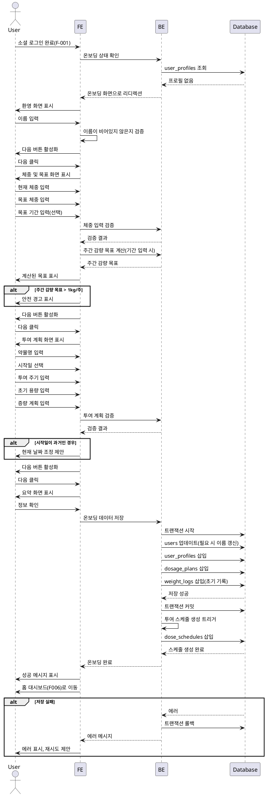

# UF-F000: 온보딩 및 목표 설정 - 상세 유스케이스

> **변경 이력**
> - v2.0 (2024-12): 데모 모드 도입에 따른 온보딩 간소화 (14단계 → 6단계)
> - 교육 콘텐츠를 게스트홈 데모 체험으로 이동
> - 관련 문서: `docs/019-demo-mode/spec.md`

## Primary Actor
소셜 로그인(F-001)을 완료하고 치료 프로필 및 목표를 설정해야 하는 신규 사용자

## Precondition
- 사용자가 소셜 로그인을 성공적으로 완료함
- 사용자가 이용약관 및 개인정보처리방침에 동의함
- 사용자가 앱을 처음 실행함(온보딩 미완료 상태)
- (선택) 사용자가 게스트홈 데모 모드에서 체험 데이터를 생성했을 수 있음

## Trigger
사용자가 최초 소셜 로그인 인증을 완료하면 자동으로 온보딩 화면으로 이동

---

## 온보딩 구조 (6단계)

### 이전 구조 (14단계) → 현재 구조 (6단계)

| 이전 | 현재 | 변경 사유 |
|------|------|----------|
| PART 1: 교육 (1-3) | 삭제 | 게스트홈 체험으로 대체 |
| PART 2: 이해 (4-7) | 삭제 | 게스트홈 체험으로 대체 |
| PART 3: 설정 (8-11) | 단계 2-5 | 유지 (핵심) |
| PART 4: 준비 (12-14) | 단계 6 | 간소화 |

### 현재 온보딩 흐름

```
[1] Welcome Back
      ↓
[2] Basic Profile (이름)
      ↓
[3] Weight Goal (현재/목표 체중)
      ↓
[4] Dosage Plan (약물, 투여 계획)
      ↓
[5] Summary (요약 확인)
      ↓
[6] Ready to Go (시작 준비)
      ↓
    홈 대시보드
```

---

## Main Scenario

### 단계 1: Welcome Back
1. 시스템이 간단한 환영 메시지와 진행 표시기 표시
2. 데모 체험 데이터가 있는 경우:
   - "체험에서 기록한 데이터가 있어요!" 안내
   - 체중 기록 N건, 컨디션 체크 N건 표시
   - "온보딩을 완료하면 이 기록들이 저장돼요" 안내
3. 사용자가 다음 단계로 진행

**UI 예시**:
```
┌─────────────────────────────────────────┐
│                                         │
│         다시 만나서 반가워요! 👋         │
│                                         │
│  체험에서 봤던 것들,                     │
│  이제 진짜 당신의 데이터로 채워볼까요?    │
│                                         │
│  ─────────────────────────────────────  │
│                                         │
│  💾 체험에서 기록한 데이터               │
│                                         │
│     • 체중 기록 3건                      │
│     • 컨디션 체크 2건                    │
│                                         │
│  온보딩을 완료하면 이 기록들이            │
│  당신의 계정에 저장돼요.                 │
│                                         │
│  ─────────────────────────────────────  │
│                                         │
│         [시작하기]                       │
│                                         │
└─────────────────────────────────────────┘
```

### 단계 2: 기본 프로필 설정
1. 시스템이 이름 입력 화면 표시
2. 사용자가 이름 입력 필드에 이름 입력
3. 시스템이 이름이 비어있지 않은지 검증
4. 사용자가 다음 단계로 진행

**카피라이팅**:
- 제목: "어떻게 불러드릴까요?"
- 부제: "앱에서 사용할 이름이에요"

### 단계 3: 체중 및 목표 입력
1. 시스템이 체중 및 목표 입력 화면 표시
2. 사용자가 현재 체중(kg) 입력
3. 사용자가 목표 체중(kg) 입력
4. 사용자가 목표 기간(주 단위) 입력(선택 사항)
5. 시스템이 다음 항목 검증:
   - 현재 체중이 양수이며 현실적인 범위(20-300kg) 내에 있는지
   - 목표 체중이 양수이며 현실적인 범위(20-300kg) 내에 있는지
   - 목표 체중이 현재 체중보다 작은지
   - 목표 기간이 입력된 경우 양수인지
6. 목표 기간이 입력된 경우, 시스템이 주간 감량 목표 자동 계산:
   - 계산식: (현재 체중 - 목표 체중) / 목표 기간
7. 시스템이 계산된 주간 감량 목표 표시
8. 주간 감량 목표가 안전 기준(주당 1kg)을 초과하는 경우, 시스템이 경고 메시지 표시하되 진행 허용
9. 사용자가 다음 단계로 진행

**카피라이팅**:
- 제목: "목표를 정해볼까요?"
- 부제: "현실적인 목표가 성공 확률을 높여요"

### 단계 4: 투여 계획 설정
1. 시스템이 투여 계획 입력 화면 표시
2. 사용자가 약물명 선택 (드롭다운: 위고비, 삭센다, 마운자로, 기타)
3. 사용자가 캘린더 피커를 통해 시작일 선택
4. 사용자가 초기 용량(mg) 입력
5. 시스템이 선택된 약물에 따른 표준 증량 계획 자동 제안
6. 시스템이 다음 항목 검증:
   - 약물명이 선택되었는지
   - 시작일이 현재 또는 과거 7일 이내인지
   - 초기 용량이 양수인지
7. 사용자가 다음 단계로 진행

**카피라이팅**:
- 제목: "투여 계획을 알려주세요"
- 부제: "스케줄 관리와 알림을 설정해드릴게요"

### 단계 5: 요약 확인
1. 시스템이 입력된 정보 요약 표시:
   - 이름
   - 현재 체중 및 목표 체중
   - 주간 감량 목표(해당하는 경우)
   - 투여 계획 세부 정보
2. 데모 체험 데이터가 있는 경우 이관 안내
3. 사용자가 정보를 검토하고 확인
4. 시스템이 Repository 패턴을 통해 모든 데이터 저장:
   - 사용자 프로필(이름, 생성일시)
   - 사용자 목표(목표 체중, 목표 기간, 주간 감량 목표)
   - 투여 계획(약물명, 시작일, 주기, 초기 용량, 증량 계획)
   - 현재 체중과 오늘 날짜로 초기 체중 기록 생성
   - (있을 경우) 데모 체험 데이터 이관
5. 시스템이 투여 스케줄 생성 트리거(F001 연동)
6. 사용자가 다음 단계로 진행

**카피라이팅**:
- 제목: "이대로 시작할까요?"
- 부제: "언제든 설정에서 수정할 수 있어요"

### 단계 6: Ready to Go (시작 준비)
1. 시스템이 시작 준비 화면 표시
2. 주요 안내 표시:
   - 다음 투여 예정일
   - 주사 가이드 링크 (외부 또는 앱 내 가이드)
   - 앱 사용 핵심 팁 3가지
3. 사용자가 "시작하기" 탭
4. 시스템이 홈 대시보드(F006)로 이동

**UI 예시**:
```
┌─────────────────────────────────────────┐
│                                         │
│         준비 완료! 🎉                    │
│                                         │
│  첫 번째 투여 예정일                      │
│  12월 9일 (월) · 0.25mg                  │
│                                         │
│  ─────────────────────────────────────  │
│                                         │
│  💉 주사 방법이 궁금하다면                │
│     [주사 가이드 보기 →]                  │
│                                         │
│  ─────────────────────────────────────  │
│                                         │
│  💡 앱 사용 팁                           │
│                                         │
│  1. 투여일에 알림이 와요                  │
│  2. 매일 컨디션을 체크하면 패턴을 알 수 있어요 │
│  3. 불편할 땐 대처법을 바로 알려드려요     │
│                                         │
│  ─────────────────────────────────────  │
│                                         │
│  💚 여기까지 온 당신, 이미 시작했어요!     │
│                                         │
│         [시작하기]                       │
│                                         │
└─────────────────────────────────────────┘
```

---

## Edge Cases

### 입력 오류
- **이름이 비어있는 경우**: 에러 메시지 표시, 진행 차단
- **목표 체중이 현재 체중보다 큰 경우**: 에러 메시지 표시, 진행 차단
- **비현실적인 체중 값(<20kg 또는 >300kg)**: 확인 다이얼로그 표시
- **과도한 주간 감량 목표(주당 1kg 초과)**: 경고 메시지 표시, 확인 후 진행 허용

### 날짜 및 기간 문제
- **시작일이 과거인 경우**: 현재 날짜로 조정 제안, 사용자가 재정의 가능
- **목표 기간 미입력**: 주간 감량 목표 계산 건너뛰기, 진행 허용

### 증량 계획 문제
- **용량이 감소하는 경우**: 에러 메시지 표시, 진행 차단
- **중복 시기**: 에러 메시지 표시, 수정 요청
- **증량 계획 미입력**: 초기 용량만으로 진행 허용

### 세션 중단
- **온보딩 중 앱 종료**: 데이터가 저장되지 않음, 다음 실행 시 온보딩 재시작
- **저장 중 네트워크 오류**: 에러 메시지 표시, 재시도 허용

### 데이터 저장
- **저장 작업 실패**: 에러 메시지 표시, 재시도 또는 취소 허용
- **일부 데이터만 저장**: 트랜잭션을 구현하여 전체 저장 또는 저장 없음을 보장

### 데모 데이터 이관
- **데모 데이터 없음**: Welcome Back에서 데이터 안내 숨김, 일반 환영 메시지만 표시
- **데모 데이터 이관 실패**: 경고 표시 후 진행 허용 (핵심 온보딩 데이터 우선)
- **중복 날짜 데이터**: 데모 데이터와 실제 데이터 충돌 시 데모 데이터 우선 (나중에 수정 가능 안내)

## Business Rules

### BR-1: 체중 검증
- 현재 체중과 목표 체중은 20-300kg 범위 내여야 함
- 목표 체중은 현재 체중보다 작아야 함
- 주간 감량 목표가 1kg/주를 초과하는 경우 경고하되 진행 허용

### BR-2: 투여 계획 요구사항
- 약물명은 필수
- 시작일은 과거 7일 이내여야 함
- 투여 주기는 양의 정수여야 함(GLP-1의 경우 일반적으로 7일)
- 초기 용량은 양수여야 함
- 증량 계획은 점진적 용량 증가를 보여야 함

### BR-3: 데이터 무결성
- 모든 온보딩 데이터는 원자적으로 저장되어야 함(전체 저장 또는 저장 없음)
- 현재 체중으로 초기 체중 기록이 자동 생성됨
- 온보딩 완료 후 투여 스케줄이 자동 생성됨

### BR-4: 목표 계산
- 주간 감량 목표는 목표 기간이 입력된 경우에만 계산됨
- 계산식: (현재 체중 - 목표 체중) / 목표 기간
- 주간 목표는 저장되지만 설정에서 수정 가능

### BR-5: 사용자 경험
- 최초 로그인 후 모든 신규 사용자에게 온보딩 필수
- 온보딩은 한 번만 완료 가능
- 모든 온보딩 데이터는 설정(F000)을 통해 수정 가능
- 진행 표시기가 온보딩 흐름에서 사용자의 위치를 표시

### BR-6: 주간 기록 목표
- 기본 주간 체중 기록 목표: 주당 7회
- 기본 주간 증상 기록 목표: 주당 7회
- 이러한 기본값은 온보딩 중 적용되지만 설정(UF-013)에서 조정 가능

### BR-7: 데모 데이터 이관
- 데모 모드에서 생성된 체중 기록, 컨디션 체크 데이터는 온보딩 완료 시 실제 계정으로 이관
- 이관 시 날짜 정보 유지 (데모 시점 기준)
- 이관된 데이터는 일반 기록과 동일하게 수정/삭제 가능

### BR-8: 카피라이팅 원칙
- 게스트홈의 톤 & 메시지와 일관성 유지
- 사용자 중심 표현 (기능 설명 X → 사용자 혜택 O)
- 공감 → 희망 → 자신감 흐름

---

## 삭제된 교육 콘텐츠 (게스트홈 데모로 이동)

이전 온보딩에서 다음 교육 화면들이 삭제되었습니다:

| 화면 | 내용 | 대체 |
|------|------|------|
| Welcome | 환영 및 공감 | 게스트홈 Welcome 섹션 |
| Not Your Fault | 비만의 과학적 원인 | 게스트홈 체험 중 자연스럽게 전달 |
| Evidence | 과학적 근거 | 게스트홈 Quick Evidence |
| Food Noise | Food Noise 개념 | 데모 체험으로 대체 |
| How It Works | GLP-1 작용 원리 | 데모 체험으로 대체 |
| Journey Roadmap | 12주 여정 | 게스트홈 Journey Timeline |
| Side Effects | 부작용 안내 | 데일리 체크인 체험 (즉각 대처 가이드) |
| Injection Guide | 주사 가이드 | Ready to Go에서 링크 제공 |
| App Features | 앱 기능 소개 | 데모 체험으로 대체 |

---

## Sequence Diagram


