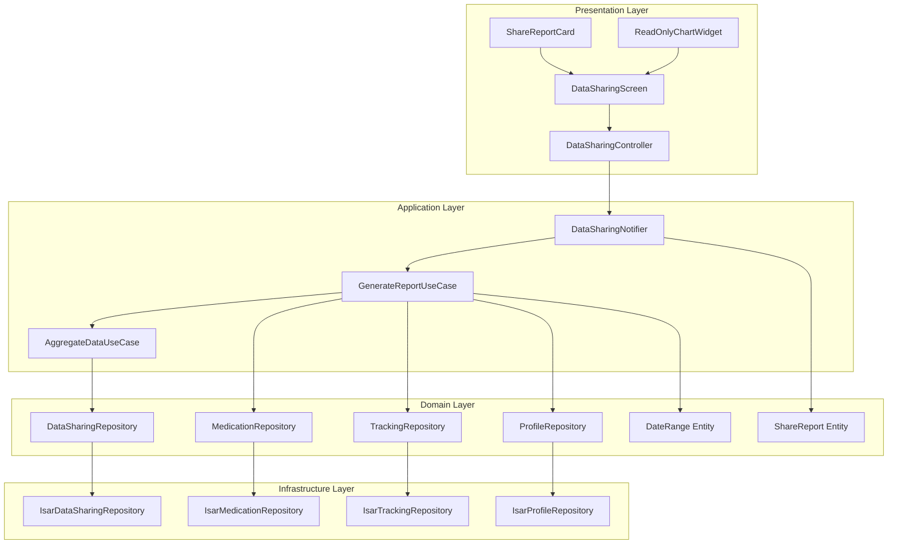

# Data Sharing Mode Implementation Plan (F003)

## 1. Overview

**Feature**: Data Sharing Mode - Read-only medical report sharing
**Location**: `features/data_sharing/`
**TDD Strategy**: Outside-In (Feature-first approach)
**Test Pyramid Target**: Unit 70% / Integration 20% / Acceptance 10%

### Modules Summary
- **Presentation Layer**: Read-only UI, mode toggle controls
- **Application Layer**: State management for sharing mode, data aggregation logic
- **Domain Layer**: Data aggregation entities, repository interfaces
- **Infrastructure Layer**: Data query implementations for multi-source aggregation

---

## 2. Architecture Diagram



---

## 3. Implementation Plan

### Module 1: DateRange Entity (Domain)
**Location**: `features/data_sharing/domain/entities/date_range.dart`
**Responsibility**: Immutable value object for period selection
**Test Strategy**: Unit tests only
**Test Scenarios (Red Phase)**:
- Given valid start/end dates, when creating DateRange, then returns valid instance
- Given start date after end date, when creating DateRange, then throws InvalidDateRangeException
- Given preset period (1M/3M/ALL), when calling factory, then returns correct range
- Given two DateRange instances with same dates, when comparing, then equals returns true

**Implementation Order**:
1. Red: Test DateRange creation with valid dates
2. Green: Implement basic DateRange constructor
3. Red: Test invalid date range (start > end)
4. Green: Add validation logic
5. Red: Test factory methods (oneMonth, threeMonths, all)
6. Green: Implement factory constructors
7. Refactor: Extract validation to private method

**Dependencies**: None

---

### Module 2: ShareReport Entity (Domain)
**Location**: `features/data_sharing/domain/entities/share_report.dart`
**Responsibility**: Aggregated read-only report data structure
**Test Strategy**: Unit tests only
**Test Scenarios (Red Phase)**:
- Given report data, when creating ShareReport, then all fields populated correctly
- Given empty data, when creating ShareReport, then returns report with zero values
- Given report, when calling toMap, then returns serializable map
- Given adherence data, when calculating percentage, then returns correct value (0-100)

**Implementation Order**:
1. Red: Test ShareReport creation with full data
2. Green: Implement ShareReport class with required fields
3. Red: Test adherence calculation logic
4. Green: Implement adherence percentage calculation
5. Red: Test serialization (toMap/fromMap)
6. Green: Implement serialization methods
7. Refactor: Extract calculation logic to computed properties

**Dependencies**: DateRange, DoseRecord, WeightLog, SymptomLog (existing entities)

---

### Module 3: DataSharingRepository Interface (Domain)
**Location**: `features/data_sharing/domain/repositories/data_sharing_repository.dart`
**Responsibility**: Define contract for aggregated data queries
**Test Strategy**: Mock-based unit tests in Application layer
**Test Scenarios (Red Phase)**:
- Interface defines method signature for getShareReport(DateRange)
- Interface defines method signature for getAdherenceRate(DateRange)
- Interface defines method signature for getInjectionSiteHistory(DateRange)

**Implementation Order**:
1. Red: Test interface contract in mock repository
2. Green: Define abstract repository interface
3. Refactor: Add documentation comments

**Dependencies**: ShareReport, DateRange

---

### Module 4: AggregateDataUseCase (Domain)
**Location**: `features/data_sharing/domain/usecases/aggregate_data_usecase.dart`
**Responsibility**: Business logic for multi-source data aggregation
**Test Strategy**: Unit tests with mocked repositories
**Test Scenarios (Red Phase)**:
- Given date range, when executing usecase, then calls all repository methods
- Given medication repo returns empty, when aggregating, then adherence is 0%
- Given weight logs exist, when aggregating, then weight change calculated correctly
- Given symptom logs exist, when aggregating, then severity trends extracted
- Given missing data sources, when aggregating, then partial report returned without error

**Implementation Order**:
1. Red: Test usecase calls medication repository
2. Green: Inject medication repository and call getDoseRecords
3. Red: Test usecase calls tracking repository
4. Green: Inject tracking repository and call getWeightLogs/getSymptomLogs
5. Red: Test adherence calculation logic
6. Green: Implement adherence rate calculation
7. Red: Test weight change calculation
8. Green: Implement weight trend analysis
9. Red: Test symptom pattern extraction
10. Green: Implement symptom frequency analysis
11. Refactor: Extract calculations to private methods

**Dependencies**: DataSharingRepository, MedicationRepository, TrackingRepository

---

### Module 5: IsarDataSharingRepository (Infrastructure)
**Location**: `features/data_sharing/infrastructure/repositories/isar_data_sharing_repository.dart`
**Responsibility**: Implement data aggregation queries for Isar
**Test Strategy**: Integration tests with Isar test database
**Test Scenarios (Red Phase)**:
- Given Isar DB with dose records, when querying by date range, then returns filtered records
- Given multiple data sources, when generating report, then aggregates correctly
- Given date range with no data, when querying, then returns empty report
- Given concurrent queries, when executing, then completes within 1 second

**Implementation Order**:
1. Red: Test getShareReport returns data within date range
2. Green: Implement Isar query with date filtering
3. Red: Test adherence calculation uses scheduled vs actual doses
4. Green: Implement adherence query joining schedules and records
5. Red: Test injection site history aggregation
6. Green: Implement groupBy query for site history
7. Red: Test performance (1 second constraint)
8. Green: Add query optimization (indexes, lazy loading)
9. Refactor: Extract query builders to private methods

**Dependencies**: Isar, DoseRecordDto, WeightLogDto, SymptomLogDto

---

### Module 6: DataSharingNotifier (Application)
**Location**: `features/data_sharing/application/notifiers/data_sharing_notifier.dart`
**Responsibility**: Manage sharing mode state and report data
**Test Strategy**: Unit tests with mocked repositories and usecases
**Test Scenarios (Red Phase)**:
- Given initial state, when building, then isActive is false
- Given enterSharingMode called, when state changes, then isActive is true
- Given period selected, when generating report, then calls usecase with correct range
- Given report generated, when exitSharingMode, then clears report and sets isActive false
- Given loading state, when report generation fails, then state is AsyncError

**Implementation Order**:
1. Red: Test initial state is inactive
2. Green: Implement build method returning DataSharingState(isActive: false)
3. Red: Test enterSharingMode toggles isActive
4. Green: Implement enterSharingMode method
5. Red: Test report generation calls usecase
6. Green: Inject usecase and call in enterSharingMode
7. Red: Test exitSharingMode clears state
8. Green: Implement exitSharingMode method
9. Red: Test error handling on failed generation
10. Green: Add AsyncValue.guard wrapper
11. Refactor: Extract state transitions to private methods

**Dependencies**: AggregateDataUseCase, DataSharingRepository

---

### Module 7: DataSharingScreen (Presentation)
**Location**: `features/data_sharing/presentation/screens/data_sharing_screen.dart`
**Responsibility**: Render read-only report UI
**Test Strategy**: Widget tests + Manual QA
**Test Scenarios (Red Phase)**:
- Given screen loaded, when rendering, then shows period selector
- Given report data, when rendering, then displays all charts
- Given isActive true, when rendering, then hides edit buttons
- Given exit button tapped, when handling, then calls notifier.exitSharingMode
- Given chart tapped, when handling, then shows detail popup (read-only)

**Implementation Order**:
1. Red: Test screen renders period selector
2. Green: Build basic screen scaffold with DropdownButton
3. Red: Test screen shows loading indicator when AsyncLoading
4. Green: Add Consumer for notifier state and loading widget
5. Red: Test screen displays charts when AsyncData
6. Green: Build chart widgets (weight trend, symptom heatmap, adherence gauge)
7. Red: Test edit buttons are hidden
8. Green: Remove/hide FloatingActionButton and edit icons
9. Red: Test exit button calls notifier method
10. Green: Wire up exit button onPressed
11. Refactor: Extract chart widgets to separate files

**Dependencies**: DataSharingNotifier, ChartWidgets

**QA Sheet**:
- [ ] Period selector shows 1M/3M/ALL options
- [ ] All charts render without layout overflow
- [ ] No edit buttons visible in sharing mode
- [ ] Exit button returns to home screen
- [ ] Charts are tappable for detail view
- [ ] Detail popup shows read-only data
- [ ] Back button shows confirmation dialog
- [ ] Data loads within 2 seconds
- [ ] Screen orientation locks to portrait (optional)

---

### Module 8: ShareReportCard Widget (Presentation)
**Location**: `features/data_sharing/presentation/widgets/share_report_card.dart`
**Responsibility**: Reusable card component for report sections
**Test Strategy**: Widget tests only
**Test Scenarios (Red Phase)**:
- Given title and data, when rendering card, then displays correctly
- Given large dataset, when rendering, then handles overflow gracefully
- Given null data, when rendering, then shows placeholder message

**Implementation Order**:
1. Red: Test card renders title and content
2. Green: Build Card widget with Text and child
3. Red: Test card handles overflow
4. Green: Add SingleChildScrollView wrapper
5. Red: Test card shows placeholder for null data
6. Green: Add conditional rendering for empty state
7. Refactor: Extract styling to theme

**Dependencies**: None

---

### Module 9: ReadOnlyChartWidget (Presentation)
**Location**: `features/data_sharing/presentation/widgets/read_only_chart_widget.dart`
**Responsibility**: Non-interactive chart wrapper
**Test Strategy**: Widget tests + Visual regression
**Test Scenarios (Red Phase)**:
- Given chart data, when rendering, then displays chart
- Given touch input, when user taps, then no edit actions triggered
- Given long press, when user holds, then no context menu shown

**Implementation Order**:
1. Red: Test chart renders with data
2. Green: Wrap fl_chart with AbsorbPointer
3. Red: Test touch events are blocked
4. Green: Verify AbsorbPointer prevents gestures
5. Refactor: Extract chart config to constants

**Dependencies**: fl_chart package

---

### Module 10: DataSharingController (Presentation)
**Location**: `features/data_sharing/presentation/controllers/data_sharing_controller.dart`
**Responsibility**: Handle UI events and navigation
**Test Strategy**: Unit tests for controller logic
**Test Scenarios (Red Phase)**:
- Given period changed, when onPeriodSelected, then calls notifier.enterSharingMode(range)
- Given exit requested, when onExit, then shows confirmation dialog
- Given confirmation accepted, when confirmed, then calls notifier.exitSharingMode and pops screen
- Given back button pressed, when onWillPop, then shows confirmation dialog

**Implementation Order**:
1. Red: Test onPeriodSelected calls notifier
2. Green: Implement onPeriodSelected method
3. Red: Test onExit shows dialog
4. Green: Add showDialog call in onExit
5. Red: Test confirmed exit pops screen
6. Green: Wire up Navigator.pop in dialog callback
7. Refactor: Extract dialog to separate method

**Dependencies**: DataSharingNotifier

---

## 4. TDD Workflow

### Phase 1: Domain Layer (Inside-Out)
**Start**: DateRange entity test
**Order**:
1. DateRange entity (Red → Green → Refactor)
2. ShareReport entity (Red → Green → Refactor)
3. DataSharingRepository interface (Red → Green → Refactor)
4. AggregateDataUseCase (Red → Green → Refactor)
**Commit Point**: "feat(domain): add data sharing domain entities and usecases"

### Phase 2: Infrastructure Layer
**Start**: IsarDataSharingRepository test
**Order**:
1. Setup Isar test database
2. IsarDataSharingRepository (Red → Green → Refactor)
3. Integration test for data aggregation performance
**Commit Point**: "feat(infra): implement data sharing repository with Isar"

### Phase 3: Application Layer
**Start**: DataSharingNotifier test
**Order**:
1. DataSharingNotifier (Red → Green → Refactor)
2. Provider setup and DI wiring
**Commit Point**: "feat(app): add data sharing state management"

### Phase 4: Presentation Layer (Outside-In)
**Start**: DataSharingScreen acceptance test
**Order**:
1. ShareReportCard widget (Red → Green → Refactor)
2. ReadOnlyChartWidget (Red → Green → Refactor)
3. DataSharingController (Red → Green → Refactor)
4. DataSharingScreen integration (Red → Green → Refactor)
**Commit Point**: "feat(ui): implement data sharing screen with read-only mode"

### Phase 5: End-to-End Integration
**Start**: Full feature acceptance test
**Order**:
1. Navigation integration test
2. Performance test (2 second data load)
3. Manual QA execution
**Commit Point**: "test(e2e): add data sharing feature acceptance tests"

### Phase 6: Refactoring
**Focus**: Code quality and maintainability
**Tasks**:
1. Extract magic numbers to constants
2. Improve error messages
3. Add logging for debugging
4. Optimize query performance if needed
**Commit Point**: "refactor(data-sharing): improve code quality and performance"

### Completion Criteria
- [ ] All unit tests pass (70% coverage target)
- [ ] All integration tests pass (20% coverage target)
- [ ] All widget tests pass
- [ ] Manual QA sheet 100% complete
- [ ] Performance constraint met (data load < 2s)
- [ ] No violations of layer dependencies
- [ ] Repository pattern maintained
- [ ] Code review approved

---

## 5. Test Files Structure

```
test/
├── features/
│   └── data_sharing/
│       ├── domain/
│       │   ├── entities/
│       │   │   ├── date_range_test.dart
│       │   │   └── share_report_test.dart
│       │   └── usecases/
│       │       └── aggregate_data_usecase_test.dart
│       ├── infrastructure/
│       │   └── repositories/
│       │       └── isar_data_sharing_repository_test.dart
│       ├── application/
│       │   └── notifiers/
│       │       └── data_sharing_notifier_test.dart
│       └── presentation/
│           ├── screens/
│           │   └── data_sharing_screen_test.dart
│           ├── widgets/
│           │   ├── share_report_card_test.dart
│           │   └── read_only_chart_widget_test.dart
│           └── controllers/
│               └── data_sharing_controller_test.dart
└── integration_test/
    └── data_sharing_feature_test.dart
```

---

## 6. Key TDD Principles Applied

### FIRST Principles
- **Fast**: Unit tests < 10ms, Integration tests < 100ms
- **Independent**: Each test sets up own test data
- **Repeatable**: No external dependencies (time, network)
- **Self-validating**: Assert expectations clearly
- **Timely**: Tests written before implementation

### AAA Pattern Example
```dart
test('should return report with adherence 100% when all doses completed', () {
  // Arrange
  final dateRange = DateRange.oneMonth();
  final mockRepo = MockDataSharingRepository();
  final usecase = AggregateDataUseCase(mockRepo);
  when(mockRepo.getDoseRecords(dateRange)).thenReturn([/* all completed */]);

  // Act
  final report = await usecase.execute(dateRange);

  // Assert
  expect(report.adherenceRate, 100.0);
});
```

### Red → Green → Refactor Cycle
- **Red**: Write minimal failing test
- **Green**: Write simplest code to pass (hardcode OK initially)
- **Refactor**: Remove duplication, improve naming

### Test Pyramid Balance
- **Unit**: 70% (Domain entities, usecases, notifier logic)
- **Integration**: 20% (Repository with Isar, notifier with repos)
- **Acceptance**: 10% (Full screen navigation, QA sheet)

---

## 7. Performance Constraints

### BR-PERF-001: Data Load Time
- **Requirement**: Report generation < 2 seconds
- **Test**: Integration test with 1000 records
- **Implementation**: Isar indexes on date fields, lazy loading charts

### BR-PERF-002: UI Responsiveness
- **Requirement**: Chart render < 500ms
- **Test**: Widget test with flamechart profiling
- **Implementation**: Async chart building, placeholder during load

---

## 8. Dependencies

### External Packages
- `fl_chart`: Chart rendering (read-only mode)
- `isar`: Local database queries
- `riverpod`: State management

### Internal Features
- **F001 (Medication)**: DoseRecord, DoseSchedule entities
- **F002 (Tracking)**: WeightLog, SymptomLog entities
- **F000 (Profile)**: UserProfile entity
- **Core**: DateUtils, Formatters

---

## 9. Edge Cases Handling

### EC-001: Empty Data Period
- **Test**: Given date range with no records, then show "No data available" message
- **Implementation**: ShareReport factory with zero values

### EC-002: Partial Data
- **Test**: Given only weight logs (no symptoms), then show weight chart only
- **Implementation**: Conditional rendering in DataSharingScreen

### EC-003: Large Dataset (Phase 1)
- **Test**: Given 10,000 records, then pagination loads 100 at a time
- **Implementation**: Lazy query with limit/offset in repository

### EC-004: Concurrent Access
- **Test**: Given sharing mode active, then home screen actions disabled
- **Implementation**: Global flag in app state, dialog on navigation attempt

---

## 10. Migration Path (Phase 0 → Phase 1)

### Phase 0 (Current)
```dart
@riverpod
DataSharingRepository dataSharingRepository(ref) {
  return IsarDataSharingRepository(ref.watch(isarProvider));
}
```

### Phase 1 (Future)
```dart
@riverpod
DataSharingRepository dataSharingRepository(ref) {
  return SupabaseDataSharingRepository(ref.watch(supabaseProvider));
}
```

**Impact**: Infrastructure Layer only
**Zero changes**: Domain, Application, Presentation

---

## Notes for AI Agent

### Start with
1. Create test file for DateRange entity
2. Write first Red test for valid date range creation
3. Run test, see it fail
4. Implement minimal DateRange class
5. Run test, see it pass
6. Commit with message: "test: add DateRange entity valid creation test"

### Pattern to follow
- Each module = One TDD cycle (Red → Green → Refactor)
- Each test = One assertion (specific, not generic)
- Each commit = One atomic change (test + implementation)

### Avoid
- Writing multiple tests before implementation
- Skipping Refactor phase
- Testing implementation details (test behavior)
- Large commits mixing multiple modules
