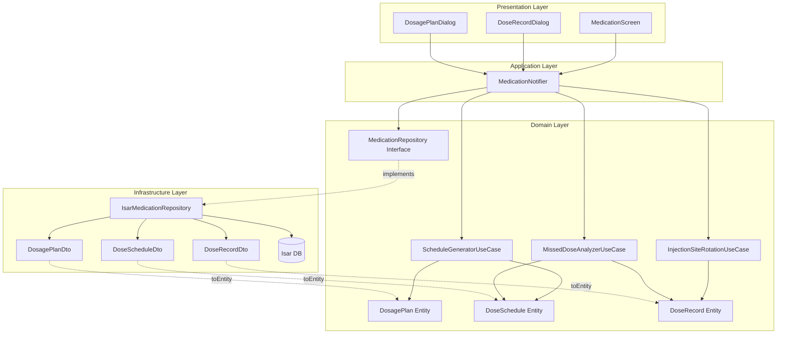

# Medication Schedule Management Implementation Plan

## 1. 개요

투여 스케줄 자동 생성 및 관리 기능의 TDD 기반 모듈화 설계

### 모듈 목록
- **DosagePlan Entity**: 투여 계획 비즈니스 모델
- **DoseSchedule Entity**: 개별 투여 스케줄 비즈니스 모델
- **DoseRecord Entity**: 투여 완료 기록 비즈니스 모델
- **ScheduleGeneratorUseCase**: 스케줄 자동 생성 로직
- **InjectionSiteRotationUseCase**: 주사 부위 순환 검증 로직
- **MissedDoseAnalyzerUseCase**: 누락 용량 분석 로직
- **MedicationRepository Interface**: 데이터 접근 추상화
- **IsarMedicationRepository**: Isar 기반 저장소 구현
- **MedicationNotifier**: 상태 관리 및 UseCase 조율
- **MedicationScreen**: 스케줄 조회 및 투여 기록 UI
- **DoseRecordDialog**: 투여 완료 기록 입력 UI

### TDD 적용 범위
- **Domain Layer**: 100% (모든 Entity, UseCase)
- **Infrastructure Layer**: 80% (Repository 구현체, DTO)
- **Application Layer**: 60% (Notifier 핵심 로직)
- **Presentation Layer**: QA Sheet (수동 테스트)

---

## 2. Architecture Diagram



---

## 3. Implementation Plan

### 3.1. DosagePlan Entity

**Location**: `lib/features/tracking/domain/entities/dosage_plan.dart`

**Responsibility**: 투여 계획 비즈니스 규칙 및 데이터 캡슐화

**Test Strategy**: Unit Test

**Test Scenarios**:
```dart
// Red Phase Tests
test('should create valid dosage plan with required fields')
test('should throw exception when start date is in future')
test('should throw exception when cycle days is less than 1')
test('should throw exception when initial dose is negative')
test('should validate escalation plan is monotonically increasing')
test('should throw exception when escalation plan has decreasing doses')
test('should calculate current dose based on elapsed weeks')
test('should return initial dose when no escalation plan exists')
test('should return correct dose during escalation period')
test('should return max dose after escalation completes')
test('should detect if plan is active')
test('should copy plan with updated fields')
```

**Implementation Order**:
1. 기본 생성자 및 필수 필드 검증
2. 증량 계획 검증 로직 (단조 증가)
3. 현재 용량 계산 메서드
4. copyWith 메서드

**Dependencies**:
- `EscalationStep` value object

**Edge Cases**:
- 시작일이 미래인 경우
- 증량 계획이 역순인 경우
- 주기가 0 이하인 경우
- 음수 용량

---

### 3.2. DoseSchedule Entity

**Location**: `lib/features/tracking/domain/entities/dose_schedule.dart`

**Responsibility**: 개별 스케줄 항목 표현

**Test Strategy**: Unit Test

**Test Scenarios**:
```dart
// Red Phase Tests
test('should create dose schedule with valid data')
test('should compare schedules by date')
test('should detect if schedule is overdue')
test('should detect if schedule is today')
test('should detect if schedule is upcoming')
test('should calculate days until scheduled date')
test('should copy schedule with updated fields')
```

**Implementation Order**:
1. 기본 생성자 및 필드
2. 날짜 비교 메서드 (Comparable 구현)
3. 상태 검증 메서드 (overdue, today, upcoming)
4. copyWith 메서드

**Dependencies**: 없음

---

### 3.3. DoseRecord Entity

**Location**: `lib/features/tracking/domain/entities/dose_record.dart`

**Responsibility**: 투여 완료 기록 및 검증

**Test Strategy**: Unit Test

**Test Scenarios**:
```dart
// Red Phase Tests
test('should create dose record with required fields')
test('should throw exception when administered date is in future')
test('should throw exception when actual dose is negative')
test('should validate injection site is valid')
test('should throw exception for invalid injection site')
test('should detect if record is completed')
test('should calculate days since administration')
test('should copy record with updated fields')
```

**Implementation Order**:
1. 기본 생성자 및 필수 필드 검증
2. 주사 부위 enum 정의 (abdomen, thigh, arm)
3. 날짜 검증 (미래 날짜 불가)
4. copyWith 메서드

**Dependencies**:
- `InjectionSite` enum

**Edge Cases**:
- 투여일이 미래인 경우
- 잘못된 주사 부위 문자열
- 음수 용량

---

### 3.4. ScheduleGeneratorUseCase

**Location**: `lib/features/tracking/domain/usecases/schedule_generator_usecase.dart`

**Responsibility**: 투여 계획 기반 전체 스케줄 자동 생성

**Test Strategy**: Unit Test

**Test Scenarios**:
```dart
// Red Phase Tests
test('should generate schedule for simple plan without escalation')
  // Arrange: plan with 7-day cycle, 0.25mg, no escalation
  // Act: generateSchedules(plan, endDate)
  // Assert: schedules every 7 days with 0.25mg

test('should generate schedule with escalation plan')
  // Arrange: plan with escalation [4 weeks: 0.5mg, 8 weeks: 1.0mg]
  // Act: generateSchedules(plan, 12 weeks)
  // Assert:
  //   - Weeks 1-4: 0.25mg
  //   - Weeks 5-8: 0.5mg
  //   - Weeks 9-12: 1.0mg

test('should complete generation within 1 second for 6 months')
  // Arrange: plan with complex escalation
  // Act: time = measureTime { generateSchedules(plan, 6 months) }
  // Assert: time < 1000ms

test('should recalculate schedules from specific date')
  // Arrange: existing schedules, plan changed at week 5
  // Act: recalculateFrom(plan, changeDate, endDate)
  // Assert: schedules before changeDate unchanged, after recalculated

test('should handle edge case when change date matches schedule date')
test('should generate empty list when end date before start date')
test('should apply notification time to all schedules')
```

**Implementation Order**:
1. 단순 반복 스케줄 생성 (증량 없음)
2. 증량 계획 적용 로직
3. 재계산 로직 (변경 시점 이후만)
4. 성능 최적화 (1초 이내)

**Dependencies**:
- `DosagePlan`
- `DoseSchedule`

**Performance Requirement**: 6개월 스케줄 생성 < 1초

---

### 3.5. InjectionSiteRotationUseCase

**Location**: `lib/features/tracking/domain/usecases/injection_site_rotation_usecase.dart`

**Responsibility**: 주사 부위 순환 규칙 검증 및 경고

**Test Strategy**: Unit Test

**Test Scenarios**:
```dart
// Red Phase Tests
test('should return no warning when no recent records')
  // Arrange: newSite = abdomen, recentRecords = []
  // Act: result = checkRotation(newSite, recentRecords)
  // Assert: result.needsWarning == false

test('should return warning when same site used within 7 days')
  // Arrange: newSite = abdomen, recentRecords = [abdomen 3 days ago]
  // Act: result = checkRotation(newSite, recentRecords)
  // Assert:
  //   - result.needsWarning == true
  //   - result.message contains "3일"

test('should return no warning when same site used 8 days ago')
  // Arrange: newSite = abdomen, recentRecords = [abdomen 8 days ago]
  // Act: result = checkRotation(newSite, recentRecords)
  // Assert: result.needsWarning == false

test('should return no warning when different site used recently')
  // Arrange: newSite = thigh, recentRecords = [abdomen 2 days ago]
  // Act: result = checkRotation(newSite, recentRecords)
  // Assert: result.needsWarning == false

test('should handle multiple recent records of same site')
  // Arrange: newSite = arm, recentRecords = [arm 2d ago, arm 5d ago]
  // Act: result = checkRotation(newSite, recentRecords)
  // Assert: result.message mentions most recent (2d ago)

test('should visualize site usage for last 30 days')
  // Arrange: records with various sites over 30 days
  // Act: siteHistory = getSiteHistory(allRecords)
  // Assert: siteHistory grouped by site, sorted by date
```

**Implementation Order**:
1. 기본 7일 간격 검증
2. 경고 메시지 생성 로직
3. 부위별 사용 이력 시각화 데이터 생성

**Dependencies**:
- `DoseRecord`
- `InjectionSite`

**Business Rules**:
- 같은 부위 최소 7일 간격 권장
- 경고 표시하되 진행 허용
- 최근 30일 이력 시각화

---

### 3.6. MissedDoseAnalyzerUseCase

**Location**: `lib/features/tracking/domain/usecases/missed_dose_analyzer_usecase.dart`

**Responsibility**: 누락 용량 분석 및 안내 생성

**Test Strategy**: Unit Test

**Test Scenarios**:
```dart
// Red Phase Tests
test('should return no missed doses when all completed')
  // Arrange: schedules all have matching records
  // Act: result = analyzeMissedDoses(schedules, records)
  // Assert: result.missedDoses.isEmpty

test('should detect missed dose within 5 days')
  // Arrange: schedule 3 days ago, no record
  // Act: result = analyzeMissedDoses(schedules, records)
  // Assert:
  //   - result.missedDoses.length == 1
  //   - result.guidanceType == GuidanceType.immediateAdministration

test('should detect missed dose over 5 days')
  // Arrange: schedule 7 days ago, no record
  // Act: result = analyzeMissedDoses(schedules, records)
  // Assert:
  //   - result.missedDoses.length == 1
  //   - result.guidanceType == GuidanceType.waitForNext

test('should recommend expert consultation for 7+ days missed')
  // Arrange: schedule 10 days ago, no record
  // Act: result = analyzeMissedDoses(schedules, records)
  // Assert: result.requiresExpertConsultation == true

test('should handle multiple missed doses')
  // Arrange: 3 schedules missed (2d, 6d, 11d ago)
  // Act: result = analyzeMissedDoses(schedules, records)
  // Assert: result.missedDoses.length == 3, sorted by date

test('should calculate days elapsed for each missed dose')
```

**Implementation Order**:
1. 누락 감지 로직 (스케줄-기록 매칭)
2. 일수 계산 및 분류 (5일 기준)
3. 안내 메시지 생성 로직

**Dependencies**:
- `DoseSchedule`
- `DoseRecord`

**Business Rules**:
- 5일 이내: 즉시 투여 안내
- 5일 초과: 다음 예정일 대기
- 7일 이상: 전문가 상담 권장

---

### 3.7. MedicationRepository Interface

**Location**: `lib/features/tracking/domain/repositories/medication_repository.dart`

**Responsibility**: 투여 데이터 접근 추상화

**Test Strategy**: Integration Test (구현체 테스트)

**Test Scenarios**: N/A (인터페이스)

**Implementation Order**:
```dart
abstract class MedicationRepository {
  // DosagePlan
  Future<DosagePlan?> getActiveDosagePlan(String userId);
  Future<void> saveDosagePlan(DosagePlan plan);
  Future<void> updateDosagePlan(DosagePlan plan);

  // DoseSchedule
  Future<List<DoseSchedule>> getDoseSchedules(String planId);
  Future<void> saveDoseSchedules(List<DoseSchedule> schedules);
  Future<void> deleteDoseSchedulesFrom(String planId, DateTime fromDate);

  // DoseRecord
  Future<List<DoseRecord>> getDoseRecords(String planId);
  Future<List<DoseRecord>> getRecentDoseRecords(String planId, int days);
  Future<void> saveDoseRecord(DoseRecord record);
  Future<void> deleteDoseRecord(String recordId);

  // Plan Change History
  Future<void> savePlanChangeHistory(String planId, Map<String, dynamic> oldPlan, Map<String, dynamic> newPlan);

  // Streams (real-time)
  Stream<List<DoseRecord>> watchDoseRecords(String planId);
  Stream<DosagePlan?> watchActiveDosagePlan(String userId);
}
```

**Dependencies**: Domain entities

---

### 3.8. IsarMedicationRepository

**Location**: `lib/features/tracking/infrastructure/repositories/isar_medication_repository.dart`

**Responsibility**: Isar 기반 데이터 저장 및 조회

**Test Strategy**: Integration Test

**Test Scenarios**:
```dart
// Red Phase Tests
test('should save and retrieve dosage plan')
  // Arrange: plan entity
  // Act: await repo.saveDosagePlan(plan)
  //      result = await repo.getActiveDosagePlan(userId)
  // Assert: result == plan

test('should return null when no active plan exists')
test('should update existing dosage plan')
test('should save batch dose schedules efficiently')
  // Arrange: 100 schedules
  // Act: time = measureTime { await repo.saveDoseSchedules(schedules) }
  // Assert: time < 500ms

test('should delete schedules from specific date')
  // Arrange: 20 schedules, delete from date at index 10
  // Act: await repo.deleteDoseSchedulesFrom(planId, date)
  // Assert: only first 10 remain

test('should get recent dose records within N days')
  // Arrange: records from 30 days ago to today
  // Act: recent = await repo.getRecentDoseRecords(planId, 7)
  // Assert: recent.length matches last 7 days only

test('should watch dose records stream updates')
  // Arrange: subscription to stream
  // Act: save new record
  // Assert: stream emits updated list

test('should save plan change history')
test('should convert DTO to Entity correctly')
test('should convert Entity to DTO correctly')
```

**Implementation Order**:
1. DTO 정의 (DosagePlanDto, DoseScheduleDto, DoseRecordDto)
2. 기본 CRUD 구현
3. 배치 저장 최적화
4. Stream 구현
5. toEntity/fromEntity 변환

**Dependencies**:
- `Isar`
- DTO classes
- Domain entities
- `MedicationRepository` interface

**Performance Requirements**:
- 배치 저장 (100개) < 500ms
- 조회 쿼리 < 100ms

---

### 3.9. DTOs

**Location**: `lib/features/tracking/infrastructure/dtos/`

**Files**:
- `dosage_plan_dto.dart`
- `dose_schedule_dto.dart`
- `dose_record_dto.dart`

**Test Strategy**: Unit Test

**Test Scenarios**:
```dart
// DosagePlanDto
test('should convert entity to DTO preserving all fields')
test('should convert DTO to entity preserving all fields')
test('should serialize escalation plan to JSON')
test('should deserialize escalation plan from JSON')

// DoseScheduleDto
test('should convert entity to DTO')
test('should convert DTO to entity')
test('should handle null notification time')

// DoseRecordDto
test('should convert entity to DTO')
test('should convert DTO to entity')
test('should handle optional fields (site, note)')
```

**Implementation Order**:
1. Isar annotations 정의
2. fromEntity 메서드
3. toEntity 메서드
4. JSON 직렬화 (escalation_plan)

---

### 3.10. MedicationNotifier

**Location**: `lib/features/tracking/application/notifiers/medication_notifier.dart`

**Responsibility**: 상태 관리 및 UseCase 조율

**Test Strategy**: Unit Test (mocked repository)

**Test Scenarios**:
```dart
// Red Phase Tests
test('should load medication state on build')
  // Arrange: mock repo returns plan, schedules, records
  // Act: state = await notifier.build()
  // Assert: state contains plan, schedules, records

test('should record dose and update state')
  // Arrange: initial state with schedules
  // Act: await notifier.recordDose(record)
  // Assert:
  //   - repo.saveDoseRecord called
  //   - state updated with new record

test('should check injection site rotation before recording')
  // Arrange: recent record with same site
  // Act: warning = await notifier.checkInjectionSite(newSite)
  // Assert: warning.needsWarning == true

test('should update dosage plan and recalculate schedules')
  // Arrange: existing plan and schedules
  // Act: await notifier.updateDosagePlan(newPlan)
  // Assert:
  //   - ScheduleGeneratorUseCase called
  //   - Old schedules from change date deleted
  //   - New schedules saved
  //   - Change history saved

test('should analyze missed doses')
  // Arrange: schedules with some missed
  // Act: analysis = notifier.getMissedDoseAnalysis()
  // Assert: analysis contains missed doses and guidance

test('should delete dose record and refresh state')
test('should handle errors gracefully')
  // Arrange: repo throws exception
  // Act: await notifier.recordDose(record)
  // Assert: state.hasError == true
```

**Implementation Order**:
1. build 메서드 (초기 로드)
2. recordDose 메서드 (부위 검증 포함)
3. updateDosagePlan 메서드 (재계산 로직)
4. getMissedDoseAnalysis computed property
5. deleteDoseRecord 메서드

**Dependencies**:
- `MedicationRepository`
- `ScheduleGeneratorUseCase`
- `InjectionSiteRotationUseCase`
- `MissedDoseAnalyzerUseCase`

---

### 3.11. MedicationScreen (Presentation)

**Location**: `lib/features/tracking/presentation/screens/medication_screen.dart`

**Responsibility**: 스케줄 조회 및 투여 기록 UI

**Test Strategy**: Manual QA (QA Sheet)

**QA Sheet**:
```markdown
## 스케줄 조회
- [ ] 앱 실행 시 활성 투여 계획의 스케줄이 로드됨
- [ ] 캘린더 뷰에서 투여 예정일에 마커 표시
- [ ] 리스트 뷰에서 날짜순 정렬된 스케줄 표시
- [ ] 각 스케줄에 예정 용량, 완료 상태 표시
- [ ] 다음 투여 예정일이 강조 표시됨
- [ ] 완료된 투여는 체크 표시
- [ ] 누락된 투여는 경고 색상 표시

## 투여 완료 기록
- [ ] 투여 완료 버튼 클릭 시 부위 선택 화면 표시
- [ ] 복부/허벅지/상완 선택 가능
- [ ] 7일 이내 같은 부위 재사용 시 경고 표시
- [ ] 경고 무시하고 진행 가능
- [ ] 메모 입력 가능 (선택)
- [ ] 저장 시 완료 상태 즉시 UI 업데이트
- [ ] 부위별 투여 이력 시각화 확인 가능

## 스케줄 변경
- [ ] 특정 투여일 수정 가능
- [ ] 용량 수정 가능
- [ ] 변경 시 이후 스케줄 자동 재계산 (1초 이내)
- [ ] 재계산 완료 알림 표시
- [ ] 변경 이력 저장됨

## 누락 관리
- [ ] 5일 이내 누락 시 "즉시 투여" 알림 표시
- [ ] 5일 초과 누락 시 "다음 예정일 대기" 안내
- [ ] 7일 이상 누락 시 전문가 상담 권장 표시

## 성능
- [ ] 스케줄 생성 1초 이내
- [ ] 스케줄 재계산 1초 이내
- [ ] UI 반응 즉시 (로딩 없음)
```

**Implementation Order**:
1. 스케줄 리스트 뷰
2. 캘린더 뷰
3. 투여 완료 다이얼로그 연동
4. 누락 안내 UI
5. 부위별 이력 시각화

**Dependencies**:
- `MedicationNotifier`

---

### 3.12. DoseRecordDialog (Presentation)

**Location**: `lib/features/tracking/presentation/widgets/dose_record_dialog.dart`

**Responsibility**: 투여 완료 기록 입력 UI

**Test Strategy**: Manual QA (QA Sheet)

**QA Sheet**:
```markdown
## 부위 선택
- [ ] 복부/허벅지/상완 버튼 표시
- [ ] 선택 시 버튼 강조 표시
- [ ] 경고 메시지 표시 영역 존재
- [ ] 경고 무시 가능

## 메모 입력
- [ ] 선택적 메모 입력 필드
- [ ] 100자 제한
- [ ] 멀티라인 지원

## 저장
- [ ] 부위 미선택 시 저장 버튼 비활성화
- [ ] 저장 중 로딩 인디케이터
- [ ] 성공 시 다이얼로그 닫힘
- [ ] 실패 시 에러 메시지 표시
```

**Dependencies**:
- `MedicationNotifier`

---

## 4. TDD Workflow

### Phase 1: Domain Layer (Week 1)
1. **Day 1-2**: Entities
   - DosagePlan Entity 테스트 작성 → 구현 → 리팩토링
   - DoseSchedule Entity 테스트 작성 → 구현 → 리팩토링
   - DoseRecord Entity 테스트 작성 → 구현 → 리팩토링
   - **Commit**: "feat: add medication domain entities"

2. **Day 3**: ScheduleGeneratorUseCase
   - 단순 반복 테스트 → 구현
   - 증량 계획 테스트 → 구현
   - 성능 테스트 → 최적화
   - **Commit**: "feat: add schedule generator use case"

3. **Day 4**: InjectionSiteRotationUseCase
   - 7일 간격 검증 테스트 → 구현
   - 경고 메시지 테스트 → 구현
   - 이력 시각화 테스트 → 구현
   - **Commit**: "feat: add injection site rotation use case"

4. **Day 5**: MissedDoseAnalyzerUseCase
   - 누락 감지 테스트 → 구현
   - 안내 타입 분류 테스트 → 구현
   - 전문가 상담 조건 테스트 → 구현
   - **Commit**: "feat: add missed dose analyzer use case"

### Phase 2: Infrastructure Layer (Week 2)
1. **Day 1-2**: DTOs
   - DosagePlanDto 테스트 → 구현
   - DoseScheduleDto 테스트 → 구현
   - DoseRecordDto 테스트 → 구현
   - **Commit**: "feat: add medication DTOs"

2. **Day 3-4**: Repository 구현
   - IsarMedicationRepository 기본 CRUD 테스트 → 구현
   - 배치 저장 테스트 → 구현
   - Stream 테스트 → 구현
   - **Commit**: "feat: add Isar medication repository"

3. **Day 5**: Repository 최적화
   - 성능 테스트 통과
   - 인덱스 최적화
   - **Commit**: "perf: optimize medication repository"

### Phase 3: Application Layer (Week 3)
1. **Day 1-3**: MedicationNotifier
   - 초기 로드 테스트 → 구현
   - recordDose 테스트 → 구현
   - updateDosagePlan 테스트 → 구현
   - getMissedDoseAnalysis 테스트 → 구현
   - **Commit**: "feat: add medication notifier"

2. **Day 4-5**: Notifier 리팩토링 및 에러 핸들링
   - 에러 처리 테스트 → 구현
   - 상태 일관성 테스트 → 구현
   - **Commit**: "refactor: improve medication notifier error handling"

### Phase 4: Presentation Layer (Week 4)
1. **Day 1-2**: MedicationScreen
   - 스케줄 리스트 뷰 구현
   - 캘린더 뷰 구현
   - **Commit**: "feat: add medication screen"

2. **Day 3**: DoseRecordDialog
   - 부위 선택 UI 구현
   - 메모 입력 UI 구현
   - **Commit**: "feat: add dose record dialog"

3. **Day 4**: 통합 및 QA
   - 전체 플로우 수동 테스트
   - QA Sheet 체크리스트 검증
   - 버그 수정

4. **Day 5**: 최종 리팩토링 및 문서화
   - 코드 정리
   - 주석 추가
   - **Commit**: "docs: add medication feature documentation"

---

## 5. Commit Strategy

### Commit 포인트
- 각 Entity 완성 시
- 각 UseCase 완성 시
- 각 DTO 완성 시
- Repository 기능 그룹 완성 시 (CRUD, Stream 등)
- Notifier 메서드 완성 시
- 각 UI 컴포넌트 완성 시

### Commit Message 규칙
```
feat: add [component name]
test: add [test description]
refactor: improve [component name]
perf: optimize [performance aspect]
fix: resolve [bug description]
docs: update [documentation]
```

---

## 6. Performance Targets

| 작업 | 목표 | 측정 방법 |
|------|------|-----------|
| 스케줄 생성 (6개월) | < 1초 | Stopwatch |
| 스케줄 재계산 | < 1초 | Stopwatch |
| 배치 저장 (100개) | < 500ms | Stopwatch |
| 단일 조회 | < 100ms | Stopwatch |
| UI 반응 | < 100ms | Manual |

---

## 7. Test Coverage Goals

- **Domain Layer**: 100%
- **Infrastructure Layer**: 80%
- **Application Layer**: 60%
- **Overall**: 70%

---

## 8. Integration Points

### 온보딩 (F000)
- 온보딩 완료 시 `MedicationNotifier.createInitialPlan()` 호출
- 투여 계획 정보 전달

### 대시보드 (F006)
- 다음 투여 예정일 조회: `MedicationNotifier.getNextScheduledDose()`
- 투여 완료율 조회: `MedicationNotifier.getCompletionRate()`

### 알림 (UF-012)
- 투여 예정일 알림 스케줄링: `DoseSchedule.notificationTime` 기반

---

## 9. Risk Mitigation

### 성능 리스크
- **위험**: 대량 스케줄 생성 시 1초 초과
- **완화**: 알고리즘 최적화, 배치 처리, 성능 테스트 조기 작성

### 데이터 일관성 리스크
- **위험**: 스케줄-기록 불일치
- **완화**: 트랜잭션 처리, 재계산 시 검증 로직

### 사용자 경험 리스크
- **위험**: 부위 순환 경고 무시 시 안전성
- **완화**: 경고 메시지 명확화, 진행 허용하되 로그 기록

---

## 10. Definition of Done

각 모듈 완료 조건:
- [ ] 모든 테스트 통과 (coverage 목표 달성)
- [ ] 코드 리뷰 완료
- [ ] 성능 요구사항 충족
- [ ] 문서 업데이트
- [ ] QA Sheet 검증 (Presentation Layer)
- [ ] 컴파일 경고 없음
- [ ] Layer 의존성 규칙 준수
