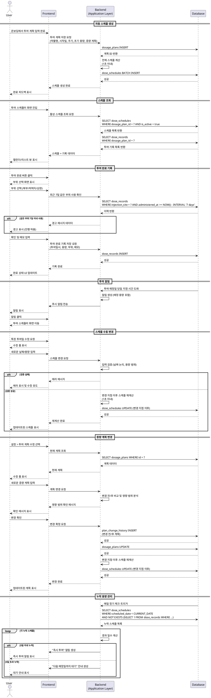

# UF-F001: 투여 스케줄 관리

## Use Case Overview

**Primary Actor**: GLP-1 사용자

**Precondition**:
- 사용자가 로그인 완료
- 온보딩에서 투여 계획 정보 입력 완료 (약물명, 시작일, 주기, 초기 용량, 증량 계획)

**Trigger**:
- 온보딩 완료 시 자동 스케줄 생성
- 사용자가 투여 스케줄러 화면 진입
- 투여 예정일 당일 지정 시간 도래
- 사용자가 투여일/용량 수동 변경
- 사용자가 증량 계획 변경

---

## Main Scenario

### 1. 자동 스케줄 생성
1. 사용자가 온보딩에서 투여 계획 정보 입력 완료
2. 시스템이 입력된 계획을 기반으로 전체 투여 스케줄 자동 생성 (1초 이내)
3. 각 투여일에 예정 용량 매핑
4. 증량 계획에 따라 특정 시점부터 용량 자동 증가
5. 생성된 스케줄을 DB에 저장
6. 사용자에게 스케줄 생성 완료 피드백 제공

### 2. 스케줄 조회
1. 사용자가 투여 스케줄러 화면 진입
2. 시스템이 활성 투여 계획의 스케줄 조회
3. 캘린더 뷰 또는 리스트 뷰로 스케줄 렌더링
4. 각 투여일에 예정 용량, 완료 상태, 주사 부위 표시
5. 다음 투여 예정일 강조 표시

### 3. 투여 완료 기록
1. 사용자가 특정 투여일의 "투여 완료" 버튼 클릭
2. 투여 부위 선택 화면 표시 (복부/허벅지/상완)
3. 시스템이 최근 7일 이내 같은 부위 사용 여부 확인
4. 같은 부위 사용 이력 있으면 경고 메시지 표시하되 진행 허용
5. 사용자가 부위 선택 및 메모 입력 (선택 사항)
6. 투여 완료 기록 저장 (투여일시, 실제 용량, 부위, 메모)
7. 완료 상태 UI 업데이트
8. 부위별 투여 이력 시각화 갱신

### 4. 투여 알림
1. 투여 예정일 당일 지정 시간 도래
2. 시스템이 푸시 알림 생성
3. 알림 메시지에 예정 용량 정보 포함
4. 사용자가 알림 클릭 시 투여 스케줄러 화면으로 이동

### 5. 스케줄 수동 변경
1. 사용자가 특정 투여일 또는 용량 수정 요청
2. 수정 가능 항목 표시 (날짜, 용량)
3. 사용자가 새로운 값 입력
4. 시스템이 입력 검증 (날짜 논리, 용량 범위)
5. 변경 지점 이후 모든 스케줄 재계산 (1초 이내)
6. 재계산된 스케줄 DB에 저장
7. 업데이트된 스케줄 UI에 반영

### 6. 증량 계획 변경
1. 사용자가 설정 메뉴에서 투여 계획 수정 선택
2. 현재 증량 계획 표시
3. 사용자가 새로운 증량 계획 입력
4. 시스템이 변경 전/후 계획 비교
5. 영향 범위 확인 메시지 표시
6. 사용자 확인 시 변경 이력 저장
7. 변경 지점 이후 스케줄 재계산
8. 업데이트된 스케줄 반영

### 7. 누락 용량 관리
1. 시스템이 매일 투여 완료 여부 확인
2. 예정일 경과 시 누락 일수 계산
3. 5일 이내 누락 시 "즉시 투여" 알림 생성
4. 5일 초과 누락 시 "다음 예정일까지 대기" 안내 표시
5. 누락 안내와 함께 전문가 상담 권장 메시지 제공

---

## Edge Cases

### 스케줄 생성 관련
- 증량 계획이 비논리적인 경우 (감량, 역순): 에러 메시지 표시 및 수정 유도
- 시작일이 과거인 경우: 현재 날짜로 자동 조정 제안
- 스케줄 생성 중 앱 종료: 다음 실행 시 자동 재생성

### 투여 기록 관련
- 같은 날 중복 투여 기록 시도: 중복 방지 확인 메시지 표시
- 부위 미선택: 선택 유도하되 진행 허용
- 과거 날짜에 투여 미완료 기록 추가: 누락 관리 로직 재실행
- 투여 완료 후 기록 삭제: 삭제 확인 대화상자 및 스케줄 재계산

### 스케줄 변경 관련
- 투여일 변경으로 증량 시점 앞당겨짐: 안전성 경고 표시하되 진행 허용
- 증량 계획 삭제: 현재 용량 유지 스케줄로 재계산
- 스케줄 재계산 중 앱 종료: 다음 실행 시 자동 재계산
- 이미 진행 중인 증량 계획 변경: 영향 범위 명확히 안내

### 알림 관련
- 앱 알림 권한 거부: 설정 변경 유도 또는 인앱 알림 대체
- 여러 투여 예정일이 같은 날: 한 번만 알림 발송
- 알림 시간이 투여 예정일 이후: 다음날 알림 또는 즉시 알림 선택 제공

### 데이터 동기화
- 네트워크 오류로 저장 실패: 로컬 저장 후 재시도 큐 추가
- 여러 기기 동시 변경: 최신 타임스탬프 우선 (Phase 1)

---

## Business Rules

### BR-001: 스케줄 생성 성능
- 전체 스케줄 생성은 1초 이내 완료 필수
- 스케줄 재계산은 1초 이내 완료 필수

### BR-002: 주사 부위 순환
- 같은 부위는 최소 7일 간격 권장
- 7일 미만 재사용 시 경고 표시하되 진행 허용
- 부위별 투여 이력 최근 30일 시각화

### BR-003: 누락 용량 관리
- 예정일로부터 5일 이내 누락: "즉시 투여" 안내
- 예정일로부터 5일 초과 누락: "다음 예정일까지 대기" 안내
- 7일 이상 누락: 전문가 상담 필수 권장

### BR-004: 증량 계획 논리
- 증량은 단조 증가만 허용 (감량 불가)
- 증량 시점은 시간 순서 유지 필수
- 증량 단계는 최대 용량 범위 내 제한

### BR-005: 투여 기록 무결성
- 각 투여일은 1회만 완료 기록 허용
- 완료 기록 삭제 시 확인 절차 필수
- 투여일시는 미래 날짜 불가

### BR-006: 알림 정책
- 투여 예정일 당일 지정 시간 1회 알림
- 알림 시간 기본값: 오전 9시 (사용자 설정 가능)
- 알림 클릭 시 투여 스케줄러 화면으로 직접 이동

### BR-007: 계획 변경 이력
- 모든 증량 계획 변경은 이력 기록 필수
- 변경 이력은 날짜, 변경 전/후 계획 포함
- 변경 이력은 영구 보관

---

## Sequence Diagram

