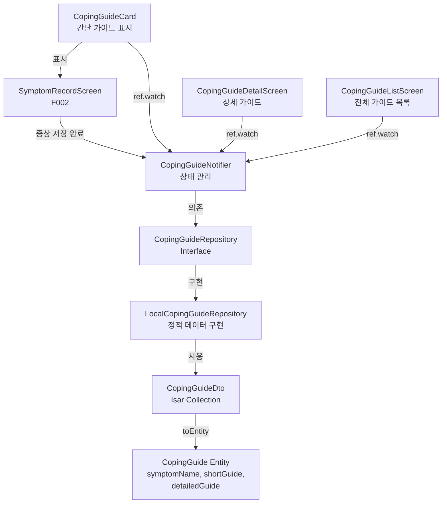

# F004: Coping Guide Implementation Plan

## 1. Overview

F004(대처 가이드)는 증상 기록 후 자동으로 실용적인 대처 팁을 제공하는 기능입니다. F002(증상 기록)와 긴밀하게 연동되며, 사용자의 불안감을 해소하고 일상 관리 능력을 향상시키는 것이 목표입니다.

**TDD 적용 범위**: Domain Layer의 비즈니스 로직, Application Layer의 UseCase, Infrastructure Layer의 Repository 구현에 대해 Unit/Integration 테스트를 적용합니다.

**Modules:**
- `features/tracking/domain/entities/coping_guide.dart` - 대처 가이드 Entity
- `features/tracking/domain/repositories/coping_guide_repository.dart` - Repository Interface
- `features/tracking/infrastructure/repositories/local_coping_guide_repository.dart` - 정적 데이터 Repository 구현
- `features/tracking/infrastructure/dtos/coping_guide_dto.dart` - DTO
- `features/tracking/application/notifiers/coping_guide_notifier.dart` - 상태 관리
- `features/tracking/presentation/widgets/coping_guide_card.dart` - 간단 가이드 카드
- `features/tracking/presentation/screens/coping_guide_detail_screen.dart` - 상세 가이드 화면
- `features/tracking/presentation/screens/coping_guide_list_screen.dart` - 전체 가이드 목록

## 2. Architecture Diagram



## 3. Implementation Plan

### 3.1. CopingGuide Entity (Domain Layer)

**Location**: `features/tracking/domain/entities/coping_guide.dart`

**Responsibility**: 대처 가이드 데이터 모델. 증상명, 간단 가이드, 상세 가이드를 포함하는 불변 Entity.

**Test Strategy**: Unit Test (Outside-In)

**Test Scenarios**:
- **Red Phase**:
  - `test_coping_guide_entity_creation_with_valid_data`: 유효한 데이터로 Entity 생성 가능
  - `test_coping_guide_entity_equality`: 같은 symptomName을 가진 Entity는 동일
  - `test_coping_guide_entity_immutability`: copyWith를 통한 불변성 보장

**Implementation Order**:
1. RED: Entity 생성 테스트 작성 → 실패 확인
2. GREEN: CopingGuide Entity 최소 구현 (symptomName, shortGuide, detailedGuide)
3. REFACTOR: Equatable 적용, copyWith 구현
4. RED: 다음 테스트 (equality, immutability)
5. GREEN: 모든 테스트 통과
6. REFACTOR: 코드 정리

**Dependencies**: 없음 (Pure Dart)

---

### 3.2. CopingGuideRepository Interface (Domain Layer)

**Location**: `features/tracking/domain/repositories/coping_guide_repository.dart`

**Responsibility**: 대처 가이드 데이터 접근 Interface. 증상명으로 가이드 조회.

**Test Strategy**: Unit Test (Repository 구현체에서 테스트)

**Test Scenarios**:
- Interface는 테스트하지 않음 (구현체에서 검증)
- Abstract method 정의만 확인

**Implementation Order**:
1. Interface 정의 (테스트 불필요)
2. Method signature 정의:
   - `Future<CopingGuide?> getCopingGuideBySymptom(String symptomName)`
   - `Future<List<CopingGuide>> getAllCopingGuides()`

**Dependencies**: CopingGuide Entity

---

### 3.3. CopingGuideDto (Infrastructure Layer)

**Location**: `features/tracking/infrastructure/dtos/coping_guide_dto.dart`

**Responsibility**: Isar Collection DTO. 정적 데이터를 DB에 저장하고 Entity로 변환.

**Test Strategy**: Unit Test

**Test Scenarios**:
- **Red Phase**:
  - `test_coping_guide_dto_to_entity_conversion`: DTO → Entity 변환 정확성
  - `test_coping_guide_dto_from_entity_conversion`: Entity → DTO 변환 정확성
  - `test_coping_guide_dto_isar_annotations`: Isar annotation 적용 확인

**Implementation Order**:
1. RED: toEntity 테스트 작성 → 실패
2. GREEN: CopingGuideDto 최소 구현 + toEntity
3. RED: fromEntity 테스트 작성 → 실패
4. GREEN: fromEntity 구현
5. REFACTOR: Isar annotation 적용, 코드 정리

**Dependencies**: CopingGuide Entity, Isar

---

### 3.4. LocalCopingGuideRepository (Infrastructure Layer)

**Location**: `features/tracking/infrastructure/repositories/local_coping_guide_repository.dart`

**Responsibility**: 정적 가이드 데이터를 제공하는 Repository 구현체. 7가지 증상에 대한 가이드를 하드코딩하여 반환.

**Test Strategy**: Unit Test + Integration Test

**Test Scenarios**:
- **Red Phase (Unit)**:
  - `test_get_coping_guide_by_symptom_returns_correct_guide`: 증상명으로 정확한 가이드 반환
  - `test_get_coping_guide_by_symptom_returns_null_for_unknown`: 알 수 없는 증상은 null 반환
  - `test_get_all_coping_guides_returns_all_7_guides`: 전체 가이드 조회 시 7개 반환
  - `test_coping_guide_content_has_short_and_detailed`: 각 가이드는 shortGuide와 detailedGuide 보유
  - `test_coping_guide_short_version_is_concise`: shortGuide는 간결함 (최대 200자)
  - `test_coping_guide_detailed_version_has_steps`: detailedGuide는 단계별 구성 포함

**Implementation Order**:
1. RED: 첫 번째 증상(메스꺼움) 가이드 조회 테스트 작성 → 실패
2. GREEN: 메스꺼움 가이드만 하드코딩 반환
3. RED: 알 수 없는 증상 테스트 작성 → 실패
4. GREEN: null 반환 로직 추가
5. RED: 전체 가이드 조회 테스트 작성 → 실패
6. GREEN: 7가지 증상 가이드 모두 하드코딩
7. REFACTOR: Map 구조로 리팩토링, 중복 제거
8. RED: 내용 검증 테스트 추가 → 실패 (내용 누락 확인)
9. GREEN: 각 가이드 내용 작성 완료
10. REFACTOR: 코드 정리, 상수 분리

**Dependencies**: CopingGuideRepository Interface, CopingGuide Entity

---

### 3.5. CopingGuideNotifier (Application Layer)

**Location**: `features/tracking/application/notifiers/coping_guide_notifier.dart`

**Responsibility**: 대처 가이드 상태 관리. Repository를 통해 가이드 조회 및 캐싱.

**Test Strategy**: Unit Test (Mocking Repository)

**Test Scenarios**:
- **Red Phase**:
  - `test_initial_state_is_loading`: 초기 상태는 AsyncValue.loading
  - `test_fetch_guide_by_symptom_success`: 증상명으로 가이드 조회 성공 시 AsyncValue.data
  - `test_fetch_guide_by_symptom_not_found`: 가이드 없을 시 null 반환
  - `test_fetch_guide_by_symptom_error_handling`: Repository 에러 시 AsyncValue.error
  - `test_fetch_all_guides_success`: 전체 가이드 조회 성공
  - `test_cache_invalidation_on_refresh`: refresh 호출 시 캐시 무효화

**Implementation Order**:
1. RED: 초기 상태 테스트 작성 → 실패
2. GREEN: CopingGuideNotifier 기본 구조 (AsyncNotifierProvider)
3. RED: 가이드 조회 테스트 작성 → 실패
4. GREEN: fetchGuideBySymptom 구현
5. RED: 에러 핸들링 테스트 작성 → 실패
6. GREEN: try-catch 추가
7. RED: 전체 조회 테스트 작성 → 실패
8. GREEN: fetchAllGuides 구현
9. REFACTOR: 중복 로직 제거, 코드 정리

**Dependencies**: CopingGuideRepository

---

### 3.6. CopingGuideCard Widget (Presentation Layer)

**Location**: `features/tracking/presentation/widgets/coping_guide_card.dart`

**Responsibility**: 증상 기록 후 자동으로 표시되는 간단 가이드 카드. "도움이 되었나요?" 피드백 수집.

**Test Strategy**: Widget Test

**Test Scenarios**:
- **Red Phase**:
  - `test_coping_guide_card_displays_short_guide`: shortGuide 텍스트 표시 확인
  - `test_coping_guide_card_displays_feedback_buttons`: "도움이 되었나요?" 버튼 표시
  - `test_coping_guide_card_yes_button_shows_thank_you`: "예" 클릭 시 감사 메시지
  - `test_coping_guide_card_no_button_shows_options`: "아니오" 클릭 시 추가 옵션
  - `test_coping_guide_card_more_detail_button_navigation`: "더 자세한 가이드 보기" 클릭 시 상세 화면 이동
  - `test_coping_guide_card_loading_state`: 가이드 로딩 중 스켈레톤 표시
  - `test_coping_guide_card_not_found_state`: 가이드 없을 시 일반 메시지 표시

**Implementation Order**:
1. RED: 기본 표시 테스트 작성 → 실패
2. GREEN: 최소 Widget 구현 (shortGuide만 표시)
3. RED: 피드백 버튼 테스트 작성 → 실패
4. GREEN: 피드백 UI 추가
5. RED: "예" 클릭 테스트 작성 → 실패
6. GREEN: 상태 변경 로직 추가
7. RED: "아니오" 클릭 테스트 작성 → 실패
8. GREEN: 추가 옵션 표시 로직 추가
9. RED: 상세 화면 이동 테스트 작성 → 실패
10. GREEN: 내비게이션 로직 추가
11. REFACTOR: 상태 관리 분리, 코드 정리

**Dependencies**: CopingGuideNotifier

**QA Sheet**:
- [ ] 증상 기록 후 가이드 카드가 3초 이내 표시
- [ ] shortGuide 텍스트가 읽기 편하게 표시
- [ ] "도움이 되었나요?" 버튼이 터치하기 편한 크기
- [ ] "예" 클릭 시 감사 메시지가 부드럽게 표시
- [ ] "아니오" 클릭 시 추가 옵션이 명확하게 표시
- [ ] "더 자세한 가이드 보기" 클릭 시 상세 화면으로 전환
- [ ] 가이드 없는 증상 기록 시 일반 메시지 표시
- [ ] 로딩 상태가 사용자에게 명확히 표시

---

### 3.7. CopingGuideDetailScreen (Presentation Layer)

**Location**: `features/tracking/presentation/screens/coping_guide_detail_screen.dart`

**Responsibility**: 상세 가이드 화면. 단계별 구성 (즉시 조치 → 식이 조절 → 생활 습관 → 경과 관찰).

**Test Strategy**: Widget Test

**Test Scenarios**:
- **Red Phase**:
  - `test_detail_screen_displays_detailed_guide`: detailedGuide 전체 표시
  - `test_detail_screen_shows_step_by_step_structure`: 단계별 구성 표시
  - `test_detail_screen_back_button_navigation`: 백 버튼으로 이전 화면 복귀
  - `test_detail_screen_loading_state`: 로딩 중 인디케이터 표시
  - `test_detail_screen_error_state`: 에러 시 재시도 옵션

**Implementation Order**:
1. RED: 기본 표시 테스트 작성 → 실패
2. GREEN: 최소 화면 구현 (detailedGuide만 표시)
3. RED: 단계별 구성 테스트 작성 → 실패
4. GREEN: 섹션별 UI 추가
5. RED: 내비게이션 테스트 작성 → 실패
6. GREEN: 백 버튼 로직 추가
7. REFACTOR: 레이아웃 개선, 코드 정리

**Dependencies**: CopingGuideNotifier

**QA Sheet**:
- [ ] detailedGuide가 스크롤 가능하게 표시
- [ ] 단계별 구성이 시각적으로 구분됨 (헤더, 구분선)
- [ ] 백 버튼이 정상 동작
- [ ] 로딩/에러 상태가 명확히 표시
- [ ] 텍스트가 읽기 편한 크기와 간격
- [ ] 이미지/아이콘이 있다면 적절히 표시 (MVP에서는 텍스트만)

---

### 3.8. CopingGuideListScreen (Presentation Layer)

**Location**: `features/tracking/presentation/screens/coping_guide_list_screen.dart`

**Responsibility**: 전체 가이드 목록 화면. 7가지 증상별 가이드를 리스트로 표시하고, 각 항목 클릭 시 상세 화면 이동.

**Test Strategy**: Widget Test

**Test Scenarios**:
- **Red Phase**:
  - `test_list_screen_displays_all_7_guides`: 7개 가이드 항목 표시
  - `test_list_screen_item_click_navigates_to_detail`: 항목 클릭 시 상세 화면 이동
  - `test_list_screen_search_filter`: 검색 기능 (P1, MVP에서는 스킵 가능)
  - `test_list_screen_loading_state`: 로딩 중 스켈레톤 리스트 표시
  - `test_list_screen_error_state`: 에러 시 재시도 옵션

**Implementation Order**:
1. RED: 기본 리스트 표시 테스트 작성 → 실패
2. GREEN: 최소 리스트 화면 구현
3. RED: 클릭 내비게이션 테스트 작성 → 실패
4. GREEN: onTap 로직 추가
5. RED: 로딩 상태 테스트 작성 → 실패
6. GREEN: AsyncValue 처리 추가
7. REFACTOR: 코드 정리, 컴포넌트 분리

**Dependencies**: CopingGuideNotifier, CopingGuideDetailScreen

**QA Sheet**:
- [ ] 7개 가이드 항목이 명확히 구분되어 표시
- [ ] 각 항목이 터치하기 편한 크기
- [ ] 항목 클릭 시 상세 화면으로 부드럽게 전환
- [ ] 로딩 상태가 명확히 표시
- [ ] 에러 발생 시 재시도 버튼 동작
- [ ] 스크롤이 부드럽게 동작

---

## 4. TDD Workflow

### 시작점
1. **CopingGuide Entity 테스트 작성** (Domain Layer 최하위)
2. RED → GREEN → REFACTOR
3. Commit: "test: add CopingGuide entity tests" / "feat: implement CopingGuide entity"

### 진행 순서
1. CopingGuide Entity (Domain)
2. CopingGuideRepository Interface (Domain)
3. CopingGuideDto (Infrastructure)
4. LocalCopingGuideRepository (Infrastructure) - 7가지 증상 가이드 내용 작성
5. CopingGuideNotifier (Application)
6. CopingGuideCard Widget (Presentation)
7. CopingGuideDetailScreen (Presentation)
8. CopingGuideListScreen (Presentation)

### Commit Points
- 각 모듈의 RED 단계: "test: add [module] tests"
- 각 모듈의 GREEN 단계: "feat: implement [module]"
- REFACTOR 단계: "refactor: improve [module] structure"
- 통합 완료: "feat: complete F004 coping guide feature"

### 완료 조건
- [ ] 모든 Unit/Integration/Widget 테스트 통과
- [ ] 7가지 증상 가이드 내용 작성 완료 (메스꺼움, 구토, 변비, 설사, 복통, 두통, 피로)
- [ ] F002(증상 기록)와 연동 확인 (증상 저장 후 가이드 자동 표시)
- [ ] QA Sheet 모든 항목 수동 테스트 완료
- [ ] Code Coverage 70% 이상 (Unit Test)
- [ ] No warnings from flutter analyze
- [ ] 성능: 가이드 조회 100ms 이내

---

## 5. Integration with F002

F004는 F002(증상 기록)와 긴밀하게 연동됩니다.

**연동 포인트**:
1. `SymptomRecordScreen`에서 증상 저장 후 `CopingGuideNotifier.fetchGuideBySymptom(symptomName)` 호출
2. `CopingGuideCard`를 `SymptomRecordScreen` 하단에 표시
3. 심각도 7-10점 + 24시간 지속 시 F005(증상 체크)로 추가 안내

**통합 테스트 시나리오**:
- RED: `test_symptom_record_triggers_coping_guide`: 증상 저장 후 가이드 카드 표시
- GREEN: SymptomRecordScreen에 CopingGuideCard 통합
- REFACTOR: 상태 전달 로직 개선

---

## 6. Data Content

### 7가지 증상별 가이드 내용 (LocalCopingGuideRepository에 하드코딩)

각 가이드는 다음 구조를 따릅니다:
- **shortGuide**: 3-4문장, 즉시 실천 가능한 핵심 팁
- **detailedGuide**: 단계별 구성 (Markdown 형식)
  - **즉시 조치**: 지금 당장 할 수 있는 것
  - **식이 조절**: 먹어야 할 것/피해야 할 것
  - **생활 습관**: 일상 관리 팁
  - **경과 관찰**: 언제 전문가와 상담해야 하는지

**예시 (메스꺼움)**:
```dart
CopingGuide(
  symptomName: '메스꺼움',
  shortGuide: '소량씩 자주 드세요. 기름진 음식과 강한 냄새는 피하고, 생강차나 페퍼민트차가 도움이 될 수 있어요. 식사 1-2시간 후 주사를 맞으면 증상이 줄어들 수 있습니다.',
  detailedGuide: '''
## 즉시 조치
- 소량씩 자주 먹기 (한 번에 많이 먹지 않기)
- 차갑거나 미지근한 음식 선택
- 신선한 공기 쐬기

## 식이 조절
**먹어야 할 것**:
- 바나나, 쌀, 토스트 같은 담백한 음식
- 생강차, 페퍼민트차
- 충분한 수분 (조금씩 자주)

**피해야 할 것**:
- 기름진 음식, 튀김
- 매운 음식
- 강한 냄새 나는 음식
- 카페인, 알코올

## 생활 습관
- 식사 후 바로 눕지 않기 (1-2시간 후)
- 주사 타이밍 조정 (식사 1-2시간 후)
- 스트레스 관리 (명상, 가벼운 산책)

## 경과 관찰
- 48시간 이상 지속 시 전문가 상담
- 물도 마실 수 없을 정도로 심한 경우 즉시 상담
'''
)
```

나머지 6가지 증상도 동일한 구조로 작성합니다.

---

## 7. Phase 1 Transition

Phase 1에서 Supabase 전환 시:
- `coping_guides` 테이블 생성 (정적 데이터 저장)
- `SupabaseCopingGuideRepository` 구현
- Provider DI만 변경 (1줄 수정)
- Domain/Application/Presentation Layer는 변경 없음

**Repository Interface 일관성 유지** → Phase 전환 용이성 확보
