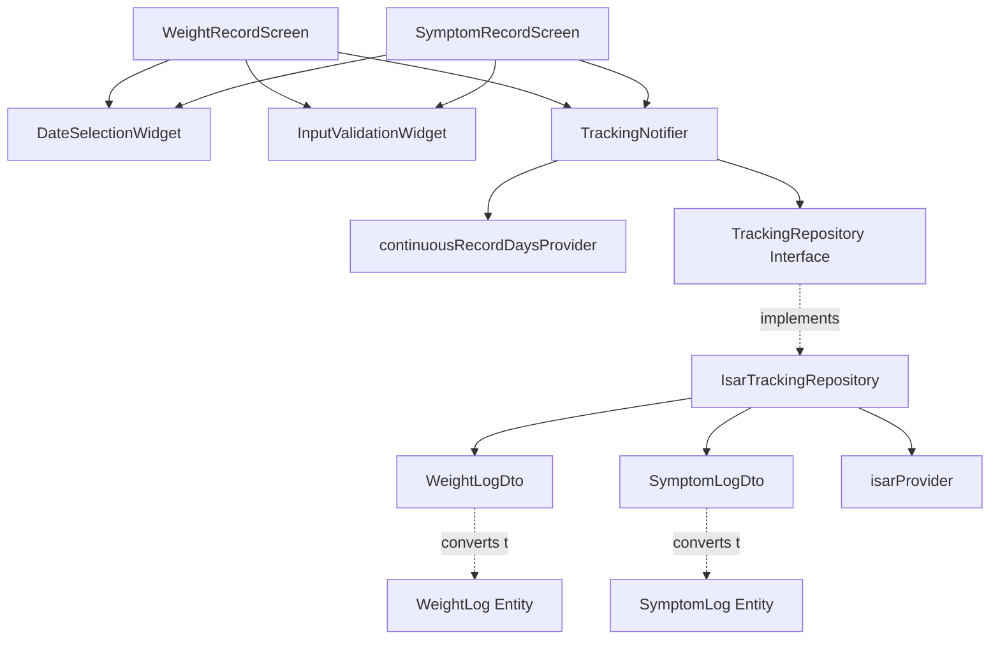

# UF-F002: 증상 및 체중 기록 구현 계획 (TDD)

## 1. 개요

### 모듈 목록
- **Domain Layer**
  - `WeightLog` Entity
  - `SymptomLog` Entity
  - `TrackingRepository` Interface
- **Infrastructure Layer**
  - `WeightLogDto` (Isar Collection)
  - `SymptomLogDto` (Isar Collection)
  - `IsarTrackingRepository` (구현체)
- **Application Layer**
  - `TrackingNotifier` (상태 관리)
  - `trackingNotifierProvider`
  - Derived Providers (경과일 계산 등)
- **Presentation Layer**
  - `WeightRecordScreen` (체중 기록 화면)
  - `SymptomRecordScreen` (증상 기록 화면)
  - Input Validation Widgets
  - Date Selection Widget

### TDD 적용 범위
- Unit Test: Domain 로직, Repository 구현
- Integration Test: Application Layer (Notifier + Repository)
- Widget Test: Presentation Layer (UI 로직)
- Acceptance Test: 전체 흐름 (UC-F002-01, 02, 03)

---

## 2. Architecture Diagram



---

## 3. Implementation Plan

### 3.1. Domain Layer: WeightLog Entity

**Location**: `lib/features/tracking/domain/entities/weight_log.dart`

**Responsibility**: 체중 기록 비즈니스 로직

**Test Strategy**: Unit Test

**Test Scenarios (Red Phase)**:
```dart
// TC-WL-01: 정상 생성
test('should create WeightLog with valid data', () {
  // Arrange
  final id = 'wl-001';
  final userId = 'user-001';
  final logDate = DateTime(2025, 11, 7);
  final weightKg = 75.5;
  final createdAt = DateTime.now();

  // Act
  final weightLog = WeightLog(
    id: id,
    userId: userId,
    logDate: logDate,
    weightKg: weightKg,
    createdAt: createdAt,
  );

  // Assert
  expect(weightLog.id, id);
  expect(weightLog.userId, userId);
  expect(weightLog.logDate, logDate);
  expect(weightLog.weightKg, weightKg);
  expect(weightLog.createdAt, createdAt);
});

// TC-WL-02: copyWith 정상 동작
test('should copy WeightLog with updated weightKg', () {
  // Arrange
  final original = WeightLog(
    id: 'wl-001',
    userId: 'user-001',
    logDate: DateTime(2025, 11, 7),
    weightKg: 75.5,
    createdAt: DateTime.now(),
  );

  // Act
  final updated = original.copyWith(weightKg: 74.8);

  // Assert
  expect(updated.weightKg, 74.8);
  expect(updated.id, original.id);
  expect(updated.userId, original.userId);
});

// TC-WL-03: Equality 비교
test('should compare two WeightLog entities correctly', () {
  // Arrange
  final log1 = WeightLog(...);
  final log2 = WeightLog(...);

  // Act & Assert
  expect(log1 == log2, isTrue);
});
```

**Implementation Order**:
1. RED: TC-WL-01 작성 → 실패 확인
2. GREEN: `WeightLog` 클래스 최소 구현
3. REFACTOR: Equatable/Freezed 적용
4. RED: TC-WL-02 작성 → 실패 확인
5. GREEN: `copyWith` 구현
6. REFACTOR: 불필요한 코드 제거

**Dependencies**: 없음 (Pure Dart)

---

### 3.2. Domain Layer: SymptomLog Entity

**Location**: `lib/features/tracking/domain/entities/symptom_log.dart`

**Responsibility**: 증상 기록 비즈니스 로직

**Test Strategy**: Unit Test

**Test Scenarios (Red Phase)**:
```dart
// TC-SL-01: 정상 생성 (경증, 심각도 1-6점)
test('should create SymptomLog with severity 1-6', () {
  // Arrange & Act
  final symptomLog = SymptomLog(
    id: 'sl-001',
    userId: 'user-001',
    logDate: DateTime(2025, 11, 7),
    symptomName: '메스꺼움',
    severity: 4,
    daysSinceEscalation: 3,
    tags: ['기름진음식', '과식'],
  );

  // Assert
  expect(symptomLog.severity, 4);
  expect(symptomLog.isPersistent24h, isNull);
  expect(symptomLog.tags.length, 2);
});

// TC-SL-02: 중증 생성 (심각도 7-10점, 24시간 지속)
test('should create SymptomLog with severity 7-10 and persistent flag', () {
  // Arrange & Act
  final symptomLog = SymptomLog(
    id: 'sl-002',
    userId: 'user-001',
    logDate: DateTime(2025, 11, 7),
    symptomName: '구토',
    severity: 9,
    daysSinceEscalation: 5,
    isPersistent24h: true,
  );

  // Assert
  expect(symptomLog.severity, 9);
  expect(symptomLog.isPersistent24h, isTrue);
});

// TC-SL-03: 심각도 범위 검증 (1-10)
test('should throw exception for invalid severity', () {
  // Act & Assert
  expect(
    () => SymptomLog(
      id: 'sl-003',
      userId: 'user-001',
      logDate: DateTime.now(),
      symptomName: '메스꺼움',
      severity: 11, // 범위 초과
    ),
    throwsA(isA<ArgumentError>()),
  );
});

// TC-SL-04: 경과일 미계산 (증량 이력 없음)
test('should allow null daysSinceEscalation', () {
  // Arrange & Act
  final symptomLog = SymptomLog(
    id: 'sl-004',
    userId: 'user-001',
    logDate: DateTime.now(),
    symptomName: '복통',
    severity: 3,
    daysSinceEscalation: null,
  );

  // Assert
  expect(symptomLog.daysSinceEscalation, isNull);
});
```

**Implementation Order**:
1. RED: TC-SL-01, 02 작성
2. GREEN: `SymptomLog` 기본 구현
3. RED: TC-SL-03 작성 (검증 로직)
4. GREEN: Severity 범위 검증 추가
5. REFACTOR: Validation 로직 분리

**Dependencies**: 없음 (Pure Dart)

---

### 3.3. Domain Layer: TrackingRepository Interface

**Location**: `lib/features/tracking/domain/repositories/tracking_repository.dart`

**Responsibility**: 데이터 접근 인터페이스 정의

**Test Strategy**: Interface 정의 (구현은 Infrastructure에서 테스트)

**Implementation Order**:
1. Interface 정의 (테스트 불필요)
2. Method Signatures 명확화

```dart
abstract class TrackingRepository {
  // 체중 기록
  Future<void> saveWeightLog(WeightLog log);
  Future<WeightLog?> getWeightLog(String userId, DateTime logDate);
  Future<List<WeightLog>> getWeightLogs(String userId, {DateTime? startDate, DateTime? endDate});
  Future<void> deleteWeightLog(String id);
  Future<void> updateWeightLog(String id, double newWeight);
  Stream<List<WeightLog>> watchWeightLogs(String userId);

  // 증상 기록
  Future<void> saveSymptomLog(SymptomLog log);
  Future<List<SymptomLog>> getSymptomLogs(String userId, {DateTime? startDate, DateTime? endDate});
  Future<void> deleteSymptomLog(String id);
  Future<void> updateSymptomLog(String id, SymptomLog updatedLog);
  Stream<List<SymptomLog>> watchSymptomLogs(String userId);

  // 태그 기반 조회
  Future<List<SymptomLog>> getSymptomLogsByTag(String tagName);
  Future<List<String>> getAllTags(String userId);

  // 경과일 계산을 위한 최근 증량일 조회
  Future<DateTime?> getLatestDoseEscalationDate(String userId);
}
```

**Dependencies**: `WeightLog`, `SymptomLog` Entity

---

### 3.4. Infrastructure Layer: WeightLogDto

**Location**: `lib/features/tracking/infrastructure/dtos/weight_log_dto.dart`

**Responsibility**: Isar DB 매핑

**Test Strategy**: Unit Test (DTO ↔ Entity 변환)

**Test Scenarios (Red Phase)**:
```dart
// TC-WL-DTO-01: Entity → DTO 변환
test('should convert WeightLog entity to WeightLogDto', () {
  // Arrange
  final entity = WeightLog(
    id: 'wl-001',
    userId: 'user-001',
    logDate: DateTime(2025, 11, 7),
    weightKg: 75.5,
    createdAt: DateTime.now(),
  );

  // Act
  final dto = WeightLogDto.fromEntity(entity);

  // Assert
  expect(dto.userId, entity.userId);
  expect(dto.logDate, entity.logDate);
  expect(dto.weightKg, entity.weightKg);
});

// TC-WL-DTO-02: DTO → Entity 변환
test('should convert WeightLogDto to WeightLog entity', () {
  // Arrange
  final dto = WeightLogDto()
    ..id = 1
    ..userId = 'user-001'
    ..logDate = DateTime(2025, 11, 7)
    ..weightKg = 75.5
    ..createdAt = DateTime.now();

  // Act
  final entity = dto.toEntity();

  // Assert
  expect(entity.userId, dto.userId);
  expect(entity.weightKg, dto.weightKg);
});

// TC-WL-DTO-03: Round-trip 변환 (데이터 손실 없음)
test('should preserve data in round-trip conversion', () {
  // Arrange
  final original = WeightLog(...);

  // Act
  final dto = WeightLogDto.fromEntity(original);
  final converted = dto.toEntity();

  // Assert
  expect(converted, equals(original));
});
```

**Implementation Order**:
1. RED: TC-WL-DTO-01 작성
2. GREEN: `WeightLogDto` + `fromEntity` 구현
3. RED: TC-WL-DTO-02 작성
4. GREEN: `toEntity` 구현
5. REFACTOR: 중복 제거

**Dependencies**: Isar, `WeightLog` Entity

---

### 3.5. Infrastructure Layer: SymptomLogDto + SymptomContextTagDto

**Location**:
- `lib/features/tracking/infrastructure/dtos/symptom_log_dto.dart`
- `lib/features/tracking/infrastructure/dtos/symptom_context_tag_dto.dart`

**Responsibility**: Isar DB 매핑 (1:N 관계 처리)

**Test Strategy**: Unit Test

**Test Scenarios (Red Phase)**:
```dart
// TC-SL-DTO-01: Entity → DTO 변환 (태그 포함)
test('should convert SymptomLog entity to SymptomLogDto with tags', () {
  // Arrange
  final entity = SymptomLog(
    id: 'sl-001',
    userId: 'user-001',
    logDate: DateTime(2025, 11, 7),
    symptomName: '메스꺼움',
    severity: 4,
    tags: ['기름진음식', '과식'],
  );

  // Act
  final dto = SymptomLogDto.fromEntity(entity);

  // Assert
  expect(dto.symptomName, entity.symptomName);
  expect(dto.severity, entity.severity);
  // tags는 별도 테이블이므로 Repository에서 처리
});

// TC-SL-DTO-02: DTO → Entity 변환 (태그 결합)
test('should convert SymptomLogDto to entity with tags', () {
  // Arrange
  final dto = SymptomLogDto()..symptomName = '메스꺼움';
  final tagDtos = [
    SymptomContextTagDto()..tagName = '기름진음식',
    SymptomContextTagDto()..tagName = '과식',
  ];

  // Act
  final entity = dto.toEntity(tags: tagDtos);

  // Assert
  expect(entity.tags, ['기름진음식', '과식']);
});

// TC-SL-DTO-03: isPersistent24h 필드 변환
test('should preserve isPersistent24h in DTO conversion', () {
  // Arrange
  final entity = SymptomLog(
    id: 'sl-001',
    userId: 'user-001',
    logDate: DateTime.now(),
    symptomName: '구토',
    severity: 9,
    isPersistent24h: true,
  );

  // Act
  final dto = SymptomLogDto.fromEntity(entity);
  final converted = dto.toEntity();

  // Assert
  expect(converted.isPersistent24h, isTrue);
});
```

**Implementation Order**:
1. RED: TC-SL-DTO-01 작성
2. GREEN: `SymptomLogDto` 구현
3. RED: Tag 변환 테스트 작성
4. GREEN: `SymptomContextTagDto` + 결합 로직

**Dependencies**: Isar, `SymptomLog` Entity

---

### 3.6. Infrastructure Layer: IsarTrackingRepository

**Location**: `lib/features/tracking/infrastructure/repositories/isar_tracking_repository.dart`

**Responsibility**: TrackingRepository 구현 (Isar DB 접근)

**Test Strategy**: Integration Test (Isar in-memory)

**Test Scenarios (Red Phase)**:
```dart
// TC-ITR-01: 체중 기록 저장
test('should save WeightLog to Isar', () async {
  // Arrange
  final isar = await openIsarInMemory();
  final repository = IsarTrackingRepository(isar);
  final log = WeightLog(...);

  // Act
  await repository.saveWeightLog(log);

  // Assert
  final saved = await repository.getWeightLog(log.userId, log.logDate);
  expect(saved, isNotNull);
  expect(saved!.weightKg, log.weightKg);
});

// TC-ITR-02: 체중 중복 기록 (덮어쓰기)
test('should overwrite duplicate WeightLog', () async {
  // Arrange
  final repository = IsarTrackingRepository(isar);
  final log1 = WeightLog(..., weightKg: 75.5);
  final log2 = WeightLog(..., weightKg: 74.8, logDate: log1.logDate); // 같은 날짜

  // Act
  await repository.saveWeightLog(log1);
  await repository.saveWeightLog(log2);

  // Assert
  final saved = await repository.getWeightLog(log1.userId, log1.logDate);
  expect(saved!.weightKg, 74.8); // 덮어쓰기 확인
});

// TC-ITR-03: 증상 기록 저장 (태그 포함)
test('should save SymptomLog with tags to Isar', () async {
  // Arrange
  final repository = IsarTrackingRepository(isar);
  final log = SymptomLog(..., tags: ['기름진음식', '과식']);

  // Act
  await repository.saveSymptomLog(log);

  // Assert
  final saved = await repository.getSymptomLogs(log.userId);
  expect(saved.first.tags, ['기름진음식', '과식']);
});

// TC-ITR-04: 증상 기록 조회 (날짜 범위)
test('should get SymptomLogs in date range', () async {
  // Arrange
  final repository = IsarTrackingRepository(isar);
  await repository.saveSymptomLog(SymptomLog(..., logDate: DateTime(2025, 11, 1)));
  await repository.saveSymptomLog(SymptomLog(..., logDate: DateTime(2025, 11, 7)));
  await repository.saveSymptomLog(SymptomLog(..., logDate: DateTime(2025, 11, 15)));

  // Act
  final logs = await repository.getSymptomLogs(
    'user-001',
    startDate: DateTime(2025, 11, 5),
    endDate: DateTime(2025, 11, 10),
  );

  // Assert
  expect(logs.length, 1); // 11월 7일만 포함
});

// TC-ITR-05: Stream 실시간 동기화
test('should watch WeightLogs changes', () async {
  // Arrange
  final repository = IsarTrackingRepository(isar);
  final stream = repository.watchWeightLogs('user-001');

  // Act & Assert
  expectLater(
    stream,
    emitsInOrder([
      [], // 초기 빈 리스트
      [isA<WeightLog>()], // 추가 후
    ]),
  );

  await repository.saveWeightLog(WeightLog(...));
});

// TC-ITR-06: 경과일 계산용 최근 증량일 조회
test('should get latest dose escalation date', () async {
  // Arrange
  final repository = IsarTrackingRepository(isar);
  // MedicationRepository mock 필요 (의존성)

  // Act
  final escalationDate = await repository.getLatestDoseEscalationDate('user-001');

  // Assert
  expect(escalationDate, isNotNull);
});

// TC-ITR-07: 태그 정규화 (중복 방지)
test('should normalize context tags across multiple logs', () async {
  // Arrange
  final repository = IsarTrackingRepository(isar);
  final log1 = SymptomLog(
    id: 'sl-001',
    userId: 'user-001',
    logDate: DateTime.now(),
    symptomName: '메스꺼움',
    severity: 4,
    tags: ['기름진음식'],
  );
  final log2 = SymptomLog(
    id: 'sl-002',
    userId: 'user-001',
    logDate: DateTime.now(),
    symptomName: '복통',
    severity: 3,
    tags: ['기름진음식'],
  );

  // Act
  await repository.saveSymptomLog(log1);
  await repository.saveSymptomLog(log2);

  // Assert
  final tagDto = await isar.symptomContextTagDtos
      .filter()
      .tagNameEqualTo('기름진음식')
      .findAll();

  expect(tagDto.length, 2); // 2개의 연결 레코드
});

// TC-ITR-08: 태그 기반 조회
test('should get symptom logs by tag', () async {
  // Arrange
  final repository = IsarTrackingRepository(isar);
  await repository.saveSymptomLog(SymptomLog(..., tags: ['기름진음식']));
  await repository.saveSymptomLog(SymptomLog(..., tags: ['기름진음식']));
  await repository.saveSymptomLog(SymptomLog(..., tags: ['과식']));

  // Act
  final logs = await repository.getSymptomLogsByTag('기름진음식');

  // Assert
  expect(logs.length, 2);
});
```

**Implementation Order**:
1. RED: TC-ITR-01 작성
2. GREEN: `saveWeightLog` 최소 구현
3. RED: TC-ITR-02 작성 (중복 체크)
4. GREEN: Unique constraint 처리
5. RED: TC-ITR-03, 04 작성
6. GREEN: `saveSymptomLog` + 태그 처리
7. REFACTOR: 중복 로직 제거
8. RED: TC-ITR-05 작성 (Stream)
9. GREEN: `watchWeightLogs` 구현

**Dependencies**: Isar, DTO, MedicationRepository (경과일 계산)

---

### 3.7. Application Layer: TrackingNotifier

**Location**: `lib/features/tracking/application/notifiers/tracking_notifier.dart`

**Responsibility**: 상태 관리 및 UseCase 조율

**Test Strategy**: Integration Test (Mock Repository)

**Test Scenarios (Red Phase)**:
```dart
// TC-TN-01: 초기 상태 로딩
test('should load initial TrackingState', () async {
  // Arrange
  final mockRepo = MockTrackingRepository();
  when(() => mockRepo.getWeightLogs(any())).thenAnswer((_) async => []);
  when(() => mockRepo.getSymptomLogs(any())).thenAnswer((_) async => []);

  final container = ProviderContainer(
    overrides: [
      trackingRepositoryProvider.overrideWithValue(mockRepo),
    ],
  );

  // Act
  final state = await container.read(trackingNotifierProvider.future);

  // Assert
  expect(state.weights, isA<AsyncData<List<WeightLog>>>());
  expect(state.symptoms, isA<AsyncData<List<SymptomLog>>>());
});

// TC-TN-02: 체중 기록 추가
test('should save WeightLog and update state', () async {
  // Arrange
  final mockRepo = MockTrackingRepository();
  final log = WeightLog(...);
  when(() => mockRepo.saveWeightLog(log)).thenAnswer((_) async {});
  when(() => mockRepo.getWeightLogs(any())).thenAnswer((_) async => [log]);

  final container = ProviderContainer(
    overrides: [trackingRepositoryProvider.overrideWithValue(mockRepo)],
  );
  final notifier = container.read(trackingNotifierProvider.notifier);

  // Act
  await notifier.saveWeightLog(log);

  // Assert
  final state = container.read(trackingNotifierProvider).value;
  expect(state!.weights.value, [log]);
  verify(() => mockRepo.saveWeightLog(log)).called(1);
});

// TC-TN-03: 증상 기록 추가 (경과일 자동 계산)
test('should save SymptomLog with calculated daysSinceEscalation', () async {
  // Arrange
  final mockRepo = MockTrackingRepository();
  final escalationDate = DateTime(2025, 11, 1);
  when(() => mockRepo.getLatestDoseEscalationDate(any()))
      .thenAnswer((_) async => escalationDate);

  final log = SymptomLog(
    id: 'sl-001',
    userId: 'user-001',
    logDate: DateTime(2025, 11, 7),
    symptomName: '메스꺼움',
    severity: 4,
    daysSinceEscalation: null, // 자동 계산 대상
  );

  final container = ProviderContainer(
    overrides: [trackingRepositoryProvider.overrideWithValue(mockRepo)],
  );
  final notifier = container.read(trackingNotifierProvider.notifier);

  // Act
  await notifier.saveSymptomLog(log);

  // Assert
  final capturedLog = verify(() => mockRepo.saveSymptomLog(captureAny())).captured.single;
  expect(capturedLog.daysSinceEscalation, 6); // 11월 7일 - 11월 1일 = 6일
});

// TC-TN-04: 증량 이력 없을 때 경과일 null 유지
test('should keep daysSinceEscalation null when no escalation history', () async {
  // Arrange
  final mockRepo = MockTrackingRepository();
  when(() => mockRepo.getLatestDoseEscalationDate(any()))
      .thenAnswer((_) async => null); // 증량 이력 없음

  final log = SymptomLog(..., daysSinceEscalation: null);
  final notifier = ...;

  // Act
  await notifier.saveSymptomLog(log);

  // Assert
  final capturedLog = verify(() => mockRepo.saveSymptomLog(captureAny())).captured.single;
  expect(capturedLog.daysSinceEscalation, isNull);
});

// TC-TN-05: 중복 체중 기록 (덮어쓰기)
test('should handle duplicate WeightLog', () async {
  // Arrange
  final mockRepo = MockTrackingRepository();
  final log1 = WeightLog(..., weightKg: 75.5);
  final log2 = WeightLog(..., weightKg: 74.8, logDate: log1.logDate);

  // Act
  await notifier.saveWeightLog(log1);
  await notifier.saveWeightLog(log2);

  // Assert
  verify(() => mockRepo.saveWeightLog(any())).called(2);
});

// TC-TN-06: 기록 삭제
test('should delete WeightLog', () async {
  // Arrange
  final mockRepo = MockTrackingRepository();
  when(() => mockRepo.deleteWeightLog('wl-001')).thenAnswer((_) async {});

  // Act
  await notifier.deleteWeightLog('wl-001');

  // Assert
  verify(() => mockRepo.deleteWeightLog('wl-001')).called(1);
});

// TC-TN-07: 중복 체중 기록 확인
test('should check for existing weight log on date', () async {
  // Arrange
  final mockRepo = MockTrackingRepository();
  final existingLog = WeightLog(
    id: 'wl-001',
    userId: 'user-001',
    logDate: DateTime(2025, 11, 7),
    weightKg: 75.5,
    createdAt: DateTime.now(),
  );
  when(() => mockRepo.getWeightLog('user-001', DateTime(2025, 11, 7)))
      .thenAnswer((_) async => existingLog);

  final container = ProviderContainer(
    overrides: [trackingRepositoryProvider.overrideWithValue(mockRepo)],
  );
  final notifier = container.read(trackingNotifierProvider.notifier);

  // Act
  final hasLog = await notifier.hasWeightLogOnDate('user-001', DateTime(2025, 11, 7));

  // Assert
  expect(hasLog, isTrue);
  verify(() => mockRepo.getWeightLog('user-001', DateTime(2025, 11, 7))).called(1);
});

// TC-TN-08: 중복 없는 날짜 확인
test('should return false when no weight log exists on date', () async {
  // Arrange
  final mockRepo = MockTrackingRepository();
  when(() => mockRepo.getWeightLog('user-001', DateTime(2025, 11, 7)))
      .thenAnswer((_) async => null); // 기록 없음

  final container = ProviderContainer(
    overrides: [trackingRepositoryProvider.overrideWithValue(mockRepo)],
  );
  final notifier = container.read(trackingNotifierProvider.notifier);

  // Act
  final hasLog = await notifier.hasWeightLogOnDate('user-001', DateTime(2025, 11, 7));

  // Assert
  expect(hasLog, isFalse);
});

// NOTE: spec.md의 Sequence Diagram과 달리,
// 경과일 계산은 Application Layer(TrackingNotifier)에서 수행함.
// 이유: 비즈니스 로직이므로 Presentation Layer에 두면 안 됨.
```

**TrackingNotifier Methods**:
```dart
// 중복 체크 메서드 추가
Future<bool> hasWeightLogOnDate(String userId, DateTime date) async {
  final existing = await _repository.getWeightLog(userId, date);
  return existing != null;
}

Future<WeightLog?> getWeightLog(String userId, DateTime date) async {
  return await _repository.getWeightLog(userId, date);
}
```

**Implementation Order**:
1. RED: TC-TN-01 작성
2. GREEN: `TrackingNotifier` 기본 구조
3. RED: TC-TN-02 작성
4. GREEN: `saveWeightLog` 구현
5. RED: TC-TN-03, 04 작성 (경과일 계산)
6. GREEN: `_calculateDaysSinceEscalation` 로직 추가
7. RED: TC-TN-07, 08 작성 (중복 체크)
8. GREEN: `hasWeightLogOnDate`, `getWeightLog` 메서드 추가
9. REFACTOR: 중복 제거

**Dependencies**: `TrackingRepository`, `MedicationRepository` (경과일 계산)

---

### 3.8. Application Layer: Derived Providers

**Location**: `lib/features/tracking/application/providers.dart`

**Responsibility**: 파생 상태 계산

**Test Strategy**: Unit Test

**Test Scenarios (Red Phase)**:
```dart
// TC-DP-01: 연속 기록일 계산 (기록 있음)
test('should calculate continuous record days', () {
  // Arrange
  final today = DateTime(2025, 11, 7);
  final logs = [
    WeightLog(..., logDate: DateTime(2025, 11, 7)),
    SymptomLog(..., logDate: DateTime(2025, 11, 6)),
    WeightLog(..., logDate: DateTime(2025, 11, 5)),
    // 11월 4일 기록 없음 (중단)
    WeightLog(..., logDate: DateTime(2025, 11, 3)),
  ];

  final mockState = TrackingState(
    weights: AsyncData([logs[0], logs[2], logs[3]]),
    symptoms: AsyncData([logs[1]]),
  );

  // Act
  final days = calculateContinuousRecordDays(mockState, today);

  // Assert
  expect(days, 3); // 11/5, 11/6, 11/7
});

// TC-DP-02: 연속 기록일 계산 (기록 없음)
test('should return 0 when no records', () {
  // Arrange
  final mockState = TrackingState(
    weights: AsyncData([]),
    symptoms: AsyncData([]),
  );

  // Act
  final days = calculateContinuousRecordDays(mockState, DateTime.now());

  // Assert
  expect(days, 0);
});

// TC-DP-03: 오늘 기록 없으면 연속 중단
test('should reset continuous days when no record today', () {
  // Arrange
  final today = DateTime(2025, 11, 7);
  final logs = [
    WeightLog(..., logDate: DateTime(2025, 11, 5)),
    WeightLog(..., logDate: DateTime(2025, 11, 6)),
    // 11월 7일 (오늘) 기록 없음
  ];

  final mockState = TrackingState(
    weights: AsyncData(logs),
    symptoms: AsyncData([]),
  );

  // Act
  final days = calculateContinuousRecordDays(mockState, today);

  // Assert
  expect(days, 0);
});
```

**Implementation Order**:
1. RED: TC-DP-01 작성
2. GREEN: `continuousRecordDaysProvider` 기본 로직
3. RED: TC-DP-02, 03 작성 (엣지 케이스)
4. GREEN: 예외 처리 추가
5. REFACTOR: 로직 최적화

**Dependencies**: `TrackingNotifier`

---

### 3.9. Presentation Layer: WeightRecordScreen

**Location**: `lib/features/tracking/presentation/screens/weight_record_screen.dart`

**Responsibility**: 체중 기록 UI

**Test Strategy**: Widget Test

**Test Scenarios (Red Phase)**:
```dart
// TC-WRS-01: 화면 렌더링
testWidgets('should render WeightRecordScreen', (tester) async {
  // Arrange
  await tester.pumpWidget(
    ProviderScope(
      child: MaterialApp(home: WeightRecordScreen()),
    ),
  );

  // Act & Assert
  expect(find.text('체중 기록'), findsOneWidget);
  expect(find.byType(TextField), findsOneWidget); // 체중 입력 필드
  expect(find.text('저장'), findsOneWidget);
});

// TC-WRS-02: 날짜 선택 ("오늘" 퀵 버튼)
testWidgets('should select today date with quick button', (tester) async {
  // Arrange
  await tester.pumpWidget(...);

  // Act
  await tester.tap(find.text('오늘'));
  await tester.pump();

  // Assert
  final screen = tester.widget<WeightRecordScreen>(find.byType(WeightRecordScreen));
  expect(screen.selectedDate, DateTime.now().toDateOnly());
});

// TC-WRS-03: 체중 입력 검증 (실시간)
testWidgets('should validate weight input in real-time', (tester) async {
  // Arrange
  await tester.pumpWidget(...);

  // Act
  await tester.enterText(find.byType(TextField), '350'); // 비현실적
  await tester.pump();

  // Assert
  expect(find.text('300kg 이하로 입력하세요'), findsOneWidget);
});

// TC-WRS-04: 저장 버튼 클릭 (정상)
testWidgets('should save WeightLog on button tap', (tester) async {
  // Arrange
  final mockNotifier = MockTrackingNotifier();
  await tester.pumpWidget(
    ProviderScope(
      overrides: [
        trackingNotifierProvider.overrideWith(() => mockNotifier),
      ],
      child: MaterialApp(home: WeightRecordScreen()),
    ),
  );

  // Act
  await tester.enterText(find.byType(TextField), '75.5');
  await tester.tap(find.text('저장'));
  await tester.pumpAndSettle();

  // Assert
  verify(() => mockNotifier.saveWeightLog(any())).called(1);
  expect(find.text('저장 완료'), findsOneWidget); // 스낵바
});

// TC-WRS-05: 터치 횟수 확인 (3회 이내)
testWidgets('should complete recording within 3 touches', (tester) async {
  // Arrange
  await tester.pumpWidget(...);

  // Act
  await tester.tap(find.text('오늘')); // 1회
  await tester.enterText(find.byType(TextField), '75.5'); // 2회 (포커스 + 입력)
  await tester.tap(find.text('저장')); // 3회

  // Assert
  // 터치 카운터 검증 (실제로는 interaction 추적)
});

// TC-WRS-06: 중복 날짜 기록 시 확인 다이얼로그 표시
testWidgets('should show overwrite confirmation for duplicate date', (tester) async {
  // Arrange
  final mockNotifier = MockTrackingNotifier();
  when(() => mockNotifier.getWeightLog(any(), any()))
      .thenAnswer((_) async => WeightLog(...)); // 기존 기록 존재

  await tester.pumpWidget(
    ProviderScope(
      overrides: [trackingNotifierProvider.overrideWith(() => mockNotifier)],
      child: MaterialApp(home: WeightRecordScreen()),
    ),
  );

  // Act
  await tester.enterText(find.byType(TextField), '75.5');
  await tester.tap(find.text('저장'));
  await tester.pumpAndSettle();

  // Assert
  expect(find.text('이미 기록이 있습니다. 덮어쓰시겠어요?'), findsOneWidget);
  expect(find.text('취소'), findsOneWidget);
  expect(find.text('확인'), findsOneWidget);
});

// TC-WRS-07: 덮어쓰기 확인 시 업데이트 호출
testWidgets('should update WeightLog on overwrite confirmation', (tester) async {
  // Arrange
  final mockNotifier = MockTrackingNotifier();
  when(() => mockNotifier.getWeightLog(any(), any()))
      .thenAnswer((_) async => WeightLog(...));

  await tester.pumpWidget(
    ProviderScope(
      overrides: [trackingNotifierProvider.overrideWith(() => mockNotifier)],
      child: MaterialApp(home: WeightRecordScreen()),
    ),
  );

  await tester.enterText(find.byType(TextField), '75.5');
  await tester.tap(find.text('저장'));
  await tester.pumpAndSettle();

  // Act
  await tester.tap(find.text('확인')); // 덮어쓰기 확인
  await tester.pumpAndSettle();

  // Assert
  verify(() => mockNotifier.updateWeightLog(any(), any())).called(1);
});
```

**Implementation Order**:
1. RED: TC-WRS-01 작성
2. GREEN: 기본 UI 구조 구현
3. RED: TC-WRS-03 작성 (검증)
4. GREEN: `InputValidationWidget` 연동
5. RED: TC-WRS-04 작성 (저장)
6. GREEN: `TrackingNotifier` 연동
7. REFACTOR: UI 코드 정리

**Dependencies**: `TrackingNotifier`, `DateSelectionWidget`

**QA Sheet**:
- [ ] 날짜 선택 퀵 버튼 ("오늘", "어제", "2일 전") 동작 확인
- [ ] 캘린더 날짜 선택 동작 확인
- [ ] 체중 입력 시 실시간 검증 메시지 표시
- [ ] 저장 버튼 클릭 시 스낵바 표시
- [ ] 저장 완료 후 홈 화면으로 자동 이동
- [ ] 3회 터치 이내 기록 완료 확인
- [ ] 미래 날짜 선택 시 에러 표시
- [ ] 중복 날짜 기록 시 덮어쓰기 확인 메시지

---

### 3.10. Presentation Layer: SymptomRecordScreen

**Location**: `lib/features/tracking/presentation/screens/symptom_record_screen.dart`

**Responsibility**: 증상 기록 UI

**Test Strategy**: Widget Test

**Test Scenarios (Red Phase)**:
```dart
// TC-SRS-01: 화면 렌더링
testWidgets('should render SymptomRecordScreen', (tester) async {
  // Arrange & Act
  await tester.pumpWidget(...);

  // Assert
  expect(find.text('증상 기록'), findsOneWidget);
  expect(find.text('메스꺼움'), findsOneWidget); // 증상 목록
  expect(find.byType(Slider), findsOneWidget); // 심각도 선택
});

// TC-SRS-02: 증상 선택 (다중 선택)
testWidgets('should allow multiple symptom selection', (tester) async {
  // Arrange
  await tester.pumpWidget(...);

  // Act
  await tester.tap(find.text('메스꺼움'));
  await tester.tap(find.text('복통'));
  await tester.pump();

  // Assert
  expect(find.byIcon(Icons.check), findsNWidgets(2)); // 체크 아이콘 2개
});

// TC-SRS-03: 심각도 7-10점 선택 시 추가 질문
testWidgets('should show persistent 24h question for severity 7-10', (tester) async {
  // Arrange
  await tester.pumpWidget(...);

  // Act
  await tester.tap(find.text('구토'));
  await tester.drag(find.byType(Slider), Offset(100, 0)); // 심각도 9점
  await tester.pump();

  // Assert
  expect(find.text('24시간 이상 지속되고 있나요?'), findsOneWidget);
  expect(find.text('예'), findsOneWidget);
  expect(find.text('아니오'), findsOneWidget);
});

// TC-SRS-04: 컨텍스트 태그 선택
testWidgets('should allow context tag selection', (tester) async {
  // Arrange
  await tester.pumpWidget(...);

  // Act
  await tester.tap(find.text('#기름진음식'));
  await tester.tap(find.text('#과식'));
  await tester.pump();

  // Assert
  final screen = tester.widget<SymptomRecordScreen>(find.byType(SymptomRecordScreen));
  expect(screen.selectedTags, ['기름진음식', '과식']);
});

// TC-SRS-05: 저장 후 대처 가이드 표시
testWidgets('should show coping guide after saving', (tester) async {
  // Arrange
  await tester.pumpWidget(...);

  // Act
  await tester.tap(find.text('메스꺼움'));
  await tester.drag(find.byType(Slider), Offset(50, 0)); // 심각도 4점
  await tester.tap(find.text('저장'));
  await tester.pumpAndSettle();

  // Assert
  expect(find.text('메스꺼움 대처 가이드'), findsOneWidget);
  expect(find.text('도움이 되었나요?'), findsOneWidget);
});

// TC-SRS-06: 경과일 자동 표시
testWidgets('should display daysSinceEscalation automatically', (tester) async {
  // Arrange
  final mockNotifier = MockTrackingNotifier();
  when(() => mockNotifier.getLatestDoseEscalationDate())
      .thenAnswer((_) async => DateTime(2025, 11, 1));

  await tester.pumpWidget(
    ProviderScope(
      overrides: [trackingNotifierProvider.overrideWith(() => mockNotifier)],
      child: MaterialApp(home: SymptomRecordScreen()),
    ),
  );

  // Act
  await tester.pump(); // 경과일 계산 대기

  // Assert
  expect(find.text('용량 증량 후 6일째'), findsOneWidget); // 11/7 - 11/1 = 6일
});

// TC-SRS-07: 24시간 지속 여부 저장
testWidgets('should save isPersistent24h based on user selection', (tester) async {
  // Arrange
  final mockNotifier = MockTrackingNotifier();
  await tester.pumpWidget(
    ProviderScope(
      overrides: [trackingNotifierProvider.overrideWith(() => mockNotifier)],
      child: MaterialApp(home: SymptomRecordScreen()),
    ),
  );

  // Act
  await tester.tap(find.text('구토'));
  await tester.drag(find.byType(Slider), Offset(100, 0)); // 심각도 9점
  await tester.pumpAndSettle();
  await tester.tap(find.text('예')); // 24시간 지속 선택
  await tester.tap(find.text('저장'));
  await tester.pumpAndSettle();

  // Assert
  final capturedLog = verify(() => mockNotifier.saveSymptomLog(captureAny())).captured.single;
  expect(capturedLog.isPersistent24h, isTrue);
});

// TC-SRS-08: 중증 + 24시간 지속 시 증상 체크 화면 안내
testWidgets('should navigate to symptom check for severe persistent symptoms', (tester) async {
  // Arrange
  final mockNotifier = MockTrackingNotifier();
  await tester.pumpWidget(
    ProviderScope(
      overrides: [trackingNotifierProvider.overrideWith(() => mockNotifier)],
      child: MaterialApp(home: SymptomRecordScreen()),
    ),
  );

  // Act
  await tester.tap(find.text('구토'));
  await tester.drag(find.byType(Slider), Offset(100, 0)); // 심각도 9점
  await tester.pumpAndSettle();
  await tester.tap(find.text('예')); // 24시간 지속
  await tester.tap(find.text('저장'));
  await tester.pumpAndSettle();

  // Assert
  expect(find.text('증상 체크 화면으로 이동하시겠어요?'), findsOneWidget);
  expect(find.text('이동'), findsOneWidget);
  expect(find.text('나중에'), findsOneWidget);
});

// TC-SRS-09: 증상 체크 화면 이동
testWidgets('should navigate to F005 on confirmation', (tester) async {
  // Arrange
  final mockNotifier = MockTrackingNotifier();
  await tester.pumpWidget(
    ProviderScope(
      overrides: [trackingNotifierProvider.overrideWith(() => mockNotifier)],
      child: MaterialApp(
        home: SymptomRecordScreen(),
        routes: {
          '/symptom-check': (context) => SymptomCheckScreen(), // F005
        },
      ),
    ),
  );

  await tester.tap(find.text('구토'));
  await tester.drag(find.byType(Slider), Offset(100, 0));
  await tester.pumpAndSettle();
  await tester.tap(find.text('예'));
  await tester.tap(find.text('저장'));
  await tester.pumpAndSettle();

  // Act
  await tester.tap(find.text('이동'));
  await tester.pumpAndSettle();

  // Assert
  expect(find.byType(SymptomCheckScreen), findsOneWidget); // F005
});

// TC-SRS-10: 증상 체크 생략
testWidgets('should allow skipping symptom check', (tester) async {
  // Arrange
  final mockNotifier = MockTrackingNotifier();
  await tester.pumpWidget(
    ProviderScope(
      overrides: [trackingNotifierProvider.overrideWith(() => mockNotifier)],
      child: MaterialApp(
        home: SymptomRecordScreen(),
        routes: {
          '/home': (context) => HomeScreen(),
        },
      ),
    ),
  );

  await tester.tap(find.text('구토'));
  await tester.drag(find.byType(Slider), Offset(100, 0));
  await tester.pumpAndSettle();
  await tester.tap(find.text('예'));
  await tester.tap(find.text('저장'));
  await tester.pumpAndSettle();

  // Act
  await tester.tap(find.text('나중에'));
  await tester.pumpAndSettle();

  // Assert
  expect(find.byType(HomeScreen), findsOneWidget);
});
```

**Implementation Order**:
1. RED: TC-SRS-01 작성
2. GREEN: 기본 UI 구조
3. RED: TC-SRS-03 작성 (추가 질문)
4. GREEN: 심각도별 조건 분기
5. RED: TC-SRS-05 작성 (가이드 표시)
6. GREEN: F004 연동 (CopingGuide 표시)
7. RED: TC-SRS-07 작성 (isPersistent24h 저장)
8. GREEN: 24시간 지속 여부 저장 로직
9. RED: TC-SRS-08~10 작성 (F005 연동)
10. GREEN: severity >= 7 && isPersistent24h == true 시 증상 체크 화면 안내
11. REFACTOR: 중복 제거

**Dependencies**:
- `TrackingNotifier`
- `CopingGuideWidget` (F004)
- `SymptomCheckScreen` (F005)
- `HomeScreen`

**F005 Navigation Logic**:
- BR-F002-04에 따라 severity >= 7 && isPersistent24h == true일 때만 안내
- Navigator.push()로 SymptomCheckScreen으로 이동
- 사용자가 거부 시 HomeScreen으로 복귀

**QA Sheet**:
- [ ] 증상 다중 선택 동작 확인
- [ ] 심각도 슬라이더 정확도 (1-10점)
- [ ] 심각도 7-10점 시 추가 질문 표시
- [ ] 24시간 지속 여부 "예/아니오" 선택 동작
- [ ] isPersistent24h 필드 정확히 저장되는지 확인
- [ ] 컨텍스트 태그 선택 동작
- [ ] 저장 후 대처 가이드 자동 표시
- [ ] "도움이 되었나요?" 피드백 수집
- [ ] 경과일 자동 계산 및 표시
- [ ] 3회 터치 이내 기록 완료
- [ ] 증량 이력 없을 때 경과일 미표시
- [ ] severity >= 7 && isPersistent24h == true 시 증상 체크 화면 안내 표시
- [ ] 증상 체크 화면 이동 동작 확인
- [ ] 증상 체크 생략 시 홈 화면 이동 확인

---

### 3.11. Presentation Layer: DateSelectionWidget

**Location**: `lib/features/tracking/presentation/widgets/date_selection_widget.dart`

**Responsibility**: 날짜 선택 UI (재사용 가능)

**Test Strategy**: Widget Test

**Test Scenarios (Red Phase)**:
```dart
// TC-DSW-01: 퀵 버튼 렌더링
testWidgets('should render quick date buttons', (tester) async {
  // Arrange & Act
  await tester.pumpWidget(
    MaterialApp(home: Scaffold(body: DateSelectionWidget())),
  );

  // Assert
  expect(find.text('오늘'), findsOneWidget);
  expect(find.text('어제'), findsOneWidget);
  expect(find.text('2일 전'), findsOneWidget);
});

// TC-DSW-02: "오늘" 버튼 클릭
testWidgets('should select today on button tap', (tester) async {
  // Arrange
  DateTime? selectedDate;
  await tester.pumpWidget(
    MaterialApp(
      home: Scaffold(
        body: DateSelectionWidget(
          onDateSelected: (date) => selectedDate = date,
        ),
      ),
    ),
  );

  // Act
  await tester.tap(find.text('오늘'));
  await tester.pump();

  // Assert
  expect(selectedDate, DateTime.now().toDateOnly());
});

// TC-DSW-03: 캘린더 날짜 선택
testWidgets('should select date from calendar', (tester) async {
  // Arrange
  DateTime? selectedDate;
  await tester.pumpWidget(...);

  // Act
  await tester.tap(find.byIcon(Icons.calendar_today));
  await tester.pumpAndSettle();
  await tester.tap(find.text('15')); // 15일 선택
  await tester.tap(find.text('확인'));
  await tester.pumpAndSettle();

  // Assert
  expect(selectedDate!.day, 15);
});

// TC-DSW-04: 미래 날짜 선택 불가
testWidgets('should disable future dates in calendar', (tester) async {
  // Arrange
  await tester.pumpWidget(...);

  // Act
  await tester.tap(find.byIcon(Icons.calendar_today));
  await tester.pumpAndSettle();

  // Assert
  final calendarWidget = tester.widget<CalendarDatePicker>(find.byType(CalendarDatePicker));
  expect(calendarWidget.lastDate, DateTime.now().toDateOnly());
});
```

**Implementation Order**:
1. RED: TC-DSW-01, 02 작성
2. GREEN: 퀵 버튼 구현
3. RED: TC-DSW-03 작성
4. GREEN: 캘린더 통합
5. RED: TC-DSW-04 작성
6. GREEN: 미래 날짜 비활성화
7. REFACTOR: 코드 정리

**Dependencies**: 없음 (Pure Widget)

---

## 4. TDD Workflow

### 시작: 도메인 레이어부터 (Inside-Out)

```
1. WeightLog Entity (TC-WL-01~03)
   → RED: 테스트 작성
   → GREEN: 클래스 구현
   → REFACTOR: Equatable 적용
   → COMMIT: "feat: add WeightLog entity with tests"

2. SymptomLog Entity (TC-SL-01~04)
   → RED: 기본 + 검증 테스트
   → GREEN: Severity 검증 추가
   → REFACTOR: Validation 분리
   → COMMIT: "feat: add SymptomLog entity with validation"

3. TrackingRepository Interface
   → 정의만 (테스트 불필요)
   → COMMIT: "feat: define TrackingRepository interface"

4. WeightLogDto (TC-WL-DTO-01~03)
   → RED: 변환 테스트
   → GREEN: DTO 구현
   → REFACTOR: 중복 제거
   → COMMIT: "feat: add WeightLogDto with conversion tests"

5. SymptomLogDto + SymptomContextTagDto (TC-SL-DTO-01~02)
   → RED: 태그 결합 테스트
   → GREEN: 1:N 관계 처리
   → REFACTOR: 로직 정리
   → COMMIT: "feat: add SymptomLogDto with tag support"

6. IsarTrackingRepository (TC-ITR-01~08)
   → RED: 저장/조회 테스트
   → GREEN: Isar 연동
   → RED: Stream 테스트
   → GREEN: Watch 구현
   → RED: 태그 정규화 테스트 (TC-ITR-07~08)
   → GREEN: 태그 기반 조회 메서드 구현
   → REFACTOR: 중복 제거
   → COMMIT: "feat: implement IsarTrackingRepository with tag support"

7. TrackingNotifier (TC-TN-01~08)
   → RED: 상태 관리 테스트
   → GREEN: Notifier 구현
   → RED: 경과일 계산 테스트
   → GREEN: 로직 추가
   → RED: 중복 체크 테스트 (TC-TN-07~08)
   → GREEN: hasWeightLogOnDate 메서드 추가
   → REFACTOR: 코드 정리
   → COMMIT: "feat: add TrackingNotifier with duplicate check"

8. Derived Providers (TC-DP-01~03)
   → RED: 연속 기록일 테스트
   → GREEN: Provider 구현
   → REFACTOR: 최적화
   → COMMIT: "feat: add continuousRecordDaysProvider"

9. WeightRecordScreen (TC-WRS-01~07)
   → RED: 렌더링 테스트
   → GREEN: UI 구현
   → RED: 검증 테스트
   → GREEN: Validation 연동
   → RED: 중복 확인 다이얼로그 테스트 (TC-WRS-06~07)
   → GREEN: 중복 기록 확인 및 덮어쓰기 로직
   → REFACTOR: UI 정리
   → COMMIT: "feat: add WeightRecordScreen with duplicate handling"

10. SymptomRecordScreen (TC-SRS-01~10)
    → RED: 심각도 분기 테스트
    → GREEN: 조건 분기 구현
    → RED: 가이드 표시 테스트
    → GREEN: F004 연동
    → RED: isPersistent24h 저장 테스트 (TC-SRS-07)
    → GREEN: 24시간 지속 여부 저장 로직
    → RED: F005 연동 테스트 (TC-SRS-08~10)
    → GREEN: 증상 체크 화면 안내 및 네비게이션
    → REFACTOR: 코드 정리
    → COMMIT: "feat: add SymptomRecordScreen with F005 integration"

11. DateSelectionWidget (TC-DSW-01~04)
    → RED: 퀵 버튼 테스트
    → GREEN: 버튼 구현
    → RED: 캘린더 테스트
    → GREEN: 캘린더 통합
    → COMMIT: "feat: add DateSelectionWidget"
```

### Commit 포인트 제안
- 각 모듈의 TDD 사이클 완료 시 커밋
- Commit 메시지: `feat: <module> with tests` 또는 `test: <module> edge cases`
- 최소 단위: 1개 Entity/DTO/Repository 메서드

### 완료 조건
- [ ] 모든 Unit Test 통과 (70%)
- [ ] Integration Test 통과 (20%)
- [ ] Widget Test 통과 (10%)
- [ ] Acceptance Test 통과 (UC-F002-01, 02, 03)
- [ ] QA Sheet 수동 테스트 완료
- [ ] Code Coverage 80% 이상
- [ ] 성능 요구사항 충족 (3회 터치 이내 완료)

---

## 5. 핵심 원칙

### Test First
- 코드보다 테스트를 먼저 작성
- 실패하는 테스트를 보고 나서 구현 시작

### Small Steps
- 한 번에 하나의 시나리오만 구현
- 작은 단위로 빠른 피드백

### FIRST Principles
- Fast: 각 테스트 100ms 이내
- Independent: 테스트 순서 무관
- Repeatable: 항상 같은 결과
- Self-validating: Pass/Fail 명확
- Timely: 코드 작성 직전

### Test Pyramid
- Unit 70%: Entity, DTO, Repository 메서드
- Integration 20%: Notifier + Repository
- Widget 10%: Screen 렌더링, 인터랙션

### Strategy
- **Inside-Out**: Domain (Core Logic) → Infrastructure → Application → Presentation
- 이유: 비즈니스 로직이 명확하고, UI는 나중에 변경 가능성이 높음
