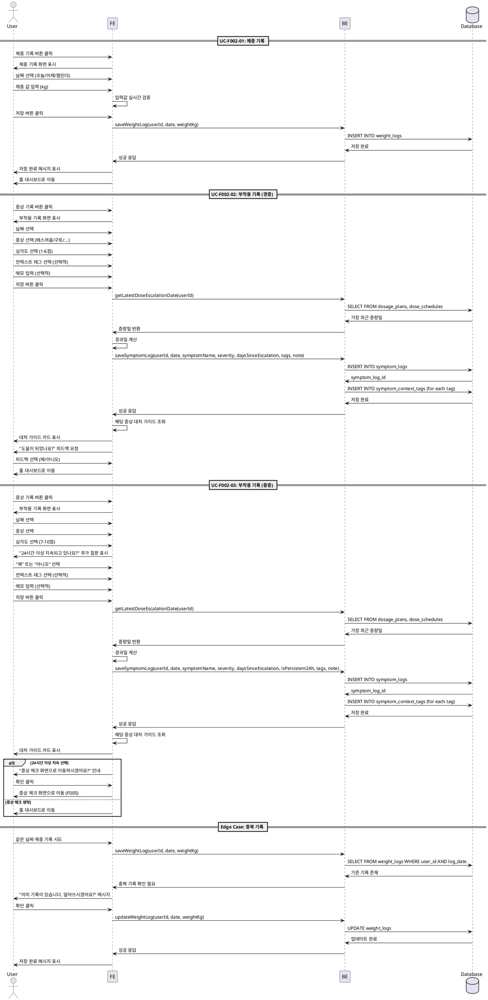

# UF-F002: 증상 및 체중 기록 - 상세 유스케이스

## Primary Actor

GLP-1 치료를 받고 있는 사용자

## Precondition

- 사용자가 앱에 로그인되어 있음
- 온보딩을 완료하여 사용자 프로필과 투여 계획이 설정되어 있음
- 홈 대시보드 또는 기록 화면에 접근 가능함

## Trigger

- 사용자가 홈 대시보드의 "체중 기록" 또는 "증상 기록" 퀵 액션 버튼을 클릭
- 사용자가 메뉴에서 기록 화면으로 직접 이동

## Main Scenario

### UC-F002-01: 체중 기록
1. 사용자가 "체중 기록" 버튼을 클릭한다
2. 시스템이 체중 기록 화면을 표시한다
3. 사용자가 날짜를 선택한다 ("오늘", "어제", "2일 전" 퀵 버튼 또는 캘린더)
4. 사용자가 체중 값을 입력한다 (kg 단위)
5. 시스템이 입력값을 실시간으로 검증한다 (양수, 현실적 범위)
6. 사용자가 "저장" 버튼을 클릭한다 (총 3회 터치 이내)
7. 시스템이 날짜, 체중, 기록 시간을 저장한다
8. 시스템이 저장 완료 메시지를 표시한다
9. 시스템이 홈 대시보드로 복귀한다

### UC-F002-02: 부작용 기록 (경증)
1. 사용자가 "증상 기록" 버튼을 클릭한다
2. 시스템이 부작용 기록 화면을 표시한다
3. 사용자가 날짜를 선택한다 ("오늘", "어제", "2일 전" 퀵 버튼 또는 캘린더)
4. 사용자가 증상을 선택한다 (메스꺼움/구토/변비/설사/복통/두통/피로 중 하나 이상)
5. 사용자가 각 증상의 심각도를 선택한다 (1-10점 척도)
6. 심각도가 1-6점인 경우, 사용자가 선택적으로 컨텍스트 태그를 추가한다 (#기름진음식, #과식, #음주, #공복, #스트레스, #수면부족)
7. 사용자가 선택적으로 메모를 입력한다
8. 사용자가 "저장" 버튼을 클릭한다 (총 3회 터치 이내)
9. 시스템이 용량 증량 후 경과일을 자동 계산한다 (투여 스케줄 참조)
10. 시스템이 날짜, 증상명, 심각도, 경과일, 기록 시간, 메모, 태그를 저장한다
11. 시스템이 해당 증상의 간단한 대처 가이드를 자동으로 표시한다 (F004 연동)
12. 사용자가 대처 가이드를 확인한다
13. 시스템이 "도움이 되었나요?" 피드백을 요청한다
14. 사용자가 홈 대시보드로 복귀한다

### UC-F002-03: 부작용 기록 (중증)
1. 사용자가 "증상 기록" 버튼을 클릭한다
2. 시스템이 부작용 기록 화면을 표시한다
3. 사용자가 날짜를 선택한다
4. 사용자가 증상을 선택한다
5. 사용자가 심각도 7-10점을 선택한다
6. 시스템이 추가 확인 질문을 표시한다: "이 증상이 24시간 이상 지속되고 있나요?"
7. 사용자가 "예" 또는 "아니오"를 선택한다
8. 사용자가 선택적으로 컨텍스트 태그를 추가한다
9. 사용자가 선택적으로 메모를 입력한다
10. 사용자가 "저장" 버튼을 클릭한다
11. 시스템이 기록을 저장한다
12. 시스템이 대처 가이드를 표시한다 (F004 연동)
13. 만약 "예"를 선택했다면, 시스템이 "증상 체크" 화면으로 안내한다 (F005 연동)
14. 사용자가 필요 시 증상 체크를 진행하거나, 홈 대시보드로 복귀한다

## Edge Cases

### 입력 검증 오류
- 체중 값이 비현실적인 경우 (20kg 미만, 300kg 초과): 시스템이 확인 메시지를 표시한다
- 미래 날짜 선택: 시스템이 에러 메시지를 표시하고 오늘 날짜로 자동 조정한다

### 중복 기록
- 같은 날짜에 체중 중복 기록: 시스템이 덮어쓰기 확인 메시지를 표시한다
- 같은 날짜/증상 중복 기록: 시스템이 덮어쓰기 또는 별도 기록 선택 옵션을 제공한다

### 데이터 부재
- 증량 이력이 없는 경우: 시스템이 경과일 계산을 건너뛴다
- 투여 계획이 비활성화된 경우: 시스템이 경과일 계산을 건너뛴다

### 네트워크 오류
- 저장 중 네트워크 오류 발생: 시스템이 로컬에 임시 저장하고 재시도 큐에 추가한다
- Phase 0에서는 로컬 DB만 사용하므로 네트워크 오류 없음

### 사용자 이탈
- 입력 중 앱 종료: 시스템이 임시 저장 없이 변경사항을 폐기한다
- 입력 중 백 버튼 클릭: 시스템이 저장 확인 메시지를 표시한다

### 여러 증상 동시 기록
- 한 번에 여러 증상 기록: 시스템이 각 증상별로 심각도를 개별 입력받고, 대처 가이드는 순차적으로 표시한다

## Business Rules

### BR-F002-01: 체중 기록 제약
- 체중은 날짜당 1개 값만 저장 가능 (중복 시 덮어쓰기)
- 체중 값 범위: 20kg 이상, 300kg 이하
- 미래 날짜 기록 불가
- 과거 90일 이내 기록만 수정 가능 (MVP 제한)

### BR-F002-02: 부작용 기록 제약
- 같은 날짜에 같은 증상을 여러 번 기록 가능
- 심각도는 1-10점 범위 필수
- 심각도 7-10점일 때 24시간 지속 여부 확인 필수
- 미래 날짜 기록 불가
- 과거 90일 이내 기록만 수정 가능 (MVP 제한)

### BR-F002-03: 경과일 계산
- 용량 증량 후 경과일은 투여 스케줄의 가장 최근 증량일 기준으로 계산
- 증량 이력이 없으면 경과일 표시 안 함
- 투여 계획이 비활성화되면 경과일 계산 안 함

### BR-F002-04: 대처 가이드 연동
- 부작용 기록 저장 시 자동으로 대처 가이드 표시 (F004)
- 심각도 7-10점이고 24시간 이상 지속 시 증상 체크 화면으로 안내 (F005)
- 사용자가 대처 가이드를 건너뛰고 바로 나갈 수 있음

### BR-F002-05: 입력 편의성
- 체중 기록은 3회 터치 이내 완료 가능해야 함
- 부작용 기록은 3회 터치 이내 완료 가능해야 함 (컨텍스트 태그 제외)
- 날짜 선택은 "오늘", "어제", "2일 전" 퀵 버튼 제공 필수

### BR-F002-06: 데이터 정합성
- 기록 저장 시 user_id는 현재 로그인한 사용자 ID 사용
- 모든 timestamp는 UTC로 저장하고, 표시 시 로컬 timezone 적용
- 컨텍스트 태그는 symptom_context_tags 테이블에 정규화하여 저장

## Sequence Diagram

