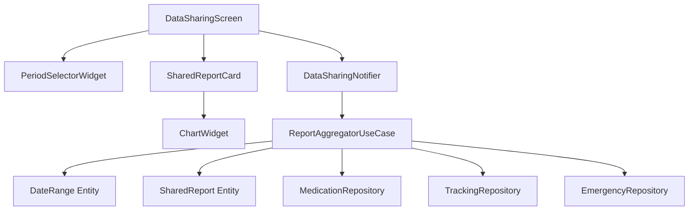

# Data Sharing Mode (F003) - TDD Implementation Plan

## 1. Overview

**Feature**: Data Sharing Mode (F003) - Read-only view for sharing medical records
**Location**: `features/data_sharing/`
**TDD Strategy**: Outside-In (User-facing acceptance test → Integration → Unit)
**Test Coverage**: Unit 70%, Integration 20%, Acceptance 10%

### Modules Summary
1. **Domain Layer**: DateRange entity, SharedReport entity
2. **Application Layer**: DataSharingNotifier (mode state), ReportAggregator (business logic)
3. **Infrastructure Layer**: Read-only access to existing repositories
4. **Presentation Layer**: DataSharingScreen, period selector, chart widgets

---

## 2. Architecture Diagram



---

## 3. Implementation Plan

### Module 1: DateRange Entity (Domain)
**Location**: `features/data_sharing/domain/entities/date_range.dart`

**Responsibility**: Represent time period for data filtering

**Test Strategy**: Unit

**Test Scenarios (Red Phase)**:
```dart
// AAA Pattern
test('should create DateRange with valid start and end dates', () {
  // Arrange
  final start = DateTime(2024, 1, 1);
  final end = DateTime(2024, 1, 31);

  // Act
  final range = DateRange(start: start, end: end);

  // Assert
  expect(range.start, start);
  expect(range.end, end);
});

test('should throw exception when end is before start', () {
  // Arrange
  final start = DateTime(2024, 1, 31);
  final end = DateTime(2024, 1, 1);

  // Act & Assert
  expect(() => DateRange(start: start, end: end), throwsA(isA<ArgumentError>()));
});

test('should create preset 1 month range from today', () {
  // Arrange
  final today = DateTime.now();

  // Act
  final range = DateRange.lastMonth();

  // Assert
  expect(range.end.day, today.day);
  expect(range.start.isBefore(range.end), true);
});

test('should create preset 3 months range', () {
  // Act
  final range = DateRange.last3Months();

  // Assert
  expect(range.end.difference(range.start).inDays, greaterThan(80));
});

test('should calculate duration in days', () {
  // Arrange
  final range = DateRange(
    start: DateTime(2024, 1, 1),
    end: DateTime(2024, 1, 10),
  );

  // Act
  final days = range.durationInDays;

  // Assert
  expect(days, 9);
});
```

**Implementation Order**:
1. Create basic DateRange class with start/end
2. Add validation (end >= start)
3. Add factory constructors (lastMonth, last3Months, all)
4. Add helper methods (durationInDays, contains)

**Dependencies**: None (pure Dart)

---

### Module 2: SharedReport Entity (Domain)
**Location**: `features/data_sharing/domain/entities/shared_report.dart`

**Responsibility**: Aggregate data for display in sharing mode

**Test Strategy**: Unit

**Test Scenarios (Red Phase)**:
```dart
test('should create SharedReport with all required data', () {
  // Arrange
  final doseRecords = [/* mock data */];
  final weightLogs = [/* mock data */];

  // Act
  final report = SharedReport(
    dateRange: DateRange.lastMonth(),
    doseRecords: doseRecords,
    adherenceRate: 0.95,
    weightLogs: weightLogs,
    symptomLogs: [],
  );

  // Assert
  expect(report.doseRecords, doseRecords);
  expect(report.adherenceRate, 0.95);
});

test('should validate adherence rate is between 0 and 1', () {
  // Act & Assert
  expect(
    () => SharedReport(
      dateRange: DateRange.lastMonth(),
      adherenceRate: 1.5, // Invalid
      doseRecords: [],
      weightLogs: [],
      symptomLogs: [],
    ),
    throwsA(isA<RangeError>()),
  );
});

test('should indicate empty report when no data', () {
  // Arrange
  final report = SharedReport(
    dateRange: DateRange.lastMonth(),
    adherenceRate: 0.0,
    doseRecords: [],
    weightLogs: [],
    symptomLogs: [],
  );

  // Act
  final isEmpty = report.isEmpty;

  // Assert
  expect(isEmpty, true);
});
```

**Implementation Order**:
1. Create SharedReport class with required fields
2. Add validation for adherence rate
3. Add isEmpty getter
4. Add copyWith method

**Dependencies**: DateRange, DoseRecord, WeightLog, SymptomLog entities

---

### Module 3: ReportAggregatorUseCase (Domain)
**Location**: `features/data_sharing/domain/usecases/aggregate_report_usecase.dart`

**Responsibility**: Business logic for aggregating data from multiple sources

**Test Strategy**: Unit (with repository mocks)

**Test Scenarios (Red Phase)**:
```dart
test('should aggregate dose records within date range', () async {
  // Arrange
  final mockRepo = MockMedicationRepository();
  final usecase = ReportAggregatorUseCase(medicationRepo: mockRepo);
  final range = DateRange.lastMonth();

  when(mockRepo.getDoseRecords(any)).thenAnswer((_) async => [/* mock data */]);

  // Act
  final report = await usecase.execute(range);

  // Assert
  expect(report.doseRecords.length, greaterThan(0));
  verify(mockRepo.getDoseRecords(any)).called(1);
});

test('should calculate adherence rate correctly', () async {
  // Arrange
  final mockMedicationRepo = MockMedicationRepository();
  final usecase = ReportAggregatorUseCase(medicationRepo: mockMedicationRepo);

  when(mockMedicationRepo.getDoseSchedules(any)).thenAnswer(
    (_) async => [/* 10 scheduled doses */],
  );
  when(mockMedicationRepo.getDoseRecords(any)).thenAnswer(
    (_) async => [/* 9 completed doses */],
  );

  // Act
  final report = await usecase.execute(DateRange.lastMonth());

  // Assert
  expect(report.adherenceRate, closeTo(0.9, 0.01));
});

test('should filter data by date range', () async {
  // Arrange
  final usecase = ReportAggregatorUseCase(/* repos */);
  final range = DateRange(
    start: DateTime(2024, 1, 1),
    end: DateTime(2024, 1, 31),
  );

  // Act
  final report = await usecase.execute(range);

  // Assert
  for (var record in report.doseRecords) {
    expect(range.contains(record.administeredAt), true);
  }
});

test('should aggregate symptom patterns by tag', () async {
  // Arrange
  final mockTrackingRepo = MockTrackingRepository();
  final usecase = ReportAggregatorUseCase(trackingRepo: mockTrackingRepo);

  when(mockTrackingRepo.getSymptomLogs()).thenAnswer((_) async => [
    SymptomLog(tags: ['fatty_food'], symptomName: 'nausea'),
    SymptomLog(tags: ['fatty_food'], symptomName: 'nausea'),
    SymptomLog(tags: ['stress'], symptomName: 'headache'),
  ]);

  // Act
  final report = await usecase.execute(DateRange.lastMonth());

  // Assert
  expect(report.symptomPatterns['fatty_food'], 2);
  expect(report.symptomPatterns['stress'], 1);
});

test('should handle empty data gracefully', () async {
  // Arrange
  final mockRepo = MockMedicationRepository();
  final usecase = ReportAggregatorUseCase(medicationRepo: mockRepo);

  when(mockRepo.getDoseRecords(any)).thenAnswer((_) async => []);

  // Act
  final report = await usecase.execute(DateRange.lastMonth());

  // Assert
  expect(report.isEmpty, true);
  expect(report.adherenceRate, 0.0);
});
```

**Implementation Order**:
1. Fetch dose records from repository
2. Calculate adherence rate (completed / scheduled)
3. Fetch and filter weight logs
4. Fetch and filter symptom logs
5. Aggregate symptom patterns by tag
6. Fetch emergency checks
7. Return SharedReport entity

**Dependencies**: MedicationRepository, TrackingRepository, EmergencyRepository (interfaces)

---

### Module 4: DataSharingNotifier (Application)
**Location**: `features/data_sharing/application/notifiers/data_sharing_notifier.dart`

**Responsibility**: Manage sharing mode state and period selection

**Test Strategy**: Unit

**Test Scenarios (Red Phase)**:
```dart
test('should initialize with inactive state', () {
  // Arrange & Act
  final container = ProviderContainer();
  final state = container.read(dataSharingNotifierProvider);

  // Assert
  expect(state.isActive, false);
  expect(state.selectedPeriod, isNull);
});

test('should activate sharing mode with default period', () {
  // Arrange
  final container = ProviderContainer();
  final notifier = container.read(dataSharingNotifierProvider.notifier);

  // Act
  notifier.enterSharingMode();

  // Assert
  final state = container.read(dataSharingNotifierProvider);
  expect(state.isActive, true);
  expect(state.selectedPeriod, isNotNull);
});

test('should update period selection', () {
  // Arrange
  final container = ProviderContainer();
  final notifier = container.read(dataSharingNotifierProvider.notifier);
  notifier.enterSharingMode();

  // Act
  final newPeriod = DateRange.last3Months();
  notifier.changePeriod(newPeriod);

  // Assert
  final state = container.read(dataSharingNotifierProvider);
  expect(state.selectedPeriod, newPeriod);
});

test('should exit sharing mode', () {
  // Arrange
  final container = ProviderContainer();
  final notifier = container.read(dataSharingNotifierProvider.notifier);
  notifier.enterSharingMode();

  // Act
  notifier.exitSharingMode();

  // Assert
  final state = container.read(dataSharingNotifierProvider);
  expect(state.isActive, false);
});

test('should trigger report generation when period changes', () async {
  // Arrange
  final container = ProviderContainer(overrides: [
    reportAggregatorProvider.overrideWith((ref) => mockAggregator),
  ]);
  final notifier = container.read(dataSharingNotifierProvider.notifier);
  notifier.enterSharingMode();

  // Act
  notifier.changePeriod(DateRange.last3Months());
  await container.pump();

  // Assert
  verify(mockAggregator.execute(any)).called(1);
});
```

**Implementation Order**:
1. Create DataSharingState class
2. Implement enterSharingMode() (set isActive, default period)
3. Implement changePeriod() (update selectedPeriod, trigger report)
4. Implement exitSharingMode() (reset state)
5. Wire up ReportAggregatorUseCase

**Dependencies**: ReportAggregatorUseCase, DateRange entity

---

### Module 5: SharedReportProvider (Application)
**Location**: `features/data_sharing/application/providers.dart`

**Responsibility**: Provide aggregated report based on current period

**Test Strategy**: Integration

**Test Scenarios (Red Phase)**:
```dart
test('should provide report when sharing mode is active', () async {
  // Arrange
  final container = ProviderContainer();
  final notifier = container.read(dataSharingNotifierProvider.notifier);
  notifier.enterSharingMode();

  // Act
  final reportAsync = container.read(sharedReportProvider);

  // Assert
  expect(reportAsync, isA<AsyncLoading>());
  await container.pump();
  expect(reportAsync, isA<AsyncData<SharedReport>>());
});

test('should update report when period changes', () async {
  // Arrange
  final container = ProviderContainer();
  final notifier = container.read(dataSharingNotifierProvider.notifier);
  notifier.enterSharingMode();
  await container.pump();

  // Act
  notifier.changePeriod(DateRange.last3Months());
  await container.pump();

  // Assert
  final report = container.read(sharedReportProvider).value;
  expect(report?.dateRange.durationInDays, greaterThan(80));
});

test('should return null when sharing mode is inactive', () {
  // Arrange
  final container = ProviderContainer();

  // Act
  final report = container.read(sharedReportProvider);

  // Assert
  expect(report.value, isNull);
});
```

**Implementation Order**:
1. Create provider that watches dataSharingNotifierProvider
2. Return null if not active
3. Call ReportAggregatorUseCase with current period
4. Handle loading/error states

**Dependencies**: DataSharingNotifier, ReportAggregatorUseCase

---

### Module 6: PeriodSelectorWidget (Presentation)
**Location**: `features/data_sharing/presentation/widgets/period_selector_widget.dart`

**Responsibility**: UI for selecting date range (1M/3M/All)

**Test Strategy**: Widget test

**Test Scenarios (Red Phase)**:
```dart
testWidgets('should display three period options', (tester) async {
  // Arrange & Act
  await tester.pumpWidget(
    ProviderScope(
      child: MaterialApp(home: PeriodSelectorWidget()),
    ),
  );

  // Assert
  expect(find.text('1개월'), findsOneWidget);
  expect(find.text('3개월'), findsOneWidget);
  expect(find.text('전체'), findsOneWidget);
});

testWidgets('should highlight selected period', (tester) async {
  // Arrange
  await tester.pumpWidget(/* setup with 1M selected */);

  // Act & Assert
  final button = tester.widget<ElevatedButton>(find.text('1개월'));
  expect(button.enabled, true); // Visual indication
});

testWidgets('should call notifier when period tapped', (tester) async {
  // Arrange
  final mockNotifier = MockDataSharingNotifier();
  await tester.pumpWidget(/* setup with mockNotifier */);

  // Act
  await tester.tap(find.text('3개월'));
  await tester.pump();

  // Assert
  verify(mockNotifier.changePeriod(any)).called(1);
});
```

**Implementation Order**:
1. Create stateless widget with three buttons
2. Read current period from notifier
3. Highlight selected period
4. Handle tap events (call changePeriod)

**Dependencies**: DataSharingNotifier

**QA Sheet**:
- [ ] Three buttons visible and readable
- [ ] Selected period highlighted correctly
- [ ] Tap switches period smoothly
- [ ] Button colors follow design system

---

### Module 7: DataSharingScreen (Presentation)
**Location**: `features/data_sharing/presentation/screens/data_sharing_screen.dart`

**Responsibility**: Main screen with full-screen read-only report

**Test Strategy**: Widget test + Integration

**Test Scenarios (Red Phase)**:
```dart
testWidgets('should show loading indicator while fetching data', (tester) async {
  // Arrange & Act
  await tester.pumpWidget(/* setup */);

  // Assert
  expect(find.byType(CircularProgressIndicator), findsOneWidget);
});

testWidgets('should display report sections when data loaded', (tester) async {
  // Arrange
  final container = ProviderContainer(overrides: [
    sharedReportProvider.overrideWith((ref) => AsyncData(mockReport)),
  ]);

  // Act
  await tester.pumpWidget(ProviderScope(
    parent: container,
    child: MaterialApp(home: DataSharingScreen()),
  ));
  await tester.pump();

  // Assert
  expect(find.text('투여 기록'), findsOneWidget);
  expect(find.text('체중 변화'), findsOneWidget);
  expect(find.text('부작용 기록'), findsOneWidget);
});

testWidgets('should hide edit buttons in sharing mode', (tester) async {
  // Arrange & Act
  await tester.pumpWidget(/* setup with data */);

  // Assert
  expect(find.byIcon(Icons.edit), findsNothing);
  expect(find.byIcon(Icons.delete), findsNothing);
});

testWidgets('should show empty state when no data', (tester) async {
  // Arrange
  final emptyReport = SharedReport(/* empty data */);

  // Act
  await tester.pumpWidget(/* setup with emptyReport */);

  // Assert
  expect(find.text('해당 기간에 기록이 없습니다'), findsOneWidget);
});

testWidgets('should show exit confirmation on back press', (tester) async {
  // Arrange
  await tester.pumpWidget(/* setup */);

  // Act
  await tester.pageBack();
  await tester.pumpAndSettle();

  // Assert
  expect(find.text('공유를 종료하시겠습니까?'), findsOneWidget);
});

testWidgets('should exit sharing mode when exit button tapped', (tester) async {
  // Arrange
  final mockNotifier = MockDataSharingNotifier();
  await tester.pumpWidget(/* setup with mockNotifier */);

  // Act
  await tester.tap(find.text('공유 종료'));
  await tester.pump();

  // Assert
  verify(mockNotifier.exitSharingMode()).called(1);
});
```

**Implementation Order**:
1. Create scaffold with AppBar ("공유 종료" button)
2. Add WillPopScope for back button handling
3. Add AsyncValue handling (loading/error/data)
4. Add PeriodSelectorWidget
5. Add scrollable body with report sections
6. Add empty state view
7. Wire up exit logic

**Dependencies**: SharedReportProvider, DataSharingNotifier, PeriodSelectorWidget

**QA Sheet**:
- [ ] Screen loads within 1 second
- [ ] All sections scrollable smoothly
- [ ] Period selector works correctly
- [ ] Exit button returns to home
- [ ] Back button shows confirmation dialog
- [ ] No edit/delete buttons visible
- [ ] Empty state displays correctly
- [ ] Charts render without lag
- [ ] Long data lists don't freeze UI

---

### Module 8: Acceptance Test (E2E)
**Location**: `test/acceptance/data_sharing_test.dart`

**Test Strategy**: Acceptance (Outside-In)

**Test Scenarios (Red Phase)**:
```dart
testWidgets('User can share medical records with doctor', (tester) async {
  // Arrange
  await setupTestData(); // Seed dose, weight, symptom data
  await tester.pumpWidget(MyApp());

  // Act - Navigate to home
  await tester.tap(find.text('홈'));
  await tester.pumpAndSettle();

  // Act - Enter sharing mode
  await tester.tap(find.text('기록 보여주기'));
  await tester.pumpAndSettle();

  // Assert - Sharing mode active
  expect(find.text('공유 종료'), findsOneWidget);
  expect(find.text('투여 기록'), findsOneWidget);
  expect(find.text('체중 변화'), findsOneWidget);

  // Act - Change period to 3 months
  await tester.tap(find.text('3개월'));
  await tester.pumpAndSettle();

  // Assert - Data updated
  expect(find.byType(CircularProgressIndicator), findsNothing);

  // Act - Scroll through report
  await tester.drag(find.byType(ListView), Offset(0, -500));
  await tester.pumpAndSettle();

  // Assert - All sections visible
  expect(find.text('부작용 패턴'), findsOneWidget);

  // Act - Exit sharing mode
  await tester.tap(find.text('공유 종료'));
  await tester.pumpAndSettle();

  // Assert - Returned to home
  expect(find.text('홈 대시보드'), findsOneWidget);
});

testWidgets('User cannot edit data in sharing mode', (tester) async {
  // Arrange & Act
  await enterSharingMode(tester);

  // Assert
  expect(find.byType(IconButton), findsNothing); // No edit buttons

  // Act - Try to tap on data (should not navigate to edit screen)
  await tester.tap(find.text('체중 기록').first);
  await tester.pumpAndSettle();

  // Assert - Still in sharing mode
  expect(find.text('공유 종료'), findsOneWidget);
});

testWidgets('Back button shows confirmation before exit', (tester) async {
  // Arrange & Act
  await enterSharingMode(tester);
  await tester.pageBack();
  await tester.pumpAndSettle();

  // Assert - Confirmation dialog shown
  expect(find.text('공유를 종료하시겠습니까?'), findsOneWidget);

  // Act - Cancel
  await tester.tap(find.text('취소'));
  await tester.pumpAndSettle();

  // Assert - Still in sharing mode
  expect(find.text('공유 종료'), findsOneWidget);

  // Act - Back again and confirm
  await tester.pageBack();
  await tester.pumpAndSettle();
  await tester.tap(find.text('확인'));
  await tester.pumpAndSettle();

  // Assert - Exited
  expect(find.text('홈 대시보드'), findsOneWidget);
});
```

**Implementation Order**: Run after all modules implemented

**Dependencies**: All modules

---

## 4. TDD Workflow

### Iteration 1: Domain Foundation
1. **Red**: Write DateRange entity tests
2. **Green**: Implement DateRange
3. **Refactor**: Extract date utility functions
4. **Commit**: "feat(domain): add DateRange entity with presets"

### Iteration 2: Report Aggregation
1. **Red**: Write SharedReport entity tests
2. **Green**: Implement SharedReport
3. **Red**: Write ReportAggregatorUseCase tests (with mocks)
4. **Green**: Implement aggregation logic
5. **Refactor**: Extract calculation methods
6. **Commit**: "feat(domain): add report aggregation logic"

### Iteration 3: State Management
1. **Red**: Write DataSharingNotifier tests
2. **Green**: Implement notifier
3. **Red**: Write SharedReportProvider tests
4. **Green**: Wire up provider
5. **Refactor**: Simplify state transitions
6. **Commit**: "feat(app): add sharing mode state management"

### Iteration 4: UI Components
1. **Red**: Write PeriodSelector widget tests
2. **Green**: Implement widget
3. **Refactor**: Extract button styles
4. **Commit**: "feat(ui): add period selector widget"

### Iteration 5: Main Screen
1. **Red**: Write DataSharingScreen widget tests
2. **Green**: Implement screen
3. **Red**: Write empty state tests
4. **Green**: Add empty state view
5. **Red**: Write exit confirmation tests
6. **Green**: Add WillPopScope logic
7. **Refactor**: Extract section widgets
8. **Commit**: "feat(ui): add data sharing screen"

### Iteration 6: E2E Validation
1. **Red**: Write acceptance tests
2. **Green**: Fix integration issues
3. **Refactor**: Optimize loading performance
4. **Commit**: "test: add data sharing acceptance tests"

### Commit Strategy
- Small, frequent commits per TDD cycle
- Commit message format: "feat/test/refactor(scope): description"
- Each commit must pass all tests

---

## 5. Edge Case Handling

### Empty Data
- **Test**: Report with no records
- **Implementation**: SharedReport.isEmpty getter
- **UI**: Display friendly empty state message

### Large Data Sets
- **Test**: Report with 1000+ records
- **Implementation**: Pagination or virtual scrolling
- **UI**: Loading indicator during aggregation

### Network Errors (Phase 1)
- **Test**: Repository throws exception
- **Implementation**: AsyncError handling in provider
- **UI**: Error screen with retry button

### Race Conditions
- **Test**: Rapid period changes
- **Implementation**: Debounce period selection
- **UI**: Disable buttons during loading

### Back Button Edge Case
- **Test**: Multiple back presses
- **Implementation**: Single confirmation dialog
- **UI**: Prevent double exit

---

## 6. Performance Constraints

- Data aggregation: < 500ms
- Screen render: < 1s
- Period switching: < 300ms
- Chart rendering: < 200ms

---

## 7. Dependencies

### Internal
- DoseRecord entity (features/tracking/domain/)
- WeightLog entity (features/tracking/domain/)
- SymptomLog entity (features/tracking/domain/)
- MedicationRepository interface (features/tracking/domain/)
- TrackingRepository interface (features/tracking/domain/)

### External
- fl_chart: ^0.66.0 (chart rendering)
- riverpod: ^2.0.0 (state management)
- intl: ^0.18.0 (date formatting)

---

## 8. Test Pyramid Summary

| Type | Count | Focus |
|------|-------|-------|
| Unit | 35 | Domain logic, state management |
| Integration | 10 | Provider interactions, repository integration |
| Acceptance | 5 | User scenarios, navigation flow |

**Total**: 50 tests

---

## 9. Definition of Done

- [ ] All unit tests passing (35/35)
- [ ] All integration tests passing (10/10)
- [ ] All acceptance tests passing (5/5)
- [ ] Code coverage > 80%
- [ ] flutter analyze: 0 warnings
- [ ] Performance constraints met
- [ ] QA sheet completed
- [ ] Repository pattern maintained
- [ ] No layer violations
- [ ] Documentation updated
