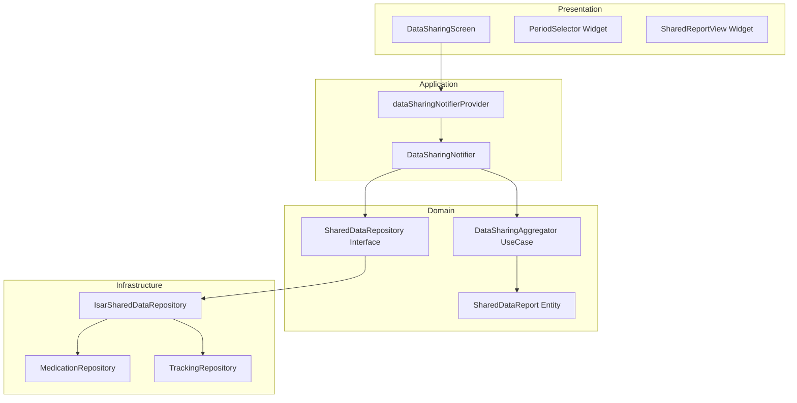

# Data Sharing Mode Implementation Plan

## 1. 개요

데이터 공유 모드는 사용자가 의료진에게 치료 기록을 보여주기 위한 읽기 전용 화면입니다. 투여 기록, 체중 변화, 부작용 패턴 등을 가독성 높은 전용 UI로 제공합니다.

**구현 모듈:**
- **DataSharingNotifier** (Application): 공유 모드 상태 관리
- **DataSharingAggregator** (Domain): 기간별 데이터 집계 로직
- **SharedDataReport** (Domain): 공유용 리포트 엔티티
- **DataSharingScreen** (Presentation): 공유 모드 전용 화면
- **SharedDataRepository** (Domain/Infrastructure): 기간별 데이터 조회 인터페이스 및 구현

**TDD 적용 범위:**
- Unit: Domain Layer (집계 로직, 엔티티 변환)
- Integration: Application Layer (Notifier, Repository 연동)
- Widget: Presentation Layer (UI 상태 전환, 읽기 전용 모드)

---

## 2. Architecture Diagram



---

## 3. Implementation Plan

### 3.1. SharedDataReport Entity (Domain)

**Location**: `lib/features/data_sharing/domain/entities/shared_data_report.dart`

**Responsibility**: 공유용 리포트 데이터 구조 정의

**Test Strategy**: Unit

**Test Scenarios**:
- Red Phase:
  - `test('should create SharedDataReport with all required fields')`
  - `test('should calculate compliance rate correctly')`
  - `test('should filter data by date range')`
  - `test('should return empty lists when no data exists')`

**Implementation Order**:
1. 엔티티 클래스 정의 (필드: 기간, 투여 기록 목록, 체중 기록 목록, 부작용 기록 목록, 증상 체크 목록, 투여 스케줄 목록)
2. 순응도 계산 메서드
3. 데이터 필터링 메서드
4. Immutability 보장 (copyWith)

**Dependencies**:
- `DoseRecord`, `WeightLog`, `SymptomLog`, `SymptomCheck`, `MedicationSchedule` (기존 엔티티)

---

### 3.2. SharedDataRepository Interface (Domain)

**Location**: `lib/features/data_sharing/domain/repositories/shared_data_repository.dart`

**Responsibility**: 기간별 데이터 조회 인터페이스 정의

**Test Strategy**: Unit (Mock 사용)

**Test Scenarios**:
- Red Phase:
  - `test('should define getReportData method signature')`
  - `test('should define period range enum')`

**Implementation Order**:
1. Repository 인터페이스 선언
2. `Future<SharedDataReport> getReportData(DateRange range)` 메서드 정의
3. DateRange enum 정의 (최근 1개월/3개월/전체)

**Dependencies**: `SharedDataReport`

---

### 3.3. IsarSharedDataRepository (Infrastructure)

**Location**: `lib/features/data_sharing/infrastructure/repositories/isar_shared_data_repository.dart`

**Responsibility**: Isar DB에서 기간별 데이터 조회 및 집계

**Test Strategy**: Integration

**Test Scenarios**:
- Red Phase:
  - `test('should fetch dose records within date range')`
  - `test('should fetch weight logs within date range')`
  - `test('should fetch symptom logs within date range')`
  - `test('should fetch symptom checks within date range')`
  - `test('should fetch medication schedules within date range')`
  - `test('should return empty report when no data exists')`
  - `test('should aggregate injection site history correctly')`
  - `test('should calculate adherence rate using schedules and dose records')`
  - `test('should handle missed doses correctly')`
  - Edge Cases:
    - `test('should handle partial data (only doses, no weights)')`
    - `test('should handle date range with future dates')`
    - `test('should handle all-time period correctly')`

**Implementation Order**:
1. Repository 구현 클래스 생성
2. 기간별 투여 기록 조회 로직
3. 기간별 체중/부작용 기록 조회 로직
4. 기간별 증상 체크 기록 조회 로직
5. 투여 스케줄 조회 로직 (계획된 투여 횟수 산출용)
6. 주사 부위 이력 집계 로직
7. 순응도 계산 로직 (실제 투여 횟수 / 계획된 투여 횟수 * 100)
8. SharedDataReport 생성 및 반환

**Dependencies**:
- `Isar`
- `MedicationRepository`
- `TrackingRepository`
- `SharedDataRepository` (구현 대상)

---

### 3.4. DataSharingAggregator UseCase (Domain)

**Location**: `lib/features/data_sharing/domain/usecases/data_sharing_aggregator.dart`

**Responsibility**: 리포트 데이터를 UI용 통계로 변환

**Test Strategy**: Unit

**Test Scenarios**:
- Red Phase:
  - `test('should calculate weight change trend')`
  - `test('should analyze symptom severity trend')`
  - `test('should group symptoms by context tags')`
  - `test('should identify dose escalation points')`
  - `test('should calculate average symptom severity')`
  - `test('should calculate adherence rate from schedules and dose records')`
  - `test('should handle missed doses correctly')`
  - Edge Cases:
    - `test('should return zero trend when only one weight record exists')`
    - `test('should handle empty symptom logs gracefully')`

**Implementation Order**:
1. UseCase 클래스 생성
2. 체중 변화 추이 계산 (시작 체중, 현재 체중, 변화율)
3. 부작용 강도 추이 계산 (평균, 최대, 최소)
4. 컨텍스트 태그별 빈도 집계
5. 용량 증량 시점 식별 로직

**Dependencies**: `SharedDataReport`

---

### 3.5. DataSharingNotifier (Application)

**Location**: `lib/features/data_sharing/application/notifiers/data_sharing_notifier.dart`

**Responsibility**: 공유 모드 상태 관리 및 UseCase 호출

**Test Strategy**: Integration

**Test Scenarios**:
- Red Phase:
  - `test('initial state should be inactive')`
  - `test('should enter sharing mode with selected period')`
  - `test('should load report data when entering sharing mode')`
  - `test('should exit sharing mode and reset state')`
  - `test('should update report when period changes')`
  - `test('should handle repository errors gracefully')`
  - Edge Cases:
    - `test('should prevent entering sharing mode when already active')`
    - `test('should handle loading timeout')`

**Implementation Order**:
1. Notifier 클래스 생성 (AsyncNotifier 상속)
2. 초기 상태 정의 (isActive: false)
3. `enterSharingMode(DateRange period)` 메서드
4. `exitSharingMode()` 메서드
5. `changePeriod(DateRange period)` 메서드
6. Repository 호출 및 상태 업데이트

**Dependencies**:
- `SharedDataRepository`
- `DataSharingAggregator`

---

### 3.6. DataSharingScreen (Presentation)

**Location**: `lib/features/data_sharing/presentation/screens/data_sharing_screen.dart`

**Responsibility**: 읽기 전용 리포트 화면 렌더링

**Test Strategy**: Widget Test

**Test Scenarios**:
- Red Phase:
  - `testWidgets('should display period selector')`
  - `testWidgets('should hide edit buttons in sharing mode')`
  - `testWidgets('should display adherence rate')`
  - `testWidgets('should display weight trend chart')`
  - `testWidgets('should display symptom severity chart')`
  - `testWidgets('should display injection site history table')`
  - `testWidgets('should display symptom check summary')`
  - `testWidgets('should display exit sharing mode button')`
  - `testWidgets('should navigate to home when exiting sharing mode')`
  - `testWidgets('should show confirmation dialog on back button press')`
  - `testWidgets('should exit sharing mode when confirmed in dialog')`
  - `testWidgets('should stay in sharing mode when cancelled in dialog')`
  - `testWidgets('should show detail popup when chart is tapped')`
  - `testWidgets('should display correct data for tapped chart point')`
  - `testWidgets('should dismiss detail popup when tapping outside')`
  - Edge Cases:
    - `testWidgets('should show empty state when no data exists')`
    - `testWidgets('should show loading indicator during data fetch')`

**Implementation Order**:
1. Screen Scaffold 생성
2. Period Selector 위젯 통합
3. PopScope 위젯 통합 (백 버튼 인터셉트)
4. 확인 다이얼로그 구현 ("공유를 종료하시겠습니까?")
5. 리포트 섹션 레이아웃 (우선순위 순서):
   1) 투여 기록 타임라인 + 순응도
   2) 주사 부위 순환 이력
   3) 체중 변화 그래프
   4) 부작용 강도 추이 + 발생 패턴
   5) 증상 체크 이력
6. 읽기 전용 모드 UI 적용 (편집 버튼 숨김)
7. 공유 종료 버튼
8. 차트 터치 이벤트 핸들러 구현
9. 상세 데이터 팝업 위젯 (해당 시점의 투여/체중/부작용 정보)
10. 데이터 없음 상태 처리

**Dependencies**:
- `DataSharingNotifier`
- Chart 위젯 (`fl_chart` 또는 자체 구현)

**QA Sheet (수동 테스트)**:
- [ ] 공유 모드 진입 시 개인화 요소(뱃지, 인사) 숨김 확인
- [ ] 기간 변경 시 데이터 재조회 확인
- [ ] 차트 터치 시 상세 데이터 팝업 확인
- [ ] 편집 버튼 클릭 시 "읽기 전용" 토스트 확인
- [ ] 백 버튼 시 확인 다이얼로그 확인
- [ ] 공유 종료 후 홈 화면 복귀 확인
- [ ] 로딩 인디케이터 표시 확인 (>1초 시)

---

### 3.7. Provider Setup (Application)

**Location**: `lib/features/data_sharing/application/providers.dart`

**Responsibility**: Riverpod Provider 정의

**Test Strategy**: Integration

**Test Scenarios**:
- Red Phase:
  - `test('should provide SharedDataRepository instance')`
  - `test('should provide DataSharingNotifier instance')`
  - `test('should watch notifier state changes')`

**Implementation Order**:
1. Repository Provider 정의
2. Notifier Provider 정의
3. Derived Provider (필요 시)

**Dependencies**:
- `IsarSharedDataRepository`
- `DataSharingNotifier`

---

## 4. TDD Workflow

### 시작: Domain Layer (Inside-Out)

1. **SharedDataReport Entity**
   - Red: 엔티티 필드 테스트 작성
   - Green: 엔티티 클래스 구현
   - Refactor: Immutability 보장, copyWith 추가
   - Commit: `feat(data-sharing): add SharedDataReport entity`

2. **SharedDataRepository Interface**
   - Red: 인터페이스 메서드 시그니처 테스트
   - Green: 인터페이스 정의
   - Commit: `feat(data-sharing): add SharedDataRepository interface`

3. **DataSharingAggregator UseCase**
   - Red: 집계 로직 테스트 (체중 추이, 부작용 패턴)
   - Green: 집계 메서드 구현
   - Refactor: 계산 로직 분리
   - Commit: `feat(data-sharing): add data aggregation use case`

---

### 진행: Infrastructure Layer

4. **IsarSharedDataRepository**
   - Red: 기간별 데이터 조회 테스트 (Integration)
   - Green: Isar 쿼리 구현
   - Refactor: 쿼리 최적화
   - Commit: `feat(data-sharing): implement Isar repository`

---

### 진행: Application Layer

5. **DataSharingNotifier**
   - Red: 상태 전환 테스트 (진입/종료/기간 변경)
   - Green: Notifier 로직 구현
   - Refactor: 에러 핸들링 개선
   - Commit: `feat(data-sharing): add notifier for sharing mode`

6. **Provider Setup**
   - Red: Provider 의존성 테스트
   - Green: Provider 정의
   - Commit: `feat(data-sharing): setup providers`

---

### 완료: Presentation Layer

7. **DataSharingScreen Widget**
   - Red: UI 렌더링 테스트 (Widget Test)
   - Green: Screen 레이아웃 구현
   - Refactor: 위젯 분리 (PeriodSelector, ChartSection)
   - Commit: `feat(data-sharing): add data sharing screen`

8. **Integration Test**
   - Red: End-to-End 시나리오 테스트
   - Green: 전체 흐름 통합
   - Commit: `test(data-sharing): add e2e integration tests`

---

### Commit 포인트 제안

- 각 모듈 완성 시점마다 커밋
- 테스트 통과 확인 후 커밋
- Refactor 완료 후 별도 커밋

---

## 5. Test Pyramid 구성

- **Unit Tests (70%)**:
  - SharedDataReport 엔티티 로직
  - DataSharingAggregator 집계 로직
  - DateRange 계산 로직

- **Integration Tests (20%)**:
  - IsarSharedDataRepository 데이터 조회
  - DataSharingNotifier 상태 관리
  - Provider 의존성 주입

- **Widget Tests (10%)**:
  - DataSharingScreen UI 렌더링
  - 읽기 전용 모드 검증
  - 기간 선택 UI 동작

---

## 6. 핵심 원칙

### Test First
- 모든 로직은 테스트 작성 후 구현
- AAA 패턴 준수 (Arrange, Act, Assert)
- Small Steps: 한 번에 하나의 시나리오만 구현

### FIRST
- Fast: 단위 테스트는 밀리초 단위
- Independent: 테스트 간 의존성 없음
- Repeatable: 동일한 결과 보장
- Self-validating: Pass/Fail 명확
- Timely: 코드 작성 직전에 테스트 작성

### Inside-Out 전략
- Core Logic (Domain) → Infrastructure → Application → Presentation
- 비즈니스 로직 먼저 검증 후 UI 통합

---

## 7. Edge Cases 처리

### 데이터 부재
- 선택 기간에 데이터 없음: 빈 리포트 반환
- 일부 데이터만 존재: 존재하는 항목만 표시

### 오작동 방지
- 공유 모드에서 편집 시도: UI 차단 + 토스트 메시지
- 백 버튼 시도: 확인 다이얼로그

### 대용량 데이터
- 렌더링 지연: 로딩 인디케이터 (>1초)
- 전체 기간 데이터: 가상 스크롤 적용

### 에러 핸들링
- Repository 조회 실패: 에러 상태 반환 + 재시도 버튼
- 네트워크 오류: 로컬 캐시 우선 조회 (Phase 1 대비)

---

## 8. 성능 요구사항

- 데이터 조회 시간: < 1초
- 차트 렌더링: < 500ms
- 기간 변경 응답: < 300ms

---

## 9. Phase 0 → Phase 1 전환 대비

**변경 사항**: Infrastructure Layer ONLY

```dart
// Phase 0
@riverpod
SharedDataRepository sharedDataRepository(ref) =>
  IsarSharedDataRepository(ref.watch(isarProvider));

// Phase 1
@riverpod
SharedDataRepository sharedDataRepository(ref) =>
  SupabaseSharedDataRepository(ref.watch(supabaseProvider));
```

**Zero changes**: Domain, Application, Presentation
