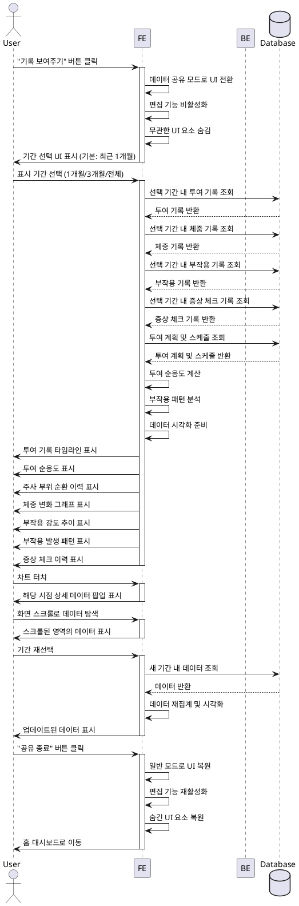

# UC-F003: 데이터 공유 모드

## Primary Actor
GLP-1 사용자

## Precondition
- 사용자가 앱에 로그인되어 있음
- 투여 기록, 체중 기록, 부작용 기록 중 최소 하나 이상 존재함
- 사용자가 의료진 또는 타인에게 기록을 보여줄 상황에 놓여 있음

## Trigger
사용자가 앱 내 "기록 보여주기" 또는 "데이터 공유 모드" 버튼을 클릭함

## Main Scenario

### 1. 공유 모드 진입
- 사용자가 홈 대시보드 또는 기록 관련 화면에서 "기록 보여주기" 버튼 선택
- 시스템이 데이터 공유 모드로 전환
- 개인화 인사, 뱃지, 설정 등 무관한 UI 요소를 숨김
- 모든 편집 기능을 비활성화하여 읽기 전용 모드로 전환
- 기간 선택 UI 표시 (기본값: 최근 1개월)

### 2. 기간 선택
- 사용자가 표시 기간 선택 (최근 1개월/3개월/전체)
- 시스템이 선택된 기간의 데이터 조회 및 집계

### 3. 데이터 렌더링
- 시스템이 가독성 높은 전용 UI로 다음 데이터를 순차 표시:
  - **투여 기록 타임라인**: 날짜별 투여 이력, 용량 변화 시각화
  - **투여 순응도**: 계획 대비 실제 투여 완료율 백분율로 표시
  - **주사 부위 순환 이력**: 복부/허벅지/상완 부위별 사용 이력 표
  - **체중 변화 그래프**: 날짜별 체중 추이, 목표 체중 라인 함께 표시
  - **부작용 강도 추이**: 증상별 심각도 변화, 용량 증량 시점 마커 표시
  - **부작용 발생 패턴**: 컨텍스트 태그별 빈도 차트
  - **증상 체크 이력**: 심각 증상 체크 기록 요약

### 4. 데이터 탐색
- 사용자가 화면 스크롤로 상세 데이터 확인
- 사용자가 차트 터치 시 해당 시점의 상세 데이터 표시
- 사용자가 기간 변경 시 데이터 재조회 및 렌더링

### 5. 공유 종료
- 사용자가 "공유 종료" 버튼 클릭
- 시스템이 일반 모드로 복귀
- 홈 대시보드로 자동 이동

## Edge Cases

### 데이터 부재
- 선택 기간에 데이터가 전혀 없는 경우: "해당 기간에 기록이 없습니다" 안내 메시지 표시
- 일부 데이터만 존재하는 경우: 존재하는 항목만 표시하고 누락된 항목은 "기록 없음" 상태로 표시

### 오작동 방지
- 공유 모드에서 편집 시도 시: "읽기 전용 모드입니다" 토스트 메시지 표시
- 백 버튼 또는 제스처로 나가기 시도 시: "공유를 종료하시겠습니까?" 확인 대화상자 표시

### 대용량 데이터
- 데이터 렌더링 시간이 1초 초과 시: 로딩 인디케이터 표시
- 전체 기간 데이터가 6개월 이상인 경우: 페이지네이션 또는 가상 스크롤 적용

### 화면 캡처
- 화면 캡처 시도 시: 제한 없이 허용 (사용자 의도에 따름)

### 데이터 로딩 실패
- 네트워크 오류 또는 데이터베이스 오류 시: 에러 메시지 및 "다시 시도" 버튼 표시
- 재시도 후에도 실패 시: 공유 모드 자동 종료 후 홈으로 복귀

## Business Rules

### BR-1: 읽기 전용 원칙
- 데이터 공유 모드에서는 모든 편집, 추가, 삭제 기능이 완전히 비활성화됨
- 사용자는 데이터 열람 및 탐색만 가능함

### BR-2: UI 단순화
- 공유 모드는 데이터 확인 목적에만 집중
- 개인화 요소(인사, 뱃지, 인사이트 등) 및 설정 메뉴는 숨김 처리
- 차트와 텍스트의 가독성을 최대화한 전용 UI 적용

### BR-3: 데이터 표시 우선순위
1. 투여 기록 및 순응도 (치료 핵심 지표)
2. 체중 변화 (치료 목표 지표)
3. 부작용 기록 (안전성 지표)
4. 증상 체크 이력 (응급 대응 지표)

### BR-4: 기간 필터
- 기본 기간: 최근 1개월
- 선택 가능 기간: 1개월/3개월/전체
- 전체 기간 선택 시 치료 시작일부터 현재까지 모든 데이터 표시

### BR-5: 화면 이동 제한
- 공유 모드 활성화 상태에서는 다른 화면으로 이동 불가
- "공유 종료" 버튼을 통해서만 모드 해제 가능
- 백 버튼 사용 시 확인 대화상자 표시 후 종료 결정

## Sequence Diagram

