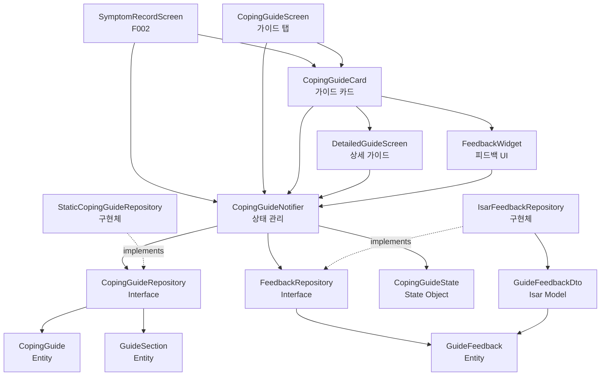

# F004: 부작용 대처 가이드 Implementation Plan

## 1. 개요

F004는 부작용 기록 완료 시 자동으로 대처 가이드를 표시하고, 가이드 탭에서 증상별 가이드를 직접 조회할 수 있는 기능입니다.

### 모듈 구조
- **CopingGuideRepository** (Domain/Infrastructure): 가이드 조회 인터페이스 및 구현 (정적 데이터)
- **FeedbackRepository** (Domain/Infrastructure): 피드백 저장 인터페이스 및 구현
- **CopingGuideNotifier** (Application): 가이드 조회, 심각도 체크 및 피드백 상태 관리
- **CopingGuideScreen** (Presentation): 가이드 탭 화면
- **CopingGuideCard** (Presentation): 가이드 카드 위젯 (심각도 경고 배너 포함)
- **FeedbackWidget** (Presentation): 피드백 UI

### TDD 적용 범위
- Unit Tests: CopingGuideService, CopingGuideRepository (70%)
- Integration Tests: CopingGuideNotifier와 Repository 연동 (20%)
- Widget Tests: CopingGuideCard, FeedbackWidget (10%)

---

## 2. Architecture Diagram



---

## 3. Implementation Plan

### 3.1. Domain Layer - CopingGuide Entity

**Location**: `lib/features/coping_guide/domain/entities/coping_guide.dart`

**Responsibility**: 가이드 데이터 구조 정의

**Test Strategy**: Unit Test

**Test Scenarios (Red Phase)**:
```dart
// AAA 패턴
group('CopingGuide', () {
  test('증상명과 간단 가이드로 생성 가능', () {
    // Arrange & Act
    final guide = CopingGuide(
      symptomName: '메스꺼움',
      shortGuide: '소량씩 자주 식사하세요',
    );

    // Assert
    expect(guide.symptomName, '메스꺼움');
    expect(guide.shortGuide, '소량씩 자주 식사하세요');
  });

  test('상세 가이드 섹션 리스트를 포함할 수 있음', () {
    // Arrange
    final sections = [
      GuideSection(title: '즉시 조치', content: '물 마시기'),
      GuideSection(title: '식이 조절', content: '기름진 음식 피하기'),
    ];

    // Act
    final guide = CopingGuide(
      symptomName: '메스꺼움',
      shortGuide: '소량씩 자주 식사하세요',
      detailedSections: sections,
    );

    // Assert
    expect(guide.detailedSections, sections);
    expect(guide.detailedSections.length, 2);
  });
});

group('GuideSection', () {
  test('제목과 내용으로 생성 가능', () {
    // Arrange & Act
    final section = GuideSection(
      title: '즉시 조치',
      content: '물을 천천히 마시세요',
    );

    // Assert
    expect(section.title, '즉시 조치');
    expect(section.content, '물을 천천히 마시세요');
  });
});

group('GuideFeedback', () {
  test('증상명, 도움 여부, 타임스탬프로 생성 가능', () {
    // Arrange & Act
    final feedback = GuideFeedback(
      symptomName: '메스꺼움',
      helpful: true,
      timestamp: DateTime(2025, 1, 1),
    );

    // Assert
    expect(feedback.symptomName, '메스꺼움');
    expect(feedback.helpful, isTrue);
    expect(feedback.timestamp, DateTime(2025, 1, 1));
  });
});

group('CopingGuideState', () {
  test('가이드와 심각도 경고 플래그로 생성 가능', () {
    // Arrange
    final guide = CopingGuide(
      symptomName: '메스꺼움',
      shortGuide: '소량씩 자주 식사하세요',
    );

    // Act
    final state = CopingGuideState(
      guide: guide,
      showSeverityWarning: true,
    );

    // Assert
    expect(state.guide, guide);
    expect(state.showSeverityWarning, isTrue);
  });
});
```

**Edge Cases**:
- 빈 증상명 처리
- 빈 가이드 내용 처리
- null 상세 섹션 처리

**Implementation Order**:
1. CopingGuide 클래스 정의 (Red)
2. GuideSection 클래스 정의 (Red)
3. GuideFeedback 클래스 정의 (Red)
4. CopingGuideState 클래스 정의 (Red)
5. 최소 구현으로 테스트 통과 (Green)
6. Immutable 구조로 리팩토링 (Refactor)

**Dependencies**: 없음

---

### 3.2. Domain Layer - CopingGuideRepository Interface

**Location**: `lib/features/coping_guide/domain/repositories/coping_guide_repository.dart`

**Responsibility**: 가이드 조회 계약 정의

**Test Strategy**: Unit Test (Mock 사용)

**Test Scenarios (Red Phase)**:
```dart
group('CopingGuideRepository', () {
  test('증상명으로 가이드 조회 가능', () async {
    // Arrange
    final mockRepo = MockCopingGuideRepository();
    final expectedGuide = CopingGuide(
      symptomName: '메스꺼움',
      shortGuide: '소량씩 자주 식사하세요',
    );
    when(() => mockRepo.getGuideBySymptom('메스꺼움'))
        .thenAnswer((_) async => expectedGuide);

    // Act
    final result = await mockRepo.getGuideBySymptom('메스꺼움');

    // Assert
    expect(result, expectedGuide);
    verify(() => mockRepo.getGuideBySymptom('메스꺼움')).called(1);
  });

  test('등록되지 않은 증상은 null 반환', () async {
    // Arrange
    final mockRepo = MockCopingGuideRepository();
    when(() => mockRepo.getGuideBySymptom('알 수 없는 증상'))
        .thenAnswer((_) async => null);

    // Act
    final result = await mockRepo.getGuideBySymptom('알 수 없는 증상');

    // Assert
    expect(result, isNull);
  });

  test('모든 증상의 가이드 목록 조회 가능', () async {
    // Arrange
    final mockRepo = MockCopingGuideRepository();
    final expectedGuides = [
      CopingGuide(symptomName: '메스꺼움', shortGuide: '...'),
      CopingGuide(symptomName: '구토', shortGuide: '...'),
    ];
    when(() => mockRepo.getAllGuides())
        .thenAnswer((_) async => expectedGuides);

    // Act
    final result = await mockRepo.getAllGuides();

    // Assert
    expect(result, expectedGuides);
    expect(result.length, 2);
  });
});
```

**Edge Cases**:
- 빈 증상명 입력
- null 입력 처리
- Repository 조회 실패 시 예외 처리

**Implementation Order**:
1. Interface 메서드 시그니처 정의 (Red)
2. Mock 구현 테스트 (Green)
3. 메서드 문서화 (Refactor)

**Dependencies**: CopingGuide Entity

---

### 3.3. Domain Layer - FeedbackRepository Interface

**Location**: `lib/features/coping_guide/domain/repositories/feedback_repository.dart`

**Responsibility**: 피드백 저장 계약 정의

**Test Strategy**: Unit Test (Mock 사용)

**Test Scenarios (Red Phase)**:
```dart
group('FeedbackRepository', () {
  test('피드백 저장 가능', () async {
    // Arrange
    final mockRepo = MockFeedbackRepository();
    final feedback = GuideFeedback(
      symptomName: '메스꺼움',
      helpful: true,
      timestamp: DateTime.now(),
    );
    when(() => mockRepo.saveFeedback(feedback))
        .thenAnswer((_) async => {});

    // Act
    await mockRepo.saveFeedback(feedback);

    // Assert
    verify(() => mockRepo.saveFeedback(feedback)).called(1);
  });

  test('증상별 피드백 조회 가능', () async {
    // Arrange
    final mockRepo = MockFeedbackRepository();
    final expectedFeedbacks = [
      GuideFeedback(
        symptomName: '메스꺼움',
        helpful: true,
        timestamp: DateTime(2025, 1, 1),
      ),
    ];
    when(() => mockRepo.getFeedbacksBySymptom('메스꺼움'))
        .thenAnswer((_) async => expectedFeedbacks);

    // Act
    final result = await mockRepo.getFeedbacksBySymptom('메스꺼움');

    // Assert
    expect(result, expectedFeedbacks);
    expect(result.length, 1);
  });
});
```

**Edge Cases**:
- 저장 실패 시 예외 처리
- null 입력 처리

**Implementation Order**:
1. Interface 메서드 시그니처 정의 (Red)
2. Mock 구현 테스트 (Green)
3. 메서드 문서화 (Refactor)

**Dependencies**: GuideFeedback Entity

---

### 3.4. Infrastructure Layer - StaticCopingGuideRepository

**Location**: `lib/features/coping_guide/infrastructure/repositories/static_coping_guide_repository.dart`

**Responsibility**: 정적 가이드 데이터 조회 (하드코딩된 데이터 반환)

**Test Strategy**: Integration Test

**Test Scenarios (Red Phase)**:
```dart
group('StaticCopingGuideRepository', () {
  late StaticCopingGuideRepository repository;

  setUp(() {
    repository = StaticCopingGuideRepository();
  });

  test('메스꺼움 증상의 가이드를 반환', () async {
    // Act
    final result = await repository.getGuideBySymptom('메스꺼움');

    // Assert
    expect(result, isNotNull);
    expect(result!.symptomName, '메스꺼움');
    expect(result.shortGuide, isNotEmpty);
    expect(result.detailedSections, isNotEmpty);
  });

  test('모든 7가지 증상의 가이드를 반환', () async {
    // Arrange
    final expectedSymptoms = ['메스꺼움', '구토', '변비', '설사', '복통', '두통', '피로'];

    // Act
    final result = await repository.getAllGuides();

    // Assert
    expect(result.length, 7);
    for (var symptom in expectedSymptoms) {
      expect(result.any((g) => g.symptomName == symptom), isTrue);
    }
  });

  test('등록되지 않은 증상은 null 반환', () async {
    // Act
    final result = await repository.getGuideBySymptom('알 수 없는 증상');

    // Assert
    expect(result, isNull);
  });

  test('가이드 데이터는 긍정적인 톤으로 작성됨', () async {
    // Act
    final guides = await repository.getAllGuides();

    // Assert
    for (var guide in guides) {
      expect(guide.shortGuide, isNot(contains('위험')));
      expect(guide.shortGuide, isNot(contains('심각')));
    }
  });
});
```

**Edge Cases**:
- 빈 가이드 데이터 처리
- 데이터 상수 초기화 실패

**Implementation Order**:
1. 하드코딩된 7가지 증상 가이드 데이터 작성 (Red)
2. Repository 인터페이스 구현 (Green)
3. 가이드 데이터 상수로 분리 (Refactor)
4. GuideSection 구조 적용 (Refactor)

**Dependencies**: CopingGuideRepository Interface

---

### 3.5. Infrastructure Layer - IsarFeedbackRepository

**Location**: `lib/features/coping_guide/infrastructure/repositories/isar_feedback_repository.dart`

**Responsibility**: Isar를 통한 피드백 저장 및 조회

**Test Strategy**: Integration Test

**Test Scenarios (Red Phase)**:
```dart
group('IsarFeedbackRepository', () {
  late Isar isar;
  late IsarFeedbackRepository repository;

  setUp(() async {
    isar = await Isar.open(
      [GuideFeedbackDtoSchema],
      directory: await getTemporaryDirectory(),
    );
    repository = IsarFeedbackRepository(isar);
  });

  tearDown(() async {
    await isar.close(deleteFromDisk: true);
  });

  test('피드백 저장 성공', () async {
    // Arrange
    final feedback = GuideFeedback(
      symptomName: '메스꺼움',
      helpful: true,
      timestamp: DateTime.now(),
    );

    // Act
    await repository.saveFeedback(feedback);

    // Assert
    final saved = await repository.getFeedbacksBySymptom('메스꺼움');
    expect(saved.length, 1);
    expect(saved.first.symptomName, '메스꺼움');
    expect(saved.first.helpful, isTrue);
  });

  test('증상별 피드백 조회', () async {
    // Arrange
    final feedback1 = GuideFeedback(
      symptomName: '메스꺼움',
      helpful: true,
      timestamp: DateTime.now(),
    );
    final feedback2 = GuideFeedback(
      symptomName: '구토',
      helpful: false,
      timestamp: DateTime.now(),
    );
    await repository.saveFeedback(feedback1);
    await repository.saveFeedback(feedback2);

    // Act
    final result = await repository.getFeedbacksBySymptom('메스꺼움');

    // Assert
    expect(result.length, 1);
    expect(result.first.symptomName, '메스꺼움');
  });
});
```

**Edge Cases**:
- Isar 초기화 실패
- 중복 피드백 저장
- 빈 증상명 처리

**Implementation Order**:
1. GuideFeedbackDto 정의 (Red)
2. saveFeedback 구현 (Green)
3. getFeedbacksBySymptom 구현 (Green)
4. 에러 핸들링 추가 (Refactor)

**Dependencies**: FeedbackRepository Interface, GuideFeedback Entity, Isar

---

### 3.6. Infrastructure Layer - GuideFeedbackDto

**Location**: `lib/features/coping_guide/infrastructure/dtos/guide_feedback_dto.dart`

**Responsibility**: Isar 피드백 데이터 모델 및 Entity 변환

**Test Strategy**: Unit Test

**Test Scenarios (Red Phase)**:
```dart
group('GuideFeedbackDto', () {
  test('Entity에서 DTO로 변환', () {
    // Arrange
    final entity = GuideFeedback(
      symptomName: '메스꺼움',
      helpful: true,
      timestamp: DateTime(2025, 1, 1),
    );

    // Act
    final dto = GuideFeedbackDto.fromEntity(entity);

    // Assert
    expect(dto.symptomName, entity.symptomName);
    expect(dto.helpful, entity.helpful);
    expect(dto.timestamp, entity.timestamp);
  });

  test('DTO에서 Entity로 변환', () {
    // Arrange
    final dto = GuideFeedbackDto()
      ..symptomName = '메스꺼움'
      ..helpful = true
      ..timestamp = DateTime(2025, 1, 1);

    // Act
    final entity = dto.toEntity();

    // Assert
    expect(entity.symptomName, dto.symptomName);
    expect(entity.helpful, dto.helpful);
    expect(entity.timestamp, dto.timestamp);
  });
});
```

**Edge Cases**:
- null 타임스탬프 처리

**Implementation Order**:
1. Isar 스키마 정의 (Red)
2. toEntity/fromEntity 메서드 구현 (Green)

**Dependencies**: GuideFeedback Entity, Isar

---

### 3.7. Application Layer - CopingGuideNotifier

**Location**: `lib/features/coping_guide/application/notifiers/coping_guide_notifier.dart`

**Responsibility**: 가이드 조회, 심각도 체크 및 피드백 상태 관리

**Test Strategy**: Unit Test (Mock Repository)

**Test Scenarios (Red Phase)**:
```dart
group('CopingGuideNotifier', () {
  late MockCopingGuideRepository mockRepo;
  late ProviderContainer container;

  setUp(() {
    mockRepo = MockCopingGuideRepository();
    container = ProviderContainer(
      overrides: [
        copingGuideRepositoryProvider.overrideWithValue(mockRepo),
      ],
    );
  });

  tearDown(() {
    container.dispose();
  });

  test('초기 상태는 loading', () {
    // Act
    final notifier = container.read(copingGuideNotifierProvider.notifier);
    final state = container.read(copingGuideNotifierProvider);

    // Assert
    expect(state, isA<AsyncLoading>());
  });

  test('증상명으로 가이드 조회 성공', () async {
    // Arrange
    final expectedGuide = CopingGuide(
      symptomName: '메스꺼움',
      shortGuide: '소량씩 자주 식사하세요',
    );
    when(() => mockRepo.getGuideBySymptom('메스꺼움'))
        .thenAnswer((_) async => expectedGuide);

    // Act
    final notifier = container.read(copingGuideNotifierProvider.notifier);
    await notifier.getGuideBySymptom('메스꺼움');

    // Assert
    final state = container.read(copingGuideNotifierProvider);
    expect(state.value, expectedGuide);
    verify(() => mockRepo.getGuideBySymptom('메스꺼움')).called(1);
  });

  test('등록되지 않은 증상은 기본 가이드 반환', () async {
    // Arrange
    when(() => mockRepo.getGuideBySymptom('알 수 없는 증상'))
        .thenAnswer((_) async => null);

    // Act
    final notifier = container.read(copingGuideNotifierProvider.notifier);
    await notifier.getGuideBySymptom('알 수 없는 증상');

    // Assert
    final state = container.read(copingGuideNotifierProvider);
    expect(state.value, isNotNull);
    expect(state.value!.symptomName, '일반');
    expect(state.value!.shortGuide, contains('전문가와 상담'));
  });

  test('모든 가이드 목록 조회', () async {
    // Arrange
    final expectedGuides = [
      CopingGuide(symptomName: '메스꺼움', shortGuide: '...'),
      CopingGuide(symptomName: '구토', shortGuide: '...'),
    ];
    when(() => mockRepo.getAllGuides())
        .thenAnswer((_) async => expectedGuides);

    // Act
    final notifier = container.read(copingGuideListNotifierProvider.notifier);
    await notifier.loadAllGuides();

    // Assert
    final state = container.read(copingGuideListNotifierProvider);
    expect(state.value, expectedGuides);
    expect(state.value!.length, 2);
  });

  test('심각도 7-10점, 24시간 이상 지속 시 경고 플래그 활성화', () async {
    // Arrange
    final expectedGuide = CopingGuide(
      symptomName: '메스꺼움',
      shortGuide: '소량씩 자주 식사하세요',
    );
    when(() => mockRepo.getGuideBySymptom('메스꺼움'))
        .thenAnswer((_) async => expectedGuide);

    // Act
    final notifier = container.read(copingGuideNotifierProvider.notifier);
    await notifier.checkSeverityAndGuide('메스꺼움', 8, '24시간 이상');

    // Assert
    final state = container.read(copingGuideNotifierProvider);
    expect(state.value!.guide, expectedGuide);
    expect(state.value!.showSeverityWarning, isTrue);
  });

  test('심각도 6점 이하는 경고 플래그 비활성화', () async {
    // Arrange
    final expectedGuide = CopingGuide(
      symptomName: '메스꺼움',
      shortGuide: '소량씩 자주 식사하세요',
    );
    when(() => mockRepo.getGuideBySymptom('메스꺼움'))
        .thenAnswer((_) async => expectedGuide);

    // Act
    final notifier = container.read(copingGuideNotifierProvider.notifier);
    await notifier.checkSeverityAndGuide('메스꺼움', 5, '24시간 이상');

    // Assert
    final state = container.read(copingGuideNotifierProvider);
    expect(state.value!.showSeverityWarning, isFalse);
  });

  test('피드백 제출 및 저장', () async {
    // Arrange
    final mockFeedbackRepo = MockFeedbackRepository();
    container = ProviderContainer(
      overrides: [
        copingGuideRepositoryProvider.overrideWithValue(mockRepo),
        feedbackRepositoryProvider.overrideWithValue(mockFeedbackRepo),
      ],
    );
    when(() => mockFeedbackRepo.saveFeedback(any()))
        .thenAnswer((_) async => {});

    // Act
    final notifier = container.read(copingGuideNotifierProvider.notifier);
    await notifier.submitFeedback('메스꺼움', helpful: true);

    // Assert
    verify(() => mockFeedbackRepo.saveFeedback(any())).called(1);
  });
});
```

**Edge Cases**:
- Repository 조회 실패 시 에러 상태
- 피드백 저장 실패 시 에러 처리
- 동시 다발적인 조회 요청

**Implementation Order**:
1. AsyncNotifier 기본 구조 작성 (Red)
2. getGuideBySymptom 구현 (Green)
3. 기본 가이드 fallback 로직 추가 (Green)
4. checkSeverityAndGuide 구현 (심각도 체크 로직) (Green)
5. submitFeedback 구현 (피드백 저장) (Green)
6. getAllGuides Provider 추가 (Refactor)

**Dependencies**: CopingGuideRepository, FeedbackRepository

---

### 3.8. Presentation Layer - CopingGuideCard Widget

**Location**: `lib/features/coping_guide/presentation/widgets/coping_guide_card.dart`

**Responsibility**: 간단 버전 가이드 카드 UI (심각도 경고 배너 포함)

**Test Strategy**: Widget Test

**Test Scenarios (Red Phase)**:
```dart
group('CopingGuideCard', () {
  testWidgets('증상명과 간단 가이드 표시', (tester) async {
    // Arrange
    final guide = CopingGuide(
      symptomName: '메스꺼움',
      shortGuide: '소량씩 자주 식사하세요',
    );

    // Act
    await tester.pumpWidget(
      MaterialApp(
        home: Scaffold(
          body: CopingGuideCard(guide: guide),
        ),
      ),
    );

    // Assert
    expect(find.text('메스꺼움 대처 가이드'), findsOneWidget);
    expect(find.text('소량씩 자주 식사하세요'), findsOneWidget);
  });

  testWidgets('"더 자세한 가이드 보기" 버튼 표시', (tester) async {
    // Arrange
    final guide = CopingGuide(
      symptomName: '메스꺼움',
      shortGuide: '...',
    );

    // Act
    await tester.pumpWidget(
      MaterialApp(
        home: Scaffold(
          body: CopingGuideCard(guide: guide),
        ),
      ),
    );

    // Assert
    expect(find.text('더 자세한 가이드 보기'), findsOneWidget);
  });

  testWidgets('피드백 위젯 표시', (tester) async {
    // Arrange
    final guide = CopingGuide(
      symptomName: '메스꺼움',
      shortGuide: '...',
    );

    // Act
    await tester.pumpWidget(
      MaterialApp(
        home: Scaffold(
          body: CopingGuideCard(guide: guide),
        ),
      ),
    );

    // Assert
    expect(find.text('도움이 되었나요?'), findsOneWidget);
    expect(find.text('예'), findsOneWidget);
    expect(find.text('아니오'), findsOneWidget);
  });

  testWidgets('"더 자세한 가이드 보기" 탭 시 상세 화면 이동', (tester) async {
    // Arrange
    final guide = CopingGuide(
      symptomName: '메스꺼움',
      shortGuide: '...',
    );
    bool navigated = false;

    // Act
    await tester.pumpWidget(
      MaterialApp(
        home: Scaffold(
          body: CopingGuideCard(
            guide: guide,
            onDetailTap: () => navigated = true,
          ),
        ),
      ),
    );
    await tester.tap(find.text('더 자세한 가이드 보기'));
    await tester.pumpAndSettle();

    // Assert
    expect(navigated, isTrue);
  });

  testWidgets('심각도 경고 플래그 활성화 시 경고 배너 표시', (tester) async {
    // Arrange
    final state = CopingGuideState(
      guide: CopingGuide(
        symptomName: '메스꺼움',
        shortGuide: '...',
      ),
      showSeverityWarning: true,
    );

    // Act
    await tester.pumpWidget(
      MaterialApp(
        home: Scaffold(
          body: CopingGuideCard(state: state),
        ),
      ),
    );

    // Assert
    expect(find.text('증상이 심각하거나 지속됩니다'), findsOneWidget);
    expect(find.text('증상 체크하기'), findsOneWidget);
  });

  testWidgets('경고 배너의 "증상 체크하기" 버튼 탭 시 F005 화면 이동', (tester) async {
    // Arrange
    final state = CopingGuideState(
      guide: CopingGuide(
        symptomName: '메스꺼움',
        shortGuide: '...',
      ),
      showSeverityWarning: true,
    );
    bool navigatedToF005 = false;

    // Act
    await tester.pumpWidget(
      MaterialApp(
        home: Scaffold(
          body: CopingGuideCard(
            state: state,
            onCheckSymptom: () => navigatedToF005 = true,
          ),
        ),
      ),
    );
    await tester.tap(find.text('증상 체크하기'));
    await tester.pumpAndSettle();

    // Assert
    expect(navigatedToF005, isTrue);
  });
});
```

**Edge Cases**:
- 긴 텍스트 줄바꿈 처리
- 다크모드 대응
- 심각도 경고와 일반 모드 전환

**Implementation Order**:
1. 기본 카드 레이아웃 (Red)
2. 텍스트 표시 (Green)
3. 버튼 추가 (Green)
4. FeedbackWidget 통합 (Refactor)
5. SeverityWarningBanner 추가 (심각도 경고 배너) (Green)
6. 스타일링 적용 (Refactor)

**Dependencies**: CopingGuide Entity, CopingGuideState, FeedbackWidget

**QA Sheet**:
- [ ] 카드가 화면에 정상 표시됨
- [ ] 증상명이 카드 상단에 표시됨
- [ ] 간단 가이드 텍스트가 읽기 쉬움
- [ ] "더 자세한 가이드 보기" 버튼 탭 시 상세 화면 이동
- [ ] 피드백 버튼이 하단에 표시됨
- [ ] 심각도 경고 배너가 조건부로 표시됨
- [ ] 경고 배너 탭 시 F005 화면 이동

---

### 3.9. Presentation Layer - DetailedGuideScreen

**Location**: `lib/features/coping_guide/presentation/screens/detailed_guide_screen.dart`

**Responsibility**: 단계별 상세 가이드 화면

**Test Strategy**: Widget Test

**Test Scenarios (Red Phase)**:
```dart
group('DetailedGuideScreen', () {
  testWidgets('증상명을 제목으로 표시', (tester) async {
    // Arrange
    final guide = CopingGuide(
      symptomName: '메스꺼움',
      shortGuide: '...',
      detailedSections: [],
    );

    // Act
    await tester.pumpWidget(
      MaterialApp(
        home: DetailedGuideScreen(guide: guide),
      ),
    );

    // Assert
    expect(find.text('메스꺼움 대처 가이드'), findsOneWidget);
  });

  testWidgets('4가지 섹션을 순서대로 표시', (tester) async {
    // Arrange
    final guide = CopingGuide(
      symptomName: '메스꺼움',
      shortGuide: '...',
      detailedSections: [
        GuideSection(title: '즉시 조치', content: '물 마시기'),
        GuideSection(title: '식이 조절', content: '기름진 음식 피하기'),
        GuideSection(title: '생활 습관', content: '충분한 휴식'),
        GuideSection(title: '경과 관찰', content: '3일 후에도 지속 시 상담'),
      ],
    );

    // Act
    await tester.pumpWidget(
      MaterialApp(
        home: DetailedGuideScreen(guide: guide),
      ),
    );

    // Assert
    expect(find.text('즉시 조치'), findsOneWidget);
    expect(find.text('식이 조절'), findsOneWidget);
    expect(find.text('생활 습관'), findsOneWidget);
    expect(find.text('경과 관찰'), findsOneWidget);
  });

  testWidgets('스크롤 가능', (tester) async {
    // Arrange
    final guide = CopingGuide(
      symptomName: '메스꺼움',
      shortGuide: '...',
      detailedSections: List.generate(
        10,
        (i) => GuideSection(title: '섹션 $i', content: '내용 ' * 50),
      ),
    );

    // Act
    await tester.pumpWidget(
      MaterialApp(
        home: DetailedGuideScreen(guide: guide),
      ),
    );

    // Assert
    expect(find.byType(ListView), findsOneWidget);
  });
});
```

**Edge Cases**:
- detailedSections가 비어있는 경우
- 매우 긴 텍스트 처리

**Implementation Order**:
1. Scaffold 기본 구조 (Red)
2. AppBar 추가 (Green)
3. ListView로 섹션 표시 (Green)
4. 섹션 구분선 추가 (Refactor)
5. 스타일링 적용 (Refactor)

**Dependencies**: CopingGuide Entity

**QA Sheet**:
- [ ] 상세 가이드 화면이 정상 표시됨
- [ ] 4가지 섹션이 명확히 구분됨
- [ ] 스크롤이 부드러움
- [ ] 뒤로가기 버튼 동작
- [ ] 텍스트 가독성이 높음

---

### 3.10. Presentation Layer - FeedbackWidget

**Location**: `lib/features/coping_guide/presentation/widgets/feedback_widget.dart`

**Responsibility**: 피드백 UI 및 상호작용

**Test Strategy**: Widget Test

**Test Scenarios (Red Phase)**:
```dart
group('FeedbackWidget', () {
  testWidgets('"도움이 되었나요?" 텍스트 표시', (tester) async {
    // Act
    await tester.pumpWidget(
      MaterialApp(
        home: Scaffold(
          body: FeedbackWidget(
            onFeedback: (helpful) {},
          ),
        ),
      ),
    );

    // Assert
    expect(find.text('도움이 되었나요?'), findsOneWidget);
  });

  testWidgets('"예", "아니오" 버튼 표시', (tester) async {
    // Act
    await tester.pumpWidget(
      MaterialApp(
        home: Scaffold(
          body: FeedbackWidget(
            onFeedback: (helpful) {},
          ),
        ),
      ),
    );

    // Assert
    expect(find.text('예'), findsOneWidget);
    expect(find.text('아니오'), findsOneWidget);
  });

  testWidgets('"예" 탭 시 콜백 호출 및 감사 메시지 표시', (tester) async {
    // Arrange
    bool? callbackResult;

    // Act
    await tester.pumpWidget(
      MaterialApp(
        home: Scaffold(
          body: FeedbackWidget(
            onFeedback: (helpful) => callbackResult = helpful,
          ),
        ),
      ),
    );
    await tester.tap(find.text('예'));
    await tester.pumpAndSettle();

    // Assert
    expect(callbackResult, isTrue);
    expect(find.text('도움이 되어 기쁩니다!'), findsOneWidget);
  });

  testWidgets('"아니오" 탭 시 추가 옵션 표시', (tester) async {
    // Arrange
    bool? callbackResult;

    // Act
    await tester.pumpWidget(
      MaterialApp(
        home: Scaffold(
          body: FeedbackWidget(
            onFeedback: (helpful) => callbackResult = helpful,
          ),
        ),
      ),
    );
    await tester.tap(find.text('아니오'));
    await tester.pumpAndSettle();

    // Assert
    expect(callbackResult, isFalse);
    expect(find.text('더 자세한 가이드 보기'), findsOneWidget);
  });
});
```

**Edge Cases**:
- 빠른 연속 탭 방지
- 피드백 제출 실패 시 재시도

**Implementation Order**:
1. 기본 레이아웃 (Red)
2. 버튼 추가 (Green)
3. 상태 관리 추가 (Green)
4. 감사 메시지 표시 로직 (Green)
5. "아니오" 선택 시 상세 가이드로 이동 (Refactor)

**Dependencies**: 없음

**QA Sheet**:
- [ ] 피드백 질문이 명확히 표시됨
- [ ] 버튼 탭 시 즉시 반응
- [ ] 감사 메시지가 자연스럽게 표시됨
- [ ] "아니오" 선택 시 상세 가이드로 자연스럽게 이동

---

### 3.11. Presentation Layer - CopingGuideScreen

**Location**: `lib/features/coping_guide/presentation/screens/coping_guide_screen.dart`

**Responsibility**: 가이드 탭 화면 (증상 목록 및 직접 조회)

**Test Strategy**: Widget Test

**Test Scenarios (Red Phase)**:
```dart
group('CopingGuideScreen', () {
  testWidgets('7가지 증상 목록 표시', (tester) async {
    // Arrange
    final container = ProviderContainer(
      overrides: [
        copingGuideListNotifierProvider.overrideWith((ref) {
          return MockCopingGuideListNotifier([
            CopingGuide(symptomName: '메스꺼움', shortGuide: '...'),
            CopingGuide(symptomName: '구토', shortGuide: '...'),
            CopingGuide(symptomName: '변비', shortGuide: '...'),
            CopingGuide(symptomName: '설사', shortGuide: '...'),
            CopingGuide(symptomName: '복통', shortGuide: '...'),
            CopingGuide(symptomName: '두통', shortGuide: '...'),
            CopingGuide(symptomName: '피로', shortGuide: '...'),
          ]);
        }),
      ],
    );

    // Act
    await tester.pumpWidget(
      UncontrolledProviderScope(
        container: container,
        child: MaterialApp(
          home: CopingGuideScreen(),
        ),
      ),
    );
    await tester.pumpAndSettle();

    // Assert
    expect(find.text('메스꺼움'), findsOneWidget);
    expect(find.text('구토'), findsOneWidget);
    expect(find.text('변비'), findsOneWidget);
    expect(find.text('설사'), findsOneWidget);
    expect(find.text('복통'), findsOneWidget);
    expect(find.text('두통'), findsOneWidget);
    expect(find.text('피로'), findsOneWidget);
  });

  testWidgets('증상 탭 시 가이드 카드 표시', (tester) async {
    // Arrange
    final container = ProviderContainer(
      overrides: [
        copingGuideListNotifierProvider.overrideWith((ref) {
          return MockCopingGuideListNotifier([
            CopingGuide(symptomName: '메스꺼움', shortGuide: '소량씩 자주 식사하세요'),
          ]);
        }),
      ],
    );

    // Act
    await tester.pumpWidget(
      UncontrolledProviderScope(
        container: container,
        child: MaterialApp(
          home: CopingGuideScreen(),
        ),
      ),
    );
    await tester.pumpAndSettle();
    await tester.tap(find.text('메스꺼움'));
    await tester.pumpAndSettle();

    // Assert
    expect(find.text('소량씩 자주 식사하세요'), findsOneWidget);
  });

  testWidgets('로딩 중 인디케이터 표시', (tester) async {
    // Arrange
    final container = ProviderContainer(
      overrides: [
        copingGuideListNotifierProvider.overrideWith((ref) {
          return MockCopingGuideListNotifier(null, isLoading: true);
        }),
      ],
    );

    // Act
    await tester.pumpWidget(
      UncontrolledProviderScope(
        container: container,
        child: MaterialApp(
          home: CopingGuideScreen(),
        ),
      ),
    );

    // Assert
    expect(find.byType(CircularProgressIndicator), findsOneWidget);
  });
});
```

**Edge Cases**:
- 데이터 로딩 실패 시 에러 메시지
- 빈 목록 처리

**Implementation Order**:
1. Scaffold 기본 구조 (Red)
2. ListView 추가 (Green)
3. Provider 연동 (Green)
4. 로딩/에러 상태 처리 (Refactor)
5. 탭 인터랙션 추가 (Refactor)

**Dependencies**: CopingGuideNotifier, CopingGuideCard

**QA Sheet**:
- [ ] 가이드 탭 화면이 정상 표시됨
- [ ] 7가지 증상이 모두 나열됨
- [ ] 증상 탭 시 가이드가 표시됨
- [ ] 로딩 인디케이터가 자연스러움
- [ ] 에러 발생 시 안내 메시지 표시

---

## 4. TDD Workflow

### 단계별 진행 순서

1. **Domain Entities 구현** (Inside-Out)
   - Red: CopingGuide, GuideSection, GuideFeedback, CopingGuideState 테스트 작성
   - Green: 최소 구현
   - Refactor: Immutable 구조로 개선
   - Commit: "feat: add CopingGuide entities"

2. **Repository Interfaces 정의**
   - Red: CopingGuideRepository, FeedbackRepository 인터페이스 테스트 (Mock)
   - Green: Interfaces 정의
   - Refactor: 문서화 추가
   - Commit: "feat: add repository interfaces"

3. **Infrastructure - StaticCopingGuideRepository 구현**
   - Red: StaticCopingGuideRepository 테스트
   - Green: 하드코딩된 7가지 증상 가이드 반환
   - Refactor: 가이드 데이터 상수화
   - Commit: "feat: implement StaticCopingGuideRepository"

4. **Infrastructure - FeedbackRepository 구현**
   - Red: GuideFeedbackDto 변환 테스트
   - Green: fromEntity/toEntity 구현
   - Red: IsarFeedbackRepository 테스트
   - Green: 피드백 저장 및 조회 구현
   - Commit: "feat: implement IsarFeedbackRepository"

5. **Application - Notifier 구현**
   - Red: CopingGuideNotifier 테스트 (조회, 심각도 체크, 피드백)
   - Green: getGuideBySymptom 구현
   - Green: checkSeverityAndGuide 구현 (심각도 로직)
   - Green: submitFeedback 구현 (피드백 저장)
   - Refactor: 기본 가이드 fallback 추가
   - Commit: "feat: add CopingGuideNotifier with severity check"

6. **Presentation - FeedbackWidget**
   - Red: Widget 테스트
   - Green: 기본 UI 구현
   - Refactor: "아니오" 선택 시 상세 가이드 이동
   - Commit: "feat: add FeedbackWidget"

7. **Presentation - SeverityWarningBanner**
   - Red: Widget 테스트
   - Green: 경고 배너 UI 구현
   - Refactor: F005 화면 연동
   - Commit: "feat: add SeverityWarningBanner"

8. **Presentation - CopingGuideCard**
   - Red: Widget 테스트
   - Green: 카드 레이아웃 구현
   - Refactor: FeedbackWidget 및 SeverityWarningBanner 통합
   - Commit: "feat: add CopingGuideCard with severity warning"

9. **Presentation - DetailedGuideScreen**
   - Red: Widget 테스트
   - Green: 상세 화면 구현
   - Refactor: 스타일링 개선
   - Commit: "feat: add DetailedGuideScreen"

10. **Presentation - CopingGuideScreen**
    - Red: Widget 테스트
    - Green: 목록 화면 구현
    - Refactor: Provider 연동 및 에러 처리
    - Commit: "feat: add CopingGuideScreen"

11. **F002 연동 테스트**
    - Integration Test: 증상 기록 후 가이드 자동 표시 (심각도 체크 포함)
    - Commit: "feat: integrate coping guide with symptom tracking"

12. **F005 연동 테스트**
    - Integration Test: 심각 증상 시 F005 화면 이동
    - Commit: "feat: integrate severity check with F005"

### Commit 포인트
- 각 모듈의 Red → Green → Refactor 사이클 완료 시
- 테스트가 모두 통과한 상태에서만 커밋
- 커밋 메시지는 conventional commits 형식 준수

### 완료 기준
- [ ] 모든 Unit Tests 통과
- [ ] 모든 Widget Tests 통과
- [ ] Integration Tests 통과 (F002 연동)
- [ ] Code Coverage 80% 이상
- [ ] QA Sheet 모든 항목 확인
- [ ] 문서화 완료

---

## 5. 핵심 원칙 준수

### Layer Dependency
```
Presentation → Application → Domain ← Infrastructure
```

### Repository Pattern
- Application/Presentation은 Repository Interface만 의존
- Infrastructure에서 StaticCopingGuideRepository (가이드 조회), IsarFeedbackRepository (피드백 저장) 구현
- Phase 1 전환 시 SupabaseCopingGuideRepository, SupabaseFeedbackRepository로 1줄 변경

### Test-First Approach
- 모든 코드 작성 전 테스트 작성
- Red → Green → Refactor 사이클 엄격히 준수
- 테스트는 행동(behavior) 검증, 구현 세부사항은 테스트하지 않음

### FIRST Principles
- Fast: 모든 테스트는 밀리초 단위로 실행
- Independent: 테스트 간 공유 상태 없음
- Repeatable: 동일한 결과 보장
- Self-validating: Pass/Fail 명확
- Timely: 코드 작성 직전에 테스트 작성

### Code Quality
- 모든 코드는 분석 도구 경고 없음 (flutter analyze)
- 테스트 코드도 프로덕션 코드 수준 품질 유지
- 작은 단위로 커밋하여 이력 추적 용이

---

## 6. plancheck.md 반영 사항

### Critical Priority 수정 (필수)

**1. 피드백 저장 기능 추가 (plancheck 1.1)**
- GuideFeedback Entity 추가 (Domain Layer)
- FeedbackRepository Interface 추가 (Domain Layer)
- IsarFeedbackRepository 구현 추가 (Infrastructure Layer)
- GuideFeedbackDto 추가 (Infrastructure Layer)
- CopingGuideNotifier.submitFeedback() 실제 저장 로직 구현
- 피드백 저장 테스트 시나리오 추가

**2. 심각 증상 연계 로직 추가 (plancheck 1.2)**
- CopingGuideState Entity 추가 (showSeverityWarning 플래그 포함)
- CopingGuideNotifier.checkSeverityAndGuide() 메서드 추가
  - 심각도 7-10점 AND 24시간 이상 지속 시 경고 플래그 활성화
- SeverityWarningBanner Widget 추가 (Presentation Layer)
- CopingGuideCard에 심각도 경고 배너 통합
- F005 화면 연동 로직 추가
- 심각도 체크 테스트 시나리오 추가

### Medium Priority 수정 (강력 권장)

**3. 가이드 데이터 관리 단순화 (plancheck 1.4)**
- IsarCopingGuideRepository → StaticCopingGuideRepository로 변경
  - Phase 0에서 정적 데이터만 사용하므로 Isar DB 구조 제거
  - 하드코딩된 Map 또는 상수로 7가지 증상 가이드 관리
  - DTO 변환 오버헤드 제거
- CopingGuideDto 제거 (가이드 데이터는 정적이므로 불필요)
- 테스트 단순화 (Isar 의존성 제거)

**4. "다른 팁 보기" 기능 명확화 (plancheck 1.3)**
- "아니오" 선택 시 즉시 DetailedGuideScreen(상세 가이드)로 이동
- alternativeTips 필드는 추가하지 않음 (Phase 1로 연기)
- FeedbackWidget 로직 단순화

### 미반영 사항 (Low Priority)

**5. 여러 증상 동시 기록 처리 (plancheck 1.5)**
- Phase 0에서는 단일 증상 가이드 표시만 구현
- Phase 1에서 MultipleSymptomsGuideSelector Widget 추가 검토

### 수정 후 검증 항목
- [ ] spec.md의 BR-005 (피드백 저장) 반영
- [ ] spec.md의 BR-007 (심각 증상 연계) 반영
- [ ] spec.md의 Edge Case 5, 6 (정적 데이터 관리) 반영
- [ ] Layer Dependency 위배 없음
- [ ] Repository Pattern 올바르게 적용
- [ ] 모든 시나리오 테스트 포함
