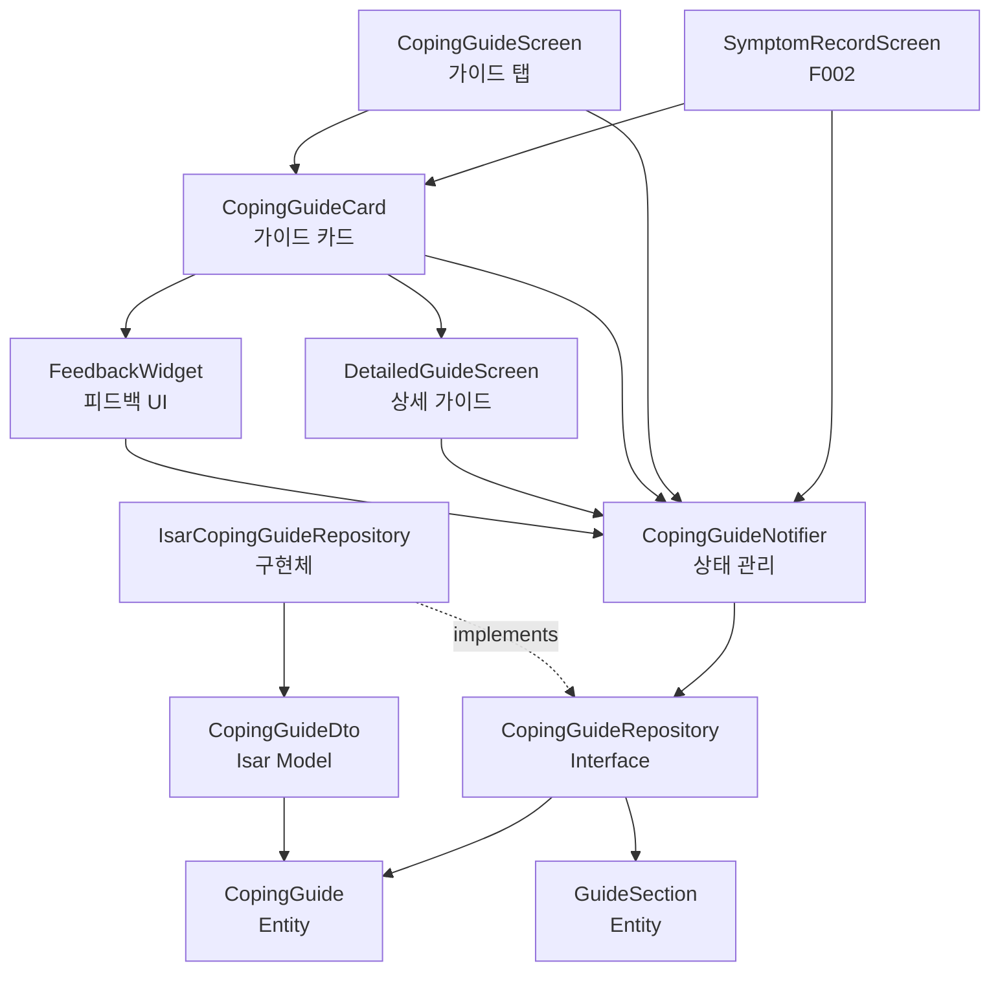

# F004: 부작용 대처 가이드 Implementation Plan

## 1. 개요

F004는 부작용 기록 완료 시 자동으로 대처 가이드를 표시하고, 가이드 탭에서 증상별 가이드를 직접 조회할 수 있는 기능입니다.

### 모듈 구조
- **CopingGuideService** (Domain): 증상별 가이드 데이터 관리 (정적 데이터)
- **CopingGuideRepository** (Domain/Infrastructure): 가이드 조회 인터페이스 및 구현
- **CopingGuideNotifier** (Application): 가이드 조회 및 피드백 상태 관리
- **CopingGuideScreen** (Presentation): 가이드 탭 화면
- **CopingGuideCard** (Presentation): 가이드 카드 위젯
- **FeedbackWidget** (Presentation): 피드백 UI

### TDD 적용 범위
- Unit Tests: CopingGuideService, CopingGuideRepository (70%)
- Integration Tests: CopingGuideNotifier와 Repository 연동 (20%)
- Widget Tests: CopingGuideCard, FeedbackWidget (10%)

---

## 2. Architecture Diagram



---

## 3. Implementation Plan

### 3.1. Domain Layer - CopingGuide Entity

**Location**: `lib/features/coping_guide/domain/entities/coping_guide.dart`

**Responsibility**: 가이드 데이터 구조 정의

**Test Strategy**: Unit Test

**Test Scenarios (Red Phase)**:
```dart
// AAA 패턴
group('CopingGuide', () {
  test('증상명과 간단 가이드로 생성 가능', () {
    // Arrange & Act
    final guide = CopingGuide(
      symptomName: '메스꺼움',
      shortGuide: '소량씩 자주 식사하세요',
    );

    // Assert
    expect(guide.symptomName, '메스꺼움');
    expect(guide.shortGuide, '소량씩 자주 식사하세요');
  });

  test('상세 가이드 섹션 리스트를 포함할 수 있음', () {
    // Arrange
    final sections = [
      GuideSection(title: '즉시 조치', content: '물 마시기'),
      GuideSection(title: '식이 조절', content: '기름진 음식 피하기'),
    ];

    // Act
    final guide = CopingGuide(
      symptomName: '메스꺼움',
      shortGuide: '소량씩 자주 식사하세요',
      detailedSections: sections,
    );

    // Assert
    expect(guide.detailedSections, sections);
    expect(guide.detailedSections.length, 2);
  });
});

group('GuideSection', () {
  test('제목과 내용으로 생성 가능', () {
    // Arrange & Act
    final section = GuideSection(
      title: '즉시 조치',
      content: '물을 천천히 마시세요',
    );

    // Assert
    expect(section.title, '즉시 조치');
    expect(section.content, '물을 천천히 마시세요');
  });
});
```

**Edge Cases**:
- 빈 증상명 처리
- 빈 가이드 내용 처리
- null 상세 섹션 처리

**Implementation Order**:
1. CopingGuide 클래스 정의 (Red)
2. GuideSection 클래스 정의 (Red)
3. 최소 구현으로 테스트 통과 (Green)
4. Immutable 구조로 리팩토링 (Refactor)

**Dependencies**: 없음

---

### 3.2. Domain Layer - CopingGuideRepository Interface

**Location**: `lib/features/coping_guide/domain/repositories/coping_guide_repository.dart`

**Responsibility**: 가이드 조회 계약 정의

**Test Strategy**: Unit Test (Mock 사용)

**Test Scenarios (Red Phase)**:
```dart
group('CopingGuideRepository', () {
  test('증상명으로 가이드 조회 가능', () async {
    // Arrange
    final mockRepo = MockCopingGuideRepository();
    final expectedGuide = CopingGuide(
      symptomName: '메스꺼움',
      shortGuide: '소량씩 자주 식사하세요',
    );
    when(() => mockRepo.getGuideBySymptom('메스꺼움'))
        .thenAnswer((_) async => expectedGuide);

    // Act
    final result = await mockRepo.getGuideBySymptom('메스꺼움');

    // Assert
    expect(result, expectedGuide);
    verify(() => mockRepo.getGuideBySymptom('메스꺼움')).called(1);
  });

  test('등록되지 않은 증상은 null 반환', () async {
    // Arrange
    final mockRepo = MockCopingGuideRepository();
    when(() => mockRepo.getGuideBySymptom('알 수 없는 증상'))
        .thenAnswer((_) async => null);

    // Act
    final result = await mockRepo.getGuideBySymptom('알 수 없는 증상');

    // Assert
    expect(result, isNull);
  });

  test('모든 증상의 가이드 목록 조회 가능', () async {
    // Arrange
    final mockRepo = MockCopingGuideRepository();
    final expectedGuides = [
      CopingGuide(symptomName: '메스꺼움', shortGuide: '...'),
      CopingGuide(symptomName: '구토', shortGuide: '...'),
    ];
    when(() => mockRepo.getAllGuides())
        .thenAnswer((_) async => expectedGuides);

    // Act
    final result = await mockRepo.getAllGuides();

    // Assert
    expect(result, expectedGuides);
    expect(result.length, 2);
  });
});
```

**Edge Cases**:
- 빈 증상명 입력
- null 입력 처리
- Repository 조회 실패 시 예외 처리

**Implementation Order**:
1. Interface 메서드 시그니처 정의 (Red)
2. Mock 구현 테스트 (Green)
3. 메서드 문서화 (Refactor)

**Dependencies**: CopingGuide Entity

---

### 3.3. Infrastructure Layer - IsarCopingGuideRepository

**Location**: `lib/features/coping_guide/infrastructure/repositories/isar_coping_guide_repository.dart`

**Responsibility**: Isar를 통한 정적 가이드 데이터 조회 (Phase 0에서는 하드코딩된 데이터 반환)

**Test Strategy**: Integration Test

**Test Scenarios (Red Phase)**:
```dart
group('IsarCopingGuideRepository', () {
  late Isar isar;
  late IsarCopingGuideRepository repository;

  setUp(() async {
    // Arrange - 테스트용 Isar 인스턴스 생성
    isar = await Isar.open(
      [CopingGuideSchema],
      directory: await getTemporaryDirectory(),
    );
    repository = IsarCopingGuideRepository(isar);
  });

  tearDown(() async {
    await isar.close(deleteFromDisk: true);
  });

  test('메스꺼움 증상의 가이드를 반환', () async {
    // Act
    final result = await repository.getGuideBySymptom('메스꺼움');

    // Assert
    expect(result, isNotNull);
    expect(result!.symptomName, '메스꺼움');
    expect(result.shortGuide, isNotEmpty);
    expect(result.detailedSections, isNotEmpty);
  });

  test('모든 7가지 증상의 가이드를 반환', () async {
    // Arrange
    final expectedSymptoms = ['메스꺼움', '구토', '변비', '설사', '복통', '두통', '피로'];

    // Act
    final result = await repository.getAllGuides();

    // Assert
    expect(result.length, 7);
    for (var symptom in expectedSymptoms) {
      expect(result.any((g) => g.symptomName == symptom), isTrue);
    }
  });

  test('등록되지 않은 증상은 null 반환', () async {
    // Act
    final result = await repository.getGuideBySymptom('알 수 없는 증상');

    // Assert
    expect(result, isNull);
  });

  test('가이드 데이터는 긍정적인 톤으로 작성됨', () async {
    // Act
    final guides = await repository.getAllGuides();

    // Assert
    for (var guide in guides) {
      expect(guide.shortGuide, isNot(contains('위험')));
      expect(guide.shortGuide, isNot(contains('심각')));
    }
  });
});
```

**Edge Cases**:
- Isar 초기화 실패
- 데이터 파싱 오류
- 빈 가이드 데이터 처리

**Implementation Order**:
1. 하드코딩된 7가지 증상 가이드 데이터 작성 (Red)
2. Repository 인터페이스 구현 (Green)
3. 가이드 데이터 상수로 분리 (Refactor)
4. GuideSection 구조 적용 (Refactor)

**Dependencies**: CopingGuideRepository Interface, Isar

---

### 3.4. Infrastructure Layer - CopingGuideDto

**Location**: `lib/features/coping_guide/infrastructure/dtos/coping_guide_dto.dart`

**Responsibility**: Isar 데이터 모델 및 Entity 변환

**Test Strategy**: Unit Test

**Test Scenarios (Red Phase)**:
```dart
group('CopingGuideDto', () {
  test('Entity에서 DTO로 변환', () {
    // Arrange
    final entity = CopingGuide(
      symptomName: '메스꺼움',
      shortGuide: '소량씩 자주 식사하세요',
      detailedSections: [
        GuideSection(title: '즉시 조치', content: '물 마시기'),
      ],
    );

    // Act
    final dto = CopingGuideDto.fromEntity(entity);

    // Assert
    expect(dto.symptomName, entity.symptomName);
    expect(dto.shortGuide, entity.shortGuide);
  });

  test('DTO에서 Entity로 변환', () {
    // Arrange
    final dto = CopingGuideDto()
      ..symptomName = '메스꺼움'
      ..shortGuide = '소량씩 자주 식사하세요';

    // Act
    final entity = dto.toEntity();

    // Assert
    expect(entity.symptomName, dto.symptomName);
    expect(entity.shortGuide, dto.shortGuide);
  });

  test('JSON 직렬화/역직렬화 (detailedSections)', () {
    // Arrange
    final sections = [
      GuideSection(title: '즉시 조치', content: '물 마시기'),
      GuideSection(title: '식이 조절', content: '기름진 음식 피하기'),
    ];
    final dto = CopingGuideDto()
      ..symptomName = '메스꺼움'
      ..shortGuide = '...'
      ..detailedSectionsJson = jsonEncode(
        sections.map((s) => {'title': s.title, 'content': s.content}).toList(),
      );

    // Act
    final entity = dto.toEntity();

    // Assert
    expect(entity.detailedSections, isNotNull);
    expect(entity.detailedSections!.length, 2);
    expect(entity.detailedSections![0].title, '즉시 조치');
  });
});
```

**Edge Cases**:
- JSON 파싱 실패
- null detailedSections 처리

**Implementation Order**:
1. Isar 스키마 정의 (Red)
2. toEntity/fromEntity 메서드 구현 (Green)
3. JSON 직렬화 로직 추가 (Refactor)

**Dependencies**: CopingGuide Entity, Isar

---

### 3.5. Application Layer - CopingGuideNotifier

**Location**: `lib/features/coping_guide/application/notifiers/coping_guide_notifier.dart`

**Responsibility**: 가이드 조회 및 피드백 상태 관리

**Test Strategy**: Unit Test (Mock Repository)

**Test Scenarios (Red Phase)**:
```dart
group('CopingGuideNotifier', () {
  late MockCopingGuideRepository mockRepo;
  late ProviderContainer container;

  setUp(() {
    mockRepo = MockCopingGuideRepository();
    container = ProviderContainer(
      overrides: [
        copingGuideRepositoryProvider.overrideWithValue(mockRepo),
      ],
    );
  });

  tearDown(() {
    container.dispose();
  });

  test('초기 상태는 loading', () {
    // Act
    final notifier = container.read(copingGuideNotifierProvider.notifier);
    final state = container.read(copingGuideNotifierProvider);

    // Assert
    expect(state, isA<AsyncLoading>());
  });

  test('증상명으로 가이드 조회 성공', () async {
    // Arrange
    final expectedGuide = CopingGuide(
      symptomName: '메스꺼움',
      shortGuide: '소량씩 자주 식사하세요',
    );
    when(() => mockRepo.getGuideBySymptom('메스꺼움'))
        .thenAnswer((_) async => expectedGuide);

    // Act
    final notifier = container.read(copingGuideNotifierProvider.notifier);
    await notifier.getGuideBySymptom('메스꺼움');

    // Assert
    final state = container.read(copingGuideNotifierProvider);
    expect(state.value, expectedGuide);
    verify(() => mockRepo.getGuideBySymptom('메스꺼움')).called(1);
  });

  test('등록되지 않은 증상은 기본 가이드 반환', () async {
    // Arrange
    when(() => mockRepo.getGuideBySymptom('알 수 없는 증상'))
        .thenAnswer((_) async => null);

    // Act
    final notifier = container.read(copingGuideNotifierProvider.notifier);
    await notifier.getGuideBySymptom('알 수 없는 증상');

    // Assert
    final state = container.read(copingGuideNotifierProvider);
    expect(state.value, isNotNull);
    expect(state.value!.symptomName, '일반');
    expect(state.value!.shortGuide, contains('전문가와 상담'));
  });

  test('모든 가이드 목록 조회', () async {
    // Arrange
    final expectedGuides = [
      CopingGuide(symptomName: '메스꺼움', shortGuide: '...'),
      CopingGuide(symptomName: '구토', shortGuide: '...'),
    ];
    when(() => mockRepo.getAllGuides())
        .thenAnswer((_) async => expectedGuides);

    // Act
    final notifier = container.read(copingGuideListNotifierProvider.notifier);
    await notifier.loadAllGuides();

    // Assert
    final state = container.read(copingGuideListNotifierProvider);
    expect(state.value, expectedGuides);
    expect(state.value!.length, 2);
  });

  test('피드백 제출 (선택적)', () async {
    // Arrange
    final notifier = container.read(copingGuideNotifierProvider.notifier);

    // Act
    await notifier.submitFeedback('메스꺼움', helpful: true);

    // Assert
    // Phase 0에서는 로그만 남김 (Phase 1에서 서버 전송)
    expect(true, isTrue); // 예외 없이 완료
  });
});
```

**Edge Cases**:
- Repository 조회 실패 시 에러 상태
- 네트워크 타임아웃 처리 (Phase 1)
- 동시 다발적인 조회 요청

**Implementation Order**:
1. AsyncNotifier 기본 구조 작성 (Red)
2. getGuideBySymptom 구현 (Green)
3. 기본 가이드 fallback 로직 추가 (Green)
4. getAllGuides Provider 추가 (Refactor)
5. 피드백 메서드 추가 (Refactor)

**Dependencies**: CopingGuideRepository

---

### 3.6. Presentation Layer - CopingGuideCard Widget

**Location**: `lib/features/coping_guide/presentation/widgets/coping_guide_card.dart`

**Responsibility**: 간단 버전 가이드 카드 UI

**Test Strategy**: Widget Test

**Test Scenarios (Red Phase)**:
```dart
group('CopingGuideCard', () {
  testWidgets('증상명과 간단 가이드 표시', (tester) async {
    // Arrange
    final guide = CopingGuide(
      symptomName: '메스꺼움',
      shortGuide: '소량씩 자주 식사하세요',
    );

    // Act
    await tester.pumpWidget(
      MaterialApp(
        home: Scaffold(
          body: CopingGuideCard(guide: guide),
        ),
      ),
    );

    // Assert
    expect(find.text('메스꺼움 대처 가이드'), findsOneWidget);
    expect(find.text('소량씩 자주 식사하세요'), findsOneWidget);
  });

  testWidgets('"더 자세한 가이드 보기" 버튼 표시', (tester) async {
    // Arrange
    final guide = CopingGuide(
      symptomName: '메스꺼움',
      shortGuide: '...',
    );

    // Act
    await tester.pumpWidget(
      MaterialApp(
        home: Scaffold(
          body: CopingGuideCard(guide: guide),
        ),
      ),
    );

    // Assert
    expect(find.text('더 자세한 가이드 보기'), findsOneWidget);
  });

  testWidgets('피드백 위젯 표시', (tester) async {
    // Arrange
    final guide = CopingGuide(
      symptomName: '메스꺼움',
      shortGuide: '...',
    );

    // Act
    await tester.pumpWidget(
      MaterialApp(
        home: Scaffold(
          body: CopingGuideCard(guide: guide),
        ),
      ),
    );

    // Assert
    expect(find.text('도움이 되었나요?'), findsOneWidget);
    expect(find.text('예'), findsOneWidget);
    expect(find.text('아니오'), findsOneWidget);
  });

  testWidgets('"더 자세한 가이드 보기" 탭 시 상세 화면 이동', (tester) async {
    // Arrange
    final guide = CopingGuide(
      symptomName: '메스꺼움',
      shortGuide: '...',
    );
    bool navigated = false;

    // Act
    await tester.pumpWidget(
      MaterialApp(
        home: Scaffold(
          body: CopingGuideCard(
            guide: guide,
            onDetailTap: () => navigated = true,
          ),
        ),
      ),
    );
    await tester.tap(find.text('더 자세한 가이드 보기'));
    await tester.pumpAndSettle();

    // Assert
    expect(navigated, isTrue);
  });
});
```

**Edge Cases**:
- 긴 텍스트 줄바꿈 처리
- 다크모드 대응

**Implementation Order**:
1. 기본 카드 레이아웃 (Red)
2. 텍스트 표시 (Green)
3. 버튼 추가 (Green)
4. FeedbackWidget 통합 (Refactor)
5. 스타일링 적용 (Refactor)

**Dependencies**: CopingGuide Entity, FeedbackWidget

**QA Sheet**:
- [ ] 카드가 화면에 정상 표시됨
- [ ] 증상명이 카드 상단에 표시됨
- [ ] 간단 가이드 텍스트가 읽기 쉬움
- [ ] "더 자세한 가이드 보기" 버튼 탭 시 상세 화면 이동
- [ ] 피드백 버튼이 하단에 표시됨

---

### 3.7. Presentation Layer - DetailedGuideScreen

**Location**: `lib/features/coping_guide/presentation/screens/detailed_guide_screen.dart`

**Responsibility**: 단계별 상세 가이드 화면

**Test Strategy**: Widget Test

**Test Scenarios (Red Phase)**:
```dart
group('DetailedGuideScreen', () {
  testWidgets('증상명을 제목으로 표시', (tester) async {
    // Arrange
    final guide = CopingGuide(
      symptomName: '메스꺼움',
      shortGuide: '...',
      detailedSections: [],
    );

    // Act
    await tester.pumpWidget(
      MaterialApp(
        home: DetailedGuideScreen(guide: guide),
      ),
    );

    // Assert
    expect(find.text('메스꺼움 대처 가이드'), findsOneWidget);
  });

  testWidgets('4가지 섹션을 순서대로 표시', (tester) async {
    // Arrange
    final guide = CopingGuide(
      symptomName: '메스꺼움',
      shortGuide: '...',
      detailedSections: [
        GuideSection(title: '즉시 조치', content: '물 마시기'),
        GuideSection(title: '식이 조절', content: '기름진 음식 피하기'),
        GuideSection(title: '생활 습관', content: '충분한 휴식'),
        GuideSection(title: '경과 관찰', content: '3일 후에도 지속 시 상담'),
      ],
    );

    // Act
    await tester.pumpWidget(
      MaterialApp(
        home: DetailedGuideScreen(guide: guide),
      ),
    );

    // Assert
    expect(find.text('즉시 조치'), findsOneWidget);
    expect(find.text('식이 조절'), findsOneWidget);
    expect(find.text('생활 습관'), findsOneWidget);
    expect(find.text('경과 관찰'), findsOneWidget);
  });

  testWidgets('스크롤 가능', (tester) async {
    // Arrange
    final guide = CopingGuide(
      symptomName: '메스꺼움',
      shortGuide: '...',
      detailedSections: List.generate(
        10,
        (i) => GuideSection(title: '섹션 $i', content: '내용 ' * 50),
      ),
    );

    // Act
    await tester.pumpWidget(
      MaterialApp(
        home: DetailedGuideScreen(guide: guide),
      ),
    );

    // Assert
    expect(find.byType(ListView), findsOneWidget);
  });
});
```

**Edge Cases**:
- detailedSections가 비어있는 경우
- 매우 긴 텍스트 처리

**Implementation Order**:
1. Scaffold 기본 구조 (Red)
2. AppBar 추가 (Green)
3. ListView로 섹션 표시 (Green)
4. 섹션 구분선 추가 (Refactor)
5. 스타일링 적용 (Refactor)

**Dependencies**: CopingGuide Entity

**QA Sheet**:
- [ ] 상세 가이드 화면이 정상 표시됨
- [ ] 4가지 섹션이 명확히 구분됨
- [ ] 스크롤이 부드러움
- [ ] 뒤로가기 버튼 동작
- [ ] 텍스트 가독성이 높음

---

### 3.8. Presentation Layer - FeedbackWidget

**Location**: `lib/features/coping_guide/presentation/widgets/feedback_widget.dart`

**Responsibility**: 피드백 UI 및 상호작용

**Test Strategy**: Widget Test

**Test Scenarios (Red Phase)**:
```dart
group('FeedbackWidget', () {
  testWidgets('"도움이 되었나요?" 텍스트 표시', (tester) async {
    // Act
    await tester.pumpWidget(
      MaterialApp(
        home: Scaffold(
          body: FeedbackWidget(
            onFeedback: (helpful) {},
          ),
        ),
      ),
    );

    // Assert
    expect(find.text('도움이 되었나요?'), findsOneWidget);
  });

  testWidgets('"예", "아니오" 버튼 표시', (tester) async {
    // Act
    await tester.pumpWidget(
      MaterialApp(
        home: Scaffold(
          body: FeedbackWidget(
            onFeedback: (helpful) {},
          ),
        ),
      ),
    );

    // Assert
    expect(find.text('예'), findsOneWidget);
    expect(find.text('아니오'), findsOneWidget);
  });

  testWidgets('"예" 탭 시 콜백 호출 및 감사 메시지 표시', (tester) async {
    // Arrange
    bool? callbackResult;

    // Act
    await tester.pumpWidget(
      MaterialApp(
        home: Scaffold(
          body: FeedbackWidget(
            onFeedback: (helpful) => callbackResult = helpful,
          ),
        ),
      ),
    );
    await tester.tap(find.text('예'));
    await tester.pumpAndSettle();

    // Assert
    expect(callbackResult, isTrue);
    expect(find.text('도움이 되어 기쁩니다!'), findsOneWidget);
  });

  testWidgets('"아니오" 탭 시 추가 옵션 표시', (tester) async {
    // Arrange
    bool? callbackResult;

    // Act
    await tester.pumpWidget(
      MaterialApp(
        home: Scaffold(
          body: FeedbackWidget(
            onFeedback: (helpful) => callbackResult = helpful,
          ),
        ),
      ),
    );
    await tester.tap(find.text('아니오'));
    await tester.pumpAndSettle();

    // Assert
    expect(callbackResult, isFalse);
    expect(find.text('다른 팁 보기'), findsOneWidget);
    expect(find.text('의료진 상담 권장'), findsOneWidget);
  });
});
```

**Edge Cases**:
- 빠른 연속 탭 방지
- 피드백 제출 실패 시 재시도

**Implementation Order**:
1. 기본 레이아웃 (Red)
2. 버튼 추가 (Green)
3. 상태 관리 추가 (Green)
4. 감사 메시지 표시 로직 (Green)
5. 추가 옵션 표시 로직 (Refactor)

**Dependencies**: 없음

**QA Sheet**:
- [ ] 피드백 질문이 명확히 표시됨
- [ ] 버튼 탭 시 즉시 반응
- [ ] 감사 메시지가 자연스럽게 표시됨
- [ ] 추가 옵션이 적절히 표시됨

---

### 3.9. Presentation Layer - CopingGuideScreen

**Location**: `lib/features/coping_guide/presentation/screens/coping_guide_screen.dart`

**Responsibility**: 가이드 탭 화면 (증상 목록 및 직접 조회)

**Test Strategy**: Widget Test

**Test Scenarios (Red Phase)**:
```dart
group('CopingGuideScreen', () {
  testWidgets('7가지 증상 목록 표시', (tester) async {
    // Arrange
    final container = ProviderContainer(
      overrides: [
        copingGuideListNotifierProvider.overrideWith((ref) {
          return MockCopingGuideListNotifier([
            CopingGuide(symptomName: '메스꺼움', shortGuide: '...'),
            CopingGuide(symptomName: '구토', shortGuide: '...'),
            CopingGuide(symptomName: '변비', shortGuide: '...'),
            CopingGuide(symptomName: '설사', shortGuide: '...'),
            CopingGuide(symptomName: '복통', shortGuide: '...'),
            CopingGuide(symptomName: '두통', shortGuide: '...'),
            CopingGuide(symptomName: '피로', shortGuide: '...'),
          ]);
        }),
      ],
    );

    // Act
    await tester.pumpWidget(
      UncontrolledProviderScope(
        container: container,
        child: MaterialApp(
          home: CopingGuideScreen(),
        ),
      ),
    );
    await tester.pumpAndSettle();

    // Assert
    expect(find.text('메스꺼움'), findsOneWidget);
    expect(find.text('구토'), findsOneWidget);
    expect(find.text('변비'), findsOneWidget);
    expect(find.text('설사'), findsOneWidget);
    expect(find.text('복통'), findsOneWidget);
    expect(find.text('두통'), findsOneWidget);
    expect(find.text('피로'), findsOneWidget);
  });

  testWidgets('증상 탭 시 가이드 카드 표시', (tester) async {
    // Arrange
    final container = ProviderContainer(
      overrides: [
        copingGuideListNotifierProvider.overrideWith((ref) {
          return MockCopingGuideListNotifier([
            CopingGuide(symptomName: '메스꺼움', shortGuide: '소량씩 자주 식사하세요'),
          ]);
        }),
      ],
    );

    // Act
    await tester.pumpWidget(
      UncontrolledProviderScope(
        container: container,
        child: MaterialApp(
          home: CopingGuideScreen(),
        ),
      ),
    );
    await tester.pumpAndSettle();
    await tester.tap(find.text('메스꺼움'));
    await tester.pumpAndSettle();

    // Assert
    expect(find.text('소량씩 자주 식사하세요'), findsOneWidget);
  });

  testWidgets('로딩 중 인디케이터 표시', (tester) async {
    // Arrange
    final container = ProviderContainer(
      overrides: [
        copingGuideListNotifierProvider.overrideWith((ref) {
          return MockCopingGuideListNotifier(null, isLoading: true);
        }),
      ],
    );

    // Act
    await tester.pumpWidget(
      UncontrolledProviderScope(
        container: container,
        child: MaterialApp(
          home: CopingGuideScreen(),
        ),
      ),
    );

    // Assert
    expect(find.byType(CircularProgressIndicator), findsOneWidget);
  });
});
```

**Edge Cases**:
- 데이터 로딩 실패 시 에러 메시지
- 빈 목록 처리

**Implementation Order**:
1. Scaffold 기본 구조 (Red)
2. ListView 추가 (Green)
3. Provider 연동 (Green)
4. 로딩/에러 상태 처리 (Refactor)
5. 탭 인터랙션 추가 (Refactor)

**Dependencies**: CopingGuideNotifier, CopingGuideCard

**QA Sheet**:
- [ ] 가이드 탭 화면이 정상 표시됨
- [ ] 7가지 증상이 모두 나열됨
- [ ] 증상 탭 시 가이드가 표시됨
- [ ] 로딩 인디케이터가 자연스러움
- [ ] 에러 발생 시 안내 메시지 표시

---

## 4. TDD Workflow

### 단계별 진행 순서

1. **Domain Entities 구현** (Inside-Out)
   - Red: CopingGuide, GuideSection 테스트 작성
   - Green: 최소 구현
   - Refactor: Immutable 구조로 개선
   - Commit: "feat: add CopingGuide entities"

2. **Repository Interface 정의**
   - Red: Repository 인터페이스 테스트 (Mock)
   - Green: Interface 정의
   - Refactor: 문서화 추가
   - Commit: "feat: add CopingGuideRepository interface"

3. **Infrastructure - DTO 구현**
   - Red: DTO 변환 테스트
   - Green: fromEntity/toEntity 구현
   - Refactor: JSON 직렬화 추가
   - Commit: "feat: add CopingGuideDto"

4. **Infrastructure - Repository 구현**
   - Red: IsarCopingGuideRepository 테스트
   - Green: 하드코딩된 7가지 증상 가이드 반환
   - Refactor: 가이드 데이터 상수화
   - Commit: "feat: implement IsarCopingGuideRepository"

5. **Application - Notifier 구현**
   - Red: CopingGuideNotifier 테스트
   - Green: 기본 조회 로직 구현
   - Refactor: 기본 가이드 fallback 추가
   - Commit: "feat: add CopingGuideNotifier"

6. **Presentation - FeedbackWidget**
   - Red: Widget 테스트
   - Green: 기본 UI 구현
   - Refactor: 상태 관리 및 스타일링
   - Commit: "feat: add FeedbackWidget"

7. **Presentation - CopingGuideCard**
   - Red: Widget 테스트
   - Green: 카드 레이아웃 구현
   - Refactor: FeedbackWidget 통합
   - Commit: "feat: add CopingGuideCard"

8. **Presentation - DetailedGuideScreen**
   - Red: Widget 테스트
   - Green: 상세 화면 구현
   - Refactor: 스타일링 개선
   - Commit: "feat: add DetailedGuideScreen"

9. **Presentation - CopingGuideScreen**
   - Red: Widget 테스트
   - Green: 목록 화면 구현
   - Refactor: Provider 연동 및 에러 처리
   - Commit: "feat: add CopingGuideScreen"

10. **F002 연동 테스트**
    - Integration Test: 증상 기록 후 가이드 자동 표시
    - Commit: "feat: integrate coping guide with symptom tracking"

### Commit 포인트
- 각 모듈의 Red → Green → Refactor 사이클 완료 시
- 테스트가 모두 통과한 상태에서만 커밋
- 커밋 메시지는 conventional commits 형식 준수

### 완료 기준
- [ ] 모든 Unit Tests 통과
- [ ] 모든 Widget Tests 통과
- [ ] Integration Tests 통과 (F002 연동)
- [ ] Code Coverage 80% 이상
- [ ] QA Sheet 모든 항목 확인
- [ ] 문서화 완료

---

## 5. 핵심 원칙 준수

### Layer Dependency
```
Presentation → Application → Domain ← Infrastructure
```

### Repository Pattern
- Application/Presentation은 Repository Interface만 의존
- Infrastructure에서 IsarCopingGuideRepository 구현
- Phase 1 전환 시 SupabaseCopingGuideRepository로 1줄 변경

### Test-First Approach
- 모든 코드 작성 전 테스트 작성
- Red → Green → Refactor 사이클 엄격히 준수
- 테스트는 행동(behavior) 검증, 구현 세부사항은 테스트하지 않음

### FIRST Principles
- Fast: 모든 테스트는 밀리초 단위로 실행
- Independent: 테스트 간 공유 상태 없음
- Repeatable: 동일한 결과 보장
- Self-validating: Pass/Fail 명확
- Timely: 코드 작성 직전에 테스트 작성

### Code Quality
- 모든 코드는 분석 도구 경고 없음 (flutter analyze)
- 테스트 코드도 프로덕션 코드 수준 품질 유지
- 작은 단위로 커밋하여 이력 추적 용이
