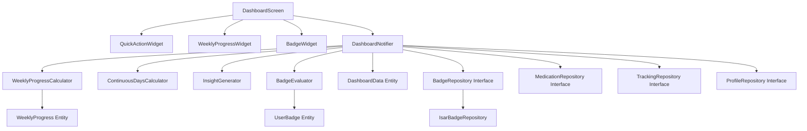

# F006: 홈 대시보드 Implementation Plan

## 1. 개요

F006은 사용자의 치료 진행 상황을 한눈에 확인하고 동기를 부여하는 핵심 화면이다. 데이터 집계, 인사이트 생성, 뱃지 시스템을 통해 사용자 경험을 극대화한다.

### 모듈 목록
- **DashboardNotifier** (Application): 대시보드 통합 상태 관리
- **WeeklyProgressCalculator** (Domain): 주간 목표 진행도 계산
- **ContinuousDaysCalculator** (Domain): 연속 기록일 계산
- **InsightGenerator** (Domain): 데이터 기반 인사이트 생성
- **BadgeEvaluator** (Domain): 뱃지 획득 조건 평가
- **BadgeRepository** (Infrastructure): 뱃지 데이터 접근
- **DashboardScreen** (Presentation): 홈 대시보드 UI
- **QuickActionWidget** (Presentation): 퀵 액션 버튼 위젯
- **WeeklyProgressWidget** (Presentation): 주간 목표 진행도 위젯
- **BadgeWidget** (Presentation): 뱃지 표시 위젯

### TDD 적용 범위
- Domain Layer: 100% Unit Test 커버리지
- Application Layer: 95% Unit Test + Integration Test
- Infrastructure Layer: Unit Test (Mock 활용)
- Presentation Layer: Widget Test + Manual QA

---

## 2. Architecture Diagram

---

## 3. Implementation Plan

### Module 1: WeeklyProgressCalculator (Domain)

**Location**: `lib/features/dashboard/domain/usecases/weekly_progress_calculator.dart`

**Responsibility**: 주간 목표 진행도 계산 로직

**Test Strategy**: Unit Test (Inside-Out)

**Test Scenarios (Red Phase)**:
1. 투여 완료 진행도 계산
   - Arrange: 주간 목표 3회, 실제 완료 2회
   - Act: calculate() 호출
   - Assert: 투여 달성률 66.7% (2/3)

2. 체중 기록 진행도 계산
   - Arrange: 주간 목표 7회, 실제 기록 5회
   - Act: calculate() 호출
   - Assert: 체중 기록 달성률 71.4% (5/7)

3. 증상 기록 진행도 계산
   - Arrange: 주간 목표 7회, 실제 기록 7회
   - Act: calculate() 호출
   - Assert: 증상 기록 달성률 100% (7/7)

4. 목표 0회일 때 예외 처리
   - Arrange: 주간 목표 0회
   - Act: calculate() 호출
   - Assert: 달성률 0% (Division by zero 방지)

5. 실제 기록이 목표 초과 시
   - Arrange: 주간 목표 7회, 실제 기록 10회
   - Act: calculate() 호출
   - Assert: 달성률 100% (Cap at 100%)

**Implementation Order**:
1. Red: Test 1 작성 → Fail
2. Green: 투여 진행도 계산 구현 → Pass
3. Refactor: 중복 제거
4. Red: Test 2-5 순차 작성
5. Green: 각 테스트 통과 구현
6. Refactor: 계산 로직 메서드 분리

**Dependencies**: WeeklyProgress Entity

**Edge Cases**:
- 목표가 null인 경우
- 음수 값 입력 방어
- 부동소수점 정밀도 처리

---

### Module 2: ContinuousDaysCalculator (Domain)

**Location**: `lib/features/dashboard/domain/usecases/continuous_days_calculator.dart`

**Responsibility**: 연속 기록일 계산 로직

**Test Strategy**: Unit Test (Inside-Out)

**Test Scenarios (Red Phase)**:
1. 오늘 기록 시 연속 1일
   - Arrange: [오늘] 기록
   - Act: calculate(records, today)
   - Assert: 1일

2. 어제와 오늘 기록 시 연속 2일
   - Arrange: [어제, 오늘] 기록
   - Act: calculate(records, today)
   - Assert: 2일

3. 중간에 하루 빠진 경우 리셋
   - Arrange: [3일 전, 오늘] 기록
   - Act: calculate(records, today)
   - Assert: 1일 (오늘만)

4. 기록 없을 때 0일
   - Arrange: [] 빈 리스트
   - Act: calculate(records, today)
   - Assert: 0일

5. 최신 기록이 어제인 경우 0일
   - Arrange: [어제] 기록
   - Act: calculate(records, today)
   - Assert: 0일 (오늘 기록 없음)

6. 체중과 증상 기록 혼합 (날짜 통합)
   - Arrange: [체중: 오늘, 증상: 어제]
   - Act: calculate(all_records, today)
   - Assert: 2일

**Implementation Order**:
1. Red: Test 1-3 작성
2. Green: 날짜 정렬 및 연속성 체크 로직
3. Refactor: 날짜 비교 로직 분리
4. Red: Test 4-6 작성
5. Green: 엣지케이스 처리
6. Refactor: 중복 날짜 제거 로직 최적화

**Dependencies**: WeightLog, SymptomLog Entities

**Edge Cases**:
- 미래 날짜 기록 방어
- Timezone 처리 (UTC vs Local)
- 같은 날 여러 기록 중복 제거

---

### Module 3: InsightGenerator (Domain)

**Location**: `lib/features/dashboard/domain/usecases/insight_generator.dart`

**Responsibility**: 데이터 분석 기반 인사이트 메시지 생성

**Test Strategy**: Unit Test (Inside-Out)

**Test Scenarios (Red Phase)**:
1. 체중 1% 이상 감소 시 긍정 메시지
   - Arrange: 전주 70kg, 이번주 69kg (1.4% 감소)
   - Act: generate(weightData)
   - Assert: "지난주 대비 1.4kg 감소했어요"

2. 연속 7일 기록 시 격려 메시지
   - Arrange: 연속 7일
   - Act: generate(continuousDays: 7)
   - Assert: "7일 연속 기록 달성"

3. 부작용 평균 강도 2점 이상 감소
   - Arrange: 전주 평균 8점, 이번주 평균 5점
   - Act: generate(symptomData)
   - Assert: "부작용이 3점 감소했어요"

4. 조건 미충족 시 일반 격려 메시지
   - Arrange: 모든 조건 미충족
   - Act: generate(allData)
   - Assert: "꾸준히 기록하고 계시네요"

5. 컨텍스트 태그 패턴 발견
   - Arrange: #기름진음식 + 메스꺼움 5회
   - Act: generate(symptomData)
   - Assert: "기름진음식과 메스꺼움이 자주 함께 나타나요"

6. 목표 달성 가능성 예측
   - Arrange: 현재 추세 주당 1kg 감소, 목표까지 8주
   - Act: generate(weightTrend)
   - Assert: "현재 추세라면 8주 내 목표 달성 가능"

**Implementation Order**:
1. Red: Test 1-2 작성 (체중, 연속 기록)
2. Green: 기본 조건 체크 및 메시지 생성
3. Refactor: 메시지 템플릿 분리
4. Red: Test 3-4 작성 (부작용, 기본 메시지)
5. Green: 우선순위 로직 추가
6. Red: Test 5-6 작성 (P1 기능)
7. Green: 고급 인사이트 구현
8. Refactor: 조건 평가 로직 Strategy Pattern 적용

**Dependencies**: WeightLog, SymptomLog, DoseRecord Entities

**Edge Cases**:
- 데이터 부족 시 (1주 미만)
- 여러 조건 동시 충족 시 우선순위
- 태그 빈도 임계값 설정

---

### Module 4: BadgeEvaluator (Domain)

**Location**: `lib/features/dashboard/domain/usecases/badge_evaluator.dart`

**Responsibility**: 뱃지 획득 조건 평가 및 진행도 계산

**Test Strategy**: Unit Test (Inside-Out)

**Test Scenarios (Red Phase)**:
1. 연속 7일 기록 뱃지 획득
   - Arrange: 연속 7일, badge: streak_7
   - Act: evaluate(badge, userData)
   - Assert: achieved, 100%

2. 연속 7일 뱃지 진행 중 (5일)
   - Arrange: 연속 5일, badge: streak_7
   - Act: evaluate(badge, userData)
   - Assert: in_progress, 71% (5/7)

3. 체중 5% 감량 뱃지 획득
   - Arrange: 시작 100kg, 현재 95kg
   - Act: evaluate(badge: weight_5percent, userData)
   - Assert: achieved, 100%

4. 첫 투여 완료 뱃지 획득
   - Arrange: 투여 기록 1개 이상
   - Act: evaluate(badge: first_dose, userData)
   - Assert: achieved, 100%

5. 조건 미충족 뱃지 (locked)
   - Arrange: 연속 0일, badge: streak_7
   - Act: evaluate(badge, userData)
   - Assert: locked, 0%

6. 여러 뱃지 동시 평가
   - Arrange: 복수 뱃지 목록
   - Act: evaluateAll(badges, userData)
   - Assert: 각 뱃지별 상태 배열

**Implementation Order**:
1. Red: Test 1-2 작성 (연속 기록 뱃지)
2. Green: 연속 기록 조건 평가 로직
3. Refactor: 조건 평가 인터페이스 추상화
4. Red: Test 3-4 작성 (체중, 투여 뱃지)
5. Green: 각 뱃지 타입별 평가 구현
6. Red: Test 5-6 작성 (상태 관리)
7. Green: 상태 변화 로직 및 일괄 평가
8. Refactor: 뱃지 조건 Strategy Pattern 적용

**Dependencies**: BadgeDefinition, UserBadge Entities

**Edge Cases**:
- 뱃지 조건이 null인 경우
- 데이터 부족으로 평가 불가
- 이미 획득한 뱃지 재평가

---

### Module 5: BadgeRepository Interface (Domain)

**Location**: `lib/features/dashboard/domain/repositories/badge_repository.dart`

**Responsibility**: 뱃지 데이터 접근 인터페이스 정의

**Test Strategy**: Integration Test (Repository Pattern 검증)

**Test Scenarios (Red Phase)**:
1. 모든 뱃지 정의 조회
   - Arrange: Mock Repository
   - Act: getAllBadgeDefinitions()
   - Assert: List<BadgeDefinition> 반환

2. 사용자 뱃지 상태 조회
   - Arrange: userId, Mock Repository
   - Act: getUserBadges(userId)
   - Assert: List<UserBadge> 반환

3. 뱃지 상태 업데이트
   - Arrange: UserBadge 객체
   - Act: updateUserBadge(badge)
   - Assert: 저장 성공

4. 뱃지 획득 기록 생성
   - Arrange: userId, badgeId
   - Act: achieveBadge(userId, badgeId)
   - Assert: achievedAt 타임스탬프 설정

**Implementation Order**:
1. Red: Interface 메서드 시그니처 정의
2. Green: Mock Repository 구현 (테스트용)
3. Red: Integration Test 작성
4. Green: Isar Repository 구현
5. Refactor: 에러 처리 추가

**Dependencies**: BadgeDefinition, UserBadge Entities

---

### Module 6: IsarBadgeRepository (Infrastructure)

**Location**: `lib/features/dashboard/infrastructure/repositories/isar_badge_repository.dart`

**Responsibility**: Isar 기반 뱃지 데이터 저장/조회

**Test Strategy**: Unit Test (Mock Isar)

**Test Scenarios (Red Phase)**:
1. Isar에서 뱃지 정의 전체 조회
   - Arrange: Mock Isar, seed data
   - Act: getAllBadgeDefinitions()
   - Assert: DTO → Entity 변환 검증

2. 사용자별 뱃지 필터링 조회
   - Arrange: userId, Mock Isar
   - Act: getUserBadges(userId)
   - Assert: userId로 필터링된 결과

3. 뱃지 상태 업데이트 (DTO 변환)
   - Arrange: UserBadge Entity
   - Act: updateUserBadge(badge)
   - Assert: Entity → DTO 변환 후 Isar 저장

4. 뱃지 획득 시 타임스탬프 설정
   - Arrange: userId, badgeId
   - Act: achieveBadge(userId, badgeId)
   - Assert: achievedAt이 현재 시각으로 설정

**Implementation Order**:
1. Red: Test 1 작성 (조회)
2. Green: DTO 정의 및 조회 구현
3. Red: Test 2-4 작성 (필터링, 업데이트)
4. Green: CRUD 로직 구현
5. Refactor: DTO ↔ Entity 변환 로직 분리

**Dependencies**: Isar, BadgeDefinitionDto, UserBadgeDto

---

### Module 7: DashboardNotifier (Application)

**Location**: `lib/features/dashboard/application/notifiers/dashboard_notifier.dart`

**Responsibility**: 대시보드 통합 상태 관리 및 데이터 조합

**Test Strategy**: Unit Test + Integration Test

**Test Scenarios (Red Phase)**:
1. 초기 로드 시 모든 데이터 조합
   - Arrange: Mock Repositories, Mock UseCases
   - Act: build()
   - Assert: DashboardData 완전한 상태 반환

2. 주간 목표 진행도 계산 통합
   - Arrange: 투여/체중/증상 데이터
   - Act: build()
   - Assert: WeeklyProgress 정확한 계산

3. 연속 기록일 계산 통합
   - Arrange: 기록 데이터
   - Act: build()
   - Assert: continuousRecordDays 정확한 값

4. 인사이트 메시지 생성 통합
   - Arrange: 전체 데이터
   - Act: build()
   - Assert: insightMessage 조건 충족 시 반환

5. 뱃지 상태 평가 및 업데이트
   - Arrange: 사용자 활동 데이터
   - Act: build()
   - Assert: 새 뱃지 획득 시 상태 변경

6. Refresh 시 데이터 재계산
   - Arrange: 기존 상태
   - Act: refresh()
   - Assert: AsyncValue.loading → data 전환

7. 에러 처리 (Repository 실패)
   - Arrange: Mock Repository throws
   - Act: build()
   - Assert: AsyncValue.error 상태

**Implementation Order**:
1. Red: Test 1-3 작성 (기본 데이터 조합)
2. Green: build() 구현, Repository 호출
3. Refactor: 데이터 조합 로직 분리
4. Red: Test 4-5 작성 (UseCase 통합)
5. Green: UseCase 호출 및 결과 통합
6. Red: Test 6-7 작성 (상태 관리)
7. Green: refresh(), error handling 구현
8. Refactor: AsyncValue 패턴 정리

**Dependencies**:
- WeeklyProgressCalculator
- ContinuousDaysCalculator
- InsightGenerator
- BadgeEvaluator
- BadgeRepository
- MedicationRepository
- TrackingRepository
- ProfileRepository

**Edge Cases**:
- 일부 Repository 실패 시 Partial 데이터 표시
- 계산 실패 시 기본값 사용
- 동시 refresh 호출 debounce

---

### Module 8: DashboardScreen (Presentation)

**Location**: `lib/features/dashboard/presentation/screens/dashboard_screen.dart`

**Responsibility**: 홈 대시보드 UI 렌더링 및 사용자 인터랙션

**Test Strategy**: Widget Test + Manual QA

**Test Scenarios (Widget Test)**:
1. 로딩 상태 표시
   - Arrange: AsyncValue.loading
   - Act: Render DashboardScreen
   - Assert: CircularProgressIndicator 표시

2. 데이터 로드 후 모든 섹션 표시
   - Arrange: AsyncValue.data(DashboardData)
   - Act: Render
   - Assert: 개인화 인사, 주간 진행도, 퀵 액션, 리포트, 뱃지 모두 표시

3. 에러 상태 표시
   - Arrange: AsyncValue.error
   - Act: Render
   - Assert: 에러 메시지 및 재시도 버튼 표시

4. 퀵 액션 버튼 탭 시 네비게이션
   - Arrange: DashboardScreen
   - Act: Tap "체중 기록" 버튼
   - Assert: 체중 기록 화면으로 이동

5. 주간 리포트 터치 시 상세 화면
   - Arrange: DashboardScreen
   - Act: Tap 주간 리포트 영역
   - Assert: 데이터 공유 모드로 이동

**Implementation Order**:
1. Red: Widget Test 1 작성 (로딩)
2. Green: Scaffold 및 로딩 UI 구현
3. Red: Widget Test 2 작성 (데이터 표시)
4. Green: 각 섹션 위젯 배치
5. Red: Widget Test 3-5 작성 (인터랙션)
6. Green: 네비게이션 및 이벤트 핸들러
7. Refactor: 위젯 분리 (QuickAction, Progress, Badge)

**Dependencies**:
- DashboardNotifier
- QuickActionWidget
- WeeklyProgressWidget
- BadgeWidget

**QA Sheet** (Manual Testing):
- [ ] 개인화 인사 영역 정확한 데이터 표시
- [ ] 주간 목표 진행도 진행 바 애니메이션 동작
- [ ] 퀵 액션 버튼 터치 피드백 및 네비게이션
- [ ] 뱃지 획득 시 알림 표시
- [ ] 스크롤 성능 (60fps 유지)
- [ ] 다크 모드 지원
- [ ] 접근성 (TalkBack/VoiceOver)

---

### Module 9: QuickActionWidget (Presentation)

**Location**: `lib/features/dashboard/presentation/widgets/quick_action_widget.dart`

**Responsibility**: 퀵 액션 버튼 UI

**Test Strategy**: Widget Test

**Test Scenarios**:
1. 3개 버튼 모두 표시
   - Arrange: QuickActionWidget
   - Act: Render
   - Assert: 체중, 증상, 투여 버튼 존재

2. 버튼 탭 시 콜백 호출
   - Arrange: Mock callback
   - Act: Tap "체중 기록"
   - Assert: onWeightTap 호출

3. 터치 영역 충분 (44x44 이상)
   - Arrange: QuickActionWidget
   - Act: Render
   - Assert: 각 버튼 크기 검증

**Implementation Order**:
1. Red: Test 1-2 작성
2. Green: Row/Column 레이아웃, 버튼 구현
3. Refactor: 버튼 스타일 상수화

**QA Sheet**:
- [ ] 버튼 간격 균등
- [ ] 아이콘 명확성
- [ ] 터치 피드백 애니메이션

---

### Module 10: WeeklyProgressWidget (Presentation)

**Location**: `lib/features/dashboard/presentation/widgets/weekly_progress_widget.dart`

**Responsibility**: 주간 목표 진행도 시각화

**Test Strategy**: Widget Test

**Test Scenarios**:
1. 진행 바 퍼센트 표시
   - Arrange: WeeklyProgress(doseRate: 0.66)
   - Act: Render
   - Assert: "66%" 텍스트 표시

2. 100% 달성 시 시각적 강조
   - Arrange: WeeklyProgress(doseRate: 1.0)
   - Act: Render
   - Assert: 강조 색상 적용

3. 0% 시 기본 상태
   - Arrange: WeeklyProgress(doseRate: 0.0)
   - Act: Render
   - Assert: 회색 진행 바

**Implementation Order**:
1. Red: Test 1 작성
2. Green: LinearProgressIndicator 구현
3. Red: Test 2-3 작성
4. Green: 조건부 스타일 적용
5. Refactor: 색상 테마 분리

**QA Sheet**:
- [ ] 진행 바 애니메이션 부드러움
- [ ] 100% 달성 시 축하 효과
- [ ] 레이블 가독성

---

### Module 11: BadgeWidget (Presentation)

**Location**: `lib/features/dashboard/presentation/widgets/badge_widget.dart`

**Responsibility**: 뱃지 표시 및 획득 알림

**Test Strategy**: Widget Test

**Test Scenarios**:
1. 획득한 뱃지 색상 표시
   - Arrange: UserBadge(status: achieved)
   - Act: Render
   - Assert: 컬러 아이콘

2. 미획득 뱃지 잠금 표시
   - Arrange: UserBadge(status: locked)
   - Act: Render
   - Assert: 회색 + 잠금 아이콘

3. 진행 중 뱃지 진행도 표시
   - Arrange: UserBadge(status: in_progress, progress: 50)
   - Act: Render
   - Assert: "50%" 표시

4. 뱃지 탭 시 상세 화면
   - Arrange: BadgeWidget
   - Act: Tap
   - Assert: 뱃지 상세 다이얼로그

**Implementation Order**:
1. Red: Test 1-3 작성
2. Green: 조건부 렌더링 구현
3. Red: Test 4 작성
4. Green: 탭 이벤트 및 다이얼로그
5. Refactor: 뱃지 아이콘 매핑 분리

**QA Sheet**:
- [ ] 뱃지 획득 알림 애니메이션
- [ ] 뱃지 목록 그리드 레이아웃
- [ ] 상세 화면 조건 설명 명확

---

## 4. TDD Workflow

### Phase 1: Domain Layer (Inside-Out)
1. **Start**: WeeklyProgressCalculator 테스트 작성
2. **Red**: Test 실패 확인
3. **Green**: 최소 구현으로 테스트 통과
4. **Refactor**: 계산 로직 메서드 분리
5. **Commit**: "feat(dashboard): implement WeeklyProgressCalculator"

### Phase 2: Domain Layer (계속)
6. **Red**: ContinuousDaysCalculator 테스트 작성
7. **Green**: 날짜 정렬 및 연속성 체크
8. **Refactor**: 날짜 비교 유틸 분리
9. **Commit**: "feat(dashboard): implement ContinuousDaysCalculator"

### Phase 3: Domain Layer (고급 로직)
10. **Red**: InsightGenerator 테스트 (기본 조건)
11. **Green**: 체중/연속기록 조건 구현
12. **Refactor**: 메시지 템플릿 분리
13. **Red**: InsightGenerator 테스트 (고급 조건 - P1)
14. **Green**: 패턴 분석 및 예측 로직
15. **Refactor**: Strategy Pattern 적용
16. **Commit**: "feat(dashboard): implement InsightGenerator"

### Phase 4: Domain Layer (뱃지 시스템)
17. **Red**: BadgeEvaluator 테스트 작성
18. **Green**: 뱃지 조건 평가 로직
19. **Refactor**: 조건 평가 인터페이스 추상화
20. **Commit**: "feat(dashboard): implement BadgeEvaluator"

### Phase 5: Infrastructure Layer
21. **Red**: BadgeRepository Interface 정의
22. **Green**: Mock Repository 구현
23. **Red**: IsarBadgeRepository 테스트
24. **Green**: Isar CRUD 구현
25. **Refactor**: DTO 변환 로직 분리
26. **Commit**: "feat(dashboard): implement BadgeRepository"

### Phase 6: Application Layer
27. **Red**: DashboardNotifier 테스트 (기본 데이터)
28. **Green**: build() 구현, Repository 호출
29. **Refactor**: 데이터 조합 로직 분리
30. **Red**: DashboardNotifier 테스트 (UseCase 통합)
31. **Green**: UseCase 호출 및 결과 통합
32. **Red**: DashboardNotifier 테스트 (상태 관리)
33. **Green**: refresh(), error handling
34. **Refactor**: AsyncValue 패턴 정리
35. **Commit**: "feat(dashboard): implement DashboardNotifier"

### Phase 7: Presentation Layer (Outside-In)
36. **Red**: DashboardScreen Widget Test (로딩)
37. **Green**: Scaffold 및 로딩 UI
38. **Red**: DashboardScreen Widget Test (데이터 표시)
39. **Green**: 각 섹션 위젯 배치
40. **Refactor**: 위젯 분리
41. **Commit**: "feat(dashboard): implement DashboardScreen"

### Phase 8: Presentation Layer (자식 위젯)
42. **Red**: QuickActionWidget 테스트
43. **Green**: 퀵 액션 버튼 구현
44. **Red**: WeeklyProgressWidget 테스트
45. **Green**: 진행 바 구현
46. **Red**: BadgeWidget 테스트
47. **Green**: 뱃지 표시 및 알림
48. **Refactor**: 공통 스타일 분리
49. **Commit**: "feat(dashboard): implement dashboard widgets"

### Phase 9: Integration & QA
50. **Integration Test**: 전체 플로우 시나리오 테스트
51. **Manual QA**: QA Sheet 항목 체크
52. **Refactor**: 성능 최적화 (Memoization, LazyLoading)
53. **Commit**: "test(dashboard): add integration tests"
54. **Commit**: "refactor(dashboard): optimize performance"

### 완료 기준
- [ ] 모든 Unit Test 통과 (Domain 100%, Application 95%)
- [ ] 모든 Widget Test 통과
- [ ] Integration Test 통과
- [ ] QA Sheet 모든 항목 Pass
- [ ] 코드 리뷰 완료
- [ ] Refactoring 완료 (중복 제거, SOLID 원칙 준수)

---

## 5. 핵심 원칙

### TDD Cycle
- **Red**: 실패하는 테스트 먼저 작성 (AAA 패턴)
- **Green**: 최소한의 코드로 테스트 통과
- **Refactor**: 중복 제거, 구조 개선 (테스트는 Green 유지)

### FIRST Principles
- **Fast**: Domain 로직 테스트 < 10ms
- **Independent**: 테스트 간 순서 무관
- **Repeatable**: 환경 무관 (Mock 활용)
- **Self-validating**: 명확한 Pass/Fail
- **Timely**: 코드 작성 직전 테스트 작성

### Test Pyramid
- **Unit Tests (70%)**: Domain/Application Layer
- **Integration Tests (20%)**: Repository Pattern 검증
- **Widget Tests (10%)**: Presentation Layer

### Layer Dependency
- Presentation → Application → Domain ← Infrastructure
- Domain Layer는 Flutter/Isar 의존성 없음
- Repository Pattern 엄격히 준수

### Commit Strategy
- 작은 단위로 자주 커밋 (Red → Green → Refactor 각 단계)
- 커밋 메시지: Conventional Commits 형식
- 각 모듈 완료 시 기능 커밋

---

## 6. Edge Cases & Error Handling

### 데이터 부족 시나리오
- 신규 사용자 (기록 없음): 환영 메시지 표시
- 일부 데이터만 존재: Partial 렌더링
- 계산 불가 (목표 미설정): 기본값 사용

### 성능 최적화
- 대시보드 데이터 캐싱 (Riverpod autoDispose: false)
- 뱃지 평가 Memoization
- 차트 렌더링 LazyLoading

### 네트워크 & 동기화
- Phase 0: 로컬 DB만 사용 (Isar)
- Repository 실패 시 캐시 데이터 사용
- Retry 로직 (최대 3회)

### 접근성
- 모든 위젯 Semantics 레이블
- 색상 대비 WCAG 2.1 AA 기준
- 터치 영역 최소 44x44

---

## 7. Dependencies

### 기존 Feature 의존성
- **F000 (Onboarding)**: UserProfile, DosagePlan
- **F001 (Medication)**: DoseSchedule, DoseRecord
- **F002 (Tracking)**: WeightLog, SymptomLog
- **F005 (Emergency)**: EmergencySymptomCheck (타임라인용)

### Repository 의존성
- MedicationRepository (투여 기록)
- TrackingRepository (체중/증상 기록)
- ProfileRepository (사용자 프로필)
- BadgeRepository (뱃지 데이터)

### 외부 패키지
- `riverpod: ^2.x` (상태 관리)
- `fl_chart: ^0.66+` (차트 렌더링)
- `isar: ^3.x` (로컬 DB)
- `flutter_test` (테스트 프레임워크)

---

## 8. Implementation Timeline

| Phase | 작업 | 예상 시간 |
|-------|------|----------|
| 1 | Domain Layer (Calculator, Generator, Evaluator) | 8 시간 |
| 2 | Infrastructure Layer (BadgeRepository) | 3 시간 |
| 3 | Application Layer (DashboardNotifier) | 4 시간 |
| 4 | Presentation Layer (Screen + Widgets) | 6 시간 |
| 5 | Integration Test & QA | 3 시간 |
| 6 | Refactoring & 문서화 | 2 시간 |
| **Total** | | **26 시간** |

---

## 9. Success Metrics

- **Test Coverage**: Domain 100%, Application 95%, Overall 85%+
- **Performance**: 대시보드 로딩 < 500ms
- **Accessibility**: WCAG 2.1 AA 준수
- **Code Quality**: No Linter Warnings, 순환 복잡도 < 10
- **User Experience**: 주간 목표 100% 달성 시 명확한 피드백
