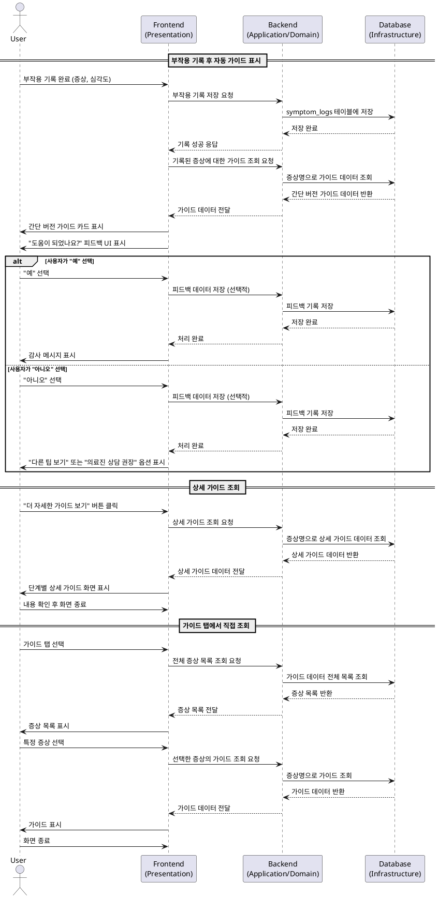

# UF-F004: 부작용 대처 가이드 상세 명세

## Primary Actor
GLP-1 사용자

## Precondition
- 사용자가 로그인 완료
- 사용자가 부작용 증상을 기록 완료 (F002)
- 또는 사용자가 가이드 탭에서 직접 증상별 가이드 조회

## Trigger
- 사용자가 부작용 기록(F002)을 완료하면 자동으로 해당 증상의 대처 가이드 표시
- 사용자가 앱 내 가이드 탭에서 특정 증상의 가이드를 직접 조회

## Main Scenario

### 1. 부작용 기록 후 자동 가이드 표시
1. 사용자가 부작용 기록 화면(F002)에서 증상 선택 및 심각도 입력 완료
2. 시스템이 기록된 증상에 매칭되는 간단 버전 대처 가이드를 조회
3. 시스템이 증상별 맞춤형 가이드 카드를 기록 완료 화면 하단에 표시
   - 메스꺼움: 식사 방법, 피해야 할 음식, 도움이 되는 음료, 주사 타이밍 조정 팁
   - 구토: 수분 보충 방법, 식사 재개 순서, 회복 단계별 접근법
   - 설사: 권장 식이요법, 수분 및 전해질 관리, 피해야 할 음식
   - 변비: 식이섬유 섭취, 수분 권장량, 신체 활동, 배변 습관 개선
   - 복통: 완화 방법, 식이 조절, 스트레스 관리 기법
   - 두통: 수분 섭취, 휴식 방법, 일상 관리 팁
   - 피로: 휴식 및 회복, 영양 관리, 활동량 조절
4. 사용자가 가이드 내용 확인
5. 시스템이 "도움이 되었나요?" 피드백 UI 표시
6. 사용자가 "예" 또는 "아니오" 선택

### 2. 피드백 처리
- **"예" 선택 시:**
  - 시스템이 간단한 감사 메시지 표시
  - 사용자가 홈 화면으로 자유롭게 이동 가능

- **"아니오" 선택 시:**
  - 시스템이 "다른 팁 보기" 또는 "의료진 상담 권장" 옵션 제공
  - 사용자가 "다른 팁 보기" 선택 시 동일 증상의 추가 팁 표시
  - 사용자가 "의료진 상담 권장" 선택 시 전문가 상담 안내 화면으로 이동

### 3. 상세 가이드 조회
1. 사용자가 "더 자세한 가이드 보기" 버튼 클릭
2. 시스템이 단계별로 구성된 상세 가이드 화면 표시
   - 즉시 조치: 증상 완화를 위한 즉각적 대응 방법
   - 식이 조절: 권장 식단 및 피해야 할 음식
   - 생활 습관: 일상 관리 팁 및 활동량 조절
   - 경과 관찰: 증상 모니터링 및 전문가 상담 시기 안내
3. 사용자가 단계별 내용 확인
4. 사용자가 가이드 화면 종료 후 홈 화면으로 복귀

### 4. 가이드 탭에서 직접 조회
1. 사용자가 앱 내 가이드 탭 선택
2. 시스템이 전체 증상 목록 표시
3. 사용자가 특정 증상 선택
4. 시스템이 해당 증상의 간단 버전 또는 상세 버전 가이드 표시
5. 사용자가 내용 확인 후 화면 종료

## Edge Cases

### 1. 등록되지 않은 증상 기록 시
- 시스템이 일반적인 대처 가이드 표시
- "전문가와 상담하여 구체적인 조언을 받으시기 바랍니다" 안내 제공

### 2. 여러 증상 동시 기록 시
- 시스템이 각 증상별 가이드를 순차적으로 표시
- 또는 증상 목록 형태로 제공하고 사용자가 선택하여 확인

### 3. 피드백 미선택 시
- 시스템이 강제하지 않고 사용자가 자유롭게 화면 이동 허용
- 피드백은 선택적 데이터 수집

### 4. 상세 가이드 로딩 실패 시
- 시스템이 간단 버전 가이드 유지
- 재시도 옵션 제공
- 오류 메시지 표시

### 5. 가이드 내용 업데이트 필요 시
- 가이드 데이터는 앱 내 정적 데이터로 관리
- 내용 업데이트는 앱 버전 업데이트를 통해 배포

### 6. 네트워크 오류 시
- Phase 0에서는 로컬 DB에 저장된 가이드 데이터 사용
- 네트워크 상태와 무관하게 동작

## Business Rules

### BR-001: 가이드 자동 표시 규칙
- 부작용 기록(F002) 완료 즉시 해당 증상의 간단 버전 가이드 자동 표시
- 사용자가 명시적으로 거부하지 않는 한 가이드 카드 노출

### BR-002: 증상별 가이드 매칭
- 시스템은 7가지 주요 증상(메스꺼움, 구토, 변비, 설사, 복통, 두통, 피로)에 대한 가이드 보유
- 기록된 증상명과 가이드 데이터의 증상명이 정확히 일치해야 함

### BR-003: 가이드 톤 및 콘텐츠
- 모든 가이드는 긍정적이고 실용적인 톤 유지
- 불안감 유발 문구 배제, 안심 및 지원 메시지 중심
- 의학적 조언이 아닌 일상 관리 팁으로 명시

### BR-004: 전문가 상담 권장 조건
- 사용자가 가이드가 도움이 안 된다고 피드백한 경우
- 시스템은 전문가 상담 권장 안내를 제공하되 강제하지 않음

### BR-005: 피드백 데이터 활용
- 피드백 데이터는 선택적으로 저장
- Phase 1 이후 가이드 개선 및 콘텐츠 최적화에 활용 가능

### BR-006: 가이드 접근성
- 가이드는 기록 완료 화면 외에도 별도 탭에서 언제든 재확인 가능
- 사용자가 필요할 때 증상별 가이드를 독립적으로 조회 가능

### BR-007: 심각 증상 연계
- 기록된 증상의 심각도가 7-10점이고 24시간 이상 지속된다고 선택된 경우
- 대처 가이드 외에 증상 체크(F005) 화면으로 추가 안내 제공

## Sequence Diagram

