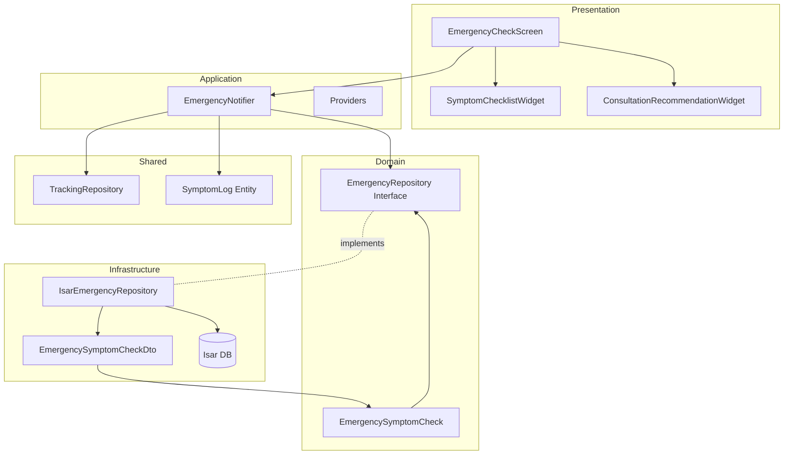

# F005: Emergency Symptom Check Implementation Plan

## 1. Overview

### Modules

| Module | Location | Layer | TDD Strategy |
|--------|----------|-------|--------------|
| EmergencySymptomCheck Entity | features/emergency/domain/entities/ | Domain | Inside-Out (Unit) |
| EmergencyRepository Interface | features/emergency/domain/repositories/ | Domain | Inside-Out (Unit) |
| IsarEmergencyRepository | features/emergency/infrastructure/repositories/ | Infrastructure | Integration |
| EmergencySymptomCheckDto | features/emergency/infrastructure/dtos/ | Infrastructure | Unit |
| EmergencyNotifier | features/emergency/application/notifiers/ | Application | Unit + Integration |
| EmergencyCheckScreen | features/emergency/presentation/screens/ | Presentation | Acceptance |
| SymptomChecklistWidget | features/emergency/presentation/widgets/ | Presentation | Widget |
| ConsultationRecommendationWidget | features/emergency/presentation/widgets/ | Presentation | Widget |

### TDD Scope
- Unit Tests: 70% (Domain entities, DTOs, business logic)
- Integration Tests: 20% (Repository, Notifier with Repository)
- Acceptance Tests: 10% (User scenarios, screen workflows)

---

## 2. Architecture Diagram



---

## 3. Implementation Plan

### 3.1. EmergencySymptomCheck Entity

**Location**: `features/emergency/domain/entities/emergency_symptom_check.dart`

**Responsibility**: Core business entity representing emergency symptom check record

**Test Strategy**: Unit Tests (Inside-Out)

**Test Scenarios (RED Phase)**:
```dart
// AAA Pattern
test('should create EmergencySymptomCheck with required fields', () {
  // Arrange
  final id = 'test-id';
  final userId = 'user-123';
  final checkedAt = DateTime(2025, 1, 1);
  final symptoms = ['24시간 이상 계속 구토하고 있어요'];

  // Act
  final check = EmergencySymptomCheck(
    id: id,
    userId: userId,
    checkedAt: checkedAt,
    checkedSymptoms: symptoms,
  );

  // Assert
  expect(check.id, id);
  expect(check.userId, userId);
  expect(check.checkedAt, checkedAt);
  expect(check.checkedSymptoms, symptoms);
});

test('should allow multiple symptoms', () {
  // Arrange
  final symptoms = [
    '24시간 이상 계속 구토하고 있어요',
    '물이나 음식을 전혀 삼킬 수 없어요',
  ];

  // Act
  final check = EmergencySymptomCheck(
    id: 'id',
    userId: 'user',
    checkedAt: DateTime.now(),
    checkedSymptoms: symptoms,
  );

  // Assert
  expect(check.checkedSymptoms.length, 2);
  expect(check.checkedSymptoms, containsAll(symptoms));
});

test('should be immutable', () {
  // Arrange & Act
  final check = EmergencySymptomCheck(
    id: 'id',
    userId: 'user',
    checkedAt: DateTime.now(),
    checkedSymptoms: ['symptom'],
  );

  // Assert
  expect(() => check.checkedSymptoms.add('new'), throwsUnsupportedError);
});

test('should support equality comparison', () {
  // Arrange
  final date = DateTime(2025, 1, 1);
  final check1 = EmergencySymptomCheck(
    id: 'id',
    userId: 'user',
    checkedAt: date,
    checkedSymptoms: ['symptom'],
  );
  final check2 = EmergencySymptomCheck(
    id: 'id',
    userId: 'user',
    checkedAt: date,
    checkedSymptoms: ['symptom'],
  );

  // Act & Assert
  expect(check1, equals(check2));
  expect(check1.hashCode, equals(check2.hashCode));
});
```

**Implementation Order**:
1. RED: Write failing test for basic entity creation
2. GREEN: Implement EmergencySymptomCheck with required fields
3. REFACTOR: Add immutability (freezed/equatable)
4. RED: Test multiple symptoms scenario
5. GREEN: Ensure List<String> support
6. REFACTOR: Add validation if needed
7. Commit: "feat(domain): add EmergencySymptomCheck entity with tests"

**Dependencies**: None (pure Dart)

---

### 3.2. EmergencyRepository Interface

**Location**: `features/emergency/domain/repositories/emergency_repository.dart`

**Responsibility**: Define contract for emergency symptom check data operations

**Test Strategy**: Unit Tests (contract verification)

**Test Scenarios (RED Phase)**:
```dart
test('should define saveSymptomCheck method', () {
  // Arrange
  final repository = MockEmergencyRepository();
  final check = EmergencySymptomCheck(
    id: 'id',
    userId: 'user',
    checkedAt: DateTime.now(),
    checkedSymptoms: ['symptom'],
  );

  // Act & Assert
  expect(() => repository.saveSymptomCheck(check), returnsNormally);
});

test('should define getSymptomChecks method', () {
  // Arrange
  final repository = MockEmergencyRepository();

  // Act
  final result = repository.getSymptomChecks();

  // Assert
  expect(result, isA<Future<List<EmergencySymptomCheck>>>());
});

test('should define watchSymptomChecks stream method', () {
  // Arrange
  final repository = MockEmergencyRepository();

  // Act
  final result = repository.watchSymptomChecks();

  // Assert
  expect(result, isA<Stream<List<EmergencySymptomCheck>>>());
});
```

**Implementation Order**:
1. RED: Test contract methods existence
2. GREEN: Define abstract class with method signatures
3. REFACTOR: Add documentation
4. Commit: "feat(domain): add EmergencyRepository interface"

**Dependencies**: EmergencySymptomCheck entity

---

### 3.3. EmergencySymptomCheckDto

**Location**: `features/emergency/infrastructure/dtos/emergency_symptom_check_dto.dart`

**Responsibility**: Isar-compatible data transfer object with entity conversion

**Test Strategy**: Unit Tests

**Test Scenarios (RED Phase)**:
```dart
test('should convert from entity to DTO', () {
  // Arrange
  final entity = EmergencySymptomCheck(
    id: 'abc-123',
    userId: 'user-456',
    checkedAt: DateTime(2025, 1, 1, 10, 30),
    checkedSymptoms: ['symptom1', 'symptom2'],
  );

  // Act
  final dto = EmergencySymptomCheckDto.fromEntity(entity);

  // Assert
  expect(dto.id, entity.id);
  expect(dto.userId, entity.userId);
  expect(dto.checkedAt, entity.checkedAt);
  expect(dto.checkedSymptoms, entity.checkedSymptoms);
});

test('should convert from DTO to entity', () {
  // Arrange
  final dto = EmergencySymptomCheckDto()
    ..id = 'abc-123'
    ..userId = 'user-456'
    ..checkedAt = DateTime(2025, 1, 1, 10, 30)
    ..checkedSymptoms = ['symptom1', 'symptom2'];

  // Act
  final entity = dto.toEntity();

  // Assert
  expect(entity.id, dto.id);
  expect(entity.userId, dto.userId);
  expect(entity.checkedAt, dto.checkedAt);
  expect(entity.checkedSymptoms, dto.checkedSymptoms);
});

test('should handle empty symptoms list', () {
  // Arrange
  final entity = EmergencySymptomCheck(
    id: 'id',
    userId: 'user',
    checkedAt: DateTime.now(),
    checkedSymptoms: [],
  );

  // Act
  final dto = EmergencySymptomCheckDto.fromEntity(entity);
  final converted = dto.toEntity();

  // Assert
  expect(converted.checkedSymptoms, isEmpty);
});

test('should roundtrip conversion preserve data', () {
  // Arrange
  final original = EmergencySymptomCheck(
    id: 'id',
    userId: 'user',
    checkedAt: DateTime(2025, 1, 1, 12, 0),
    checkedSymptoms: ['symptom'],
  );

  // Act
  final dto = EmergencySymptomCheckDto.fromEntity(original);
  final roundtrip = dto.toEntity();

  // Assert
  expect(roundtrip, equals(original));
});
```

**Implementation Order**:
1. RED: Test entity to DTO conversion
2. GREEN: Implement fromEntity factory
3. RED: Test DTO to entity conversion
4. GREEN: Implement toEntity method
5. REFACTOR: Add Isar annotations
6. Commit: "feat(infrastructure): add EmergencySymptomCheckDto with tests"

**Dependencies**: EmergencySymptomCheck entity, Isar package

---

### 3.4. IsarEmergencyRepository

**Location**: `features/emergency/infrastructure/repositories/isar_emergency_repository.dart`

**Responsibility**: Isar database implementation of EmergencyRepository

**Test Strategy**: Integration Tests (with test Isar instance)

**Test Scenarios (RED Phase)**:
```dart
testWidgets('should save symptom check to Isar', (tester) async {
  // Arrange
  final isar = await openTestIsar();
  final repository = IsarEmergencyRepository(isar);
  final check = EmergencySymptomCheck(
    id: 'test-id',
    userId: 'user-123',
    checkedAt: DateTime.now(),
    checkedSymptoms: ['symptom'],
  );

  // Act
  await repository.saveSymptomCheck(check);

  // Assert
  final saved = await isar.emergencySymptomCheckDtos.get('test-id');
  expect(saved, isNotNull);
  expect(saved!.userId, 'user-123');

  await isar.close();
});

testWidgets('should retrieve all symptom checks', (tester) async {
  // Arrange
  final isar = await openTestIsar();
  final repository = IsarEmergencyRepository(isar);
  final check1 = EmergencySymptomCheck(/*...*/);
  final check2 = EmergencySymptomCheck(/*...*/);
  await repository.saveSymptomCheck(check1);
  await repository.saveSymptomCheck(check2);

  // Act
  final checks = await repository.getSymptomChecks();

  // Assert
  expect(checks.length, 2);

  await isar.close();
});

testWidgets('should stream symptom checks in real-time', (tester) async {
  // Arrange
  final isar = await openTestIsar();
  final repository = IsarEmergencyRepository(isar);
  final stream = repository.watchSymptomChecks();

  // Act
  final check = EmergencySymptomCheck(/*...*/);
  await repository.saveSymptomCheck(check);

  // Assert
  await expectLater(
    stream,
    emits(predicate<List<EmergencySymptomCheck>>(
      (list) => list.length == 1,
    )),
  );

  await isar.close();
});

testWidgets('should filter by userId', (tester) async {
  // Arrange
  final isar = await openTestIsar();
  final repository = IsarEmergencyRepository(isar);
  final user1Check = EmergencySymptomCheck(userId: 'user-1', /*...*/);
  final user2Check = EmergencySymptomCheck(userId: 'user-2', /*...*/);
  await repository.saveSymptomCheck(user1Check);
  await repository.saveSymptomCheck(user2Check);

  // Act
  final checks = await repository.getSymptomChecksByUserId('user-1');

  // Assert
  expect(checks.length, 1);
  expect(checks.first.userId, 'user-1');

  await isar.close();
});
```

**Implementation Order**:
1. RED: Test save operation
2. GREEN: Implement saveSymptomCheck with Isar write transaction
3. RED: Test retrieval
4. GREEN: Implement getSymptomChecks
5. RED: Test streaming
6. GREEN: Implement watchSymptomChecks with Isar watch
7. REFACTOR: Extract common query logic
8. Commit: "feat(infrastructure): implement IsarEmergencyRepository"

**Dependencies**: EmergencyRepository interface, EmergencySymptomCheckDto, Isar

---

### 3.5. EmergencyNotifier

**Location**: `features/emergency/application/notifiers/emergency_notifier.dart`

**Responsibility**: State management for emergency symptom checks, orchestrate repository and tracking integration

**Test Strategy**: Unit Tests (with mocked repositories) + Integration Tests

**Test Scenarios (RED Phase)**:
```dart
test('should load symptom checks on build', () async {
  // Arrange
  final mockRepo = MockEmergencyRepository();
  final mockTrackingRepo = MockTrackingRepository();
  when(mockRepo.getSymptomChecks()).thenAnswer((_) async => []);

  final container = ProviderContainer(
    overrides: [
      emergencyRepositoryProvider.overrideWithValue(mockRepo),
      trackingRepositoryProvider.overrideWithValue(mockTrackingRepo),
    ],
  );

  // Act
  final notifier = container.read(emergencyNotifierProvider.notifier);
  await container.read(emergencyNotifierProvider.future);

  // Assert
  verify(mockRepo.getSymptomChecks()).called(1);
});

test('should save symptom check and create symptom log', () async {
  // Arrange
  final mockRepo = MockEmergencyRepository();
  final mockTrackingRepo = MockTrackingRepository();
  when(mockRepo.saveSymptomCheck(any)).thenAnswer((_) async => {});
  when(mockTrackingRepo.saveSymptomLog(any)).thenAnswer((_) async => {});

  final container = ProviderContainer(
    overrides: [
      emergencyRepositoryProvider.overrideWithValue(mockRepo),
      trackingRepositoryProvider.overrideWithValue(mockTrackingRepo),
    ],
  );

  final symptoms = ['24시간 이상 계속 구토하고 있어요'];

  // Act
  final notifier = container.read(emergencyNotifierProvider.notifier);
  await notifier.saveSymptomCheck(symptoms);

  // Assert
  verify(mockRepo.saveSymptomCheck(any)).called(1);
  verify(mockTrackingRepo.saveSymptomLog(
    argThat(predicate<SymptomLog>((log) => log.severity == 10)),
  )).called(symptoms.length);
});

test('should handle multiple symptoms correctly', () async {
  // Arrange
  final mockRepo = MockEmergencyRepository();
  final mockTrackingRepo = MockTrackingRepository();
  when(mockRepo.saveSymptomCheck(any)).thenAnswer((_) async => {});
  when(mockTrackingRepo.saveSymptomLog(any)).thenAnswer((_) async => {});

  final container = ProviderContainer(
    overrides: [
      emergencyRepositoryProvider.overrideWithValue(mockRepo),
      trackingRepositoryProvider.overrideWithValue(mockTrackingRepo),
    ],
  );

  final symptoms = [
    '24시간 이상 계속 구토하고 있어요',
    '물이나 음식을 전혀 삼킬 수 없어요',
  ];

  // Act
  final notifier = container.read(emergencyNotifierProvider.notifier);
  await notifier.saveSymptomCheck(symptoms);

  // Assert
  final captured = verify(
    mockRepo.saveSymptomCheck(captureAny),
  ).captured.single as EmergencySymptomCheck;

  expect(captured.checkedSymptoms.length, 2);
  verify(mockTrackingRepo.saveSymptomLog(any)).called(2);
});

test('should emit AsyncValue.loading during save', () async {
  // Arrange
  final mockRepo = MockEmergencyRepository();
  final mockTrackingRepo = MockTrackingRepository();
  when(mockRepo.saveSymptomCheck(any)).thenAnswer(
    (_) async => Future.delayed(Duration(milliseconds: 100)),
  );

  final container = ProviderContainer(
    overrides: [
      emergencyRepositoryProvider.overrideWithValue(mockRepo),
      trackingRepositoryProvider.overrideWithValue(mockTrackingRepo),
    ],
  );

  // Act
  final notifier = container.read(emergencyNotifierProvider.notifier);
  final future = notifier.saveSymptomCheck(['symptom']);

  // Assert
  expect(
    container.read(emergencyNotifierProvider),
    isA<AsyncLoading>(),
  );

  await future;
});

test('should handle repository errors gracefully', () async {
  // Arrange
  final mockRepo = MockEmergencyRepository();
  final mockTrackingRepo = MockTrackingRepository();
  when(mockRepo.saveSymptomCheck(any)).thenThrow(Exception('DB error'));

  final container = ProviderContainer(
    overrides: [
      emergencyRepositoryProvider.overrideWithValue(mockRepo),
      trackingRepositoryProvider.overrideWithValue(mockTrackingRepo),
    ],
  );

  // Act
  final notifier = container.read(emergencyNotifierProvider.notifier);
  await notifier.saveSymptomCheck(['symptom']);

  // Assert
  final state = container.read(emergencyNotifierProvider);
  expect(state, isA<AsyncError>());
});
```

**Implementation Order**:
1. RED: Test initial load
2. GREEN: Implement build method with repository call
3. RED: Test save with single symptom
4. GREEN: Implement saveSymptomCheck basic flow
5. RED: Test symptom log creation
6. GREEN: Integrate TrackingRepository for symptom logs
7. RED: Test multiple symptoms
8. GREEN: Handle multiple symptom logs
9. RED: Test loading state
10. GREEN: Use AsyncValue.guard pattern
11. RED: Test error handling
12. GREEN: Add try-catch and error states
13. REFACTOR: Extract symptom log creation logic
14. Commit: "feat(application): implement EmergencyNotifier with tests"

**Dependencies**: EmergencyRepository, TrackingRepository, SymptomLog entity

---

### 3.6. EmergencyCheckScreen

**Location**: `features/emergency/presentation/screens/emergency_check_screen.dart`

**Responsibility**: Main screen UI for emergency symptom checklist and consultation recommendation

**Test Strategy**: Widget Tests + Acceptance Tests

**Test Scenarios (RED Phase)**:
```dart
testWidgets('should display symptom checklist on load', (tester) async {
  // Arrange
  await tester.pumpWidget(
    ProviderScope(
      child: MaterialApp(home: EmergencyCheckScreen()),
    ),
  );

  // Act
  await tester.pumpAndSettle();

  // Assert
  expect(find.text('24시간 이상 계속 구토하고 있어요'), findsOneWidget);
  expect(find.text('물이나 음식을 전혀 삼킬 수 없어요'), findsOneWidget);
  expect(find.byType(Checkbox), findsNWidgets(7));
});

testWidgets('should navigate to recommendation on symptom selection',
  (tester) async {
  // Arrange
  await tester.pumpWidget(
    ProviderScope(
      child: MaterialApp(home: EmergencyCheckScreen()),
    ),
  );

  // Act
  await tester.tap(find.byType(Checkbox).first);
  await tester.tap(find.text('확인'));
  await tester.pumpAndSettle();

  // Assert
  expect(find.text('전문가와 상담이 필요합니다'), findsOneWidget);
  expect(find.byType(ConsultationRecommendationWidget), findsOneWidget);
});

testWidgets('should allow multiple symptom selection', (tester) async {
  // Arrange
  await tester.pumpWidget(
    ProviderScope(
      child: MaterialApp(home: EmergencyCheckScreen()),
    ),
  );

  // Act
  await tester.tap(find.byType(Checkbox).at(0));
  await tester.tap(find.byType(Checkbox).at(1));
  await tester.pumpAndSettle();

  // Assert
  final checkboxes = tester.widgetList<Checkbox>(find.byType(Checkbox));
  expect(checkboxes.where((c) => c.value == true).length, 2);
});

testWidgets('should close screen without saving when no selection',
  (tester) async {
  // Arrange
  final mockObserver = MockNavigatorObserver();
  await tester.pumpWidget(
    ProviderScope(
      child: MaterialApp(
        home: EmergencyCheckScreen(),
        navigatorObservers: [mockObserver],
      ),
    ),
  );

  // Act
  await tester.tap(find.byType(BackButton));
  await tester.pumpAndSettle();

  // Assert
  verify(mockObserver.didPop(any, any)).called(1);
});

testWidgets('should show loading indicator during save', (tester) async {
  // Arrange
  final mockNotifier = MockEmergencyNotifier();
  when(mockNotifier.saveSymptomCheck(any)).thenAnswer(
    (_) async => Future.delayed(Duration(seconds: 1)),
  );

  await tester.pumpWidget(
    ProviderScope(
      overrides: [
        emergencyNotifierProvider.overrideWith(() => mockNotifier),
      ],
      child: MaterialApp(home: EmergencyCheckScreen()),
    ),
  );

  // Act
  await tester.tap(find.byType(Checkbox).first);
  await tester.tap(find.text('확인'));
  await tester.pump();

  // Assert
  expect(find.byType(CircularProgressIndicator), findsOneWidget);
});

testWidgets('should display error message on save failure', (tester) async {
  // Arrange
  final mockNotifier = MockEmergencyNotifier();
  when(mockNotifier.saveSymptomCheck(any)).thenThrow(Exception('error'));

  await tester.pumpWidget(
    ProviderScope(
      overrides: [
        emergencyNotifierProvider.overrideWith(() => mockNotifier),
      ],
      child: MaterialApp(home: EmergencyCheckScreen()),
    ),
  );

  // Act
  await tester.tap(find.byType(Checkbox).first);
  await tester.tap(find.text('확인'));
  await tester.pumpAndSettle();

  // Assert
  expect(find.text('저장에 실패했습니다'), findsOneWidget);
});
```

**Acceptance Test Scenarios**:
```dart
// User Journey: Emergency symptom check flow
testWidgets('AC1: User completes emergency symptom check successfully',
  (tester) async {
  // GIVEN user is on emergency check screen
  await tester.pumpWidget(
    ProviderScope(
      child: MaterialApp(home: EmergencyCheckScreen()),
    ),
  );
  await tester.pumpAndSettle();

  // WHEN user selects a severe symptom
  await tester.tap(find.text('24시간 이상 계속 구토하고 있어요'));
  await tester.pumpAndSettle();

  // AND confirms the selection
  await tester.tap(find.text('확인'));
  await tester.pumpAndSettle();

  // THEN consultation recommendation is shown
  expect(find.text('전문가와 상담이 필요합니다'), findsOneWidget);

  // AND selected symptom is summarized
  expect(find.text('24시간 이상 계속 구토하고 있어요'), findsWidgets);

  // AND data is saved to database
  final container = ProviderScope.containerOf(
    tester.element(find.byType(EmergencyCheckScreen)),
  );
  final checks = await container.read(
    emergencyNotifierProvider.future,
  );
  expect(checks.isNotEmpty, true);
});

testWidgets('AC2: User selects multiple symptoms', (tester) async {
  // GIVEN user is on emergency check screen
  await tester.pumpWidget(
    ProviderScope(
      child: MaterialApp(home: EmergencyCheckScreen()),
    ),
  );

  // WHEN user selects two symptoms
  await tester.tap(find.text('24시간 이상 계속 구토하고 있어요'));
  await tester.tap(find.text('물이나 음식을 전혀 삼킬 수 없어요'));
  await tester.tap(find.text('확인'));
  await tester.pumpAndSettle();

  // THEN both symptoms are shown in summary
  expect(find.textContaining('2개의 증상'), findsOneWidget);

  // AND two symptom logs are created
  final container = ProviderScope.containerOf(
    tester.element(find.byType(EmergencyCheckScreen)),
  );
  final checks = await container.read(emergencyNotifierProvider.future);
  expect(checks.first.checkedSymptoms.length, 2);
});

testWidgets('AC3: User exits without selecting symptoms', (tester) async {
  // GIVEN user is on emergency check screen
  await tester.pumpWidget(
    ProviderScope(
      child: MaterialApp(home: EmergencyCheckScreen()),
    ),
  );

  // WHEN user presses back without selection
  await tester.tap(find.byType(BackButton));
  await tester.pumpAndSettle();

  // THEN no data is saved
  final container = ProviderScope.containerOf(
    tester.element(find.byType(MaterialApp)),
  );
  final checks = await container.read(emergencyNotifierProvider.future);
  expect(checks.isEmpty, true);

  // AND user returns to previous screen
  expect(find.byType(EmergencyCheckScreen), findsNothing);
});
```

**Implementation Order**:
1. RED: Test checklist display
2. GREEN: Create basic screen with static checklist
3. RED: Test checkbox interaction
4. GREEN: Implement checkbox state management
5. RED: Test navigation to recommendation
6. GREEN: Add navigation logic
7. RED: Test multiple selection
8. GREEN: Enable multiple checkbox selection
9. RED: Test save operation
10. GREEN: Integrate with EmergencyNotifier
11. RED: Test loading state
12. GREEN: Add loading indicator
13. RED: Test error handling
14. GREEN: Add error display
15. RED: Acceptance test AC1
16. GREEN: Verify end-to-end flow
17. REFACTOR: Extract widgets, improve UX
18. Commit: "feat(presentation): implement EmergencyCheckScreen with tests"

**Dependencies**: EmergencyNotifier, SymptomChecklistWidget, ConsultationRecommendationWidget

**QA Sheet** (Manual Testing):
- [ ] All 7 symptom items display correctly
- [ ] Checkboxes are tappable and responsive
- [ ] Multiple selections allowed
- [ ] Confirm button disabled when no selection
- [ ] Back button works without saving
- [ ] Navigation to recommendation smooth
- [ ] Loading indicator appears during save
- [ ] Error message clear and actionable
- [ ] Screen adapts to different screen sizes
- [ ] Accessibility: screen reader support
- [ ] Accessibility: sufficient touch targets (48x48)

---

### 3.7. SymptomChecklistWidget

**Location**: `features/emergency/presentation/widgets/symptom_checklist_widget.dart`

**Responsibility**: Reusable widget for displaying symptom checklist with checkboxes

**Test Strategy**: Widget Tests

**Test Scenarios (RED Phase)**:
```dart
testWidgets('should render all 7 symptom items', (tester) async {
  // Arrange
  final selectedSymptoms = <String>[];

  // Act
  await tester.pumpWidget(
    MaterialApp(
      home: Scaffold(
        body: SymptomChecklistWidget(
          selectedSymptoms: selectedSymptoms,
          onChanged: (_) {},
        ),
      ),
    ),
  );

  // Assert
  expect(find.byType(CheckboxListTile), findsNWidgets(7));
});

testWidgets('should call onChanged when symptom selected', (tester) async {
  // Arrange
  final selectedSymptoms = <String>[];
  String? changedSymptom;

  await tester.pumpWidget(
    MaterialApp(
      home: Scaffold(
        body: SymptomChecklistWidget(
          selectedSymptoms: selectedSymptoms,
          onChanged: (symptom) => changedSymptom = symptom,
        ),
      ),
    ),
  );

  // Act
  await tester.tap(find.byType(CheckboxListTile).first);

  // Assert
  expect(changedSymptom, isNotNull);
  expect(changedSymptom, '24시간 이상 계속 구토하고 있어요');
});

testWidgets('should reflect selected state visually', (tester) async {
  // Arrange
  final selectedSymptoms = ['24시간 이상 계속 구토하고 있어요'];

  // Act
  await tester.pumpWidget(
    MaterialApp(
      home: Scaffold(
        body: SymptomChecklistWidget(
          selectedSymptoms: selectedSymptoms,
          onChanged: (_) {},
        ),
      ),
    ),
  );

  // Assert
  final checkbox = tester.widget<CheckboxListTile>(
    find.byType(CheckboxListTile).first,
  );
  expect(checkbox.value, true);
});

testWidgets('should use clear, everyday language', (tester) async {
  // Arrange & Act
  await tester.pumpWidget(
    MaterialApp(
      home: Scaffold(
        body: SymptomChecklistWidget(
          selectedSymptoms: [],
          onChanged: (_) {},
        ),
      ),
    ),
  );

  // Assert
  expect(find.text('24시간 이상 계속 구토하고 있어요'), findsOneWidget);
  expect(find.text('물이나 음식을 전혀 삼킬 수 없어요'), findsOneWidget);
  // ... verify all 7 items with natural language
});
```

**Implementation Order**:
1. RED: Test 7 items render
2. GREEN: Create widget with hardcoded symptom list
3. RED: Test selection callback
4. GREEN: Implement onChanged callback
5. RED: Test visual selection state
6. GREEN: Connect selectedSymptoms to checkbox value
7. REFACTOR: Extract symptom constants
8. Commit: "feat(presentation): add SymptomChecklistWidget"

**Dependencies**: None (pure widget)

---

### 3.8. ConsultationRecommendationWidget

**Location**: `features/emergency/presentation/widgets/consultation_recommendation_widget.dart`

**Responsibility**: Display consultation recommendation with symptom summary

**Test Strategy**: Widget Tests

**Test Scenarios (RED Phase)**:
```dart
testWidgets('should display consultation message', (tester) async {
  // Arrange
  final symptoms = ['24시간 이상 계속 구토하고 있어요'];

  // Act
  await tester.pumpWidget(
    MaterialApp(
      home: Scaffold(
        body: ConsultationRecommendationWidget(
          selectedSymptoms: symptoms,
        ),
      ),
    ),
  );

  // Assert
  expect(find.text('전문가와 상담이 필요합니다'), findsOneWidget);
});

testWidgets('should display symptom summary', (tester) async {
  // Arrange
  final symptoms = [
    '24시간 이상 계속 구토하고 있어요',
    '물이나 음식을 전혀 삼킬 수 없어요',
  ];

  // Act
  await tester.pumpWidget(
    MaterialApp(
      home: Scaffold(
        body: ConsultationRecommendationWidget(
          selectedSymptoms: symptoms,
        ),
      ),
    ),
  );

  // Assert
  expect(find.text(symptoms[0]), findsOneWidget);
  expect(find.text(symptoms[1]), findsOneWidget);
});

testWidgets('should highlight most severe symptom when multiple',
  (tester) async {
  // Arrange
  final symptoms = [
    '24시간 이상 계속 구토하고 있어요',
    '물이나 음식을 전혀 삼킬 수 없어요',
  ];

  // Act
  await tester.pumpWidget(
    MaterialApp(
      home: Scaffold(
        body: ConsultationRecommendationWidget(
          selectedSymptoms: symptoms,
        ),
      ),
    ),
  );

  // Assert
  final firstSymptom = find.text(symptoms[0]);
  final widget = tester.widget<Text>(firstSymptom);
  expect(widget.style?.fontWeight, FontWeight.bold);
});

testWidgets('should provide close action', (tester) async {
  // Arrange
  bool closed = false;

  await tester.pumpWidget(
    MaterialApp(
      home: Scaffold(
        body: ConsultationRecommendationWidget(
          selectedSymptoms: ['symptom'],
          onClose: () => closed = true,
        ),
      ),
    ),
  );

  // Act
  await tester.tap(find.text('확인'));

  // Assert
  expect(closed, true);
});
```

**Implementation Order**:
1. RED: Test message display
2. GREEN: Add static consultation message
3. RED: Test symptom summary
4. GREEN: Display symptom list
5. RED: Test highlight logic
6. GREEN: Apply bold style to first symptom
7. RED: Test close button
8. GREEN: Add close callback
9. REFACTOR: Improve layout and styling
10. Commit: "feat(presentation): add ConsultationRecommendationWidget"

**Dependencies**: None (pure widget)

---

## 4. TDD Workflow

### Phase 1: Domain Layer (Inside-Out)
**Start**: EmergencySymptomCheck entity test
1. RED: Test entity creation
2. GREEN: Implement entity
3. REFACTOR: Add immutability
4. RED: EmergencyRepository interface test
5. GREEN: Define repository contract
6. COMMIT: "feat(domain): emergency symptom check domain layer"

### Phase 2: Infrastructure Layer (Integration)
**Start**: EmergencySymptomCheckDto test
1. RED: Test DTO conversions
2. GREEN: Implement DTO with Isar annotations
3. REFACTOR: Optimize conversion logic
4. RED: IsarEmergencyRepository integration test
5. GREEN: Implement repository with Isar
6. REFACTOR: Extract common patterns
7. COMMIT: "feat(infrastructure): emergency symptom check infrastructure"

### Phase 3: Application Layer (Unit + Integration)
**Start**: EmergencyNotifier test
1. RED: Test state loading
2. GREEN: Implement build method
3. RED: Test save operation
4. GREEN: Implement saveSymptomCheck
5. RED: Test symptom log integration
6. GREEN: Integrate TrackingRepository
7. RED: Test error handling
8. GREEN: Add error states
9. REFACTOR: Clean up state management
10. COMMIT: "feat(application): emergency symptom check notifier"

### Phase 4: Presentation Layer (Widget + Acceptance)
**Start**: SymptomChecklistWidget test
1. RED: Test checklist rendering
2. GREEN: Build checklist widget
3. REFACTOR: Extract constants
4. RED: ConsultationRecommendationWidget test
5. GREEN: Build recommendation widget
6. REFACTOR: Polish UI
7. RED: EmergencyCheckScreen widget test
8. GREEN: Compose screen
9. RED: Acceptance test AC1
10. GREEN: Verify end-to-end flow
11. RED: Acceptance test AC2, AC3
12. GREEN: Handle edge cases
13. REFACTOR: Improve UX and accessibility
14. COMMIT: "feat(presentation): emergency symptom check screen"

### Commit Strategy
- Commit after each layer completion
- Each commit must have all tests passing
- Commit message format: `feat(layer): description`
- Tag completion: `git tag f005-complete`

### Completion Criteria
- [ ] All unit tests passing (70%+ coverage)
- [ ] All integration tests passing
- [ ] All acceptance tests passing
- [ ] No warnings from `flutter analyze`
- [ ] Repository pattern verified (no direct Isar access in Application/Presentation)
- [ ] Manual QA sheet completed
- [ ] Documentation updated
