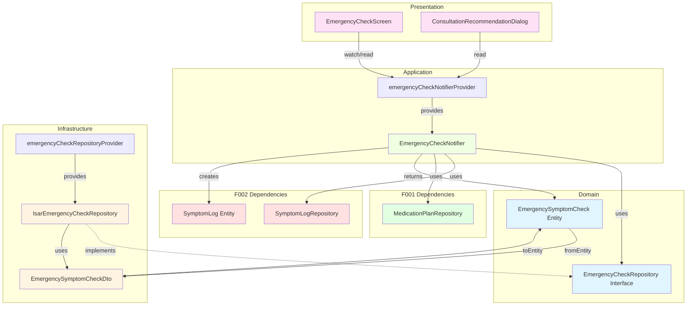

# F005: 증상 체크 및 전문가 상담 권장 - Implementation Plan

## 1. 개요

**Feature**: 심각 증상 체크리스트 제공 및 전문가 상담 권장
**Location**: `lib/features/tracking/`
**TDD 범위**: Domain → Infrastructure → Application → Presentation 순서로 모든 레이어

### 주요 모듈 목록
1. **EmergencySymptomCheck Entity** (Domain) - 증상 체크 기록 모델
2. **EmergencyCheckRepository Interface** (Domain) - 데이터 접근 인터페이스
3. **EmergencySymptomCheckDto** (Infrastructure) - Isar DTO
4. **IsarEmergencyCheckRepository** (Infrastructure) - Repository 구현체
5. **EmergencyCheckNotifier** (Application) - 상태 관리 및 UseCase 호출
6. **EmergencyCheckScreen** (Presentation) - 증상 체크리스트 화면
7. **ConsultationRecommendationDialog** (Presentation) - 상담 권장 다이얼로그

---

## 2. Architecture Diagram



---

## 3. Implementation Plan

### 3.1. EmergencySymptomCheck Entity (Domain)

**Location**: `lib/features/tracking/domain/entities/emergency_symptom_check.dart`

**Responsibility**: 증상 체크 기록의 비즈니스 모델 표현

**Test Strategy**: Unit Test

**Test Scenarios** (Red Phase):
```dart
// AAA Pattern
group('EmergencySymptomCheck Entity', () {
  test('주어진 필수 필드로 생성 시, 올바른 인스턴스 반환', () {
    // Arrange
    final id = 'test-id';
    final userId = 'user-123';
    final checkedAt = DateTime(2025, 1, 1, 10, 0);
    final symptoms = ['24시간 이상 계속 구토'];

    // Act
    final entity = EmergencySymptomCheck(
      id: id,
      userId: userId,
      checkedAt: checkedAt,
      checkedSymptoms: symptoms,
    );

    // Assert
    expect(entity.id, id);
    expect(entity.userId, userId);
    expect(entity.checkedAt, checkedAt);
    expect(entity.checkedSymptoms, symptoms);
  });

  test('여러 증상 선택 시, 모든 증상 포함', () {
    // Arrange
    final symptoms = [
      '24시간 이상 계속 구토',
      '물이나 음식을 전혀 삼킬 수 없어요'
    ];

    // Act
    final entity = EmergencySymptomCheck(
      id: 'test-id',
      userId: 'user-123',
      checkedAt: DateTime.now(),
      checkedSymptoms: symptoms,
    );

    // Assert
    expect(entity.checkedSymptoms.length, 2);
    expect(entity.checkedSymptoms, containsAll(symptoms));
  });

  test('빈 증상 리스트로 생성 시, 예외 발생하지 않음', () {
    // Arrange & Act
    final entity = EmergencySymptomCheck(
      id: 'test-id',
      userId: 'user-123',
      checkedAt: DateTime.now(),
      checkedSymptoms: [],
    );

    // Assert
    expect(entity.checkedSymptoms, isEmpty);
  });

  test('동일한 필드로 생성된 두 인스턴스는 동등', () {
    // Arrange
    final id = 'test-id';
    final userId = 'user-123';
    final checkedAt = DateTime(2025, 1, 1);
    final symptoms = ['24시간 이상 계속 구토'];

    // Act
    final entity1 = EmergencySymptomCheck(
      id: id,
      userId: userId,
      checkedAt: checkedAt,
      checkedSymptoms: symptoms,
    );
    final entity2 = EmergencySymptomCheck(
      id: id,
      userId: userId,
      checkedAt: checkedAt,
      checkedSymptoms: symptoms,
    );

    // Assert
    expect(entity1, equals(entity2));
    expect(entity1.hashCode, equals(entity2.hashCode));
  });
});
```

**Edge Cases**:
- 빈 증상 리스트 허용 (해당 없음 케이스)
- 중복 증상 처리 (리스트에 중복 허용)
- 동등성 비교 (equatable 사용)

**Implementation Order** (TDD):
1. Red: 생성자 테스트 작성
2. Green: Entity 클래스 구현 (equatable mixin)
3. Red: 여러 증상 테스트 작성
4. Green: 리스트 처리 구현
5. Refactor: 불변성 보장 (`final` 키워드)

**Dependencies**: `equatable` package

---

### 3.2. EmergencyCheckRepository Interface (Domain)

**Location**: `lib/features/tracking/domain/repositories/emergency_check_repository.dart`

**Responsibility**: 증상 체크 데이터 접근 계약 정의

**Test Strategy**: Unit Test (Mock 구현체 사용)

**Test Scenarios** (Red Phase):
```dart
// Mock Repository를 통한 Interface 테스트
class MockEmergencyCheckRepository extends Mock
    implements EmergencyCheckRepository {}

group('EmergencyCheckRepository Interface', () {
  late MockEmergencyCheckRepository mockRepository;

  setUp(() {
    mockRepository = MockEmergencyCheckRepository();
  });

  test('saveEmergencyCheck 호출 시, Future<void> 반환', () async {
    // Arrange
    final check = EmergencySymptomCheck(
      id: 'test-id',
      userId: 'user-123',
      checkedAt: DateTime.now(),
      checkedSymptoms: ['증상1'],
    );
    when(() => mockRepository.saveEmergencyCheck(check))
        .thenAnswer((_) async => {});

    // Act
    await mockRepository.saveEmergencyCheck(check);

    // Assert
    verify(() => mockRepository.saveEmergencyCheck(check)).called(1);
  });

  test('getEmergencyChecks 호출 시, List<EmergencySymptomCheck> 반환', () async {
    // Arrange
    final checks = [
      EmergencySymptomCheck(
        id: '1',
        userId: 'user-123',
        checkedAt: DateTime.now(),
        checkedSymptoms: ['증상1'],
      ),
    ];
    when(() => mockRepository.getEmergencyChecks('user-123'))
        .thenAnswer((_) async => checks);

    // Act
    final result = await mockRepository.getEmergencyChecks('user-123');

    // Assert
    expect(result, checks);
    verify(() => mockRepository.getEmergencyChecks('user-123')).called(1);
  });

  test('deleteEmergencyCheck 호출 시, Future<void> 반환', () async {
    // Arrange
    when(() => mockRepository.deleteEmergencyCheck('test-id'))
        .thenAnswer((_) async => {});

    // Act
    await mockRepository.deleteEmergencyCheck('test-id');

    // Assert
    verify(() => mockRepository.deleteEmergencyCheck('test-id')).called(1);
  });

  test('updateEmergencyCheck 호출 시, Future<void> 반환', () async {
    // Arrange
    final check = EmergencySymptomCheck(
      id: 'test-id',
      userId: 'user-123',
      checkedAt: DateTime.now(),
      checkedSymptoms: ['증상1'],
    );
    when(() => mockRepository.updateEmergencyCheck(check))
        .thenAnswer((_) async => {});

    // Act
    await mockRepository.updateEmergencyCheck(check);

    // Assert
    verify(() => mockRepository.updateEmergencyCheck(check)).called(1);
  });
});
```

**Implementation Order**:
1. Red: Interface 메서드 시그니처 테스트
2. Green: abstract class 정의 (saveEmergencyCheck, getEmergencyChecks, deleteEmergencyCheck, updateEmergencyCheck)
3. Refactor: 문서화 주석 추가

**Dependencies**: None (Pure Dart)

---

### 3.3. EmergencySymptomCheckDto (Infrastructure)

**Location**: `lib/features/tracking/infrastructure/dtos/emergency_symptom_check_dto.dart`

**Responsibility**: Isar 컬렉션 정의 및 Entity ↔ DTO 변환

**Test Strategy**: Unit Test

**Isar Schema**:
```dart
@collection
class EmergencySymptomCheckDto {
  Id id = Isar.autoIncrement;

  @Index()
  late String userId;

  @Index()
  late DateTime checkedAt;

  late List<String> checkedSymptoms; // PostgreSQL jsonb → Isar List<String> 매핑

  // Entity ↔ DTO 변환 메서드
  factory EmergencySymptomCheckDto.fromEntity(EmergencySymptomCheck entity) {
    return EmergencySymptomCheckDto()
      ..userId = entity.userId
      ..checkedAt = entity.checkedAt
      ..checkedSymptoms = entity.checkedSymptoms;
  }

  EmergencySymptomCheck toEntity() {
    return EmergencySymptomCheck(
      id: id.toString(),
      userId: userId,
      checkedAt: checkedAt,
      checkedSymptoms: checkedSymptoms,
    );
  }
}
```

**Phase 1 전환 시 주의사항**:
- Isar는 PostgreSQL jsonb를 `List<String>`으로 매핑
- Phase 1 전환 시 Supabase에서 jsonb로 변환 필요

**Test Scenarios** (Red Phase):
```dart
group('EmergencySymptomCheckDto', () {
  test('Entity를 DTO로 변환 시, 모든 필드 매핑', () {
    // Arrange
    final entity = EmergencySymptomCheck(
      id: 'test-id',
      userId: 'user-123',
      checkedAt: DateTime(2025, 1, 1, 10, 0),
      checkedSymptoms: ['증상1', '증상2'],
    );

    // Act
    final dto = EmergencySymptomCheckDto.fromEntity(entity);

    // Assert
    expect(dto.userId, entity.userId);
    expect(dto.checkedAt, entity.checkedAt);
    expect(dto.checkedSymptoms, entity.checkedSymptoms);
  });

  test('DTO를 Entity로 변환 시, 모든 필드 매핑', () {
    // Arrange
    final dto = EmergencySymptomCheckDto()
      ..id = 1
      ..userId = 'user-123'
      ..checkedAt = DateTime(2025, 1, 1, 10, 0)
      ..checkedSymptoms = ['증상1'];

    // Act
    final entity = dto.toEntity();

    // Assert
    expect(entity.id, dto.id.toString());
    expect(entity.userId, dto.userId);
    expect(entity.checkedAt, dto.checkedAt);
    expect(entity.checkedSymptoms, dto.checkedSymptoms);
  });

  test('빈 증상 리스트 변환 시, 빈 리스트 유지', () {
    // Arrange
    final entity = EmergencySymptomCheck(
      id: 'test-id',
      userId: 'user-123',
      checkedAt: DateTime.now(),
      checkedSymptoms: [],
    );

    // Act
    final dto = EmergencySymptomCheckDto.fromEntity(entity);
    final convertedEntity = dto.toEntity();

    // Assert
    expect(convertedEntity.checkedSymptoms, isEmpty);
  });

  test('여러 증상 변환 시, 순서 유지', () {
    // Arrange
    final symptoms = ['증상1', '증상2', '증상3'];
    final entity = EmergencySymptomCheck(
      id: 'test-id',
      userId: 'user-123',
      checkedAt: DateTime.now(),
      checkedSymptoms: symptoms,
    );

    // Act
    final dto = EmergencySymptomCheckDto.fromEntity(entity);
    final convertedEntity = dto.toEntity();

    // Assert
    expect(convertedEntity.checkedSymptoms, orderedEquals(symptoms));
  });
});
```

**Edge Cases**:
- Isar Id (int) ↔ Entity id (String) 변환
- 빈 리스트 처리
- 증상 순서 보존

**Implementation Order**:
1. Red: DTO → Entity 변환 테스트
2. Green: `toEntity()` 메서드 구현
3. Red: Entity → DTO 변환 테스트
4. Green: `fromEntity()` 팩토리 구현
5. Refactor: Isar 어노테이션 추가 (@collection, @Index)

**Dependencies**: `isar`, `isar_flutter_libs`

---

### 3.4. IsarEmergencyCheckRepository (Infrastructure)

**Location**: `lib/features/tracking/infrastructure/repositories/isar_emergency_check_repository.dart`

**Responsibility**: Isar를 통한 증상 체크 데이터 CRUD

**Test Strategy**: Integration Test (Isar In-Memory)

**Test Scenarios** (Red Phase):
```dart
group('IsarEmergencyCheckRepository Integration', () {
  late Isar isar;
  late IsarEmergencyCheckRepository repository;

  setUp(() async {
    isar = await Isar.open(
      [EmergencySymptomCheckDtoSchema],
      directory: '',
      name: 'test_emergency_check',
    );
    repository = IsarEmergencyCheckRepository(isar);
  });

  tearDown(() async {
    await isar.close(deleteFromDisk: true);
  });

  test('증상 체크 저장 시, DB에 정상 저장', () async {
    // Arrange
    final check = EmergencySymptomCheck(
      id: 'test-id',
      userId: 'user-123',
      checkedAt: DateTime(2025, 1, 1),
      checkedSymptoms: ['증상1'],
    );

    // Act
    await repository.saveEmergencyCheck(check);

    // Assert
    final saved = await isar.emergencySymptomCheckDtos.where().findAll();
    expect(saved.length, 1);
    expect(saved.first.userId, 'user-123');
  });

  test('사용자별 증상 체크 조회 시, 해당 사용자 데이터만 반환', () async {
    // Arrange
    final check1 = EmergencySymptomCheck(
      id: '1',
      userId: 'user-123',
      checkedAt: DateTime(2025, 1, 1),
      checkedSymptoms: ['증상1'],
    );
    final check2 = EmergencySymptomCheck(
      id: '2',
      userId: 'user-456',
      checkedAt: DateTime(2025, 1, 2),
      checkedSymptoms: ['증상2'],
    );
    await repository.saveEmergencyCheck(check1);
    await repository.saveEmergencyCheck(check2);

    // Act
    final result = await repository.getEmergencyChecks('user-123');

    // Assert
    expect(result.length, 1);
    expect(result.first.userId, 'user-123');
  });

  test('증상 체크 삭제 시, DB에서 제거', () async {
    // Arrange
    final check = EmergencySymptomCheck(
      id: 'test-id',
      userId: 'user-123',
      checkedAt: DateTime.now(),
      checkedSymptoms: ['증상1'],
    );
    await repository.saveEmergencyCheck(check);

    // Act
    await repository.deleteEmergencyCheck('test-id');

    // Assert
    final remaining = await isar.emergencySymptomCheckDtos.where().findAll();
    expect(remaining, isEmpty);
  });

  test('최근 체크 순서로 정렬 조회', () async {
    // Arrange
    final check1 = EmergencySymptomCheck(
      id: '1',
      userId: 'user-123',
      checkedAt: DateTime(2025, 1, 1),
      checkedSymptoms: ['증상1'],
    );
    final check2 = EmergencySymptomCheck(
      id: '2',
      userId: 'user-123',
      checkedAt: DateTime(2025, 1, 3),
      checkedSymptoms: ['증상2'],
    );
    final check3 = EmergencySymptomCheck(
      id: '3',
      userId: 'user-123',
      checkedAt: DateTime(2025, 1, 2),
      checkedSymptoms: ['증상3'],
    );
    await repository.saveEmergencyCheck(check1);
    await repository.saveEmergencyCheck(check2);
    await repository.saveEmergencyCheck(check3);

    // Act
    final result = await repository.getEmergencyChecks('user-123');

    // Assert
    expect(result.length, 3);
    expect(result[0].checkedAt, DateTime(2025, 1, 3)); // 최신순
    expect(result[1].checkedAt, DateTime(2025, 1, 2));
    expect(result[2].checkedAt, DateTime(2025, 1, 1));
  });

  test('존재하지 않는 ID 삭제 시, 예외 발생하지 않음', () async {
    // Act & Assert
    expect(
      () => repository.deleteEmergencyCheck('non-existent'),
      returnsNormally,
    );
  });

  test('증상 체크 수정 시, DB에 업데이트', () async {
    // Arrange
    final check = EmergencySymptomCheck(
      id: 'test-id',
      userId: 'user-123',
      checkedAt: DateTime.now(),
      checkedSymptoms: ['증상1'],
    );
    await repository.saveEmergencyCheck(check);

    // Act
    final updated = EmergencySymptomCheck(
      id: check.id,
      userId: check.userId,
      checkedAt: check.checkedAt,
      checkedSymptoms: ['새로운 증상'],
    );
    await repository.updateEmergencyCheck(updated);

    // Assert
    final result = await repository.getEmergencyChecks(check.userId);
    expect(result.first.checkedSymptoms, ['새로운 증상']);
  });

  test('같은 증상 반복 체크 시, 별도 기록으로 저장', () async {
    // Arrange
    final check1 = EmergencySymptomCheck(
      id: '1',
      userId: 'user-123',
      checkedAt: DateTime(2025, 1, 1, 10, 0),
      checkedSymptoms: ['24시간 이상 계속 구토'],
    );
    final check2 = EmergencySymptomCheck(
      id: '2',
      userId: 'user-123',
      checkedAt: DateTime(2025, 1, 1, 14, 0), // 4시간 후
      checkedSymptoms: ['24시간 이상 계속 구토'], // 같은 증상
    );

    // Act
    await repository.saveEmergencyCheck(check1);
    await repository.saveEmergencyCheck(check2);

    // Assert
    final result = await repository.getEmergencyChecks('user-123');
    expect(result.length, 2); // 별도 기록
    expect(result[0].checkedAt, DateTime(2025, 1, 1, 14, 0)); // 최신순
    expect(result[1].checkedAt, DateTime(2025, 1, 1, 10, 0));
  });
});
```

**Edge Cases**:
- 사용자별 필터링
- 최신순 정렬
- 삭제 대상 미존재
- 동시 저장 요청
- 같은 증상 다른 시간 체크 (별도 기록)

**Implementation Order**:
1. Red: saveEmergencyCheck 테스트
2. Green: 저장 로직 구현
3. Red: getEmergencyChecks 테스트
4. Green: 조회 로직 구현 (필터링, 정렬)
5. Red: deleteEmergencyCheck 테스트
6. Green: 삭제 로직 구현
7. Red: updateEmergencyCheck 테스트
8. Green: 수정 로직 구현
9. Refactor: 트랜잭션 처리, 에러 핸들링

**Provider Definition**:
```dart
@riverpod
EmergencyCheckRepository emergencyCheckRepository(
  EmergencyCheckRepositoryRef ref,
) {
  final isar = ref.watch(isarProvider);
  return IsarEmergencyCheckRepository(isar);
}
```

**Dependencies**: `EmergencySymptomCheckDto`, `Isar`

---

### 3.5. EmergencyCheckNotifier (Application)

**Location**: `lib/features/tracking/application/notifiers/emergency_check_notifier.dart`

**Responsibility**: 증상 체크 상태 관리 및 비즈니스 로직 호출, 부작용 기록 자동 생성 (BR2)

**Test Strategy**: Unit Test (Mock Repository)

**Test Scenarios** (Red Phase):
```dart
group('EmergencyCheckNotifier', () {
  late MockEmergencyCheckRepository mockEmergencyCheckRepository;
  late MockSymptomLogRepository mockSymptomLogRepository;
  late MockMedicationPlanRepository mockPlanRepository;
  late ProviderContainer container;

  setUp(() {
    mockEmergencyCheckRepository = MockEmergencyCheckRepository();
    mockSymptomLogRepository = MockSymptomLogRepository();
    mockPlanRepository = MockMedicationPlanRepository();
    container = ProviderContainer(
      overrides: [
        emergencyCheckRepositoryProvider.overrideWithValue(mockEmergencyCheckRepository),
        symptomLogRepositoryProvider.overrideWithValue(mockSymptomLogRepository),
        medicationPlanRepositoryProvider.overrideWithValue(mockPlanRepository),
      ],
    );
  });

  tearDown(() {
    container.dispose();
  });

  test('초기 상태는 loading', () {
    // Act
    final state = container.read(emergencyCheckNotifierProvider);

    // Assert
    expect(state, const AsyncValue<List<EmergencySymptomCheck>>.loading());
  });

  test('증상 체크 저장 시, Repository 호출 및 상태 갱신', () async {
    // Arrange
    final check = EmergencySymptomCheck(
      id: 'test-id',
      userId: 'user-123',
      checkedAt: DateTime.now(),
      checkedSymptoms: ['증상1'],
    );
    when(() => mockEmergencyCheckRepository.saveEmergencyCheck(check))
        .thenAnswer((_) async => {});
    when(() => mockSymptomLogRepository.saveSymptomLog(any()))
        .thenAnswer((_) async => {});
    when(() => mockPlanRepository.getCurrentPlan('user-123'))
        .thenAnswer((_) async => mockPlan);
    when(() => mockEmergencyCheckRepository.getEmergencyChecks('user-123'))
        .thenAnswer((_) async => [check]);

    // Act
    final notifier = container.read(emergencyCheckNotifierProvider.notifier);
    await notifier.saveEmergencyCheck(check);

    // Assert
    verify(() => mockEmergencyCheckRepository.saveEmergencyCheck(check)).called(1);
    verify(() => mockEmergencyCheckRepository.getEmergencyChecks('user-123')).called(1);
  });

  test('증상 체크 저장 시, 자동으로 부작용 기록 생성 (BR2)', () async {
    // Arrange
    final check = EmergencySymptomCheck(
      id: 'test-id',
      userId: 'user-123',
      checkedAt: DateTime.now(),
      checkedSymptoms: ['증상1', '증상2'],
    );
    when(() => mockEmergencyCheckRepository.saveEmergencyCheck(check))
        .thenAnswer((_) async => {});
    when(() => mockSymptomLogRepository.saveSymptomLog(any()))
        .thenAnswer((_) async => {});
    when(() => mockPlanRepository.getCurrentPlan('user-123'))
        .thenAnswer((_) async => mockPlan);
    when(() => mockEmergencyCheckRepository.getEmergencyChecks(any()))
        .thenAnswer((_) async => [check]);

    // Act
    final notifier = container.read(emergencyCheckNotifierProvider.notifier);
    await notifier.saveEmergencyCheck(check);

    // Assert
    // 각 증상마다 부작용 기록 생성 확인
    verify(() => mockSymptomLogRepository.saveSymptomLog(any())).called(2);

    // 심각도 10점 확인
    final capturedLogs = verify(
      () => mockSymptomLogRepository.saveSymptomLog(captureAny()),
    ).captured;
    expect(capturedLogs.every((log) => log.severity == 10), true);
  });

  test('부작용 기록 생성 실패 시, 증상 체크도 롤백', () async {
    // Arrange
    final check = EmergencySymptomCheck(
      id: 'test-id',
      userId: 'user-123',
      checkedAt: DateTime.now(),
      checkedSymptoms: ['증상1'],
    );
    when(() => mockEmergencyCheckRepository.saveEmergencyCheck(check))
        .thenAnswer((_) async => {});
    when(() => mockSymptomLogRepository.saveSymptomLog(any()))
        .thenThrow(Exception('DB 오류'));
    when(() => mockPlanRepository.getCurrentPlan('user-123'))
        .thenAnswer((_) async => mockPlan);

    // Act
    final notifier = container.read(emergencyCheckNotifierProvider.notifier);
    await expectLater(
      notifier.saveEmergencyCheck(check),
      throwsException,
    );

    // Assert
    final state = container.read(emergencyCheckNotifierProvider);
    expect(state.hasError, true);
  });

  test('증상 체크 저장 성공 시, data 상태로 전환', () async {
    // Arrange
    final check = EmergencySymptomCheck(
      id: 'test-id',
      userId: 'user-123',
      checkedAt: DateTime.now(),
      checkedSymptoms: ['증상1'],
    );
    when(() => mockEmergencyCheckRepository.saveEmergencyCheck(any()))
        .thenAnswer((_) async => {});
    when(() => mockSymptomLogRepository.saveSymptomLog(any()))
        .thenAnswer((_) async => {});
    when(() => mockPlanRepository.getCurrentPlan(any()))
        .thenAnswer((_) async => mockPlan);
    when(() => mockEmergencyCheckRepository.getEmergencyChecks(any()))
        .thenAnswer((_) async => [check]);

    // Act
    final notifier = container.read(emergencyCheckNotifierProvider.notifier);
    await notifier.saveEmergencyCheck(check);

    // Assert
    final state = container.read(emergencyCheckNotifierProvider);
    expect(state.value, [check]);
  });

  test('여러 증상 선택 저장 시, 모든 증상 포함하여 저장', () async {
    // Arrange
    final check = EmergencySymptomCheck(
      id: 'test-id',
      userId: 'user-123',
      checkedAt: DateTime.now(),
      checkedSymptoms: ['증상1', '증상2'],
    );
    when(() => mockEmergencyCheckRepository.saveEmergencyCheck(any()))
        .thenAnswer((_) async => {});
    when(() => mockSymptomLogRepository.saveSymptomLog(any()))
        .thenAnswer((_) async => {});
    when(() => mockPlanRepository.getCurrentPlan(any()))
        .thenAnswer((_) async => mockPlan);
    when(() => mockEmergencyCheckRepository.getEmergencyChecks(any()))
        .thenAnswer((_) async => [check]);

    // Act
    final notifier = container.read(emergencyCheckNotifierProvider.notifier);
    await notifier.saveEmergencyCheck(check);

    // Assert
    final capturedCheck = verify(
      () => mockEmergencyCheckRepository.saveEmergencyCheck(captureAny()),
    ).captured.first as EmergencySymptomCheck;
    expect(capturedCheck.checkedSymptoms.length, 2);
  });
});
```

**Edge Cases**:
- 동시 저장 요청 (debounce 처리)
- Repository 예외 처리
- 상태 전환 순서 보장
- 부작용 기록 생성 실패 시 트랜잭션 롤백

**Implementation Structure**:
```dart
@riverpod
class EmergencyCheckNotifier extends _$EmergencyCheckNotifier {
  @override
  Future<List<EmergencySymptomCheck>> build() async {
    final userId = ref.watch(currentUserIdProvider);
    final repository = ref.watch(emergencyCheckRepositoryProvider);
    return repository.getEmergencyChecks(userId);
  }

  Future<void> saveEmergencyCheck(EmergencySymptomCheck check) async {
    state = const AsyncValue.loading();
    state = await AsyncValue.guard(() async {
      // 1. 증상 체크 저장
      await ref.read(emergencyCheckRepositoryProvider).saveEmergencyCheck(check);

      // 2. 자동으로 부작용 기록 생성 (BR2)
      final symptomLogRepo = ref.read(symptomLogRepositoryProvider);
      final planRepo = ref.read(medicationPlanRepositoryProvider);

      final currentPlan = await planRepo.getCurrentPlan(check.userId);
      final daysAfterIncrease = _calculateDaysAfterIncrease(currentPlan);

      for (final symptom in check.checkedSymptoms) {
        final symptomLog = SymptomLog(
          id: uuid.v4(),
          userId: check.userId,
          symptomName: symptom,
          severity: 10, // 고정값 (BR2)
          recordedAt: check.checkedAt,
          daysAfterDoseIncrease: daysAfterIncrease,
        );
        await symptomLogRepo.saveSymptomLog(symptomLog);
      }

      // 3. 상태 갱신
      return await ref.read(emergencyCheckRepositoryProvider).getEmergencyChecks(check.userId);
    });
  }

  int _calculateDaysAfterIncrease(MedicationPlan? plan) {
    if (plan == null) return 0;
    final lastIncrease = plan.phases
        .where((phase) => phase.startDate.isBefore(DateTime.now()))
        .map((phase) => phase.startDate)
        .reduce((a, b) => a.isAfter(b) ? a : b);
    return DateTime.now().difference(lastIncrease).inDays;
  }
}
```

**Implementation Order**:
1. Red: 초기 상태 테스트
2. Green: AsyncNotifier 기본 구조
3. Red: saveEmergencyCheck 테스트
4. Green: 증상 체크 저장 로직 구현
5. Red: 부작용 기록 자동 생성 테스트 (BR2)
6. Green: SymptomLog 자동 생성 로직 추가
7. Red: 트랜잭션 롤백 테스트
8. Green: 에러 처리 및 롤백 로직
9. Refactor: AsyncValue.guard 적용, 상태 재조회 로직 최적화

**Dependencies**:
- EmergencyCheckRepository (F005)
- SymptomLogRepository (F002)
- SymptomLog Entity (F002)
- MedicationPlanRepository (F001)
- riverpod_annotation

---

### 3.6. EmergencyCheckScreen (Presentation)

**Location**: `lib/features/tracking/presentation/screens/emergency_check_screen.dart`

**Responsibility**: 증상 체크리스트 UI 및 사용자 인터랙션 처리

**Test Strategy**: Widget Test

**Test Scenarios** (Red Phase):
```dart
group('EmergencyCheckScreen Widget', () {
  testWidgets('7개 증상 항목이 모두 표시됨', (tester) async {
    // Arrange & Act
    await tester.pumpWidget(
      ProviderScope(
        child: MaterialApp(
          home: EmergencyCheckScreen(),
        ),
      ),
    );

    // Assert
    expect(find.text('24시간 이상 계속 구토하고 있어요'), findsOneWidget);
    expect(find.text('물이나 음식을 전혀 삼킬 수 없어요'), findsOneWidget);
    expect(find.text('매우 심한 복통이 있어요 (견디기 어려운 정도)'), findsOneWidget);
    expect(find.text('설사가 48시간 이상 계속되고 있어요'), findsOneWidget);
    expect(find.text('소변이 진한 갈색이거나 8시간 이상 나오지 않았어요'), findsOneWidget);
    expect(find.text('대변에 피가 섞여 있거나 검은색이에요'), findsOneWidget);
    expect(find.text('피부나 눈 흰자위가 노랗게 변했어요'), findsOneWidget);
  });

  testWidgets('증상 선택 시, 체크 상태 변경', (tester) async {
    // Arrange
    await tester.pumpWidget(
      ProviderScope(
        child: MaterialApp(
          home: EmergencyCheckScreen(),
        ),
      ),
    );

    // Act
    await tester.tap(find.text('24시간 이상 계속 구토하고 있어요'));
    await tester.pump();

    // Assert
    final checkbox = tester.widget<CheckboxListTile>(
      find.byType(CheckboxListTile).first,
    );
    expect(checkbox.value, true);
  });

  testWidgets('증상 선택 후 확인 버튼 탭 시, 상담 권장 다이얼로그 표시', (tester) async {
    // Arrange
    await tester.pumpWidget(
      ProviderScope(
        child: MaterialApp(
          home: EmergencyCheckScreen(),
        ),
      ),
    );

    // Act
    await tester.tap(find.text('24시간 이상 계속 구토하고 있어요'));
    await tester.pump();
    await tester.tap(find.text('확인'));
    await tester.pumpAndSettle();

    // Assert
    expect(find.byType(ConsultationRecommendationDialog), findsOneWidget);
    expect(find.text('전문가와 상담이 필요합니다'), findsOneWidget);
  });

  testWidgets('여러 증상 선택 시, 모두 체크 상태 유지', (tester) async {
    // Arrange
    await tester.pumpWidget(
      ProviderScope(
        child: MaterialApp(
          home: EmergencyCheckScreen(),
        ),
      ),
    );

    // Act
    await tester.tap(find.text('24시간 이상 계속 구토하고 있어요'));
    await tester.pump();
    await tester.tap(find.text('물이나 음식을 전혀 삼킬 수 없어요'));
    await tester.pump();

    // Assert
    final checkboxes = tester.widgetList<CheckboxListTile>(
      find.byType(CheckboxListTile),
    );
    final checkedCount = checkboxes.where((cb) => cb.value == true).length;
    expect(checkedCount, 2);
  });

  testWidgets('해당 없음 버튼 탭 시, 화면 종료', (tester) async {
    // Arrange
    await tester.pumpWidget(
      ProviderScope(
        child: MaterialApp(
          home: Builder(
            builder: (context) => ElevatedButton(
              onPressed: () {
                Navigator.of(context).push(
                  MaterialPageRoute(
                    builder: (_) => EmergencyCheckScreen(),
                  ),
                );
              },
              child: Text('Open'),
            ),
          ),
        ),
      ),
    );
    await tester.tap(find.text('Open'));
    await tester.pumpAndSettle();

    // Act
    await tester.tap(find.text('해당 없음'));
    await tester.pumpAndSettle();

    // Assert
    expect(find.byType(EmergencyCheckScreen), findsNothing);
  });
});
```

**Edge Cases**:
- 증상 미선택 시 확인 버튼 비활성화
- 뒤로가기 동작 (기록 저장 여부)
- 로딩 중 UI 비활성화

**Implementation Order**:
1. Red: 체크리스트 렌더링 테스트
2. Green: StatefulWidget 기본 구조
3. Red: 증상 선택 상태 관리 테스트
4. Green: 체크박스 상태 로직 구현
5. Red: 확인 버튼 동작 테스트
6. Green: 다이얼로그 표시 및 Notifier 호출
7. Refactor: UI 컴포넌트 분리

**QA Sheet** (수동 테스트):
- [ ] 7개 증상 항목이 모두 표시되는가?
- [ ] 체크박스 선택/해제가 정상 동작하는가?
- [ ] 여러 증상 동시 선택이 가능한가?
- [ ] 증상 미선택 시 확인 버튼이 비활성화되는가?
- [ ] 확인 버튼 탭 시 다이얼로그가 표시되는가?
- [ ] 해당 없음 버튼 탭 시 화면이 종료되는가?
- [ ] 뒤로가기 동작이 자연스러운가?
- [ ] 로딩 중 중복 요청 방지가 되는가?

**Dependencies**: `EmergencyCheckNotifier`, `ConsultationRecommendationDialog`

---

### 3.7. ConsultationRecommendationDialog (Presentation)

**Location**: `lib/features/tracking/presentation/widgets/consultation_recommendation_dialog.dart`

**Responsibility**: 전문가 상담 권장 안내 다이얼로그

**Test Strategy**: Widget Test

**Test Scenarios** (Red Phase):
```dart
group('ConsultationRecommendationDialog Widget', () {
  testWidgets('선택된 증상 요약이 표시됨', (tester) async {
    // Arrange
    final selectedSymptoms = ['24시간 이상 계속 구토'];

    // Act
    await tester.pumpWidget(
      MaterialApp(
        home: Scaffold(
          body: ConsultationRecommendationDialog(
            selectedSymptoms: selectedSymptoms,
          ),
        ),
      ),
    );

    // Assert
    expect(find.text('24시간 이상 계속 구토'), findsOneWidget);
  });

  testWidgets('전문가 상담 권장 문구가 표시됨', (tester) async {
    // Arrange
    final selectedSymptoms = ['증상1'];

    // Act
    await tester.pumpWidget(
      MaterialApp(
        home: Scaffold(
          body: ConsultationRecommendationDialog(
            selectedSymptoms: selectedSymptoms,
          ),
        ),
      ),
    );

    // Assert
    expect(find.text('전문가와 상담이 필요합니다'), findsOneWidget);
  });

  testWidgets('여러 증상 선택 시, 모든 증상 표시', (tester) async {
    // Arrange
    final selectedSymptoms = ['증상1', '증상2', '증상3'];

    // Act
    await tester.pumpWidget(
      MaterialApp(
        home: Scaffold(
          body: ConsultationRecommendationDialog(
            selectedSymptoms: selectedSymptoms,
          ),
        ),
      ),
    );

    // Assert
    expect(find.text('증상1'), findsOneWidget);
    expect(find.text('증상2'), findsOneWidget);
    expect(find.text('증상3'), findsOneWidget);
  });

  testWidgets('확인 버튼 탭 시, 다이얼로그 닫힘', (tester) async {
    // Arrange
    await tester.pumpWidget(
      MaterialApp(
        home: Builder(
          builder: (context) => ElevatedButton(
            onPressed: () {
              showDialog(
                context: context,
                builder: (_) => ConsultationRecommendationDialog(
                  selectedSymptoms: ['증상1'],
                ),
              );
            },
            child: Text('Show Dialog'),
          ),
        ),
      ),
    );
    await tester.tap(find.text('Show Dialog'));
    await tester.pumpAndSettle();

    // Act
    await tester.tap(find.text('확인'));
    await tester.pumpAndSettle();

    // Assert
    expect(find.byType(ConsultationRecommendationDialog), findsNothing);
  });
});
```

**Edge Cases**:
- 증상 없는 경우 처리 (방어 코드)
- 긴 증상명 텍스트 오버플로우
- 다이얼로그 바깥 영역 탭 동작

**Implementation Order**:
1. Red: 증상 요약 표시 테스트
2. Green: Dialog 기본 구조
3. Red: 권장 문구 표시 테스트
4. Green: 텍스트 레이아웃 구현
5. Red: 확인 버튼 동작 테스트
6. Green: Navigator.pop 호출
7. Refactor: 스타일링, 접근성 개선

**QA Sheet** (수동 테스트):
- [ ] 선택된 증상이 명확히 표시되는가?
- [ ] 권장 문구가 긍정적이면서 긴급성을 전달하는가?
- [ ] 여러 증상 표시가 가독성 있는가?
- [ ] 확인 버튼이 명확하고 터치하기 쉬운가?
- [ ] 다이얼로그 바깥 영역 탭 시 닫히는가?
- [ ] 다크 모드에서도 가독성이 좋은가?
- [ ] 긴 증상명이 정상적으로 표시되는가?

**Dependencies**: Flutter Material

---

### 3.8. Integration Test (전체 플로우)

**Location**: `test/features/tracking/integration/emergency_check_flow_test.dart`

**Responsibility**: 증상 체크부터 부작용 기록 자동 생성까지 전체 플로우 검증

**Test Strategy**: Integration Test (Isar In-Memory)

**Test Scenarios**:
```dart
group('증상 체크 전체 플로우 Integration', () {
  late Isar isar;
  late IsarEmergencyCheckRepository emergencyCheckRepo;
  late IsarSymptomLogRepository symptomLogRepo;
  late MockMedicationPlanRepository planRepo;

  setUp(() async {
    isar = await Isar.open(
      [EmergencySymptomCheckDtoSchema, SymptomLogDtoSchema],
      directory: '',
      name: 'test_emergency_flow',
    );
    emergencyCheckRepo = IsarEmergencyCheckRepository(isar);
    symptomLogRepo = IsarSymptomLogRepository(isar);
    planRepo = MockMedicationPlanRepository();
  });

  tearDown(() async {
    await isar.close(deleteFromDisk: true);
  });

  test('증상 체크 저장 시, emergency_symptom_checks + symptom_logs 모두 저장', () async {
    // Arrange
    final check = EmergencySymptomCheck(
      id: 'test-id',
      userId: 'user-123',
      checkedAt: DateTime.now(),
      checkedSymptoms: ['증상1', '증상2'],
    );
    when(() => planRepo.getCurrentPlan('user-123'))
        .thenAnswer((_) async => mockPlan);

    // Act
    await emergencyCheckRepo.saveEmergencyCheck(check);

    // 부작용 기록 자동 생성 (Notifier 로직 시뮬레이션)
    final currentPlan = await planRepo.getCurrentPlan(check.userId);
    final daysAfterIncrease = _calculateDaysAfterIncrease(currentPlan);

    for (final symptom in check.checkedSymptoms) {
      final log = SymptomLog(
        id: uuid.v4(),
        userId: check.userId,
        symptomName: symptom,
        severity: 10,
        recordedAt: check.checkedAt,
        daysAfterDoseIncrease: daysAfterIncrease,
      );
      await symptomLogRepo.saveSymptomLog(log);
    }

    // Assert
    final savedChecks = await emergencyCheckRepo.getEmergencyChecks('user-123');
    final savedLogs = await symptomLogRepo.getSymptomLogs('user-123');

    expect(savedChecks.length, 1);
    expect(savedLogs.length, 2); // 증상 2개 → 부작용 기록 2개
    expect(savedLogs.every((log) => log.severity == 10), true);
    expect(savedLogs[0].symptomName, '증상1');
    expect(savedLogs[1].symptomName, '증상2');
  });

  test('증상 체크 없이 부작용 기록만 있을 경우, 독립적으로 조회 가능', () async {
    // Arrange - 부작용 기록만 직접 저장
    final log = SymptomLog(
      id: uuid.v4(),
      userId: 'user-123',
      symptomName: '일반 부작용',
      severity: 5,
      recordedAt: DateTime.now(),
    );
    await symptomLogRepo.saveSymptomLog(log);

    // Act
    final savedChecks = await emergencyCheckRepo.getEmergencyChecks('user-123');
    final savedLogs = await symptomLogRepo.getSymptomLogs('user-123');

    // Assert
    expect(savedChecks, isEmpty); // 증상 체크 없음
    expect(savedLogs.length, 1); // 부작용 기록만 존재
  });

  test('여러 사용자의 증상 체크 및 부작용 기록이 분리되어 저장', () async {
    // Arrange
    final check1 = EmergencySymptomCheck(
      id: '1',
      userId: 'user-123',
      checkedAt: DateTime.now(),
      checkedSymptoms: ['증상1'],
    );
    final check2 = EmergencySymptomCheck(
      id: '2',
      userId: 'user-456',
      checkedAt: DateTime.now(),
      checkedSymptoms: ['증상2'],
    );

    // Act
    await emergencyCheckRepo.saveEmergencyCheck(check1);
    await emergencyCheckRepo.saveEmergencyCheck(check2);

    await symptomLogRepo.saveSymptomLog(
      SymptomLog(
        id: uuid.v4(),
        userId: 'user-123',
        symptomName: '증상1',
        severity: 10,
        recordedAt: check1.checkedAt,
      ),
    );
    await symptomLogRepo.saveSymptomLog(
      SymptomLog(
        id: uuid.v4(),
        userId: 'user-456',
        symptomName: '증상2',
        severity: 10,
        recordedAt: check2.checkedAt,
      ),
    );

    // Assert
    final user123Checks = await emergencyCheckRepo.getEmergencyChecks('user-123');
    final user123Logs = await symptomLogRepo.getSymptomLogs('user-123');
    final user456Checks = await emergencyCheckRepo.getEmergencyChecks('user-456');
    final user456Logs = await symptomLogRepo.getSymptomLogs('user-456');

    expect(user123Checks.length, 1);
    expect(user123Logs.length, 1);
    expect(user456Checks.length, 1);
    expect(user456Logs.length, 1);
  });
});
```

**Implementation Order**:
1. Red: 기본 플로우 테스트 (증상 체크 → 부작용 기록 자동 생성)
2. Green: 전체 플로우 구현 (Repository 간 연동)
3. Red: Edge Case 테스트 (사용자 분리, 독립적 조회)
4. Green: Edge Case 처리
5. Refactor: 테스트 코드 중복 제거

**Dependencies**:
- EmergencyCheckRepository (F005)
- SymptomLogRepository (F002)
- MedicationPlanRepository (F001)

---

## 4. TDD Workflow

### 시작점
0. **F002 의존성 확인** (SymptomLog Entity, SymptomLogRepository)
1. **EmergencySymptomCheck Entity** (가장 기본적인 모델)

### 진행 순서 (Inside-Out)
```
0. F002 Dependencies 확인
   ├─ SymptomLog Entity (F002에서 가져옴)
   └─ SymptomLogRepository (F002에서 가져옴)

1. Domain Layer
   ├─ EmergencySymptomCheck Entity (Red → Green → Refactor)
   └─ EmergencyCheckRepository Interface (Red → Green → Refactor)
      - updateEmergencyCheck 메서드 포함

2. Infrastructure Layer
   ├─ EmergencySymptomCheckDto (Red → Green → Refactor)
      - Isar 스키마 명시 (@collection, @Index)
   └─ IsarEmergencyCheckRepository (Red → Green → Refactor)
      - update 메서드 구현
      - Provider 정의 추가

3. Application Layer
   └─ EmergencyCheckNotifier (Red → Green → Refactor)
      - SymptomLog 자동 생성 로직 추가
      - F002, F001 의존성 통합

4. Presentation Layer
   ├─ ConsultationRecommendationDialog (Red → Green → Refactor)
   └─ EmergencyCheckScreen (Red → Green → Refactor)

5. Integration Test
   └─ 전체 플로우 (증상 체크 → 부작용 기록 자동 생성)
```

### Commit 포인트
1. ✅ Domain Layer 완료 (Entity + Repository Interface with updateEmergencyCheck)
2. ✅ Infrastructure Layer 완료 (DTO + Repository 구현체 + Provider 정의)
3. ✅ Application Layer 완료 (Notifier + SymptomLog 자동 생성 로직)
4. ✅ Presentation Layer 완료 (Screen + Dialog)
5. ✅ Integration Test 통과 (증상 체크 → 부작용 기록 자동 생성 플로우)

### 완료 조건
- [ ] 모든 Unit Test 통과 (100% 커버리지)
- [ ] Integration Test 통과 (Isar In-Memory)
- [ ] 전체 플로우 Integration Test 통과 (증상 체크 → 부작용 기록 자동 생성)
- [ ] Widget Test 통과 (모든 UI 컴포넌트)
- [ ] QA Sheet 수동 테스트 완료
- [ ] Code Review 완료 (Layer 의존성 확인, F002 연동 검증)
- [ ] Phase 0 → Phase 1 전환 가능성 검증

---

## 5. 핵심 원칙

### Test First
- 모든 구현 전 테스트 작성
- AAA 패턴 (Arrange, Act, Assert) 준수
- Given-When-Then 시나리오 명확화

### Small Steps
- 한 번에 하나의 테스트만 통과
- 최소한의 코드로 Green 상태 달성
- Refactor는 Green 이후에만 진행

### FIRST 원칙
- **Fast**: 단위 테스트는 밀리초 단위
- **Independent**: 테스트 간 의존성 없음
- **Repeatable**: 어떤 환경에서도 동일 결과
- **Self-validating**: 수동 확인 불필요
- **Timely**: 구현 전 테스트 작성

### Test Pyramid
- **Unit**: 70% (Domain, Infrastructure, Application)
- **Integration**: 20% (Repository + Isar)
- **Widget**: 10% (Presentation)

### Inside-Out 전략
- Core Logic (Domain) 먼저 구현
- 외부 의존성 (Infrastructure) 다음
- 상태 관리 (Application) 그 다음
- UI (Presentation) 마지막
