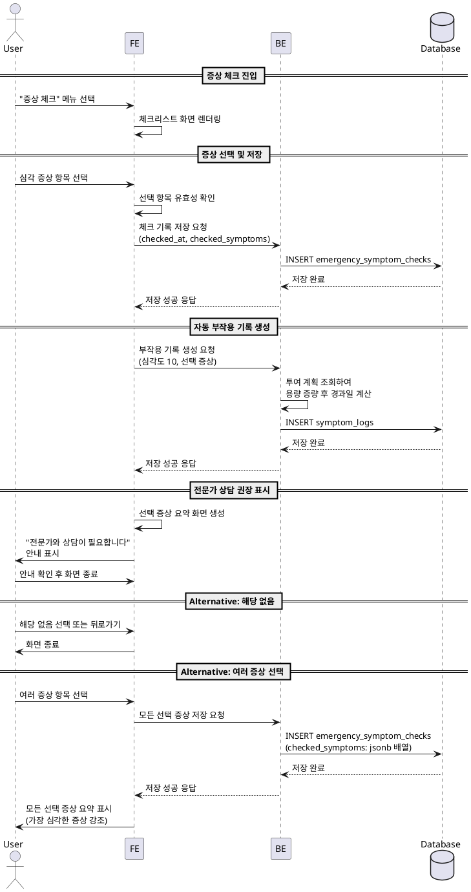

# F005: 증상 체크 및 전문가 상담 권장

## Use Case Specification

### Primary Actor
GLP-1 치료 중 심각한 증상을 경험하는 사용자

### Precondition
- 사용자가 로그인된 상태
- 사용자가 투여 계획을 설정한 상태
- 심각한 증상이 발생하거나 24시간 이상 증상이 지속되는 상황

### Trigger
- 사용자가 홈 대시보드 또는 증상 관련 영역에서 "증상 체크" 메뉴 선택
- F002에서 부작용 심각도 7-10점 입력 후 "24시간 이상 지속" 선택 시 자동 진입

### Main Scenario

1. 사용자가 "증상 체크" 메뉴 진입
2. 시스템이 체크리스트 형태의 증상 화면 표시
   - 일상 언어로 작성된 7개 심각 증상 항목
3. 사용자가 해당 증상 선택
4. 시스템이 선택된 증상 확인 및 저장 (날짜시간, 선택 증상)
5. 시스템이 자동으로 부작용 기록 생성 (심각도 10점, F002 연동)
6. 시스템이 전문가 상담 권장 화면 표시
   - 선택한 증상 요약
   - "전문가와 상담이 필요합니다" 안내 문구
7. 사용자가 안내 확인 후 화면 종료

### Alternative Flow 1: 해당 증상 없음
3a. 사용자가 해당 없음 선택 또는 뒤로가기
3b. 시스템이 체크 기록 없이 화면 종료

### Alternative Flow 2: 여러 증상 동시 선택
3a. 사용자가 여러 증상 항목 선택
4a. 시스템이 모든 선택 증상 저장
6a. 시스템이 선택된 모든 증상 요약 표시
6b. 가장 심각한 증상 우선 강조

### Edge Cases

**입력 관련**
- 증상 체크 후 안내만 확인하고 나가기: 저장된 기록 유지
- 같은 증상 반복 체크: 각 기록 별도 저장 (날짜시간으로 구분)
- 증상 체크 중 증상 완화: 기록 삭제 또는 수정 허용 (설정 메뉴 통해)

**데이터 저장 실패**
- 로컬 DB 저장 실패: 에러 메시지 표시, 재시도 옵션 제공
- 앱 종료 전 자동 저장 완료 보장

**UI/UX**
- 긴급 상황 고려하여 간결하고 명확한 문구 사용
- 선택 후 즉시 안내 화면 표시 (지연 최소화)
- 뒤로가기 동작 명확히 안내 (기록 저장 여부)

### Business Rules

**BR1: 체크리스트 항목 (7개 고정)**
- "24시간 이상 계속 구토하고 있어요"
- "물이나 음식을 전혀 삼킬 수 없어요"
- "매우 심한 복통이 있어요 (견디기 어려운 정도)"
- "설사가 48시간 이상 계속되고 있어요"
- "소변이 진한 갈색이거나 8시간 이상 나오지 않았어요"
- "대변에 피가 섞여 있거나 검은색이에요"
- "피부나 눈 흰자위가 노랗게 변했어요"

**BR2: 자동 부작용 기록 생성**
- 증상 체크 시 자동으로 symptom_logs 테이블에 기록 생성
- 심각도는 10점으로 고정
- 증상명은 체크리스트 항목 텍스트 그대로 저장

**BR3: 전문가 상담 권장 조건**
- 체크리스트에서 하나라도 선택 시 무조건 상담 권장 화면 표시
- 안내 문구는 긍정적이면서 긴급성을 전달하는 톤 사용

**BR4: 데이터 저장 규칙**
- 체크 기록은 emergency_symptom_checks 테이블에 저장
- 체크 시간은 timestamptz로 정확히 기록
- 선택한 증상 목록은 jsonb 형태로 저장

---

## Sequence Diagram

