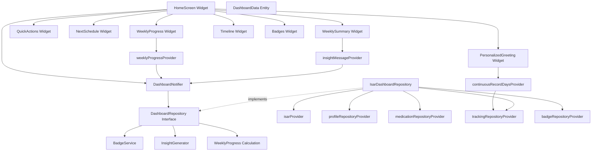

# Home Dashboard Implementation Plan (F006)

## 1. Overview

**Feature**: Home Dashboard (F006)
**Location**: `features/dashboard/`
**TDD Approach**: Outside-In (User-facing feature)
**Priority**: P0 (MVP Core)

### Modules

1. **Dashboard Domain Layer** - Business logic, entities, repository interfaces
2. **Dashboard Infrastructure Layer** - Repository implementations, DTOs, Isar schemas
3. **Dashboard Application Layer** - State management, notifiers, derived providers
4. **Dashboard Presentation Layer** - Screens, widgets, UI components

### TDD Coverage

- Unit Tests: 70% (Domain logic, calculations, badge system)
- Integration Tests: 20% (Repository + Notifier, data flow)
- Acceptance Tests: 10% (User scenarios, screen behavior)

---

## 2. Architecture Diagram



---

## 3. Implementation Plan

### Module 1: Domain Layer - Core Entities

**Location**: `features/dashboard/domain/entities/`

**Responsibility**: Define pure domain models without dependencies

**Test Strategy**: Unit Tests

**Test Scenarios (Red Phase)**:
1. DashboardData entity creation with all required fields
2. DashboardData copyWith functionality
3. DashboardData equality comparison
4. WeeklyProgress calculation with zero records
5. WeeklyProgress calculation with partial completion
6. WeeklyProgress calculation with 100% completion
7. WeeklyProgress rate clamping (0.0 ~ 1.0)
8. NextSchedule entity with null values
9. WeeklySummary text generation with no data
10. WeeklySummary text generation with complete data
11. TimelineEvent ordering by date
12. Edge: Negative values validation
13. Edge: Future date handling

**Implementation Order**:
1. Write test: "should create DashboardData with valid fields"
2. Implement: DashboardData class skeleton
3. Write test: "should calculate weekly progress rate correctly"
4. Implement: WeeklyProgress calculation logic
5. Write test: "should generate weekly summary text"
6. Implement: WeeklySummary text generator
7. Refactor: Extract common patterns

**Dependencies**: None (pure Dart)

**Files**:
- `dashboard_data.dart`
- `weekly_progress.dart`
- `next_schedule.dart`
- `weekly_summary.dart`
- `timeline_event.dart`

---

### Module 2: Domain Layer - Badge System

**Location**: `features/dashboard/domain/entities/badge_definition.dart`, `domain/services/badge_service.dart`

**Responsibility**: Badge logic, achievement conditions, progress calculation

**Test Strategy**: Unit Tests

**Test Scenarios (Red Phase)**:
1. BadgeDefinition creation with valid condition
2. Parse achievement condition from JSON
3. Badge progress calculation for streak badges (7 days, 30 days)
4. Badge progress calculation for weight badges (5%, 10%)
5. Badge progress calculation for first dose badge
6. Badge status transition: locked → in_progress → achieved
7. Multiple badge conditions check simultaneously
8. Badge priority ordering
9. Edge: Invalid JSON condition handling
10. Edge: Progress calculation with no data
11. Edge: Progress over 100%
12. Edge: Concurrent badge achievements

**Implementation Order**:
1. Write test: "should parse streak badge condition"
2. Implement: BadgeDefinition + JSON parser
3. Write test: "should calculate 7-day streak progress"
4. Implement: BadgeService.calculateStreakProgress
5. Write test: "should calculate weight loss progress"
6. Implement: BadgeService.calculateWeightProgress
7. Refactor: Strategy pattern for badge types

**Dependencies**:
- `features/tracking/domain/entities/` (WeightLog, SymptomLog)
- `features/tracking/domain/entities/` (DoseRecord)

**Files**:
- `badge_definition.dart`
- `user_badge.dart`
- `badge_service.dart` (Domain Service)

---

### Module 3: Domain Layer - Insight Generator

**Location**: `features/dashboard/domain/services/insight_generator.dart`

**Responsibility**: Generate personalized insight messages based on data patterns

**Test Strategy**: Unit Tests

**Test Scenarios (Red Phase)**:
1. Generate weight loss insight (1% decrease)
2. Generate continuous record insight (7+ days)
3. Generate symptom improvement insight (2+ points decrease)
4. Generate context pattern insight (tag correlation)
5. Generate goal progress insight (trend-based prediction)
6. Generate adherence insight (dose compliance)
7. Return null when no condition met
8. Prioritize multiple insights
9. Edge: Insufficient data for insights
10. Edge: Negative trends handling
11. Edge: Division by zero in calculations

**Implementation Order**:
1. Write test: "should generate weight loss insight"
2. Implement: InsightGenerator.generateWeightInsight
3. Write test: "should generate streak insight"
4. Implement: InsightGenerator.generateStreakInsight
5. Write test: "should return null when no conditions met"
6. Implement: Null return logic
7. Refactor: Extract calculation helpers

**Dependencies**:
- `features/tracking/domain/entities/`
- `features/tracking/domain/entities/`
- `features/onboarding/domain/entities/user_profile.dart`

**Files**:
- `insight_generator.dart` (Domain Service)

---

### Module 4: Domain Layer - Repository Interface

**Location**: `features/dashboard/domain/repositories/dashboard_repository.dart`

**Responsibility**: Define contract for dashboard data access

**Test Strategy**: Unit Tests (mock implementations)

**Test Scenarios (Red Phase)**:
1. Repository interface defines getDashboardData method
2. Repository interface defines refreshBadges method
3. Repository interface defines calculateWeeklyProgress method
4. Mock implementation returns expected data
5. Mock implementation handles errors

**Implementation Order**:
1. Write test: "should define getDashboardData contract"
2. Implement: DashboardRepository interface
3. Write test: "mock should return DashboardData"
4. Implement: MockDashboardRepository (for testing)
5. Refactor: N/A (simple interface)

**Dependencies**: Domain entities

**Files**:
- `dashboard_repository.dart` (Interface)

---

### Module 5: Infrastructure Layer - DTOs

**Location**: `features/dashboard/infrastructure/dtos/`

**Responsibility**: Isar collection schemas, DTO ↔ Entity conversion

**Test Strategy**: Unit Tests

**Test Scenarios (Red Phase)**:
1. BadgeDefinitionDto to Entity conversion
2. Entity to BadgeDefinitionDto conversion
3. UserBadgeDto to Entity conversion
4. Entity to UserBadgeDto conversion
5. JSONB field serialization (achievement_condition)
6. Null value handling
7. Edge: Invalid JSON deserialization
8. Edge: Missing required fields

**Implementation Order**:
1. Write test: "should convert BadgeDefinitionDto to entity"
2. Implement: BadgeDefinitionDto + toEntity
3. Write test: "should convert entity to BadgeDefinitionDto"
4. Implement: fromEntity method
5. Write test: "should handle JSONB achievement_condition"
6. Implement: JSON codec
7. Refactor: Extract common conversion logic

**Dependencies**: Isar, Domain entities

**Files**:
- `badge_definition_dto.dart`
- `user_badge_dto.dart`

---

### Module 6: Infrastructure Layer - Repository Implementation

**Location**: `features/dashboard/infrastructure/repositories/isar_dashboard_repository.dart`

**Responsibility**: Implement DashboardRepository using Isar + other repositories

**Test Strategy**: Integration Tests

**Test Scenarios (Red Phase)**:
1. Query user profile data
2. Query dose records for weekly progress
3. Query weight logs for continuous days
4. Query symptom logs
5. Query badge definitions
6. Query user badges
7. Calculate continuous record days
8. Calculate current treatment week
9. Calculate weekly progress (dose/weight/symptom)
10. Calculate goal completion ETA
11. Calculate adherence rate
12. Aggregate all data into DashboardData
13. Refresh badges (check conditions, update status)
14. Edge: No user profile found
15. Edge: Empty dose records
16. Edge: Query timeout
17. Edge: Concurrent read/write operations

**Implementation Order**:
1. Write test: "should aggregate data from all repositories"
2. Implement: IsarDashboardRepository.getDashboardData skeleton
3. Write test: "should calculate continuous record days"
4. Implement: _calculateContinuousRecordDays
5. Write test: "should calculate weekly progress"
6. Implement: _calculateWeeklyProgress
7. Write test: "should refresh badge statuses"
8. Implement: refreshBadges method
9. Refactor: Extract helper methods, reduce duplication

**Dependencies**:
- `isarProvider`
- `profileRepositoryProvider`
- `medicationRepositoryProvider`
- `trackingRepositoryProvider`
- `badgeRepositoryProvider`
- `BadgeService`
- `InsightGenerator`

**Files**:
- `isar_dashboard_repository.dart`

---

### Module 7: Application Layer - DashboardNotifier

**Location**: `features/dashboard/application/notifiers/dashboard_notifier.dart`

**Responsibility**: Manage dashboard state, expose data to UI

**Test Strategy**: Integration Tests

**Test Scenarios (Red Phase)**:
1. Initialize notifier with loading state
2. Build method loads DashboardData
3. Build method handles repository errors
4. Refresh method reloads data
5. State transitions: loading → data
6. State transitions: loading → error
7. State transitions: data → loading → data (refresh)
8. Edge: Rapid refresh calls (debounce)
9. Edge: Notifier disposed during load
10. Edge: Repository returns null

**Implementation Order**:
1. Write test: "should emit loading state initially"
2. Implement: DashboardNotifier skeleton with AsyncValue
3. Write test: "should load dashboard data on build"
4. Implement: build method with repository call
5. Write test: "should handle repository errors"
6. Implement: Error handling with AsyncValue.guard
7. Write test: "should refresh data"
8. Implement: refresh method
9. Refactor: Extract error mapping

**Dependencies**:
- `dashboardRepositoryProvider`
- Riverpod AsyncNotifier

**Files**:
- `dashboard_notifier.dart`

---

### Module 8: Application Layer - Derived Providers

**Location**: `features/dashboard/application/providers/`

**Responsibility**: Compute derived state from DashboardNotifier

**Test Strategy**: Unit Tests

**Test Scenarios (Red Phase)**:
1. weeklyProgressProvider calculates from DashboardData
2. continuousRecordDaysProvider extracts days count
3. insightMessageProvider extracts message
4. currentWeekProvider calculates treatment week
5. Providers handle null DashboardData
6. Providers handle loading state
7. Providers handle error state
8. Edge: DashboardNotifier not initialized

**Implementation Order**:
1. Write test: "weeklyProgressProvider should return progress"
2. Implement: weeklyProgressProvider
3. Write test: "continuousRecordDaysProvider should return days"
4. Implement: continuousRecordDaysProvider
5. Write test: "providers handle null data"
6. Implement: Null checks
7. Refactor: N/A (simple providers)

**Dependencies**: `dashboardNotifierProvider`

**Files**:
- `dashboard_providers.dart`

---

### Module 9: Presentation Layer - HomeScreen

**Location**: `features/dashboard/presentation/screens/home_screen.dart`

**Responsibility**: Main dashboard screen layout, widget composition

**Test Strategy**: Acceptance Tests (Widget Tests)

**Test Scenarios (Red Phase)**:
1. Render loading state with skeleton UI
2. Render error state with retry button
3. Render success state with all widgets
4. Display personalized greeting
5. Display weekly progress bars
6. Display quick action buttons
7. Display next schedule info
8. Display weekly summary
9. Display timeline
10. Display badges
11. Navigate to recording screen on quick action tap
12. Refresh data on pull-to-refresh
13. Edge: Empty data state
14. Edge: Partial data state

**Implementation Order**:
1. Write test: "should show loading indicator"
2. Implement: HomeScreen scaffold + loading state
3. Write test: "should show error message"
4. Implement: Error UI with retry button
5. Write test: "should display all dashboard widgets"
6. Implement: Widget composition with mocked data
7. Write test: "should navigate on quick action tap"
8. Implement: Navigation logic
9. Refactor: Extract layout constants, reduce nesting

**Dependencies**:
- `dashboardNotifierProvider`
- Riverpod ConsumerWidget
- go_router

**Files**:
- `home_screen.dart`

**QA Sheet** (Manual Testing):
- [ ] Loading state displays skeleton UI smoothly
- [ ] Error state shows clear message and retry button
- [ ] All widgets render without overflow
- [ ] Quick action buttons navigate correctly
- [ ] Pull-to-refresh triggers data reload
- [ ] Scroll performance is smooth (60fps)
- [ ] Weekly progress bars animate correctly
- [ ] Badge acquisition triggers celebration animation
- [ ] Text readability on light/dark themes
- [ ] Layout adapts to small/large screens

---

### Module 10: Presentation Layer - Sub Widgets

**Location**: `features/dashboard/presentation/widgets/`

**Responsibility**: Reusable UI components

**Test Strategy**: Widget Tests + Manual QA

**Test Scenarios (Red Phase)**:
1. PersonalizedGreeting displays name, days, week
2. WeeklyProgressWidget displays 3 progress bars
3. QuickActionsWidget displays 3 buttons
4. NextScheduleWidget displays schedule info
5. WeeklySummaryWidget displays text + mini chart
6. TimelineWidget displays events chronologically
7. BadgesWidget displays acquired + in-progress badges
8. Widgets handle null/empty data gracefully
9. Edge: Long text overflow handling
10. Edge: Large numbers formatting

**Implementation Order**:
1. Write test: "PersonalizedGreeting shows user name"
2. Implement: PersonalizedGreeting widget
3. Write test: "WeeklyProgressWidget shows 3 bars"
4. Implement: WeeklyProgressWidget
5. Write test: "QuickActionsWidget has 3 buttons"
6. Implement: QuickActionsWidget
7. Continue for other widgets
8. Refactor: Extract common styling

**Dependencies**:
- Domain entities
- fl_chart (for mini charts)
- Material Design

**Files**:
- `personalized_greeting.dart`
- `weekly_progress_widget.dart`
- `quick_actions_widget.dart`
- `next_schedule_widget.dart`
- `weekly_summary_widget.dart`
- `timeline_widget.dart`
- `badges_widget.dart`

**QA Sheet** (Manual Testing):
- [ ] All widgets match design mockups
- [ ] Animations are smooth and delightful
- [ ] Touch targets are >= 48x48 dp
- [ ] Colors meet WCAG AA contrast ratio
- [ ] Text scales with system font size
- [ ] Widgets adapt to different screen widths
- [ ] Celebration animations trigger correctly
- [ ] Progress bars animate smoothly
- [ ] Charts are readable and interactive

---

## 4. TDD Workflow

### Starting Point
**First Test**: `badge_definition_test.dart`
- "should create BadgeDefinition with valid fields"

### Execution Order

1. **Domain Entities** (Inside-Out for core logic)
   - Red: Write entity tests
   - Green: Implement minimal entities
   - Refactor: Add convenience methods

2. **Badge Service** (Inside-Out)
   - Red: Write badge calculation tests
   - Green: Implement calculation logic
   - Refactor: Extract strategies

3. **Insight Generator** (Inside-Out)
   - Red: Write insight tests
   - Green: Implement generators
   - Refactor: Remove duplication

4. **Repository Interface** (Contract)
   - Red: Write interface contract tests
   - Green: Define interface
   - Refactor: N/A

5. **DTOs** (Infrastructure)
   - Red: Write conversion tests
   - Green: Implement DTOs
   - Refactor: Extract conversion helpers

6. **Repository Implementation** (Infrastructure)
   - Red: Write integration tests
   - Green: Implement Isar queries
   - Refactor: Extract query builders

7. **DashboardNotifier** (Application)
   - Red: Write state management tests
   - Green: Implement notifier
   - Refactor: Extract error handling

8. **Derived Providers** (Application)
   - Red: Write derived state tests
   - Green: Implement providers
   - Refactor: N/A

9. **HomeScreen** (Presentation - Outside-In)
   - Red: Write acceptance tests
   - Green: Implement layout
   - Refactor: Extract constants

10. **Sub Widgets** (Presentation)
    - Red: Write widget tests
    - Green: Implement widgets
    - Refactor: Extract common styling

### Commit Points
- After each Green phase
- Before major refactoring
- After completing each module
- Examples:
  - "test: add badge calculation tests (Red)"
  - "feat: implement badge service (Green)"
  - "refactor: extract badge strategies"
  - "feat: complete domain layer for dashboard"

### Completion Criteria
- All tests pass (100% of written tests)
- Test coverage >= 70% for Domain/Application
- Test coverage >= 60% for Infrastructure
- Widget tests for all critical UI flows
- Manual QA sheet completed
- No code smells (SonarLint clean)
- Performance: Dashboard loads < 100ms (cached), < 500ms (fresh)

---

## 5. Test Examples

### Unit Test Example (Domain)

```dart
// test/features/dashboard/domain/services/badge_service_test.dart
void main() {
  group('BadgeService', () {
    late BadgeService service;

    setUp(() {
      service = BadgeService();
    });

    group('calculateStreakProgress', () {
      test('should return 0% when no records', () {
        // Arrange
        final records = <DateTime>[];
        final condition = {'type': 'streak', 'days': 7};

        // Act
        final progress = service.calculateStreakProgress(records, condition);

        // Assert
        expect(progress, 0);
      });

      test('should return 100% when 7 consecutive days', () {
        // Arrange
        final records = List.generate(
          7,
          (i) => DateTime.now().subtract(Duration(days: i)),
        );
        final condition = {'type': 'streak', 'days': 7};

        // Act
        final progress = service.calculateStreakProgress(records, condition);

        // Assert
        expect(progress, 100);
      });

      test('should return 50% when 3.5 days out of 7', () {
        // Arrange
        final records = [
          DateTime.now(),
          DateTime.now().subtract(Duration(days: 1)),
          DateTime.now().subtract(Duration(days: 2)),
        ];
        final condition = {'type': 'streak', 'days': 7};

        // Act
        final progress = service.calculateStreakProgress(records, condition);

        // Assert
        expect(progress, closeTo(42.86, 0.1)); // 3/7 * 100
      });
    });
  });
}
```

### Integration Test Example (Infrastructure)

```dart
// test/features/dashboard/infrastructure/repositories/isar_dashboard_repository_test.dart
void main() {
  group('IsarDashboardRepository', () {
    late Isar isar;
    late IsarDashboardRepository repository;
    late MockProfileRepository mockProfileRepo;
    late MockMedicationRepository mockMedicationRepo;
    late MockTrackingRepository mockTrackingRepo;
    late MockBadgeRepository mockBadgeRepo;

    setUp(() async {
      isar = await Isar.open([/* schemas */], directory: '');
      mockProfileRepo = MockProfileRepository();
      mockMedicationRepo = MockMedicationRepository();
      mockTrackingRepo = MockTrackingRepository();
      mockBadgeRepo = MockBadgeRepository();

      repository = IsarDashboardRepository(
        isar: isar,
        profileRepository: mockProfileRepo,
        medicationRepository: mockMedicationRepo,
        trackingRepository: mockTrackingRepo,
        badgeRepository: mockBadgeRepo,
      );
    });

    tearDown(() async {
      await isar.close();
    });

    test('should aggregate data from all repositories', () async {
      // Arrange
      when(mockProfileRepo.getUserProfile()).thenAnswer(
        (_) async => UserProfile(/* test data */),
      );
      when(mockMedicationRepo.getDoseRecords()).thenAnswer(
        (_) async => [DoseRecord(/* test data */)],
      );
      when(mockTrackingRepo.getWeightLogs()).thenAnswer(
        (_) async => [WeightLog(/* test data */)],
      );
      when(mockBadgeRepo.getUserBadges()).thenAnswer(
        (_) async => [UserBadge(/* test data */)],
      );

      // Act
      final result = await repository.getDashboardData();

      // Assert
      expect(result, isA<DashboardData>());
      expect(result.userName, isNotEmpty);
      expect(result.continuousRecordDays, greaterThanOrEqualTo(0));
      verify(mockProfileRepo.getUserProfile()).called(1);
      verify(mockMedicationRepo.getDoseRecords()).called(1);
    });
  });
}
```

### Acceptance Test Example (Presentation)

```dart
// test/features/dashboard/presentation/screens/home_screen_test.dart
void main() {
  group('HomeScreen', () {
    testWidgets('should show loading indicator initially', (tester) async {
      // Arrange
      final container = ProviderContainer(
        overrides: [
          dashboardNotifierProvider.overrideWith(
            (ref) => MockDashboardNotifier()..state = AsyncValue.loading(),
          ),
        ],
      );

      // Act
      await tester.pumpWidget(
        UncontrolledProviderScope(
          container: container,
          child: MaterialApp(home: HomeScreen()),
        ),
      );

      // Assert
      expect(find.byType(CircularProgressIndicator), findsOneWidget);
    });

    testWidgets('should display all dashboard widgets on success', (tester) async {
      // Arrange
      final testData = DashboardData(/* test values */);
      final container = ProviderContainer(
        overrides: [
          dashboardNotifierProvider.overrideWith(
            (ref) => MockDashboardNotifier()..state = AsyncValue.data(testData),
          ),
        ],
      );

      // Act
      await tester.pumpWidget(
        UncontrolledProviderScope(
          container: container,
          child: MaterialApp(home: HomeScreen()),
        ),
      );

      // Assert
      expect(find.byType(PersonalizedGreeting), findsOneWidget);
      expect(find.byType(WeeklyProgressWidget), findsOneWidget);
      expect(find.byType(QuickActionsWidget), findsOneWidget);
      expect(find.byType(NextScheduleWidget), findsOneWidget);
      expect(find.byType(WeeklySummaryWidget), findsOneWidget);
      expect(find.byType(TimelineWidget), findsOneWidget);
      expect(find.byType(BadgesWidget), findsOneWidget);
    });

    testWidgets('should navigate to weight log screen on quick action tap', (tester) async {
      // Arrange
      final testData = DashboardData(/* test values */);
      final container = ProviderContainer(/* overrides */);
      final mockGoRouter = MockGoRouter();

      // Act
      await tester.pumpWidget(/* widget tree */);
      await tester.tap(find.byKey(Key('quick_action_weight')));
      await tester.pumpAndSettle();

      // Assert
      verify(mockGoRouter.push('/weight-log')).called(1);
    });
  });
}
```

---

## 6. Core Principles Applied

### Test First
- Every test written BEFORE implementation
- Verify test fails for correct reason
- Red → Green → Refactor strictly followed

### Small Steps
- One test scenario per cycle
- Minimal code to pass test
- Incremental feature building

### FIRST Principles
- **Fast**: Domain tests < 10ms, Integration < 100ms
- **Independent**: No shared state, isolated test data
- **Repeatable**: Same result on every run
- **Self-validating**: Clear pass/fail, no manual checks
- **Timely**: Written immediately before implementation

### Test Pyramid
- **Unit (70%)**: Badge logic, calculations, insight generator
- **Integration (20%)**: Repository + Notifier interactions
- **Acceptance (10%)**: HomeScreen user scenarios

### Outside-In Strategy
- Start with HomeScreen acceptance test (user-facing)
- Mock lower layers initially
- Drill down to Domain/Infrastructure
- Replace mocks with real implementations

---

## 7. Dependencies Setup

### Required Packages

```yaml
dependencies:
  flutter:
    sdk: flutter
  riverpod: ^2.4.0
  flutter_riverpod: ^2.4.0
  isar: ^3.1.0
  isar_flutter_libs: ^3.1.0
  fl_chart: ^0.66.0
  go_router: ^13.0.0

dev_dependencies:
  flutter_test:
    sdk: flutter
  isar_generator: ^3.1.0
  build_runner: ^2.4.0
  mockito: ^5.4.0
  mocktail: ^1.0.0
```

### Code Generation

```bash
# Run after DTO creation
flutter pub run build_runner build --delete-conflicting-outputs
```

---

## 8. Performance Targets

- Dashboard data load (cached): < 100ms
- Dashboard data load (fresh query): < 500ms
- Badge calculation: < 50ms for all badges
- Insight generation: < 30ms
- UI render (60fps): 16ms per frame
- Memory footprint: < 50MB for dashboard feature

---

## 9. Checklist

### Domain Layer
- [ ] DashboardData entity tests pass
- [ ] WeeklyProgress calculation tests pass
- [ ] BadgeDefinition + UserBadge entity tests pass
- [ ] BadgeService tests pass (all badge types)
- [ ] InsightGenerator tests pass (all insight types)
- [ ] DashboardRepository interface defined
- [ ] MockDashboardRepository created

### Infrastructure Layer
- [ ] BadgeDefinitionDto conversion tests pass
- [ ] UserBadgeDto conversion tests pass
- [ ] IsarDashboardRepository integration tests pass
- [ ] Query performance meets targets
- [ ] Error handling tests pass

### Application Layer
- [ ] DashboardNotifier state tests pass
- [ ] Derived providers tests pass
- [ ] Error state handling tests pass
- [ ] Refresh logic tests pass

### Presentation Layer
- [ ] HomeScreen acceptance tests pass
- [ ] All widget tests pass
- [ ] Navigation tests pass
- [ ] Loading/Error/Success state UI tests pass
- [ ] Manual QA sheet completed

### Integration
- [ ] End-to-end test: App launch → Dashboard load → Quick action → Return
- [ ] Repository pattern verified (no direct Isar access from Application)
- [ ] Layer boundaries respected (no Flutter in Domain)
- [ ] Performance targets met

### Documentation
- [ ] API documentation (dartdoc) complete
- [ ] README with setup instructions
- [ ] Test coverage report generated
