# 홈 대시보드 (F006) Implementation Plan

## 1. 개요

홈 대시보드는 사용자 치료 진행 상황을 한눈에 파악하고 지속적인 동기 부여를 제공하는 핵심 화면. 4-Layer Architecture + Repository Pattern + TDD 적용.

**모듈 구조:**
- **Domain Layer**: 대시보드 집계 로직, 뱃지 검증 로직, 통계 계산 UseCase
- **Application Layer**: DashboardNotifier (AsyncNotifier), 파생 Provider들
- **Infrastructure Layer**: BadgeRepository, 기존 Repository 재사용
- **Presentation Layer**: DashboardScreen, 위젯 컴포넌트

**TDD 적용 범위:**
- Domain UseCase: Unit Test 100%
- Application Notifier: Integration Test 주요 시나리오
- Presentation: Acceptance Test (Golden Test 포함)

---

## 2. Architecture Diagram

```mermaid
graph TD
    %% Presentation Layer
    DashboardScreen[DashboardScreen]
    GreetingWidget[GreetingWidget]
    WeeklyProgressWidget[WeeklyProgressWidget]
    QuickActionWidget[QuickActionWidget]
    NextScheduleWidget[NextScheduleWidget]
    WeeklyReportWidget[WeeklyReportWidget]
    TimelineWidget[TimelineWidget]
    BadgeWidget[BadgeWidget]

    %% Application Layer
    DashboardNotifier[DashboardNotifier<br/>AsyncNotifierProvider]
    ContinuousRecordDaysProvider[continuousRecordDaysProvider<br/>Provider]
    CurrentWeekProvider[currentWeekProvider<br/>Provider]
    WeeklyProgressProvider[weeklyProgressProvider<br/>Provider]
    InsightMessageProvider[insightMessageProvider<br/>Provider]

    %% Domain Layer
    CalculateContinuousRecordDaysUseCase[CalculateContinuousRecordDaysUseCase]
    CalculateCurrentWeekUseCase[CalculateCurrentWeekUseCase]
    CalculateWeeklyProgressUseCase[CalculateWeeklyProgressUseCase]
    CalculateAdherenceUseCase[CalculateAdherenceUseCase]
    CalculateWeightGoalEstimateUseCase[CalculateWeightGoalEstimateUseCase]
    VerifyBadgeConditionsUseCase[VerifyBadgeConditionsUseCase]
    GenerateInsightMessageUseCase[GenerateInsightMessageUseCase]
    DashboardData[DashboardData Entity]
    WeeklyProgress[WeeklyProgress Entity]
    NextSchedule[NextSchedule Entity]
    WeeklySummary[WeeklySummary Entity]
    TimelineEvent[TimelineEvent Entity]

    %% Infrastructure Layer
    BadgeRepository[BadgeRepository<br/>Interface]
    IsarBadgeRepository[IsarBadgeRepository<br/>Implementation]
    ProfileRepository[ProfileRepository<br/>재사용]
    TrackingRepository[TrackingRepository<br/>재사용]
    MedicationRepository[MedicationRepository<br/>재사용]

    %% Dependencies
    DashboardScreen --> DashboardNotifier
    DashboardScreen --> GreetingWidget
    DashboardScreen --> WeeklyProgressWidget
    DashboardScreen --> QuickActionWidget
    DashboardScreen --> NextScheduleWidget
    DashboardScreen --> WeeklyReportWidget
    DashboardScreen --> TimelineWidget
    DashboardScreen --> BadgeWidget

    GreetingWidget --> ContinuousRecordDaysProvider
    GreetingWidget --> CurrentWeekProvider
    WeeklyProgressWidget --> WeeklyProgressProvider
    BadgeWidget --> DashboardNotifier

    DashboardNotifier --> ProfileRepository
    DashboardNotifier --> TrackingRepository
    DashboardNotifier --> MedicationRepository
    DashboardNotifier --> BadgeRepository
    DashboardNotifier --> CalculateContinuousRecordDaysUseCase
    DashboardNotifier --> CalculateCurrentWeekUseCase
    DashboardNotifier --> CalculateWeeklyProgressUseCase
    DashboardNotifier --> CalculateAdherenceUseCase
    DashboardNotifier --> CalculateWeightGoalEstimateUseCase
    DashboardNotifier --> VerifyBadgeConditionsUseCase
    DashboardNotifier --> GenerateInsightMessageUseCase

    ContinuousRecordDaysProvider --> CalculateContinuousRecordDaysUseCase
    ContinuousRecordDaysProvider --> TrackingRepository
    CurrentWeekProvider --> CalculateCurrentWeekUseCase
    CurrentWeekProvider --> MedicationRepository
    WeeklyProgressProvider --> CalculateWeeklyProgressUseCase
    WeeklyProgressProvider --> TrackingRepository
    WeeklyProgressProvider --> MedicationRepository
    InsightMessageProvider --> GenerateInsightMessageUseCase
    InsightMessageProvider --> DashboardNotifier

    CalculateContinuousRecordDaysUseCase --> DashboardData
    CalculateWeeklyProgressUseCase --> WeeklyProgress
    VerifyBadgeConditionsUseCase --> BadgeRepository

    IsarBadgeRepository --> BadgeRepository
```



---

## 3. Implementation Plan

### 3.1 Domain Layer - Entities

**Location**: `lib/features/dashboard/domain/entities/`

**Responsibility**: 대시보드 데이터 구조 정의

**Test Strategy**: Unit Test (Serialization/Deserialization, Equality)

**Test Scenarios (Red Phase):**
```dart
// dashboard_data_test.dart
group('DashboardData', () {
  test('should create valid DashboardData instance', () {});
  test('should support equality comparison', () {});
  test('should copyWith correctly', () {});
});

// weekly_progress_test.dart
group('WeeklyProgress', () {
  test('should calculate rate correctly', () {});
  test('should handle zero target count', () {});
  test('should clamp rate between 0.0 and 1.0', () {});
});

// next_schedule_test.dart
group('NextSchedule', () {
  test('should format date correctly', () {});
  test('should handle null escalation date', () {});
});

// weekly_summary_test.dart
group('WeeklySummary', () {
  test('should format text summary', () {});
  test('should handle empty records', () {});
});

// timeline_event_test.dart
group('TimelineEvent', () {
  test('should create milestone event', () {});
  test('should sort events by date', () {});
});
```

**Implementation Order (TDD):**
1. DashboardData Entity
2. WeeklyProgress Entity
3. NextSchedule Entity
4. WeeklySummary Entity
5. TimelineEvent Entity

**Dependencies**: None (Pure Dart)

---

### 3.2 Domain Layer - UseCases

**Location**: `lib/features/dashboard/domain/usecases/`

**Responsibility**: 비즈니스 로직 캡슐화 (계산, 검증)

**Test Strategy**: Unit Test (AAA Pattern)

**Test Scenarios (Red Phase):**

#### CalculateContinuousRecordDaysUseCase
```dart
group('CalculateContinuousRecordDaysUseCase', () {
  // Arrange
  late CalculateContinuousRecordDaysUseCase useCase;

  setUp(() {
    useCase = CalculateContinuousRecordDaysUseCase();
  });

  test('should return 0 when no records exist', () {});
  test('should return 1 when only today has record', () {});
  test('should return 7 when continuous 7 days record exist', () {});
  test('should reset to 0 when gap exists in records', () {});
  test('should handle mixed weight and symptom logs', () {});
  test('should handle duplicate logs on same date', () {});
});
```

#### CalculateCurrentWeekUseCase
```dart
group('CalculateCurrentWeekUseCase', () {
  test('should return 1 for treatment start date', () {});
  test('should return 2 after 7 days', () {});
  test('should return correct week for arbitrary date', () {});
  test('should handle timezone correctly', () {});
});
```

#### CalculateWeeklyProgressUseCase
```dart
group('CalculateWeeklyProgressUseCase', () {
  test('should calculate dose progress correctly', () {});
  test('should calculate weight record progress correctly', () {});
  test('should calculate symptom record progress correctly', () {});
  test('should handle zero target count', () {});
  test('should handle over 100% achievement', () {});
  test('should filter records within last 7 days', () {});
});
```

#### CalculateAdherenceUseCase
```dart
group('CalculateAdherenceUseCase', () {
  test('should return 100% when all doses completed', () {});
  test('should return 50% when half doses completed', () {});
  test('should return 0% when no doses completed', () {});
  test('should exclude future schedules', () {});
  test('should handle empty schedules', () {});
});
```

#### CalculateWeightGoalEstimateUseCase
```dart
group('CalculateWeightGoalEstimateUseCase', () {
  test('should estimate goal date with linear regression', () {});
  test('should return null when insufficient data (< 2 weeks)', () {});
  test('should return null when no weight loss trend', () {});
  test('should handle already achieved goal', () {});
  test('should handle weight gain trend', () {});
});
```

#### VerifyBadgeConditionsUseCase
```dart
group('VerifyBadgeConditionsUseCase', () {
  test('should verify "연속 7일 기록" badge', () {});
  test('should verify "연속 30일 기록" badge', () {});
  test('should verify "체중 5% 감량" badge', () {});
  test('should verify "체중 10% 감량" badge', () {});
  test('should verify "첫 투여 완료" badge', () {});
  test('should calculate progress percentage correctly', () {});
  test('should mark badge as achieved when condition met', () {});
});
```

#### GenerateInsightMessageUseCase
```dart
group('GenerateInsightMessageUseCase', () {
  test('should generate weight loss message when > 1%', () {});
  test('should generate continuous record message when >= 7 days', () {});
  test('should generate symptom improvement message', () {});
  test('should generate context pattern message', () {});
  test('should generate goal progress message', () {});
  test('should generate adherence correlation message', () {});
  test('should return default message when no condition met', () {});
  test('should prioritize messages by importance', () {});
});
```

**Implementation Order (TDD):**
1. CalculateContinuousRecordDaysUseCase
2. CalculateCurrentWeekUseCase
3. CalculateWeeklyProgressUseCase
4. CalculateAdherenceUseCase
5. CalculateWeightGoalEstimateUseCase
6. VerifyBadgeConditionsUseCase
7. GenerateInsightMessageUseCase (P1)

**Dependencies**: Domain Entities

---

### 3.3 Domain Layer - Repository Interface

**Location**: `lib/features/dashboard/domain/repositories/badge_repository.dart`

**Responsibility**: 뱃지 데이터 접근 인터페이스 정의

**Test Strategy**: Mock으로 검증 (실제 구현은 Infrastructure 테스트)

**Test Scenarios (Red Phase):**
```dart
group('BadgeRepository Interface', () {
  test('should define getBadgeDefinitions method', () {});
  test('should define getUserBadges method', () {});
  test('should define updateBadgeProgress method', () {});
  test('should define achieveBadge method', () {});
});
```

**Implementation Order:**
1. BadgeRepository Interface 정의

**Dependencies**: Badge Entity (Domain)

---

### 3.4 Infrastructure Layer - Repository Implementation

**Location**: `lib/features/dashboard/infrastructure/repositories/isar_badge_repository.dart`

**Responsibility**: Isar DB를 통한 뱃지 CRUD 구현

**Test Strategy**: Integration Test (Isar In-Memory DB)

**Test Scenarios (Red Phase):**
```dart
group('IsarBadgeRepository', () {
  late Isar isar;
  late IsarBadgeRepository repository;

  setUp(() async {
    isar = await Isar.open([BadgeDefinitionDtoSchema, UserBadgeDtoSchema],
                            directory: '');
    repository = IsarBadgeRepository(isar);
  });

  tearDown(() async {
    await isar.close(deleteFromDisk: true);
  });

  test('should get all badge definitions', () {});
  test('should get user badges by userId', () {});
  test('should update badge progress', () {});
  test('should achieve badge (status to achieved)', () {});
  test('should create new badge if not exists', () {});
  test('should handle concurrent updates safely', () {});
});
```

**Implementation Order:**
1. BadgeDefinitionDto (Isar Collection)
2. UserBadgeDto (Isar Collection)
3. IsarBadgeRepository Implementation

**Dependencies**:
- Isar
- BadgeRepository Interface
- Badge Entities

---

### 3.5 Application Layer - DashboardNotifier

**Location**: `lib/features/dashboard/application/notifiers/dashboard_notifier.dart`

**Responsibility**: 대시보드 상태 관리 및 UseCase 오케스트레이션

**Test Strategy**: Integration Test (Mock Repository)

**Test Scenarios (Red Phase):**
```dart
group('DashboardNotifier', () {
  late MockProfileRepository mockProfileRepository;
  late MockTrackingRepository mockTrackingRepository;
  late MockMedicationRepository mockMedicationRepository;
  late MockBadgeRepository mockBadgeRepository;
  late ProviderContainer container;

  setUp(() {
    mockProfileRepository = MockProfileRepository();
    mockTrackingRepository = MockTrackingRepository();
    mockMedicationRepository = MockMedicationRepository();
    mockBadgeRepository = MockBadgeRepository();

    container = ProviderContainer(
      overrides: [
        profileRepositoryProvider.overrideWithValue(mockProfileRepository),
        trackingRepositoryProvider.overrideWithValue(mockTrackingRepository),
        medicationRepositoryProvider.overrideWithValue(mockMedicationRepository),
        badgeRepositoryProvider.overrideWithValue(mockBadgeRepository),
      ],
    );
  });

  tearDown(() {
    container.dispose();
  });

  test('should load dashboard data on build', () async {});
  test('should emit loading state initially', () {});
  test('should emit data state after successful load', () {});
  test('should emit error state on repository failure', () {});
  test('should refresh data on refresh() call', () {});
  test('should calculate all statistics correctly', () {});
  test('should verify badge conditions and update progress', () {});
  test('should detect new badge achievement', () {});
  test('should handle empty data gracefully', () {});
  test('should aggregate data from multiple repositories', () {});
});
```

**Implementation Order:**
1. DashboardNotifier build() method
2. refresh() method
3. _loadDashboardData() private method
4. Badge verification logic integration

**Dependencies**:
- All Repositories
- All Domain UseCases
- DashboardData Entity

---

### 3.6 Application Layer - Derived Providers

**Location**: `lib/features/dashboard/application/providers.dart`

**Responsibility**: 특정 데이터 파생 계산

**Test Strategy**: Unit Test (Provider Test)

**Test Scenarios (Red Phase):**
```dart
group('continuousRecordDaysProvider', () {
  test('should derive continuous days from tracking repository', () {});
  test('should return 0 when no records', () {});
  test('should invalidate when tracking data changes', () {});
});

group('currentWeekProvider', () {
  test('should calculate week from medication start date', () {});
  test('should update when time changes', () {});
});

group('weeklyProgressProvider', () {
  test('should aggregate progress from multiple sources', () {});
  test('should handle missing data', () {});
});

group('insightMessageProvider', () {
  test('should generate message based on dashboard data', () {});
  test('should return null when no insight', () {});
});
```

**Implementation Order:**
1. continuousRecordDaysProvider
2. currentWeekProvider
3. weeklyProgressProvider
4. insightMessageProvider (P1)

**Dependencies**:
- Repositories
- UseCases

---

### 3.7 Presentation Layer - Widgets

**Location**: `lib/features/dashboard/presentation/widgets/`

**Responsibility**: UI 컴포넌트 렌더링

**Test Strategy**: Widget Test + Golden Test

**Test Scenarios (Red Phase):**

#### GreetingWidget
```dart
group('GreetingWidget', () {
  testWidgets('should display user name correctly', (tester) async {});
  testWidgets('should display continuous record days', (tester) async {});
  testWidgets('should display current week', (tester) async {});
  testWidgets('should show loading state', (tester) async {});
  testWidgets('should match golden file', (tester) async {});
});
```

#### WeeklyProgressWidget
```dart
group('WeeklyProgressWidget', () {
  testWidgets('should display dose progress bar', (tester) async {});
  testWidgets('should display weight record progress bar', (tester) async {});
  testWidgets('should display symptom record progress bar', (tester) async {});
  testWidgets('should highlight 100% achievement', (tester) async {});
  testWidgets('should show 0% for no progress', (tester) async {});
  testWidgets('should match golden file', (tester) async {});
});
```

#### QuickActionWidget
```dart
group('QuickActionWidget', () {
  testWidgets('should render three action buttons', (tester) async {});
  testWidgets('should navigate on button tap', (tester) async {});
  testWidgets('should prevent duplicate taps (debounce)', (tester) async {});
  testWidgets('should match golden file', (tester) async {});
});
```

#### NextScheduleWidget
```dart
group('NextScheduleWidget', () {
  testWidgets('should display next dose date and amount', (tester) async {});
  testWidgets('should display next escalation date', (tester) async {});
  testWidgets('should display goal estimate date', (tester) async {});
  testWidgets('should handle null escalation date', (tester) async {});
  testWidgets('should match golden file', (tester) async {});
});
```

#### WeeklyReportWidget
```dart
group('WeeklyReportWidget', () {
  testWidgets('should display text summary', (tester) async {});
  testWidgets('should render mini chart', (tester) async {});
  testWidgets('should display adherence percentage', (tester) async {});
  testWidgets('should navigate on tap', (tester) async {});
  testWidgets('should match golden file', (tester) async {});
});
```

#### TimelineWidget
```dart
group('TimelineWidget', () {
  testWidgets('should render timeline events', (tester) async {});
  testWidgets('should display milestones correctly', (tester) async {});
  testWidgets('should show progress to next goal', (tester) async {});
  testWidgets('should handle empty timeline', (tester) async {});
  testWidgets('should match golden file', (tester) async {});
});
```

#### BadgeWidget
```dart
group('BadgeWidget', () {
  testWidgets('should display achieved badges', (tester) async {});
  testWidgets('should display in-progress badges', (tester) async {});
  testWidgets('should show progress percentage', (tester) async {});
  testWidgets('should show achievement animation', (tester) async {});
  testWidgets('should match golden file', (tester) async {});
});
```

**Implementation Order:**
1. GreetingWidget
2. WeeklyProgressWidget
3. QuickActionWidget
4. NextScheduleWidget
5. WeeklyReportWidget
6. TimelineWidget
7. BadgeWidget

**Dependencies**:
- Application Notifiers/Providers
- Riverpod ConsumerWidget

---

### 3.8 Presentation Layer - DashboardScreen

**Location**: `lib/features/dashboard/presentation/screens/dashboard_screen.dart`

**Responsibility**: 대시보드 전체 화면 구성

**Test Strategy**: Acceptance Test (Widget Test)

**Test Scenarios (Red Phase):**
```dart
group('DashboardScreen Acceptance Tests', () {
  testWidgets('should render all sections on successful load', (tester) async {});
  testWidgets('should show loading indicator initially', (tester) async {});
  testWidgets('should show error message on failure', (tester) async {});
  testWidgets('should refresh on pull-to-refresh', (tester) async {});
  testWidgets('should navigate on quick action tap', (tester) async {});
  testWidgets('should show achievement animation', (tester) async {});
  testWidgets('should show 100% achievement highlight', (tester) async {});
  testWidgets('should display empty state for new user', (tester) async {});
  testWidgets('should match golden file (full screen)', (tester) async {});
});
```

**QA Sheet (Manual Testing):**
1. 홈 화면 진입 시 모든 섹션 정상 렌더링 확인
2. 개인화 인사 영역 데이터 정확도 확인
3. 주간 목표 진행도 시각화 정확도 확인
4. 퀵 액션 버튼 네비게이션 동작 확인
5. 다음 일정 표시 정확도 확인
6. 주간 리포트 차트 렌더링 확인
7. 타임라인 이벤트 정렬 확인
8. 뱃지 획득 조건 충족 시 알림 확인
9. 투여 완료 시 축하 효과 확인
10. Pull-to-Refresh 동작 확인
11. 네트워크 오류 시 캐시 데이터 표시 확인
12. 로딩 상태 UI 확인

**Implementation Order:**
1. DashboardScreen Layout
2. AsyncValue State Handling (Loading/Data/Error)
3. Pull-to-Refresh
4. Navigation Integration
5. Achievement Animation

**Dependencies**:
- DashboardNotifier
- All Widgets
- Router (core/routing)

---

## 4. TDD Workflow

### Phase 1: Domain Layer (Inside-Out)
1. **Start**: Entity 테스트 작성 → 실패 확인 → Entity 구현 → 통과 확인
2. **UseCase**: 각 UseCase별로 Red → Green → Refactor
   - CalculateContinuousRecordDaysUseCase
   - CalculateCurrentWeekUseCase
   - CalculateWeeklyProgressUseCase
   - CalculateAdherenceUseCase
   - CalculateWeightGoalEstimateUseCase
   - VerifyBadgeConditionsUseCase
   - GenerateInsightMessageUseCase (P1)
3. **Commit Point**: 모든 Domain Layer 테스트 통과 후 Commit

### Phase 2: Infrastructure Layer
1. **Repository**: BadgeRepository 인터페이스 정의 → Isar 구현
2. **DTO**: BadgeDefinitionDto, UserBadgeDto 정의
3. **Integration Test**: In-Memory Isar로 CRUD 검증
4. **Commit Point**: Infrastructure Layer 테스트 통과 후 Commit

### Phase 3: Application Layer
1. **DashboardNotifier**: Mock Repository로 통합 테스트
   - build() → refresh() → private methods
2. **Derived Providers**: 각 Provider별 테스트
3. **Commit Point**: Application Layer 테스트 통과 후 Commit

### Phase 4: Presentation Layer (Outside-In)
1. **Widgets**: 각 Widget별 Red → Green → Refactor + Golden Test
   - GreetingWidget → WeeklyProgressWidget → QuickActionWidget → ...
2. **Screen**: DashboardScreen Acceptance Test
3. **QA Sheet**: Manual Testing
4. **Commit Point**: 모든 Presentation 테스트 통과 후 Commit

### Phase 5: Integration & Refactoring
1. **End-to-End Test**: 실제 앱에서 홈 화면 동작 검증
2. **Performance Profiling**: 대시보드 로딩 시간 측정 (< 1초 목표)
3. **Code Review**: Layer 의존성 검증, Repository Pattern 준수 확인
4. **Refactoring**: 중복 코드 제거, 공통 모듈 추출
5. **Final Commit**: "feat(dashboard): implement F006 home dashboard"

---

## 5. 핵심 원칙

### Test First
- 모든 테스트 케이스를 먼저 작성하고 실패를 확인한 후 구현
- 테스트 없는 코드 금지

### Small Steps
- 한 번에 하나의 테스트만 통과시키기
- 큰 변경은 작은 단위로 분해

### FIRST Principles
- **Fast**: 전체 테스트 스위트 < 10초
- **Independent**: 테스트 간 의존성 없음
- **Repeatable**: 환경 무관 재현 가능
- **Self-validating**: 자동 Pass/Fail 판정
- **Timely**: 구현 직전 테스트 작성

### Test Pyramid
- **Unit**: 70% (Domain UseCases, Entities)
- **Integration**: 20% (Application Notifiers, Infrastructure)
- **Acceptance**: 10% (Presentation Screen, E2E)

### Outside-In Strategy (Feature)
- 사용자 시나리오부터 시작
- Presentation → Application → Domain → Infrastructure 순서 검증

### Repository Pattern 엄수
- Application은 Repository Interface만 의존
- Infrastructure 구현 변경이 상위 Layer에 영향 없음
- Phase 0 → Phase 1 전환 대비
