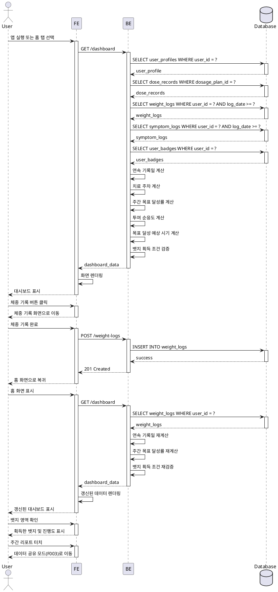

# Use Case Specification: UF-F006 홈 대시보드

## Primary Actor
GLP-1 치료 중인 사용자

## Precondition
- 사용자가 로그인 완료됨
- 온보딩(F000)을 통해 목표 체중 및 투여 계획이 설정됨

## Trigger
- 앱 실행
- 하단 탭에서 홈 탭 선택

## Main Scenario

### 1. 홈 대시보드 진입
1. 사용자가 앱을 실행하거나 홈 탭을 선택한다
2. FE는 BE에 대시보드 데이터 요청을 전송한다
3. BE는 Database에서 사용자 프로필, 투여 기록, 체중/부작용 기록, 뱃지 데이터를 조회한다
4. BE는 조회된 데이터를 기반으로 대시보드 통계를 계산한다
5. FE는 계산된 데이터를 화면에 렌더링한다

### 2. 개인화 인사 확인
1. 사용자가 홈 화면 상단의 개인화 인사 영역을 본다
2. FE는 사용자 이름, 연속 기록일, 현재 치료 주차를 표시한다

### 3. 주간 목표 진행도 확인
1. 사용자가 주간 목표 진행도 영역을 본다
2. FE는 투여 완료 목표, 체중 기록 목표, 부작용 기록 목표 각각의 달성률을 진행 바로 표시한다

### 4. 퀵 액션 버튼 사용
1. 사용자가 체중 기록, 부작용 기록, 또는 투여 완료 버튼을 클릭한다
2. FE는 해당 기록 화면(F002 또는 F001)으로 이동한다
3. 사용자가 기록을 완료하면 홈 화면으로 돌아온다
4. FE는 갱신된 데이터를 다시 요청하여 화면을 업데이트한다

### 5. 다음 예정 일정 확인
1. 사용자가 다음 예정 일정 영역을 본다
2. FE는 다음 투여 예정일 및 용량, 다음 증량 예정일(해당 시), 목표 달성 예상 시기를 표시한다

### 6. 주간 리포트 확인
1. 사용자가 주간 리포트 요약 영역을 본다
2. FE는 지난주 텍스트 요약, 최근 4주 체중 추이 미니 차트, 최근 1주 부작용 빈도, 투여 순응도를 표시한다
3. 사용자가 리포트 영역을 터치한다
4. FE는 데이터 공유 모드(F003) 상세 화면으로 이동한다

### 7. 치료 여정 타임라인 확인
1. 사용자가 타임라인 영역을 본다
2. FE는 치료 시작일부터 현재까지의 진행 상황을 시각화하여 표시한다
3. FE는 주요 마일스톤(용량 증량 시점, 체중 감량 목표 달성)을 표시한다

### 8. 성취 뱃지 확인
1. 사용자가 뱃지 영역을 본다
2. FE는 획득한 뱃지와 진행 중인 뱃지의 진행도를 표시한다
3. 새 뱃지 획득 시 FE는 축하 알림을 표시한다

### 9. 투여 완료 시 축하 효과
1. 사용자가 투여를 완료한다
2. FE는 축하 효과(애니메이션)를 표시한다

### 10. 주간 목표 100% 달성 시
1. 사용자가 주간 목표 항목 중 하나를 100% 달성한다
2. FE는 해당 항목을 시각적으로 강조 표시한다

## Edge Cases

### 신규 사용자 (데이터 없음)
- FE는 환영 메시지를 표시한다
- FE는 첫 기록 입력을 유도하는 안내를 표시한다
- 모든 통계는 초기값(0 또는 기본값)으로 표시한다

### 연속 기록일 중단
- BE는 연속 기록일을 0으로 리셋한다
- FE는 새로 시작하도록 격려하는 메시지를 표시한다

### 목표 달성 완료
- FE는 새 목표 설정을 유도하거나 유지 모드 안내를 표시한다

### 인사이트 생성 조건 미충족
- FE는 일반 격려 메시지를 표시한다

### 뱃지 획득 조건 동시 충족
- BE는 우선순위에 따라 뱃지 획득을 순차 처리한다
- FE는 뱃지를 순차적으로 알림한다

### 데이터 로딩 지연
- FE는 스켈레톤 UI 또는 로딩 인디케이터를 표시한다

### 과거 데이터 수정으로 통계 변동
- BE는 변경 감지 시 실시간으로 통계를 재계산한다
- FE는 갱신된 데이터를 화면에 반영한다

### 퀵 액션 연속 클릭
- FE는 중복 방지 처리(debounce)를 적용한다

### 네트워크 오류
- FE는 로컬 캐시된 데이터를 표시한다
- FE는 재시도 버튼을 제공한다

## Business Rules

### BR-001: 연속 기록일 계산
- 마지막 기록 날짜(F002 체중 또는 부작용 기록)부터 현재까지 일수를 계산한다
- 기록 없는 날이 발생하면 0으로 리셋한다

### BR-002: 치료 주차 계산
- 투여 시작일(F000)을 기준으로 현재 날짜까지의 주차를 계산한다
- 1주 = 7일 기준으로 계산한다

### BR-003: 주간 목표 달성률 계산
- 투여 완료 목표: (주간 실제 완료 횟수 / 주간 예정 투여 횟수) × 100
- 체중 기록 목표: (주간 실제 기록 횟수 / 주간 목표 기록 횟수) × 100
- 부작용 기록 목표: (주간 실제 기록 횟수 / 주간 목표 기록 횟수) × 100

### BR-004: 목표 달성 예상 시기 계산
- 최근 4주 체중 감량 추세를 선형 회귀 분석한다
- 현재 체중에서 목표 체중까지 도달하는 예상 일수를 계산한다

### BR-005: 투여 순응도 계산
- (실제 완료한 투여 횟수 / 예정된 투여 횟수) × 100
- 기준 기간: 치료 시작일부터 현재까지

### BR-006: 뱃지 획득 조건
- 연속 7일 기록: 마지막 7일간 연속으로 체중 또는 부작용 기록이 있는 경우
- 연속 30일 기록: 마지막 30일간 연속으로 체중 또는 부작용 기록이 있는 경우
- 체중 5% 감량: 시작 체중 대비 5% 이상 감량한 경우
- 체중 10% 감량: 시작 체중 대비 10% 이상 감량한 경우
- 첫 투여 완료: 첫 투여 기록이 완료된 경우

### BR-007: 뱃지 진행도 계산
- 각 뱃지별 현재 진행 상황을 백분율로 계산한다
- 예: 연속 7일 기록의 경우, 현재 연속 기록일 / 7 × 100

### BR-008: 타임라인 마일스톤
- 용량 증량 시점: dose_schedules 테이블에서 scheduled_dose_mg가 변경되는 시점
- 체중 감량 목표 달성: 시작 체중 대비 목표 체중의 특정 구간 달성(25%, 50%, 75%, 100%)

### BR-009: 주간 리포트 기준
- 주간: 최근 7일
- 지난주 텍스트 요약: 투여 완료 횟수, 체중 변화량(kg), 부작용 기록 횟수
- 최근 4주 체중 추이: 4주(28일) 기간의 체중 기록

### BR-010: 데이터 갱신 주기
- 퀵 액션으로 기록 완료 후: 즉시 갱신
- 홈 화면 재진입 시: 즉시 갱신
- 백그라운드에서 포그라운드 전환 시: 즉시 갱신

---

## Sequence Diagram

