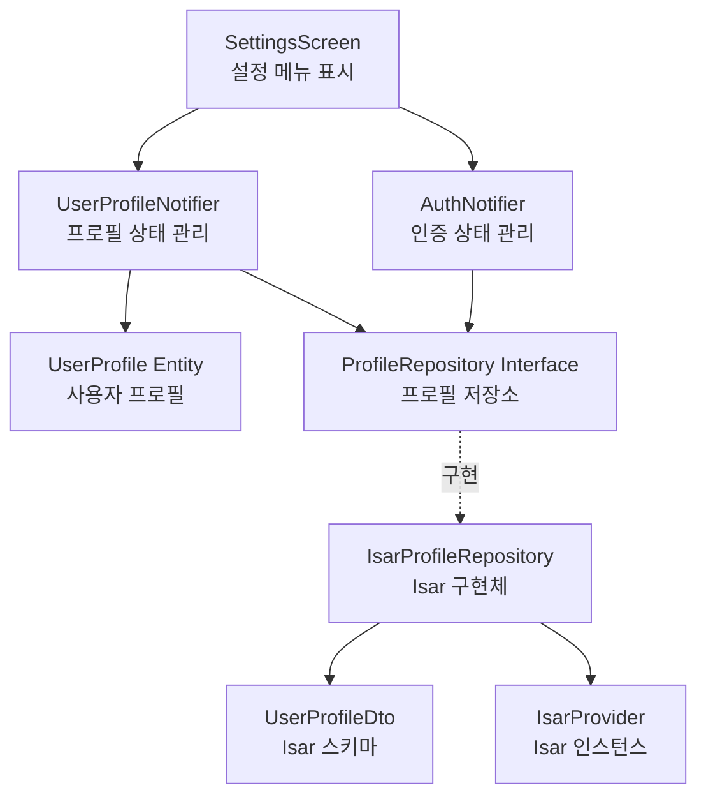

# UF-SETTINGS Implementation Plan

## 1. 개요

설정 화면 및 사용자 프로필 관리 기능 구현

### 모듈 목록
- `SettingsScreen` (Presentation): 설정 화면 UI
- `UserProfileNotifier` (Application): 사용자 프로필 상태 관리
- `UserProfile` (Domain): 프로필 엔티티
- `ProfileRepository` (Domain): 프로필 저장소 인터페이스
- `IsarProfileRepository` (Infrastructure): Isar 기반 프로필 저장소 구현
- `UserProfileDto` (Infrastructure): 프로필 DTO

### TDD 적용 범위
- Unit: Repository, Notifier 로직
- Widget: SettingsScreen UI 동작
- Integration: 프로필 조회 전체 흐름

---

## 2. Architecture Diagram



---

## 3. Implementation Plan

### 3.1. UserProfile Entity (Domain)

**Location**: `lib/features/profile/domain/entities/user_profile.dart`

**Responsibility**: 사용자 프로필 데이터 구조 정의

**Test Strategy**: Unit Test

**Test Scenarios (Red Phase)**:
```dart
// 1. 엔티티 생성 테스트
test('should create UserProfile with valid data', () {
  // Arrange
  final profile = UserProfile(
    userId: 'user-1',
    name: '홍길동',
    targetWeightKg: 70.0,
    weeklyWeightRecordGoal: 7,
    weeklySymptomRecordGoal: 7,
    createdAt: DateTime.now(),
  );

  // Assert
  expect(profile.userId, 'user-1');
  expect(profile.name, '홍길동');
  expect(profile.targetWeightKg, 70.0);
});

// 2. copyWith 메서드 테스트
test('should copy profile with updated fields', () {
  // Arrange
  final original = UserProfile(...);

  // Act
  final updated = original.copyWith(name: '김철수');

  // Assert
  expect(updated.name, '김철수');
  expect(updated.userId, original.userId);
});
```

**Implementation Order**:
1. Red: 엔티티 생성 테스트 작성
2. Green: 기본 필드 정의
3. Red: copyWith 테스트 작성
4. Green: copyWith 구현
5. Refactor: 불변성 확인, 네이밍 개선

**Dependencies**: 없음

---

### 3.2. ProfileRepository Interface (Domain)

**Location**: `lib/features/profile/domain/repositories/profile_repository.dart`

**Responsibility**: 프로필 데이터 접근 추상화

**Test Strategy**: Interface 정의만 존재, 구현체에서 테스트

**Interface Definition**:
```dart
abstract class ProfileRepository {
  Future<UserProfile?> getUserProfile(String userId);
  Future<void> saveUserProfile(UserProfile profile);
  Future<void> updateUserProfile(UserProfile profile);
}
```

**Implementation Order**:
1. Interface 선언
2. 메서드 시그니처 정의

**Dependencies**: `UserProfile` Entity

---

### 3.3. UserProfileDto (Infrastructure)

**Location**: `lib/features/profile/infrastructure/dtos/user_profile_dto.dart`

**Responsibility**: Isar 스키마 정의 및 Entity 변환

**Test Strategy**: Unit Test

**Test Scenarios (Red Phase)**:
```dart
// 1. DTO → Entity 변환 테스트
test('should convert DTO to entity correctly', () {
  // Arrange
  final dto = UserProfileDto()
    ..userId = 'user-1'
    ..name = '홍길동'
    ..targetWeightKg = 70.0
    ..weeklyWeightRecordGoal = 7
    ..weeklySymptomRecordGoal = 7;

  // Act
  final entity = dto.toEntity();

  // Assert
  expect(entity.userId, 'user-1');
  expect(entity.name, '홍길동');
  expect(entity.targetWeightKg, 70.0);
});

// 2. Entity → DTO 변환 테스트
test('should convert entity to DTO correctly', () {
  // Arrange
  final entity = UserProfile(...);

  // Act
  final dto = UserProfileDto.fromEntity(entity);

  // Assert
  expect(dto.userId, entity.userId);
  expect(dto.name, entity.name);
});
```

**Implementation Order**:
1. Red: DTO → Entity 테스트
2. Green: Isar 스키마 및 toEntity() 구현
3. Red: Entity → DTO 테스트
4. Green: fromEntity() 구현
5. Refactor: 변환 로직 단순화

**Dependencies**: `UserProfile`, `Isar`

---

### 3.4. IsarProfileRepository (Infrastructure)

**Location**: `lib/features/profile/infrastructure/repositories/isar_profile_repository.dart`

**Responsibility**: Isar를 통한 프로필 CRUD

**Test Strategy**: Integration Test (Isar 메모리 DB 사용)

**Test Scenarios (Red Phase)**:
```dart
// 1. 프로필 저장 테스트
test('should save user profile successfully', () async {
  // Arrange
  final isar = await Isar.open([UserProfileDtoSchema], directory: '');
  final repository = IsarProfileRepository(isar);
  final profile = UserProfile(...);

  // Act
  await repository.saveUserProfile(profile);

  // Assert
  final saved = await repository.getUserProfile(profile.userId);
  expect(saved, isNotNull);
  expect(saved!.name, profile.name);
});

// 2. 프로필 조회 테스트 (존재하지 않음)
test('should return null when profile not found', () async {
  // Arrange
  final isar = await Isar.open([UserProfileDtoSchema], directory: '');
  final repository = IsarProfileRepository(isar);

  // Act
  final profile = await repository.getUserProfile('non-existent');

  // Assert
  expect(profile, isNull);
});

// 3. 프로필 업데이트 테스트
test('should update existing profile', () async {
  // Arrange
  final repository = IsarProfileRepository(isar);
  await repository.saveUserProfile(originalProfile);

  // Act
  final updated = originalProfile.copyWith(name: '변경된이름');
  await repository.updateUserProfile(updated);

  // Assert
  final result = await repository.getUserProfile(updated.userId);
  expect(result!.name, '변경된이름');
});
```

**Implementation Order**:
1. Red: 프로필 저장 테스트
2. Green: saveUserProfile() 구현
3. Red: 프로필 조회 테스트
4. Green: getUserProfile() 구현
5. Red: 업데이트 테스트
6. Green: updateUserProfile() 구현
7. Refactor: 공통 로직 추출, 에러 핸들링

**Dependencies**: `ProfileRepository`, `UserProfileDto`, `Isar`

---

### 3.5. UserProfileNotifier (Application)

**Location**: `lib/features/profile/application/notifiers/user_profile_notifier.dart`

**Responsibility**: 프로필 상태 관리 및 비즈니스 로직

**Test Strategy**: Unit Test (Repository Mock)

**Test Scenarios (Red Phase)**:
```dart
// 1. 프로필 로드 성공 테스트
test('should load user profile successfully', () async {
  // Arrange
  final mockRepo = MockProfileRepository();
  final profile = UserProfile(...);
  when(() => mockRepo.getUserProfile(any())).thenAnswer((_) async => profile);

  final container = ProviderContainer(
    overrides: [profileRepositoryProvider.overrideWithValue(mockRepo)],
  );

  // Act
  final notifier = container.read(userProfileNotifierProvider.notifier);
  await notifier.loadProfile('user-1');

  // Assert
  final state = container.read(userProfileNotifierProvider);
  expect(state, isA<AsyncData<UserProfile>>());
  expect(state.value!.name, profile.name);
});

// 2. 프로필 로드 실패 테스트
test('should handle profile load error', () async {
  // Arrange
  final mockRepo = MockProfileRepository();
  when(() => mockRepo.getUserProfile(any())).thenThrow(Exception('DB Error'));

  // Act
  final notifier = container.read(userProfileNotifierProvider.notifier);
  await notifier.loadProfile('user-1');

  // Assert
  final state = container.read(userProfileNotifierProvider);
  expect(state, isA<AsyncError>());
});

// 3. 프로필 업데이트 테스트
test('should update profile successfully', () async {
  // Arrange
  final mockRepo = MockProfileRepository();
  final updatedProfile = UserProfile(...);
  when(() => mockRepo.updateUserProfile(any())).thenAnswer((_) async {});

  // Act
  await notifier.updateProfile(updatedProfile);

  // Assert
  verify(() => mockRepo.updateUserProfile(updatedProfile)).called(1);
  final state = container.read(userProfileNotifierProvider);
  expect(state.value, updatedProfile);
});
```

**Implementation Order**:
1. Red: 프로필 로드 성공 테스트
2. Green: build() 및 loadProfile() 구현
3. Red: 로드 실패 테스트
4. Green: 에러 핸들링
5. Red: 업데이트 테스트
6. Green: updateProfile() 구현
7. Refactor: AsyncValue 처리 개선

**Dependencies**: `ProfileRepository`, `UserProfile`

---

### 3.6. SettingsScreen (Presentation)

**Location**: `lib/features/settings/presentation/screens/settings_screen.dart`

**Responsibility**: 설정 메뉴 UI 렌더링

**Test Strategy**: Widget Test + QA Sheet

**Test Scenarios (Red Phase)**:
```dart
// 1. 설정 화면 렌더링 테스트
testWidgets('should display settings menu items', (tester) async {
  // Arrange
  final mockNotifier = MockUserProfileNotifier();
  when(() => mockNotifier.build()).thenReturn(AsyncValue.data(profile));

  // Act
  await tester.pumpWidget(
    ProviderScope(
      overrides: [
        userProfileNotifierProvider.overrideWith(() => mockNotifier),
      ],
      child: MaterialApp(home: SettingsScreen()),
    ),
  );

  // Assert
  expect(find.text('프로필 및 목표 수정'), findsOneWidget);
  expect(find.text('투여 계획 수정'), findsOneWidget);
  expect(find.text('주간 기록 목표 조정'), findsOneWidget);
  expect(find.text('푸시 알림 설정'), findsOneWidget);
  expect(find.text('로그아웃'), findsOneWidget);
});

// 2. 사용자 정보 표시 테스트
testWidgets('should display user information', (tester) async {
  // Arrange
  final profile = UserProfile(name: '홍길동', ...);

  // Act
  await tester.pumpWidget(...);

  // Assert
  expect(find.text('홍길동'), findsOneWidget);
});

// 3. 로딩 상태 테스트
testWidgets('should show loading indicator when profile is loading', (tester) async {
  // Arrange
  when(() => mockNotifier.build()).thenReturn(const AsyncValue.loading());

  // Act
  await tester.pumpWidget(...);

  // Assert
  expect(find.byType(CircularProgressIndicator), findsOneWidget);
});

// 4. 에러 상태 테스트
testWidgets('should show error message on load failure', (tester) async {
  // Arrange
  when(() => mockNotifier.build()).thenReturn(AsyncValue.error('Error', StackTrace.empty));

  // Act
  await tester.pumpWidget(...);

  // Assert
  expect(find.text('프로필 정보를 불러올 수 없습니다'), findsOneWidget);
});

// 5. 메뉴 항목 탭 테스트
testWidgets('should navigate when menu item is tapped', (tester) async {
  // Arrange & Act
  await tester.pumpWidget(...);
  await tester.tap(find.text('프로필 및 목표 수정'));
  await tester.pumpAndSettle();

  // Assert
  // 네비게이션 검증
});
```

**Implementation Order**:
1. Red: 메뉴 렌더링 테스트
2. Green: 기본 UI 구조
3. Red: 사용자 정보 표시 테스트
4. Green: 프로필 데이터 바인딩
5. Red: 로딩 상태 테스트
6. Green: AsyncValue 처리
7. Red: 에러 상태 테스트
8. Green: 에러 UI
9. Red: 메뉴 탭 테스트
10. Green: 네비게이션 구현
11. Refactor: 위젯 분리, 스타일 개선

**Dependencies**: `UserProfileNotifier`, `AuthNotifier`, `go_router`

**QA Sheet (수동 테스트)**:
- [ ] 설정 화면 진입 시 사용자 이름 표시
- [ ] 5개 메뉴 항목 모두 표시
- [ ] 각 메뉴 항목 탭 시 올바른 화면 이동
- [ ] 로그아웃 버튼 탭 시 확인 다이얼로그 표시
- [ ] 네트워크 오류 시 재시도 옵션 표시
- [ ] 로딩 중 스켈레톤 UI 또는 인디케이터 표시

---

## 4. TDD Workflow

### Phase 1: Domain Layer (Inside-Out)
1. **Start**: UserProfile Entity 테스트 작성
2. Red → Green → Refactor
3. Commit: "feat(profile): add UserProfile entity"

### Phase 2: Infrastructure Layer
1. **Start**: UserProfileDto 테스트 작성
2. Red → Green → Refactor
3. Commit: "feat(profile): add UserProfileDto with Isar schema"
4. **Next**: IsarProfileRepository 테스트 작성
5. Red → Green → Refactor
6. Commit: "feat(profile): implement IsarProfileRepository"

### Phase 3: Application Layer
1. **Start**: UserProfileNotifier 테스트 작성
2. Red → Green → Refactor
3. Commit: "feat(profile): implement UserProfileNotifier"

### Phase 4: Presentation Layer
1. **Start**: SettingsScreen 위젯 테스트 작성
2. Red → Green → Refactor
3. Commit: "feat(settings): implement SettingsScreen UI"

### Phase 5: Integration
1. **Start**: 전체 프로필 조회 흐름 테스트
2. Red → Green → Refactor
3. Commit: "test(settings): add integration tests"

### 완료 조건
- [ ] 모든 Unit 테스트 통과
- [ ] 모든 Widget 테스트 통과
- [ ] Integration 테스트 통과
- [ ] QA Sheet 항목 모두 검증
- [ ] 코드 커버리지 80% 이상
- [ ] flutter analyze 경고 없음

---

## 5. Edge Cases 처리

### 5.1. 로그인 세션 만료
**Test**:
```dart
test('should navigate to login when session expired', () async {
  // Arrange
  when(() => mockRepo.getUserProfile(any())).thenThrow(UnauthorizedException());

  // Act & Assert
  // 로그인 화면 이동 검증
});
```

### 5.2. 네트워크 오류
**Test**:
```dart
test('should show cached profile on network error', () async {
  // Arrange
  when(() => mockRepo.getUserProfile(any())).thenThrow(NetworkException());

  // Act & Assert
  // 캐시된 데이터 표시 검증
});
```

### 5.3. 데이터 로딩 지연
**Test**:
```dart
testWidgets('should show loading indicator for slow load', (tester) async {
  // Arrange
  when(() => mockNotifier.build()).thenReturn(const AsyncValue.loading());

  // Act & Assert
  // 로딩 UI 표시 검증
});
```

---

## 6. 핵심 원칙 준수

### Repository Pattern
- Application Layer는 `ProfileRepository` 인터페이스만 의존
- Infrastructure 변경 시 Application/Presentation 무영향

### Layer Dependency
```
Presentation → Application → Domain ← Infrastructure
```

### Test Pyramid
- Unit: 70% (Entity, DTO, Repository, Notifier)
- Widget: 20% (SettingsScreen)
- Integration: 10% (전체 흐름)

### FIRST Principles
- Fast: 모든 테스트 100ms 이내
- Independent: 각 테스트 독립 실행
- Repeatable: 동일 결과 보장
- Self-validating: 자동 검증
- Timely: 코드 작성 전 테스트 작성
