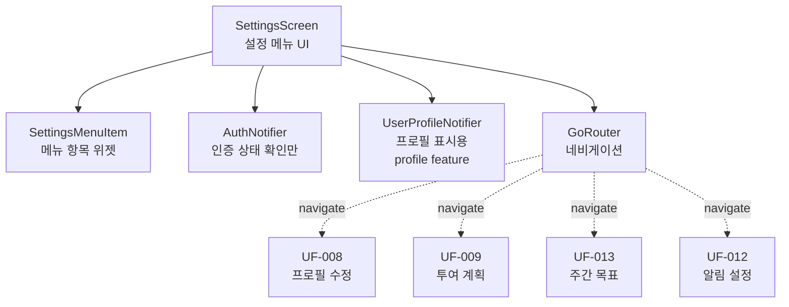

# UF-SETTINGS Implementation Plan

## 1. 개요

설정 화면 UI 및 네비게이션 구현 (프로필 데이터는 별도 Feature로 분리)

### Feature 분리
- **settings**: 설정 화면 UI, 메뉴 네비게이션
- **profile**: 사용자 프로필 데이터 관리 (재사용 가능)

### 모듈 목록
**Settings Feature**:
- `SettingsScreen` (Presentation): 설정 메뉴 UI, 네비게이션
- `SettingsMenuItem` (Presentation): 메뉴 항목 위젯

**Profile Feature** (별도 plan.md에서 구현):
- `UserProfile` (Domain): 프로필 엔티티
- `ProfileRepository` (Domain): 프로필 저장소 인터페이스
- `UserProfileNotifier` (Application): 프로필 상태 관리
- `IsarProfileRepository` (Infrastructure): Isar 구현
- `UserProfileDto` (Infrastructure): DTO

### TDD 적용 범위
- Widget: SettingsScreen UI, 네비게이션, 인증 검증
- Integration: 설정 화면 → 타 화면 전환 플로우

---

## 2. Architecture Diagram



**설계 원칙**:
1. Settings Feature는 UI와 네비게이션만 담당
2. AuthNotifier는 로그인 상태 확인만 (로그아웃 처리 포함)
3. UserProfileNotifier는 프로필 표시용으로만 사용
4. 모든 화면 전환은 GoRouter를 통해 처리

---

## 3. Implementation Plan

**참고**: Profile Feature (UserProfile, ProfileRepository 등)는 별도 plan.md에서 구현

### 3.1. SettingsScreen (Presentation)

**Location**: `lib/features/settings/presentation/screens/settings_screen.dart`

**Responsibility**: 설정 메뉴 UI, 로그인 검증, 네비게이션

**Test Strategy**: Widget Test + QA Sheet

**Test Scenarios (Red Phase)**:
```dart
// 1. 로그인 검증 테스트 (Business Rule 1)
testWidgets('should redirect to login when not authenticated', (tester) async {
  // Arrange
  final mockAuthNotifier = MockAuthNotifier();
  when(() => mockAuthNotifier.isAuthenticated).thenReturn(false);

  // Act
  await tester.pumpWidget(
    ProviderScope(
      overrides: [
        authNotifierProvider.overrideWith(() => mockAuthNotifier),
      ],
      child: MaterialApp.router(
        routerConfig: router,
      ),
    ),
  );
  await tester.pumpAndSettle();

  // Assert
  expect(find.byType(LoginScreen), findsOneWidget);
});

// 2. 설정 화면 렌더링 테스트
testWidgets('should display settings menu items', (tester) async {
  // Arrange
  final mockAuthNotifier = MockAuthNotifier();
  when(() => mockAuthNotifier.isAuthenticated).thenReturn(true);

  final mockProfileNotifier = MockUserProfileNotifier();
  when(() => mockProfileNotifier.build()).thenReturn(AsyncValue.data(profile));

  // Act
  await tester.pumpWidget(
    ProviderScope(
      overrides: [
        authNotifierProvider.overrideWith(() => mockAuthNotifier),
        userProfileNotifierProvider.overrideWith(() => mockProfileNotifier),
      ],
      child: MaterialApp(home: SettingsScreen()),
    ),
  );

  // Assert
  expect(find.text('프로필 및 목표 수정'), findsOneWidget);
  expect(find.text('투여 계획 수정'), findsOneWidget);
  expect(find.text('주간 기록 목표 조정'), findsOneWidget);
  expect(find.text('푸시 알림 설정'), findsOneWidget);
  expect(find.text('로그아웃'), findsOneWidget);
});

// 3. 사용자 정보 표시 테스트
testWidgets('should display user information', (tester) async {
  // Arrange
  final profile = UserProfile(name: '홍길동', ...);
  when(() => mockProfileNotifier.build()).thenReturn(AsyncValue.data(profile));

  // Act
  await tester.pumpWidget(...);

  // Assert
  expect(find.text('홍길동'), findsOneWidget);
});

// 4. 로딩 상태 테스트 (Edge Case 3)
testWidgets('should show loading indicator when profile is loading', (tester) async {
  // Arrange
  when(() => mockProfileNotifier.build()).thenReturn(const AsyncValue.loading());

  // Act
  await tester.pumpWidget(...);

  // Assert
  expect(find.byType(CircularProgressIndicator), findsOneWidget);
});

// 5. 에러 상태 및 재시도 테스트
testWidgets('should show error message with retry button', (tester) async {
  // Arrange
  when(() => mockProfileNotifier.build())
    .thenReturn(AsyncValue.error(NetworkException(), StackTrace.empty));

  // Act
  await tester.pumpWidget(...);

  // Assert
  expect(find.text('프로필 정보를 불러올 수 없습니다'), findsOneWidget);
  expect(find.text('다시 시도'), findsOneWidget);

  // Act: 재시도
  await tester.tap(find.text('다시 시도'));
  await tester.pumpAndSettle();

  // Assert
  verify(() => mockProfileNotifier.loadProfile(any())).called(1);
});

// 6. 세션 만료 처리 테스트 (Edge Case 1)
testWidgets('should redirect to login on session expired', (tester) async {
  // Arrange
  when(() => mockProfileNotifier.build())
    .thenReturn(AsyncValue.error(UnauthorizedException(), StackTrace.empty));

  // Act
  await tester.pumpWidget(...);
  await tester.pumpAndSettle();

  // Assert
  expect(find.byType(LoginScreen), findsOneWidget);
});

// 7. 네비게이션 테스트 - 프로필 수정
testWidgets('should navigate to profile edit screen', (tester) async {
  // Arrange & Act
  await tester.pumpWidget(...);
  await tester.tap(find.text('프로필 및 목표 수정'));
  await tester.pumpAndSettle();

  // Assert
  expect(find.byType(ProfileEditScreen), findsOneWidget);
});

// 8. 네비게이션 테스트 - 투여 계획
testWidgets('should navigate to dose plan screen', (tester) async {
  await tester.tap(find.text('투여 계획 수정'));
  await tester.pumpAndSettle();
  expect(find.byType(DosePlanScreen), findsOneWidget);
});

// 9. 네비게이션 테스트 - 주간 목표
testWidgets('should navigate to weekly goal screen', (tester) async {
  await tester.tap(find.text('주간 기록 목표 조정'));
  await tester.pumpAndSettle();
  expect(find.byType(WeeklyGoalScreen), findsOneWidget);
});

// 10. 네비게이션 테스트 - 알림 설정
testWidgets('should navigate to notification settings', (tester) async {
  await tester.tap(find.text('푸시 알림 설정'));
  await tester.pumpAndSettle();
  expect(find.byType(NotificationSettingsScreen), findsOneWidget);
});

// 11. 로그아웃 확인 다이얼로그 테스트 (Business Rule 5)
testWidgets('should show confirmation dialog before logout', (tester) async {
  // Act
  await tester.tap(find.text('로그아웃'));
  await tester.pumpAndSettle();

  // Assert
  expect(find.text('로그아웃 하시겠습니까?'), findsOneWidget);
  expect(find.text('취소'), findsOneWidget);
  expect(find.text('확인'), findsOneWidget);
});

// 12. 로그아웃 실행 테스트
testWidgets('should logout when confirmed', (tester) async {
  // Arrange
  await tester.tap(find.text('로그아웃'));
  await tester.pumpAndSettle();

  // Act
  await tester.tap(find.text('확인'));
  await tester.pumpAndSettle();

  // Assert
  verify(() => mockAuthNotifier.logout()).called(1);
  expect(find.byType(LoginScreen), findsOneWidget);
});

// 13. 로그아웃 취소 테스트
testWidgets('should cancel logout when dismissed', (tester) async {
  // Arrange
  await tester.tap(find.text('로그아웃'));
  await tester.pumpAndSettle();

  // Act
  await tester.tap(find.text('취소'));
  await tester.pumpAndSettle();

  // Assert
  verifyNever(() => mockAuthNotifier.logout());
  expect(find.byType(SettingsScreen), findsOneWidget);
});
```

**Implementation Order**:
1. Red: 로그인 검증 테스트
2. Green: AuthNotifier 통합, 미인증 시 리다이렉트
3. Red: 메뉴 렌더링 테스트
4. Green: 기본 UI 구조
5. Red: 사용자 정보 표시 테스트
6. Green: UserProfileNotifier 통합
7. Red: 로딩/에러 상태 테스트
8. Green: AsyncValue 처리
9. Red: 네비게이션 테스트 5개
10. Green: GoRouter 통합, 라우팅 구현
11. Red: 로그아웃 다이얼로그 테스트
12. Green: 확인 다이얼로그 구현
13. Refactor: 위젯 분리 (SettingsMenuItem), 스타일 개선

**Implementation Details**:
```dart
// 로그인 검증 (Business Rule 1)
class SettingsScreen extends ConsumerWidget {
  @override
  Widget build(BuildContext context, WidgetRef ref) {
    final authState = ref.watch(authNotifierProvider);

    if (!authState.isAuthenticated) {
      WidgetsBinding.instance.addPostFrameCallback((_) {
        context.go('/login');
      });
      return const SizedBox.shrink();
    }

    final profileState = ref.watch(userProfileNotifierProvider);

    return profileState.when(
      data: (profile) => _buildSettings(context, profile, ref),
      loading: () => const CircularProgressIndicator(),
      error: (error, stack) => _buildError(error, ref),
    );
  }

  Widget _buildError(Object error, WidgetRef ref) {
    // Edge Case 1: 세션 만료
    if (error is UnauthorizedException) {
      WidgetsBinding.instance.addPostFrameCallback((_) {
        context.go('/login');
      });
      return const SizedBox.shrink();
    }

    // Edge Case 2: 네트워크 오류 - 재시도 옵션
    return Column(
      children: [
        Text('프로필 정보를 불러올 수 없습니다'),
        ElevatedButton(
          onPressed: () {
            final userId = ref.read(authNotifierProvider).currentUserId;
            ref.read(userProfileNotifierProvider.notifier).loadProfile(userId);
          },
          child: Text('다시 시도'),
        ),
      ],
    );
  }

  Widget _buildSettings(BuildContext context, UserProfile profile, WidgetRef ref) {
    return ListView(
      children: [
        // 사용자 정보
        ListTile(
          title: Text(profile.name),
          subtitle: Text('목표 체중: ${profile.targetWeightKg}kg'),
        ),
        Divider(),

        // 메뉴 항목들 (Business Rule 3: 설명 포함)
        SettingsMenuItem(
          title: '프로필 및 목표 수정',
          subtitle: '이름과 목표 체중을 변경할 수 있습니다',
          onTap: () => context.push('/profile/edit'),
        ),
        SettingsMenuItem(
          title: '투여 계획 수정',
          subtitle: '약물 투여 계획을 변경할 수 있습니다',
          onTap: () => context.push('/dose-plan/edit'),
        ),
        SettingsMenuItem(
          title: '주간 기록 목표 조정',
          subtitle: '주간 체중 및 증상 기록 목표를 설정합니다',
          onTap: () => context.push('/weekly-goal/edit'),
        ),
        SettingsMenuItem(
          title: '푸시 알림 설정',
          subtitle: '알림 시간과 방식을 설정합니다',
          onTap: () => context.push('/notification/settings'),
        ),
        Divider(),

        // Business Rule 4: 로그아웃은 하단 배치
        SettingsMenuItem(
          title: '로그아웃',
          subtitle: '앱에서 로그아웃합니다',
          onTap: () => _handleLogout(context, ref),
        ),
      ],
    );
  }

  // Business Rule 5: 확인 단계 필요
  Future<void> _handleLogout(BuildContext context, WidgetRef ref) async {
    final confirmed = await showDialog<bool>(
      context: context,
      builder: (context) => AlertDialog(
        title: Text('로그아웃 하시겠습니까?'),
        actions: [
          TextButton(
            onPressed: () => Navigator.pop(context, false),
            child: Text('취소'),
          ),
          TextButton(
            onPressed: () => Navigator.pop(context, true),
            child: Text('확인'),
          ),
        ],
      ),
    );

    if (confirmed == true) {
      await ref.read(authNotifierProvider.notifier).logout();
      if (context.mounted) {
        context.go('/login');
      }
    }
  }
}
```

**Dependencies**: `UserProfileNotifier`, `AuthNotifier`, `go_router`

**QA Sheet (수동 테스트)**:
- [ ] 비로그인 상태에서 설정 화면 접근 시 로그인 화면으로 이동
- [ ] 설정 화면 진입 시 사용자 이름 및 목표 체중 표시
- [ ] 5개 메뉴 항목 모두 표시 (레이블 + 설명)
- [ ] 각 메뉴 항목 탭 시 올바른 화면 이동
- [ ] 로그아웃 버튼은 목록 하단에 배치
- [ ] 로그아웃 버튼 탭 시 확인 다이얼로그 표시
- [ ] 확인 선택 시 로그아웃 후 로그인 화면 이동
- [ ] 취소 선택 시 설정 화면 유지
- [ ] 네트워크 오류 시 재시도 옵션 표시
- [ ] 로딩 중 스켈레톤 UI 또는 인디케이터 표시

---

## 4. TDD Workflow

### Phase 1: Presentation Layer (Settings Feature만 구현)
1. **Start**: SettingsScreen 위젯 테스트 작성 (로그인 검증)
2. Red → Green → Refactor
3. Commit: "feat(settings): add authentication check"
4. **Next**: 메뉴 렌더링 테스트
5. Red → Green → Refactor
6. Commit: "feat(settings): implement menu UI"
7. **Next**: 네비게이션 테스트 (5개 화면)
8. Red → Green → Refactor
9. Commit: "feat(settings): implement navigation"
10. **Next**: 로그아웃 다이얼로그 테스트
11. Red → Green → Refactor
12. Commit: "feat(settings): implement logout flow"

### Phase 2: Integration
1. **Start**: 설정 화면 → 타 화면 전환 통합 테스트
2. Red → Green → Refactor
3. Commit: "test(settings): add integration tests"

### 완료 조건
- [ ] 모든 Widget 테스트 통과 (13개)
- [ ] Integration 테스트 통과
- [ ] QA Sheet 항목 모두 검증 (10개)
- [ ] 5개 화면으로 네비게이션 동작 확인
- [ ] 로그인 검증 및 세션 만료 처리 확인
- [ ] flutter analyze 경고 없음

---

## 5. Edge Cases 처리

### 5.1. 로그인 세션 만료
**구현**:
```dart
Widget _buildError(Object error, WidgetRef ref) {
  if (error is UnauthorizedException) {
    WidgetsBinding.instance.addPostFrameCallback((_) {
      context.go('/login');
    });
    return const SizedBox.shrink();
  }
  // ...
}
```

**Test**: 섹션 3.1의 "Test 6" 참조

### 5.2. 네트워크 오류
**구현**:
```dart
Widget _buildError(Object error, WidgetRef ref) {
  // 네트워크 오류 시 재시도 옵션 제공
  return Column(
    children: [
      Text('프로필 정보를 불러올 수 없습니다'),
      ElevatedButton(
        onPressed: () {
          final userId = ref.read(authNotifierProvider).currentUserId;
          ref.read(userProfileNotifierProvider.notifier).loadProfile(userId);
        },
        child: Text('다시 시도'),
      ),
    ],
  );
}
```

**Test**: 섹션 3.1의 "Test 5" 참조

**참고**: 캐시 전략은 Profile Feature의 IsarProfileRepository에서 구현

### 5.3. 데이터 로딩 지연
**구현**:
```dart
return profileState.when(
  data: (profile) => _buildSettings(context, profile, ref),
  loading: () => const CircularProgressIndicator(),  // 로딩 UI
  error: (error, stack) => _buildError(error, ref),
);
```

**Test**: 섹션 3.1의 "Test 4" 참조

**참고**: Timeout 처리는 Profile Feature의 UserProfileNotifier에서 구현

---

## 6. 핵심 원칙 준수

### Feature 분리 원칙
- **Settings Feature**: UI와 네비게이션만 담당 (이 plan에서 구현)
- **Profile Feature**: 데이터 관리 담당 (별도 plan에서 구현)
- Settings는 Profile의 Notifier를 통해서만 데이터 접근

### Layer Dependency
```
SettingsScreen (Presentation)
  ↓
UserProfileNotifier (Application, Profile Feature)
  ↓
AuthNotifier (Application, Auth Feature)
  ↓
GoRouter (Infrastructure, Core)
```

### Business Rules 준수
1. **로그인 검증**: AuthNotifier.isAuthenticated 확인
2. **실시간 조회**: UserProfileNotifier가 매번 새로 조회 (Profile Feature 책임)
3. **메뉴 설명**: 모든 메뉴 항목에 subtitle 제공
4. **로그아웃 하단 배치**: Divider로 분리
5. **확인 다이얼로그**: 로그아웃 시 AlertDialog 표시

### Test Pyramid
- Widget: 85% (SettingsScreen 13개 테스트)
- Integration: 15% (네비게이션 플로우)

### FIRST Principles
- Fast: 모든 테스트 100ms 이내
- Independent: 각 테스트 독립 실행
- Repeatable: 동일 결과 보장
- Self-validating: 자동 검증
- Timely: 코드 작성 전 테스트 작성

---

## 7. 다른 Feature와의 상호작용

### 필수 의존성
1. **Profile Feature** (UserProfileNotifier)
   - `userProfileNotifierProvider`: 프로필 데이터 조회
   - `loadProfile(userId)`: 재시도 시 사용

2. **Auth Feature** (AuthNotifier)
   - `isAuthenticated`: 로그인 상태 확인
   - `currentUserId`: 프로필 조회용 ID
   - `logout()`: 로그아웃 실행

3. **Core Router** (GoRouter)
   - `/login`: 미인증 시 이동
   - `/profile/edit`: UF-008
   - `/dose-plan/edit`: UF-009
   - `/weekly-goal/edit`: UF-013
   - `/notification/settings`: UF-012

### 네비게이션 타겟 화면
- `ProfileEditScreen` (UF-008)
- `DosePlanScreen` (UF-009)
- `WeeklyGoalScreen` (UF-013)
- `NotificationSettingsScreen` (UF-012)
- `LoginScreen` (UF-007 로그아웃 후)

**참고**: 타겟 화면들은 각자의 plan.md에서 구현
