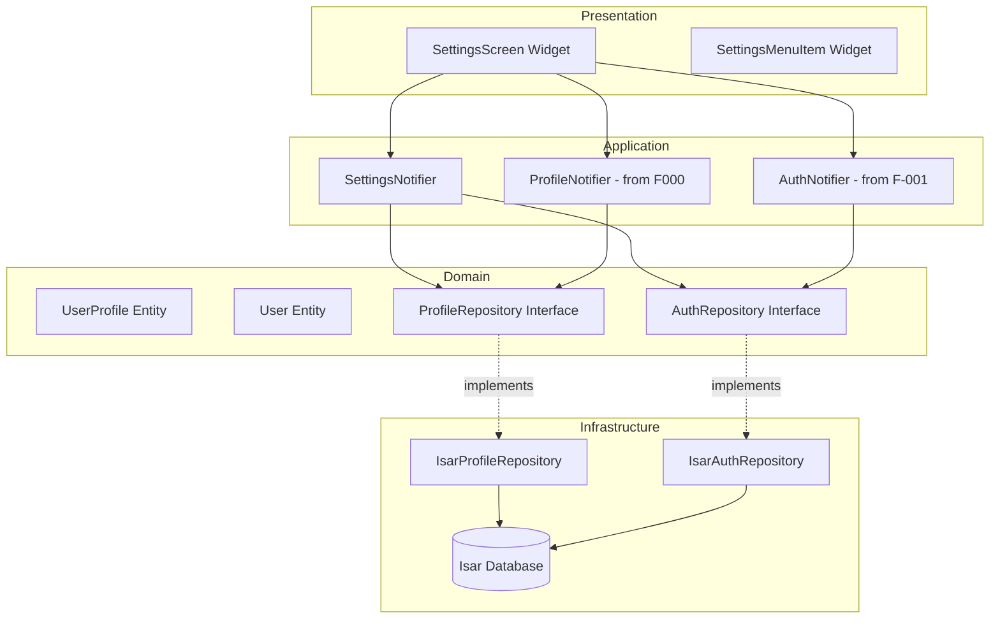

# UF-SETTINGS Implementation Plan

## 1. Overview

Settings 화면은 사용자 계정 및 앱 설정 관리를 위한 기능입니다.

**Modules:**
- SettingsScreen (Presentation): 설정 메뉴 리스트 UI
- SettingsNotifier (Application): 설정 상태 관리
- ProfileRepository (Domain): 프로필 데이터 인터페이스
- IsarProfileRepository (Infrastructure): Isar 기반 프로필 데이터 구현

**TDD Scope:**
- Unit Tests: Repository, Notifier, Domain logic
- Widget Tests: SettingsScreen UI
- Integration Tests: 설정 화면 진입 및 메뉴 선택 플로우

---

## 2. Architecture Diagram



---

## 3. Implementation Plan

### 3.1. UserProfile Entity (Domain)

**Location:** `lib/features/settings/domain/entities/user_profile.dart`

**Responsibility:** 사용자 프로필 데이터 모델

**Test Strategy:** Unit Test

**Test Scenarios (Red Phase):**
```dart
// Arrange: UserProfile 생성 데이터
// Act: UserProfile 생성
// Assert: 필드 값 검증

test('should create UserProfile with valid data')
test('should create UserProfile with optional fields null')
test('should calculate weeklyLossGoalKg correctly')
test('should return 0 when targetPeriodWeeks is null')
```

**Implementation Order:**
1. RED: Entity 생성 테스트 작성
2. GREEN: 최소 Entity 구현
3. REFACTOR: Immutable 패턴, copyWith 추가

**Dependencies:** None

---

### 3.2. User Entity (Domain)

**Location:** `lib/features/authentication/domain/entities/user.dart`

**Responsibility:** 사용자 계정 데이터 모델

**Test Strategy:** Unit Test

**Test Scenarios (Red Phase):**
```dart
test('should create User with valid data')
test('should create User with optional profileImageUrl')
test('should handle email validation')
```

**Implementation Order:**
1. RED: Entity 생성 테스트
2. GREEN: Entity 구현
3. REFACTOR: Immutable, copyWith

**Dependencies:** None

---

### 3.3. ProfileRepository Interface (Domain)

**Location:** `lib/features/settings/domain/repositories/profile_repository.dart`

**Responsibility:** 프로필 데이터 접근 계약

**Test Strategy:** Unit Test (Mock 기반)

**Test Scenarios (Red Phase):**
```dart
test('should define getUserProfile method signature')
test('should define updateUserProfile method signature')
test('should return Future<UserProfile?>')
```

**Implementation Order:**
1. RED: Repository interface 메서드 시그니처 테스트
2. GREEN: Interface 정의
3. REFACTOR: 문서화, 예외 타입 명시

**Dependencies:** UserProfile Entity

---

### 3.4. IsarProfileRepository (Infrastructure)

**Location:** `lib/features/settings/infrastructure/repositories/isar_profile_repository.dart`

**Responsibility:** Isar 기반 프로필 데이터 저장/조회

**Test Strategy:** Integration Test (Isar in-memory)

**Test Scenarios (Red Phase):**
```dart
// Happy Path
test('should return UserProfile when profile exists')
test('should save UserProfile successfully')
test('should update existing UserProfile')
test('should return null when profile does not exist')

// Edge Cases
test('should throw RepositoryException on Isar error')
test('should handle concurrent writes gracefully')
test('should map Dto to Entity correctly')
test('should map Entity to Dto correctly')
```

**Implementation Order:**
1. RED: getUserProfile 테스트 (null 케이스)
2. GREEN: 최소 구현
3. RED: saveProfile 테스트
4. GREEN: 저장 로직
5. RED: updateProfile 테스트
6. GREEN: 업데이트 로직
7. REFACTOR: 중복 제거, 에러 핸들링

**Dependencies:** ProfileRepository Interface, Isar, UserProfileDto

---

### 3.5. SettingsNotifier (Application)

**Location:** `lib/features/settings/application/notifiers/settings_notifier.dart`

**Responsibility:** 설정 화면 상태 관리, 프로필 정보 로드

**Test Strategy:** Unit Test (Mock Repository)

**Test Scenarios (Red Phase):**
```dart
// Happy Path
test('should load user profile on build')
test('should return AsyncValue.data when profile exists')
test('should return AsyncValue.loading initially')
test('should navigate to profile edit screen')
test('should navigate to dosage plan edit screen')
test('should navigate to weekly goals screen')
test('should navigate to notification settings screen')

// Edge Cases
test('should return AsyncValue.error on repository failure')
test('should handle null profile gracefully')
test('should refresh profile on demand')
```

**Implementation Order:**
1. RED: build() 테스트 (loading → data)
2. GREEN: 최소 Notifier 구현
3. RED: 네비게이션 메서드 테스트
4. GREEN: 네비게이션 로직
5. RED: 에러 핸들링 테스트
6. GREEN: 에러 핸들링
7. REFACTOR: 상태 관리 로직 정리

**Dependencies:** ProfileRepository, GoRouter

---

### 3.6. SettingsScreen (Presentation)

**Location:** `lib/features/settings/presentation/screens/settings_screen.dart`

**Responsibility:** 설정 메뉴 UI 렌더링

**Test Strategy:** Widget Test

**Test Scenarios (Red Phase):**
```dart
// Rendering
test('should display settings title')
test('should display user name when profile loaded')
test('should display joined date')
test('should display all menu items')
test('should display loading indicator when loading')
test('should display error message on error')

// Interaction
test('should call navigateToProfileEdit when profile menu tapped')
test('should call navigateToDosagePlanEdit when dosage menu tapped')
test('should call navigateToWeeklyGoals when goals menu tapped')
test('should call navigateToNotifications when notification menu tapped')
test('should call logout when logout tapped')

// Edge Cases
test('should disable menu items when loading')
test('should show retry button on error')
test('should handle session expiry')
```

**Implementation Order:**
1. RED: 기본 레이아웃 테스트
2. GREEN: Scaffold, AppBar 구현
3. RED: 프로필 정보 표시 테스트
4. GREEN: 프로필 정보 위젯
5. RED: 메뉴 리스트 테스트
6. GREEN: ListView 구현
7. RED: 로딩/에러 상태 테스트
8. GREEN: AsyncValue 핸들링
9. RED: 메뉴 클릭 테스트
10. GREEN: onTap 콜백
11. REFACTOR: 위젯 분리, 스타일링

**Dependencies:** SettingsNotifier, AuthNotifier, ProfileNotifier

**QA Sheet (Presentation Layer):**
```
[ ] 설정 화면 진입 시 사용자 이름 표시
[ ] 가입일 표시 (yyyy-MM-dd 형식)
[ ] 5개 메뉴 항목 표시:
    [ ] 프로필 및 목표 수정
    [ ] 투여 계획 수정
    [ ] 주간 기록 목표 조정
    [ ] 푸시 알림 설정
    [ ] 로그아웃
[ ] 각 메뉴 클릭 시 해당 화면으로 이동
[ ] 로딩 중 스피너 표시
[ ] 에러 발생 시 재시도 버튼 표시
[ ] 백 버튼으로 홈 대시보드 복귀
[ ] 세션 만료 시 로그인 화면 이동
```

---

### 3.7. SettingsMenuItem Widget (Presentation)

**Location:** `lib/features/settings/presentation/widgets/settings_menu_item.dart`

**Responsibility:** 개별 설정 메뉴 아이템 UI

**Test Strategy:** Widget Test

**Test Scenarios (Red Phase):**
```dart
test('should display menu title')
test('should display menu subtitle if provided')
test('should display leading icon')
test('should display trailing arrow icon')
test('should call onTap when tapped')
test('should disable tap when disabled')
```

**Implementation Order:**
1. RED: 기본 렌더링 테스트
2. GREEN: ListTile 구현
3. RED: onTap 테스트
4. GREEN: onTap 콜백
5. REFACTOR: 스타일 일관성

**Dependencies:** None

---

## 4. TDD Workflow

### Start Point
1. **UserProfile Entity** (Domain) - 가장 독립적인 모듈
2. **User Entity** (Domain)

### Red → Green → Refactor Sequence

#### Phase 1: Domain Layer (Inside-Out)
```
1. UserProfile Entity
   - RED: test('should create UserProfile with valid data')
   - GREEN: class UserProfile with fields
   - REFACTOR: Immutable, copyWith, toString

2. User Entity
   - RED: test('should create User with valid data')
   - GREEN: class User with fields
   - REFACTOR: Immutable, copyWith

3. ProfileRepository Interface
   - RED: test('should define getUserProfile method')
   - GREEN: abstract class ProfileRepository
   - REFACTOR: Documentation
```

**Commit Point 1:** "feat(settings): add domain entities and repository interface"

#### Phase 2: Infrastructure Layer
```
4. UserProfileDto
   - RED: test('should convert Entity to Dto')
   - GREEN: UserProfileDto class with toEntity/fromEntity
   - REFACTOR: Null safety, validation

5. IsarProfileRepository
   - RED: test('should return null when profile not found')
   - GREEN: getUserProfile() implementation
   - RED: test('should save profile successfully')
   - GREEN: saveProfile() implementation
   - RED: test('should throw on Isar error')
   - GREEN: Error handling
   - REFACTOR: Extract common logic
```

**Commit Point 2:** "feat(settings): implement Isar profile repository"

#### Phase 3: Application Layer
```
6. SettingsNotifier
   - RED: test('should load profile on build')
   - GREEN: build() with repository call
   - RED: test('should handle navigation')
   - GREEN: Navigation methods
   - RED: test('should handle errors')
   - GREEN: AsyncValue.guard
   - REFACTOR: Extract navigation logic
```

**Commit Point 3:** "feat(settings): add settings notifier with profile loading"

#### Phase 4: Presentation Layer
```
7. SettingsMenuItem Widget
   - RED: test('should render menu item')
   - GREEN: ListTile widget
   - RED: test('should call onTap')
   - GREEN: onTap callback
   - REFACTOR: Extract styles

8. SettingsScreen Widget
   - RED: test('should render app bar')
   - GREEN: Scaffold with AppBar
   - RED: test('should show profile info')
   - GREEN: Profile info widget
   - RED: test('should render menu list')
   - GREEN: ListView with menu items
   - RED: test('should handle loading state')
   - GREEN: AsyncValue.when
   - RED: test('should handle error state')
   - GREEN: Error widget with retry
   - REFACTOR: Extract widgets, improve layout
```

**Commit Point 4:** "feat(settings): implement settings screen UI"

### Final Integration Test
```
9. Settings Flow E2E
   - RED: test('should navigate from home to settings')
   - GREEN: GoRouter route configuration
   - RED: test('should display user profile on settings screen')
   - GREEN: Integration with ProfileNotifier
   - RED: test('should navigate to each submenu')
   - GREEN: Navigation callbacks
```

**Commit Point 5:** "feat(settings): complete settings feature with navigation"

---

## 5. Key Principles

### Test First
- **NEVER** write implementation before test
- Each test defines ONE specific behavior
- Tests are living documentation

### Small Steps
- One test at a time
- Minimal code to pass
- Refactor only when green

### FIRST Principles
- **Fast:** Tests run in milliseconds
- **Independent:** No shared state between tests
- **Repeatable:** Same result every run
- **Self-validating:** Pass/fail, no manual check
- **Timely:** Written just before code

### Test Pyramid
- **Unit Tests (70%):** Entity, Repository, Notifier logic
- **Widget Tests (20%):** UI rendering, user interaction
- **Integration Tests (10%):** Full screen flow

### TDD Strategy
- **Inside-Out:** Domain → Infrastructure → Application → Presentation
- Repository Pattern으로 Infrastructure 격리
- Mock을 활용한 빠른 Unit Test

---

## 6. Dependencies

**External Packages:**
- `riverpod` (2.x): State management
- `isar` (3.x): Local database
- `go_router` (13.x): Navigation
- `flutter_test`: Testing framework
- `mocktail`: Mocking library

**Internal Dependencies:**
- AuthNotifier (F-001): 로그아웃 기능
- ProfileNotifier (F000): 프로필 데이터
- GoRouter: 화면 전환

**Phase 0 → Phase 1 Transition:**
- Repository Interface 유지
- SupabaseProfileRepository 추가
- Provider DI 1줄 변경

---

## 7. Edge Cases Handled

1. **Session Expiry:** 설정 화면 진입 시 토큰 만료 → 로그인 화면 이동
2. **Network Error:** 프로필 로딩 실패 → 캐시된 정보 표시 또는 재시도
3. **Data Loading Delay:** 로딩 인디케이터 표시
4. **Null Profile:** 신규 사용자 케이스 → 온보딩 유도
5. **Concurrent Access:** Repository 레벨에서 동시성 제어

---

## 8. Success Criteria

**All Tests Pass:**
- Unit: 30+ tests
- Widget: 15+ tests
- Integration: 3+ tests

**Code Coverage:**
- Domain: 100%
- Infrastructure: 90%+
- Application: 95%+
- Presentation: 80%+

**Manual QA:**
- 모든 QA Sheet 항목 통과

**Performance:**
- 화면 진입 300ms 이내
- 프로필 로딩 500ms 이내

**No violations:**
- Repository Pattern 유지
- Layer 의존성 준수
- `flutter analyze` 경고 0개
