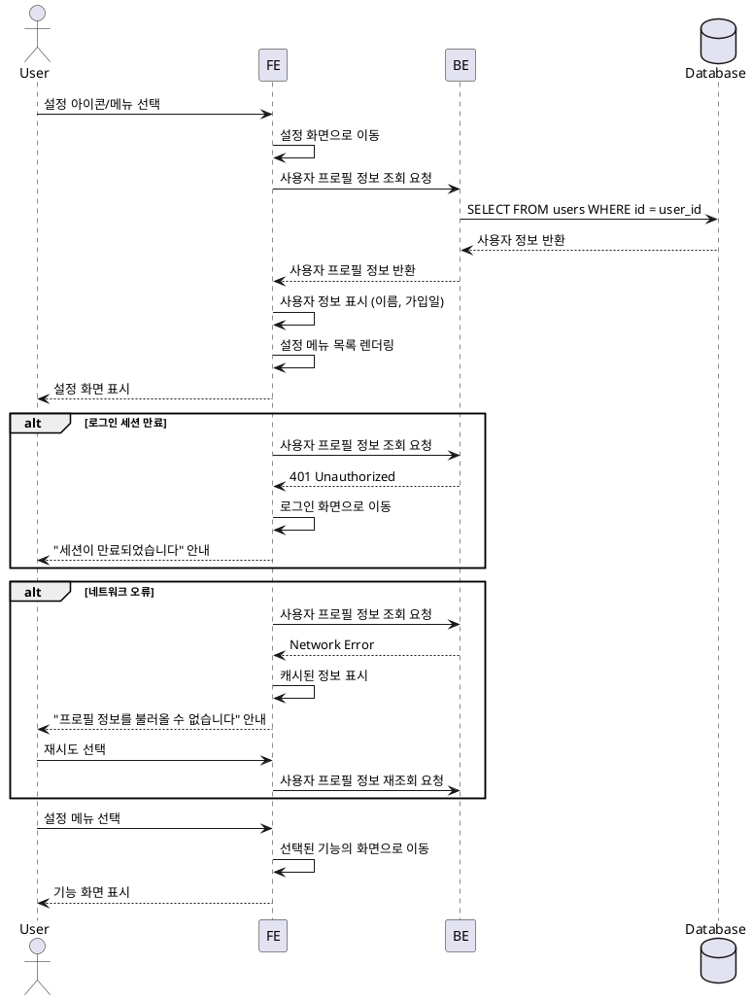

# UF-SETTINGS: 설정 화면 상세 유스케이스

## Primary Actor
GLP-1 치료 관리 앱 사용자

## Precondition
- 사용자가 로그인 상태
- 홈 대시보드 또는 다른 화면에 설정 아이콘/메뉴가 표시됨

## Trigger
사용자가 홈 대시보드 또는 다른 화면에서 설정 아이콘/메뉴 선택

## Main Scenario

1. 사용자가 설정 아이콘/메뉴 선택
2. 시스템이 설정 화면으로 이동
3. 시스템이 사용자 프로필 정보 조회
4. 시스템이 현재 사용자 정보 표시 (이름, 가입일)
5. 시스템이 설정 메뉴 목록 렌더링:
   - 프로필 및 목표 수정 (UF-008로 이동)
   - 투여 계획 수정 (UF-009로 이동)
   - 주간 기록 목표 조정 (UF-013으로 이동)
   - 푸시 알림 설정 (UF-012로 이동)
   - 로그아웃 (UF-007 실행)
6. 사용자가 원하는 설정 메뉴 선택
7. 시스템이 선택된 기능의 화면으로 이동

## Edge Cases

### 로그인 세션 만료
- 발생 조건: 설정 화면 접근 시 저장된 토큰이 만료됨
- 처리: 자동으로 로그인 화면으로 이동
- 사용자 안내: "세션이 만료되었습니다. 다시 로그인해주세요."

### 네트워크 오류로 프로필 로딩 실패
- 발생 조건: 사용자 프로필 정보 조회 시 네트워크 오류
- 처리: 캐시된 정보 표시 또는 재시도 옵션 제공
- 사용자 안내: "프로필 정보를 불러올 수 없습니다. 다시 시도하시겠습니까?"

### 데이터 로딩 지연
- 발생 조건: 사용자 프로필 정보 조회에 시간이 소요됨
- 처리: 로딩 인디케이터 표시
- 사용자 안내: 스피너 또는 스켈레톤 UI

## Business Rules

1. 설정 화면은 로그인된 사용자만 접근 가능
2. 사용자 정보는 실시간으로 조회하여 최신 상태 유지
3. 각 설정 메뉴는 명확한 레이블과 설명 제공
4. 로그아웃 메뉴는 목록 하단에 배치
5. 설정 변경 시 사용자 확인 단계 필요 (UF-007, UF-008, UF-009, UF-012, UF-013)

---

## Sequence Diagram

