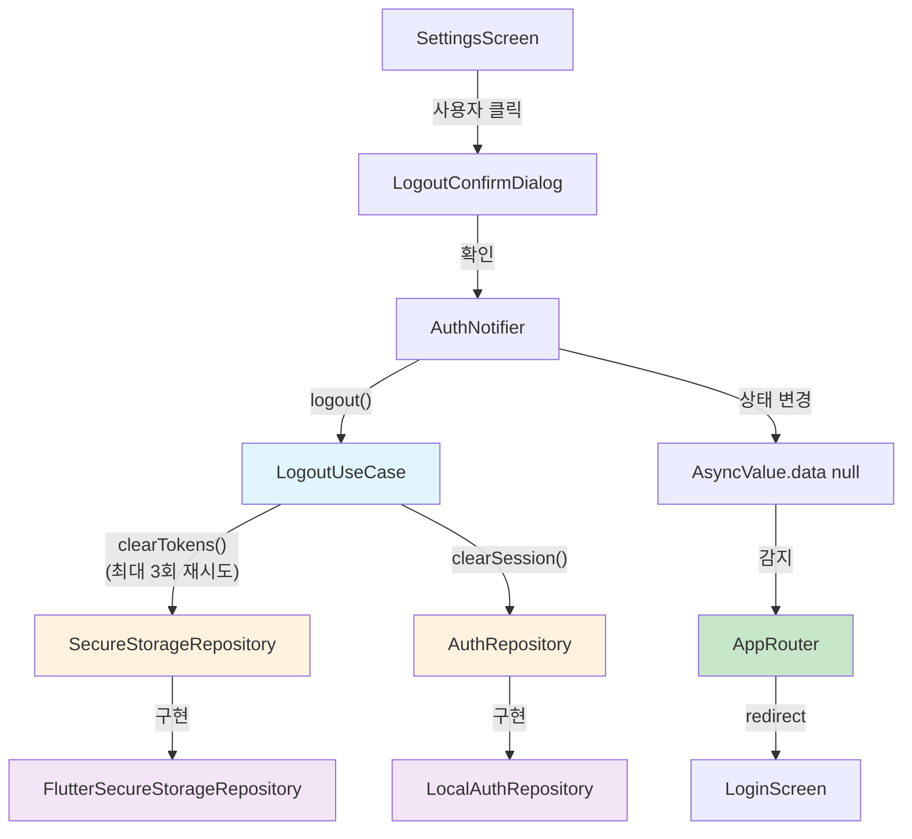
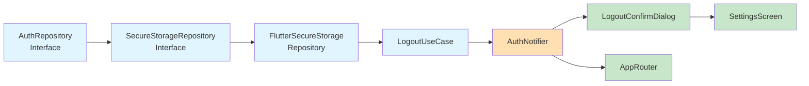

# Logout Implementation Plan

## 1. 개요

### 1.1 모듈 목록 및 위치

**Feature**: Authentication
**Location**: `lib/features/authentication/`

**구현 모듈**:
- **LogoutUseCase** (Domain): `domain/usecases/logout_usecase.dart`
- **AuthRepository** (Domain Interface): `domain/repositories/auth_repository.dart`
- **SecureStorageRepository** (Domain Interface): `domain/repositories/secure_storage_repository.dart`
- **FlutterSecureStorageRepository** (Infrastructure): `infrastructure/repositories/flutter_secure_storage_repository.dart`
- **AuthNotifier** (Application): `application/notifiers/auth_notifier.dart`
- **SettingsScreen** (Presentation): `presentation/screens/settings_screen.dart`
- **LogoutConfirmDialog** (Presentation): `presentation/widgets/logout_confirm_dialog.dart`
- **AppRouter** (Core): `core/routing/app_router.dart` (수정)

**Providers**:
- `secureStorageRepositoryProvider`: `infrastructure/providers/storage_provider.dart`
- `authRepositoryProvider`: `infrastructure/providers/auth_provider.dart`
- `logoutUseCaseProvider`: `domain/providers/usecase_provider.dart`
- `authNotifierProvider`: `application/providers/notifier_provider.dart`

### 1.2 TDD 적용 범위
- **Unit Tests**: Domain Layer (LogoutUseCase, Entity)
- **Integration Tests**: Application Layer (AuthNotifier + Repository)
- **Widget Tests**: Presentation Layer (Dialog, Screen)

---

## 2. Architecture Diagram



---

## 3. Implementation Plan

### 3.1 AuthRepository Interface (Domain)

**Location**: `lib/features/authentication/domain/repositories/auth_repository.dart`

**Responsibility**: 인증 상태 및 세션 관리 추상화

**Test Strategy**: Unit Test

**Interface Definition**:
```dart
abstract class AuthRepository {
  /// 현재 인증된 사용자 정보 반환
  Future<AuthUser?> getCurrentUser();

  /// 세션 정보 초기화 (메모리 내 사용자 데이터 제거)
  /// 로그아웃 시 호출되며, Isar 데이터는 건드리지 않음
  Future<void> clearSession();

  /// 로그인 처리
  Future<AuthUser> login(String email, String password);
}
```

**Test Scenarios (Red Phase)**:
```dart
group('AuthRepository Interface', () {
  test('should define clearSession method', () {
    // Arrange: Mock 구현체 생성
    // Act: clearSession 호출
    // Assert: Future<void> 반환
  });

  test('should define getCurrentUser method', () {
    // Arrange: Mock 구현체 생성
    // Act: getCurrentUser 호출
    // Assert: Future<AuthUser?> 반환
  });
});
```

**Implementation Order**:
1. Interface 정의 (Red)
2. Mock 구현 (Green)
3. Interface 정리 (Refactor)

**Dependencies**: None

---

### 3.2 SecureStorageRepository (Domain Interface)

**Location**: `lib/features/authentication/domain/repositories/secure_storage_repository.dart`

**Responsibility**: 토큰 저장소 추상화

**Test Strategy**: Unit Test

**Test Scenarios (Red Phase)**:
```dart
// AAA Pattern
group('SecureStorageRepository Interface', () {
  test('should define clearTokens method', () {
    // Arrange: Mock 구현체 생성
    // Act: clearTokens 호출
    // Assert: Future<void> 반환
  });

  test('should define getAccessToken method', () {
    // Arrange: Mock 구현체 생성
    // Act: getAccessToken 호출
    // Assert: Future<String?> 반환
  });
});
```

**Implementation Order**:
1. Interface 정의 (Red)
2. Mock 구현 (Green)
3. Interface 정리 (Refactor)

**Dependencies**: None

---

### 3.3 FlutterSecureStorageRepository (Infrastructure)

**Location**: `lib/features/authentication/infrastructure/repositories/flutter_secure_storage_repository.dart`

**Responsibility**: FlutterSecureStorage를 통한 토큰 관리

**Test Strategy**: Unit Test (Mocked FlutterSecureStorage)

**Test Scenarios (Red Phase)**:
```dart
group('FlutterSecureStorageRepository', () {
  late FlutterSecureStorage mockStorage;
  late FlutterSecureStorageRepository repository;

  setUp(() {
    mockStorage = MockFlutterSecureStorage();
    repository = FlutterSecureStorageRepository(mockStorage);
  });

  test('should delete accessToken when clearTokens is called', () {
    // Arrange: mockStorage.delete 설정
    // Act: repository.clearTokens()
    // Assert: verify delete('accessToken')
  });

  test('should delete refreshToken when clearTokens is called', () {
    // Arrange: mockStorage.delete 설정
    // Act: repository.clearTokens()
    // Assert: verify delete('refreshToken')
  });

  test('should delete tokenExpiresAt when clearTokens is called', () {
    // Arrange: mockStorage.delete 설정
    // Act: repository.clearTokens()
    // Assert: verify delete('tokenExpiresAt')
  });

  test('should throw exception when delete fails', () {
    // Arrange: mockStorage.delete always throws
    // Act: repository.clearTokens()
    // Assert: expect throwsA(isA<StorageException>())
  });
});
```

**Edge Cases**:
- 저장소 접근 권한 오류
- 삭제 중 예외 발생

**Implementation Order**:
1. clearTokens 기본 구현 (Red → Green)
2. 에러 핸들링 (Red → Green)
3. 코드 정리 (Refactor)

**Note**: 재시도 로직은 Infrastructure Layer가 아닌 LogoutUseCase(Domain Layer)에서 처리

**Dependencies**: `flutter_secure_storage`, SecureStorageRepository

---

### 3.4 LogoutUseCase (Domain)

**Location**: `lib/features/authentication/domain/usecases/logout_usecase.dart`

**Responsibility**: 로그아웃 비즈니스 로직 (토큰 삭제 + 세션 초기화 + 재시도 로직)

**Test Strategy**: Unit Test

**Architecture Note - Why Two Repositories?**:
```
LogoutUseCase는 두 개의 Repository에 직접 의존:
1. SecureStorageRepository: 토큰 삭제
2. AuthRepository: 세션 초기화

이유:
- 토큰 삭제 실패 시에도 세션 초기화 진행 (EC3 대응)
- 각 Repository의 책임이 명확히 분리됨
- UseCase에서 비즈니스 로직(재시도, 실패 시 처리) 제어
```

**Test Scenarios (Red Phase)**:
```dart
group('LogoutUseCase', () {
  late SecureStorageRepository mockStorageRepo;
  late AuthRepository mockAuthRepo;
  late LogoutUseCase useCase;

  setUp(() {
    mockStorageRepo = MockSecureStorageRepository();
    mockAuthRepo = MockAuthRepository();
    useCase = LogoutUseCase(
      storageRepository: mockStorageRepo,
      authRepository: mockAuthRepo,
    );
  });

  test('should clear tokens from secure storage', () async {
    // Arrange: mockStorageRepo.clearTokens returns success
    // Act: await useCase.execute()
    // Assert: verify mockStorageRepo.clearTokens called once
  });

  test('should clear session from auth repository', () async {
    // Arrange: mockAuthRepo.clearSession returns success
    // Act: await useCase.execute()
    // Assert: verify mockAuthRepo.clearSession called once
  });

  test('should retry token deletion up to 3 times on failure', () async {
    // Arrange: mockStorageRepo.clearTokens fails twice, succeeds on 3rd
    // Act: await useCase.execute()
    // Assert: verify clearTokens called 3 times
  });

  test('should clear session even if token deletion fails after 3 retries', () async {
    // Arrange: mockStorageRepo.clearTokens always throws
    // Act: await useCase.execute()
    // Assert: verify mockAuthRepo.clearSession still called
  });

  test('should execute in correct order: tokens then session', () async {
    // Arrange: track call order
    // Act: await useCase.execute()
    // Assert: verify clearTokens called before clearSession
  });

  test('should NOT clear Isar database when logging out', () async {
    // Arrange: mockIsarRepo (Medication, Weight 등)
    // Act: await useCase.execute()
    // Assert: verifyNever(() => mockIsarRepo.clearAll())
  });
});
```

**Edge Cases**:
- EC3: 토큰 삭제 실패 → 최대 3회 재시도 → 세션 초기화 진행
- BR2: Isar 데이터베이스는 건드리지 않음
- Repository 호출 순서 보장

**Implementation Order**:
1. 기본 execute 구현 (Red → Green)
2. 재시도 로직 추가 (Red → Green)
3. 에러 핸들링 (Red → Green)
4. Isar 데이터 보존 검증 (Red → Green)
5. 리팩토링 (Refactor)

**Dependencies**: SecureStorageRepository, AuthRepository

---

### 3.5 AuthNotifier (Application)

**Location**: `lib/features/authentication/application/notifiers/auth_notifier.dart`

**Responsibility**: 인증 상태 관리 및 로그아웃 처리

**Test Strategy**: Integration Test (Notifier + Repository)

**Test Scenarios (Red Phase)**:
```dart
group('AuthNotifier - Logout', () {
  late ProviderContainer container;
  late MockLogoutUseCase mockUseCase;

  setUp(() {
    mockUseCase = MockLogoutUseCase();
    container = ProviderContainer(
      overrides: [
        logoutUseCaseProvider.overrideWithValue(mockUseCase),
      ],
    );
  });

  test('should change state to loading during logout', () async {
    // Arrange: initial state = AsyncValue.data(user)
    // Act: notifier.logout()
    // Assert: expect state == AsyncValue.loading()
  });

  test('should change state to data(null) after successful logout', () async {
    // Arrange: mockUseCase.execute returns success
    // Act: await notifier.logout()
    // Assert: expect state == AsyncValue.data(null)
  });

  test('should change state to error if logout fails', () async {
    // Arrange: mockUseCase.execute throws exception
    // Act: await notifier.logout()
    // Assert: expect state == AsyncValue.error(...)
  });

  test('should call LogoutUseCase.execute once', () async {
    // Arrange: mockUseCase setup
    // Act: await notifier.logout()
    // Assert: verify useCase.execute called once
  });
});
```

**Edge Cases**:
- 로그아웃 중 앱 종료
- 중복 로그아웃 요청 방지

**Implementation Order**:
1. logout 메서드 기본 구현 (Red → Green)
2. 상태 전환 로직 (Red → Green)
3. 에러 핸들링 (Red → Green)
4. 리팩토링 (Refactor)

**Dependencies**: LogoutUseCase, AuthRepository

---

### 3.6 LogoutConfirmDialog (Presentation)

**Location**: `lib/features/authentication/presentation/widgets/logout_confirm_dialog.dart`

**Responsibility**: 로그아웃 확인 대화상자 UI

**Test Strategy**: Widget Test

**Test Scenarios (Red Phase)**:
```dart
group('LogoutConfirmDialog', () {
  testWidgets('should display confirmation message', (tester) async {
    // Arrange: build dialog
    // Act: pump widget
    // Assert: find.text('로그아웃하시겠습니까?')
  });

  testWidgets('should display confirm button', (tester) async {
    // Arrange: build dialog
    // Act: pump widget
    // Assert: find.text('확인')
  });

  testWidgets('should display cancel button', (tester) async {
    // Arrange: build dialog
    // Act: pump widget
    // Assert: find.text('취소')
  });

  testWidgets('should call onConfirm when confirm button tapped', (tester) async {
    // Arrange: mock onConfirm callback
    // Act: tap confirm button
    // Assert: verify onConfirm called
  });

  testWidgets('should pop dialog when cancel button tapped', (tester) async {
    // Arrange: build dialog
    // Act: tap cancel button
    // Assert: verify Navigator.pop called
  });
});
```

**QA Sheet (Manual)**:
- [ ] 대화상자가 화면 중앙에 표시됨
- [ ] 메시지가 명확하게 보임
- [ ] 버튼이 터치하기 쉬운 크기임
- [ ] 확인 버튼 색상이 강조됨 (Primary)
- [ ] 취소 버튼 색상이 중립적임 (Secondary)
- [ ] 다크 모드에서 가독성 확보

**Implementation Order**:
1. 기본 UI 구조 (Red → Green)
2. 버튼 콜백 연결 (Red → Green)
3. 스타일링 (Refactor)

**Dependencies**: None (Stateless Widget)

---

### 3.7 SettingsScreen (Presentation)

**Location**: `lib/features/authentication/presentation/screens/settings_screen.dart`

**Responsibility**: 설정 화면 및 로그아웃 버튼 표시

**Test Strategy**: Widget Test

**Test Scenarios (Red Phase)**:
```dart
group('SettingsScreen - Logout', () {
  testWidgets('should display logout button at bottom', (tester) async {
    // Arrange: build screen
    // Act: pump widget
    // Assert: find.text('로그아웃')
  });

  testWidgets('should show confirm dialog when logout tapped', (tester) async {
    // Arrange: build screen
    // Act: tap logout button
    // Assert: find dialog widget
  });

  testWidgets('should call AuthNotifier.logout when confirmed', (tester) async {
    // Arrange: mock AuthNotifier
    // Act: tap logout → tap confirm
    // Assert: verify notifier.logout called
  });

  testWidgets('should call AuthNotifier.logout when confirmed', (tester) async {
    // Arrange: mock AuthNotifier
    // Act: tap logout → tap confirm
    // Assert: verify notifier.logout called
  });

  testWidgets('should not logout when canceled', (tester) async {
    // Arrange: mock AuthNotifier
    // Act: tap logout → tap cancel
    // Assert: verify notifier.logout NOT called
  });
});
```

**QA Sheet (Manual)**:
- [ ] 로그아웃 버튼이 화면 하단에 표시됨
- [ ] 버튼이 다른 설정 항목과 명확히 구분됨
- [ ] 로딩 중 버튼 비활성화됨
- [ ] 에러 발생 시 스낵바로 안내 메시지 표시
- [ ] 다크 모드 지원 확인

**Note**: 로그아웃 후 로그인 화면 이동은 AppRouter에서 처리 (Section 3.8 참조)

**Implementation Order**:
1. 로그아웃 버튼 UI (Red → Green)
2. 대화상자 연동 (Red → Green)
3. AuthNotifier 연동 (Red → Green)
4. 에러 핸들링 (Red → Green)
5. 리팩토링 (Refactor)

**Dependencies**: AuthNotifier, LogoutConfirmDialog

---

### 3.8 AppRouter Navigation Logic (Core)

**Location**: `lib/core/routing/app_router.dart`

**Responsibility**: 인증 상태 변화 감지 및 자동 라우팅

**Test Strategy**: Integration Test

**Architecture Note**:
```
SettingsScreen은 로그아웃만 요청하고, 실제 네비게이션은 AppRouter가 처리
이유:
- Clean Architecture: Presentation Layer가 라우팅 로직 직접 관리 X
- AuthNotifier 상태 변화를 앱 전역에서 감지
- 로그아웃 외 다른 인증 상태 변화에도 일관된 처리 가능
```

**Implementation Options**:

**Option 1: GoRouter redirect (권장)**
```dart
GoRouter(
  redirect: (context, state) {
    final authState = ref.read(authNotifierProvider);
    final isLoginRoute = state.location == '/login';

    return authState.when(
      data: (user) {
        if (user == null && !isLoginRoute) {
          return '/login'; // 로그아웃 시 자동 이동
        }
        return null;
      },
      loading: () => null,
      error: (_, __) => null,
    );
  },
);
```

**Option 2: Root Widget ref.listen**
```dart
class MyApp extends ConsumerWidget {
  @override
  Widget build(BuildContext context, WidgetRef ref) {
    ref.listen(authNotifierProvider, (prev, next) {
      next.whenData((user) {
        if (user == null) {
          context.go('/login');
        }
      });
    });

    return MaterialApp.router(...);
  }
}
```

**Test Scenarios (Red Phase)**:
```dart
group('AppRouter - Logout Navigation', () {
  testWidgets('should redirect to login when auth state becomes null', (tester) async {
    // Arrange: initial state = authenticated
    // Act: change authNotifierProvider to AsyncValue.data(null)
    // Assert: verify current route == '/login'
  });

  testWidgets('should NOT redirect during loading state', (tester) async {
    // Arrange: initial state = authenticated
    // Act: change to AsyncValue.loading()
    // Assert: verify current route unchanged
  });

  testWidgets('should stay on login screen after logout', (tester) async {
    // Arrange: current route = '/login'
    // Act: logout (auth state -> null)
    // Assert: verify no navigation occurs
  });
});
```

**Implementation Order**:
1. GoRouter redirect 로직 추가 (Red → Green)
2. 엣지 케이스 처리 (Red → Green)
3. 리팩토링 (Refactor)

**Dependencies**: AuthNotifier, GoRouter

---

## 4. TDD Workflow

### 4.1 시작점
**AuthRepository Interface** (가장 의존성 낮은 모듈)

### 4.2 구현 순서 (Inside-Out)



**단계별 TDD 사이클**:

1. **AuthRepository Interface**
   - Red: Interface 정의 테스트 작성
   - Green: Interface 정의
   - Refactor: 메서드 시그니처 정리
   - Commit: "feat(auth): add AuthRepository interface with clearSession"

2. **SecureStorageRepository Interface**
   - Red: Interface 정의 테스트 작성
   - Green: Interface 정의
   - Refactor: 메서드 시그니처 정리
   - Commit: "feat(auth): add SecureStorageRepository interface"

3. **FlutterSecureStorageRepository**
   - Red: clearTokens 테스트 작성
   - Green: clearTokens 구현
   - Red: 에러 핸들링 테스트 작성
   - Green: 에러 핸들링 구현
   - Refactor: 중복 제거, 상수화
   - Commit: "feat(auth): implement FlutterSecureStorageRepository"

4. **LogoutUseCase**
   - Red: execute 기본 테스트 작성
   - Green: execute 기본 구현
   - Red: 재시도 로직 테스트 작성
   - Green: 재시도 로직 구현
   - Red: Isar 데이터 보존 테스트 작성
   - Green: Isar 미접근 확인
   - Refactor: 비즈니스 로직 분리
   - Commit: "feat(auth): implement LogoutUseCase with retry logic"

5. **AuthNotifier**
   - Red: logout 상태 변경 테스트 작성
   - Green: logout 메서드 구현
   - Red: 에러 처리 테스트 작성
   - Green: 에러 처리 구현
   - Refactor: 상태 관리 로직 정리
   - Commit: "feat(auth): add logout to AuthNotifier"

6. **LogoutConfirmDialog**
   - Red: UI 렌더링 테스트 작성
   - Green: 기본 UI 구현
   - Red: 콜백 테스트 작성
   - Green: 콜백 연결
   - Refactor: 스타일 컴포넌트화
   - Commit: "feat(auth): add LogoutConfirmDialog"

7. **SettingsScreen**
   - Red: 로그아웃 버튼 테스트 작성
   - Green: 버튼 추가
   - Red: 대화상자 연동 테스트 작성
   - Green: 대화상자 연동
   - Red: AuthNotifier 연동 테스트 작성
   - Green: AuthNotifier 호출
   - Refactor: 위젯 분리, 스타일 정리
   - Commit: "feat(auth): add logout to SettingsScreen"

8. **AppRouter**
   - Red: 로그아웃 시 리다이렉트 테스트 작성
   - Green: redirect 로직 구현
   - Red: 엣지 케이스 테스트 작성
   - Green: 엣지 케이스 처리
   - Refactor: 라우팅 로직 정리
   - Commit: "feat(auth): add logout navigation to AppRouter"

### 4.3 완료 조건
- [ ] 모든 Unit Test 통과 (Domain, Infrastructure)
- [ ] 모든 Integration Test 통과 (Application)
- [ ] 모든 Widget Test 통과 (Presentation)
- [ ] 테스트 커버리지 80% 이상
- [ ] `flutter analyze` 경고 없음
- [ ] QA Sheet 체크리스트 완료
- [ ] Code Review 승인

---

## 5. Edge Cases Summary

### 5.1 Infrastructure Layer
- 저장소 접근 권한 오류 → 예외 throw
- 삭제 중 예외 발생 → 예외 throw

### 5.2 Domain Layer
- **EC3**: 토큰 삭제 실패 → 최대 3회 재시도 → 세션 초기화 진행
- Repository 호출 순서 보장 (토큰 → 세션)
- **BR2**: Isar 데이터베이스 미접근 (투여/체중 기록 보존)

### 5.3 Application Layer
- **EC4**: 로그아웃 중 앱 종료 → 다음 실행 시 토큰 체크
- 중복 로그아웃 요청 → 로딩 중 버튼 비활성화
- 네트워크 오류 → 로컬 처리만 진행

### 5.4 Presentation Layer
- **EC1**: 취소 버튼 선택 → 대화상자 닫기, 로그아웃 미실행
- 에러 발생 시 스낵바 표시

### 5.5 Navigation Layer
- 로그아웃 완료 시 자동 로그인 화면 이동
- 로딩 중 네비게이션 블로킹
- 이미 로그인 화면이면 리다이렉트 방지

---

## 6. Business Rules Compliance

### BR1: 토큰 보안
- FlutterSecureStorage 사용
- 삭제 실패 시 재시도
- 메모리에서 즉시 제거

### BR2: 로컬 데이터 보존
- Isar 데이터베이스 건드리지 않음
- 인증 정보만 삭제
- 투여/체중 기록 유지

### BR3: 확인 단계 필수
- LogoutConfirmDialog 구현
- 확인/취소 버튼 제공
- 의도하지 않은 로그아웃 방지

### BR4: 네트워크 독립성
- 서버 통신 없이 로컬 처리
- Phase 0 로컬 DB 기반
- 오프라인 동작 보장

### BR5: 재로그인 가능성
- 로컬 데이터 보존
- 동일 계정 재로그인 시 데이터 접근 가능

---

## 7. Performance Constraints

- 토큰 삭제: 50ms 이내
- 세션 초기화: 100ms 이내
- 전체 로그아웃 프로세스: 200ms 이내
- UI 응답성: 즉시 (로딩 인디케이터)

---

## 8. Test Coverage Goal

- **Unit Tests**: 90% (Domain, Infrastructure)
- **Integration Tests**: 80% (Application)
- **Widget Tests**: 70% (Presentation)

---

## 9. Dependencies

### 9.1 External Packages
- `flutter_secure_storage: ^9.0.0`
- `riverpod: ^2.5.1`
- `mocktail: ^1.0.0` (dev)

### 9.2 Internal Dependencies
- `core/routing/app_router.dart` (Navigation)
- `core/constants/storage_keys.dart` (Token key constants)

---

## 10. Acceptance Criteria

### 기능 완료 조건
- [x] 설정 화면에 로그아웃 버튼 표시
- [x] 버튼 클릭 시 확인 대화상자 표시
- [x] 확인 시 토큰 삭제 및 세션 초기화
- [x] 로그인 화면으로 자동 전환
- [x] 취소 시 로그아웃 미실행
- [x] 로컬 데이터 보존 확인
- [x] 에러 발생 시 적절한 안내

### 품질 완료 조건
- [x] 모든 테스트 통과
- [x] 코드 리뷰 승인
- [x] QA 검증 완료
- [x] 성능 기준 충족
