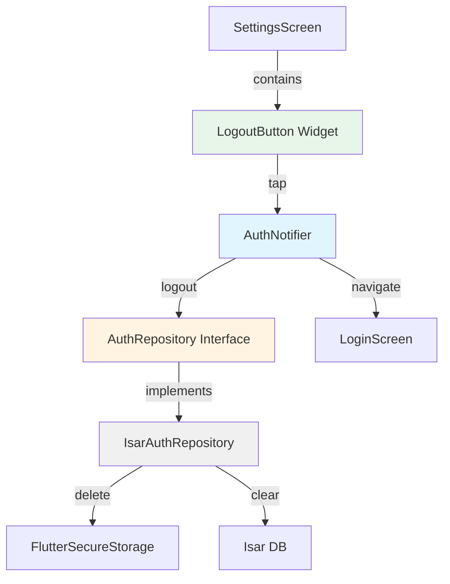

# UF-007: Logout Implementation Plan

## 1. Overview

### Modules
- **AuthNotifier** (Application Layer): Logout orchestration, token management
- **AuthRepository** (Domain Interface): Logout contract
- **IsarAuthRepository** (Infrastructure): Token deletion, session cleanup
- **AuthDto** (Infrastructure): Token storage model
- **LogoutButton** (Presentation): Logout UI trigger

### TDD Coverage
- **Unit Tests**: AuthNotifier, Repository logic (70%)
- **Integration Tests**: Repository with Isar (20%)
- **Widget Tests**: Logout button, confirmation dialog (10%)

## 2. Architecture Diagram



## 3. Implementation Plan

### 3.1 Domain Layer

#### AuthRepository Interface
- **Location**: `lib/features/authentication/domain/repositories/auth_repository.dart`
- **Responsibility**: Define logout contract
- **Test Strategy**: Interface contract verification (Unit)
- **Test Scenarios**:
  - Red: Interface defines `Future<void> logout()` method
  - Red: Method throws UnimplementedError by default
- **Implementation Order**:
  1. Create interface with logout signature
  2. Add documentation
- **Dependencies**: None

#### DomainException
- **Location**: `lib/core/errors/domain_exception.dart`
- **Responsibility**: Logout-specific exceptions
- **Test Strategy**: Exception creation and properties (Unit)
- **Test Scenarios**:
  - Red: `LogoutException` class exists
  - Red: Exception contains message property
  - Red: Exception supports optional error details
- **Implementation Order**:
  1. Create LogoutException class
  2. Add message and details properties
- **Dependencies**: None

---

### 3.2 Infrastructure Layer

#### AuthDto (Token Storage Model)
- **Location**: `lib/features/authentication/infrastructure/dtos/auth_dto.dart`
- **Responsibility**: Token data model for secure storage
- **Test Strategy**: DTO serialization/deserialization (Unit)
- **Test Scenarios**:
  - Red: AuthDto has accessToken, refreshToken, expiresAt fields
  - Red: toJson returns valid Map<String, dynamic>
  - Red: fromJson creates valid AuthDto
  - Red: fromJson handles missing fields gracefully
  - Edge: toJson with null expiresAt
  - Edge: fromJson with malformed data
- **Implementation Order**:
  1. Create AuthDto class with properties
  2. Implement toJson
  3. Implement fromJson
  4. Add null safety
- **Dependencies**: None

#### IsarAuthRepository
- **Location**: `lib/features/authentication/infrastructure/repositories/isar_auth_repository.dart`
- **Responsibility**: Token deletion, session cleanup
- **Test Strategy**: Unit + Integration
- **Test Scenarios (Unit)**:
  - Red: logout deletes access token from secure storage
  - Red: logout deletes refresh token from secure storage
  - Red: logout clears session state
  - Red: logout completes even if tokens don't exist
  - Edge: logout when secure storage throws exception (retry 3 times)
  - Edge: logout when Isar is unavailable (graceful degradation)
  - Edge: concurrent logout calls (idempotent)
- **Test Scenarios (Integration)**:
  - Red: logout removes all auth data from FlutterSecureStorage
  - Red: logout persists across repository instances
  - Edge: logout during active network request
- **Implementation Order**:
  1. Create repository class implementing interface
  2. Inject FlutterSecureStorage dependency
  3. Implement token deletion with retry logic
  4. Implement session cleanup
  5. Add error handling
- **Dependencies**: AuthRepository (interface), FlutterSecureStorage

---

### 3.3 Application Layer

#### AuthNotifier
- **Location**: `lib/features/authentication/application/notifiers/auth_notifier.dart`
- **Responsibility**: Logout orchestration, state transition
- **Test Strategy**: Unit tests with mocked repository
- **Test Scenarios**:
  - Red: logout sets state to AsyncValue.loading()
  - Red: logout calls repository.logout()
  - Red: logout sets state to AsyncValue.data(null) on success
  - Red: logout sets state to AsyncValue.error() on failure
  - Red: logout is idempotent (safe to call multiple times)
  - Edge: logout during existing logout operation
  - Edge: logout throws LogoutException on repository failure
  - Edge: logout rolls back state if navigation fails
- **Implementation Order**:
  1. Add logout method signature
  2. Implement loading state
  3. Call repository.logout()
  4. Handle success state
  5. Handle error state
  6. Add idempotency guard
- **Dependencies**: AuthRepository (interface)

#### Auth Provider
- **Location**: `lib/features/authentication/application/providers.dart`
- **Responsibility**: DI for AuthRepository
- **Test Strategy**: Provider resolution (Unit)
- **Test Scenarios**:
  - Red: authRepositoryProvider returns IsarAuthRepository instance
  - Red: authNotifierProvider uses authRepositoryProvider
  - Red: Provider survives widget rebuild
- **Implementation Order**:
  1. Create @riverpod authRepository provider
  2. Create @riverpod authNotifier provider
  3. Wire dependencies
- **Dependencies**: IsarAuthRepository, AuthNotifier

---

### 3.4 Presentation Layer

#### LogoutConfirmationDialog
- **Location**: `lib/features/authentication/presentation/widgets/logout_confirmation_dialog.dart`
- **Responsibility**: Confirmation UI
- **Test Strategy**: Widget tests
- **Test Scenarios**:
  - Red: Dialog shows title "로그아웃하시겠습니까?"
  - Red: Dialog has Cancel button
  - Red: Dialog has Confirm button
  - Red: Cancel button returns false
  - Red: Confirm button returns true
  - Edge: Dialog dismissible by back gesture
  - Edge: Dialog accessible (semantics)
- **Implementation Order**:
  1. Create StatelessWidget
  2. Add AlertDialog structure
  3. Add title and buttons
  4. Wire Navigator.pop with return values
  5. Add semantics
- **Dependencies**: None
- **QA Sheet**:
  - [ ] Dialog appears centered
  - [ ] Text is readable (contrast, size)
  - [ ] Buttons are tappable (min 48x48)
  - [ ] Cancel closes without action
  - [ ] Confirm triggers logout

#### LogoutButton
- **Location**: `lib/features/authentication/presentation/widgets/logout_button.dart`
- **Responsibility**: Logout trigger
- **Test Strategy**: Widget tests
- **Test Scenarios**:
  - Red: Button displays "로그아웃" text
  - Red: Tap shows confirmation dialog
  - Red: Confirm calls authNotifier.logout()
  - Red: Cancel does not call logout
  - Red: Loading state disables button
  - Red: Error state shows snackbar
  - Edge: Rapid tap prevention (debounce)
  - Edge: Navigation to login screen on success
- **Implementation Order**:
  1. Create StatelessWidget consuming authNotifier
  2. Add ElevatedButton
  3. Wire onPressed to show dialog
  4. Call logout on confirm
  5. Handle loading/error states
  6. Add navigation on success
- **Dependencies**: AuthNotifier, LogoutConfirmationDialog, LoginScreen
- **QA Sheet**:
  - [ ] Button visible in settings screen
  - [ ] Tap response < 100ms
  - [ ] Loading indicator appears
  - [ ] Error message is user-friendly
  - [ ] Navigation smooth (no flicker)

#### SettingsScreen
- **Location**: `lib/features/settings/presentation/screens/settings_screen.dart`
- **Responsibility**: Host LogoutButton
- **Test Strategy**: Widget tests
- **Test Scenarios**:
  - Red: Screen contains LogoutButton at bottom
  - Red: LogoutButton visible without scrolling
- **Implementation Order**:
  1. Add LogoutButton to screen layout
  2. Position at bottom
- **Dependencies**: LogoutButton
- **QA Sheet**:
  - [ ] Button at bottom of screen
  - [ ] Button visible on all screen sizes
  - [ ] Padding consistent with design

---

## 4. TDD Workflow

### Phase 1: Domain Layer (Inside-Out)
1. **Start**: Create AuthRepository interface test
   - Write test: interface has logout method
   - Implement: Add abstract logout method
   - Refactor: Add documentation
   - Commit: "feat(auth): add logout to AuthRepository interface"

2. **Continue**: Create DomainException test
   - Write test: LogoutException exists with message
   - Implement: Create exception class
   - Refactor: Extract base exception if needed
   - Commit: "feat(core): add LogoutException"

### Phase 2: Infrastructure Layer
3. **AuthDto Tests**
   - Red: toJson/fromJson tests
   - Green: Implement serialization
   - Refactor: Extract constants
   - Commit: "feat(auth): add AuthDto for token storage"

4. **IsarAuthRepository Unit Tests**
   - Red: Token deletion tests (mock FlutterSecureStorage)
   - Green: Implement logout with delete calls
   - Refactor: Extract retry logic
   - Commit: "feat(auth): implement logout in IsarAuthRepository"

5. **IsarAuthRepository Integration Tests**
   - Red: End-to-end token deletion
   - Green: Verify FlutterSecureStorage integration
   - Refactor: Optimize error handling
   - Commit: "test(auth): add integration tests for logout"

### Phase 3: Application Layer
6. **AuthNotifier Tests**
   - Red: State transition tests
   - Green: Implement logout method
   - Refactor: Extract state helpers
   - Commit: "feat(auth): add logout to AuthNotifier"

7. **Provider Tests**
   - Red: DI resolution tests
   - Green: Wire providers
   - Refactor: Group related providers
   - Commit: "feat(auth): wire logout dependencies"

### Phase 4: Presentation Layer
8. **LogoutConfirmationDialog Tests**
   - Red: Dialog structure tests
   - Green: Implement dialog widget
   - Refactor: Extract styles
   - Commit: "feat(auth): add logout confirmation dialog"

9. **LogoutButton Tests**
   - Red: Button behavior tests
   - Green: Implement button with dialog
   - Refactor: Extract common widget logic
   - Commit: "feat(auth): add logout button"

10. **SettingsScreen Integration**
    - Red: Button placement test
    - Green: Add button to screen
    - Refactor: Adjust layout
    - Commit: "feat(settings): integrate logout button"

### Commit Points
- After each TDD cycle (Red → Green → Refactor)
- Small, focused commits with descriptive messages
- All tests passing before commit

### Completion Criteria
- [ ] All unit tests passing (70% coverage)
- [ ] All integration tests passing (20% coverage)
- [ ] All widget tests passing (10% coverage)
- [ ] No compiler warnings
- [ ] Code reviewed against CLAUDE.md
- [ ] QA sheet items verified
- [ ] Manual testing on device completed

---

## 5. Edge Cases Handling

### EC1: Network Outtage During Logout
- **Layer**: Infrastructure
- **Test**: Mock network failure scenario
- **Solution**: Logout completes locally (Phase 0 local-only)

### EC2: Concurrent Logout Calls
- **Layer**: Application
- **Test**: Trigger logout twice rapidly
- **Solution**: Idempotency guard in AuthNotifier

### EC3: App Termination Mid-Logout
- **Layer**: Infrastructure
- **Test**: Simulate app kill during token deletion
- **Solution**: Verify token cleanup on next app start

### EC4: Secure Storage Access Failure
- **Layer**: Infrastructure
- **Test**: Mock FlutterSecureStorage exception
- **Solution**: Retry 3 times, log error, continue

### EC5: Dialog Dismissal
- **Layer**: Presentation
- **Test**: Back button/gesture during dialog
- **Solution**: Return false (no logout)

### EC6: Local Data Preservation
- **Layer**: Infrastructure
- **Test**: Verify Isar data persists after logout
- **Solution**: Do NOT clear Isar DB (per business rules)

---

## 6. Testing Strategy Details

### Unit Test Files
1. `test/features/authentication/domain/repositories/auth_repository_test.dart`
2. `test/core/errors/domain_exception_test.dart`
3. `test/features/authentication/infrastructure/dtos/auth_dto_test.dart`
4. `test/features/authentication/infrastructure/repositories/isar_auth_repository_test.dart`
5. `test/features/authentication/application/notifiers/auth_notifier_test.dart`
6. `test/features/authentication/application/providers_test.dart`

### Integration Test Files
1. `integration_test/features/authentication/logout_flow_test.dart`

### Widget Test Files
1. `test/features/authentication/presentation/widgets/logout_confirmation_dialog_test.dart`
2. `test/features/authentication/presentation/widgets/logout_button_test.dart`
3. `test/features/settings/presentation/screens/settings_screen_test.dart`

### Test Pyramid Verification
- Count tests per type
- Ensure 70/20/10 distribution
- Adjust if needed before final commit

---

## 7. Performance Constraints

### Logout Completion Time
- **Target**: < 500ms
- **Measurement**: Add stopwatch in integration test
- **Optimization**: Parallel token deletion if needed

### UI Responsiveness
- **Target**: Dialog appears < 100ms after tap
- **Measurement**: Widget test with pump duration
- **Optimization**: Avoid heavy computations on main thread

---

## 8. Acceptance Criteria Verification

### From spec.md
- [x] User can initiate logout from settings
- [x] Confirmation dialog prevents accidental logout
- [x] Tokens deleted from secure storage
- [x] Session cleared in memory
- [x] Navigation to login screen
- [x] Local data preserved (Phase 0)
- [x] Works offline (no network dependency)

### Additional Checks
- [x] No memory leaks (verify in profiler)
- [x] No uncaught exceptions
- [x] Graceful degradation on all edge cases
- [x] Accessibility compliant

---

## 9. Implementation Notes

### Critical Rules (from CLAUDE.md)
- **Layer Dependency**: Presentation → Application → Domain ← Infrastructure
- **Repository Pattern**: All data access via interface
- **TDD First**: Test before code (every time)
- **No Direct Isar Access**: Use repository abstraction

### Naming Conventions
- Entity: User (domain/entities/)
- DTO: AuthDto (infrastructure/dtos/)
- Repository Interface: AuthRepository (domain/repositories/)
- Repository Impl: IsarAuthRepository (infrastructure/repositories/)
- Notifier: AuthNotifier (application/notifiers/)
- Provider: authNotifierProvider

### Code Quality Checks
```bash
# Before every commit
flutter analyze --no-fatal-infos
flutter test
```

---

## 10. Phase 1 Migration Readiness

### Infrastructure Changes Only
When migrating to Supabase:
1. Create `SupabaseAuthRepository implements AuthRepository`
2. Update provider: `return SupabaseAuthRepository(...)`
3. **Zero changes** to Domain, Application, Presentation

### Verification
- Repository interface unchanged
- All tests pass with new implementation
- Logout flow identical from user perspective

---

## End of Plan

**Next Step**: Start Phase 1 - Domain Layer
**First Test**: `test/features/authentication/domain/repositories/auth_repository_test.dart`
