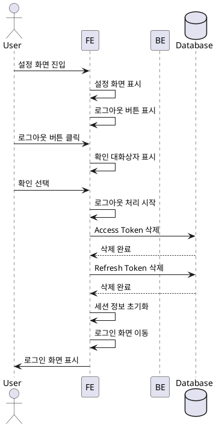

# UF-007: 로그아웃 상세 유스케이스

## Primary Actor
GLP-1 치료 관리 앱 사용자

## Precondition
- 사용자가 앱에 로그인되어 있음
- 유효한 Access Token 및 Refresh Token이 안전한 저장소에 존재함
- 사용자가 설정 메뉴에 접근 가능함

## Trigger
사용자가 설정 메뉴에서 로그아웃 버튼을 클릭함

## Main Scenario

### 1. 설정 화면 진입
사용자가 홈 대시보드 또는 다른 화면에서 설정 아이콘을 선택하여 설정 화면으로 이동

### 2. 로그아웃 버튼 표시
설정 화면 하단에 로그아웃 버튼이 표시됨

### 3. 로그아웃 요청
사용자가 로그아웃 버튼을 클릭함

### 4. 확인 대화상자 표시
시스템이 "로그아웃하시겠습니까?" 확인 대화상자를 표시함
- 확인 버튼
- 취소 버튼

### 5. 로그아웃 확인
사용자가 확인 버튼을 선택함

### 6. 토큰 삭제
시스템이 안전한 저장소(FlutterSecureStorage)에서 저장된 인증 토큰을 삭제함
- Access Token 삭제
- Refresh Token 삭제
- 토큰 만료 시간 정보 삭제

### 7. 세션 정보 초기화
시스템이 로컬 세션 정보를 초기화함
- 메모리 내 사용자 세션 데이터 제거
- 인증 상태를 로그아웃 상태로 변경

### 8. 로그인 화면 이동
시스템이 로그인 화면으로 전환함

### 9. 완료
사용자가 로그인 화면을 확인하고 로그아웃이 완료됨

## Edge Cases

### EC1: 로그아웃 취소
- **상황**: 4단계에서 사용자가 취소 버튼을 선택
- **처리**: 확인 대화상자를 닫고 설정 화면 유지
- **결과**: 로그아웃 처리 없이 설정 화면에 그대로 머무름

### EC2: 네트워크 오류
- **상황**: 6-7단계에서 네트워크 오류 발생
- **처리**: 네트워크 상태와 무관하게 로컬 토큰 및 세션 정보 삭제 진행
- **결과**: 로컬 토큰 삭제 후 로그인 화면으로 이동

### EC3: 토큰 삭제 실패
- **상황**: 6단계에서 안전한 저장소 접근 오류로 토큰 삭제 실패
- **처리**: 에러를 로깅하고 재시도, 최대 3회 재시도 후에도 실패 시 세션 정보만 초기화
- **결과**: 다음 앱 실행 시 토큰 유효성 검증 단계에서 자동 처리됨

### EC4: 로그아웃 중 앱 종료
- **상황**: 6-8단계 사이에 사용자가 앱을 강제 종료함
- **처리**: 다음 앱 실행 시 저장된 토큰 존재 여부 확인
- **결과**: 토큰이 삭제된 경우 로그인 화면 표시, 삭제되지 않은 경우 자동 로그인 진행

### EC5: 로컬 데이터 보존
- **상황**: 로그아웃 후 로컬 Isar 데이터베이스 처리
- **처리**: Phase 0에서는 로컬 데이터 유지 (투여 기록, 체중 기록 등)
- **결과**: 재로그인 시 기존 데이터 계속 사용 가능

### EC6: 다중 기기 로그아웃
- **상황**: 사용자가 여러 기기에서 로그인되어 있고 한 기기에서 로그아웃
- **처리**: Phase 0에서는 각 기기의 세션이 독립적으로 관리됨
- **결과**: 다른 기기의 로그인 상태에는 영향 없음

## Business Rules

### BR1: 토큰 보안
로그아웃 시 모든 인증 토큰은 안전하게 삭제되어야 하며, 메모리에 남지 않아야 함

### BR2: 로컬 데이터 보존
Phase 0에서는 로그아웃 시 사용자의 로컬 데이터(투여 기록, 체중 기록 등)를 삭제하지 않음

### BR3: 확인 단계 필수
사용자의 의도하지 않은 로그아웃을 방지하기 위해 확인 대화상자를 반드시 표시해야 함

### BR4: 네트워크 독립성
로그아웃 처리는 네트워크 상태와 무관하게 동작해야 함 (Phase 0 로컬 DB 기반)

### BR5: 재로그인 가능성
로그아웃 후에도 동일한 소셜 계정으로 재로그인 시 기존 데이터에 접근 가능해야 함

## Sequence Diagram

