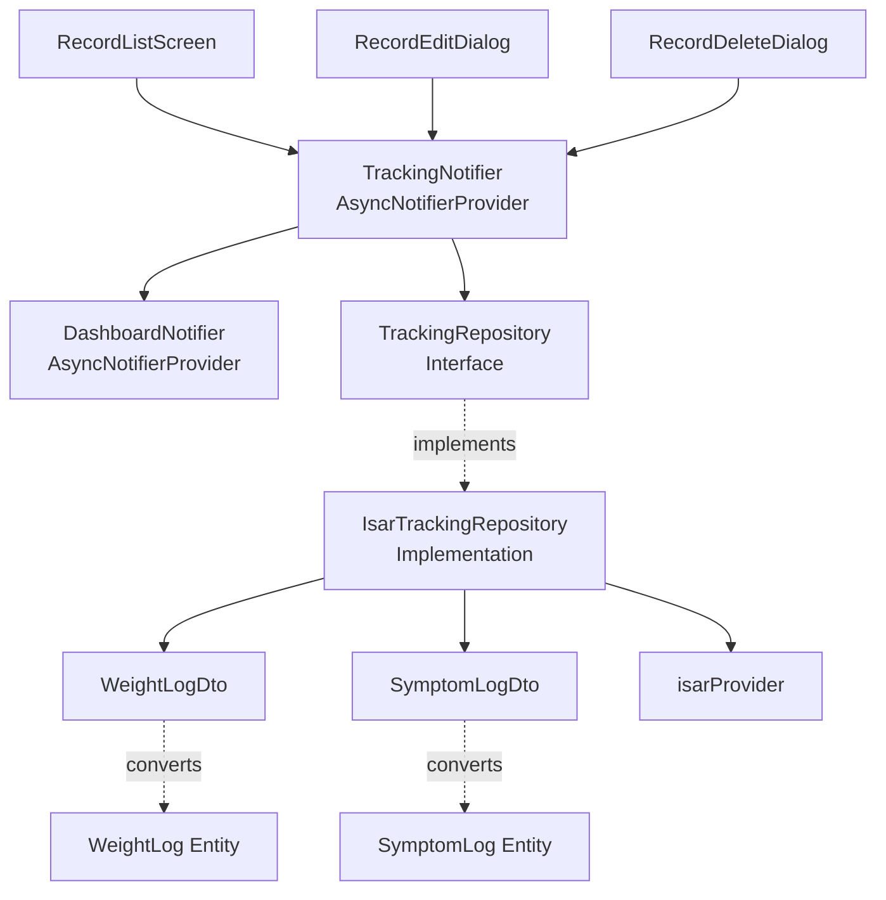

# UF-011: Past Record Edit/Delete Implementation Plan

## 1. Overview

### Module Summary
| Module | Location | Description | TDD Scope |
|--------|----------|-------------|-----------|
| **Domain Layer** | `features/tracking/domain/` | Record entities, repository interface | Unit (Inside-Out) |
| **Infrastructure Layer** | `features/tracking/infrastructure/` | Isar repository implementation, DTOs | Integration |
| **Application Layer** | `features/tracking/application/` | Record edit/delete notifier, state management | Unit + Integration |
| **Presentation Layer** | `features/tracking/presentation/` | Record list, edit/delete screens | Acceptance + Manual QA |

### TDD Strategy
- **Approach**: Inside-Out (Core Logic → Outward)
- **Test Distribution**: Unit 70%, Integration 20%, Acceptance 10%
- **Phase 0 Focus**: Isar local DB operations only

---

## 2. Architecture Diagram



---

## 3. Implementation Plan

### 3.1. Domain Layer

#### Module: WeightLog Entity
- **Location**: `features/tracking/domain/entities/weight_log.dart`
- **Responsibility**: Immutable weight record entity
- **Test Strategy**: Unit Tests
- **Test Scenarios (RED Phase)**:
  ```dart
  // AAA Pattern
  test('should create WeightLog with valid data', () {
    // Arrange
    final date = DateTime(2024, 1, 1);
    // Act
    final log = WeightLog(id: '1', userId: 'u1', logDate: date, weightKg: 70.5, createdAt: date);
    // Assert
    expect(log.weightKg, 70.5);
  });

  test('should create copy with updated weight', () {
    // Arrange
    final log = WeightLog(...);
    // Act
    final updated = log.copyWith(weightKg: 68.0);
    // Assert
    expect(updated.weightKg, 68.0);
    expect(updated.id, log.id); // Unchanged fields preserved
  });
  ```
- **Edge Cases**:
  - Negative weight validation (handled by UI/Application, not Entity)
  - Future date validation (handled by UI/Application)
- **Implementation Order**: Test → Entity → copyWith method
- **Dependencies**: None

#### Module: SymptomLog Entity
- **Location**: `features/tracking/domain/entities/symptom_log.dart`
- **Responsibility**: Immutable symptom record entity
- **Test Strategy**: Unit Tests
- **Test Scenarios (RED Phase)**:
  ```dart
  test('should create SymptomLog with all fields', () {
    // Arrange & Act
    final log = SymptomLog(
      id: '1', userId: 'u1', logDate: DateTime.now(),
      symptomName: 'nausea', severity: 5, tags: ['oily_food']
    );
    // Assert
    expect(log.severity, 5);
    expect(log.tags, contains('oily_food'));
  });

  test('should create copy with updated severity', () {
    // Arrange
    final log = SymptomLog(...);
    // Act
    final updated = log.copyWith(severity: 7);
    // Assert
    expect(updated.severity, 7);
  });
  ```
- **Edge Cases**:
  - Severity out of range (1-10) validation
  - Empty tags list handling
- **Implementation Order**: Test → Entity → copyWith method
- **Dependencies**: None

#### Module: TrackingRepository Interface
- **Location**: `features/tracking/domain/repositories/tracking_repository.dart`
- **Responsibility**: Define data access contract
- **Test Strategy**: Integration Tests (via Implementation)
- **Test Scenarios**: N/A (Interface only)
- **Implementation Order**: Interface definition first
- **Dependencies**: WeightLog, SymptomLog entities
- **Interface Methods**:
  ```dart
  abstract class TrackingRepository {
    Future<List<WeightLog>> getWeightLogs();
    Future<List<SymptomLog>> getSymptomLogs();
    Future<void> updateWeightLog(String id, double newWeight);
    Future<void> updateSymptomLog(String id, SymptomLog updatedLog);
    Future<void> deleteWeightLog(String id);
    Future<void> deleteSymptomLog(String id);
    Stream<List<WeightLog>> watchWeightLogs();
    Stream<List<SymptomLog>> watchSymptomLogs();
  }
  ```

---

### 3.2. Infrastructure Layer

#### Module: WeightLogDto
- **Location**: `features/tracking/infrastructure/dtos/weight_log_dto.dart`
- **Responsibility**: Isar collection model, Entity conversion
- **Test Strategy**: Unit Tests
- **Test Scenarios (RED Phase)**:
  ```dart
  test('should convert DTO to Entity', () {
    // Arrange
    final dto = WeightLogDto()
      ..id = 1
      ..userId = 'u1'
      ..logDate = DateTime(2024, 1, 1)
      ..weightKg = 70.5;
    // Act
    final entity = dto.toEntity();
    // Assert
    expect(entity.weightKg, 70.5);
    expect(entity.id, '1'); // ID conversion
  });

  test('should convert Entity to DTO', () {
    // Arrange
    final entity = WeightLog(id: '1', userId: 'u1', ...);
    // Act
    final dto = WeightLogDto.fromEntity(entity);
    // Assert
    expect(dto.weightKg, entity.weightKg);
  });
  ```
- **Edge Cases**:
  - ID type conversion (String ↔ int)
  - Null handling for optional fields
- **Implementation Order**: Test → toEntity → fromEntity
- **Dependencies**: WeightLog entity, Isar

#### Module: SymptomLogDto
- **Location**: `features/tracking/infrastructure/dtos/symptom_log_dto.dart`
- **Responsibility**: Isar collection model, Entity conversion
- **Test Strategy**: Unit Tests
- **Test Scenarios (RED Phase)**:
  ```dart
  test('should convert DTO with tags to Entity', () {
    // Arrange
    final dto = SymptomLogDto()
      ..tags = ['oily_food', 'overeating'];
    // Act
    final entity = dto.toEntity();
    // Assert
    expect(entity.tags.length, 2);
  });

  test('should handle empty tags', () {
    // Arrange
    final dto = SymptomLogDto()..tags = [];
    // Act
    final entity = dto.toEntity();
    // Assert
    expect(entity.tags, isEmpty);
  });
  ```
- **Edge Cases**:
  - Empty tags list
  - Null isPersistent24h field
  - Null daysSinceEscalation field
- **Implementation Order**: Test → toEntity → fromEntity
- **Dependencies**: SymptomLog entity, Isar

#### Module: IsarTrackingRepository
- **Location**: `features/tracking/infrastructure/repositories/isar_tracking_repository.dart`
- **Responsibility**: Isar database operations implementation
- **Test Strategy**: Integration Tests (with mock Isar)
- **Test Scenarios (RED Phase)**:
  ```dart
  group('updateWeightLog', () {
    test('should update existing weight log', () async {
      // Arrange
      final repo = IsarTrackingRepository(mockIsar);
      await repo.saveWeightLog(WeightLog(...)); // Seed data
      // Act
      await repo.updateWeightLog('1', 68.0);
      // Assert
      final logs = await repo.getWeightLogs();
      expect(logs.first.weightKg, 68.0);
    });

    test('should throw exception when record not found', () async {
      // Arrange
      final repo = IsarTrackingRepository(mockIsar);
      // Act & Assert
      expect(
        () => repo.updateWeightLog('nonexistent', 70.0),
        throwsA(isA<RepositoryException>()),
      );
    });
  });

  group('deleteWeightLog', () {
    test('should delete existing weight log', () async {
      // Arrange
      final repo = IsarTrackingRepository(mockIsar);
      await repo.saveWeightLog(WeightLog(...));
      // Act
      await repo.deleteWeightLog('1');
      // Assert
      final logs = await repo.getWeightLogs();
      expect(logs, isEmpty);
    });

    test('should be idempotent (no error on double delete)', () async {
      // Arrange
      final repo = IsarTrackingRepository(mockIsar);
      await repo.deleteWeightLog('1');
      // Act & Assert
      expect(() => repo.deleteWeightLog('1'), returnsNormally);
    });
  });

  group('updateSymptomLog', () {
    test('should update symptom severity and tags', () async {
      // Arrange
      final repo = IsarTrackingRepository(mockIsar);
      final original = SymptomLog(severity: 5, tags: ['stress']);
      await repo.saveSymptomLog(original);
      // Act
      final updated = original.copyWith(severity: 7, tags: ['stress', 'fatigue']);
      await repo.updateSymptomLog('1', updated);
      // Assert
      final logs = await repo.getSymptomLogs();
      expect(logs.first.severity, 7);
      expect(logs.first.tags.length, 2);
    });
  });
  ```
- **Edge Cases**:
  - Record not found (throw RepositoryException)
  - Delete non-existent record (idempotent, no error)
  - Concurrent modification (Isar transaction handling)
  - Update with invalid ID format
- **Implementation Order**: Test → updateWeightLog → deleteWeightLog → updateSymptomLog → deleteSymptomLog
- **Dependencies**: TrackingRepository interface, Isar, DTOs

---

### 3.3. Application Layer

#### Module: TrackingNotifier
- **Location**: `features/tracking/application/notifiers/tracking_notifier.dart`
- **Responsibility**: State management for tracking records, orchestrate CRUD
- **Test Strategy**: Unit Tests (mock repository)
- **Test Scenarios (RED Phase)**:
  ```dart
  group('updateWeightLog', () {
    test('should update state to loading then data on success', () async {
      // Arrange
      final mockRepo = MockTrackingRepository();
      when(() => mockRepo.updateWeightLog(any(), any())).thenAnswer((_) async {});
      when(() => mockRepo.getWeightLogs()).thenAnswer((_) async => [updatedLog]);
      final notifier = TrackingNotifier(mockRepo);

      // Act
      await notifier.updateWeightLog('1', 68.0);

      // Assert
      expect(notifier.state, isA<AsyncData<TrackingState>>());
      verify(() => mockRepo.updateWeightLog('1', 68.0)).called(1);
    });

    test('should update state to error on failure', () async {
      // Arrange
      final mockRepo = MockTrackingRepository();
      when(() => mockRepo.updateWeightLog(any(), any()))
        .thenThrow(RepositoryException('DB error'));
      final notifier = TrackingNotifier(mockRepo);

      // Act
      await notifier.updateWeightLog('1', 68.0);

      // Assert
      expect(notifier.state, isA<AsyncError>());
    });
  });

  group('deleteWeightLog', () {
    test('should remove record from state on success', () async {
      // Arrange
      final mockRepo = MockTrackingRepository();
      when(() => mockRepo.deleteWeightLog(any())).thenAnswer((_) async {});
      when(() => mockRepo.getWeightLogs()).thenAnswer((_) async => []);
      final notifier = TrackingNotifier(mockRepo);

      // Act
      await notifier.deleteWeightLog('1');

      // Assert
      final state = notifier.state.value;
      expect(state?.weights.value, isEmpty);
    });
  });

  group('updateSymptomLog', () {
    test('should update symptom with new values', () async {
      // Arrange
      final mockRepo = MockTrackingRepository();
      final updated = SymptomLog(severity: 8, ...);
      when(() => mockRepo.updateSymptomLog(any(), any())).thenAnswer((_) async {});
      final notifier = TrackingNotifier(mockRepo);

      // Act
      await notifier.updateSymptomLog('1', updated);

      // Assert
      verify(() => mockRepo.updateSymptomLog('1', updated)).called(1);
    });
  });
  ```
- **Edge Cases**:
  - Update/delete during loading state (queue or reject)
  - Repository throws exception (propagate to UI)
  - Dashboard refresh trigger failure (log error, continue)
- **Implementation Order**: Test → updateWeightLog → deleteWeightLog → updateSymptomLog → deleteSymptomLog
- **Dependencies**: TrackingRepository, DashboardNotifier (refresh trigger)

#### Module: Dashboard Refresh Integration
- **Location**: `features/tracking/application/notifiers/tracking_notifier.dart` (within methods)
- **Responsibility**: Trigger dashboard recalculation after edit/delete
- **Test Strategy**: Integration Tests
- **Test Scenarios (RED Phase)**:
  ```dart
  test('should trigger dashboard refresh after weight update', () async {
    // Arrange
    final mockDashboard = MockDashboardNotifier();
    final notifier = TrackingNotifier(mockRepo, mockDashboard);

    // Act
    await notifier.updateWeightLog('1', 68.0);

    // Assert
    verify(() => mockDashboard.refresh()).called(1);
  });

  test('should trigger dashboard refresh after record deletion', () async {
    // Arrange
    final mockDashboard = MockDashboardNotifier();
    final notifier = TrackingNotifier(mockRepo, mockDashboard);

    // Act
    await notifier.deleteSymptomLog('1');

    // Assert
    verify(() => mockDashboard.refresh()).called(1);
  });

  test('should not fail if dashboard refresh throws', () async {
    // Arrange
    final mockDashboard = MockDashboardNotifier();
    when(() => mockDashboard.refresh()).thenThrow(Exception('Dashboard error'));
    final notifier = TrackingNotifier(mockRepo, mockDashboard);

    // Act & Assert
    expect(() => notifier.updateWeightLog('1', 68.0), returnsNormally);
  });
  ```
- **Edge Cases**:
  - Dashboard refresh failure should not block record update
  - Dashboard provider not available (defensive coding)
- **Implementation Order**: After TrackingNotifier methods
- **Dependencies**: DashboardNotifier

---

### 3.4. Presentation Layer

#### Module: RecordListScreen
- **Location**: `features/tracking/presentation/screens/record_list_screen.dart`
- **Responsibility**: Display weight/symptom logs, navigate to edit/delete
- **Test Strategy**: Widget Tests
- **Test Scenarios (RED Phase)**:
  ```dart
  testWidgets('should display list of weight logs', (tester) async {
    // Arrange
    final mockState = TrackingState(
      weights: AsyncData([WeightLog(weightKg: 70.5, ...)]),
      symptoms: AsyncData([]),
    );

    // Act
    await tester.pumpWidget(
      ProviderScope(
        overrides: [trackingNotifierProvider.overrideWith((ref) => mockState)],
        child: RecordListScreen(),
      ),
    );

    // Assert
    expect(find.text('70.5 kg'), findsOneWidget);
  });

  testWidgets('should show edit button for each record', (tester) async {
    // Arrange & Act
    await tester.pumpWidget(...);

    // Assert
    expect(find.byIcon(Icons.edit), findsWidgets);
  });

  testWidgets('should open edit dialog on edit tap', (tester) async {
    // Arrange
    await tester.pumpWidget(...);

    // Act
    await tester.tap(find.byIcon(Icons.edit).first);
    await tester.pumpAndSettle();

    // Assert
    expect(find.byType(RecordEditDialog), findsOneWidget);
  });
  ```
- **Edge Cases**:
  - Empty list (show placeholder)
  - Loading state (show skeleton)
  - Error state (show error message)
- **Implementation Order**: Test → List UI → Edit navigation → Delete navigation
- **Dependencies**: TrackingNotifier
- **QA Sheet**: See Section 4

#### Module: RecordEditDialog
- **Location**: `features/tracking/presentation/widgets/record_edit_dialog.dart`
- **Responsibility**: Edit weight or symptom values, validation
- **Test Strategy**: Widget Tests
- **Test Scenarios (RED Phase)**:
  ```dart
  testWidgets('should show current weight value in input field', (tester) async {
    // Arrange
    final log = WeightLog(weightKg: 70.5, ...);

    // Act
    await tester.pumpWidget(RecordEditDialog(weightLog: log));

    // Assert
    expect(find.text('70.5'), findsOneWidget);
  });

  testWidgets('should validate weight input (positive number)', (tester) async {
    // Arrange
    await tester.pumpWidget(RecordEditDialog(weightLog: log));

    // Act
    await tester.enterText(find.byType(TextField), '-10');
    await tester.tap(find.text('Save'));
    await tester.pump();

    // Assert
    expect(find.text('Weight must be positive'), findsOneWidget);
  });

  testWidgets('should call updateWeightLog on save', (tester) async {
    // Arrange
    final mockNotifier = MockTrackingNotifier();
    await tester.pumpWidget(
      ProviderScope(
        overrides: [trackingNotifierProvider.overrideWith((ref) => mockNotifier)],
        child: RecordEditDialog(weightLog: log),
      ),
    );

    // Act
    await tester.enterText(find.byType(TextField), '68.0');
    await tester.tap(find.text('Save'));
    await tester.pump();

    // Assert
    verify(() => mockNotifier.updateWeightLog(log.id, 68.0)).called(1);
  });
  ```
- **Edge Cases**:
  - Empty input (show validation error)
  - Non-numeric input (show validation error)
  - Unrealistic values (20kg < weight < 300kg)
  - Save during loading (disable button)
- **Implementation Order**: Test → UI → Validation → Save action
- **Dependencies**: TrackingNotifier
- **QA Sheet**: See Section 4

#### Module: RecordDeleteDialog
- **Location**: `features/tracking/presentation/widgets/record_delete_dialog.dart`
- **Responsibility**: Confirm deletion, execute delete
- **Test Strategy**: Widget Tests
- **Test Scenarios (RED Phase)**:
  ```dart
  testWidgets('should show confirmation message', (tester) async {
    // Arrange & Act
    await tester.pumpWidget(RecordDeleteDialog(recordId: '1', recordType: 'weight'));

    // Assert
    expect(find.text('Are you sure you want to delete this record?'), findsOneWidget);
  });

  testWidgets('should call deleteWeightLog on confirm', (tester) async {
    // Arrange
    final mockNotifier = MockTrackingNotifier();
    await tester.pumpWidget(
      ProviderScope(
        overrides: [trackingNotifierProvider.overrideWith((ref) => mockNotifier)],
        child: RecordDeleteDialog(recordId: '1', recordType: 'weight'),
      ),
    );

    // Act
    await tester.tap(find.text('Delete'));
    await tester.pump();

    // Assert
    verify(() => mockNotifier.deleteWeightLog('1')).called(1);
  });

  testWidgets('should close dialog on cancel', (tester) async {
    // Arrange
    await tester.pumpWidget(...);

    // Act
    await tester.tap(find.text('Cancel'));
    await tester.pumpAndSettle();

    // Assert
    expect(find.byType(RecordDeleteDialog), findsNothing);
  });
  ```
- **Edge Cases**:
  - Delete during loading (disable button)
  - Delete failure (show error snackbar)
- **Implementation Order**: Test → UI → Confirm action → Cancel action
- **Dependencies**: TrackingNotifier
- **QA Sheet**: See Section 4

---

## 4. TDD Workflow

### Phase 1: Domain Layer (Inside-Out)
1. **Start**: WeightLog entity tests
2. **Red**: Write test for entity creation and copyWith
3. **Green**: Implement minimal entity
4. **Refactor**: Add validation in copyWith if needed
5. **Commit**: "test: add WeightLog entity tests" → "feat: add WeightLog entity"
6. **Repeat**: SymptomLog entity → TrackingRepository interface

### Phase 2: Infrastructure Layer
1. **Start**: WeightLogDto conversion tests
2. **Red**: Write toEntity/fromEntity tests
3. **Green**: Implement conversion methods
4. **Refactor**: Extract common logic
5. **Commit**: "test: add DTO conversion tests" → "feat: add DTO converters"
6. **Repeat**: SymptomLogDto → IsarTrackingRepository (integration tests)

### Phase 3: Application Layer
1. **Start**: TrackingNotifier update tests
2. **Red**: Write state transition tests (loading → data/error)
3. **Green**: Implement update methods with AsyncValue
4. **Refactor**: Extract error handling logic
5. **Commit**: "test: add notifier update tests" → "feat: add record update logic"
6. **Repeat**: Delete methods → Dashboard refresh integration

### Phase 4: Presentation Layer
1. **Start**: RecordListScreen widget tests
2. **Red**: Write list display tests
3. **Green**: Implement UI with mock data
4. **Refactor**: Extract reusable widgets
5. **Commit**: "test: add record list tests" → "feat: add record list UI"
6. **Repeat**: RecordEditDialog → RecordDeleteDialog

### Phase 5: Acceptance Tests
1. **Start**: End-to-end user flow
2. **Red**: Write full edit/delete scenario test
3. **Green**: Connect all layers
4. **Refactor**: Optimize state management
5. **Commit**: "test: add e2e edit/delete tests" → "feat: complete UF-011"

### Test Execution Strategy
- Run unit tests after each RED → GREEN cycle
- Run integration tests after infrastructure completion
- Run widget tests after each presentation module
- Run acceptance tests at the end
- All tests must pass before commit

---

## 5. QA Sheet (Presentation Layer Manual Testing)

### RecordListScreen
- [ ] Weight logs displayed with date, weight value
- [ ] Symptom logs displayed with date, symptom name, severity
- [ ] Empty state shows "No records yet" message
- [ ] Loading state shows skeleton UI
- [ ] Error state shows retry button
- [ ] Edit icon visible on each record
- [ ] Delete icon visible on each record
- [ ] Tap edit icon opens RecordEditDialog
- [ ] Tap delete icon opens RecordDeleteDialog
- [ ] List refreshes after edit/delete

### RecordEditDialog
- [ ] Dialog shows current record values
- [ ] Weight input accepts decimal numbers (e.g., 70.5)
- [ ] Symptom severity input shows 1-10 slider
- [ ] Tags input shows multi-select chips
- [ ] Validation error shows for empty weight
- [ ] Validation error shows for negative weight
- [ ] Validation error shows for weight < 20kg or > 300kg
- [ ] Validation error shows for severity outside 1-10
- [ ] Save button disabled during loading
- [ ] Save button triggers update and closes dialog
- [ ] Cancel button closes dialog without saving
- [ ] Snackbar shows "Record updated" on success
- [ ] Snackbar shows error message on failure

### RecordDeleteDialog
- [ ] Dialog shows confirmation message
- [ ] Record details displayed (date, type)
- [ ] Warning icon visible
- [ ] Delete button has destructive color (red)
- [ ] Delete button disabled during loading
- [ ] Delete button triggers deletion and closes dialog
- [ ] Cancel button closes dialog without deleting
- [ ] Snackbar shows "Record deleted" on success
- [ ] Snackbar shows error message on failure
- [ ] Record removed from list immediately

### Dashboard Integration
- [ ] Goal progress recalculates after weight update
- [ ] Weekly progress recalculates after record deletion
- [ ] Continuous record days updates correctly
- [ ] Timeline reflects changes immediately
- [ ] Insight messages regenerate if applicable
- [ ] Badge progress updates (if affected by changes)

### Edge Case Scenarios
- [ ] Edit record while offline (queue for retry)
- [ ] Delete record while offline (queue for retry)
- [ ] Concurrent edits (last write wins)
- [ ] Edit non-existent record (show error)
- [ ] Delete already deleted record (no error)
- [ ] Rapid edit/delete taps (debounce/disable)

---

## 6. Performance Constraints

- Record list load: < 200ms (100 records)
- Edit dialog open: < 100ms
- Update operation: < 500ms (local Isar)
- Delete operation: < 300ms (local Isar)
- Dashboard refresh: < 1s (after edit/delete)
- UI responsiveness: 60fps maintained

---

## 7. Dependencies & Prerequisites

### Before Implementation
- [ ] F000 (Onboarding) completed (UserProfile entity exists)
- [ ] F002 (Tracking) completed (WeightLog, SymptomLog entities exist)
- [ ] F006 (Dashboard) completed (DashboardNotifier exists)
- [ ] Isar schema generated
- [ ] Repository pattern established

### External Dependencies
- `isar`: ^3.x (local DB)
- `riverpod`: ^2.x (state management)
- `flutter_test`: (testing framework)
- `mocktail`: (mocking)

---

## 8. Critical Rules Checklist

- [ ] Repository Pattern strictly followed (Interface in Domain, Implementation in Infrastructure)
- [ ] No layer violations (Presentation → Application → Domain ← Infrastructure)
- [ ] All Repository calls through Application Layer
- [ ] DTO ↔ Entity conversion in Infrastructure only
- [ ] No business logic in Presentation Layer
- [ ] No Isar imports in Domain/Application/Presentation
- [ ] All async operations use AsyncValue<T>
- [ ] Error handling with RepositoryException
- [ ] Tests written BEFORE implementation (TDD)
- [ ] FIRST principles applied to all tests

---

## 9. Commit Strategy

### Recommended Commits (Small, Frequent)
1. `test: add WeightLog entity tests`
2. `feat: add WeightLog entity with copyWith`
3. `test: add SymptomLog entity tests`
4. `feat: add SymptomLog entity with copyWith`
5. `feat: add TrackingRepository interface methods`
6. `test: add WeightLogDto conversion tests`
7. `feat: add WeightLogDto with toEntity/fromEntity`
8. `test: add SymptomLogDto conversion tests`
9. `feat: add SymptomLogDto with toEntity/fromEntity`
10. `test: add IsarTrackingRepository update tests`
11. `feat: implement IsarTrackingRepository update methods`
12. `test: add IsarTrackingRepository delete tests`
13. `feat: implement IsarTrackingRepository delete methods`
14. `test: add TrackingNotifier update tests`
15. `feat: implement TrackingNotifier update methods`
16. `test: add TrackingNotifier delete tests`
17. `feat: implement TrackingNotifier delete methods`
18. `test: add dashboard refresh integration tests`
19. `feat: integrate dashboard refresh triggers`
20. `test: add RecordListScreen widget tests`
21. `feat: implement RecordListScreen UI`
22. `test: add RecordEditDialog widget tests`
23. `feat: implement RecordEditDialog with validation`
24. `test: add RecordDeleteDialog widget tests`
25. `feat: implement RecordDeleteDialog`
26. `test: add e2e edit/delete flow tests`
27. `feat: complete UF-011 implementation`
28. `docs: add UF-011 completion notes`

---

## 10. Success Criteria

### Functional
- [ ] User can edit weight value for existing records
- [ ] User can edit symptom severity, tags, notes
- [ ] User can delete weight/symptom records with confirmation
- [ ] Dashboard recalculates automatically after changes
- [ ] All edge cases handled gracefully

### Non-Functional
- [ ] All unit tests pass (70%+ coverage)
- [ ] All integration tests pass
- [ ] All widget tests pass
- [ ] Performance constraints met
- [ ] No memory leaks in list/dialog operations
- [ ] Accessibility: screen reader support, large text support

### TDD Compliance
- [ ] Every feature has tests written first
- [ ] RED → GREEN → REFACTOR cycle followed
- [ ] FIRST principles verified
- [ ] AAA pattern used consistently
- [ ] No untested code merged

---

## 11. Notes

- **Phase 0 Scope**: This plan focuses on Isar local DB only. Phase 1 (Supabase) will require only Infrastructure Layer changes (SupabaseTrackingRepository).
- **State Management**: Use Riverpod AsyncNotifierProvider for all stateful operations. Avoid StatefulWidget for business logic.
- **Error Handling**: Wrap repository calls in try-catch, throw RepositoryException with user-friendly messages.
- **Validation**: UI-level validation for user input, repository-level validation for data integrity.
- **Testing Tools**: Use `mocktail` for mocking, `flutter_test` for widget tests, `integration_test` for e2e.
- **Accessibility**: Ensure all interactive elements have semantic labels for screen readers.
