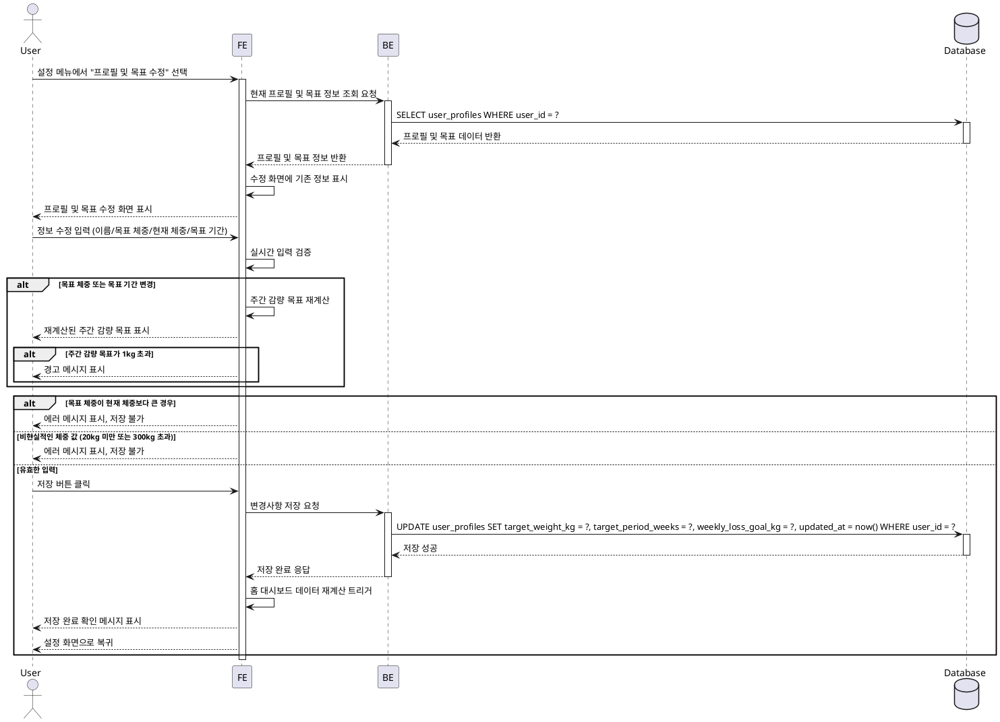

# UF-008: 프로필 및 목표 수정

## Use Case Specification

### Primary Actor
GLP-1 사용자 (치료 중 목표 또는 프로필 정보를 변경하려는 사용자)

### Precondition
- 사용자가 로그인되어 있음
- 온보딩 완료로 기본 프로필 및 목표가 설정되어 있음

### Trigger
- 사용자가 설정 메뉴에서 "프로필 및 목표 수정" 선택

### Main Scenario

1. 사용자가 홈 대시보드 또는 다른 화면에서 설정 아이콘 또는 메뉴를 선택한다.
2. 설정 메뉴에서 "프로필 및 목표 수정"을 선택한다.
3. 시스템은 현재 사용자의 프로필 및 목표 정보를 조회한다.
4. 시스템은 수정 화면에 기존 정보를 표시한다:
   - 사용자 이름
   - 목표 체중 (kg)
   - 현재 체중 (kg)
   - 목표 기간 (주 단위, 선택 사항)
   - 자동 계산된 주간 감량 목표 (목표 기간 입력 시)
5. 사용자가 수정할 필드의 값을 변경한다.
6. 시스템은 실시간으로 입력 값을 검증한다:
   - 이름: 비어있지 않은지 확인
   - 목표 체중 및 현재 체중: 양수 값, 현실적 범위 (20kg 이상 300kg 이하)
   - 목표 기간: 양수 값 또는 미입력 허용
7. 목표 체중 또는 목표 기간이 변경된 경우, 시스템은 주간 평균 감량 목표를 재계산하여 표시한다.
8. 재계산된 주간 감량 목표가 안전 범위 (주당 1kg)를 초과하는 경우, 시스템은 경고 메시지를 표시한다.
9. 사용자가 저장 버튼을 클릭한다.
10. 시스템은 변경사항을 Repository를 통해 저장한다.
11. 시스템은 홈 대시보드 관련 데이터 재계산을 트리거한다:
    - 목표 진행도
    - 목표 달성 예상 시기
    - 인사이트 메시지
12. 시스템은 저장 완료 확인 메시지를 표시한다.
13. 시스템은 자동으로 설정 화면으로 복귀한다.

### Edge Cases

- **목표 체중이 현재 체중보다 큰 경우**: 에러 메시지 표시, 저장 불가
- **변경사항 없이 저장 시도**: 그대로 유지, 설정 화면으로 복귀
- **저장 중 앱 종료**: 변경사항 폐기, 다음 실행 시 기존 정보 유지
- **현재 체중 변경 시 최근 체중 기록과 불일치**: 확인 메시지 표시 후 진행 허용
- **목표 변경으로 인한 목표 달성 예상일 변동**: 홈 대시보드에 자동 반영
- **목표 기간 미입력**: 주간 감량 목표 계산 건너뛰기
- **비현실적인 체중 값 입력 (20kg 미만, 300kg 초과)**: 에러 메시지 표시, 저장 불가
- **저장 실패 (DB 오류)**: 에러 메시지 표시, 재시도 안내

### Business Rules

- 목표 체중은 현재 체중보다 작아야 한다.
- 체중은 20kg 이상 300kg 이하의 현실적인 범위 내여야 한다.
- 주간 감량 목표는 (현재 체중 - 목표 체중) / 목표 기간 (주) 공식으로 자동 계산된다.
- 주간 감량 목표가 1kg을 초과하는 경우 경고를 표시하되 저장은 허용한다.
- 프로필 정보 변경 시 홈 대시보드의 모든 관련 데이터가 실시간으로 재계산된다.
- 현재 체중 값 변경은 프로필 정보만 업데이트하며, 체중 기록 (weight_logs)은 별도로 관리된다.

---

## Sequence Diagram

