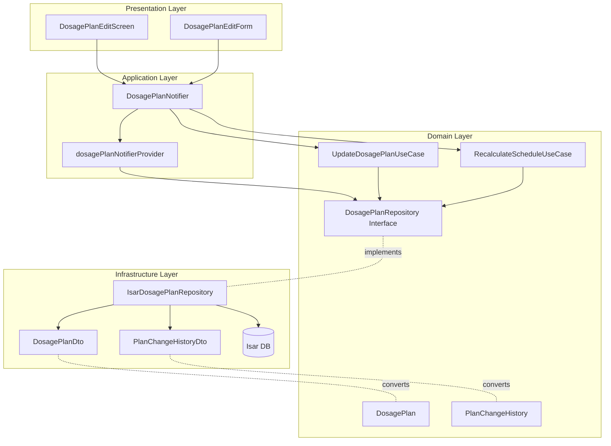

# UF-012: 투여 계획 수정 Implementation Plan

## 1. 개요

투여 계획 수정 기능을 TDD 방식으로 구현. Repository Pattern과 4-Layer Architecture를 준수하며, Phase 0→1 전환 시 Infrastructure Layer만 변경 가능하도록 설계.

### 모듈 목록

| Module | Location | Layer | Test Strategy |
|--------|----------|-------|---------------|
| DosagePlan | domain/entities/ | Domain | Unit |
| PlanChangeHistory | domain/entities/ | Domain | Unit |
| DosagePlanRepository | domain/repositories/ | Domain | Unit (Interface) |
| IsarDosagePlanRepository | infrastructure/repositories/ | Infrastructure | Integration |
| DosagePlanDto | infrastructure/dtos/ | Infrastructure | Unit |
| PlanChangeHistoryDto | infrastructure/dtos/ | Infrastructure | Unit |
| UpdateDosagePlanUseCase | domain/usecases/ | Domain | Unit |
| RecalculateScheduleUseCase | domain/usecases/ | Domain | Unit |
| DosagePlanNotifier | application/notifiers/ | Application | Integration |
| DosagePlanEditScreen | presentation/screens/ | Presentation | Widget + Acceptance |
| DosagePlanEditForm | presentation/widgets/ | Presentation | Widget |

### TDD 적용 범위
- **Unit Tests**: 모든 Entity, UseCase, Repository Interface, DTO
- **Integration Tests**: Repository 구현체, Notifier
- **Widget Tests**: Screen, Form Widget
- **Acceptance Tests**: 전체 사용자 시나리오

---

## 2. Architecture Diagram



---

## 3. Implementation Plan

### Module 1: DosagePlan Entity

**Location**: `lib/features/medication/domain/entities/dosage_plan.dart`

**Responsibility**: 투여 계획 도메인 모델

**Test Strategy**: Unit Test

**Test Scenarios (Red Phase)**:
```dart
group('DosagePlan Entity', () {
  test('should create DosagePlan with valid data', () {
    // Arrange & Act & Assert
  });

  test('should create DosagePlan with escalation plan', () {
    // Arrange & Act & Assert
  });

  test('should create DosagePlan without escalation plan', () {
    // Arrange & Act & Assert
  });

  test('should support copyWith for immutability', () {
    // Arrange & Act & Assert
  });

  test('should support equality comparison', () {
    // Arrange & Act & Assert
  });
});
```

**Implementation Order**:
1. Red: 테스트 작성 (5개 시나리오)
2. Green: 최소 구현 (필드, 생성자, copyWith, ==, hashCode)
3. Refactor: 불변성 보장, 네이밍 개선

**Dependencies**: None

---

### Module 2: PlanChangeHistory Entity

**Location**: `lib/features/medication/domain/entities/plan_change_history.dart`

**Responsibility**: 투여 계획 변경 이력 도메인 모델

**Test Strategy**: Unit Test

**Test Scenarios (Red Phase)**:
```dart
group('PlanChangeHistory Entity', () {
  test('should create PlanChangeHistory with valid data', () {
    // Arrange & Act & Assert
  });

  test('should store old and new plan snapshots', () {
    // Arrange & Act & Assert
  });

  test('should support equality comparison', () {
    // Arrange & Act & Assert
  });
});
```

**Implementation Order**:
1. Red: 테스트 작성 (3개 시나리오)
2. Green: 최소 구현
3. Refactor: 네이밍 개선

**Dependencies**: DosagePlan

---

### Module 3: DosagePlanRepository Interface

**Location**: `lib/features/medication/domain/repositories/dosage_plan_repository.dart`

**Responsibility**: 투여 계획 데이터 접근 인터페이스

**Test Strategy**: Unit Test (Mock 사용)

**Test Scenarios (Red Phase)**:
```dart
group('DosagePlanRepository Interface', () {
  test('should define getActiveDosagePlan method', () {
    // Mock Repository & Assert method exists
  });

  test('should define updateDosagePlan method', () {
    // Mock Repository & Assert method exists
  });

  test('should define savePlanChangeHistory method', () {
    // Mock Repository & Assert method exists
  });

  test('should return Future<DosagePlan?> for getActiveDosagePlan', () {
    // Type check
  });

  test('should return Future<void> for updateDosagePlan', () {
    // Type check
  });
});
```

**Implementation Order**:
1. Red: 테스트 작성 (5개 시나리오)
2. Green: Interface 선언 (abstract class, 메서드 시그니처)
3. Refactor: 메서드 네이밍, 주석 추가

**Dependencies**: DosagePlan, PlanChangeHistory

---

### Module 4: UpdateDosagePlanUseCase

**Location**: `lib/features/medication/domain/usecases/update_dosage_plan_usecase.dart`

**Responsibility**: 투여 계획 업데이트 비즈니스 로직 (변경 이력 자동 저장)

**Test Strategy**: Unit Test

**Test Scenarios (Red Phase)**:
```dart
group('UpdateDosagePlanUseCase', () {
  late MockDosagePlanRepository mockRepository;
  late UpdateDosagePlanUseCase useCase;

  test('should update dosage plan and save change history', () {
    // Arrange: Mock repository
    // Act: Execute usecase
    // Assert: Verify update and history saved
  });

  test('should handle null old plan (first time creation)', () {
    // Arrange & Act & Assert
  });

  test('should throw exception when update fails', () {
    // Arrange: Mock failure
    // Act & Assert: Expect exception
  });

  test('should save change history with correct timestamps', () {
    // Arrange & Act & Assert
  });

  test('should validate new plan before update', () {
    // Arrange: Invalid plan
    // Act & Assert: Expect validation error
  });
});
```

**Implementation Order**:
1. Red: 테스트 작성 (5개 시나리오)
2. Green: UseCase 구현 (execute 메서드, repository 호출)
3. Refactor: 에러 핸들링, 검증 로직 분리

**Dependencies**: DosagePlanRepository, DosagePlan, PlanChangeHistory

---

### Module 5: RecalculateScheduleUseCase

**Location**: `lib/features/medication/domain/usecases/recalculate_schedule_usecase.dart`

**Responsibility**: 투여 계획 변경 시 스케줄 재계산 (1초 이내)

**Test Strategy**: Unit Test

**Test Scenarios (Red Phase)**:
```dart
group('RecalculateScheduleUseCase', () {
  test('should recalculate schedules based on new plan', () {
    // Arrange: New plan with escalation
    // Act: Execute recalculation
    // Assert: Verify schedules generated correctly
  });

  test('should complete within 1 second for 1 year schedule', () {
    // Arrange: 1 year plan
    // Act: Measure execution time
    // Assert: Time < 1 second
  });

  test('should delete future schedules before recalculation', () {
    // Arrange & Act & Assert
  });

  test('should preserve past dose records', () {
    // Arrange: Past records exist
    // Act: Recalculate
    // Assert: Past records unchanged
  });

  test('should apply escalation plan correctly', () {
    // Arrange: Multi-step escalation
    // Act & Assert: Verify dose progression
  });

  test('should handle edge case of past start date', () {
    // Arrange: Start date in past
    // Act & Assert: Generate from today
  });
});
```

**Implementation Order**:
1. Red: 테스트 작성 (6개 시나리오)
2. Green: 기본 스케줄 생성 알고리즘
3. Refactor: 성능 최적화, 증량 로직 분리

**Dependencies**: DosagePlanRepository, DosagePlan, DoseSchedule

---

### Module 6: DosagePlanDto

**Location**: `lib/features/medication/infrastructure/dtos/dosage_plan_dto.dart`

**Responsibility**: Isar 저장을 위한 DTO

**Test Strategy**: Unit Test

**Test Scenarios (Red Phase)**:
```dart
group('DosagePlanDto', () {
  test('should convert from Entity to DTO', () {
    // Arrange: Entity
    // Act: DosagePlanDto.fromEntity()
    // Assert: All fields mapped correctly
  });

  test('should convert from DTO to Entity', () {
    // Arrange: DTO
    // Act: dto.toEntity()
    // Assert: All fields mapped correctly
  });

  test('should handle null escalation plan', () {
    // Arrange & Act & Assert
  });

  test('should serialize escalation plan as JSON', () {
    // Arrange: Plan with escalation
    // Act & Assert: JSON format correct
  });

  test('should deserialize escalation plan from JSON', () {
    // Arrange & Act & Assert
  });
});
```

**Implementation Order**:
1. Red: 테스트 작성 (5개 시나리오)
2. Green: DTO 클래스, 변환 메서드
3. Refactor: JSON 직렬화 로직 분리

**Dependencies**: DosagePlan, Isar

---

### Module 7: PlanChangeHistoryDto

**Location**: `lib/features/medication/infrastructure/dtos/plan_change_history_dto.dart`

**Responsibility**: 변경 이력 Isar 저장을 위한 DTO

**Test Strategy**: Unit Test

**Test Scenarios (Red Phase)**:
```dart
group('PlanChangeHistoryDto', () {
  test('should convert from Entity to DTO', () {
    // Arrange & Act & Assert
  });

  test('should convert from DTO to Entity', () {
    // Arrange & Act & Assert
  });

  test('should serialize old/new plan snapshots as JSON', () {
    // Arrange & Act & Assert
  });
});
```

**Implementation Order**:
1. Red: 테스트 작성 (3개 시나리오)
2. Green: DTO 클래스, 변환 메서드
3. Refactor: JSON 직렬화 개선

**Dependencies**: PlanChangeHistory, Isar

---

### Module 8: IsarDosagePlanRepository

**Location**: `lib/features/medication/infrastructure/repositories/isar_dosage_plan_repository.dart`

**Responsibility**: DosagePlanRepository 인터페이스의 Isar 구현체

**Test Strategy**: Integration Test

**Test Scenarios (Red Phase)**:
```dart
group('IsarDosagePlanRepository Integration', () {
  late Isar isar;
  late IsarDosagePlanRepository repository;

  setUp(() async {
    // Arrange: In-memory Isar DB
  });

  test('should get active dosage plan', () async {
    // Arrange: Save plan to DB
    // Act: repository.getActiveDosagePlan()
    // Assert: Returns correct plan
  });

  test('should return null when no active plan exists', () async {
    // Arrange & Act & Assert
  });

  test('should update dosage plan', () async {
    // Arrange: Existing plan
    // Act: repository.updateDosagePlan()
    // Assert: Plan updated in DB
  });

  test('should save plan change history', () async {
    // Arrange & Act & Assert
  });

  test('should handle transaction failure', () async {
    // Arrange: Force DB error
    // Act & Assert: Expect exception
  });

  test('should ensure only one active plan per user', () async {
    // Arrange: Multiple plans
    // Act: Update active status
    // Assert: Only one active=true
  });
});
```

**Implementation Order**:
1. Red: Integration 테스트 작성 (6개 시나리오)
2. Green: Repository 메서드 구현
3. Refactor: 트랜잭션 관리, 에러 핸들링

**Dependencies**: Isar, DosagePlanDto, PlanChangeHistoryDto, DosagePlanRepository

---

### Module 9: DosagePlanNotifier

**Location**: `lib/features/medication/application/notifiers/dosage_plan_notifier.dart`

**Responsibility**: 투여 계획 수정 상태 관리

**Test Strategy**: Integration Test

**Test Scenarios (Red Phase)**:
```dart
group('DosagePlanNotifier', () {
  late MockDosagePlanRepository mockRepository;
  late MockUpdateDosagePlanUseCase mockUseCase;
  late MockRecalculateScheduleUseCase mockRecalcUseCase;
  late ProviderContainer container;

  test('should load active dosage plan on build', () async {
    // Arrange: Mock repository
    // Act: Read notifier
    // Assert: State contains plan
  });

  test('should update dosage plan successfully', () async {
    // Arrange & Act & Assert
  });

  test('should recalculate schedule after update', () async {
    // Arrange & Act & Assert
  });

  test('should handle update failure', () async {
    // Arrange: Mock failure
    // Act & Assert: State is AsyncError
  });

  test('should emit loading state during update', () async {
    // Arrange & Act & Assert: State transitions
  });

  test('should validate plan before update', () async {
    // Arrange: Invalid plan
    // Act & Assert: Expect validation error
  });
});
```

**Implementation Order**:
1. Red: Integration 테스트 작성 (6개 시나리오)
2. Green: Notifier 구현 (build, updatePlan 메서드)
3. Refactor: 상태 전이 로직 개선, 에러 핸들링

**Dependencies**: DosagePlanRepository, UpdateDosagePlanUseCase, RecalculateScheduleUseCase, Riverpod

---

### Module 10: DosagePlanEditForm

**Location**: `lib/features/medication/presentation/widgets/dosage_plan_edit_form.dart`

**Responsibility**: 투여 계획 수정 폼 UI

**Test Strategy**: Widget Test

**Test Scenarios (Red Phase)**:
```dart
group('DosagePlanEditForm Widget', () {
  testWidgets('should display existing plan data in form fields', (tester) async {
    // Arrange: Existing plan
    // Act: Render form
    // Assert: Fields populated
  });

  testWidgets('should validate medication name field', (tester) async {
    // Arrange & Act: Enter empty name
    // Assert: Error message shown
  });

  testWidgets('should validate start date field', (tester) async {
    // Arrange & Act: Select past date
    // Assert: Warning shown
  });

  testWidgets('should validate cycle days field', (tester) async {
    // Arrange & Act: Enter invalid value
    // Assert: Error shown
  });

  testWidgets('should validate initial dose field', (tester) async {
    // Arrange & Act & Assert
  });

  testWidgets('should validate escalation plan order', (tester) async {
    // Arrange: Decreasing doses
    // Act & Assert: Error shown
  });

  testWidgets('should enable save button when form is valid', (tester) async {
    // Arrange & Act & Assert
  });

  testWidgets('should disable save button when form is invalid', (tester) async {
    // Arrange & Act & Assert
  });
});
```

**Implementation Order**:
1. Red: Widget 테스트 작성 (8개 시나리오)
2. Green: Form UI 구현 (TextFormField, validation)
3. Refactor: 검증 로직 분리, UI 개선

**Dependencies**: Flutter, FormBuilder

**QA Sheet** (수동 테스트):
- [ ] 약물명 입력 시 실시간 검증 동작
- [ ] 날짜 선택 UI 동작
- [ ] 증량 계획 추가/삭제 동작
- [ ] 저장 버튼 활성화/비활성화 전환
- [ ] 키보드 입력 반응성

---

### Module 11: DosagePlanEditScreen

**Location**: `lib/features/medication/presentation/screens/dosage_plan_edit_screen.dart`

**Responsibility**: 투여 계획 수정 화면

**Test Strategy**: Widget Test + Acceptance Test

**Test Scenarios (Red Phase - Widget)**:
```dart
group('DosagePlanEditScreen Widget', () {
  testWidgets('should show loading indicator while fetching plan', (tester) async {
    // Arrange & Act & Assert
  });

  testWidgets('should display form when plan is loaded', (tester) async {
    // Arrange & Act & Assert
  });

  testWidgets('should show confirmation dialog on save', (tester) async {
    // Arrange & Act & Assert
  });

  testWidgets('should show success message after save', (tester) async {
    // Arrange & Act & Assert
  });

  testWidgets('should show error message on save failure', (tester) async {
    // Arrange & Act & Assert
  });

  testWidgets('should navigate back after successful save', (tester) async {
    // Arrange & Act & Assert
  });
});
```

**Test Scenarios (Red Phase - Acceptance)**:
```dart
group('DosagePlanEditScreen Acceptance', () {
  testWidgets('SC-1: User successfully updates medication name', (tester) async {
    // Arrange: Navigate to screen
    // Act: Change name, save
    // Assert: Plan updated, navigation back
  });

  testWidgets('SC-2: User changes escalation plan', (tester) async {
    // Full user journey
  });

  testWidgets('SC-3: User receives warning for past start date', (tester) async {
    // Full user journey
  });

  testWidgets('SC-4: User cancels edit without saving', (tester) async {
    // Full user journey
  });
});
```

**Implementation Order**:
1. Red: Widget 테스트 작성 (6개 시나리오)
2. Red: Acceptance 테스트 작성 (4개 시나리오)
3. Green: Screen UI 구현
4. Refactor: UI/UX 개선, 애니메이션

**Dependencies**: DosagePlanEditForm, DosagePlanNotifier, GoRouter

**QA Sheet** (수동 테스트):
- [ ] 화면 진입 시 로딩 애니메이션
- [ ] 네비게이션 바 동작
- [ ] 확인 다이얼로그 표시
- [ ] 성공 메시지 스낵바 표시
- [ ] 뒤로 가기 동작
- [ ] 화면 회전 시 상태 유지

---

## 4. TDD Workflow

### Step 1: Domain Layer (Inside-Out)
1. **Start**: DosagePlan Entity 테스트 작성
2. **Red** → **Green** → **Refactor**
3. **Commit**: "test: add DosagePlan entity tests" → "feat: implement DosagePlan entity"
4. **Next**: PlanChangeHistory Entity
5. **Repeat** for all Domain entities

### Step 2: Repository Interface
1. **Start**: DosagePlanRepository 인터페이스 테스트
2. **Red** → **Green** → **Refactor**
3. **Commit**: "test: add DosagePlanRepository interface tests" → "feat: define DosagePlanRepository interface"

### Step 3: UseCases
1. **Start**: UpdateDosagePlanUseCase 테스트
2. **Red** → **Green** → **Refactor**
3. **Commit**: "test: add UpdateDosagePlanUseCase tests" → "feat: implement UpdateDosagePlanUseCase"
4. **Next**: RecalculateScheduleUseCase
5. **Repeat**

### Step 4: Infrastructure Layer
1. **Start**: DosagePlanDto 테스트
2. **Red** → **Green** → **Refactor**
3. **Commit**: "test: add DosagePlanDto tests" → "feat: implement DosagePlanDto"
4. **Next**: PlanChangeHistoryDto
5. **Next**: IsarDosagePlanRepository (Integration Tests)
6. **Commit**: "test: add IsarDosagePlanRepository integration tests" → "feat: implement IsarDosagePlanRepository"

### Step 5: Application Layer
1. **Start**: DosagePlanNotifier 테스트
2. **Red** → **Green** → **Refactor**
3. **Commit**: "test: add DosagePlanNotifier tests" → "feat: implement DosagePlanNotifier"

### Step 6: Presentation Layer (Outside-In)
1. **Start**: DosagePlanEditForm Widget 테스트
2. **Red** → **Green** → **Refactor**
3. **Commit**: "test: add DosagePlanEditForm tests" → "feat: implement DosagePlanEditForm"
4. **Next**: DosagePlanEditScreen Widget + Acceptance 테스트
5. **Commit**: "test: add DosagePlanEditScreen tests" → "feat: implement DosagePlanEditScreen"

### Step 7: End-to-End Validation
1. **Run all tests**: `flutter test`
2. **Manual QA**: QA Sheet 체크리스트 수행
3. **Performance test**: 스케줄 재계산 1초 이내 검증
4. **Commit**: "test: add end-to-end acceptance tests"

### Completion Criteria
- [ ] 모든 Unit Tests 통과 (70% 이상)
- [ ] 모든 Integration Tests 통과 (20% 이상)
- [ ] 모든 Acceptance Tests 통과 (10% 이상)
- [ ] Code Coverage > 80%
- [ ] flutter analyze 경고 0개
- [ ] 스케줄 재계산 성능 < 1초
- [ ] QA Sheet 모든 항목 PASS
- [ ] Repository Pattern 준수 확인

---

## 5. Critical Rules

### Layer Dependency
```
Presentation → Application → Domain ← Infrastructure
```
**위반 시 즉시 Refactoring**

### Repository Pattern
- Application/Presentation은 **반드시 Repository Interface** 사용
- Infrastructure 직접 참조 금지
- Phase 1 전환 시 1줄 변경만 허용

### TDD Cycle
- **Red**: 실패하는 테스트 먼저
- **Green**: 최소 구현으로 통과
- **Refactor**: 테스트 통과 유지하며 개선
- **Commit**: 각 사이클마다 커밋

### FIRST Principles
- **Fast**: 각 테스트 < 100ms
- **Independent**: 테스트 순서 무관
- **Repeatable**: 항상 같은 결과
- **Self-validating**: 명확한 Pass/Fail
- **Timely**: 코드 전에 테스트

### Performance Constraints
- 스케줄 재계산: **1초 이내** (requirements.md)
- UI 반응성: **60 FPS 유지**
