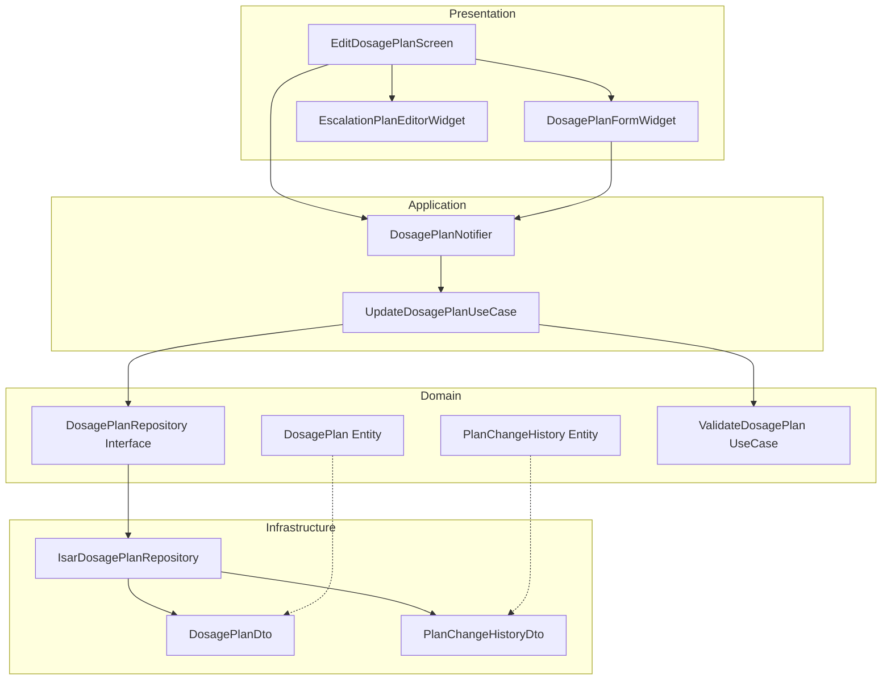

# 투여 계획 수정 구현 계획

## 1. 개요

투여 계획 수정 기능은 사용자가 온보딩 후 설정된 투여 계획을 변경할 수 있도록 지원합니다. 계획 변경 시 이력을 기록하고 투여 스케줄을 재계산합니다.

### 구현 모듈
- **Domain Layer**: Entity, Repository Interface, Business Logic
- **Application Layer**: Notifier, UseCase
- **Infrastructure Layer**: Repository Implementation, DTO
- **Presentation Layer**: Screen, Widget
- **TDD 적용 범위**: All Layers

## 2. Architecture Diagram



## 3. Implementation Plan

### Module 1: DosagePlan Entity (Domain)

**Location**: `lib/features/tracking/domain/entities/dosage_plan.dart`

**Responsibility**: 투여 계획 데이터 모델 정의

**Test Strategy**: Unit Test

**Test Scenarios**:

**Red Phase**:
```dart
// TC-1: Entity 생성 테스트
test('should create DosagePlan with required fields', () {
  // Arrange & Act
  final plan = DosagePlan(
    id: 'plan-1',
    userId: 'user-1',
    medicationName: 'Ozempic',
    startDate: DateTime(2025, 1, 1),
    cycleDays: 7,
    initialDoseMg: 0.25,
  );

  // Assert
  expect(plan.id, 'plan-1');
  expect(plan.medicationName, 'Ozempic');
  expect(plan.isActive, true);
});

// TC-2: Escalation plan 포함 Entity 생성
test('should create DosagePlan with escalation plan', () {
  // Arrange
  final escalationPlan = [
    EscalationStep(weeks: 4, doseMg: 0.5),
    EscalationStep(weeks: 8, doseMg: 1.0),
  ];

  // Act
  final plan = DosagePlan(
    id: 'plan-1',
    userId: 'user-1',
    medicationName: 'Ozempic',
    startDate: DateTime(2025, 1, 1),
    cycleDays: 7,
    initialDoseMg: 0.25,
    escalationPlan: escalationPlan,
  );

  // Assert
  expect(plan.escalationPlan, escalationPlan);
  expect(plan.escalationPlan?.length, 2);
});

// TC-3: copyWith 메서드 테스트
test('should copy DosagePlan with updated fields', () {
  // Arrange
  final originalPlan = DosagePlan(
    id: 'plan-1',
    userId: 'user-1',
    medicationName: 'Ozempic',
    startDate: DateTime(2025, 1, 1),
    cycleDays: 7,
    initialDoseMg: 0.25,
  );

  // Act
  final updatedPlan = originalPlan.copyWith(
    medicationName: 'Wegovy',
    initialDoseMg: 0.5,
  );

  // Assert
  expect(updatedPlan.medicationName, 'Wegovy');
  expect(updatedPlan.initialDoseMg, 0.5);
  expect(updatedPlan.id, originalPlan.id);
  expect(updatedPlan.cycleDays, originalPlan.cycleDays);
});
```

**Implementation Order**:
1. DosagePlan 클래스 기본 구조 작성
2. EscalationStep 클래스 작성
3. copyWith 메서드 구현
4. Equality 구현 (Equatable 사용)

**Dependencies**: None

---

### Module 2: PlanChangeHistory Entity (Domain)

**Location**: `lib/features/tracking/domain/entities/plan_change_history.dart`

**Responsibility**: 투여 계획 변경 이력 데이터 모델

**Test Strategy**: Unit Test

**Test Scenarios**:

**Red Phase**:
```dart
// TC-1: 변경 이력 Entity 생성
test('should create PlanChangeHistory with old and new plan', () {
  // Arrange & Act
  final history = PlanChangeHistory(
    id: 'history-1',
    dosagePlanId: 'plan-1',
    changedAt: DateTime(2025, 2, 1),
    oldPlan: {'initialDoseMg': 0.25},
    newPlan: {'initialDoseMg': 0.5},
  );

  // Assert
  expect(history.dosagePlanId, 'plan-1');
  expect(history.oldPlan['initialDoseMg'], 0.25);
  expect(history.newPlan['initialDoseMg'], 0.5);
});
```

**Implementation Order**:
1. PlanChangeHistory 클래스 작성
2. JSON serialization 지원

**Dependencies**: None

---

### Module 3: ValidateDosagePlan UseCase (Domain)

**Location**: `lib/features/tracking/domain/usecases/validate_dosage_plan_usecase.dart`

**Responsibility**: 투여 계획 입력값 검증 비즈니스 로직

**Test Strategy**: Unit Test

**Test Scenarios**:

**Red Phase**:
```dart
// TC-1: 유효한 투여 계획 검증
test('should return success for valid dosage plan', () {
  // Arrange
  final useCase = ValidateDosagePlanUseCase();
  final plan = DosagePlan(
    id: 'plan-1',
    userId: 'user-1',
    medicationName: 'Ozempic',
    startDate: DateTime(2025, 1, 1),
    cycleDays: 7,
    initialDoseMg: 0.25,
  );

  // Act
  final result = useCase.execute(plan);

  // Assert
  expect(result.isValid, true);
});

// TC-2: 빈 약물명 검증 실패
test('should return failure for empty medication name', () {
  // Arrange
  final useCase = ValidateDosagePlanUseCase();
  final plan = DosagePlan(
    id: 'plan-1',
    userId: 'user-1',
    medicationName: '',
    startDate: DateTime(2025, 1, 1),
    cycleDays: 7,
    initialDoseMg: 0.25,
  );

  // Act
  final result = useCase.execute(plan);

  // Assert
  expect(result.isValid, false);
  expect(result.errorMessage, contains('약물명'));
});

// TC-3: 음수 주기 검증 실패
test('should return failure for negative cycle days', () {
  // Arrange
  final useCase = ValidateDosagePlanUseCase();
  final plan = DosagePlan(
    id: 'plan-1',
    userId: 'user-1',
    medicationName: 'Ozempic',
    startDate: DateTime(2025, 1, 1),
    cycleDays: -1,
    initialDoseMg: 0.25,
  );

  // Act
  final result = useCase.execute(plan);

  // Assert
  expect(result.isValid, false);
  expect(result.errorMessage, contains('주기'));
});

// TC-4: 증량 계획 역순 검증 실패
test('should return failure for decreasing escalation plan', () {
  // Arrange
  final useCase = ValidateDosagePlanUseCase();
  final escalationPlan = [
    EscalationStep(weeks: 4, doseMg: 1.0),
    EscalationStep(weeks: 8, doseMg: 0.5),
  ];
  final plan = DosagePlan(
    id: 'plan-1',
    userId: 'user-1',
    medicationName: 'Ozempic',
    startDate: DateTime(2025, 1, 1),
    cycleDays: 7,
    initialDoseMg: 0.25,
    escalationPlan: escalationPlan,
  );

  // Act
  final result = useCase.execute(plan);

  // Assert
  expect(result.isValid, false);
  expect(result.errorMessage, contains('증량'));
});
```

**Implementation Order**:
1. ValidationResult 클래스 작성
2. ValidateDosagePlanUseCase 클래스 기본 구조
3. 각 검증 규칙 구현 (약물명, 주기, 용량, 증량 계획)

**Dependencies**: DosagePlan Entity

---

### Module 4: DosagePlanRepository Interface (Domain)

**Location**: `lib/features/tracking/domain/repositories/dosage_plan_repository.dart`

**Responsibility**: 투여 계획 저장소 인터페이스 정의

**Test Strategy**: Integration Test (구현체 테스트)

**Test Scenarios**: N/A (Interface는 구현체에서 테스트)

**Implementation Order**:
1. Repository 인터페이스 메서드 정의

**Dependencies**: DosagePlan Entity, PlanChangeHistory Entity

---

### Module 5: DosagePlanDto & PlanChangeHistoryDto (Infrastructure)

**Location**:
- `lib/features/tracking/infrastructure/dtos/dosage_plan_dto.dart`
- `lib/features/tracking/infrastructure/dtos/plan_change_history_dto.dart`

**Responsibility**: Isar 데이터베이스용 DTO 정의 및 Entity 변환

**Test Strategy**: Unit Test

**Test Scenarios**:

**Red Phase**:
```dart
// TC-1: DTO to Entity 변환
test('should convert DosagePlanDto to DosagePlan entity', () {
  // Arrange
  final dto = DosagePlanDto()
    ..id = 'plan-1'
    ..userId = 'user-1'
    ..medicationName = 'Ozempic'
    ..startDate = DateTime(2025, 1, 1)
    ..cycleDays = 7
    ..initialDoseMg = 0.25
    ..isActive = true;

  // Act
  final entity = dto.toEntity();

  // Assert
  expect(entity.id, 'plan-1');
  expect(entity.medicationName, 'Ozempic');
  expect(entity.isActive, true);
});

// TC-2: Entity to DTO 변환
test('should convert DosagePlan entity to DosagePlanDto', () {
  // Arrange
  final entity = DosagePlan(
    id: 'plan-1',
    userId: 'user-1',
    medicationName: 'Ozempic',
    startDate: DateTime(2025, 1, 1),
    cycleDays: 7,
    initialDoseMg: 0.25,
  );

  // Act
  final dto = DosagePlanDto.fromEntity(entity);

  // Assert
  expect(dto.id, 'plan-1');
  expect(dto.medicationName, 'Ozempic');
  expect(dto.isActive, true);
});

// TC-3: EscalationPlan JSON 직렬화
test('should serialize escalation plan to JSON', () {
  // Arrange
  final escalationPlan = [
    EscalationStep(weeks: 4, doseMg: 0.5),
    EscalationStep(weeks: 8, doseMg: 1.0),
  ];
  final entity = DosagePlan(
    id: 'plan-1',
    userId: 'user-1',
    medicationName: 'Ozempic',
    startDate: DateTime(2025, 1, 1),
    cycleDays: 7,
    initialDoseMg: 0.25,
    escalationPlan: escalationPlan,
  );

  // Act
  final dto = DosagePlanDto.fromEntity(entity);
  final jsonString = dto.escalationPlanJson;

  // Assert
  expect(jsonString, isNotNull);
  final decoded = jsonDecode(jsonString!);
  expect(decoded, isA<List>());
  expect(decoded.length, 2);
});
```

**Implementation Order**:
1. DosagePlanDto 클래스 작성 (Isar Collection)
2. toEntity/fromEntity 메서드 구현
3. EscalationPlan JSON 직렬화 로직
4. PlanChangeHistoryDto 동일 과정 반복

**Dependencies**: DosagePlan Entity, PlanChangeHistory Entity, Isar

---

### Module 6: IsarDosagePlanRepository (Infrastructure)

**Location**: `lib/features/tracking/infrastructure/repositories/isar_dosage_plan_repository.dart`

**Responsibility**: Isar 기반 투여 계획 저장소 구현

**Test Strategy**: Integration Test

**Test Scenarios**:

**Red Phase**:
```dart
// TC-1: 활성 투여 계획 조회
test('should get active dosage plan for user', () async {
  // Arrange
  final isar = await openTestIsar();
  final repository = IsarDosagePlanRepository(isar);
  final plan = DosagePlan(
    id: 'plan-1',
    userId: 'user-1',
    medicationName: 'Ozempic',
    startDate: DateTime(2025, 1, 1),
    cycleDays: 7,
    initialDoseMg: 0.25,
    isActive: true,
  );
  await repository.saveDosagePlan(plan);

  // Act
  final result = await repository.getActiveDosagePlan('user-1');

  // Assert
  expect(result, isNotNull);
  expect(result!.id, 'plan-1');
  expect(result.isActive, true);
});

// TC-2: 투여 계획 업데이트
test('should update dosage plan', () async {
  // Arrange
  final isar = await openTestIsar();
  final repository = IsarDosagePlanRepository(isar);
  final originalPlan = DosagePlan(
    id: 'plan-1',
    userId: 'user-1',
    medicationName: 'Ozempic',
    startDate: DateTime(2025, 1, 1),
    cycleDays: 7,
    initialDoseMg: 0.25,
  );
  await repository.saveDosagePlan(originalPlan);

  final updatedPlan = originalPlan.copyWith(
    medicationName: 'Wegovy',
    initialDoseMg: 0.5,
  );

  // Act
  await repository.updateDosagePlan(updatedPlan);
  final result = await repository.getActiveDosagePlan('user-1');

  // Assert
  expect(result!.medicationName, 'Wegovy');
  expect(result.initialDoseMg, 0.5);
});

// TC-3: 변경 이력 저장
test('should save plan change history', () async {
  // Arrange
  final isar = await openTestIsar();
  final repository = IsarDosagePlanRepository(isar);
  final history = PlanChangeHistory(
    id: 'history-1',
    dosagePlanId: 'plan-1',
    changedAt: DateTime(2025, 2, 1),
    oldPlan: {'initialDoseMg': 0.25},
    newPlan: {'initialDoseMg': 0.5},
  );

  // Act
  await repository.savePlanChangeHistory(history);
  final result = await repository.getPlanChangeHistory('plan-1');

  // Assert
  expect(result.length, 1);
  expect(result.first.oldPlan['initialDoseMg'], 0.25);
  expect(result.first.newPlan['initialDoseMg'], 0.5);
});
```

**Implementation Order**:
1. IsarDosagePlanRepository 클래스 기본 구조
2. getActiveDosagePlan 구현
3. updateDosagePlan 구현 (트랜잭션 포함)
4. savePlanChangeHistory 구현
5. getPlanChangeHistory 구현

**Dependencies**: DosagePlanRepository Interface, DosagePlanDto, PlanChangeHistoryDto, Isar

---

### Module 7: UpdateDosagePlanUseCase (Application)

**Location**: `lib/features/tracking/application/usecases/update_dosage_plan_usecase.dart`

**Responsibility**: 투여 계획 수정 로직 조율 (검증, 이력 저장, 업데이트)

**Test Strategy**: Unit Test (with Mock Repository)

**Test Scenarios**:

**Red Phase**:
```dart
// TC-1: 유효한 계획 업데이트 성공
test('should update dosage plan successfully', () async {
  // Arrange
  final mockRepository = MockDosagePlanRepository();
  final validateUseCase = ValidateDosagePlanUseCase();
  final useCase = UpdateDosagePlanUseCase(mockRepository, validateUseCase);

  final oldPlan = DosagePlan(
    id: 'plan-1',
    userId: 'user-1',
    medicationName: 'Ozempic',
    startDate: DateTime(2025, 1, 1),
    cycleDays: 7,
    initialDoseMg: 0.25,
  );

  final newPlan = oldPlan.copyWith(initialDoseMg: 0.5);

  when(mockRepository.getActiveDosagePlan('user-1'))
      .thenAnswer((_) async => oldPlan);
  when(mockRepository.updateDosagePlan(any))
      .thenAnswer((_) async => {});
  when(mockRepository.savePlanChangeHistory(any))
      .thenAnswer((_) async => {});

  // Act
  final result = await useCase.execute(oldPlan, newPlan);

  // Assert
  expect(result.isSuccess, true);
  verify(mockRepository.savePlanChangeHistory(any)).called(1);
  verify(mockRepository.updateDosagePlan(newPlan)).called(1);
});

// TC-2: 유효하지 않은 계획 업데이트 실패
test('should fail to update invalid dosage plan', () async {
  // Arrange
  final mockRepository = MockDosagePlanRepository();
  final validateUseCase = ValidateDosagePlanUseCase();
  final useCase = UpdateDosagePlanUseCase(mockRepository, validateUseCase);

  final oldPlan = DosagePlan(
    id: 'plan-1',
    userId: 'user-1',
    medicationName: 'Ozempic',
    startDate: DateTime(2025, 1, 1),
    cycleDays: 7,
    initialDoseMg: 0.25,
  );

  final newPlan = oldPlan.copyWith(medicationName: '');

  // Act
  final result = await useCase.execute(oldPlan, newPlan);

  // Assert
  expect(result.isSuccess, false);
  expect(result.errorMessage, contains('약물명'));
  verifyNever(mockRepository.updateDosagePlan(any));
  verifyNever(mockRepository.savePlanChangeHistory(any));
});
```

**Implementation Order**:
1. UpdateDosagePlanUseCase 클래스 작성
2. execute 메서드 구현 (검증 → 이력 저장 → 업데이트)
3. 에러 처리 로직

**Dependencies**: DosagePlanRepository Interface, ValidateDosagePlanUseCase

---

### Module 8: DosagePlanNotifier (Application)

**Location**: `lib/features/tracking/application/notifiers/dosage_plan_notifier.dart`

**Responsibility**: 투여 계획 상태 관리 (Riverpod)

**Test Strategy**: Unit Test (with Mock Repository & UseCase)

**Test Scenarios**:

**Red Phase**:
```dart
// TC-1: 초기 활성 계획 로드
test('should load active dosage plan on build', () async {
  // Arrange
  final mockRepository = MockDosagePlanRepository();
  final plan = DosagePlan(
    id: 'plan-1',
    userId: 'user-1',
    medicationName: 'Ozempic',
    startDate: DateTime(2025, 1, 1),
    cycleDays: 7,
    initialDoseMg: 0.25,
  );

  when(mockRepository.getActiveDosagePlan('user-1'))
      .thenAnswer((_) async => plan);

  // Act
  final container = ProviderContainer(
    overrides: [
      dosagePlanRepositoryProvider.overrideWithValue(mockRepository),
    ],
  );
  final state = await container.read(dosagePlanNotifierProvider.future);

  // Assert
  expect(state, isNotNull);
  expect(state!.id, 'plan-1');
});

// TC-2: 투여 계획 업데이트 호출
test('should update dosage plan and refresh state', () async {
  // Arrange
  final mockRepository = MockDosagePlanRepository();
  final mockUseCase = MockUpdateDosagePlanUseCase();

  final oldPlan = DosagePlan(
    id: 'plan-1',
    userId: 'user-1',
    medicationName: 'Ozempic',
    startDate: DateTime(2025, 1, 1),
    cycleDays: 7,
    initialDoseMg: 0.25,
  );

  final newPlan = oldPlan.copyWith(initialDoseMg: 0.5);

  when(mockRepository.getActiveDosagePlan('user-1'))
      .thenAnswer((_) async => oldPlan)
      .thenAnswer((_) async => newPlan);

  when(mockUseCase.execute(oldPlan, newPlan))
      .thenAnswer((_) async => UpdateResult.success());

  // Act
  final container = ProviderContainer(
    overrides: [
      dosagePlanRepositoryProvider.overrideWithValue(mockRepository),
      updateDosagePlanUseCaseProvider.overrideWithValue(mockUseCase),
    ],
  );

  final notifier = container.read(dosagePlanNotifierProvider.notifier);
  await notifier.updatePlan(oldPlan, newPlan);

  // Assert
  final state = await container.read(dosagePlanNotifierProvider.future);
  expect(state!.initialDoseMg, 0.5);
});
```

**Implementation Order**:
1. DosagePlanNotifier 클래스 작성 (AsyncNotifier 상속)
2. build 메서드 구현 (초기 로드)
3. updatePlan 메서드 구현
4. 에러 상태 처리

**Dependencies**: DosagePlanRepository, UpdateDosagePlanUseCase

---

### Module 9: DosagePlanFormWidget (Presentation)

**Location**: `lib/features/tracking/presentation/widgets/dosage_plan_form_widget.dart`

**Responsibility**: 투여 계획 입력 폼 UI

**Test Strategy**: Widget Test

**Test Scenarios**:

**Red Phase**:
```dart
// TC-1: 폼 렌더링 및 초기값 표시
testWidgets('should display form with initial values', (tester) async {
  // Arrange
  final plan = DosagePlan(
    id: 'plan-1',
    userId: 'user-1',
    medicationName: 'Ozempic',
    startDate: DateTime(2025, 1, 1),
    cycleDays: 7,
    initialDoseMg: 0.25,
  );

  // Act
  await tester.pumpWidget(
    MaterialApp(
      home: Scaffold(
        body: DosagePlanFormWidget(initialPlan: plan),
      ),
    ),
  );

  // Assert
  expect(find.text('Ozempic'), findsOneWidget);
  expect(find.text('7'), findsOneWidget);
  expect(find.text('0.25'), findsOneWidget);
});

// TC-2: 실시간 검증 피드백 표시
testWidgets('should show validation error for empty medication name', (tester) async {
  // Arrange & Act
  await tester.pumpWidget(
    MaterialApp(
      home: Scaffold(
        body: DosagePlanFormWidget(),
      ),
    ),
  );

  await tester.enterText(find.byKey(Key('medication_name_field')), '');
  await tester.pump();

  // Assert
  expect(find.text('약물명을 입력하세요'), findsOneWidget);
});
```

**Implementation Order**:
1. DosagePlanFormWidget 기본 구조
2. TextFormField 위젯 작성
3. 실시간 검증 로직 연결
4. FormKey 관리

**Dependencies**: None

---

### Module 10: EditDosagePlanScreen (Presentation)

**Location**: `lib/features/tracking/presentation/screens/edit_dosage_plan_screen.dart`

**Responsibility**: 투여 계획 수정 화면

**Test Strategy**: Widget Test + QA Sheet

**Test Scenarios**:

**Red Phase**:
```dart
// TC-1: 화면 렌더링 및 로딩 상태
testWidgets('should show loading indicator while fetching plan', (tester) async {
  // Arrange
  final container = ProviderContainer(
    overrides: [
      dosagePlanNotifierProvider.overrideWith(
        (ref) => AsyncValue.loading(),
      ),
    ],
  );

  // Act
  await tester.pumpWidget(
    UncontrolledProviderScope(
      container: container,
      child: MaterialApp(home: EditDosagePlanScreen()),
    ),
  );

  // Assert
  expect(find.byType(CircularProgressIndicator), findsOneWidget);
});

// TC-2: 저장 버튼 클릭 및 성공 메시지
testWidgets('should save plan and show success message', (tester) async {
  // Arrange
  final mockNotifier = MockDosagePlanNotifier();
  final plan = DosagePlan(
    id: 'plan-1',
    userId: 'user-1',
    medicationName: 'Ozempic',
    startDate: DateTime(2025, 1, 1),
    cycleDays: 7,
    initialDoseMg: 0.25,
  );

  when(mockNotifier.build()).thenAnswer((_) async => plan);
  when(mockNotifier.updatePlan(any, any)).thenAnswer((_) async => {});

  final container = ProviderContainer(
    overrides: [
      dosagePlanNotifierProvider.overrideWith((ref) => mockNotifier),
    ],
  );

  // Act
  await tester.pumpWidget(
    UncontrolledProviderScope(
      container: container,
      child: MaterialApp(home: EditDosagePlanScreen()),
    ),
  );
  await tester.pumpAndSettle();

  await tester.enterText(find.byKey(Key('medication_name_field')), 'Wegovy');
  await tester.tap(find.byKey(Key('save_button')));
  await tester.pumpAndSettle();

  // Assert
  expect(find.text('투여 계획이 수정되었습니다'), findsOneWidget);
});
```

**Implementation Order**:
1. EditDosagePlanScreen Scaffold 구조
2. Consumer/ConsumerWidget 연결
3. DosagePlanFormWidget 통합
4. 저장 버튼 및 확인 다이얼로그
5. 성공/실패 스낵바

**Dependencies**: DosagePlanNotifier, DosagePlanFormWidget

**QA Sheet**:
- [ ] 설정 메뉴에서 "투여 계획 수정" 선택 시 화면 이동
- [ ] 기존 투여 계획 정보가 폼에 자동 입력됨
- [ ] 약물명 필드 빈 값 입력 시 에러 메시지 표시
- [ ] 주기 필드 음수 입력 시 에러 메시지 표시
- [ ] 증량 계획 역순 입력 시 에러 메시지 표시
- [ ] 저장 버튼 클릭 시 확인 다이얼로그 표시
- [ ] 확인 선택 시 저장 완료 메시지 표시
- [ ] 저장 후 설정 화면으로 복귀
- [ ] 네트워크 오류 시 재시도 옵션 표시

## 4. TDD Workflow

### 시작점
1. **DosagePlan Entity** 테스트 작성 (Red)
2. Entity 구현 (Green)
3. Refactor (필요 시)

### 진행 순서
1. Domain Layer 완성 (Entity → UseCase → Repository Interface)
2. Infrastructure Layer 완성 (DTO → Repository Implementation)
3. Application Layer 완성 (UseCase → Notifier)
4. Presentation Layer 완성 (Widget → Screen)

### Commit 포인트
- [ ] Domain Layer 테스트 통과 (Entity + UseCase)
- [ ] Infrastructure Layer 테스트 통과 (DTO + Repository)
- [ ] Application Layer 테스트 통과 (UseCase + Notifier)
- [ ] Presentation Layer 테스트 통과 (Widget + Screen)
- [ ] QA Sheet 완료

### 완료 조건
- 모든 Unit Test 통과 (Coverage > 80%)
- 모든 Widget Test 통과
- QA Sheet 항목 통과
- flutter analyze 경고 없음
- 1초 이내 스케줄 재계산 (성능 요구사항)
