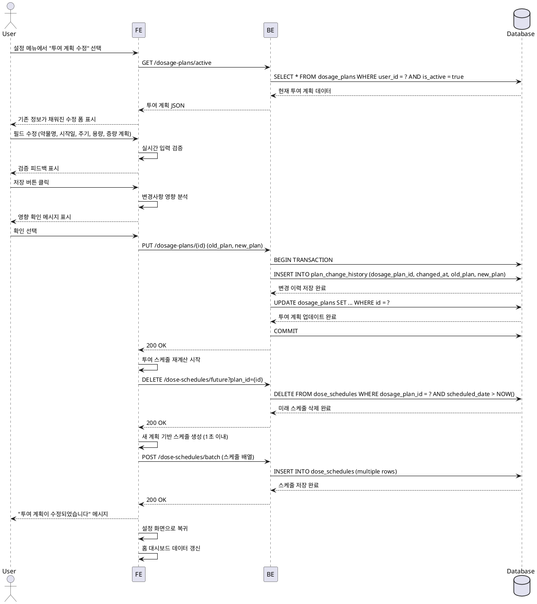

# UF-009: 투여 계획 수정 상세 유스케이스

## Primary Actor
GLP-1 사용자

## Precondition
- 사용자가 로그인된 상태
- 초기 투여 계획이 온보딩 단계에서 설정되어 있음
- 현재 활성화된 투여 계획이 존재함

## Trigger
사용자가 설정 메뉴에서 "투여 계획 수정" 메뉴를 선택

## Main Scenario

### 1. 투여 계획 수정 화면 진입
- 사용자가 설정 메뉴에서 "투여 계획 수정"을 선택
- FE는 현재 활성화된 투여 계획 정보 요청
- BE는 dosage_plans 테이블에서 (user_id, is_active=true) 조건으로 현재 계획 조회
- FE는 기존 정보가 채워진 수정 폼 표시 (약물명, 시작일, 주기, 초기 용량, 증량 계획)

### 2. 사용자 입력 및 검증
- 사용자가 하나 이상의 필드를 수정
- FE는 각 필드에 대해 실시간 검증 수행:
  - 약물명: 비어있지 않은지 확인
  - 시작일: 날짜 형식 유효성 확인 (과거 날짜 시 경고 표시하되 허용)
  - 주기: 양수 값 확인
  - 초기 용량: 양수 값 확인
  - 증량 계획: 용량이 논리적 순서로 증가하는지 확인

### 3. 영향 분석 및 확인
- 사용자가 저장 버튼 클릭
- FE는 변경사항이 기존 투여 기록에 미치는 영향 분석
- FE는 영향 확인 메시지 표시: "투여 계획 변경 시 이후 스케줄이 재계산됩니다. 진행하시겠습니까?"
- 사용자가 확인 선택

### 4. 계획 변경 저장
- FE는 변경 전 계획과 변경 후 계획을 BE에 전송
- BE는 트랜잭션 시작
- BE는 plan_change_history 테이블에 변경 이력 삽입 (dosage_plan_id, changed_at, old_plan, new_plan)
- BE는 dosage_plans 테이블에서 해당 계획 업데이트 (medication_name, start_date, cycle_days, initial_dose_mg, escalation_plan, updated_at)
- BE는 트랜잭션 커밋

### 5. 투여 스케줄 재계산
- FE는 스케줄 재계산 로직 실행
- FE는 변경된 계획 기준으로 dose_schedules 재생성:
  - 기존 dose_schedules 중 미래 일정 삭제
  - 새 계획 기반으로 전체 스케줄 재생성
  - 증량 계획 반영
  - 1초 이내 완료
- FE는 재계산된 스케줄을 BE에 저장

### 6. 완료 및 복귀
- FE는 "투여 계획이 수정되었습니다" 확인 메시지 표시
- FE는 설정 화면으로 복귀
- 홈 대시보드의 다음 예정 일정 자동 갱신

## Edge Cases

### EC-1: 과거 시작일로 변경
- 시작일이 과거 날짜로 변경되는 경우
- FE는 경고 메시지 표시: "시작일이 과거 날짜입니다. 계속하시겠습니까?"
- 사용자 확인 후 진행 허용

### EC-2: 진행 중인 증량 계획 변경
- 이미 일부 증량이 진행된 상태에서 증량 계획 변경
- FE는 영향 범위 명확히 안내: "현재 N주차 진행 중입니다. 변경 시 이후 증량 일정이 조정됩니다."
- 사용자 확인 후 진행

### EC-3: 주기 변경으로 인한 기록 불일치
- 투여 주기 변경으로 기존 투여 기록과 새 스케줄이 불일치
- 기존 dose_records는 유지 (과거 기록 보존)
- 스케줄만 재계산하여 미래 일정 조정
- FE는 안내 메시지: "기존 투여 기록은 유지되며, 이후 스케줄만 조정됩니다."

### EC-4: 저장 중 앱 종료
- 저장 프로세스 진행 중 앱 비정상 종료
- BE 트랜잭션 롤백으로 데이터 일관성 유지
- 다음 실행 시 변경사항 폐기, 기존 계획 유지

### EC-5: 증량 계획 대폭 변경
- 증량 속도나 최종 용량이 크게 변경되는 경우
- FE는 안전성 경고 표시: "용량 변경이 큽니다. 의료진과 상담 후 진행하세요."
- 사용자 확인 후 진행 허용

### EC-6: 변경사항 없이 저장
- 사용자가 아무 값도 변경하지 않고 저장 버튼 클릭
- FE는 변경사항 없음을 감지하고 즉시 설정 화면으로 복귀
- 불필요한 DB 업데이트 방지

### EC-7: 네트워크 오류
- 저장 요청 중 네트워크 오류 발생
- FE는 로컬에 변경사항 임시 저장
- 재시도 옵션 제공
- 연결 복구 시 자동 재시도 (최대 3회)

## Business Rules

### BR-1: 증량 계획 논리적 검증
- 증량 계획의 용량은 항상 이전 용량보다 크거나 같아야 함
- 감량 또는 역순은 에러로 처리

### BR-2: 활성 계획 단일성
- 사용자는 항상 하나의 활성 투여 계획만 가질 수 있음
- is_active=true인 계획은 사용자당 1개만 존재

### BR-3: 변경 이력 필수 기록
- 모든 투여 계획 변경은 plan_change_history에 기록되어야 함
- 추적성 보장을 위해 변경 전후 상태 모두 저장

### BR-4: 과거 기록 불가역성
- 이미 완료된 dose_records는 투여 계획 변경과 무관하게 유지
- 스케줄 재계산은 현재 시점 이후만 적용

### BR-5: 스케줄 재계산 성능
- 스케줄 재계산은 1초 이내 완료되어야 함
- 대용량 데이터 처리 시에도 사용자 대기 시간 최소화

### BR-6: 트랜잭션 원자성
- 투여 계획 업데이트와 변경 이력 저장은 하나의 트랜잭션으로 처리
- 일부만 성공하는 경우 전체 롤백

## Sequence Diagram

