# 과거 기록 수정/삭제 (UF-011) Implementation Plan

## 1. 개요

과거 기록 수정/삭제 기능은 사용자가 잘못 입력하거나 변경이 필요한 체중, 증상, 투여 기록을 수정하거나 삭제할 수 있는 기능. 기록 변경 시 관련 통계와 인사이트를 자동으로 재계산하여 데이터 일관성 유지. 4-Layer Architecture + Repository Pattern + TDD 적용.

**모듈 구조:**
- **Domain Layer**: 기록 수정 검증 로직, 통계 재계산 트리거 UseCase, 감사 추적 UseCase, Repository Interface
- **Application Layer**: RecordEditNotifier (AsyncNotifier), 통계 재계산 오케스트레이션
- **Infrastructure Layer**: Repository 구현체 (IsarTrackingRepository, IsarMedicationRepository, IsarAuditRepository)
- **Presentation Layer**: RecordEditDialog (날짜 수정 포함), RecordDeleteDialog, 기록 목록 화면 수정

**TDD 적용 범위:**
- Domain UseCase: Unit Test 100%
- Application Notifier: Integration Test 주요 시나리오
- Presentation: Widget Test + Acceptance Test

---

## 2. Architecture Diagram

```mermaid
graph TD
    %% Presentation Layer
    RecordListScreen[RecordListScreen<br/>체중/증상/투여 기록 목록]
    RecordDetailSheet[RecordDetailSheet<br/>기록 상세 바텀시트]
    WeightEditDialog[WeightEditDialog]
    SymptomEditDialog[SymptomEditDialog]
    DoseEditDialog[DoseEditDialog]
    RecordDeleteDialog[RecordDeleteDialog]

    %% Application Layer
    WeightRecordEditNotifier[WeightRecordEditNotifier<br/>AsyncNotifierProvider]
    SymptomRecordEditNotifier[SymptomRecordEditNotifier<br/>AsyncNotifierProvider]
    DoseRecordEditNotifier[DoseRecordEditNotifier<br/>AsyncNotifierProvider]
    RecalculateStatisticsNotifier[RecalculateStatisticsNotifier<br/>AsyncNotifierProvider]

    %% Domain Layer
    ValidateWeightEditUseCase[ValidateWeightEditUseCase]
    ValidateSymptomEditUseCase[ValidateSymptomEditUseCase]
    ValidateDateUniqueConstraintUseCase[ValidateDateUniqueConstraintUseCase]
    RecalculateDashboardStatisticsUseCase[RecalculateDashboardStatisticsUseCase]
    RecalculateContinuousRecordDaysUseCase[RecalculateContinuousRecordDaysUseCase]
    RecalculateBadgeProgressUseCase[RecalculateBadgeProgressUseCase]
    LogRecordChangeUseCase[LogRecordChangeUseCase]

    %% Domain Layer - Repository Interfaces
    TrackingRepository[TrackingRepository<br/>Interface]
    MedicationRepository[MedicationRepository<br/>Interface]
    DashboardRepository[DashboardRepository<br/>Interface]
    BadgeRepository[BadgeRepository<br/>Interface]
    AuditRepository[AuditRepository<br/>Interface]

    %% Dependencies
    RecordListScreen --> RecordDetailSheet
    RecordDetailSheet --> WeightEditDialog
    RecordDetailSheet --> SymptomEditDialog
    RecordDetailSheet --> DoseEditDialog
    RecordDetailSheet --> RecordDeleteDialog

    WeightEditDialog --> WeightRecordEditNotifier
    SymptomEditDialog --> SymptomRecordEditNotifier
    DoseEditDialog --> DoseRecordEditNotifier
    RecordDeleteDialog --> WeightRecordEditNotifier
    RecordDeleteDialog --> SymptomRecordEditNotifier
    RecordDeleteDialog --> DoseRecordEditNotifier

    WeightRecordEditNotifier --> TrackingRepository
    WeightRecordEditNotifier --> ValidateWeightEditUseCase
    WeightRecordEditNotifier --> ValidateDateUniqueConstraintUseCase
    WeightRecordEditNotifier --> RecalculateStatisticsNotifier

    SymptomRecordEditNotifier --> TrackingRepository
    SymptomRecordEditNotifier --> ValidateSymptomEditUseCase
    SymptomRecordEditNotifier --> RecalculateStatisticsNotifier

    DoseRecordEditNotifier --> MedicationRepository
    DoseRecordEditNotifier --> RecalculateStatisticsNotifier

    RecalculateStatisticsNotifier --> RecalculateDashboardStatisticsUseCase
    RecalculateStatisticsNotifier --> RecalculateContinuousRecordDaysUseCase
    RecalculateStatisticsNotifier --> RecalculateBadgeProgressUseCase
    RecalculateStatisticsNotifier --> DashboardRepository
    RecalculateStatisticsNotifier --> BadgeRepository

    ValidateDateUniqueConstraintUseCase --> TrackingRepository

    WeightRecordEditNotifier --> LogRecordChangeUseCase
    SymptomRecordEditNotifier --> LogRecordChangeUseCase
    DoseRecordEditNotifier --> LogRecordChangeUseCase

    LogRecordChangeUseCase --> AuditRepository
```



---

## 3. Domain Layer - Repository Interfaces

**Location**: `lib/features/{feature}/domain/repositories/`

**Purpose**: Repository 인터페이스 정의 (Domain Layer에 위치, Infrastructure Layer에서 구현)

### TrackingRepository Interface
```dart
abstract class TrackingRepository {
  // 체중 기록
  Future<WeightLog?> getWeightLog(String id);
  Future<WeightLog?> getWeightLogByDate(String userId, DateTime date);
  Future<List<WeightLog>> getWeightLogs(String userId);
  Future<void> updateWeightLog(String id, double weightKg);
  Future<void> deleteWeightLog(String id);

  // 증상 기록 (연쇄 삭제 명시)
  Future<SymptomLog?> getSymptomLog(String id);
  Future<List<SymptomLog>> getSymptomLogs(String userId);
  Future<void> updateSymptomLog(String id, SymptomLog updatedLog);
  /// 증상 기록 삭제 시 연관된 컨텍스트 태그, 피드백도 함께 삭제
  Future<void> deleteSymptomLog(String id, {bool cascade = true});
}
```

### MedicationRepository Interface
```dart
abstract class MedicationRepository {
  Future<DoseRecord?> getDoseRecord(String id);
  Future<List<DoseRecord>> getDoseRecords(DosagePlanQuery query);
  Future<void> updateDoseRecord(String id, double doseMg, String injectionSite, String? note);
  Future<void> deleteDoseRecord(String id);
}
```

### DashboardRepository Interface
```dart
abstract class DashboardRepository {
  Future<DashboardData> getDashboardData(String userId);
  Future<void> updateWeeklyProgress(String userId, WeeklyProgress progress);
  Future<void> updateContinuousRecordDays(String userId, int days);
  Future<void> updateWeeklySummary(String userId, WeeklySummary summary);
}
```

### BadgeRepository Interface
```dart
abstract class BadgeRepository {
  Future<List<UserBadge>> getUserBadges(String userId);
  Future<UserBadge?> getUserBadge(String userId, String badgeId);
  Future<void> updateBadgeProgress(String userId, String badgeId, int percentage);
  Future<void> achieveBadge(String userId, String badgeId);
}
```

### AuditRepository Interface
```dart
abstract class AuditRepository {
  Future<void> logChange(AuditLog log);
  Future<List<AuditLog>> getChangeLogs(String userId, String recordId);
}
```

---

## 4. Implementation Plan

### 4.1 Domain Layer - Validation UseCases

**Location**: `lib/features/tracking/domain/usecases/`

**Responsibility**: 기록 수정/삭제 시 비즈니스 규칙 검증

**Test Strategy**: Unit Test (AAA Pattern)

**Test Scenarios (Red Phase):**

#### ValidateWeightEditUseCase
```dart
group('ValidateWeightEditUseCase', () {
  late ValidateWeightEditUseCase useCase;

  setUp(() {
    useCase = ValidateWeightEditUseCase();
  });

  // Arrange & Act & Assert
  test('should return success for valid weight in range 20-300kg', () {
    // Arrange
    final weight = 70.5;

    // Act
    final result = useCase.execute(weight);

    // Assert
    expect(result.isSuccess, true);
  });

  test('should return error for weight below 20kg', () {
    final result = useCase.execute(19.9);
    expect(result.isFailure, true);
    expect(result.error, contains('20kg'));
  });

  test('should return error for weight above 300kg', () {
    final result = useCase.execute(300.1);
    expect(result.isFailure, true);
    expect(result.error, contains('300kg'));
  });

  test('should return error for negative weight', () {
    final result = useCase.execute(-5.0);
    expect(result.isFailure, true);
  });

  test('should return error for zero weight', () {
    final result = useCase.execute(0.0);
    expect(result.isFailure, true);
  });

  test('should return warning for weight < 30kg but >= 20kg', () {
    final result = useCase.execute(25.0);
    expect(result.isSuccess, true);
    expect(result.warning, isNotNull);
  });

  test('should return warning for weight > 200kg but <= 300kg', () {
    final result = useCase.execute(250.0);
    expect(result.isSuccess, true);
    expect(result.warning, isNotNull);
  });
});
```

#### ValidateSymptomEditUseCase
```dart
group('ValidateSymptomEditUseCase', () {
  late ValidateSymptomEditUseCase useCase;

  setUp(() {
    useCase = ValidateSymptomEditUseCase();
  });

  test('should return success for severity in range 1-10', () {
    final result = useCase.execute(severity: 5, symptomName: '메스꺼움');
    expect(result.isSuccess, true);
  });

  test('should return error for severity below 1', () {
    final result = useCase.execute(severity: 0, symptomName: '메스꺼움');
    expect(result.isFailure, true);
  });

  test('should return error for severity above 10', () {
    final result = useCase.execute(severity: 11, symptomName: '메스꺼움');
    expect(result.isFailure, true);
  });

  test('should return error for empty symptom name', () {
    final result = useCase.execute(severity: 5, symptomName: '');
    expect(result.isFailure, true);
  });

  test('should validate symptom name from predefined list', () {
    final validSymptoms = ['메스꺼움', '구토', '변비', '설사', '복통', '두통', '피로'];
    for (var symptom in validSymptoms) {
      final result = useCase.execute(severity: 5, symptomName: symptom);
      expect(result.isSuccess, true);
    }
  });

  test('should allow custom symptom names (not in predefined list)', () {
    final result = useCase.execute(severity: 5, symptomName: '커스텀증상');
    expect(result.isSuccess, true);
  });
});
```

#### ValidateDateUniqueConstraintUseCase
```dart
group('ValidateDateUniqueConstraintUseCase', () {
  late ValidateDateUniqueConstraintUseCase useCase;
  late MockTrackingRepository mockRepository;

  setUp(() {
    mockRepository = MockTrackingRepository();
    useCase = ValidateDateUniqueConstraintUseCase(mockRepository);
  });

  test('should return success when date is available for new weight log', () async {
    // Arrange
    final date = DateTime(2025, 1, 1);
    final userId = 'user123';
    when(() => mockRepository.getWeightLogByDate(userId, date))
        .thenAnswer((_) async => null);

    // Act
    final result = await useCase.execute(userId: userId, date: date);

    // Assert
    expect(result.isSuccess, true);
  });

  test('should return conflict when date already has weight log', () async {
    final date = DateTime(2025, 1, 1);
    final userId = 'user123';
    final existingLog = WeightLog(
      id: 'log1',
      userId: userId,
      logDate: date,
      weightKg: 70.0,
      createdAt: DateTime.now(),
    );
    when(() => mockRepository.getWeightLogByDate(userId, date))
        .thenAnswer((_) async => existingLog);

    final result = await useCase.execute(userId: userId, date: date);

    expect(result.isConflict, true);
    expect(result.existingRecordId, 'log1');
  });

  test('should allow same date when editing existing record', () async {
    final date = DateTime(2025, 1, 1);
    final userId = 'user123';
    final recordId = 'log1';
    final existingLog = WeightLog(
      id: recordId,
      userId: userId,
      logDate: date,
      weightKg: 70.0,
      createdAt: DateTime.now(),
    );
    when(() => mockRepository.getWeightLogByDate(userId, date))
        .thenAnswer((_) async => existingLog);

    final result = await useCase.execute(
      userId: userId,
      date: date,
      editingRecordId: recordId,
    );

    expect(result.isSuccess, true);
  });

  test('should return error for future date', () async {
    final futureDate = DateTime.now().add(Duration(days: 1));
    final result = await useCase.execute(
      userId: 'user123',
      date: futureDate,
    );

    expect(result.isFailure, true);
    expect(result.error, contains('미래 날짜'));
  });
});
```

#### LogRecordChangeUseCase (감사 추적)
```dart
group('LogRecordChangeUseCase', () {
  late LogRecordChangeUseCase useCase;
  late MockAuditRepository mockAuditRepo;

  setUp(() {
    mockAuditRepo = MockAuditRepository();
    useCase = LogRecordChangeUseCase(mockAuditRepo);
  });

  test('should log weight record update', () async {
    final auditLog = AuditLog(
      id: 'audit1',
      userId: 'user123',
      recordId: 'log1',
      recordType: 'weight',
      changeType: 'update',
      oldValue: {'weightKg': 70.0},
      newValue: {'weightKg': 68.5},
      timestamp: DateTime.now(),
    );

    when(() => mockAuditRepo.logChange(auditLog))
        .thenAnswer((_) async => {});

    await useCase.execute(auditLog);

    verify(() => mockAuditRepo.logChange(auditLog)).called(1);
  });

  test('should log record deletion', () async {
    final auditLog = AuditLog(
      id: 'audit2',
      userId: 'user123',
      recordId: 'log1',
      recordType: 'weight',
      changeType: 'delete',
      oldValue: {'weightKg': 70.0, 'logDate': '2025-01-01'},
      newValue: null,
      timestamp: DateTime.now(),
    );

    await useCase.execute(auditLog);

    verify(() => mockAuditRepo.logChange(auditLog)).called(1);
  });
});
```

**Implementation Order (TDD):**
1. ValidateWeightEditUseCase
2. ValidateSymptomEditUseCase
3. ValidateDateUniqueConstraintUseCase
4. LogRecordChangeUseCase

**Dependencies**: Repository Interface (Domain)

---

### 4.2 Domain Layer - Statistics Recalculation UseCases

**Location**: `lib/features/dashboard/domain/usecases/`

**Responsibility**: 기록 변경 시 영향받는 통계 재계산

**Test Strategy**: Unit Test

**Test Scenarios (Red Phase):**

#### RecalculateDashboardStatisticsUseCase
```dart
group('RecalculateDashboardStatisticsUseCase', () {
  late RecalculateDashboardStatisticsUseCase useCase;
  late MockTrackingRepository mockTrackingRepo;
  late MockMedicationRepository mockMedicationRepo;
  late MockProfileRepository mockProfileRepo;

  setUp(() {
    mockTrackingRepo = MockTrackingRepository();
    mockMedicationRepo = MockMedicationRepository();
    mockProfileRepo = MockProfileRepository();
    useCase = RecalculateDashboardStatisticsUseCase(
      trackingRepository: mockTrackingRepo,
      medicationRepository: mockMedicationRepo,
      profileRepository: mockProfileRepo,
    );
  });

  test('should recalculate weekly progress after weight log change', () async {
    // Arrange
    final userId = 'user123';
    final weights = [
      WeightLog(id: '1', userId: userId, logDate: DateTime.now(), weightKg: 70.0, createdAt: DateTime.now()),
      WeightLog(id: '2', userId: userId, logDate: DateTime.now().subtract(Duration(days: 1)), weightKg: 71.0, createdAt: DateTime.now()),
    ];
    when(() => mockTrackingRepo.getWeightLogs(userId))
        .thenAnswer((_) async => weights);
    when(() => mockProfileRepo.getUserProfile(userId))
        .thenAnswer((_) async => UserProfile(
          userId: userId,
          targetWeightKg: 65.0,
          weeklyWeightRecordGoal: 7,
          weeklySymptomRecordGoal: 7,
        ));

    // Act
    final result = await useCase.execute(userId);

    // Assert
    expect(result.weeklyProgress.weightRecordCount, 2);
    expect(result.weeklyProgress.weightTargetCount, 7);
  });

  test('should recalculate continuous record days after deletion', () async {
    final userId = 'user123';
    final weights = [
      WeightLog(id: '1', userId: userId, logDate: DateTime.now(), weightKg: 70.0, createdAt: DateTime.now()),
      // Gap exists (yesterday missing)
      WeightLog(id: '2', userId: userId, logDate: DateTime.now().subtract(Duration(days: 2)), weightKg: 71.0, createdAt: DateTime.now()),
    ];
    when(() => mockTrackingRepo.getWeightLogs(userId))
        .thenAnswer((_) async => weights);
    when(() => mockTrackingRepo.getSymptomLogs(userId))
        .thenAnswer((_) async => []);

    final result = await useCase.execute(userId);

    expect(result.continuousRecordDays, 1); // Gap caused by deletion
  });

  test('should handle empty records after deletion', () async {
    final userId = 'user123';
    when(() => mockTrackingRepo.getWeightLogs(userId))
        .thenAnswer((_) async => []);
    when(() => mockTrackingRepo.getSymptomLogs(userId))
        .thenAnswer((_) async => []);
    when(() => mockMedicationRepo.getDoseRecords(any()))
        .thenAnswer((_) async => []);

    final result = await useCase.execute(userId);

    expect(result.continuousRecordDays, 0);
    expect(result.weeklyProgress.weightRecordCount, 0);
  });
});
```

#### RecalculateBadgeProgressUseCase
```dart
group('RecalculateBadgeProgressUseCase', () {
  late RecalculateBadgeProgressUseCase useCase;
  late MockBadgeRepository mockBadgeRepo;
  late MockTrackingRepository mockTrackingRepo;

  setUp(() {
    mockBadgeRepo = MockBadgeRepository();
    mockTrackingRepo = MockTrackingRepository();
    useCase = RecalculateBadgeProgressUseCase(
      badgeRepository: mockBadgeRepo,
      trackingRepository: mockTrackingRepo,
    );
  });

  test('should update "연속 7일 기록" badge progress after edit', () async {
    final userId = 'user123';
    final continuousDays = 5;
    final badge = UserBadge(
      id: 'badge1',
      userId: userId,
      badgeId: 'streak_7',
      status: 'in_progress',
      progressPercentage: 50,
      achievedAt: null,
    );
    when(() => mockBadgeRepo.getUserBadge(userId, 'streak_7'))
        .thenAnswer((_) async => badge);

    final result = await useCase.execute(
      userId: userId,
      badgeId: 'streak_7',
      currentValue: continuousDays,
      targetValue: 7,
    );

    expect(result.progressPercentage, 71); // 5/7 = 71%
    expect(result.status, 'in_progress');
    verify(() => mockBadgeRepo.updateBadgeProgress(userId, 'streak_7', 71)).called(1);
  });

  test('should mark badge as achieved when condition met', () async {
    final userId = 'user123';
    final continuousDays = 7;

    final result = await useCase.execute(
      userId: userId,
      badgeId: 'streak_7',
      currentValue: continuousDays,
      targetValue: 7,
    );

    expect(result.progressPercentage, 100);
    expect(result.status, 'achieved');
    verify(() => mockBadgeRepo.achieveBadge(userId, 'streak_7')).called(1);
  });

  test('should downgrade achieved badge if condition no longer met after deletion', () async {
    final userId = 'user123';
    final badge = UserBadge(
      id: 'badge1',
      userId: userId,
      badgeId: 'streak_7',
      status: 'achieved',
      progressPercentage: 100,
      achievedAt: DateTime.now(),
    );
    when(() => mockBadgeRepo.getUserBadge(userId, 'streak_7'))
        .thenAnswer((_) async => badge);

    final result = await useCase.execute(
      userId: userId,
      badgeId: 'streak_7',
      currentValue: 5, // Dropped to 5 after deletion
      targetValue: 7,
    );

    expect(result.status, 'in_progress');
    expect(result.progressPercentage, 71);
    expect(result.achievedAt, null);
  });
});
```

**Implementation Order:**
1. RecalculateDashboardStatisticsUseCase
2. RecalculateBadgeProgressUseCase

**Dependencies**: Repository Interfaces, Dashboard Entities

---

### 4.3 Application Layer - Record Edit Notifiers

**Location**: `lib/features/tracking/application/notifiers/`

**Responsibility**: 기록 수정/삭제 상태 관리 및 검증 오케스트레이션

**Test Strategy**: Integration Test (Mock Repository)

**Test Scenarios (Red Phase):**

#### WeightRecordEditNotifier
```dart
group('WeightRecordEditNotifier', () {
  late MockTrackingRepository mockRepository;
  late MockValidateWeightEditUseCase mockValidateUseCase;
  late MockValidateDateUniqueConstraintUseCase mockDateValidateUseCase;
  late MockRecalculateStatisticsNotifier mockRecalculateNotifier;
  late ProviderContainer container;

  setUp(() {
    mockRepository = MockTrackingRepository();
    mockValidateUseCase = MockValidateWeightEditUseCase();
    mockDateValidateUseCase = MockValidateDateUniqueConstraintUseCase();
    mockRecalculateNotifier = MockRecalculateStatisticsNotifier();

    container = ProviderContainer(
      overrides: [
        trackingRepositoryProvider.overrideWithValue(mockRepository),
        validateWeightEditUseCaseProvider.overrideWithValue(mockValidateUseCase),
        validateDateUniqueConstraintUseCaseProvider.overrideWithValue(mockDateValidateUseCase),
        recalculateStatisticsNotifierProvider.overrideWithValue(mockRecalculateNotifier),
      ],
    );
  });

  tearDown(() {
    container.dispose();
  });

  test('should update weight log successfully with audit logging', () async {
    // Arrange
    final recordId = 'log1';
    final newWeight = 68.5;
    final userId = 'user123';
    final originalLog = WeightLog(
      id: recordId,
      userId: userId,
      logDate: DateTime.now(),
      weightKg: 70.0,
      createdAt: DateTime.now(),
    );
    when(() => mockRepository.getWeightLog(recordId))
        .thenAnswer((_) async => originalLog);
    when(() => mockValidateUseCase.execute(newWeight))
        .thenReturn(ValidationResult.success());
    when(() => mockRepository.updateWeightLog(recordId, newWeight))
        .thenAnswer((_) async => {});
    when(() => mockRecalculateNotifier.recalculate(userId))
        .thenAnswer((_) async => {});
    when(() => mockLogRecordChangeUseCase.execute(any()))
        .thenAnswer((_) async => {});

    // Act
    final notifier = container.read(weightRecordEditNotifierProvider.notifier);
    await notifier.updateWeight(recordId: recordId, newWeight: newWeight, userId: userId);

    // Assert
    final state = container.read(weightRecordEditNotifierProvider);
    expect(state.hasValue, true);
    verify(() => mockRepository.updateWeightLog(recordId, newWeight)).called(1);
    verify(() => mockRecalculateNotifier.recalculate(userId)).called(1);
    verify(() => mockLogRecordChangeUseCase.execute(any())).called(1);
  });

  test('should emit error when validation fails', () async {
    final recordId = 'log1';
    final invalidWeight = 500.0; // Above 300kg
    when(() => mockValidateUseCase.execute(invalidWeight))
        .thenReturn(ValidationResult.error('체중은 300kg 이하여야 합니다'));

    final notifier = container.read(weightRecordEditNotifierProvider.notifier);
    await notifier.updateWeight(recordId: recordId, newWeight: invalidWeight, userId: 'user123');

    final state = container.read(weightRecordEditNotifierProvider);
    expect(state.hasError, true);
    expect(state.error.toString(), contains('300kg'));
    verifyNever(() => mockRepository.updateWeightLog(any(), any()));
  });

  test('should emit warning but allow update for borderline weight', () async {
    final recordId = 'log1';
    final borderlineWeight = 25.0; // < 30kg but >= 20kg
    final userId = 'user123';
    when(() => mockValidateUseCase.execute(borderlineWeight))
        .thenReturn(ValidationResult.success(warning: '비정상적으로 낮은 체중입니다'));
    when(() => mockRepository.updateWeightLog(recordId, borderlineWeight))
        .thenAnswer((_) async => {});

    final notifier = container.read(weightRecordEditNotifierProvider.notifier);
    final result = await notifier.updateWeight(
      recordId: recordId,
      newWeight: borderlineWeight,
      userId: userId,
    );

    expect(result.warning, isNotNull);
    verify(() => mockRepository.updateWeightLog(recordId, borderlineWeight)).called(1);
  });

  test('should delete weight log and recalculate statistics', () async {
    final recordId = 'log1';
    final userId = 'user123';
    when(() => mockRepository.deleteWeightLog(recordId))
        .thenAnswer((_) async => {});
    when(() => mockRecalculateNotifier.recalculate(userId))
        .thenAnswer((_) async => {});

    final notifier = container.read(weightRecordEditNotifierProvider.notifier);
    await notifier.deleteWeight(recordId: recordId, userId: userId);

    verify(() => mockRepository.deleteWeightLog(recordId)).called(1);
    verify(() => mockRecalculateNotifier.recalculate(userId)).called(1);
  });

  test('should handle date conflict with overwrite option', () async {
    final existingRecordId = 'log1';
    final newDate = DateTime(2025, 1, 1);
    final newWeight = 70.0;
    final userId = 'user123';

    when(() => mockDateValidateUseCase.execute(
      userId: userId,
      date: newDate,
      editingRecordId: existingRecordId,
    )).thenAnswer((_) async => ValidationResult.conflict(
      existingRecordId: existingRecordId,
    ));
    when(() => mockRepository.updateWeightLog(existingRecordId, newWeight))
        .thenAnswer((_) async => {});

    final notifier = container.read(weightRecordEditNotifierProvider.notifier);
    final result = await notifier.updateWeight(
      recordId: existingRecordId,
      newWeight: newWeight,
      userId: userId,
      allowOverwrite: true,
    );

    expect(result.isSuccess, true);
    verify(() => mockRepository.updateWeightLog(existingRecordId, newWeight)).called(1);
  });

  test('should rollback on recalculation failure and restore original state', () async {
    final recordId = 'log1';
    final newWeight = 68.5;
    final userId = 'user123';
    final originalLog = WeightLog(
      id: recordId,
      userId: userId,
      logDate: DateTime.now(),
      weightKg: 70.0,
      createdAt: DateTime.now(),
    );

    when(() => mockRepository.getWeightLog(recordId))
        .thenAnswer((_) async => originalLog);
    when(() => mockValidateUseCase.execute(newWeight))
        .thenReturn(ValidationResult.success());
    when(() => mockRepository.updateWeightLog(recordId, any()))
        .thenAnswer((_) async => {});
    when(() => mockRecalculateNotifier.recalculate(userId))
        .thenThrow(Exception('Recalculation failed'));

    final notifier = container.read(weightRecordEditNotifierProvider.notifier);
    await notifier.updateWeight(recordId: recordId, newWeight: newWeight, userId: userId);

    final state = container.read(weightRecordEditNotifierProvider);
    expect(state.hasError, true);

    // Should update twice: once with new weight, once rollback to original
    verifyInOrder([
      () => mockRepository.updateWeightLog(recordId, newWeight),
      () => mockRepository.updateWeightLog(recordId, originalLog.weightKg),
    ]);
  });

  test('should handle repository update failure without rollback', () async {
    final recordId = 'log1';
    final newWeight = 68.5;
    final userId = 'user123';

    when(() => mockRepository.getWeightLog(recordId))
        .thenAnswer((_) async => WeightLog(
          id: recordId,
          userId: userId,
          logDate: DateTime.now(),
          weightKg: 70.0,
          createdAt: DateTime.now(),
        ));
    when(() => mockValidateUseCase.execute(newWeight))
        .thenReturn(ValidationResult.success());
    when(() => mockRepository.updateWeightLog(recordId, newWeight))
        .thenThrow(Exception('Database error'));

    final notifier = container.read(weightRecordEditNotifierProvider.notifier);
    await notifier.updateWeight(recordId: recordId, newWeight: newWeight, userId: userId);

    final state = container.read(weightRecordEditNotifierProvider);
    expect(state.hasError, true);

    // Repository update failed, so recalculation should not be called
    verifyNever(() => mockRecalculateNotifier.recalculate(any()));
  });
});
```

#### SymptomRecordEditNotifier
```dart
group('SymptomRecordEditNotifier', () {
  late MockTrackingRepository mockRepository;
  late MockValidateSymptomEditUseCase mockValidateUseCase;
  late MockRecalculateStatisticsNotifier mockRecalculateNotifier;
  late ProviderContainer container;

  setUp(() {
    mockRepository = MockTrackingRepository();
    mockValidateUseCase = MockValidateSymptomEditUseCase();
    mockRecalculateNotifier = MockRecalculateStatisticsNotifier();

    container = ProviderContainer(
      overrides: [
        trackingRepositoryProvider.overrideWithValue(mockRepository),
        validateSymptomEditUseCaseProvider.overrideWithValue(mockValidateUseCase),
        recalculateStatisticsNotifierProvider.overrideWithValue(mockRecalculateNotifier),
      ],
    );
  });

  tearDown(() {
    container.dispose();
  });

  test('should update symptom log successfully', () async {
    final recordId = 'symptom1';
    final updatedLog = SymptomLog(
      id: recordId,
      userId: 'user123',
      logDate: DateTime.now(),
      symptomName: '메스꺼움',
      severity: 7,
      tags: ['기름진음식'],
      note: '저녁 식사 후 발생',
    );
    when(() => mockValidateUseCase.execute(
      severity: updatedLog.severity,
      symptomName: updatedLog.symptomName,
    )).thenReturn(ValidationResult.success());
    when(() => mockRepository.updateSymptomLog(recordId, updatedLog))
        .thenAnswer((_) async => {});
    when(() => mockRecalculateNotifier.recalculate(updatedLog.userId))
        .thenAnswer((_) async => {});

    final notifier = container.read(symptomRecordEditNotifierProvider.notifier);
    await notifier.updateSymptom(recordId: recordId, updatedLog: updatedLog);

    verify(() => mockRepository.updateSymptomLog(recordId, updatedLog)).called(1);
    verify(() => mockRecalculateNotifier.recalculate(updatedLog.userId)).called(1);
  });

  test('should emit error for invalid severity', () async {
    final recordId = 'symptom1';
    final invalidLog = SymptomLog(
      id: recordId,
      userId: 'user123',
      logDate: DateTime.now(),
      symptomName: '메스꺼움',
      severity: 15, // Above 10
      tags: [],
    );
    when(() => mockValidateUseCase.execute(
      severity: invalidLog.severity,
      symptomName: invalidLog.symptomName,
    )).thenReturn(ValidationResult.error('심각도는 1-10 사이여야 합니다'));

    final notifier = container.read(symptomRecordEditNotifierProvider.notifier);
    await notifier.updateSymptom(recordId: recordId, updatedLog: invalidLog);

    final state = container.read(symptomRecordEditNotifierProvider);
    expect(state.hasError, true);
    verifyNever(() => mockRepository.updateSymptomLog(any(), any()));
  });

  test('should cascade delete symptom log including tags and feedback', () async {
    final recordId = 'symptom1';
    final userId = 'user123';
    when(() => mockRepository.deleteSymptomLog(recordId, cascade: true))
        .thenAnswer((_) async => {});
    when(() => mockRecalculateNotifier.recalculate(userId))
        .thenAnswer((_) async => {});

    final notifier = container.read(symptomRecordEditNotifierProvider.notifier);
    await notifier.deleteSymptom(recordId: recordId, userId: userId);

    // Verify cascade delete with tags and feedback
    verify(() => mockRepository.deleteSymptomLog(recordId, cascade: true)).called(1);
    verify(() => mockRecalculateNotifier.recalculate(userId)).called(1);
  });
});
```

#### DoseRecordEditNotifier
```dart
group('DoseRecordEditNotifier', () {
  late MockMedicationRepository mockRepository;
  late MockRecalculateStatisticsNotifier mockRecalculateNotifier;
  late MockLogRecordChangeUseCase mockLogRecordChangeUseCase;
  late ProviderContainer container;

  setUp(() {
    mockRepository = MockMedicationRepository();
    mockRecalculateNotifier = MockRecalculateStatisticsNotifier();
    mockLogRecordChangeUseCase = MockLogRecordChangeUseCase();

    container = ProviderContainer(
      overrides: [
        medicationRepositoryProvider.overrideWithValue(mockRepository),
        recalculateStatisticsNotifierProvider.overrideWithValue(mockRecalculateNotifier),
        logRecordChangeUseCaseProvider.overrideWithValue(mockLogRecordChangeUseCase),
      ],
    );
  });

  tearDown(() {
    container.dispose();
  });

  test('should update dose record successfully', () async {
    final recordId = 'dose1';
    final newDoseMg = 0.75;
    final newInjectionSite = '허벅지';
    final note = '투여 부위 변경';
    final userId = 'user123';

    when(() => mockRepository.updateDoseRecord(recordId, newDoseMg, newInjectionSite, note))
        .thenAnswer((_) async => {});
    when(() => mockRecalculateNotifier.recalculate(userId))
        .thenAnswer((_) async => {});
    when(() => mockLogRecordChangeUseCase.execute(any()))
        .thenAnswer((_) async => {});

    final notifier = container.read(doseRecordEditNotifierProvider.notifier);
    await notifier.updateDoseRecord(
      recordId: recordId,
      newDoseMg: newDoseMg,
      newInjectionSite: newInjectionSite,
      note: note,
      userId: userId,
    );

    verify(() => mockRepository.updateDoseRecord(recordId, newDoseMg, newInjectionSite, note)).called(1);
    verify(() => mockRecalculateNotifier.recalculate(userId)).called(1);
    verify(() => mockLogRecordChangeUseCase.execute(any())).called(1);
  });

  test('should validate dose amount is positive', () async {
    final recordId = 'dose1';
    final invalidDose = 0.0;
    final userId = 'user123';

    final notifier = container.read(doseRecordEditNotifierProvider.notifier);
    await notifier.updateDoseRecord(
      recordId: recordId,
      newDoseMg: invalidDose,
      newInjectionSite: '복부',
      userId: userId,
    );

    final state = container.read(doseRecordEditNotifierProvider);
    expect(state.hasError, true);
    expect(state.error.toString(), contains('투여량은 0보다 커야 합니다'));
    verifyNever(() => mockRepository.updateDoseRecord(any(), any(), any(), any()));
  });

  test('should delete dose record without affecting schedule', () async {
    final recordId = 'dose1';
    final userId = 'user123';
    when(() => mockRepository.deleteDoseRecord(recordId))
        .thenAnswer((_) async => {});
    when(() => mockRecalculateNotifier.recalculate(userId))
        .thenAnswer((_) async => {});
    when(() => mockLogRecordChangeUseCase.execute(any()))
        .thenAnswer((_) async => {});

    final notifier = container.read(doseRecordEditNotifierProvider.notifier);
    await notifier.deleteDoseRecord(recordId: recordId, userId: userId);

    verify(() => mockRepository.deleteDoseRecord(recordId)).called(1);
    // Schedule should NOT be affected
    verifyNever(() => mockRepository.updateDosagePlan(any()));
    verify(() => mockRecalculateNotifier.recalculate(userId)).called(1);
    verify(() => mockLogRecordChangeUseCase.execute(any())).called(1);
  });

  test('should handle repository failure gracefully', () async {
    final recordId = 'dose1';
    final userId = 'user123';
    when(() => mockRepository.deleteDoseRecord(recordId))
        .thenThrow(Exception('Database error'));

    final notifier = container.read(doseRecordEditNotifierProvider.notifier);
    await notifier.deleteDoseRecord(recordId: recordId, userId: userId);

    final state = container.read(doseRecordEditNotifierProvider);
    expect(state.hasError, true);
    verifyNever(() => mockRecalculateNotifier.recalculate(any()));
  });
});
```

**Implementation Order:**
1. WeightRecordEditNotifier (가장 복잡: 날짜 고유 제약 처리)
2. SymptomRecordEditNotifier
3. DoseRecordEditNotifier (가장 단순)

**Dependencies**: Repository Interfaces, Validation UseCases, RecalculateStatisticsNotifier

---

### 4.4 Application Layer - Statistics Recalculation Notifier

**Location**: `lib/features/dashboard/application/notifiers/recalculate_statistics_notifier.dart`

**Responsibility**: 기록 변경 시 모든 영향받는 통계 재계산 오케스트레이션

**Test Strategy**: Integration Test

**Test Scenarios (Red Phase):**

```dart
group('RecalculateStatisticsNotifier', () {
  late MockDashboardRepository mockDashboardRepo;
  late MockBadgeRepository mockBadgeRepo;
  late MockRecalculateDashboardStatisticsUseCase mockRecalcStatUseCase;
  late MockRecalculateBadgeProgressUseCase mockRecalcBadgeUseCase;
  late ProviderContainer container;

  setUp(() {
    mockDashboardRepo = MockDashboardRepository();
    mockBadgeRepo = MockBadgeRepository();
    mockRecalcStatUseCase = MockRecalculateDashboardStatisticsUseCase();
    mockRecalcBadgeUseCase = MockRecalculateBadgeProgressUseCase();

    container = ProviderContainer(
      overrides: [
        dashboardRepositoryProvider.overrideWithValue(mockDashboardRepo),
        badgeRepositoryProvider.overrideWithValue(mockBadgeRepo),
        recalculateDashboardStatisticsUseCaseProvider.overrideWithValue(mockRecalcStatUseCase),
        recalculateBadgeProgressUseCaseProvider.overrideWithValue(mockRecalcBadgeUseCase),
      ],
    );
  });

  tearDown(() {
    container.dispose();
  });

  test('should recalculate all statistics in correct order', () async {
    final userId = 'user123';
    final dashboardData = DashboardData(
      userName: 'Test User',
      continuousRecordDays: 5,
      currentWeek: 3,
      weeklyProgress: WeeklyProgress(/* ... */),
      nextSchedule: NextSchedule(/* ... */),
      weeklySummary: WeeklySummary(/* ... */),
      badges: [],
      timeline: [],
    );

    when(() => mockRecalcStatUseCase.execute(userId))
        .thenAnswer((_) async => dashboardData);
    when(() => mockBadgeRepo.getUserBadges(userId))
        .thenAnswer((_) async => []);
    when(() => mockRecalcBadgeUseCase.execute(
      userId: userId,
      badgeId: any(named: 'badgeId'),
      currentValue: any(named: 'currentValue'),
      targetValue: any(named: 'targetValue'),
    )).thenAnswer((_) async => UserBadge(/* ... */));

    final notifier = container.read(recalculateStatisticsNotifierProvider);
    await notifier.recalculate(userId);

    // Verify order: Dashboard stats first, then badges
    verifyInOrder([
      () => mockRecalcStatUseCase.execute(userId),
      () => mockBadgeRepo.getUserBadges(userId),
      // Badge recalculations...
    ]);
  });

  test('should invalidate DashboardNotifier after recalculation', () async {
    final userId = 'user123';
    when(() => mockRecalcStatUseCase.execute(userId))
        .thenAnswer((_) async => DashboardData(/* ... */));
    when(() => mockBadgeRepo.getUserBadges(userId))
        .thenAnswer((_) async => []);

    final notifier = container.read(recalculateStatisticsNotifierProvider);
    await notifier.recalculate(userId);

    // DashboardNotifier should be invalidated
    verify(() => container.invalidate(dashboardNotifierProvider)).called(1);
  });

  test('should detect new badge achievement and return notification', () async {
    final userId = 'user123';
    final badge = UserBadge(
      id: 'badge1',
      userId: userId,
      badgeId: 'streak_7',
      status: 'achieved',
      progressPercentage: 100,
      achievedAt: DateTime.now(),
    );
    when(() => mockRecalcStatUseCase.execute(userId))
        .thenAnswer((_) async => DashboardData(/* ... */));
    when(() => mockBadgeRepo.getUserBadges(userId))
        .thenAnswer((_) async => [badge]);

    final notifier = container.read(recalculateStatisticsNotifierProvider);
    final result = await notifier.recalculate(userId);

    expect(result.hasNewBadge, true);
    expect(result.newBadgeId, 'streak_7');
  });

  test('should handle partial failure gracefully', () async {
    final userId = 'user123';
    when(() => mockRecalcStatUseCase.execute(userId))
        .thenAnswer((_) async => DashboardData(/* ... */));
    when(() => mockBadgeRepo.getUserBadges(userId))
        .thenThrow(Exception('Badge fetch failed'));

    final notifier = container.read(recalculateStatisticsNotifierProvider);
    await notifier.recalculate(userId);

    // Should complete dashboard recalc despite badge failure
    verify(() => mockRecalcStatUseCase.execute(userId)).called(1);
  });
});
```

**Implementation Order:**
1. recalculate() method (main orchestration)
2. _invalidateDashboard() private method
3. _detectNewBadges() private method

**Dependencies**: Dashboard/Badge Repositories, Recalculation UseCases

---

### 4.5 Presentation Layer - Edit Dialogs

**Location**: `lib/features/tracking/presentation/widgets/`

**Responsibility**: 기록 수정 UI 제공

**Test Strategy**: Widget Test

**Test Scenarios (Red Phase):**

#### WeightEditDialog
```dart
group('WeightEditDialog', () {
  testWidgets('should display current weight value', (tester) async {
    final currentWeight = 70.5;
    await tester.pumpWidget(
      MaterialApp(
        home: Scaffold(
          body: WeightEditDialog(currentWeight: currentWeight),
        ),
      ),
    );

    expect(find.text('70.5'), findsOneWidget);
  });

  testWidgets('should validate input in real-time', (tester) async {
    await tester.pumpWidget(MaterialApp(home: WeightEditDialog(currentWeight: 70.0)));

    final textField = find.byType(TextField);
    await tester.enterText(textField, '500');
    await tester.pump();

    expect(find.text('체중은 300kg 이하여야 합니다'), findsOneWidget);
  });

  testWidgets('should show warning for borderline weight', (tester) async {
    await tester.pumpWidget(MaterialApp(home: WeightEditDialog(currentWeight: 70.0)));

    final textField = find.byType(TextField);
    await tester.enterText(textField, '25');
    await tester.pump();

    expect(find.textContaining('비정상적으로 낮은'), findsOneWidget);
  });

  testWidgets('should disable save button for invalid input', (tester) async {
    await tester.pumpWidget(MaterialApp(home: WeightEditDialog(currentWeight: 70.0)));

    await tester.enterText(find.byType(TextField), '-5');
    await tester.pump();

    final saveButton = find.text('저장');
    expect(tester.widget<ElevatedButton>(saveButton).enabled, false);
  });

  testWidgets('should call onSave with new weight', (tester) async {
    double? savedWeight;
    await tester.pumpWidget(
      MaterialApp(
        home: WeightEditDialog(
          currentWeight: 70.0,
          onSave: (weight) => savedWeight = weight,
        ),
      ),
    );

    await tester.enterText(find.byType(TextField), '68.5');
    await tester.tap(find.text('저장'));
    await tester.pump();

    expect(savedWeight, 68.5);
  });

  testWidgets('should show loading indicator during save', (tester) async {
    await tester.pumpWidget(
      MaterialApp(
        home: WeightEditDialog(
          currentWeight: 70.0,
          onSave: (_) async => await Future.delayed(Duration(seconds: 1)),
        ),
      ),
    );

    await tester.enterText(find.byType(TextField), '68.5');
    await tester.tap(find.text('저장'));
    await tester.pump();

    expect(find.byType(CircularProgressIndicator), findsOneWidget);
  });

  testWidgets('should allow changing log date', (tester) async {
    await tester.pumpWidget(
      MaterialApp(
        home: WeightEditDialog(
          currentWeight: 70.0,
          currentDate: DateTime(2025, 1, 1),
        ),
      ),
    );

    // 날짜 선택 버튼 탭
    await tester.tap(find.byIcon(Icons.calendar_today));
    await tester.pumpAndSettle();

    // 새로운 날짜 선택
    await tester.tap(find.text('2'));
    await tester.tap(find.text('확인'));
    await tester.pumpAndSettle();

    expect(find.text('2025-01-02'), findsOneWidget);
  });

  testWidgets('should validate date uniqueness and show overwrite dialog', (tester) async {
    await tester.pumpWidget(
      MaterialApp(
        home: WeightEditDialog(
          currentWeight: 70.0,
          currentDate: DateTime(2025, 1, 1),
        ),
      ),
    );

    // 중복 날짜 선택
    await tester.tap(find.byIcon(Icons.calendar_today));
    await tester.pumpAndSettle();
    await tester.tap(find.text('3')); // 이미 기록이 있는 날짜
    await tester.tap(find.text('확인'));
    await tester.pumpAndSettle();

    // 덮어쓰기 확인 다이얼로그 표시
    expect(find.text('이미 기록이 존재합니다'), findsOneWidget);
    expect(find.text('덮어쓰기'), findsOneWidget);
    expect(find.text('취소'), findsOneWidget);
  });
});
```

#### SymptomEditDialog
```dart
group('SymptomEditDialog', () {
  testWidgets('should display current symptom data', (tester) async {
    final symptom = SymptomLog(
      id: '1',
      userId: 'user123',
      logDate: DateTime.now(),
      symptomName: '메스꺼움',
      severity: 7,
      tags: ['기름진음식', '과식'],
    );
    await tester.pumpWidget(MaterialApp(home: SymptomEditDialog(symptom: symptom)));

    expect(find.text('메스꺼움'), findsOneWidget);
    expect(find.text('7'), findsOneWidget);
    expect(find.text('기름진음식'), findsOneWidget);
    expect(find.text('과식'), findsOneWidget);
  });

  testWidgets('should allow changing symptom name', (tester) async {
    final symptom = SymptomLog(
      id: '1',
      userId: 'user123',
      logDate: DateTime.now(),
      symptomName: '메스꺼움',
      severity: 5,
    );
    await tester.pumpWidget(MaterialApp(home: SymptomEditDialog(symptom: symptom)));

    await tester.tap(find.text('메스꺼움'));
    await tester.pumpAndSettle();
    await tester.tap(find.text('구토'));
    await tester.pumpAndSettle();

    expect(find.text('구토'), findsOneWidget);
  });

  testWidgets('should allow adjusting severity with slider', (tester) async {
    final symptom = SymptomLog(
      id: '1',
      userId: 'user123',
      logDate: DateTime.now(),
      symptomName: '메스꺼움',
      severity: 5,
    );
    await tester.pumpWidget(MaterialApp(home: SymptomEditDialog(symptom: symptom)));

    final slider = find.byType(Slider);
    await tester.drag(slider, Offset(100, 0)); // Increase severity
    await tester.pump();

    // Severity should change
    expect(find.text('5'), findsNothing);
  });

  testWidgets('should allow adding/removing tags', (tester) async {
    final symptom = SymptomLog(
      id: '1',
      userId: 'user123',
      logDate: DateTime.now(),
      symptomName: '메스꺼움',
      severity: 5,
      tags: ['기름진음식'],
    );
    await tester.pumpWidget(MaterialApp(home: SymptomEditDialog(symptom: symptom)));

    // Remove existing tag
    await tester.tap(find.byIcon(Icons.close).first);
    await tester.pump();
    expect(find.text('기름진음식'), findsNothing);

    // Add new tag
    await tester.tap(find.text('과식'));
    await tester.pump();
    expect(find.text('과식'), findsOneWidget);
  });

  testWidgets('should validate severity range', (tester) async {
    final symptom = SymptomLog(
      id: '1',
      userId: 'user123',
      logDate: DateTime.now(),
      symptomName: '메스꺼움',
      severity: 5,
    );
    await tester.pumpWidget(MaterialApp(home: SymptomEditDialog(symptom: symptom)));

    // Slider should not allow values outside 1-10
    final slider = find.byType(Slider);
    final sliderWidget = tester.widget<Slider>(slider);
    expect(sliderWidget.min, 1);
    expect(sliderWidget.max, 10);
  });
});
```

#### RecordDeleteDialog
```dart
group('RecordDeleteDialog', () {
  testWidgets('should show confirmation message', (tester) async {
    await tester.pumpWidget(
      MaterialApp(
        home: RecordDeleteDialog(
          recordType: '체중 기록',
          recordInfo: '70.5kg (2025-01-01)',
        ),
      ),
    );

    expect(find.textContaining('체중 기록'), findsOneWidget);
    expect(find.textContaining('70.5kg'), findsOneWidget);
    expect(find.text('삭제'), findsOneWidget);
    expect(find.text('취소'), findsOneWidget);
  });

  testWidgets('should show permanent deletion warning', (tester) async {
    await tester.pumpWidget(
      MaterialApp(home: RecordDeleteDialog(recordType: '체중 기록', recordInfo: '70kg')),
    );

    expect(find.textContaining('영구적'), findsOneWidget);
    expect(find.textContaining('복구할 수 없습니다'), findsOneWidget);
  });

  testWidgets('should call onConfirm when delete tapped', (tester) async {
    bool confirmed = false;
    await tester.pumpWidget(
      MaterialApp(
        home: RecordDeleteDialog(
          recordType: '체중 기록',
          recordInfo: '70kg',
          onConfirm: () => confirmed = true,
        ),
      ),
    );

    await tester.tap(find.text('삭제'));
    await tester.pump();

    expect(confirmed, true);
  });

  testWidgets('should close dialog when cancel tapped', (tester) async {
    await tester.pumpWidget(
      MaterialApp(
        home: Scaffold(
          body: Builder(
            builder: (context) => ElevatedButton(
              onPressed: () {
                showDialog(
                  context: context,
                  builder: (_) => RecordDeleteDialog(
                    recordType: '체중 기록',
                    recordInfo: '70kg',
                  ),
                );
              },
              child: Text('Open'),
            ),
          ),
        ),
      ),
    );

    await tester.tap(find.text('Open'));
    await tester.pumpAndSettle();
    await tester.tap(find.text('취소'));
    await tester.pumpAndSettle();

    expect(find.byType(RecordDeleteDialog), findsNothing);
  });

  testWidgets('should emphasize delete button with destructive color', (tester) async {
    await tester.pumpWidget(
      MaterialApp(home: RecordDeleteDialog(recordType: '체중 기록', recordInfo: '70kg')),
    );

    final deleteButton = tester.widget<TextButton>(
      find.widgetWithText(TextButton, '삭제'),
    );
    expect(deleteButton.style?.foregroundColor?.resolve({}), Colors.red);
  });
});
```

#### DoseEditDialog
```dart
group('DoseEditDialog', () {
  testWidgets('should display current dose data', (tester) async {
    final record = DoseRecord(
      id: 'dose1',
      dosagePlanId: 'plan1',
      administeredAt: DateTime.now(),
      actualDoseMg: 0.5,
      injectionSite: '복부',
      isCompleted: true,
    );
    await tester.pumpWidget(MaterialApp(home: DoseEditDialog(record: record)));

    expect(find.text('0.5'), findsOneWidget);
    expect(find.text('복부'), findsOneWidget);
  });

  testWidgets('should allow changing dose amount', (tester) async {
    final record = DoseRecord(
      id: 'dose1',
      dosagePlanId: 'plan1',
      administeredAt: DateTime.now(),
      actualDoseMg: 0.5,
      injectionSite: '복부',
      isCompleted: true,
    );
    await tester.pumpWidget(MaterialApp(home: DoseEditDialog(record: record)));

    final textField = find.byType(TextField).first;
    await tester.enterText(textField, '0.75');
    await tester.pump();

    expect(find.text('0.75'), findsOneWidget);
  });

  testWidgets('should allow changing injection site', (tester) async {
    final record = DoseRecord(
      id: 'dose1',
      dosagePlanId: 'plan1',
      administeredAt: DateTime.now(),
      actualDoseMg: 0.5,
      injectionSite: '복부',
      isCompleted: true,
    );
    await tester.pumpWidget(MaterialApp(home: DoseEditDialog(record: record)));

    await tester.tap(find.text('복부'));
    await tester.pumpAndSettle();
    await tester.tap(find.text('허벅지'));
    await tester.pumpAndSettle();

    expect(find.text('허벅지'), findsOneWidget);
  });

  testWidgets('should validate dose is positive', (tester) async {
    final record = DoseRecord(
      id: 'dose1',
      dosagePlanId: 'plan1',
      administeredAt: DateTime.now(),
      actualDoseMg: 0.5,
      injectionSite: '복부',
      isCompleted: true,
    );
    await tester.pumpWidget(MaterialApp(home: DoseEditDialog(record: record)));

    await tester.enterText(find.byType(TextField).first, '0');
    await tester.pump();

    expect(find.text('투여량은 0보다 커야 합니다'), findsOneWidget);
  });

  testWidgets('should call onSave with updated data', (tester) async {
    double? savedDose;
    String? savedSite;
    final record = DoseRecord(
      id: 'dose1',
      dosagePlanId: 'plan1',
      administeredAt: DateTime.now(),
      actualDoseMg: 0.5,
      injectionSite: '복부',
      isCompleted: true,
    );

    await tester.pumpWidget(
      MaterialApp(
        home: DoseEditDialog(
          record: record,
          onSave: (dose, site, note) {
            savedDose = dose;
            savedSite = site;
          },
        ),
      ),
    );

    await tester.enterText(find.byType(TextField).first, '0.75');
    await tester.tap(find.text('복부'));
    await tester.pumpAndSettle();
    await tester.tap(find.text('허벅지'));
    await tester.pumpAndSettle();
    await tester.tap(find.text('저장'));
    await tester.pump();

    expect(savedDose, 0.75);
    expect(savedSite, '허벅지');
  });
});
```

**Implementation Order:**
1. WeightEditDialog (가장 복잡: 실시간 검증 + 경고 + 날짜 수정)
2. SymptomEditDialog (중간: 여러 필드 + 태그 관리)
3. DoseEditDialog (중간: 투여량 + 부위 수정)
4. RecordDeleteDialog (단순: 확인만)

**Dependencies**: Application Notifiers

---

### 4.6 Presentation Layer - Record Detail Sheet

**Location**: `lib/features/tracking/presentation/widgets/record_detail_sheet.dart`

**Responsibility**: 기록 상세 정보 표시 및 수정/삭제 진입점

**Test Strategy**: Widget Test

**Test Scenarios (Red Phase):**

```dart
group('RecordDetailSheet', () {
  testWidgets('should display weight record details', (tester) async {
    final weightLog = WeightLog(
      id: 'log1',
      userId: 'user123',
      logDate: DateTime(2025, 1, 1),
      weightKg: 70.5,
      createdAt: DateTime(2025, 1, 1, 9, 0),
    );
    await tester.pumpWidget(
      MaterialApp(home: RecordDetailSheet.weight(log: weightLog)),
    );

    expect(find.text('70.5 kg'), findsOneWidget);
    expect(find.text('2025-01-01'), findsOneWidget);
    expect(find.text('수정'), findsOneWidget);
    expect(find.text('삭제'), findsOneWidget);
  });

  testWidgets('should display symptom record details', (tester) async {
    final symptomLog = SymptomLog(
      id: 'symptom1',
      userId: 'user123',
      logDate: DateTime(2025, 1, 1),
      symptomName: '메스꺼움',
      severity: 7,
      tags: ['기름진음식', '과식'],
      note: '저녁 식사 후 발생',
    );
    await tester.pumpWidget(
      MaterialApp(home: RecordDetailSheet.symptom(log: symptomLog)),
    );

    expect(find.text('메스꺼움'), findsOneWidget);
    expect(find.text('심각도: 7/10'), findsOneWidget);
    expect(find.text('기름진음식'), findsOneWidget);
    expect(find.text('과식'), findsOneWidget);
    expect(find.text('저녁 식사 후 발생'), findsOneWidget);
  });

  testWidgets('should display dose record details', (tester) async {
    final doseRecord = DoseRecord(
      id: 'dose1',
      dosagePlanId: 'plan1',
      administeredAt: DateTime(2025, 1, 1, 10, 0),
      actualDoseMg: 0.5,
      injectionSite: '복부',
      isCompleted: true,
      note: '정상 투여',
    );
    await tester.pumpWidget(
      MaterialApp(home: RecordDetailSheet.dose(record: doseRecord)),
    );

    expect(find.text('0.5 mg'), findsOneWidget);
    expect(find.text('복부'), findsOneWidget);
    expect(find.text('정상 투여'), findsOneWidget);
  });

  testWidgets('should open edit dialog on edit tap', (tester) async {
    final weightLog = WeightLog(
      id: 'log1',
      userId: 'user123',
      logDate: DateTime.now(),
      weightKg: 70.0,
      createdAt: DateTime.now(),
    );
    await tester.pumpWidget(
      MaterialApp(home: RecordDetailSheet.weight(log: weightLog)),
    );

    await tester.tap(find.text('수정'));
    await tester.pumpAndSettle();

    expect(find.byType(WeightEditDialog), findsOneWidget);
  });

  testWidgets('should open delete dialog on delete tap', (tester) async {
    final weightLog = WeightLog(
      id: 'log1',
      userId: 'user123',
      logDate: DateTime.now(),
      weightKg: 70.0,
      createdAt: DateTime.now(),
    );
    await tester.pumpWidget(
      MaterialApp(home: RecordDetailSheet.weight(log: weightLog)),
    );

    await tester.tap(find.text('삭제'));
    await tester.pumpAndSettle();

    expect(find.byType(RecordDeleteDialog), findsOneWidget);
  });

  testWidgets('should close sheet after successful edit', (tester) async {
    final weightLog = WeightLog(
      id: 'log1',
      userId: 'user123',
      logDate: DateTime.now(),
      weightKg: 70.0,
      createdAt: DateTime.now(),
    );

    await tester.pumpWidget(
      MaterialApp(
        home: Scaffold(
          body: Builder(
            builder: (context) => ElevatedButton(
              onPressed: () {
                showModalBottomSheet(
                  context: context,
                  builder: (_) => RecordDetailSheet.weight(log: weightLog),
                );
              },
              child: Text('Open'),
            ),
          ),
        ),
      ),
    );

    await tester.tap(find.text('Open'));
    await tester.pumpAndSettle();

    // Simulate successful edit
    await tester.tap(find.text('수정'));
    await tester.pumpAndSettle();
    await tester.enterText(find.byType(TextField), '68.5');
    await tester.tap(find.text('저장'));
    await tester.pumpAndSettle();

    // Sheet should close
    expect(find.byType(RecordDetailSheet), findsNothing);
  });

  testWidgets('should show success snackbar after edit', (tester) async {
    final weightLog = WeightLog(
      id: 'log1',
      userId: 'user123',
      logDate: DateTime.now(),
      weightKg: 70.0,
      createdAt: DateTime.now(),
    );

    await tester.pumpWidget(
      MaterialApp(
        home: Scaffold(
          body: Builder(
            builder: (context) => ElevatedButton(
              onPressed: () {
                showModalBottomSheet(
                  context: context,
                  builder: (_) => RecordDetailSheet.weight(log: weightLog),
                );
              },
              child: Text('Open'),
            ),
          ),
        ),
      ),
    );

    await tester.tap(find.text('Open'));
    await tester.pumpAndSettle();
    await tester.tap(find.text('수정'));
    await tester.pumpAndSettle();
    await tester.enterText(find.byType(TextField), '68.5');
    await tester.tap(find.text('저장'));
    await tester.pumpAndSettle();

    expect(find.text('체중 기록이 수정되었습니다'), findsOneWidget);
  });

  testWidgets('should show new badge notification after recalculation', (tester) async {
    // Mock RecalculateStatisticsNotifier to return new badge
    final weightLog = WeightLog(
      id: 'log1',
      userId: 'user123',
      logDate: DateTime.now(),
      weightKg: 70.0,
      createdAt: DateTime.now(),
    );

    await tester.pumpWidget(
      MaterialApp(home: RecordDetailSheet.weight(log: weightLog)),
    );

    await tester.tap(find.text('수정'));
    await tester.pumpAndSettle();
    await tester.enterText(find.byType(TextField), '68.5');
    await tester.tap(find.text('저장'));
    await tester.pumpAndSettle();

    // Should show badge achievement notification
    expect(find.textContaining('뱃지'), findsOneWidget);
  });
});
```

**Implementation Order:**
1. RecordDetailSheet Layout
2. Edit/Delete Button Handlers
3. Success/Error Snackbar
4. Badge Achievement Notification

**Dependencies**: Edit Dialogs, Delete Dialog, Application Notifiers

---

### 4.7 Presentation Layer - Record List Screen Updates

**Location**: `lib/features/tracking/presentation/screens/record_list_screen.dart`

**Responsibility**: 기록 목록에서 상세 시트 열기

**Test Strategy**: Acceptance Test

**Test Scenarios (Red Phase):**

```dart
group('RecordListScreen Edit/Delete Flow', () {
  testWidgets('should open detail sheet on record tap', (tester) async {
    final weights = [
      WeightLog(id: '1', userId: 'user123', logDate: DateTime.now(), weightKg: 70.0, createdAt: DateTime.now()),
      WeightLog(id: '2', userId: 'user123', logDate: DateTime.now().subtract(Duration(days: 1)), weightKg: 71.0, createdAt: DateTime.now()),
    ];

    await tester.pumpWidget(
      ProviderScope(
        overrides: [
          trackingNotifierProvider.overrideWith(
            (ref) => FakeTrackingNotifier(weights: weights),
          ),
        ],
        child: MaterialApp(home: RecordListScreen()),
      ),
    );

    await tester.tap(find.text('70.0 kg'));
    await tester.pumpAndSettle();

    expect(find.byType(RecordDetailSheet), findsOneWidget);
  });

  testWidgets('should refresh list after successful edit', (tester) async {
    final weights = [
      WeightLog(id: '1', userId: 'user123', logDate: DateTime.now(), weightKg: 70.0, createdAt: DateTime.now()),
    ];

    await tester.pumpWidget(
      ProviderScope(
        overrides: [
          trackingNotifierProvider.overrideWith(
            (ref) => FakeTrackingNotifier(weights: weights),
          ),
        ],
        child: MaterialApp(home: RecordListScreen()),
      ),
    );

    await tester.tap(find.text('70.0 kg'));
    await tester.pumpAndSettle();
    await tester.tap(find.text('수정'));
    await tester.pumpAndSettle();
    await tester.enterText(find.byType(TextField), '68.5');
    await tester.tap(find.text('저장'));
    await tester.pumpAndSettle();

    // List should show updated value
    expect(find.text('68.5 kg'), findsOneWidget);
    expect(find.text('70.0 kg'), findsNothing);
  });

  testWidgets('should remove item from list after deletion', (tester) async {
    final weights = [
      WeightLog(id: '1', userId: 'user123', logDate: DateTime.now(), weightKg: 70.0, createdAt: DateTime.now()),
      WeightLog(id: '2', userId: 'user123', logDate: DateTime.now().subtract(Duration(days: 1)), weightKg: 71.0, createdAt: DateTime.now()),
    ];

    await tester.pumpWidget(
      ProviderScope(
        overrides: [
          trackingNotifierProvider.overrideWith(
            (ref) => FakeTrackingNotifier(weights: weights),
          ),
        ],
        child: MaterialApp(home: RecordListScreen()),
      ),
    );

    expect(find.text('70.0 kg'), findsOneWidget);

    await tester.tap(find.text('70.0 kg'));
    await tester.pumpAndSettle();
    await tester.tap(find.text('삭제'));
    await tester.pumpAndSettle();
    await tester.tap(find.text('삭제')); // Confirm
    await tester.pumpAndSettle();

    // Item should be removed
    expect(find.text('70.0 kg'), findsNothing);
    expect(find.text('71.0 kg'), findsOneWidget); // Other item remains
  });

  testWidgets('should show empty state after deleting all records', (tester) async {
    final weights = [
      WeightLog(id: '1', userId: 'user123', logDate: DateTime.now(), weightKg: 70.0, createdAt: DateTime.now()),
    ];

    await tester.pumpWidget(
      ProviderScope(
        overrides: [
          trackingNotifierProvider.overrideWith(
            (ref) => FakeTrackingNotifier(weights: weights),
          ),
        ],
        child: MaterialApp(home: RecordListScreen()),
      ),
    );

    await tester.tap(find.text('70.0 kg'));
    await tester.pumpAndSettle();
    await tester.tap(find.text('삭제'));
    await tester.pumpAndSettle();
    await tester.tap(find.text('삭제'));
    await tester.pumpAndSettle();

    expect(find.text('기록이 없습니다'), findsOneWidget);
  });

  testWidgets('should handle concurrent edit attempts gracefully', (tester) async {
    // Edge case: Multiple users editing same record
    final weights = [
      WeightLog(id: '1', userId: 'user123', logDate: DateTime.now(), weightKg: 70.0, createdAt: DateTime.now()),
    ];

    await tester.pumpWidget(
      ProviderScope(
        overrides: [
          trackingNotifierProvider.overrideWith(
            (ref) => FakeTrackingNotifier(weights: weights),
          ),
        ],
        child: MaterialApp(home: RecordListScreen()),
      ),
    );

    await tester.tap(find.text('70.0 kg'));
    await tester.pumpAndSettle();
    await tester.tap(find.text('수정'));
    await tester.pumpAndSettle();

    // Simulate concurrent update (record deleted by another client)
    // Should show error message
    await tester.enterText(find.byType(TextField), '68.5');
    await tester.tap(find.text('저장'));
    await tester.pumpAndSettle();

    expect(find.textContaining('이미 삭제되었거나'), findsOneWidget);
  });
});
```

**QA Sheet (Manual Testing):**
1. 기록 목록에서 항목 탭 시 상세 시트 열림 확인
2. 상세 시트에서 "수정" 버튼 탭 시 수정 다이얼로그 열림 확인
3. 수정 다이얼로그에서 값 변경 후 저장 시:
   - 성공 메시지 표시 확인
   - 시트 자동 닫힘 확인
   - 목록에 변경사항 즉시 반영 확인
4. 상세 시트에서 "삭제" 버튼 탭 시 확인 다이얼로그 열림 확인
5. 삭제 확인 시:
   - 기록 삭제 확인
   - 목록에서 항목 제거 확인
   - 성공 메시지 표시 확인
6. 홈 대시보드에서 통계 갱신 확인:
   - 연속 기록일 재계산 확인
   - 주간 목표 진행도 재계산 확인
   - 뱃지 진행도 업데이트 확인
7. 데이터 공유 모드에서 변경사항 반영 확인
8. 네트워크 오류 시 에러 처리 확인
9. 삭제 취소 버튼 동작 확인
10. 수정 중 뒤로가기 버튼 시 변경사항 폐기 확인

**Implementation Order:**
1. Detail Sheet Integration
2. List Refresh Logic
3. Success/Error Handling
4. Empty State Handling

**Dependencies**: RecordDetailSheet, Application Notifiers

---

## 5. TDD Workflow

### Phase 1: Domain Layer (Inside-Out)
1. **Start**: Validation UseCases 테스트 작성
   - ValidateWeightEditUseCase (Red → Green → Refactor)
   - ValidateSymptomEditUseCase (Red → Green → Refactor)
   - ValidateDateUniqueConstraintUseCase (Red → Green → Refactor)
   - LogRecordChangeUseCase (Red → Green → Refactor)
2. **Statistics Recalculation UseCases**:
   - RecalculateDashboardStatisticsUseCase (Red → Green → Refactor)
   - RecalculateBadgeProgressUseCase (Red → Green → Refactor)
3. **Commit Point**: 모든 Domain Layer 테스트 통과 후 Commit

### Phase 2: Application Layer
1. **Record Edit Notifiers**:
   - WeightRecordEditNotifier (Red → Green → Refactor)
   - SymptomRecordEditNotifier (Red → Green → Refactor)
   - DoseRecordEditNotifier (Red → Green → Refactor)
2. **Statistics Recalculation Notifier**:
   - RecalculateStatisticsNotifier (Red → Green → Refactor)
3. **Commit Point**: Application Layer 테스트 통과 후 Commit

### Phase 3: Presentation Layer (Outside-In)
1. **Edit Dialogs**:
   - WeightEditDialog (Red → Green → Refactor + Widget Test) - 날짜 수정 포함
   - SymptomEditDialog (Red → Green → Refactor + Widget Test)
   - DoseEditDialog (Red → Green → Refactor + Widget Test) - 투여 기록 수정
   - RecordDeleteDialog (Red → Green → Refactor + Widget Test)
2. **Detail Sheet**:
   - RecordDetailSheet (Red → Green → Refactor + Widget Test)
3. **List Screen Updates**:
   - RecordListScreen Integration (Red → Green → Refactor + Acceptance Test)
4. **Commit Point**: Presentation Layer 테스트 통과 후 Commit

### Phase 4: Integration & Refactoring
1. **End-to-End Test**: 실제 앱에서 수정/삭제 플로우 검증
2. **QA Sheet**: Manual Testing
3. **Performance Check**: 통계 재계산 시간 측정 (< 500ms 목표)
4. **Code Review**: Layer 의존성 검증, Repository Pattern 준수 확인
5. **Refactoring**: 중복 코드 제거, 공통 검증 로직 추출
6. **Final Commit**: "feat(tracking): implement UF-011 record edit/delete"

---

## 6. 핵심 원칙

### Test First
- 모든 테스트 케이스를 먼저 작성하고 실패를 확인한 후 구현
- 테스트 없는 코드 금지

### Small Steps
- 한 번에 하나의 테스트만 통과시키기
- UseCase 단위로 작은 커밋 유지

### FIRST Principles
- **Fast**: 전체 테스트 스위트 < 5초
- **Independent**: 테스트 간 의존성 없음
- **Repeatable**: 환경 무관 재현 가능
- **Self-validating**: 자동 Pass/Fail 판정
- **Timely**: 구현 직전 테스트 작성

### Test Pyramid
- **Unit**: 70% (Domain UseCases, Validation)
- **Integration**: 20% (Application Notifiers, Recalculation)
- **Acceptance**: 10% (Presentation Screens, E2E)

### Inside-Out Strategy
- Domain Layer부터 시작하여 Presentation Layer로 확장
- 비즈니스 로직(검증, 재계산)을 먼저 안정화

### Repository Pattern 엄수
- Application은 Repository Interface만 의존
- Infrastructure 구현 변경이 상위 Layer에 영향 없음
- 통계 재계산도 Repository를 통해서만 데이터 접근

### Data Consistency
- 모든 수정/삭제 작업은 통계 재계산을 트리거
- Rollback 메커니즘으로 데이터 무결성 보장 (재계산 실패 시 원본 복구, Repository 실패 시 중단)
- Badge 획득 조건 재검증으로 정확도 유지

### Audit Trail
- 모든 수정/삭제 작업은 감사 로그 생성 (BR-5 준수)
- LogRecordChangeUseCase를 통한 변경 이력 추적
- AuditRepository를 통한 감사 데이터 저장

---

## 7. Critical Fixes Applied

본 plan은 plancheck.md의 Critical 및 Medium 이슈를 반영하여 다음과 같이 수정되었습니다:

### Architecture Fixes
1. **Repository Interface 위치 수정**: Infrastructure Layer → Domain Layer로 이동
2. **RecalculateStatisticsNotifier Provider 타입 수정**: Provider → AsyncNotifierProvider

### Missing Features Added
3. **투여 기록 수정 기능 추가**: DoseRecordEditNotifier에 updateDoseRecord() 메서드 및 DoseEditDialog 추가
4. **날짜 수정 기능 추가**: WeightEditDialog에 날짜 선택 UI 및 중복 검증 로직 추가
5. **감사 추적 (Audit Trail) 구현**: LogRecordChangeUseCase, AuditRepository 추가

### Implementation Improvements
6. **증상 기록 연쇄 삭제 명시**: TrackingRepository.deleteSymptomLog(cascade: true) 파라미터 추가
7. **Rollback 메커니즘 구체화**:
   - 재계산 실패 시 원본 데이터 복구
   - Repository 실패 시 재계산 스킵
   - 원본 데이터 백업 및 복구 로직 명시
8. **Repository 인터페이스 명시**: DashboardRepository, BadgeRepository 메서드 시그니처 추가
