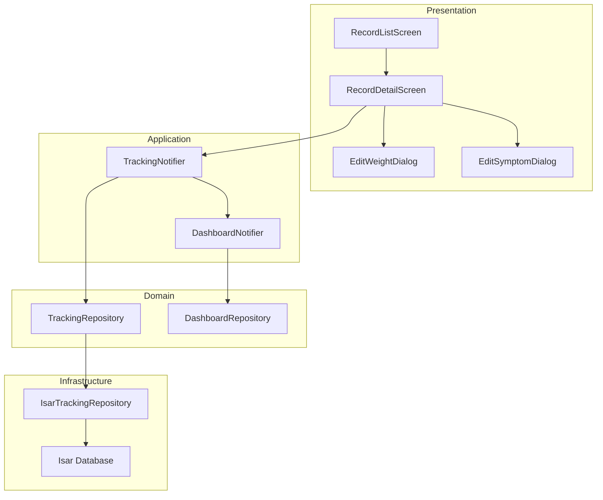

# UF-013 (기록 수정/삭제) Implementation Plan

## 1. 개요

### 기능 범위
- **위치**: `features/tracking/`
- **책임**: 과거 기록(체중, 증상, 투여) 수정 및 삭제
- **TDD 적용**: 전 모듈에 Outside-In 전략 적용

### 모듈 목록
1. **Domain Layer**: 비즈니스 로직 및 Repository 인터페이스
2. **Infrastructure Layer**: Isar Repository 구현체
3. **Application Layer**: 상태 관리 및 UseCase 조율
4. **Presentation Layer**: 수정/삭제 UI 및 상호작용

---

## 2. Architecture Diagram



---

## 3. Implementation Plan

### 3.1 Domain Layer - Repository Interface

**Location**: `features/tracking/domain/repositories/tracking_repository.dart`

**Responsibility**:
- CRUD 메서드 인터페이스 정의
- 비즈니스 규칙 검증 없음 (순수 데이터 접근 계약)

**Test Strategy**: Unit Test (Interface Contract)

**Test Scenarios (Red Phase)**:
```dart
// Test 1: Repository Interface 존재 확인
test('TrackingRepository should have updateWeightLog method')

// Test 2: Repository Interface 메서드 시그니처 확인
test('updateWeightLog should accept id and WeightLog')
test('deleteWeightLog should accept id and return Future<void>')
test('updateSymptomLog should accept id and SymptomLog')
test('deleteSymptomLog should accept id and return Future<void>')
```

**Implementation Order**:
1. RED: Interface 시그니처 테스트 작성
2. GREEN: Interface 정의
3. REFACTOR: 불필요한 주석 제거

**Dependencies**: None (순수 Dart)

---

### 3.2 Infrastructure Layer - Isar Repository Implementation

**Location**: `features/tracking/infrastructure/repositories/isar_tracking_repository.dart`

**Responsibility**:
- Repository 인터페이스 구현
- Isar 트랜잭션 처리
- DTO ↔ Entity 변환
- 데이터베이스 예외 처리

**Test Strategy**: Integration Test (Isar in-memory)

**Test Scenarios (Red Phase)**:
```dart
// AAA Pattern 적용

// Test Suite 1: Weight Log Update
group('updateWeightLog', () {
  // Arrange: 기존 WeightLog 생성
  // Act: updateWeightLog 호출
  // Assert: 업데이트 확인
  test('should update weight log successfully')

  // Arrange: 존재하지 않는 ID
  // Act: updateWeightLog 호출
  // Assert: RepositoryException 발생
  test('should throw RepositoryException when log not found')

  // Arrange: 유효하지 않은 체중 값 (음수)
  // Act: updateWeightLog 호출
  // Assert: ValidationException 발생
  test('should throw ValidationException for invalid weight')

  // Arrange: 동일 날짜 중복 기록
  // Act: updateWeightLog 호출 (날짜 변경 시)
  // Assert: ConflictException 발생
  test('should throw ConflictException for duplicate date')
});

// Test Suite 2: Weight Log Delete
group('deleteWeightLog', () {
  test('should delete weight log successfully')
  test('should throw RepositoryException when log not found')
});

// Test Suite 3: Symptom Log Update
group('updateSymptomLog', () {
  test('should update symptom log successfully')
  test('should update associated tags')
  test('should throw RepositoryException when log not found')
  test('should validate severity range 1-10')
});

// Test Suite 4: Symptom Log Delete
group('deleteSymptomLog', () {
  test('should delete symptom log and associated tags')
  test('should throw RepositoryException when log not found')
});
```

**Edge Cases**:
- Isar 트랜잭션 실패 시 롤백
- 동시성 충돌 처리
- DTO 변환 실패

**Implementation Order**:
1. RED: 각 테스트 케이스 작성
2. GREEN: Isar CRUD 로직 구현
3. REFACTOR: 중복 제거, DTO 변환 유틸 추출

**Dependencies**:
- `isar_provider`
- `tracking_repository` (Domain)
- `weight_log_dto`, `symptom_log_dto` (Infrastructure)

---

### 3.3 Application Layer - TrackingNotifier Update

**Location**: `features/tracking/application/notifiers/tracking_notifier.dart`

**Responsibility**:
- 수정/삭제 UseCase 조율
- 상태 동기화 (AsyncValue)
- DashboardNotifier 재계산 트리거

**Test Strategy**: Unit Test (Mock Repository)

**Test Scenarios (Red Phase)**:
```dart
// Test Suite 1: Update Weight Log
group('updateWeightLog', () {
  // Arrange: Mock Repository, 초기 상태
  // Act: updateWeightLog 호출
  // Assert: 상태가 AsyncValue.loading() → data()로 전환
  test('should update state to loading then data')

  // Arrange: Mock Repository throws Exception
  // Act: updateWeightLog 호출
  // Assert: 상태가 AsyncValue.error()로 전환
  test('should handle repository error')

  // Arrange: 성공적인 업데이트
  // Act: updateWeightLog 호출
  // Assert: DashboardNotifier.refresh() 호출됨
  test('should trigger dashboard refresh on success')
});

// Test Suite 2: Delete Weight Log
group('deleteWeightLog', () {
  test('should update state correctly on delete')
  test('should remove deleted log from state')
  test('should trigger dashboard refresh')
});

// Test Suite 3: Update Symptom Log
group('updateSymptomLog', () {
  test('should update symptom log state')
  test('should trigger dashboard refresh')
});

// Test Suite 4: Delete Symptom Log
group('deleteSymptomLog', () {
  test('should delete symptom log state')
  test('should trigger dashboard refresh')
});
```

**Edge Cases**:
- Repository 예외 발생 시 상태 롤백
- 동시 요청 처리 (debounce)
- 낙관적 업데이트 vs 비관적 업데이트

**Implementation Order**:
1. RED: Mock을 이용한 UseCase 테스트 작성
2. GREEN: Notifier 메서드 구현
3. REFACTOR: 공통 에러 처리 로직 추출

**Dependencies**:
- `tracking_repository_provider`
- `dashboard_notifier_provider`

---

### 3.4 Presentation Layer - Record Detail Screen

**Location**: `features/tracking/presentation/screens/record_detail_screen.dart`

**Responsibility**:
- 기록 상세 표시
- 수정/삭제 액션 버튼
- 확인 다이얼로그 표시

**Test Strategy**: Widget Test

**Test Scenarios (Red Phase)**:
```dart
group('RecordDetailScreen', () {
  // Arrange: WeightLog 데이터
  // Act: 화면 빌드
  // Assert: 수정/삭제 버튼 존재
  testWidgets('should display edit and delete buttons')

  // Arrange: 화면 로드
  // Act: 삭제 버튼 탭
  // Assert: 확인 다이얼로그 표시
  testWidgets('should show confirmation dialog on delete')

  // Arrange: 화면 로드
  // Act: 수정 버튼 탭
  // Assert: 수정 다이얼로그 표시
  testWidgets('should navigate to edit dialog on edit')

  // Arrange: 삭제 확인
  // Act: 확인 버튼 탭
  // Assert: TrackingNotifier.deleteWeightLog 호출
  testWidgets('should call deleteWeightLog on confirm')
});
```

**QA Sheet (수동 테스트)**:
- [ ] 수정 버튼 클릭 시 기존 데이터가 폼에 표시됨
- [ ] 삭제 확인 다이얼로그가 명확한 경고 문구를 포함함
- [ ] 삭제 성공 시 목록 화면으로 자동 이동
- [ ] 에러 발생 시 SnackBar로 안내 메시지 표시

**Implementation Order**:
1. RED: Widget 존재 및 상호작용 테스트 작성
2. GREEN: UI 구현
3. REFACTOR: 공통 위젯 추출 (ConfirmDialog 등)

**Dependencies**:
- `tracking_notifier_provider`
- `go_router`

---

### 3.5 Presentation Layer - Edit Weight Dialog

**Location**: `features/tracking/presentation/widgets/edit_weight_dialog.dart`

**Responsibility**:
- 체중 수정 폼
- 입력 검증 (양수, 범위)
- TrackingNotifier 호출

**Test Strategy**: Widget Test

**Test Scenarios (Red Phase)**:
```dart
group('EditWeightDialog', () {
  testWidgets('should pre-fill existing weight value')
  testWidgets('should validate positive weight input')
  testWidgets('should show warning for unrealistic weight')
  testWidgets('should call updateWeightLog on save')
  testWidgets('should disable save button when invalid')
});
```

**QA Sheet**:
- [ ] 체중 입력 시 실시간 검증 피드백 표시
- [ ] 비현실적 체중(20kg 미만, 300kg 초과) 경고 표시
- [ ] 저장 버튼 클릭 시 로딩 인디케이터 표시
- [ ] 날짜 선택기로 날짜 변경 가능

**Implementation Order**:
1. RED: 폼 검증 테스트 작성
2. GREEN: 폼 UI 및 검증 로직 구현
3. REFACTOR: 공통 Validator 함수 추출

**Dependencies**:
- `tracking_notifier_provider`
- `validators.dart` (core/utils)

---

### 3.6 Presentation Layer - Edit Symptom Dialog

**Location**: `features/tracking/presentation/widgets/edit_symptom_dialog.dart`

**Responsibility**:
- 증상 수정 폼
- 심각도, 태그 수정
- TrackingNotifier 호출

**Test Strategy**: Widget Test

**Test Scenarios (Red Phase)**:
```dart
group('EditSymptomDialog', () {
  testWidgets('should pre-fill existing symptom data')
  testWidgets('should validate severity range 1-10')
  testWidgets('should allow tag modification')
  testWidgets('should call updateSymptomLog on save')
});
```

**QA Sheet**:
- [ ] 기존 증상, 심각도, 태그가 미리 선택됨
- [ ] 심각도 슬라이더로 1-10 범위 선택 가능
- [ ] 태그 추가/제거 가능
- [ ] 저장 시 성공/실패 피드백 표시

**Implementation Order**:
1. RED: 증상 폼 테스트 작성
2. GREEN: 증상 폼 UI 구현
3. REFACTOR: EditWeightDialog와 공통 로직 추출

**Dependencies**:
- `tracking_notifier_provider`
- `symptom_constants.dart` (core/constants)

---

### 3.7 Application Layer - Dashboard Refresh Trigger

**Location**: `features/dashboard/application/notifiers/dashboard_notifier.dart`

**Responsibility**:
- 기록 변경 시 대시보드 재계산
- 주간 목표 진행도 업데이트
- 뱃지 상태 업데이트

**Test Strategy**: Unit Test (Mock Repository)

**Test Scenarios (Red Phase)**:
```dart
group('DashboardNotifier refresh', () {
  // Arrange: 초기 대시보드 상태
  // Act: refresh() 호출
  // Assert: 모든 지표가 재계산됨
  test('should recalculate all metrics on refresh')

  // Arrange: 체중 기록 변경
  // Act: refresh() 호출
  // Assert: 주간 목표 진행도 업데이트
  test('should update weekly progress')

  // Arrange: 뱃지 조건 충족
  // Act: refresh() 호출
  // Assert: 뱃지 상태 업데이트
  test('should update badge status')
});
```

**Implementation Order**:
1. RED: 재계산 로직 테스트 작성
2. GREEN: refresh() 메서드 구현
3. REFACTOR: 계산 로직을 별도 UseCase로 분리

**Dependencies**:
- `tracking_repository_provider`
- `badge_repository_provider`

---

## 4. TDD Workflow

### 시작 지점
**Domain Layer - Repository Interface** (가장 안쪽부터 시작)

### 진행 순서
```
1. Domain/Repository Interface
   └─ RED: 인터페이스 시그니처 테스트
   └─ GREEN: 인터페이스 정의
   └─ REFACTOR: 문서화

2. Infrastructure/IsarRepository
   └─ RED: CRUD 통합 테스트 (Isar in-memory)
   └─ GREEN: Isar 구현체
   └─ REFACTOR: DTO 변환 유틸 추출

3. Application/TrackingNotifier
   └─ RED: UseCase 유닛 테스트 (Mock Repository)
   └─ GREEN: Notifier 메서드 구현
   └─ REFACTOR: 에러 처리 공통화

4. Application/DashboardNotifier
   └─ RED: 재계산 로직 테스트
   └─ GREEN: refresh() 구현
   └─ REFACTOR: 계산 로직 분리

5. Presentation/RecordDetailScreen
   └─ RED: Widget 테스트
   └─ GREEN: UI 구현
   └─ REFACTOR: 공통 위젯 추출

6. Presentation/EditWeightDialog
   └─ RED: 폼 검증 테스트
   └─ GREEN: 폼 UI 구현
   └─ REFACTOR: Validator 함수 추출

7. Presentation/EditSymptomDialog
   └─ RED: 증상 폼 테스트
   └─ GREEN: 증상 폼 구현
   └─ REFACTOR: 공통 로직 통합
```

### Commit Points
- [ ] Commit 1: Domain Repository Interface + Tests
- [ ] Commit 2: Infrastructure IsarRepository + Integration Tests
- [ ] Commit 3: Application TrackingNotifier + Unit Tests
- [ ] Commit 4: Application DashboardNotifier Refresh + Tests
- [ ] Commit 5: Presentation RecordDetailScreen + Widget Tests
- [ ] Commit 6: Presentation EditWeightDialog + Widget Tests
- [ ] Commit 7: Presentation EditSymptomDialog + Widget Tests
- [ ] Commit 8: Final Integration + Acceptance Tests

### 완료 조건
- [ ] 모든 Unit Tests 통과 (70% coverage)
- [ ] 모든 Integration Tests 통과 (20% coverage)
- [ ] 모든 Widget Tests 통과
- [ ] Acceptance Test 통과: 사용자가 기록을 수정/삭제하고 대시보드가 자동 업데이트됨
- [ ] QA Sheet 100% 통과
- [ ] `flutter analyze` 경고 0개
- [ ] Repository Pattern 유지 (Phase 1 전환 대비)

---

## 5. 핵심 원칙 적용

### FIRST Principles
- **Fast**: Mock을 사용한 Unit Test (< 100ms)
- **Independent**: 각 테스트는 독립적 Arrange
- **Repeatable**: Isar in-memory로 일관성 보장
- **Self-validating**: expect()로 명확한 Pass/Fail
- **Timely**: 코드 작성 전 테스트 작성

### Test Pyramid
- **Unit (70%)**: Domain, Application Layer
- **Integration (20%)**: Infrastructure Layer (Isar)
- **Widget (10%)**: Presentation Layer

### AAA Pattern
모든 테스트에 엄격히 적용:
```dart
test('should update weight log', () {
  // Arrange
  final repository = MockTrackingRepository();
  final notifier = TrackingNotifier(repository);

  // Act
  await notifier.updateWeightLog('id', weightLog);

  // Assert
  expect(notifier.state, isA<AsyncData>());
});
```

---

## 6. 비즈니스 규칙 검증

### BR-1: 기록 소유권
**테스트 위치**: `isar_tracking_repository_test.dart`
```dart
test('should only update own records (userId validation)')
```

### BR-2: 검증 규칙
**테스트 위치**: `edit_weight_dialog_test.dart`, `edit_symptom_dialog_test.dart`
```dart
test('should reject negative weight')
test('should reject future date')
test('should reject severity outside 1-10')
```

### BR-3: 날짜 고유 제약
**테스트 위치**: `isar_tracking_repository_test.dart`
```dart
test('should throw ConflictException for duplicate weight date')
```

### BR-4: 통계 재계산
**테스트 위치**: `tracking_notifier_test.dart`
```dart
test('should trigger dashboard refresh after update')
test('should trigger dashboard refresh after delete')
```

### BR-5: 연쇄 동작
**테스트 위치**: `isar_tracking_repository_test.dart`
```dart
test('should delete symptom tags when deleting symptom log')
```

---

## 7. Performance Constraints

### 응답 시간 목표
- 기록 업데이트: < 200ms
- 기록 삭제: < 100ms
- 대시보드 재계산: < 500ms

### 테스트 성능
- Unit Test Suite: < 5초
- Integration Test Suite: < 10초
- Widget Test Suite: < 15초

---

## 8. 예외 처리 전략

### Domain Exceptions
```dart
class RecordNotFoundException extends DomainException {}
class ValidationException extends DomainException {}
class ConflictException extends DomainException {}
```

### 테스트 커버리지
```dart
test('should throw RecordNotFoundException when log not found')
test('should throw ValidationException for invalid input')
test('should throw ConflictException for duplicate date')
```

### UI 에러 표시
- RecordNotFoundException → "기록을 찾을 수 없습니다"
- ValidationException → 필드별 에러 메시지
- ConflictException → "해당 날짜에 이미 기록이 존재합니다"

---

## 9. 의존성 그래프

```
Presentation Layer (RecordDetailScreen, EditDialogs)
    ↓ depends on
Application Layer (TrackingNotifier, DashboardNotifier)
    ↓ depends on
Domain Layer (TrackingRepository interface)
    ↑ implemented by
Infrastructure Layer (IsarTrackingRepository)
```

**Phase 1 전환 포인트**:
`IsarTrackingRepository` → `SupabaseTrackingRepository` (Provider DI 1줄 변경)

---

## 10. 참고 자료

- `docs/tdd.md`: TDD 프로세스 가이드라인
- `docs/code_structure.md`: 4-Layer Architecture
- `docs/state-management.md`: Riverpod Provider 패턴
- `docs/database.md`: 테이블 스키마
- `docs/userflow.md`: UF-011 사용자 플로우
