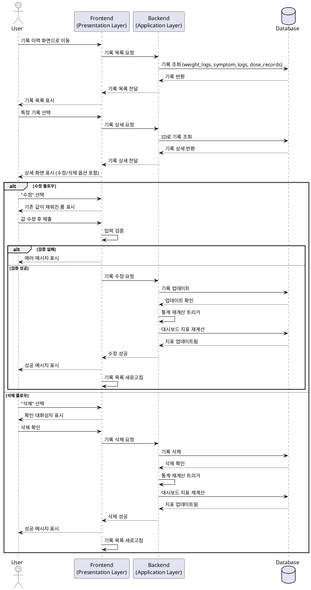

# UF-011: 과거 기록 수정/삭제

## 유스케이스 명세

### Primary Actor
과거에 기록한 데이터(체중, 부작용, 투여 기록)를 수정하거나 삭제해야 하는 GLP-1 사용자

### Precondition (사용자 관점)
- 사용자가 로그인되어 있음
- 기존 기록(체중, 부작용, 투여 기록)이 존재함
- 기록 목록 화면에 접근 가능함

### Trigger
사용자가 기록 목록에서 특정 기록을 선택하고 수정 또는 삭제를 선택함

### Main Scenario

#### 1. 기록 목록 조회
사용자가 기록 이력 화면으로 이동하여 과거 기록 목록을 확인함

#### 2. 기록 선택
사용자가 특정 기록을 탭하여 상세 정보를 확인함

#### 3. 작업 선택
사용자가 기록 상세 화면에서 "수정" 또는 "삭제" 옵션을 선택함

#### 4. 수정 플로우
- 시스템이 기존 데이터가 채워진 수정 폼을 표시함
- 사용자가 값을 수정함 (날짜, 체중, 증상 심각도, 투여량, 주사 부위 등)
- 시스템이 입력 필드를 검증함
- 사용자가 변경사항을 확인함
- 시스템이 Repository를 통해 수정된 기록을 저장함
- 시스템이 영향받는 통계 재계산을 트리거함:
  * 홈 대시보드 지표 (UF-F006)
  * 데이터 공유 모드 리포트 (UF-F003)
  * 주간 목표 진행도
  * 뱃지 달성 진행도
  * 인사이트 및 트렌드
- 시스템이 성공 확인 메시지를 표시함
- 사용자가 기록 목록으로 돌아감

#### 5. 삭제 플로우
- 시스템이 삭제 확인 대화상자를 표시함
- 사용자가 삭제를 확인함
- 시스템이 Repository를 통해 기록을 삭제함
- 시스템이 영향받는 통계 재계산을 트리거함:
  * 홈 대시보드 지표 (UF-F006)
  * 데이터 공유 모드 리포트 (UF-F003)
  * 주간 목표 진행도
  * 뱃지 달성 진행도
  * 인사이트 및 트렌드
- 시스템이 성공 확인 메시지를 표시함
- 사용자가 기록 목록으로 돌아감

### Edge Cases

#### 잘못된 입력
- 미래 날짜 선택: 에러 메시지 표시
- 유효하지 않은 체중 값(음수, 비현실적): 검증 에러 표시
- 1-10 범위 외의 심각도: 검증 에러 표시

#### 투여 기록 삭제
- 투여 기록 삭제는 스케줄에 영향을 주지 않음 (스케줄은 별도 관리)
- 완료 기록만 삭제됨

#### 증상 기록 삭제
- 연관된 대처 가이드 피드백도 함께 삭제됨
- 컨텍스트 태그도 함께 삭제됨

#### 중복 방지
- 기존 날짜와 중복되도록 수정: 날짜별 고유 제약이 있는 기록(체중 기록)에 대해 충돌 경고 표시

#### 앱 중단
- 수정/삭제 중 앱 종료: 변경사항이 폐기됨
- 미완료 수정에 대한 자동 저장 없음

#### 데이터 일관성
- 관련 통계가 실시간으로 재계산됨
- Application Layer의 DashboardNotifier를 통해 트리거됨
- 모든 종속 뷰가 자동으로 업데이트됨

#### 삭제 영구성
- 삭제는 영구적임 (실행 취소 불가)
- 삭제 전 명확한 경고 표시됨

#### 다중 기록 작업
- 일괄 수정/삭제는 MVP에서 지원하지 않음
- 개별 기록 작업만 허용됨

### Business Rules

#### BR-1: 기록 소유권
인증된 사용자만 자신의 기록을 수정하거나 삭제할 수 있음

#### BR-2: 검증 규칙
- 체중: 양수여야 하며 현실적 범위(20-300kg) 내여야 함
- 날짜: 미래 날짜일 수 없음
- 증상 심각도: 1-10 범위여야 함
- 투여량: 양수여야 함

#### BR-3: 날짜 고유 제약
체중 기록은 날짜별 고유 제약이 있음 (하루 한 기록). 중복 날짜로 수정 시 덮어쓰기 확인 필요

#### BR-4: 통계 재계산
모든 수정 또는 삭제 작업은 다음의 자동 재계산을 트리거함:
- 주간 목표 진행도
- 연속 기록일
- 뱃지 달성 상태
- 대시보드 인사이트
- 데이터 공유 모드 리포트

#### BR-5: 감사 추적
데이터 무결성을 위해 기록 수정 내역이 로그됨 (투여 계획의 경우 plan_change_history에 저장)

#### BR-6: 연쇄 동작
- 투여 기록 삭제: 기록만 삭제, 스케줄은 유지
- 증상 기록 삭제: 연관된 태그와 피드백도 삭제
- 체중 기록 삭제: 연쇄 효과 없음

#### BR-7: 소프트 검증
일부 경고는 사용자가 진행할 수 있도록 허용함 (예: 비현실적 체중 값은 경고를 표시하지만 저장 허용)

---

## Sequence Diagram

