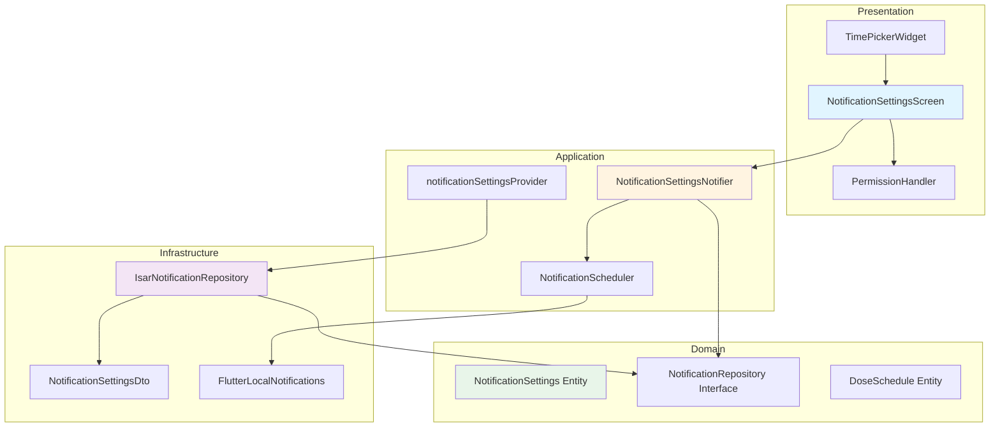

# UF-012 Push Notification Settings Implementation Plan

## 1. Overview

### Modules
- **Domain Layer**: NotificationSettings entity, NotificationRepository interface
- **Infrastructure Layer**: IsarNotificationRepository implementation, NotificationDto
- **Application Layer**: NotificationSettingsNotifier, notification scheduling logic
- **Presentation Layer**: NotificationSettingsScreen, permission handling UI

### TDD Coverage
- Unit tests: Domain entities, Repository interface contracts, Business logic
- Integration tests: Repository implementation with Isar, Notification scheduling
- Widget tests: UI components, User interactions

---

## 2. Architecture Diagram



---

## 3. Implementation Plan

### 3.1 Domain Layer

#### Module: NotificationSettings Entity
- **Location**: `lib/features/notification/domain/entities/notification_settings.dart`
- **Responsibility**: Immutable value object for notification settings
- **Test Strategy**: Unit
- **Test Scenarios (Red Phase)**:
  - **Arrange**: Valid data (enabled=true, time=09:00)
  - **Act**: Create entity
  - **Assert**: Properties match input
  - Edge: Invalid time format should throw
  - Edge: Null safety validation

- **Implementation Order**:
  1. RED: Test entity creation with valid data
  2. GREEN: Implement basic entity with properties
  3. RED: Test equality/hashCode
  4. GREEN: Add copyWith, toJson, fromJson methods
  5. REFACTOR: Extract time validation logic

#### Module: NotificationRepository Interface
- **Location**: `lib/features/notification/domain/repositories/notification_repository.dart`
- **Responsibility**: Contract for notification settings persistence
- **Test Strategy**: Contract tests (verify implementations)
- **Test Scenarios (Red Phase)**:
  - Save settings should persist data
  - Get settings should retrieve saved data
  - Update time should modify existing settings
  - Stream should emit changes reactively

- **Implementation Order**:
  1. RED: Define interface methods
  2. GREEN: Document interface contracts
  3. REFACTOR: Align with Repository Pattern

---

### 3.2 Infrastructure Layer

#### Module: NotificationSettingsDto
- **Location**: `lib/features/notification/infrastructure/dtos/notification_settings_dto.dart`
- **Responsibility**: Isar collection for notification settings
- **Test Strategy**: Unit
- **Test Scenarios (Red Phase)**:
  - **Arrange**: Create entity
  - **Act**: Convert to DTO
  - **Assert**: DTO fields match entity
  - **Arrange**: Create DTO
  - **Act**: Convert to entity
  - **Assert**: Entity fields match DTO
  - Edge: Time of day serialization (store as minutes since midnight)
  - Edge: Null handling for optional fields

- **Implementation Order**:
  1. RED: Test entity to DTO conversion
  2. GREEN: Implement Isar collection with fields
  3. RED: Test DTO to entity conversion
  4. GREEN: Implement toEntity and fromEntity methods
  5. REFACTOR: Extract time conversion utilities

- **Dependencies**: Isar package, NotificationSettings entity

#### Module: IsarNotificationRepository
- **Location**: `lib/features/notification/infrastructure/repositories/isar_notification_repository.dart`
- **Responsibility**: Isar implementation of NotificationRepository
- **Test Strategy**: Integration
- **Test Scenarios (Red Phase)**:
  - **Arrange**: Empty Isar instance
  - **Act**: Save settings
  - **Assert**: Settings persisted correctly
  - **Arrange**: Existing settings
  - **Act**: Get settings
  - **Assert**: Retrieved settings match saved
  - **Arrange**: Saved settings
  - **Act**: Update time
  - **Assert**: Time updated in DB
  - **Arrange**: Saved settings, multiple watchers
  - **Act**: Update settings
  - **Assert**: All watchers notified
  - Edge: First access returns default settings
  - Edge: Concurrent updates handled correctly

- **Implementation Order**:
  1. RED: Test save settings
  2. GREEN: Implement saveSettings method
  3. RED: Test get settings
  4. GREEN: Implement getSettings method
  5. RED: Test watch stream
  6. GREEN: Implement watchSettings method with Isar.watchLazy
  7. RED: Test update scenarios
  8. GREEN: Implement update logic
  9. REFACTOR: Extract transaction helpers

- **Dependencies**: Isar, NotificationSettingsDto, NotificationRepository interface

#### Module: NotificationScheduler Service
- **Location**: `lib/features/notification/infrastructure/services/notification_scheduler.dart`
- **Responsibility**: Schedule/cancel local notifications via flutter_local_notifications
- **Test Strategy**: Integration with mocks
- **Test Scenarios (Red Phase)**:
  - **Arrange**: Dose schedules list, notification time
  - **Act**: Schedule notifications
  - **Assert**: Notifications registered with correct payload
  - **Arrange**: Existing scheduled notifications
  - **Act**: Cancel all notifications
  - **Assert**: Notification list empty
  - **Arrange**: Old schedules
  - **Act**: Reschedule with new time
  - **Assert**: Old canceled, new scheduled
  - Edge: Past date dose schedules skipped
  - Edge: Same day multiple doses → single notification
  - Edge: Permission denied → graceful failure

- **Implementation Order**:
  1. RED: Test schedule single notification
  2. GREEN: Implement basic scheduling
  3. RED: Test schedule multiple notifications
  4. GREEN: Implement batch scheduling
  5. RED: Test cancel all
  6. GREEN: Implement cancellation
  7. RED: Test reschedule scenario
  8. GREEN: Implement reschedule logic
  9. REFACTOR: Extract notification payload builder

- **Dependencies**: flutter_local_notifications, DoseSchedule entity

---

### 3.3 Application Layer

#### Module: NotificationSettingsNotifier
- **Location**: `lib/features/notification/application/notifiers/notification_settings_notifier.dart`
- **Responsibility**: Manage notification settings state, coordinate repository and scheduler
- **Test Strategy**: Unit
- **Test Scenarios (Red Phase)**:
  - **Arrange**: Mock repository with existing settings
  - **Act**: Build notifier
  - **Assert**: State loaded correctly
  - **Arrange**: Notifier with settings
  - **Act**: Update notification time
  - **Assert**: Repository called, state updated, scheduler invoked
  - **Arrange**: Notifier with enabled=true
  - **Act**: Toggle to disabled
  - **Assert**: Repository updated, scheduler cancels all
  - **Arrange**: Notifier with disabled=false
  - **Act**: Toggle to enabled
  - **Assert**: Repository updated, scheduler reschedules
  - Edge: Repository failure → AsyncError state
  - Edge: Scheduler failure → log error, maintain state

- **Implementation Order**:
  1. RED: Test build loads existing settings
  2. GREEN: Implement build with repository fetch
  3. RED: Test updateNotificationTime
  4. GREEN: Implement update method with scheduler call
  5. RED: Test toggleEnabled
  6. GREEN: Implement toggle with conditional scheduling
  7. RED: Test error handling
  8. GREEN: Add AsyncValue.guard wrappers
  9. REFACTOR: Extract scheduling coordination logic

- **Dependencies**: NotificationRepository, NotificationScheduler, MedicationRepository (for dose schedules)

#### Module: notificationSettingsProvider
- **Location**: `lib/features/notification/application/providers.dart`
- **Responsibility**: Provide NotificationSettingsNotifier and NotificationScheduler
- **Test Strategy**: Integration
- **Test Scenarios**: Provider dependency injection working correctly

- **Implementation Order**:
  1. RED: Test provider registration
  2. GREEN: Implement Riverpod providers
  3. REFACTOR: Organize provider hierarchy

---

### 3.4 Presentation Layer

#### Module: NotificationSettingsScreen
- **Location**: `lib/features/notification/presentation/screens/notification_settings_screen.dart`
- **Responsibility**: Display notification settings, handle user interactions
- **Test Strategy**: Widget tests
- **Test Scenarios (Red Phase)**:
  - **Arrange**: Notifier with settings enabled=true, time=09:00
  - **Act**: Render screen
  - **Assert**: Toggle is ON, time displays "09:00"
  - **Arrange**: Screen rendered
  - **Act**: Tap time picker
  - **Assert**: Time picker dialog shown
  - **Arrange**: Time picker dialog
  - **Act**: Select 14:00
  - **Assert**: Notifier.updateNotificationTime called with 14:00
  - **Arrange**: Toggle ON
  - **Act**: Toggle switch
  - **Assert**: Notifier.toggleEnabled called
  - Edge: Loading state shows spinner
  - Edge: Error state shows error message

- **Implementation Order**:
  1. RED: Test screen renders with settings
  2. GREEN: Build Scaffold with Switch and Text
  3. RED: Test time picker interaction
  4. GREEN: Implement showTimePicker and callback
  5. RED: Test toggle interaction
  6. GREEN: Implement Switch.onChanged
  7. RED: Test loading state
  8. GREEN: Add AsyncValue pattern matching
  9. REFACTOR: Extract widgets for time picker tile, toggle tile

- **Dependencies**: NotificationSettingsNotifier
- **QA Sheet**:
  - [ ] Toggle switch animates smoothly
  - [ ] Time picker displays current time
  - [ ] Time format matches locale (24h/12h)
  - [ ] Back button saves state
  - [ ] Confirmation message after save

#### Module: PermissionHandler Widget
- **Location**: `lib/features/notification/presentation/widgets/permission_handler.dart`
- **Responsibility**: Handle notification permission requests
- **Test Strategy**: Widget tests with platform channel mocks
- **Test Scenarios (Red Phase)**:
  - **Arrange**: Permission not determined
  - **Act**: Toggle ON
  - **Assert**: Permission request dialog shown
  - **Arrange**: Permission denied
  - **Act**: Toggle ON
  - **Assert**: "Go to Settings" dialog shown
  - **Arrange**: Permission granted
  - **Act**: Toggle ON
  - **Assert**: Settings saved immediately
  - Edge: Permission denied permanently → open app settings

- **Implementation Order**:
  1. RED: Test permission request flow
  2. GREEN: Implement permission_handler package integration
  3. RED: Test denied scenario
  4. GREEN: Show settings dialog
  5. RED: Test granted scenario
  6. GREEN: Call notifier update
  7. REFACTOR: Extract permission status helpers

- **Dependencies**: permission_handler package

---

## 4. TDD Workflow

### Start: Domain Entity Test
**First Test**: NotificationSettings entity creation

```dart
test('should create NotificationSettings with valid data', () {
  // Arrange
  final time = TimeOfDay(hour: 9, minute: 0);

  // Act
  final settings = NotificationSettings(
    enabled: true,
    notificationTime: time,
  );

  // Assert
  expect(settings.enabled, true);
  expect(settings.notificationTime, time);
});
```

### Commit Points
1. Domain entities and repository interface
2. Infrastructure DTOs
3. Infrastructure repository implementation
4. Infrastructure notification scheduler
5. Application notifier and providers
6. Presentation screen and widgets

### Red → Green → Refactor Flow
1. Write entity test → Implement entity → Refactor with copyWith
2. Write DTO test → Implement DTO → Refactor time conversion
3. Write repository test → Implement repository → Refactor transactions
4. Write scheduler test → Implement scheduler → Refactor payload builder
5. Write notifier test → Implement notifier → Refactor coordination
6. Write widget test → Implement widget → Refactor reusable components

### Completion Criteria
- [ ] All unit tests passing (Domain + Application)
- [ ] All integration tests passing (Infrastructure)
- [ ] All widget tests passing (Presentation)
- [ ] Manual QA sheet completed
- [ ] No layer violations (check imports)
- [ ] Repository pattern maintained
- [ ] flutter analyze shows no warnings

---

## 5. Technical Details

### Data Model

**NotificationSettings Entity**:
```dart
class NotificationSettings {
  final bool enabled;
  final TimeOfDay notificationTime;

  // Default: 09:00, enabled
}
```

**Storage**:
- Stored in `user_profiles` table (Phase 1) or Isar collection (Phase 0)
- `notification_enabled`: boolean
- `notification_time`: integer (minutes since midnight, 0-1439)

### Notification Payload
```dart
{
  "type": "dose_reminder",
  "doseScheduleId": "uuid",
  "medicationName": "Ozempic",
  "doseMg": 0.5,
  "route": "/medication/schedule"
}
```

### Platform-Specific Considerations
- **iOS**: Request authorization before scheduling
- **Android**: Request POST_NOTIFICATIONS permission (Android 13+)
- **Background**: Use exact alarm scheduling for reliability

### Dependencies
- `flutter_local_notifications: ^16.3.0`
- `permission_handler: ^11.0.0`
- `timezone: ^0.9.2` (for scheduling)

---

## 6. Test Organization

```
test/
├── features/
│   └── notification/
│       ├── domain/
│       │   └── entities/
│       │       └── notification_settings_test.dart
│       ├── infrastructure/
│       │   ├── dtos/
│       │   │   └── notification_settings_dto_test.dart
│       │   ├── repositories/
│       │   │   └── isar_notification_repository_test.dart
│       │   └── services/
│       │       └── notification_scheduler_test.dart
│       ├── application/
│       │   └── notifiers/
│       │       └── notification_settings_notifier_test.dart
│       └── presentation/
│           ├── screens/
│           │   └── notification_settings_screen_test.dart
│           └── widgets/
│               └── permission_handler_test.dart
```

---

## 7. Risk Mitigation

### High Risk
1. **Permission Denial**: Users deny notification permission
   - Mitigation: Clear explanation before request, guide to settings

2. **Platform Inconsistencies**: iOS/Android notification behavior differs
   - Mitigation: Platform-specific tests, fallback strategies

### Medium Risk
1. **Timezone Issues**: Notification time not matching user expectation
   - Mitigation: Use timezone package, test across timezones

2. **Missed Notifications**: App killed by OS
   - Mitigation: Use exact alarms (Android), request reliability permission

---

## 8. Phase 0 → Phase 1 Transition

**Phase 0** (Local):
- Settings stored in Isar
- Repository: `IsarNotificationRepository`

**Phase 1** (Cloud):
- Settings stored in Supabase `user_profiles` table
- Repository: `SupabaseNotificationRepository` (new implementation)
- **Zero changes**: Domain, Application, Presentation layers

**Migration**: 1-line change in provider DI

```dart
// Phase 0
@riverpod
NotificationRepository notificationRepository(ref) =>
  IsarNotificationRepository(ref.watch(isarProvider));

// Phase 1
@riverpod
NotificationRepository notificationRepository(ref) =>
  SupabaseNotificationRepository(ref.watch(supabaseProvider));
```

---

## 9. Success Metrics

### Test Coverage
- Unit tests: 100% (Domain + Application)
- Integration tests: 90%+ (Infrastructure)
- Widget tests: 80%+ (Presentation)

### Performance
- Settings load: < 100ms
- Settings save: < 500ms
- Notification scheduling: < 1s for 100 doses

### Reliability
- Notification delivery rate: > 95%
- Permission request success: > 70%
- Zero data loss on failure