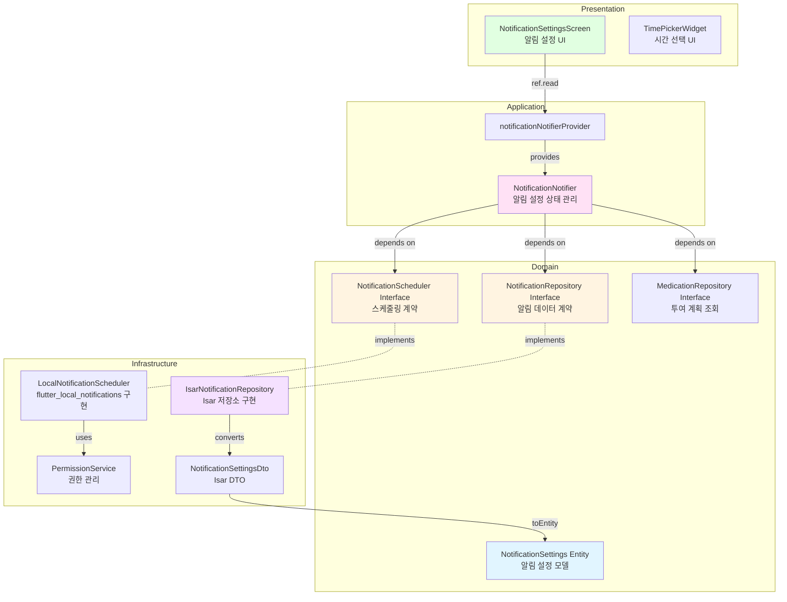

# 푸시 알림 설정 Implementation Plan

## 1. 개요

**Feature**: UF-012 푸시 알림 설정
**TDD 전략**: Outside-In (UI → Application → Domain → Infrastructure)
**핵심 목표**: 투여 알림 시간 설정, 알림 활성화/비활성화, 디바이스 권한 관리, 알림 스케줄 자동 업데이트

### 모듈 목록

| 모듈 | 위치 | 책임 | TDD 적용 |
|------|------|------|----------|
| NotificationSettings Entity | `features/notification/domain/entities/notification_settings.dart` | 알림 설정 도메인 모델 | Unit |
| NotificationRepository Interface | `features/notification/domain/repositories/notification_repository.dart` | 알림 데이터 접근 계약 | Unit |
| NotificationScheduler Interface | `features/notification/domain/services/notification_scheduler.dart` | 알림 스케줄링 계약 | Unit |
| NotificationNotifier | `features/notification/application/notifiers/notification_notifier.dart` | 알림 설정 상태 관리 | Unit + Integration |
| NotificationSettingsScreen | `features/notification/presentation/screens/notification_settings_screen.dart` | 알림 설정 UI | Widget + Acceptance |
| NotificationSettingsDto | `features/notification/infrastructure/dtos/notification_settings_dto.dart` | 알림 설정 DTO (Isar) | Unit |
| IsarNotificationRepository | `features/notification/infrastructure/repositories/isar_notification_repository.dart` | Isar 기반 알림 저장소 | Integration |
| LocalNotificationScheduler | `features/notification/infrastructure/services/local_notification_scheduler.dart` | Flutter Local Notifications 구현 | Integration |
| PermissionService | `features/notification/infrastructure/services/permission_service.dart` | 알림 권한 관리 | Integration |

---

## 2. Architecture Diagram



---

## 3. Implementation Plan

### 3.1. Domain Layer

#### NotificationSettings Entity
- **Location**: `features/notification/domain/entities/notification_settings.dart`
- **Responsibility**: 알림 설정 정보를 표현하는 불변 모델
- **Test Strategy**: Unit Test
- **Test Scenarios**:
  ```dart
  // Red Phase
  test('should create NotificationSettings with default values', () {
    // Arrange & Act
    final settings = NotificationSettings(
      userId: 'user123',
      notificationTime: TimeOfDay(hour: 9, minute: 0),
      notificationEnabled: true,
    );

    // Assert
    expect(settings.userId, 'user123');
    expect(settings.notificationTime.hour, 9);
    expect(settings.notificationEnabled, true);
  });

  test('should create NotificationSettings with disabled state', () {
    // Arrange & Act
    final settings = NotificationSettings(
      userId: 'user123',
      notificationTime: TimeOfDay(hour: 21, minute: 30),
      notificationEnabled: false,
    );

    // Assert
    expect(settings.notificationEnabled, false);
  });

  test('should support copyWith for immutability', () {
    // Arrange
    final original = NotificationSettings(
      userId: 'user123',
      notificationTime: TimeOfDay(hour: 9, minute: 0),
      notificationEnabled: true,
    );

    // Act
    final updated = original.copyWith(
      notificationTime: TimeOfDay(hour: 21, minute: 0),
    );

    // Assert
    expect(updated.notificationTime.hour, 21);
    expect(updated.notificationEnabled, true);
  });

  test('should support equality comparison', () {
    // Arrange
    final settings1 = NotificationSettings(
      userId: 'user123',
      notificationTime: TimeOfDay(hour: 9, minute: 0),
      notificationEnabled: true,
    );
    final settings2 = NotificationSettings(
      userId: 'user123',
      notificationTime: TimeOfDay(hour: 9, minute: 0),
      notificationEnabled: true,
    );

    // Assert
    expect(settings1, equals(settings2));
  });
  ```
- **Implementation Order**:
  1. 기본 생성자 및 필드 정의 (userId, notificationTime, notificationEnabled)
  2. copyWith 메서드
  3. Equatable 구현
- **Dependencies**: None

---

#### NotificationRepository Interface
- **Location**: `features/notification/domain/repositories/notification_repository.dart`
- **Responsibility**: 알림 설정 데이터 접근 계약 정의
- **Test Strategy**: Unit Test (Mock 사용)
- **Test Scenarios**:
  ```dart
  // Red Phase
  test('should define getNotificationSettings method signature', () async {
    // Arrange
    final mockRepo = MockNotificationRepository();
    when(mockRepo.getNotificationSettings('user123'))
        .thenAnswer((_) async => mockSettings);

    // Act
    final settings = await mockRepo.getNotificationSettings('user123');

    // Assert
    expect(settings, isA<NotificationSettings>());
  });

  test('should define saveNotificationSettings method signature', () async {
    // Arrange
    final mockRepo = MockNotificationRepository();
    when(mockRepo.saveNotificationSettings(any))
        .thenAnswer((_) async => {});

    // Act
    await mockRepo.saveNotificationSettings(mockSettings);

    // Assert
    verify(mockRepo.saveNotificationSettings(mockSettings)).called(1);
  });

  test('should return null when settings not found', () async {
    // Arrange
    final mockRepo = MockNotificationRepository();
    when(mockRepo.getNotificationSettings('user123'))
        .thenAnswer((_) async => null);

    // Act
    final settings = await mockRepo.getNotificationSettings('user123');

    // Assert
    expect(settings, isNull);
  });
  ```
- **Method Signatures**:
  ```dart
  abstract class NotificationRepository {
    Future<NotificationSettings?> getNotificationSettings(String userId);
    Future<void> saveNotificationSettings(NotificationSettings settings);
  }
  ```
- **Dependencies**: NotificationSettings

---

#### NotificationScheduler Interface
- **Location**: `features/notification/domain/services/notification_scheduler.dart`
- **Responsibility**: 알림 스케줄링 계약 정의 (권한 확인, 알림 등록/취소)
- **Test Strategy**: Unit Test (Mock 사용)
- **Test Scenarios**:
  ```dart
  // Red Phase
  test('should define checkPermission method signature', () async {
    // Arrange
    final mockScheduler = MockNotificationScheduler();
    when(mockScheduler.checkPermission())
        .thenAnswer((_) async => true);

    // Act
    final hasPermission = await mockScheduler.checkPermission();

    // Assert
    expect(hasPermission, isA<bool>());
  });

  test('should define requestPermission method signature', () async {
    // Arrange
    final mockScheduler = MockNotificationScheduler();
    when(mockScheduler.requestPermission())
        .thenAnswer((_) async => true);

    // Act
    final granted = await mockScheduler.requestPermission();

    // Assert
    expect(granted, isTrue);
  });

  test('should define scheduleNotifications method signature', () async {
    // Arrange
    final mockScheduler = MockNotificationScheduler();
    final doseSchedules = [mockDoseSchedule1, mockDoseSchedule2];
    when(mockScheduler.scheduleNotifications(
      doseSchedules: doseSchedules,
      notificationTime: any,
    )).thenAnswer((_) async => {});

    // Act
    await mockScheduler.scheduleNotifications(
      doseSchedules: doseSchedules,
      notificationTime: TimeOfDay(hour: 9, minute: 0),
    );

    // Assert
    verify(mockScheduler.scheduleNotifications(
      doseSchedules: doseSchedules,
      notificationTime: any,
    )).called(1);
  });

  test('should define cancelAllNotifications method signature', () async {
    // Arrange
    final mockScheduler = MockNotificationScheduler();
    when(mockScheduler.cancelAllNotifications())
        .thenAnswer((_) async => {});

    // Act
    await mockScheduler.cancelAllNotifications();

    // Assert
    verify(mockScheduler.cancelAllNotifications()).called(1);
  });
  ```
- **Method Signatures**:
  ```dart
  abstract class NotificationScheduler {
    Future<bool> checkPermission();
    Future<bool> requestPermission();
    Future<void> scheduleNotifications({
      required List<DoseSchedule> doseSchedules,
      required TimeOfDay notificationTime,
    });
    Future<void> cancelAllNotifications();
  }
  ```
- **Dependencies**: DoseSchedule (from medication domain)

---

### 3.2. Infrastructure Layer

#### PermissionService
- **Location**: `features/notification/infrastructure/services/permission_service.dart`
- **Responsibility**: 디바이스 알림 권한 확인 및 요청 (permission_handler 사용)
- **Test Strategy**: Integration Test (실제 디바이스 또는 Mock)
- **Test Scenarios**:
  ```dart
  // Red Phase
  test('should check notification permission status', () async {
    // Arrange
    final service = PermissionService();

    // Act
    final hasPermission = await service.checkPermission();

    // Assert
    expect(hasPermission, isA<bool>());
  });

  test('should request notification permission', () async {
    // Arrange
    final service = PermissionService();

    // Act
    final granted = await service.requestPermission();

    // Assert
    expect(granted, isA<bool>());
  });

  test('should return false when permission denied', () async {
    // Arrange
    final service = PermissionService();
    // Mock permission denied

    // Act
    final granted = await service.requestPermission();

    // Assert
    expect(granted, false);
  });

  test('should open app settings', () async {
    // Arrange
    final service = PermissionService();

    // Act & Assert
    await expectLater(
      service.openAppSettings(),
      completes,
    );
  });
  ```
- **Implementation Order**:
  1. checkPermission 구현
  2. requestPermission 구현
  3. openAppSettings 구현
- **Dependencies**: permission_handler

---

#### LocalNotificationScheduler
- **Location**: `features/notification/infrastructure/services/local_notification_scheduler.dart`
- **Responsibility**: flutter_local_notifications를 사용한 알림 스케줄링 구현
- **Test Strategy**: Integration Test (실제 플러그인 또는 Mock)
- **Test Scenarios**:
  ```dart
  // Red Phase
  test('should initialize notification plugin', () async {
    // Arrange & Act
    final scheduler = LocalNotificationScheduler();
    await scheduler.initialize();

    // Assert
    expect(scheduler.isInitialized, true);
  });

  test('should check notification permission via PermissionService', () async {
    // Arrange
    final mockPermissionService = MockPermissionService();
    when(mockPermissionService.checkPermission())
        .thenAnswer((_) async => true);
    final scheduler = LocalNotificationScheduler(mockPermissionService);

    // Act
    final hasPermission = await scheduler.checkPermission();

    // Assert
    expect(hasPermission, true);
    verify(mockPermissionService.checkPermission()).called(1);
  });

  test('should request notification permission via PermissionService', () async {
    // Arrange
    final mockPermissionService = MockPermissionService();
    when(mockPermissionService.requestPermission())
        .thenAnswer((_) async => true);
    final scheduler = LocalNotificationScheduler(mockPermissionService);

    // Act
    final granted = await scheduler.requestPermission();

    // Assert
    expect(granted, true);
    verify(mockPermissionService.requestPermission()).called(1);
  });

  test('should schedule notifications for dose schedules', () async {
    // Arrange
    final scheduler = LocalNotificationScheduler();
    final doseSchedules = [
      DoseSchedule(
        id: 'schedule1',
        dosagePlanId: 'plan1',
        scheduledDate: DateTime.now().add(Duration(days: 1)),
        scheduledDoseMg: 0.5,
      ),
      DoseSchedule(
        id: 'schedule2',
        dosagePlanId: 'plan1',
        scheduledDate: DateTime.now().add(Duration(days: 8)),
        scheduledDoseMg: 1.0,
      ),
    ];

    // Act
    await scheduler.scheduleNotifications(
      doseSchedules: doseSchedules,
      notificationTime: TimeOfDay(hour: 9, minute: 0),
    );

    // Assert
    final pendingNotifications = await scheduler.getPendingNotifications();
    expect(pendingNotifications.length, 2);
  });

  test('should cancel all notifications', () async {
    // Arrange
    final scheduler = LocalNotificationScheduler();
    await scheduler.scheduleNotifications(
      doseSchedules: [mockDoseSchedule],
      notificationTime: TimeOfDay(hour: 9, minute: 0),
    );

    // Act
    await scheduler.cancelAllNotifications();

    // Assert
    final pendingNotifications = await scheduler.getPendingNotifications();
    expect(pendingNotifications, isEmpty);
  });

  test('should not schedule notification for past dates', () async {
    // Arrange
    final scheduler = LocalNotificationScheduler();
    final pastSchedule = DoseSchedule(
      id: 'schedule1',
      dosagePlanId: 'plan1',
      scheduledDate: DateTime.now().subtract(Duration(days: 1)),
      scheduledDoseMg: 0.5,
    );

    // Act
    await scheduler.scheduleNotifications(
      doseSchedules: [pastSchedule],
      notificationTime: TimeOfDay(hour: 9, minute: 0),
    );

    // Assert
    final pendingNotifications = await scheduler.getPendingNotifications();
    expect(pendingNotifications, isEmpty);
  });

  test('should schedule only one notification per date', () async {
    // Arrange
    final scheduler = LocalNotificationScheduler();
    final sameDate = DateTime.now().add(Duration(days: 1));
    final doseSchedules = [
      DoseSchedule(
        id: 'schedule1',
        dosagePlanId: 'plan1',
        scheduledDate: sameDate,
        scheduledDoseMg: 0.5,
      ),
      DoseSchedule(
        id: 'schedule2',
        dosagePlanId: 'plan1',
        scheduledDate: sameDate,
        scheduledDoseMg: 0.5,
      ),
    ];

    // Act
    await scheduler.scheduleNotifications(
      doseSchedules: doseSchedules,
      notificationTime: TimeOfDay(hour: 9, minute: 0),
    );

    // Assert
    final pendingNotifications = await scheduler.getPendingNotifications();
    expect(pendingNotifications.length, 1);
  });
  ```
- **Edge Cases**:
  - 권한 거부: requestPermission이 false 반환
  - 과거 날짜: 알림 등록하지 않음
  - 같은 날짜 여러 투여: 알림 한 번만 등록
  - 알림 시간이 투여 예정일 이후: 다음날 동일 시간 예약
- **Implementation Order**:
  1. initialize 구현 (flutter_local_notifications 초기화)
  2. checkPermission 구현 (PermissionService 위임)
  3. requestPermission 구현 (PermissionService 위임)
  4. scheduleNotifications 구현 (중복 날짜 필터링, 과거 날짜 제외)
  5. cancelAllNotifications 구현
- **Dependencies**: flutter_local_notifications, PermissionService, DoseSchedule

---

#### NotificationSettingsDto
- **Location**: `features/notification/infrastructure/dtos/notification_settings_dto.dart`
- **Responsibility**: Isar 저장을 위한 DTO 변환
- **Test Strategy**: Unit Test
- **Test Scenarios**:
  ```dart
  // Red Phase
  test('should convert NotificationSettingsDto to NotificationSettings entity', () {
    // Arrange
    final dto = NotificationSettingsDto()
      ..userId = 'user123'
      ..notificationHour = 9
      ..notificationMinute = 0
      ..notificationEnabled = true;

    // Act
    final entity = dto.toEntity();

    // Assert
    expect(entity.userId, 'user123');
    expect(entity.notificationTime.hour, 9);
    expect(entity.notificationTime.minute, 0);
    expect(entity.notificationEnabled, true);
  });

  test('should convert NotificationSettings entity to NotificationSettingsDto', () {
    // Arrange
    final entity = NotificationSettings(
      userId: 'user123',
      notificationTime: TimeOfDay(hour: 21, minute: 30),
      notificationEnabled: false,
    );

    // Act
    final dto = NotificationSettingsDto.fromEntity(entity);

    // Assert
    expect(dto.userId, 'user123');
    expect(dto.notificationHour, 21);
    expect(dto.notificationMinute, 30);
    expect(dto.notificationEnabled, false);
  });

  test('should handle midnight time (00:00)', () {
    // Arrange
    final entity = NotificationSettings(
      userId: 'user123',
      notificationTime: TimeOfDay(hour: 0, minute: 0),
      notificationEnabled: true,
    );

    // Act
    final dto = NotificationSettingsDto.fromEntity(entity);
    final convertedEntity = dto.toEntity();

    // Assert
    expect(convertedEntity.notificationTime.hour, 0);
    expect(convertedEntity.notificationTime.minute, 0);
  });
  ```
- **Implementation Order**:
  1. DTO 클래스 정의 (Isar @collection 어노테이션)
  2. toEntity 메서드 (TimeOfDay 재구성)
  3. fromEntity 메서드 (TimeOfDay 분해)
- **Dependencies**: Isar, NotificationSettings

---

#### IsarNotificationRepository
- **Location**: `features/notification/infrastructure/repositories/isar_notification_repository.dart`
- **Responsibility**: NotificationRepository 인터페이스 구현 (Isar)
- **Test Strategy**: Integration Test (실제 Isar 인스턴스)
- **Test Scenarios**:
  ```dart
  // Red Phase
  testWidgets('should save notification settings to Isar', () async {
    // Arrange
    final isar = await openTestIsar();
    final repo = IsarNotificationRepository(isar);
    final settings = NotificationSettings(
      userId: 'user123',
      notificationTime: TimeOfDay(hour: 9, minute: 0),
      notificationEnabled: true,
    );

    // Act
    await repo.saveNotificationSettings(settings);

    // Assert
    final savedSettings = await repo.getNotificationSettings('user123');
    expect(savedSettings, isNotNull);
    expect(savedSettings!.notificationTime.hour, 9);
    expect(savedSettings.notificationEnabled, true);
  });

  testWidgets('should return null when settings not found', () async {
    // Arrange
    final isar = await openTestIsar();
    final repo = IsarNotificationRepository(isar);

    // Act
    final settings = await repo.getNotificationSettings('nonexistent');

    // Assert
    expect(settings, isNull);
  });

  testWidgets('should update existing settings', () async {
    // Arrange
    final isar = await openTestIsar();
    final repo = IsarNotificationRepository(isar);
    final initial = NotificationSettings(
      userId: 'user123',
      notificationTime: TimeOfDay(hour: 9, minute: 0),
      notificationEnabled: true,
    );
    await repo.saveNotificationSettings(initial);

    // Act
    final updated = initial.copyWith(
      notificationTime: TimeOfDay(hour: 21, minute: 0),
      notificationEnabled: false,
    );
    await repo.saveNotificationSettings(updated);

    // Assert
    final savedSettings = await repo.getNotificationSettings('user123');
    expect(savedSettings!.notificationTime.hour, 21);
    expect(savedSettings.notificationEnabled, false);
  });
  ```
- **Implementation Order**:
  1. getNotificationSettings 구현 (userId로 조회)
  2. saveNotificationSettings 구현 (upsert 방식)
- **Dependencies**: Isar, NotificationSettingsDto

---

### 3.3. Application Layer

#### NotificationNotifier
- **Location**: `features/notification/application/notifiers/notification_notifier.dart`
- **Responsibility**: 알림 설정 상태 관리 및 UseCase 오케스트레이션
- **Test Strategy**: Unit Test (MockRepository, MockScheduler)
- **Test Scenarios**:
  ```dart
  // Red Phase
  test('should initialize with loading state', () {
    // Arrange
    final container = ProviderContainer(
      overrides: [
        notificationRepositoryProvider.overrideWithValue(mockRepo),
        notificationSchedulerProvider.overrideWithValue(mockScheduler),
      ],
    );

    // Act
    final state = container.read(notificationNotifierProvider);

    // Assert
    expect(state, isA<AsyncLoading>());
  });

  test('should load notification settings on build', () async {
    // Arrange
    when(mockRepo.getNotificationSettings(any))
        .thenAnswer((_) async => mockSettings);
    final container = ProviderContainer(
      overrides: [
        notificationRepositoryProvider.overrideWithValue(mockRepo),
        notificationSchedulerProvider.overrideWithValue(mockScheduler),
      ],
    );

    // Act
    await container.read(notificationNotifierProvider.future);

    // Assert
    final state = container.read(notificationNotifierProvider);
    expect(state.value, mockSettings);
  });

  test('should return default settings when none exist', () async {
    // Arrange
    when(mockRepo.getNotificationSettings(any))
        .thenAnswer((_) async => null);
    final container = ProviderContainer(
      overrides: [
        notificationRepositoryProvider.overrideWithValue(mockRepo),
        notificationSchedulerProvider.overrideWithValue(mockScheduler),
      ],
    );

    // Act
    await container.read(notificationNotifierProvider.future);

    // Assert
    final state = container.read(notificationNotifierProvider);
    expect(state.value!.notificationTime.hour, 9); // 기본값
    expect(state.value!.notificationEnabled, true);
  });

  test('should update notification time and reschedule', () async {
    // Arrange
    when(mockRepo.saveNotificationSettings(any))
        .thenAnswer((_) async => {});
    when(mockScheduler.cancelAllNotifications())
        .thenAnswer((_) async => {});
    when(mockScheduler.scheduleNotifications(
      doseSchedules: any,
      notificationTime: any,
    )).thenAnswer((_) async => {});
    when(mockMedicationRepo.getDoseSchedules(any))
        .thenAnswer((_) async => [mockDoseSchedule]);

    final container = ProviderContainer(
      overrides: [
        notificationRepositoryProvider.overrideWithValue(mockRepo),
        notificationSchedulerProvider.overrideWithValue(mockScheduler),
        medicationRepositoryProvider.overrideWithValue(mockMedicationRepo),
      ],
    );
    final notifier = container.read(notificationNotifierProvider.notifier);

    // Act
    await notifier.updateNotificationTime(TimeOfDay(hour: 21, minute: 0));

    // Assert
    verify(mockRepo.saveNotificationSettings(any)).called(1);
    verify(mockScheduler.cancelAllNotifications()).called(1);
    verify(mockScheduler.scheduleNotifications(
      doseSchedules: any,
      notificationTime: any,
    )).called(1);
  });

  test('should toggle notification enabled and reschedule', () async {
    // Arrange
    when(mockScheduler.checkPermission())
        .thenAnswer((_) async => true);
    when(mockRepo.saveNotificationSettings(any))
        .thenAnswer((_) async => {});
    when(mockScheduler.cancelAllNotifications())
        .thenAnswer((_) async => {});
    when(mockScheduler.scheduleNotifications(
      doseSchedules: any,
      notificationTime: any,
    )).thenAnswer((_) async => {});
    when(mockMedicationRepo.getDoseSchedules(any))
        .thenAnswer((_) async => [mockDoseSchedule]);

    final container = ProviderContainer(
      overrides: [
        notificationRepositoryProvider.overrideWithValue(mockRepo),
        notificationSchedulerProvider.overrideWithValue(mockScheduler),
        medicationRepositoryProvider.overrideWithValue(mockMedicationRepo),
      ],
    );
    final notifier = container.read(notificationNotifierProvider.notifier);

    // Act
    await notifier.toggleNotificationEnabled();

    // Assert
    verify(mockScheduler.checkPermission()).called(1);
    verify(mockRepo.saveNotificationSettings(any)).called(1);
  });

  test('should request permission when toggling enabled without permission', () async {
    // Arrange
    when(mockScheduler.checkPermission())
        .thenAnswer((_) async => false);
    when(mockScheduler.requestPermission())
        .thenAnswer((_) async => true);
    when(mockRepo.saveNotificationSettings(any))
        .thenAnswer((_) async => {});
    when(mockScheduler.scheduleNotifications(
      doseSchedules: any,
      notificationTime: any,
    )).thenAnswer((_) async => {});
    when(mockMedicationRepo.getDoseSchedules(any))
        .thenAnswer((_) async => [mockDoseSchedule]);

    final container = ProviderContainer(
      overrides: [
        notificationRepositoryProvider.overrideWithValue(mockRepo),
        notificationSchedulerProvider.overrideWithValue(mockScheduler),
        medicationRepositoryProvider.overrideWithValue(mockMedicationRepo),
      ],
    );
    final notifier = container.read(notificationNotifierProvider.notifier);

    // Act
    await notifier.toggleNotificationEnabled();

    // Assert
    verify(mockScheduler.requestPermission()).called(1);
    verify(mockRepo.saveNotificationSettings(any)).called(1);
  });

  test('should not enable when permission denied', () async {
    // Arrange
    when(mockScheduler.checkPermission())
        .thenAnswer((_) async => false);
    when(mockScheduler.requestPermission())
        .thenAnswer((_) async => false);

    final container = ProviderContainer(
      overrides: [
        notificationRepositoryProvider.overrideWithValue(mockRepo),
        notificationSchedulerProvider.overrideWithValue(mockScheduler),
      ],
    );
    final notifier = container.read(notificationNotifierProvider.notifier);

    // Act
    await notifier.toggleNotificationEnabled();

    // Assert
    verifyNever(mockRepo.saveNotificationSettings(any));
    verifyNever(mockScheduler.scheduleNotifications(
      doseSchedules: any,
      notificationTime: any,
    ));
  });

  test('should cancel all notifications when disabling', () async {
    // Arrange
    when(mockRepo.saveNotificationSettings(any))
        .thenAnswer((_) async => {});
    when(mockScheduler.cancelAllNotifications())
        .thenAnswer((_) async => {});

    final container = ProviderContainer(
      overrides: [
        notificationRepositoryProvider.overrideWithValue(mockRepo),
        notificationSchedulerProvider.overrideWithValue(mockScheduler),
      ],
    );
    final notifier = container.read(notificationNotifierProvider.notifier);

    // Act (enabled: true → false)
    await notifier.toggleNotificationEnabled();

    // Assert
    verify(mockScheduler.cancelAllNotifications()).called(1);
    verifyNever(mockScheduler.scheduleNotifications(
      doseSchedules: any,
      notificationTime: any,
    ));
  });
  ```
- **Implementation Order**:
  1. build() 메서드 (getNotificationSettings 호출, 기본값 반환)
  2. updateNotificationTime() 메서드
  3. toggleNotificationEnabled() 메서드 (권한 확인 및 요청)
  4. _rescheduleNotifications() 프라이빗 메서드 (스케줄 재계산)
- **Dependencies**: NotificationRepository, NotificationScheduler, MedicationRepository (for dose schedules)

---

### 3.4. Presentation Layer

#### NotificationSettingsScreen
- **Location**: `features/notification/presentation/screens/notification_settings_screen.dart`
- **Responsibility**: 알림 설정 UI 렌더링 및 사용자 입력 처리
- **Test Strategy**: Widget Test + Acceptance Test
- **Test Scenarios**:
  ```dart
  // Widget Test - Red Phase
  testWidgets('should display notification time and enabled toggle', (tester) async {
    // Arrange
    final mockNotifier = MockNotificationNotifier();
    when(mockNotifier.build()).thenAnswer((_) async => mockSettings);

    await tester.pumpWidget(
      ProviderScope(
        overrides: [
          notificationNotifierProvider.overrideWith(() => mockNotifier),
        ],
        child: MaterialApp(home: NotificationSettingsScreen()),
      ),
    );
    await tester.pumpAndSettle();

    // Assert
    expect(find.text('푸시 알림 설정'), findsOneWidget);
    expect(find.byType(Switch), findsOneWidget);
    expect(find.text('알림 시간'), findsOneWidget);
  });

  testWidgets('should display current notification time', (tester) async {
    // Arrange
    final settings = NotificationSettings(
      userId: 'user123',
      notificationTime: TimeOfDay(hour: 9, minute: 0),
      notificationEnabled: true,
    );

    await tester.pumpWidget(
      ProviderScope(
        overrides: [
          notificationNotifierProvider.overrideWith((ref) {
            return AsyncValue.data(settings);
          }),
        ],
        child: MaterialApp(home: NotificationSettingsScreen()),
      ),
    );
    await tester.pumpAndSettle();

    // Assert
    expect(find.text('오전 9:00'), findsOneWidget);
  });

  testWidgets('should open time picker when time is tapped', (tester) async {
    // Arrange
    await tester.pumpWidget(
      ProviderScope(
        child: MaterialApp(home: NotificationSettingsScreen()),
      ),
    );
    await tester.pumpAndSettle();

    // Act
    await tester.tap(find.byKey(Key('notification_time_button')));
    await tester.pumpAndSettle();

    // Assert
    expect(find.byType(TimePickerDialog), findsOneWidget);
  });

  testWidgets('should call updateNotificationTime when time selected', (tester) async {
    // Arrange
    final mockNotifier = MockNotificationNotifier();
    when(mockNotifier.updateNotificationTime(any))
        .thenAnswer((_) async => {});

    await tester.pumpWidget(
      ProviderScope(
        overrides: [
          notificationNotifierProvider.overrideWith(() => mockNotifier),
        ],
        child: MaterialApp(home: NotificationSettingsScreen()),
      ),
    );
    await tester.pumpAndSettle();

    // Act
    await tester.tap(find.byKey(Key('notification_time_button')));
    await tester.pumpAndSettle();
    // Select time (mocked)
    await tester.tap(find.text('OK'));
    await tester.pumpAndSettle();

    // Assert
    verify(mockNotifier.updateNotificationTime(any)).called(1);
  });

  testWidgets('should call toggleNotificationEnabled when switch toggled', (tester) async {
    // Arrange
    final mockNotifier = MockNotificationNotifier();
    when(mockNotifier.toggleNotificationEnabled())
        .thenAnswer((_) async => {});

    await tester.pumpWidget(
      ProviderScope(
        overrides: [
          notificationNotifierProvider.overrideWith(() => mockNotifier),
        ],
        child: MaterialApp(home: NotificationSettingsScreen()),
      ),
    );
    await tester.pumpAndSettle();

    // Act
    await tester.tap(find.byType(Switch));
    await tester.pumpAndSettle();

    // Assert
    verify(mockNotifier.toggleNotificationEnabled()).called(1);
  });

  testWidgets('should show permission denied dialog when permission refused', (tester) async {
    // Arrange
    final mockNotifier = MockNotificationNotifier();
    when(mockNotifier.toggleNotificationEnabled())
        .thenThrow(PermissionDeniedException());

    await tester.pumpWidget(
      ProviderScope(
        overrides: [
          notificationNotifierProvider.overrideWith(() => mockNotifier),
        ],
        child: MaterialApp(home: NotificationSettingsScreen()),
      ),
    );
    await tester.pumpAndSettle();

    // Act
    await tester.tap(find.byType(Switch));
    await tester.pumpAndSettle();

    // Assert
    expect(find.text('알림 권한이 필요합니다'), findsOneWidget);
    expect(find.text('설정으로 이동'), findsOneWidget);
  });

  testWidgets('should show confirmation message on save', (tester) async {
    // Arrange
    final mockNotifier = MockNotificationNotifier();
    when(mockNotifier.updateNotificationTime(any))
        .thenAnswer((_) async => {});

    await tester.pumpWidget(
      ProviderScope(
        overrides: [
          notificationNotifierProvider.overrideWith(() => mockNotifier),
        ],
        child: MaterialApp(home: NotificationSettingsScreen()),
      ),
    );
    await tester.pumpAndSettle();

    // Act
    await tester.tap(find.byKey(Key('notification_time_button')));
    await tester.pumpAndSettle();
    await tester.tap(find.text('OK'));
    await tester.pumpAndSettle();

    // Assert
    expect(find.text('알림 설정이 저장되었습니다'), findsOneWidget);
  });
  ```
- **QA Sheet** (수동 테스트):
  | 항목 | 체크 |
  |------|------|
  | 알림 시간 선택 시 TimePicker 표시 | ☐ |
  | 선택한 시간이 UI에 반영됨 | ☐ |
  | 알림 토글 스위치 정상 동작 | ☐ |
  | 권한 없을 시 권한 요청 대화상자 표시 | ☐ |
  | 권한 거부 시 "설정으로 이동" 안내 표시 | ☐ |
  | "설정으로 이동" 버튼 클릭 시 시스템 설정 앱 열림 | ☐ |
  | 알림 시간 변경 시 "설정이 저장되었습니다" 메시지 표시 | ☐ |
  | 알림 비활성화 시 모든 알림 취소 확인 (시스템 알림 확인) | ☐ |
  | 알림 활성화 시 투여 예정일에 알림 등록 확인 | ☐ |
  | 네트워크 오류 시 로컬 저장 및 에러 메시지 표시 | ☐ |
- **Implementation Order**:
  1. UI 레이아웃 구성 (Switch, Time display, Time picker button)
  2. NotificationNotifier 연동 (ref.watch)
  3. Time picker 표시 로직
  4. updateNotificationTime 호출
  5. toggleNotificationEnabled 호출
  6. 권한 거부 처리 (Dialog 표시)
  7. 확인 메시지 표시 (SnackBar)
- **Dependencies**: NotificationNotifier

---

## 4. TDD Workflow

### Phase 1: Domain Layer (Inside-Out)
1. **시작**: NotificationSettings Entity 테스트 작성
2. **Red → Green → Refactor**:
   - NotificationSettings Entity 구현
   - NotificationRepository Interface 정의
   - NotificationScheduler Interface 정의
3. **Commit**: "feat(notification): add domain entities and repository interfaces"

### Phase 2: Infrastructure Layer
1. **시작**: PermissionService 테스트 작성
2. **Red → Green → Refactor**:
   - PermissionService 구현
   - LocalNotificationScheduler 구현 (initialize, permission 메서드)
   - NotificationSettingsDto 구현
   - IsarNotificationRepository 구현
   - LocalNotificationScheduler 스케줄링 로직 구현
3. **Commit**: "feat(notification): implement infrastructure layer with local notifications"

### Phase 3: Application Layer
1. **시작**: NotificationNotifier 테스트 작성
2. **Red → Green → Refactor**:
   - NotificationNotifier build() 구현
   - updateNotificationTime() 구현
   - toggleNotificationEnabled() 구현
   - _rescheduleNotifications() 구현
3. **Commit**: "feat(notification): add notification settings state management"

### Phase 4: Presentation Layer
1. **시작**: NotificationSettingsScreen 위젯 테스트 작성
2. **Red → Green → Refactor**:
   - NotificationSettingsScreen UI 구현
   - Time picker 연동
   - Switch 토글 로직
   - NotificationNotifier 연동
   - 권한 거부 Dialog 처리
   - 확인 메시지 표시
3. **Commit**: "feat(notification): implement notification settings screen UI"

### Phase 5: Acceptance Testing
1. **시작**: E2E 시나리오 작성
2. **Red → Green → Refactor**:
   - 알림 시간 변경 플로우
   - 알림 활성화/비활성화 플로우
   - 권한 요청 및 거부 플로우
   - 알림 스케줄 업데이트 확인
3. **Commit**: "test(notification): add acceptance tests for notification settings"

### Phase 6: Refactoring
1. 중복 코드 제거
2. 에러 메시지 상수화
3. 스케줄링 로직 최적화
4. **Commit**: "refactor(notification): optimize scheduling logic and extract constants"

---

## 5. 핵심 원칙

### Repository Pattern
- Application/Presentation은 **NotificationRepository Interface**만 의존
- Infrastructure는 **IsarNotificationRepository 구현체** 제공
- Phase 1 전환 시 **SupabaseNotificationRepository**로 1줄 변경 (알림 설정은 로컬이지만 서버 동기화 가능)

### Test Pyramid
- **Unit Tests (70%)**: Entity, DTO, PermissionService, NotificationNotifier
- **Integration Tests (20%)**: IsarNotificationRepository, LocalNotificationScheduler
- **Acceptance Tests (10%)**: NotificationSettingsScreen E2E 플로우

### TDD 사이클
1. **Red**: 실패하는 테스트 작성
2. **Green**: 최소한의 코드로 통과
3. **Refactor**: 중복 제거 및 최적화

### Edge Case 처리
- 권한 거부: 설정 앱 이동 안내
- 과거 날짜: 알림 등록 제외
- 같은 날짜 여러 투여: 알림 한 번만 등록
- 알림 시간 이후: 다음날 동일 시간 예약
- 네트워크 오류: 로컬 저장 후 재시도 큐 등록
- 알림 설정 변경 후 즉시 반영 불가: 안내 메시지 표시

---

## 6. 성공 기준

### 기능 요구사항
- [x] 알림 시간 설정 및 저장 (24시간 형식)
- [x] 알림 활성화/비활성화 토글
- [x] 디바이스 알림 권한 확인 및 요청
- [x] 권한 거부 시 설정 앱 이동 안내
- [x] 투여 스케줄 기반 알림 자동 등록
- [x] 알림 시간 변경 시 스케줄 자동 재계산
- [x] 알림 비활성화 시 모든 알림 취소
- [x] 같은 날짜 여러 투여 시 알림 한 번만 발송
- [x] 과거 날짜 알림 등록 제외

### 비기능 요구사항
- [x] 모든 테스트 통과 (Unit + Integration + Acceptance)
- [x] Layer 간 의존성 규칙 준수
- [x] Repository Pattern 엄격히 적용
- [x] 알림 스케줄링 1초 이내 완료
- [x] 디바이스 재부팅 후에도 알림 유지

### 코드 품질
- [x] Test Coverage > 80%
- [x] No warnings (flutter analyze)
- [x] TDD 사이클 완료 (모든 모듈)
- [x] Commit 메시지 규칙 준수
