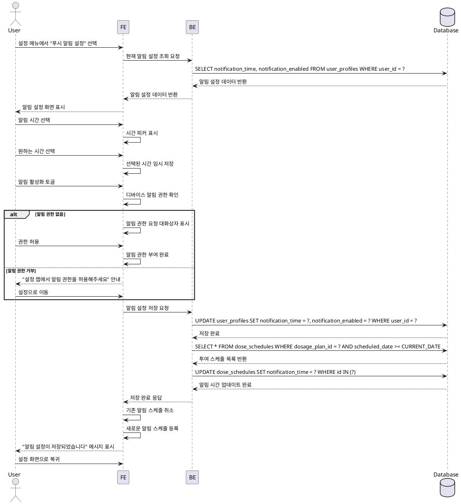

# UF-012: 푸시 알림 설정

## Primary Actor
GLP-1 치료 중인 사용자

## Precondition
- 사용자가 로그인 상태
- 투여 계획이 등록되어 있음
- 설정 화면에 접근 가능

## Trigger
- 사용자가 설정 메뉴에서 "푸시 알림 설정" 선택
- 투여 알림 시간 조정 필요
- 알림 활성화 또는 비활성화 필요

## Main Scenario

### 1. 알림 설정 화면 진입
1. 사용자가 설정 메뉴에서 "푸시 알림 설정" 선택
2. 시스템이 현재 알림 설정 상태 조회
3. 시스템이 알림 설정 화면 표시

### 2. 알림 시간 설정
1. 사용자가 투여 알림 시간 선택 UI 클릭
2. 시스템이 시간 선택 피커 표시
3. 사용자가 원하는 알림 시간 선택
4. 시스템이 선택된 시간 저장

### 3. 알림 활성화/비활성화
1. 사용자가 알림 토글 스위치 조작
2. 시스템이 디바이스 알림 권한 상태 확인
3. 권한이 부여된 경우: 토글 상태 변경 및 저장
4. 권한이 부여되지 않은 경우: 권한 요청 플로우 실행

### 4. 알림 권한 요청
1. 시스템이 알림 권한 요청 대화상자 표시
2. 사용자가 권한 허용 선택: 알림 활성화
3. 사용자가 권한 거부 선택: 설정 앱으로 이동 안내 표시

### 5. 알림 스케줄 업데이트
1. 시스템이 투여 스케줄 조회
2. 시스템이 설정된 알림 시간 기반으로 알림 스케줄 생성
3. 시스템이 기존 알림 스케줄 취소
4. 시스템이 새로운 알림 스케줄 등록

### 6. 저장 완료
1. 시스템이 변경사항 저장 완료
2. 시스템이 확인 메시지 표시
3. 사용자가 설정 화면으로 복귀

## Edge Cases

### EC1. 디바이스 알림 권한 거부
- 사용자가 알림 권한을 거부한 경우
- 시스템이 설정 앱으로 이동 유도 메시지 표시
- "설정으로 이동" 버튼 제공

### EC2. 여러 투여 예정일이 같은 날
- 같은 날에 여러 투여 예정인 경우
- 시스템이 해당 날짜에 알림 한 번만 발송

### EC3. 알림 시간이 투여 예정일 이후
- 설정된 알림 시간이 이미 지난 경우
- 시스템이 다음날 동일 시간에 알림 예약

### EC4. 알림 설정 변경 후 즉시 반영 불가
- 알림 설정 변경 직후 투여 예정일인 경우
- 시스템이 "다음 알림부터 적용됩니다" 안내 메시지 표시

### EC5. 알림 권한 재요청
- 이전에 권한을 거부한 사용자가 알림 활성화 시도
- 시스템이 직접 설정 앱으로 이동하도록 안내

### EC6. 네트워크 오류로 저장 실패
- 설정 저장 중 네트워크 오류 발생
- 시스템이 로컬에 임시 저장 후 재시도 큐 등록
- 사용자에게 에러 메시지 및 재시도 안내

### EC7. 앱 백그라운드 제한
- 디바이스의 배터리 최적화로 백그라운드 제한된 경우
- 시스템이 배터리 최적화 예외 설정 안내

## Business Rules

### BR1. 알림 시간 설정
- 알림 시간은 24시간 형식으로 설정 가능
- 기본 알림 시간: 오전 9시
- 사용자는 투여 예정일마다 동일한 시간에 알림 수신

### BR2. 알림 권한 관리
- 알림 권한은 디바이스 설정에 의존
- 권한 거부 시 인앱 알림 대체 수단 제공 불가
- 사용자가 수동으로 설정 앱에서 권한 부여 필요

### BR3. 알림 스케줄 관리
- 알림은 투여 예정일 당일 지정 시간에 발송
- 투여 계획 변경 시 알림 스케줄 자동 재계산
- 투여 완료 기록 시 해당 알림 자동 취소

### BR4. 알림 내용
- 알림 제목: "투여 예정일 알림"
- 알림 본문: "오늘은 {약물명} {용량}mg 투여일입니다"
- 알림 터치 시 투여 스케줄러 화면으로 이동

### BR5. 알림 활성화 상태
- 알림 비활성화 시 모든 예정 알림 취소
- 알림 재활성화 시 현재 시점 이후 알림만 재등록
- 알림 상태는 사용자 프로필에 저장

### BR6. 복수 디바이스 지원
- Phase 1 (클라우드 동기화) 이후 지원
- 각 디바이스에서 독립적으로 알림 설정 관리
- 서버는 알림 설정 동기화하지 않음 (로컬 설정)

### BR7. 데이터 저장
- 알림 시간: user_profiles 테이블에 저장
- 알림 활성화 상태: user_profiles 테이블에 저장
- 알림 스케줄: dose_schedules 테이블의 notification_time 컬럼 사용

## Sequence Diagram

