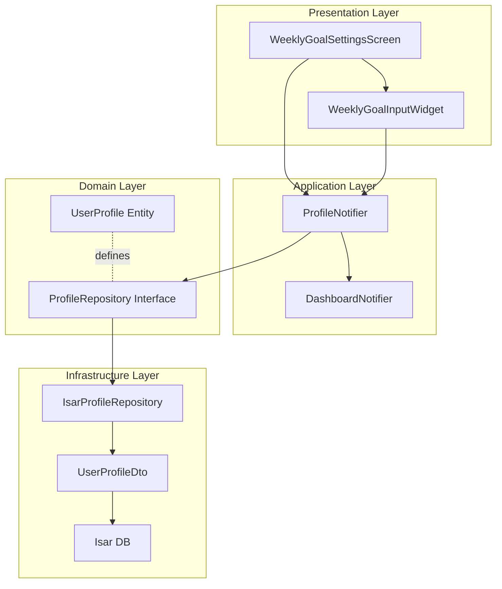

# UF-013: 주간 기록 목표 조정 Implementation Plan

## 1. 개요

주간 체중 기록 목표와 부작용 기록 목표를 사용자가 직접 조정할 수 있는 기능을 구현한다. 목표 변경 시 홈 대시보드의 주간 진행도가 즉시 재계산된다.

**모듈 목록:**
- **Domain**: UserProfile Entity, ProfileRepository Interface
- **Infrastructure**: IsarProfileRepository, UserProfileDto
- **Application**: ProfileNotifier (목표 업데이트 메서드 추가)
- **Presentation**: WeeklyGoalSettingsScreen, WeeklyGoalInputWidget

**TDD 적용 범위:**
- Domain Layer: 100% (Entity 비즈니스 로직)
- Application Layer: 100% (Notifier 상태 관리)
- Infrastructure Layer: 100% (Repository 구현)
- Presentation Layer: Manual QA (위젯 테스트)

---

## 2. Architecture Diagram



**데이터 흐름:**
1. User Input (Screen) → ProfileNotifier.updateWeeklyGoals()
2. ProfileNotifier → ProfileRepository.updateWeeklyGoals()
3. IsarProfileRepository → Isar DB (UPDATE user_profiles)
4. ProfileNotifier → invalidate DashboardNotifier
5. DashboardNotifier → recalculate weekly progress
6. UI → reflect updated progress

---

## 3. Implementation Plan

### 3.1. Domain Layer: UserProfile Entity

**Location**: `lib/features/profile/domain/entities/user_profile.dart`

**Responsibility**:
- 주간 목표 데이터 모델 정의
- 주간 목표 검증 로직 (0~7 범위)

**Test Strategy**: Unit Test

**Test Scenarios (Red Phase)**:
```dart
describe('UserProfile Entity')
  test('주간 체중 기록 목표가 0~7 범위 내인지 검증')
    // Arrange: weeklyWeightRecordGoal = -1
    // Act: UserProfile 생성
    // Assert: ArgumentError 발생

  test('주간 부작용 기록 목표가 0~7 범위 내인지 검증')
    // Arrange: weeklySymptomRecordGoal = 8
    // Act: UserProfile 생성
    // Assert: ArgumentError 발생

  test('유효한 주간 목표로 UserProfile 생성 성공')
    // Arrange: weeklyWeightRecordGoal = 5, weeklySymptomRecordGoal = 3
    // Act: UserProfile 생성
    // Assert: 생성 성공, 필드 값 일치

  test('copyWith로 주간 목표만 변경 가능')
    // Arrange: 기존 UserProfile
    // Act: copyWith(weeklyWeightRecordGoal: 4)
    // Assert: 목표만 변경, 나머지 필드 유지

  test('주간 목표 0 허용 (경고용)')
    // Arrange: weeklyWeightRecordGoal = 0
    // Act: UserProfile 생성
    // Assert: 생성 성공
```

**Implementation Order (TDD Cycle)**:
1. Red: 테스트 작성 (Entity 검증 로직)
2. Green: Entity에 검증 로직 추가
3. Refactor: Entity 불변성 확인

**Dependencies**: 없음 (Pure Dart)

---

### 3.2. Domain Layer: ProfileRepository Interface

**Location**: `lib/features/profile/domain/repositories/profile_repository.dart`

**Responsibility**:
- UserProfile CRUD 인터페이스 정의
- updateWeeklyGoals 메서드 시그니처 정의

**Test Strategy**: Unit Test (Mock 사용)

**Test Scenarios (Red Phase)**:
```dart
describe('ProfileRepository Interface')
  test('updateWeeklyGoals 메서드 시그니처 존재')
    // Arrange: Mock ProfileRepository
    // Act: updateWeeklyGoals(userId, 5, 3) 호출
    // Assert: 메서드 호출 성공

  test('updateWeeklyGoals 반환 타입 Future<void>')
    // Arrange: Mock ProfileRepository
    // Act: updateWeeklyGoals() 실행
    // Assert: Future<void> 반환
```

**Implementation Order (TDD Cycle)**:
1. Red: 테스트 작성 (Interface 메서드 시그니처)
2. Green: Interface에 updateWeeklyGoals 추가
3. Refactor: 메서드 문서화

**Dependencies**: UserProfile Entity

---

### 3.3. Infrastructure Layer: UserProfileDto

**Location**: `lib/features/profile/infrastructure/dtos/user_profile_dto.dart`

**Responsibility**:
- Isar DB 스키마 정의
- Entity ↔ DTO 변환

**Test Strategy**: Unit Test

**Test Scenarios (Red Phase)**:
```dart
describe('UserProfileDto')
  test('Entity → DTO 변환 (fromEntity)')
    // Arrange: UserProfile Entity
    // Act: UserProfileDto.fromEntity(profile)
    // Assert: DTO 필드 값 일치

  test('DTO → Entity 변환 (toEntity)')
    // Arrange: UserProfileDto
    // Act: dto.toEntity()
    // Assert: Entity 필드 값 일치

  test('주간 목표 필드 NOT NULL 제약 확인')
    // Arrange: weeklyWeightRecordGoal = null
    // Act: DTO 생성 시도
    // Assert: 컴파일 에러 또는 실행 시 에러

  test('주간 목표 기본값 7 설정')
    // Arrange: 기본값 사용
    // Act: DTO 생성
    // Assert: weeklyWeightRecordGoal = 7, weeklySymptomRecordGoal = 7
```

**Implementation Order (TDD Cycle)**:
1. Red: 테스트 작성 (DTO ↔ Entity 변환)
2. Green: DTO 구현 (fromEntity/toEntity)
3. Refactor: 변환 로직 최적화

**Dependencies**: UserProfile Entity, Isar

---

### 3.4. Infrastructure Layer: IsarProfileRepository

**Location**: `lib/features/profile/infrastructure/repositories/isar_profile_repository.dart`

**Responsibility**:
- ProfileRepository 구현
- Isar DB 접근 및 트랜잭션 관리

**Test Strategy**: Integration Test (Isar Test Instance)

**Test Scenarios (Red Phase)**:
```dart
describe('IsarProfileRepository.updateWeeklyGoals')
  test('주간 목표 업데이트 성공')
    // Arrange: Isar DB에 UserProfile 존재
    // Act: updateWeeklyGoals(userId, 5, 3)
    // Assert: DB에서 조회 시 목표 변경 확인

  test('updated_at 필드 갱신 확인')
    // Arrange: 기존 UserProfile (updated_at = t1)
    // Act: updateWeeklyGoals()
    // Assert: updated_at = t2 (t2 > t1)

  test('존재하지 않는 userId로 업데이트 시도')
    // Arrange: 존재하지 않는 userId
    // Act: updateWeeklyGoals(invalidUserId, 5, 3)
    // Assert: RepositoryException 발생

  test('트랜잭션 실패 시 롤백')
    // Arrange: DB 트랜잭션 중 에러 발생
    // Act: updateWeeklyGoals()
    // Assert: 변경사항 롤백, 기존 값 유지

  test('동시 업데이트 요청 처리 (Race Condition)')
    // Arrange: 동시에 2개 업데이트 요청
    // Act: 병렬 updateWeeklyGoals() 실행
    // Assert: 마지막 요청 값으로 저장
```

**Implementation Order (TDD Cycle)**:
1. Red: 테스트 작성 (Repository 메서드)
2. Green: Repository 구현 (Isar 트랜잭션)
3. Refactor: 에러 핸들링 강화

**Dependencies**: ProfileRepository Interface, UserProfileDto, Isar

---

### 3.5. Application Layer: ProfileNotifier

**Location**: `lib/features/profile/application/notifiers/profile_notifier.dart`

**Responsibility**:
- UserProfile 상태 관리
- updateWeeklyGoals 메서드 제공
- DashboardNotifier invalidation 트리거

**Test Strategy**: Unit Test (Mock Repository)

**Test Scenarios (Red Phase)**:
```dart
describe('ProfileNotifier.updateWeeklyGoals')
  test('목표 업데이트 성공 시 상태 갱신')
    // Arrange: Mock ProfileRepository
    // Act: notifier.updateWeeklyGoals(5, 3)
    // Assert: state = AsyncValue.data(updatedProfile)

  test('목표 업데이트 실패 시 에러 상태')
    // Arrange: Repository가 RepositoryException 발생
    // Act: notifier.updateWeeklyGoals(5, 3)
    // Assert: state = AsyncValue.error(exception)

  test('목표 업데이트 중 로딩 상태')
    // Arrange: 비동기 Repository
    // Act: notifier.updateWeeklyGoals(5, 3) (완료 전)
    // Assert: state = AsyncValue.loading()

  test('DashboardNotifier invalidate 트리거')
    // Arrange: Mock DashboardNotifier
    // Act: notifier.updateWeeklyGoals(5, 3)
    // Assert: ref.invalidate(dashboardNotifierProvider) 호출 확인

  test('유효하지 않은 목표 값 입력 시 에러')
    // Arrange: weeklyWeightRecordGoal = -1
    // Act: notifier.updateWeeklyGoals(-1, 3)
    // Assert: ArgumentError 발생
```

**Implementation Order (TDD Cycle)**:
1. Red: 테스트 작성 (Notifier 상태 전환)
2. Green: Notifier 메서드 구현
3. Refactor: 상태 관리 로직 정리

**Dependencies**: ProfileRepository, DashboardNotifier

---

### 3.6. Presentation Layer: WeeklyGoalSettingsScreen

**Location**: `lib/features/profile/presentation/screens/weekly_goal_settings_screen.dart`

**Responsibility**:
- 주간 목표 조정 화면 렌더링
- 입력 검증 및 사용자 피드백
- ProfileNotifier 호출

**Test Strategy**: Manual QA (아래 QA Sheet 참고)

**Implementation Order**:
1. Screen 기본 구조 구현 (Scaffold, AppBar)
2. WeeklyGoalInputWidget 통합
3. 저장 버튼 및 ProfileNotifier 연동
4. AsyncValue 상태별 UI 처리 (loading/error/data)
5. 성공 시 SnackBar 표시 후 Navigator.pop()

**Dependencies**: ProfileNotifier, WeeklyGoalInputWidget

**QA Sheet**:

| Test Case | Steps | Expected Result |
|-----------|-------|-----------------|
| 화면 진입 | 설정 메뉴 → 주간 기록 목표 조정 선택 | 현재 목표 값이 입력 필드에 표시됨 |
| 유효한 값 입력 | 체중 목표: 5, 부작용 목표: 3 입력 → 저장 | 저장 성공 메시지, 설정 화면으로 복귀 |
| 0 입력 | 체중 목표: 0 입력 → 저장 | 경고 메시지 표시 후 저장 허용 |
| 음수 입력 | 체중 목표: -1 입력 → 저장 | 에러 메시지: "0 이상의 값을 입력하세요" |
| 7 초과 입력 | 체중 목표: 8 입력 → 저장 | 에러 메시지: "주간 목표는 최대 7회입니다" |
| 비정수 입력 | 체중 목표: 3.5 입력 | 에러 메시지: "정수만 입력 가능합니다" |
| 변경사항 없이 저장 | 기존 값 그대로 → 저장 | 저장 성공, 화면 복귀 |
| 홈 대시보드 반영 | 목표 변경 후 홈 화면 이동 | 주간 진행도가 새 목표 기준으로 표시됨 |
| 네트워크 오류 | 저장 중 DB 에러 발생 | 에러 메시지 및 재시도 옵션 표시 |

---

### 3.7. Presentation Layer: WeeklyGoalInputWidget

**Location**: `lib/features/profile/presentation/widgets/weekly_goal_input_widget.dart`

**Responsibility**:
- 숫자 입력 필드 렌더링
- 실시간 입력 검증
- 입력값 콜백 전달

**Test Strategy**: Manual QA

**Implementation Order**:
1. TextFormField 구현 (키보드 타입: 숫자)
2. 실시간 검증 로직 (0~7 범위)
3. 에러 메시지 표시
4. onChanged 콜백 구현

**Dependencies**: 없음 (Pure Widget)

---

## 4. TDD Workflow

### Phase 1: Domain Layer (Outside-In)
1. **Red**: UserProfile Entity 테스트 작성
2. **Green**: Entity 검증 로직 구현
3. **Refactor**: Entity 불변성 확인
4. **Red**: ProfileRepository Interface 테스트 작성
5. **Green**: Interface 메서드 추가
6. **Refactor**: 메서드 문서화

**Commit Point**: Domain Layer 완료 (Entity + Interface)

---

### Phase 2: Infrastructure Layer
1. **Red**: UserProfileDto 변환 테스트 작성
2. **Green**: DTO 변환 로직 구현
3. **Refactor**: 변환 로직 최적화
4. **Red**: IsarProfileRepository 테스트 작성 (Isar Test Instance)
5. **Green**: Repository 구현 (Isar 트랜잭션)
6. **Refactor**: 에러 핸들링 강화

**Commit Point**: Infrastructure Layer 완료 (DTO + Repository)

---

### Phase 3: Application Layer
1. **Red**: ProfileNotifier 테스트 작성 (Mock Repository)
2. **Green**: Notifier 메서드 구현
3. **Refactor**: 상태 관리 로직 정리
4. **Red**: DashboardNotifier invalidation 테스트 추가
5. **Green**: invalidate 로직 추가
6. **Refactor**: 의존성 정리

**Commit Point**: Application Layer 완료 (Notifier + State Management)

---

### Phase 4: Presentation Layer
1. WeeklyGoalInputWidget 구현
2. WeeklyGoalSettingsScreen 구현
3. Manual QA 수행 (QA Sheet 기반)
4. UI 개선 및 UX 최적화

**Commit Point**: Feature 완료 (All Layers Integrated)

---

### Phase 5: Integration Test
1. End-to-End 시나리오 테스트
   - 설정 화면 → 목표 변경 → 홈 대시보드 확인
   - 변경사항 DB 저장 확인
   - 진행도 재계산 확인
2. Edge Case 검증
   - 네트워크 오류
   - 동시 업데이트
   - 입력 검증

**Commit Point**: Integration Test 통과

---

## 5. 핵심 원칙 준수

### Layer Dependency
```
Presentation → Application → Domain ← Infrastructure
```
- Presentation은 ProfileNotifier만 의존
- Application은 ProfileRepository Interface만 의존
- Infrastructure는 Domain의 Interface 구현

### Repository Pattern
```
ProfileNotifier → ProfileRepository Interface
                → IsarProfileRepository Implementation
```
- Phase 1 전환 시 SupabaseProfileRepository로 1줄 변경

### TDD Cycle
```
Red (테스트 작성) → Green (최소 구현) → Refactor (리팩토링)
```
- 모든 Domain/Application/Infrastructure는 테스트 우선
- Presentation은 Manual QA로 검증

### Test Pyramid
- Unit Test: 70% (Domain + Application + Infrastructure)
- Integration Test: 20% (Repository + Notifier)
- Manual QA: 10% (Presentation)

---

## 6. 완료 기준

- [ ] UserProfile Entity 검증 로직 구현 및 테스트 통과
- [ ] ProfileRepository Interface 정의
- [ ] UserProfileDto 변환 로직 구현 및 테스트 통과
- [ ] IsarProfileRepository 구현 및 Integration Test 통과
- [ ] ProfileNotifier 상태 관리 구현 및 Unit Test 통과
- [ ] DashboardNotifier invalidation 연동 확인
- [ ] WeeklyGoalSettingsScreen Manual QA 완료
- [ ] 홈 대시보드 진행도 재계산 확인
- [ ] 모든 Edge Case 처리 확인
- [ ] 코드 리뷰 및 리팩토링 완료
