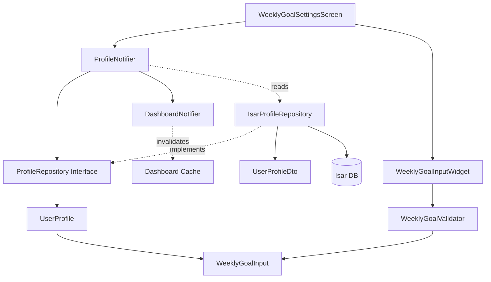

# UF-013: 주간 기록 목표 조정 - Implementation Plan (TDD)

## 1. 개요

주간 기록 목표 조정 기능은 사용자가 체중 및 부작용 기록의 주간 목표 횟수를 수정할 수 있는 기능이다. 모든 구현은 TDD(Red → Green → Refactor) 사이클을 엄격히 따른다.

### 모듈 구성

| Module | Location | Layer | TDD Strategy |
|--------|----------|-------|--------------|
| WeeklyGoalInput | domain/entities/ | Domain | Inside-Out (Unit) |
| UserProfile | domain/entities/ | Domain | Inside-Out (Unit) |
| ProfileRepository | domain/repositories/ | Domain | Inside-Out (Unit) |
| IsarProfileRepository | infrastructure/repositories/ | Infrastructure | Integration |
| ProfileNotifier | application/notifiers/ | Application | Inside-Out (Unit) |
| DashboardNotifier | application/notifiers/ | Application | Integration |
| WeeklyGoalSettingsScreen | presentation/screens/ | Presentation | Outside-In (Widget) |
| WeeklyGoalInputWidget | presentation/widgets/ | Presentation | Outside-In (Widget) |

### TDD 적용 범위
- **Unit Tests (70%)**: Domain Entities, UseCases, Validation Logic
- **Integration Tests (20%)**: Repository, Notifier State Changes
- **Widget Tests (10%)**: UI Components, User Interactions

---

## 2. Architecture Diagram



---

## 3. Implementation Plan

### 3.1. WeeklyGoalInput (Value Object)

**Location**: `lib/features/profile/domain/entities/weekly_goal_input.dart`

**Responsibility**: 주간 목표 입력값 검증 및 불변성 보장

**Test Strategy**: Unit Test (Inside-Out)

**Test Scenarios (Red Phase)**:

```dart
// Test File: test/features/profile/domain/entities/weekly_goal_input_test.dart

group('WeeklyGoalInput Validation', () {
  // AAA Pattern
  test('should create valid WeeklyGoalInput with value 0', () {
    // Arrange & Act
    final goal = WeeklyGoalInput(value: 0);

    // Assert
    expect(goal.value, 0);
  });

  test('should create valid WeeklyGoalInput with value 7', () {
    // Arrange & Act
    final goal = WeeklyGoalInput(value: 7);

    // Assert
    expect(goal.value, 7);
  });

  test('should throw exception when value is negative', () {
    // Arrange, Act & Assert
    expect(
      () => WeeklyGoalInput(value: -1),
      throwsA(isA<InvalidWeeklyGoalException>()),
    );
  });

  test('should throw exception when value exceeds 7', () {
    // Arrange, Act & Assert
    expect(
      () => WeeklyGoalInput(value: 8),
      throwsA(isA<InvalidWeeklyGoalException>()),
    );
  });

  test('should be equal when values are same', () {
    // Arrange
    final goal1 = WeeklyGoalInput(value: 5);
    final goal2 = WeeklyGoalInput(value: 5);

    // Act & Assert
    expect(goal1, goal2);
  });
});
```

**Implementation Order (TDD Cycle)**:
1. RED: Write test for valid value 0
2. GREEN: Implement minimal constructor
3. RED: Write test for valid value 7
4. GREEN: Keep implementation minimal
5. RED: Write test for negative value exception
6. GREEN: Add validation logic
7. RED: Write test for value > 7 exception
8. GREEN: Complete validation
9. RED: Write equality test
10. GREEN: Override `==` and `hashCode`
11. REFACTOR: Extract validation logic, improve naming

**Dependencies**: None (Pure Dart)

---

### 3.2. UserProfile (Entity Update)

**Location**: `lib/features/profile/domain/entities/user_profile.dart`

**Responsibility**: 사용자 프로필 도메인 모델 (주간 목표 필드 포함)

**Test Strategy**: Unit Test (Inside-Out)

**Test Scenarios (Red Phase)**:

```dart
// Test File: test/features/profile/domain/entities/user_profile_test.dart

group('UserProfile Weekly Goal Management', () {
  test('should create UserProfile with default weekly goals', () {
    // Arrange & Act
    final profile = UserProfile(
      userId: 'user1',
      targetWeightKg: 70.0,
      weeklyWeightRecordGoal: WeeklyGoalInput(value: 7),
      weeklySymptomRecordGoal: WeeklyGoalInput(value: 7),
    );

    // Assert
    expect(profile.weeklyWeightRecordGoal.value, 7);
    expect(profile.weeklySymptomRecordGoal.value, 7);
  });

  test('should update weekly weight goal', () {
    // Arrange
    final profile = UserProfile(
      userId: 'user1',
      targetWeightKg: 70.0,
      weeklyWeightRecordGoal: WeeklyGoalInput(value: 7),
      weeklySymptomRecordGoal: WeeklyGoalInput(value: 7),
    );

    // Act
    final updated = profile.copyWith(
      weeklyWeightRecordGoal: WeeklyGoalInput(value: 5),
    );

    // Assert
    expect(updated.weeklyWeightRecordGoal.value, 5);
    expect(updated.weeklySymptomRecordGoal.value, 7); // unchanged
  });

  test('should update weekly symptom goal', () {
    // Arrange
    final profile = UserProfile(
      userId: 'user1',
      targetWeightKg: 70.0,
      weeklyWeightRecordGoal: WeeklyGoalInput(value: 7),
      weeklySymptomRecordGoal: WeeklyGoalInput(value: 7),
    );

    // Act
    final updated = profile.copyWith(
      weeklySymptomRecordGoal: WeeklyGoalInput(value: 3),
    );

    // Assert
    expect(updated.weeklySymptomRecordGoal.value, 3);
    expect(updated.weeklyWeightRecordGoal.value, 7); // unchanged
  });
});
```

**Implementation Order (TDD Cycle)**:
1. RED: Write test for default goals
2. GREEN: Add fields to UserProfile entity
3. RED: Write test for updating weight goal
4. GREEN: Implement `copyWith` method
5. RED: Write test for updating symptom goal
6. GREEN: Complete `copyWith` logic
7. REFACTOR: Ensure immutability

**Dependencies**: WeeklyGoalInput

---

### 3.3. ProfileRepository (Interface)

**Location**: `lib/features/profile/domain/repositories/profile_repository.dart`

**Responsibility**: 프로필 데이터 접근 추상화

**Test Strategy**: Unit Test (Mock Implementation)

**Test Scenarios (Red Phase)**:

```dart
// Test File: test/features/profile/domain/repositories/profile_repository_test.dart

group('ProfileRepository Interface', () {
  late ProfileRepository repository;

  setUp(() {
    repository = MockProfileRepository();
  });

  test('should update weekly goals', () async {
    // Arrange
    final profile = UserProfile(
      userId: 'user1',
      targetWeightKg: 70.0,
      weeklyWeightRecordGoal: WeeklyGoalInput(value: 5),
      weeklySymptomRecordGoal: WeeklyGoalInput(value: 3),
    );

    when(() => repository.updateWeeklyGoals(
      userId: 'user1',
      weightGoal: 5,
      symptomGoal: 3,
    )).thenAnswer((_) async => profile);

    // Act
    final result = await repository.updateWeeklyGoals(
      userId: 'user1',
      weightGoal: 5,
      symptomGoal: 3,
    );

    // Assert
    expect(result.weeklyWeightRecordGoal.value, 5);
    expect(result.weeklySymptomRecordGoal.value, 3);
  });

  test('should throw exception on invalid data', () async {
    // Arrange
    when(() => repository.updateWeeklyGoals(
      userId: 'user1',
      weightGoal: -1,
      symptomGoal: 3,
    )).thenThrow(InvalidWeeklyGoalException());

    // Act & Assert
    expect(
      () => repository.updateWeeklyGoals(
        userId: 'user1',
        weightGoal: -1,
        symptomGoal: 3,
      ),
      throwsA(isA<InvalidWeeklyGoalException>()),
    );
  });
});
```

**Implementation Order (TDD Cycle)**:
1. RED: Write interface test with mock
2. GREEN: Define abstract method signatures
3. RED: Write exception test
4. GREEN: Document expected exceptions
5. REFACTOR: Add documentation

**Dependencies**: UserProfile

---

### 3.4. IsarProfileRepository (Implementation)

**Location**: `lib/features/profile/infrastructure/repositories/isar_profile_repository.dart`

**Responsibility**: Isar DB를 통한 프로필 데이터 영속화

**Test Strategy**: Integration Test (Real Isar Instance)

**Test Scenarios (Red Phase)**:

```dart
// Test File: test/features/profile/infrastructure/repositories/isar_profile_repository_test.dart

group('IsarProfileRepository Integration', () {
  late Isar isar;
  late IsarProfileRepository repository;

  setUp(() async {
    isar = await Isar.open(
      [UserProfileDtoSchema],
      directory: await getTemporaryDirectory(),
      name: 'test_isar_${DateTime.now().millisecondsSinceEpoch}',
    );
    repository = IsarProfileRepository(isar);
  });

  tearDown(() async {
    await isar.close(deleteFromDisk: true);
  });

  test('should update weekly goals and persist to DB', () async {
    // Arrange
    final initialDto = UserProfileDto()
      ..userId = 'user1'
      ..targetWeightKg = 70.0
      ..weeklyWeightRecordGoal = 7
      ..weeklySymptomRecordGoal = 7;

    await isar.writeTxn(() => isar.userProfileDtos.put(initialDto));

    // Act
    final updated = await repository.updateWeeklyGoals(
      userId: 'user1',
      weightGoal: 5,
      symptomGoal: 3,
    );

    // Assert
    expect(updated.weeklyWeightRecordGoal.value, 5);
    expect(updated.weeklySymptomRecordGoal.value, 3);

    // Verify persistence
    final fromDb = await isar.userProfileDtos
        .filter()
        .userIdEqualTo('user1')
        .findFirst();
    expect(fromDb?.weeklyWeightRecordGoal, 5);
    expect(fromDb?.weeklySymptomRecordGoal, 3);
  });

  test('should throw exception when user not found', () async {
    // Act & Assert
    expect(
      () => repository.updateWeeklyGoals(
        userId: 'nonexistent',
        weightGoal: 5,
        symptomGoal: 3,
      ),
      throwsA(isA<UserNotFoundException>()),
    );
  });

  test('should validate goals before saving', () async {
    // Arrange
    final initialDto = UserProfileDto()
      ..userId = 'user1'
      ..targetWeightKg = 70.0;
    await isar.writeTxn(() => isar.userProfileDtos.put(initialDto));

    // Act & Assert
    expect(
      () => repository.updateWeeklyGoals(
        userId: 'user1',
        weightGoal: 8, // Invalid
        symptomGoal: 3,
      ),
      throwsA(isA<InvalidWeeklyGoalException>()),
    );
  });

  test('should update updatedAt timestamp', () async {
    // Arrange
    final before = DateTime.now();
    final initialDto = UserProfileDto()
      ..userId = 'user1'
      ..targetWeightKg = 70.0
      ..weeklyWeightRecordGoal = 7
      ..weeklySymptomRecordGoal = 7
      ..updatedAt = before;
    await isar.writeTxn(() => isar.userProfileDtos.put(initialDto));

    await Future.delayed(Duration(milliseconds: 10));

    // Act
    await repository.updateWeeklyGoals(
      userId: 'user1',
      weightGoal: 5,
      symptomGoal: 3,
    );

    // Assert
    final fromDb = await isar.userProfileDtos
        .filter()
        .userIdEqualTo('user1')
        .findFirst();
    expect(fromDb!.updatedAt.isAfter(before), true);
  });
});
```

**Implementation Order (TDD Cycle)**:
1. RED: Write test for basic update
2. GREEN: Implement updateWeeklyGoals method
3. RED: Write test for user not found
4. GREEN: Add null check and exception
5. RED: Write test for validation
6. GREEN: Add validation before save
7. RED: Write test for timestamp update
8. GREEN: Update updatedAt field
9. REFACTOR: Extract transaction logic, improve error handling

**Dependencies**: Isar, UserProfileDto, ProfileRepository

---

### 3.5. ProfileNotifier (Application State)

**Location**: `lib/features/profile/application/notifiers/profile_notifier.dart`

**Responsibility**: 프로필 상태 관리 및 주간 목표 업데이트 오케스트레이션

**Test Strategy**: Unit Test (Mock Repository)

**Test Scenarios (Red Phase)**:

```dart
// Test File: test/features/profile/application/notifiers/profile_notifier_test.dart

group('ProfileNotifier Weekly Goals Update', () {
  late ProfileRepository mockRepository;
  late ProviderContainer container;

  setUp(() {
    mockRepository = MockProfileRepository();
    container = ProviderContainer(
      overrides: [
        profileRepositoryProvider.overrideWithValue(mockRepository),
      ],
    );
  });

  tearDown(() {
    container.dispose();
  });

  test('should update weekly goals successfully', () async {
    // Arrange
    final updatedProfile = UserProfile(
      userId: 'user1',
      targetWeightKg: 70.0,
      weeklyWeightRecordGoal: WeeklyGoalInput(value: 5),
      weeklySymptomRecordGoal: WeeklyGoalInput(value: 3),
    );

    when(() => mockRepository.updateWeeklyGoals(
      userId: 'user1',
      weightGoal: 5,
      symptomGoal: 3,
    )).thenAnswer((_) async => updatedProfile);

    final notifier = container.read(profileNotifierProvider.notifier);

    // Act
    await notifier.updateWeeklyGoals(
      weightGoal: 5,
      symptomGoal: 3,
    );

    // Assert
    final state = container.read(profileNotifierProvider);
    expect(state.value?.weeklyWeightRecordGoal.value, 5);
    expect(state.value?.weeklySymptomRecordGoal.value, 3);
  });

  test('should handle validation error', () async {
    // Arrange
    when(() => mockRepository.updateWeeklyGoals(
      userId: 'user1',
      weightGoal: -1,
      symptomGoal: 3,
    )).thenThrow(InvalidWeeklyGoalException());

    final notifier = container.read(profileNotifierProvider.notifier);

    // Act
    await notifier.updateWeeklyGoals(
      weightGoal: -1,
      symptomGoal: 3,
    );

    // Assert
    final state = container.read(profileNotifierProvider);
    expect(state.hasError, true);
    expect(state.error, isA<InvalidWeeklyGoalException>());
  });

  test('should emit loading state during update', () async {
    // Arrange
    final updatedProfile = UserProfile(
      userId: 'user1',
      targetWeightKg: 70.0,
      weeklyWeightRecordGoal: WeeklyGoalInput(value: 5),
      weeklySymptomRecordGoal: WeeklyGoalInput(value: 3),
    );

    when(() => mockRepository.updateWeeklyGoals(
      userId: 'user1',
      weightGoal: 5,
      symptomGoal: 3,
    )).thenAnswer((_) async {
      await Future.delayed(Duration(milliseconds: 100));
      return updatedProfile;
    });

    final notifier = container.read(profileNotifierProvider.notifier);

    // Act
    final future = notifier.updateWeeklyGoals(
      weightGoal: 5,
      symptomGoal: 3,
    );

    // Assert - Loading
    await Future.delayed(Duration(milliseconds: 10));
    expect(container.read(profileNotifierProvider).isLoading, true);

    // Assert - Data
    await future;
    expect(container.read(profileNotifierProvider).hasValue, true);
  });
});
```

**Implementation Order (TDD Cycle)**:
1. RED: Write test for successful update
2. GREEN: Implement updateWeeklyGoals method
3. RED: Write test for validation error
4. GREEN: Add error handling
5. RED: Write test for loading state
6. GREEN: Use AsyncValue.guard pattern
7. REFACTOR: Extract business logic, improve state transitions

**Dependencies**: ProfileRepository, Riverpod

---

### 3.6. DashboardNotifier Invalidation

**Location**: `lib/features/dashboard/application/notifiers/dashboard_notifier.dart`

**Responsibility**: 주간 목표 변경 시 대시보드 데이터 재계산

**Test Strategy**: Integration Test (Multiple Notifiers)

**Test Scenarios (Red Phase)**:

```dart
// Test File: test/features/dashboard/application/notifiers/dashboard_notifier_test.dart

group('DashboardNotifier Goal Change Handling', () {
  test('should recalculate progress when weekly goals change', () async {
    // Arrange
    final container = ProviderContainer(
      overrides: [
        profileRepositoryProvider.overrideWithValue(mockProfileRepo),
        trackingRepositoryProvider.overrideWithValue(mockTrackingRepo),
      ],
    );

    // Initial state
    when(() => mockProfileRepo.getUserProfile('user1')).thenAnswer(
      (_) async => UserProfile(
        userId: 'user1',
        targetWeightKg: 70.0,
        weeklyWeightRecordGoal: WeeklyGoalInput(value: 7),
        weeklySymptomRecordGoal: WeeklyGoalInput(value: 7),
      ),
    );

    when(() => mockTrackingRepo.getWeeklyRecordCount('user1'))
        .thenAnswer((_) async => (weightCount: 5, symptomCount: 3));

    await container.read(dashboardNotifierProvider.future);

    // Act - Update goals
    when(() => mockProfileRepo.updateWeeklyGoals(
      userId: 'user1',
      weightGoal: 5,
      symptomGoal: 3,
    )).thenAnswer((_) async => UserProfile(
      userId: 'user1',
      targetWeightKg: 70.0,
      weeklyWeightRecordGoal: WeeklyGoalInput(value: 5),
      weeklySymptomRecordGoal: WeeklyGoalInput(value: 3),
    ));

    await container.read(profileNotifierProvider.notifier)
        .updateWeeklyGoals(weightGoal: 5, symptomGoal: 3);

    // Wait for dashboard refresh
    await Future.delayed(Duration(milliseconds: 100));

    // Assert
    final dashboardState = await container.read(
      dashboardNotifierProvider.future,
    );
    expect(dashboardState.weeklyProgress.weightRate, 1.0); // 5/5 = 100%
    expect(dashboardState.weeklyProgress.symptomRate, 1.0); // 3/3 = 100%
  });
});
```

**Implementation Order (TDD Cycle)**:
1. RED: Write integration test for recalculation
2. GREEN: Add listener to ProfileNotifier in DashboardNotifier
3. RED: Write test for rate calculation accuracy
4. GREEN: Implement correct formula
5. REFACTOR: Optimize invalidation logic

**Dependencies**: ProfileNotifier, TrackingRepository

---

### 3.7. WeeklyGoalInputWidget

**Location**: `lib/features/profile/presentation/widgets/weekly_goal_input_widget.dart`

**Responsibility**: 주간 목표 입력 UI 컴포넌트

**Test Strategy**: Widget Test (Outside-In)

**Test Scenarios (Red Phase)**:

```dart
// Test File: test/features/profile/presentation/widgets/weekly_goal_input_widget_test.dart

group('WeeklyGoalInputWidget', () {
  testWidgets('should display current value', (tester) async {
    // Arrange & Act
    await tester.pumpWidget(
      MaterialApp(
        home: Scaffold(
          body: WeeklyGoalInputWidget(
            label: '체중 기록 목표',
            initialValue: 7,
            onChanged: (_) {},
          ),
        ),
      ),
    );

    // Assert
    expect(find.text('체중 기록 목표'), findsOneWidget);
    expect(find.text('7'), findsOneWidget);
  });

  testWidgets('should call onChanged when value changes', (tester) async {
    // Arrange
    int? changedValue;
    await tester.pumpWidget(
      MaterialApp(
        home: Scaffold(
          body: WeeklyGoalInputWidget(
            label: '체중 기록 목표',
            initialValue: 7,
            onChanged: (value) => changedValue = value,
          ),
        ),
      ),
    );

    // Act
    await tester.enterText(find.byType(TextField), '5');

    // Assert
    expect(changedValue, 5);
  });

  testWidgets('should show error for invalid input', (tester) async {
    // Arrange
    await tester.pumpWidget(
      MaterialApp(
        home: Scaffold(
          body: WeeklyGoalInputWidget(
            label: '체중 기록 목표',
            initialValue: 7,
            onChanged: (_) {},
          ),
        ),
      ),
    );

    // Act
    await tester.enterText(find.byType(TextField), '-1');
    await tester.pump();

    // Assert
    expect(find.text('0 이상의 값을 입력하세요'), findsOneWidget);
  });

  testWidgets('should show error for value exceeding 7', (tester) async {
    // Arrange
    await tester.pumpWidget(
      MaterialApp(
        home: Scaffold(
          body: WeeklyGoalInputWidget(
            label: '체중 기록 목표',
            initialValue: 7,
            onChanged: (_) {},
          ),
        ),
      ),
    );

    // Act
    await tester.enterText(find.byType(TextField), '8');
    await tester.pump();

    // Assert
    expect(find.text('주간 목표는 최대 7회입니다'), findsOneWidget);
  });

  testWidgets('should show warning for value 0', (tester) async {
    // Arrange
    await tester.pumpWidget(
      MaterialApp(
        home: Scaffold(
          body: WeeklyGoalInputWidget(
            label: '체중 기록 목표',
            initialValue: 7,
            onChanged: (_) {},
          ),
        ),
      ),
    );

    // Act
    await tester.enterText(find.byType(TextField), '0');
    await tester.pump();

    // Assert
    expect(find.text('목표를 0으로 설정하시겠습니까?'), findsOneWidget);
  });
});
```

**Implementation Order (TDD Cycle)**:
1. RED: Write test for displaying current value
2. GREEN: Create basic TextField widget
3. RED: Write test for onChanged callback
4. GREEN: Implement change handler
5. RED: Write test for negative input error
6. GREEN: Add validation logic
7. RED: Write test for value > 7 error
8. GREEN: Complete validation
9. RED: Write test for value 0 warning
10. GREEN: Add warning UI
11. REFACTOR: Extract validation to separate method

**Dependencies**: Flutter Material

---

### 3.8. WeeklyGoalSettingsScreen

**Location**: `lib/features/profile/presentation/screens/weekly_goal_settings_screen.dart`

**Responsibility**: 주간 목표 설정 화면 통합

**Test Strategy**: Widget Test (Acceptance)

**Test Scenarios (Red Phase)**:

```dart
// Test File: test/features/profile/presentation/screens/weekly_goal_settings_screen_test.dart

group('WeeklyGoalSettingsScreen Integration', () {
  testWidgets('should display current goals from provider', (tester) async {
    // Arrange
    final container = ProviderContainer(
      overrides: [
        profileNotifierProvider.overrideWith((ref) {
          return MockProfileNotifier(
            UserProfile(
              userId: 'user1',
              targetWeightKg: 70.0,
              weeklyWeightRecordGoal: WeeklyGoalInput(value: 7),
              weeklySymptomRecordGoal: WeeklyGoalInput(value: 7),
            ),
          );
        }),
      ],
    );

    // Act
    await tester.pumpWidget(
      UncontrolledProviderScope(
        container: container,
        child: MaterialApp(
          home: WeeklyGoalSettingsScreen(),
        ),
      ),
    );

    // Assert
    expect(find.text('주간 기록 목표 조정'), findsOneWidget);
    expect(find.text('7'), findsNWidgets(2)); // weight + symptom
  });

  testWidgets('should save updated goals on button press', (tester) async {
    // Arrange
    final mockNotifier = MockProfileNotifier();
    final container = ProviderContainer(
      overrides: [
        profileNotifierProvider.overrideWith((ref) => mockNotifier),
      ],
    );

    when(() => mockNotifier.updateWeeklyGoals(
      weightGoal: 5,
      symptomGoal: 3,
    )).thenAnswer((_) async {});

    await tester.pumpWidget(
      UncontrolledProviderScope(
        container: container,
        child: MaterialApp(
          home: WeeklyGoalSettingsScreen(),
        ),
      ),
    );

    // Act
    await tester.enterText(
      find.byKey(Key('weight_goal_input')),
      '5',
    );
    await tester.enterText(
      find.byKey(Key('symptom_goal_input')),
      '3',
    );
    await tester.tap(find.text('저장'));
    await tester.pumpAndSettle();

    // Assert
    verify(() => mockNotifier.updateWeeklyGoals(
      weightGoal: 5,
      symptomGoal: 3,
    )).called(1);
  });

  testWidgets('should show success message on save', (tester) async {
    // Arrange
    final container = ProviderContainer(
      overrides: [
        profileNotifierProvider.overrideWith((ref) {
          return MockProfileNotifier();
        }),
      ],
    );

    await tester.pumpWidget(
      UncontrolledProviderScope(
        container: container,
        child: MaterialApp(
          home: WeeklyGoalSettingsScreen(),
        ),
      ),
    );

    // Act
    await tester.tap(find.text('저장'));
    await tester.pumpAndSettle();

    // Assert
    expect(find.text('저장되었습니다'), findsOneWidget);
  });

  testWidgets('should show error message on failure', (tester) async {
    // Arrange
    final mockNotifier = MockProfileNotifier();
    when(() => mockNotifier.updateWeeklyGoals(
      weightGoal: any(named: 'weightGoal'),
      symptomGoal: any(named: 'symptomGoal'),
    )).thenThrow(InvalidWeeklyGoalException());

    final container = ProviderContainer(
      overrides: [
        profileNotifierProvider.overrideWith((ref) => mockNotifier),
      ],
    );

    await tester.pumpWidget(
      UncontrolledProviderScope(
        container: container,
        child: MaterialApp(
          home: WeeklyGoalSettingsScreen(),
        ),
      ),
    );

    // Act
    await tester.tap(find.text('저장'));
    await tester.pumpAndSettle();

    // Assert
    expect(find.text('저장에 실패했습니다'), findsOneWidget);
  });

  testWidgets('should navigate back on successful save', (tester) async {
    // Arrange
    bool popped = false;
    final container = ProviderContainer();

    await tester.pumpWidget(
      UncontrolledProviderScope(
        container: container,
        child: MaterialApp(
          home: Builder(
            builder: (context) => Scaffold(
              body: ElevatedButton(
                onPressed: () {
                  Navigator.push(
                    context,
                    MaterialPageRoute(
                      builder: (_) => WeeklyGoalSettingsScreen(),
                    ),
                  ).then((_) => popped = true);
                },
                child: Text('Open'),
              ),
            ),
          ),
        ),
      ),
    );

    await tester.tap(find.text('Open'));
    await tester.pumpAndSettle();

    // Act
    await tester.tap(find.text('저장'));
    await tester.pumpAndSettle();

    // Assert
    expect(popped, true);
  });
});
```

**Implementation Order (TDD Cycle)**:
1. RED: Write test for displaying goals
2. GREEN: Build screen with input widgets
3. RED: Write test for save button
4. GREEN: Wire up onPressed handler
5. RED: Write test for success message
6. GREEN: Add SnackBar on success
7. RED: Write test for error message
8. GREEN: Add error handling UI
9. RED: Write test for navigation
10. GREEN: Implement Navigator.pop on success
11. REFACTOR: Extract business logic, improve UX

**Dependencies**: ProfileNotifier, WeeklyGoalInputWidget

---

## 4. TDD Workflow

### Phase 1: Domain Layer (Inside-Out)
1. Start: WeeklyGoalInput value object validation
2. RED: Write validation tests → GREEN: Implement → REFACTOR
3. RED: UserProfile entity tests → GREEN: Implement → REFACTOR
4. Commit: "feat(domain): add weekly goal validation and entity"

### Phase 2: Repository Layer (Integration)
1. RED: ProfileRepository interface tests → GREEN: Define interface
2. RED: IsarProfileRepository integration tests → GREEN: Implement → REFACTOR
3. Commit: "feat(infrastructure): implement profile repository with weekly goal update"

### Phase 3: Application Layer (State Management)
1. RED: ProfileNotifier tests → GREEN: Implement → REFACTOR
2. RED: DashboardNotifier invalidation tests → GREEN: Implement
3. Commit: "feat(application): add weekly goal update state management"

### Phase 4: Presentation Layer (Outside-In)
1. RED: WeeklyGoalInputWidget tests → GREEN: Implement → REFACTOR
2. RED: WeeklyGoalSettingsScreen tests → GREEN: Implement → REFACTOR
3. Commit: "feat(presentation): add weekly goal settings UI"

### Phase 5: End-to-End
1. Manual testing via QA Sheet
2. Fix edge cases discovered
3. Commit: "test: fix edge cases for weekly goal settings"

### Commit Points
- After each layer completion
- After fixing critical bugs
- Before code review
- Small, atomic commits with clear messages

---

## 5. Test Execution Order

### Unit Tests (Run First, Fast)
```bash
# Domain Layer
flutter test test/features/profile/domain/entities/weekly_goal_input_test.dart
flutter test test/features/profile/domain/entities/user_profile_test.dart

# Application Layer
flutter test test/features/profile/application/notifiers/profile_notifier_test.dart
```

### Integration Tests (Run Second, Slower)
```bash
# Infrastructure Layer
flutter test test/features/profile/infrastructure/repositories/isar_profile_repository_test.dart

# Cross-layer
flutter test test/features/dashboard/application/notifiers/dashboard_notifier_test.dart
```

### Widget Tests (Run Third, UI)
```bash
# Presentation Layer
flutter test test/features/profile/presentation/widgets/weekly_goal_input_widget_test.dart
flutter test test/features/profile/presentation/screens/weekly_goal_settings_screen_test.dart
```

---

## 6. QA Sheet (Presentation Layer Only)

### Manual Test Cases

| Test Case | Steps | Expected Result | Status |
|-----------|-------|-----------------|--------|
| TC-1: Display Current Goals | 1. 로그인<br>2. 설정 메뉴 진입<br>3. "주간 기록 목표 조정" 선택 | 현재 목표 값(7/7) 표시됨 | [ ] |
| TC-2: Update Weight Goal | 1. 체중 목표를 5로 변경<br>2. 저장 버튼 클릭 | "저장되었습니다" 메시지, 설정 화면 복귀 | [ ] |
| TC-3: Update Symptom Goal | 1. 부작용 목표를 3으로 변경<br>2. 저장 버튼 클릭 | "저장되었습니다" 메시지, 설정 화면 복귀 | [ ] |
| TC-4: Validation - Negative | 1. -1 입력<br>2. 필드 외부 터치 | "0 이상의 값을 입력하세요" 에러 표시 | [ ] |
| TC-5: Validation - Exceeds Max | 1. 8 입력<br>2. 필드 외부 터치 | "주간 목표는 최대 7회입니다" 에러 표시 | [ ] |
| TC-6: Warning - Zero Value | 1. 0 입력<br>2. 필드 외부 터치 | "목표를 0으로 설정하시겠습니까?" 경고 표시 | [ ] |
| TC-7: Dashboard Refresh | 1. 목표 변경 후 저장<br>2. 홈 화면 이동 | 변경된 목표 기준으로 달성률 표시 | [ ] |
| TC-8: No Changes Save | 1. 값 변경하지 않고 저장 | 즉시 설정 화면 복귀 | [ ] |
| TC-9: Cancel Navigation | 1. 값 변경<br>2. 뒤로가기 버튼 | 변경 취소 확인 대화상자 표시 | [ ] |
| TC-10: Error Handling | 1. 비행기 모드 활성화<br>2. 저장 시도 | "저장에 실패했습니다" 메시지, 재시도 옵션 | [ ] |

---

## 7. Performance Constraints

- 화면 진입 시 현재 목표 조회: < 100ms
- 저장 처리 완료: < 500ms
- 대시보드 재계산 및 반영: < 1000ms
- 입력 검증 실시간 피드백: < 50ms
- 애니메이션 프레임율: 60fps 유지

---

## 8. Edge Case Handling

### Validation Edge Cases
- **음수 입력**: 에러 메시지, 저장 불가
- **7 초과 입력**: 에러 메시지, 저장 불가
- **0 입력**: 경고 메시지, 저장 허용
- **소수점 입력**: 반올림 또는 에러
- **공백 입력**: 기존 값 유지

### State Edge Cases
- **변경 없이 저장**: 불필요한 DB 호출 생략
- **저장 중 앱 종료**: 변경사항 폐기
- **동시 수정 (Race Condition)**: 마지막 저장 승리
- **네트워크 오류**: 로컬 저장 후 재시도 큐 추가

### UI Edge Cases
- **키보드 숨김 시 검증**: onEditingComplete 이벤트
- **빠른 연속 저장**: 디바운싱 적용
- **저장 중 뒤로가기**: 완료 대기 또는 취소 확인
- **목표 변경 후 대시보드 미반영**: 캐시 무효화 확인

---

## 9. Dependencies Summary

```
WeeklyGoalInput (Pure Dart)
  └─ UserProfile
      └─ ProfileRepository (Interface)
          ├─ IsarProfileRepository (Isar)
          └─ ProfileNotifier (Riverpod)
              └─ DashboardNotifier
                  └─ WeeklyGoalSettingsScreen
                      └─ WeeklyGoalInputWidget
```

---

## 10. Success Criteria

### All Tests Pass
- [ ] Unit tests: 100% pass
- [ ] Integration tests: 100% pass
- [ ] Widget tests: 100% pass

### Code Quality
- [ ] No warnings from `flutter analyze`
- [ ] Test coverage > 80%
- [ ] FIRST principles followed
- [ ] AAA pattern consistently applied

### Functionality
- [ ] All acceptance criteria met (spec.md)
- [ ] All edge cases handled
- [ ] QA sheet completed
- [ ] Performance constraints met

### Architecture
- [ ] Repository Pattern maintained
- [ ] No layer violations
- [ ] Clean separation of concerns
- [ ] Phase 1 transition ready

---

## 11. Notes

- **Small Steps**: 각 TDD 사이클은 5-10분 내 완료
- **Fast Feedback**: 유닛 테스트는 초 단위, 통합 테스트는 10초 이내
- **Refactor Fearlessly**: 모든 테스트가 통과하면 안전하게 리팩토링
- **Commit Often**: 각 Green Phase 후 커밋 고려
- **Test Names**: "should [expected behavior] when [condition]" 형식
- **Mock Sparingly**: Domain Layer는 mock 없이, Infrastructure는 필요 시만

---

## 12. References

- **Spec**: `/docs/015/spec.md`
- **TDD Guidelines**: `/docs/tdd.md`
- **Code Structure**: `/docs/code_structure.md`
- **State Management**: `/docs/state-management.md`
- **Database Schema**: `/docs/database.md`
