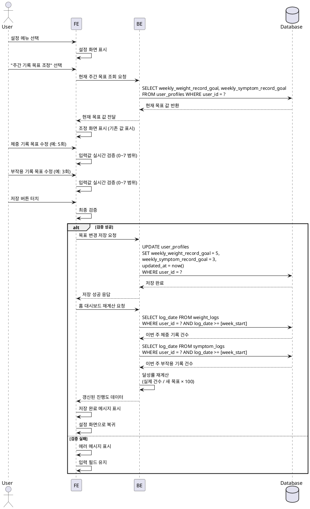

# UF-013: 주간 기록 목표 조정

## Use Case Specification

### Primary Actor
GLP-1 사용자

### Precondition
- 사용자가 로그인된 상태
- 온보딩 완료로 기본 주간 기록 목표가 설정된 상태 (기본값: 체중 7회/주, 부작용 7회/주)
- 설정 메뉴에 접근 가능한 상태

### Trigger
사용자가 설정 메뉴에서 "주간 기록 목표 조정" 메뉴를 선택

### Main Scenario

1. 사용자가 홈 대시보드 또는 다른 화면에서 설정 아이콘/메뉴를 터치
2. 시스템이 설정 화면을 표시
3. 사용자가 "주간 기록 목표 조정" 메뉴를 선택
4. 시스템이 user_profiles 테이블에서 현재 주간 목표 값을 조회
   - weekly_weight_record_goal
   - weekly_symptom_record_goal
5. 시스템이 조정 화면을 표시하며 기존 값을 입력 필드에 표시
6. 사용자가 체중 기록 목표 횟수를 수정 (0~7회)
7. 사용자가 부작용 기록 목표 횟수를 수정 (0~7회)
8. 시스템이 입력값을 실시간 검증
   - 0 이상 7 이하의 정수
   - 음수 불가, 7 초과 불가
9. 사용자가 저장 버튼을 터치
10. 시스템이 변경사항을 user_profiles 테이블에 저장
11. 시스템이 updated_at 필드를 현재 시간으로 갱신
12. 시스템이 DashboardNotifier에 변경 이벤트를 전달
13. 시스템이 홈 대시보드 주간 목표 진행도를 재계산
    - 변경된 목표 기준으로 달성률(%) 재계산
    - 현재 주간 기록 건수는 유지
14. 시스템이 저장 완료 메시지를 표시
15. 시스템이 설정 화면으로 복귀

### Edge Cases

**입력 검증 실패**
- 목표 값 0 입력: 경고 메시지 "목표를 0으로 설정하시겠습니까?" 표시하되 허용
- 7 초과 입력: 에러 메시지 "주간 목표는 최대 7회입니다" 표시, 저장 불가
- 음수 입력: 에러 메시지 "0 이상의 값을 입력하세요" 표시, 저장 불가
- 비정수 입력: 에러 메시지 "정수만 입력 가능합니다" 표시, 저장 불가

**저장 처리 중 오류**
- 변경사항 없이 저장: 검증 생략, 그대로 설정 화면으로 복귀
- 저장 중 앱 종료: 변경사항 폐기, 다음 진입 시 기존 값 유지
- 네트워크/DB 오류: 에러 메시지 표시 후 재시도 옵션 제공

**홈 대시보드 반영**
- 목표 변경 후 홈 화면 이동 시: 변경된 목표 기준으로 진행도 즉시 반영
- 목표 감소로 달성률 100% 초과 시: 100%로 표시하되 실제 기록 건수는 유지
- 목표 증가로 달성률 감소 시: 새 달성률로 표시

### Business Rules

**BR-1: 주간 기록 목표 범위**
- 체중 기록 목표: 0~7회 (주 단위)
- 부작용 기록 목표: 0~7회 (주 단위)
- 기본값: 각각 7회/주

**BR-2: 목표 달성률 계산**
- 달성률(%) = (실제 기록 건수 / 주간 목표 건수) × 100
- 최댓값: 100% (초과 달성 시에도 100%로 표시)
- 최솟값: 0%

**BR-3: 주간 집계 기준**
- 주간 기준: 월요일 00:00 ~ 일요일 23:59
- 기록 건수 계산: log_date 기준 (created_at 아님)
- 중복 날짜 기록: 1건으로 계산

**BR-4: 데이터 동기화**
- 목표 변경 시 홈 대시보드 즉시 재계산
- 기존 기록 데이터는 변경하지 않음
- 투여 목표는 dosage_plans 스케줄 기반으로 자동 계산 (수정 불가)

---

## Sequence Diagram

