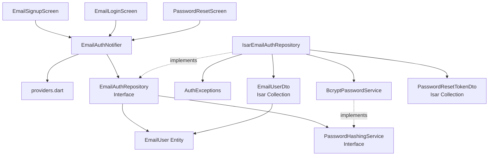

# 이메일/비밀번호 인증 구현 계획 (F-001-B)

## 1. 개요

이메일/비밀번호 인증 기능을 TDD 기반으로 구현하여 소셜 로그인 대안 제공 및 보안 요구사항을 충족한다.

### 핵심 모듈

- **Domain Layer**: EmailUser Entity, EmailAuthRepository Interface, PasswordHashingService Interface
- **Infrastructure Layer**: EmailUserDto, IsarEmailAuthRepository, BcryptPasswordService
- **Application Layer**: EmailAuthNotifier, Provider
- **Presentation Layer**: EmailSignupScreen, EmailLoginScreen, PasswordResetScreen

### TDD 적용 범위

- Unit Tests: Entity, DTO, Repository, UseCase, PasswordService (70%)
- Integration Tests: EmailAuthNotifier + Repository (20%)
- Acceptance Tests: 수동 QA (10%)

---

## 2. Architecture Diagram



---

## 3. Implementation Plan

### 3.1. Domain Layer

#### 3.1.1. EmailUser Entity

**Location**: `lib/features/authentication/domain/entities/email_user.dart`

**Responsibility**:
- 이메일 인증 사용자 정보 표현 (불변 객체)
- 비밀번호 평문 절대 포함 금지 (해시만)

**Test Strategy**: Unit Test

**Test Scenarios (Red Phase)**:
1. **필수 필드로 EmailUser 생성**
   - Arrange: 필수 필드 준비 (id, email, passwordHash, emailVerified, loginAttempts, lastLoginAt)
   - Act: EmailUser 생성
   - Assert: 모든 필드 값 검증

2. **선택적 필드 포함 생성 (lockedUntil)**
   - Arrange: lockedUntil 포함한 필드 준비
   - Act: EmailUser 생성
   - Assert: lockedUntil 값 검증

3. **copyWith로 불변성 유지하며 업데이트**
   - Arrange: 기존 EmailUser 생성
   - Act: copyWith로 일부 필드 변경
   - Assert: 변경된 필드만 업데이트, 나머지 유지

4. **Equatable 동등성 비교**
   - Arrange: 동일한 값의 두 EmailUser 생성
   - Act: == 연산자 사용
   - Assert: true 반환

5. **hashCode 일관성**
   - Arrange: 동일한 값의 두 EmailUser 생성
   - Act: hashCode 비교
   - Assert: 동일한 hashCode

**Edge Cases**:
- email 빈 문자열 허용 여부 (허용하지 않도록 검증 로직 추가 고려)
- lockedUntil이 과거 시각인 경우 (허용, 비즈니스 로직에서 처리)

**Implementation Order**:
1. Red: 필수 필드 생성 테스트 작성 → Fail
2. Green: EmailUser Entity 최소 구현
3. Refactor: Equatable mixin 추가
4. Red: copyWith 테스트 작성 → Fail
5. Green: copyWith 메서드 구현
6. Commit: "feat: Add EmailUser entity with Equatable support"

**Dependencies**: equatable 패키지

---

#### 3.1.2. PasswordResetToken Entity

**Location**: `lib/features/authentication/domain/entities/password_reset_token.dart`

**Responsibility**:
- 비밀번호 재설정 토큰 정보 표현
- 토큰 유효성 검증 로직 (expiresAt, used)

**Test Strategy**: Unit Test

**Test Scenarios (Red Phase)**:
1. **필수 필드로 PasswordResetToken 생성**
   - Arrange: id, userId, token, expiresAt, used, createdAt 준비
   - Act: PasswordResetToken 생성
   - Assert: 모든 필드 검증

2. **isValid 메서드 - 유효한 토큰**
   - Arrange: used=false, expiresAt=미래 시각
   - Act: isValid() 호출
   - Assert: true 반환

3. **isValid 메서드 - 만료된 토큰**
   - Arrange: used=false, expiresAt=과거 시각
   - Act: isValid() 호출
   - Assert: false 반환

4. **isValid 메서드 - 사용된 토큰**
   - Arrange: used=true, expiresAt=미래 시각
   - Act: isValid() 호출
   - Assert: false 반환

5. **Equatable 동등성 비교**
   - Arrange: 동일한 값의 두 토큰 생성
   - Act: == 연산자 사용
   - Assert: true 반환

**Edge Cases**:
- expiresAt이 현재 시각과 정확히 일치하는 경우 (만료로 처리)
- token이 빈 문자열인 경우 (생성 시점에서 UUID 검증 고려)

**Implementation Order**:
1. Red: 기본 생성 테스트 작성 → Fail
2. Green: PasswordResetToken Entity 구현
3. Red: isValid 테스트 작성 → Fail
4. Green: isValid 메서드 구현
5. Refactor: Equatable 추가
6. Commit: "feat: Add PasswordResetToken entity with validation"

**Dependencies**: equatable 패키지

---

#### 3.1.3. EmailAuthRepository Interface

**Location**: `lib/features/authentication/domain/repositories/email_auth_repository.dart`

**Responsibility**:
- 이메일/비밀번호 인증 작업 계약 정의
- Phase 1 전환 대비 추상화

**Test Strategy**: N/A (인터페이스 자체는 테스트하지 않음, 구현체 테스트)

**Methods**:
```dart
abstract class EmailAuthRepository {
  /// 이메일 중복 확인
  Future<bool> isEmailRegistered(String email);

  /// 회원가입
  Future<User> signUp({
    required String email,
    required String passwordHash,
    required bool agreedToTerms,
    required bool agreedToPrivacy,
  });

  /// 로그인
  Future<User> login({
    required String email,
    required String password,
  });

  /// 비밀번호 재설정 토큰 생성
  Future<PasswordResetToken> createResetToken(String email);

  /// 비밀번호 재설정 토큰 검증
  Future<PasswordResetToken?> validateResetToken(String token);

  /// 비밀번호 재설정
  Future<void> resetPassword({
    required String token,
    required String newPasswordHash,
  });

  /// 로그인 실패 횟수 증가
  Future<void> incrementLoginAttempts(String email);

  /// 계정 잠금
  Future<void> lockAccount(String email, DateTime until);

  /// 계정 잠금 확인
  Future<bool> isAccountLocked(String email);
}
```

**Implementation Order**:
1. Red: 구현체 테스트에서 인터페이스 메서드 검증
2. Green: 인터페이스 선언
3. Commit: "feat: Add EmailAuthRepository interface"

**Dependencies**: EmailUser, PasswordResetToken Entity

---

#### 3.1.4. PasswordHashingService Interface

**Location**: `lib/features/authentication/domain/services/password_hashing_service.dart`

**Responsibility**:
- 비밀번호 해싱/검증 계약 정의
- bcrypt 구현 세부사항 추상화

**Test Strategy**: N/A (구현체에서 테스트)

**Methods**:
```dart
abstract class PasswordHashingService {
  /// 비밀번호 해싱
  String hash(String plainPassword);

  /// 비밀번호 검증
  bool verify(String plainPassword, String hashedPassword);
}
```

**Implementation Order**:
1. Green: 인터페이스 선언
2. Commit: "feat: Add PasswordHashingService interface"

**Dependencies**: None

---

#### 3.1.5. AuthExceptions 확장

**Location**: `lib/features/authentication/domain/exceptions/auth_exceptions.dart` (기존 파일 확장)

**Responsibility**:
- 이메일 인증 관련 예외 정의

**Test Strategy**: Unit Test (예외 생성 및 메시지 검증)

**Test Scenarios (Red Phase)**:
1. **EmailAlreadyRegisteredException 생성**
   - Arrange: email 준비
   - Act: EmailAlreadyRegisteredException 생성
   - Assert: 메시지 포함 검증

2. **InvalidCredentialsException 생성**
   - Arrange: 없음
   - Act: InvalidCredentialsException 생성
   - Assert: 메시지 검증

3. **AccountLockedException 생성**
   - Arrange: lockedUntil 준비
   - Act: AccountLockedException 생성
   - Assert: lockedUntil 포함 메시지 검증

4. **InvalidResetTokenException 생성**
   - Arrange: 없음
   - Act: InvalidResetTokenException 생성
   - Assert: 메시지 검증

5. **WeakPasswordException 생성**
   - Arrange: 없음
   - Act: WeakPasswordException 생성
   - Assert: 메시지 검증

**New Exceptions**:
```dart
class EmailAlreadyRegisteredException extends AuthException {
  EmailAlreadyRegisteredException(String email)
      : super('Email already registered: $email');
}

class InvalidCredentialsException extends AuthException {
  InvalidCredentialsException()
      : super('Invalid email or password');
}

class AccountLockedException extends AuthException {
  final DateTime lockedUntil;
  AccountLockedException(this.lockedUntil)
      : super('Account locked until $lockedUntil');
}

class InvalidResetTokenException extends AuthException {
  InvalidResetTokenException()
      : super('Invalid or expired reset token');
}

class WeakPasswordException extends AuthException {
  WeakPasswordException()
      : super('Password does not meet security requirements');
}
```

**Implementation Order**:
1. Red: 예외 생성 테스트 작성 → Fail
2. Green: 예외 클래스 구현
3. Commit: "feat: Add email auth exceptions"

**Dependencies**: 기존 AuthException 베이스 클래스

---

### 3.2. Infrastructure Layer

#### 3.2.1. EmailUserDto

**Location**: `lib/features/authentication/infrastructure/dtos/email_user_dto.dart`

**Responsibility**:
- Isar 컬렉션 정의
- EmailUser ↔ EmailUserDto 변환

**Test Strategy**: Unit Test

**Test Scenarios (Red Phase)**:
1. **EmailUser → EmailUserDto 변환 (fromEntity)**
   - Arrange: EmailUser 객체 생성
   - Act: EmailUserDto.fromEntity() 호출
   - Assert: 모든 필드 매핑 검증

2. **EmailUserDto → EmailUser 변환 (toEntity)**
   - Arrange: EmailUserDto 객체 생성
   - Act: toEntity() 호출
   - Assert: 모든 필드 매핑 검증

3. **양방향 변환 일관성**
   - Arrange: 원본 EmailUser 생성
   - Act: fromEntity → toEntity 순차 호출
   - Assert: 원본과 결과 동일

4. **lockedUntil null 처리**
   - Arrange: lockedUntil이 null인 EmailUser
   - Act: fromEntity → toEntity
   - Assert: null 유지

5. **Isar ID 자동 증가**
   - Arrange: EmailUserDto 생성 (id 미지정)
   - Act: Isar.autoIncrement 확인
   - Assert: id = Isar.autoIncrement

**Edge Cases**:
- email 대소문자 변환 (저장 시 소문자)
- DateTime 정밀도 손실 (밀리초 단위 유지)

**Implementation Order**:
1. Red: fromEntity 테스트 작성 → Fail
2. Green: EmailUserDto 클래스 및 fromEntity 구현
3. Red: toEntity 테스트 작성 → Fail
4. Green: toEntity 구현
5. Refactor: Isar 어노테이션 추가
6. Commit: "feat: Add EmailUserDto with Isar annotations"

**Dependencies**: isar, EmailUser Entity

**Isar Schema**:
```dart
@collection
class EmailUserDto {
  Id id = Isar.autoIncrement;

  @Index(unique: true)
  late String email; // 소문자 저장

  late String passwordHash;
  late bool emailVerified;
  late int loginAttempts;
  DateTime? lockedUntil;
  late DateTime createdAt;
  late DateTime lastLoginAt;
}
```

---

#### 3.2.2. PasswordResetTokenDto

**Location**: `lib/features/authentication/infrastructure/dtos/password_reset_token_dto.dart`

**Responsibility**:
- Isar 컬렉션 정의
- PasswordResetToken ↔ PasswordResetTokenDto 변환

**Test Strategy**: Unit Test

**Test Scenarios (Red Phase)**:
1. **PasswordResetToken → Dto 변환**
   - Arrange: PasswordResetToken 생성
   - Act: fromEntity() 호출
   - Assert: 모든 필드 매핑 검증

2. **Dto → PasswordResetToken 변환**
   - Arrange: PasswordResetTokenDto 생성
   - Act: toEntity() 호출
   - Assert: 모든 필드 매핑 검증

3. **양방향 변환 일관성**
   - Arrange: 원본 토큰 생성
   - Act: fromEntity → toEntity
   - Assert: 원본과 결과 동일

**Implementation Order**:
1. Red: fromEntity 테스트 → Fail
2. Green: PasswordResetTokenDto 구현
3. Red: toEntity 테스트 → Fail
4. Green: toEntity 구현
5. Commit: "feat: Add PasswordResetTokenDto with Isar schema"

**Dependencies**: isar, PasswordResetToken Entity

**Isar Schema**:
```dart
@collection
class PasswordResetTokenDto {
  Id id = Isar.autoIncrement;

  late String userId; // EmailUserDto.email 참조

  @Index(unique: true)
  late String token; // UUID v4

  late DateTime expiresAt;
  late bool used;
  late DateTime createdAt;
}
```

---

#### 3.2.3. BcryptPasswordService

**Location**: `lib/features/authentication/infrastructure/services/bcrypt_password_service.dart`

**Responsibility**:
- bcrypt 알고리즘을 사용한 비밀번호 해싱/검증
- Salt 자동 생성 (bcrypt 내장)

**Test Strategy**: Unit Test

**Test Scenarios (Red Phase)**:
1. **비밀번호 해싱 - 평문과 해시가 다름**
   - Arrange: 평문 비밀번호 "Password123"
   - Act: hash() 호출
   - Assert: 평문과 해시가 다름, bcrypt 형식 검증 ($2a$)

2. **비밀번호 검증 - 올바른 비밀번호**
   - Arrange: 평문 "Password123"을 해싱
   - Act: verify("Password123", hash) 호출
   - Assert: true 반환

3. **비밀번호 검증 - 잘못된 비밀번호**
   - Arrange: 평문 "Password123"을 해싱
   - Act: verify("WrongPassword", hash) 호출
   - Assert: false 반환

4. **같은 비밀번호 두 번 해싱 - 서로 다른 해시**
   - Arrange: 동일한 평문
   - Act: hash() 두 번 호출
   - Assert: 서로 다른 해시 (salt 다름)

5. **빈 문자열 해싱 (Edge Case)**
   - Arrange: 빈 문자열 ""
   - Act: hash("") 호출
   - Assert: 예외 발생 (WeakPasswordException)

**Edge Cases**:
- 매우 긴 비밀번호 (72자 제한)
- 특수문자 포함 비밀번호
- 빈 문자열 또는 공백만 있는 비밀번호

**Implementation Order**:
1. Red: hash 테스트 작성 → Fail
2. Green: BcryptPasswordService.hash() 구현 (bcrypt 패키지 사용)
3. Red: verify 테스트 작성 → Fail
4. Green: BcryptPasswordService.verify() 구현
5. Refactor: 예외 처리 추가
6. Commit: "feat: Add BcryptPasswordService with hash/verify"

**Dependencies**: bcrypt (또는 dbcrypt) 패키지, PasswordHashingService Interface

**Note**: bcrypt cost factor는 12로 설정 (보안과 성능 균형)

---

#### 3.2.4. IsarEmailAuthRepository

**Location**: `lib/features/authentication/infrastructure/repositories/isar_email_auth_repository.dart`

**Responsibility**:
- EmailAuthRepository 인터페이스 구현
- Isar DB 접근 및 트랜잭션 관리
- 비즈니스 로직 (계정 잠금, 로그인 시도 횟수)

**Test Strategy**: Integration Test (MockIsar 사용)

**Test Scenarios (Red Phase)**:

**회원가입 관련**:
1. **isEmailRegistered - 등록된 이메일**
   - Arrange: Isar에 email 존재
   - Act: isEmailRegistered() 호출
   - Assert: true 반환

2. **isEmailRegistered - 등록되지 않은 이메일**
   - Arrange: Isar에 email 없음
   - Act: isEmailRegistered() 호출
   - Assert: false 반환

3. **signUp - 신규 사용자 등록 성공**
   - Arrange: 등록되지 않은 email, 해시된 비밀번호
   - Act: signUp() 호출
   - Assert: EmailUser 반환, Isar에 저장됨, ConsentRecordDto 생성됨

4. **signUp - 중복 이메일로 회원가입 실패**
   - Arrange: 이미 등록된 email
   - Act: signUp() 호출
   - Assert: EmailAlreadyRegisteredException 발생

5. **signUp - 이메일 소문자 변환 저장**
   - Arrange: "Test@Example.COM" 이메일
   - Act: signUp() 호출
   - Assert: Isar에 "test@example.com"으로 저장

**로그인 관련**:
6. **login - 성공 (올바른 이메일/비밀번호)**
   - Arrange: 등록된 사용자, 올바른 비밀번호
   - Act: login() 호출
   - Assert: EmailUser 반환, loginAttempts=0, lastLoginAt 업데이트

7. **login - 실패 (잘못된 비밀번호)**
   - Arrange: 등록된 사용자, 잘못된 비밀번호
   - Act: login() 호출
   - Assert: InvalidCredentialsException 발생, loginAttempts 증가

8. **login - 실패 (존재하지 않는 이메일)**
   - Arrange: 등록되지 않은 email
   - Act: login() 호출
   - Assert: InvalidCredentialsException 발생 (보안상 동일 메시지)

9. **login - 계정 잠금 상태 확인**
   - Arrange: lockedUntil이 미래 시각인 사용자
   - Act: login() 호출
   - Assert: AccountLockedException 발생

10. **login - 5회 실패 시 계정 자동 잠금**
    - Arrange: loginAttempts=4인 사용자
    - Act: login() 호출 (잘못된 비밀번호)
    - Assert: AccountLockedException 발생, lockedUntil = 현재 + 15분

11. **login - 잠금 해제 후 자동 리셋**
    - Arrange: lockedUntil이 과거 시각인 사용자
    - Act: login() 호출 (올바른 비밀번호)
    - Assert: 로그인 성공, loginAttempts=0, lockedUntil=null

**비밀번호 재설정 관련**:
12. **createResetToken - 등록된 이메일**
    - Arrange: 등록된 사용자
    - Act: createResetToken() 호출
    - Assert: PasswordResetToken 반환, Isar에 저장, expiresAt=현재+24시간

13. **createResetToken - 존재하지 않는 이메일**
    - Arrange: 등록되지 않은 email
    - Act: createResetToken() 호출
    - Assert: 예외 발생하지 않음 (보안상 동일 동작, 토큰 생성 안 함)

14. **validateResetToken - 유효한 토큰**
    - Arrange: used=false, expiresAt=미래 시각
    - Act: validateResetToken() 호출
    - Assert: PasswordResetToken 반환

15. **validateResetToken - 만료된 토큰**
    - Arrange: used=false, expiresAt=과거 시각
    - Act: validateResetToken() 호출
    - Assert: null 반환

16. **validateResetToken - 사용된 토큰**
    - Arrange: used=true
    - Act: validateResetToken() 호출
    - Assert: null 반환

17. **resetPassword - 성공**
    - Arrange: 유효한 토큰, 새로운 비밀번호 해시
    - Act: resetPassword() 호출
    - Assert: 비밀번호 업데이트, 토큰 used=true, loginAttempts=0, lockedUntil=null

18. **resetPassword - 무효한 토큰**
    - Arrange: 만료되거나 사용된 토큰
    - Act: resetPassword() 호출
    - Assert: InvalidResetTokenException 발생

**Edge Cases**:
- 동시 로그인 시도 (Isar 트랜잭션 처리)
- 여러 개의 재설정 토큰 요청 (각 토큰 독립적)
- 토큰 검증 중 정확히 만료 시각인 경우 (만료로 처리)

**Implementation Order**:
1. Red: isEmailRegistered 테스트 → Fail
2. Green: isEmailRegistered 구현
3. Red: signUp 테스트 → Fail
4. Green: signUp 구현
5. Red: login 성공 테스트 → Fail
6. Green: login 기본 구현
7. Red: login 실패 및 계정 잠금 테스트 → Fail
8. Green: login 계정 잠금 로직 구현
9. Refactor: 중복 코드 제거, 헬퍼 메서드 추출
10. Red: createResetToken 테스트 → Fail
11. Green: createResetToken 구현
12. Red: validateResetToken 테스트 → Fail
13. Green: validateResetToken 구현
14. Red: resetPassword 테스트 → Fail
15. Green: resetPassword 구현
16. Refactor: 전체 리팩토링
17. Commit: "feat: Add IsarEmailAuthRepository with full implementation"

**Dependencies**:
- Isar, EmailUserDto, PasswordResetTokenDto, ConsentRecordDto
- BcryptPasswordService
- EmailAuthRepository Interface
- AuthExceptions

---

### 3.3. Application Layer

#### 3.3.1. EmailAuthNotifier

**Location**: `lib/features/authentication/application/notifiers/email_auth_notifier.dart`

**Responsibility**:
- 이메일 인증 상태 관리
- Repository 호출 및 에러 처리
- UI 상태 업데이트

**Test Strategy**: Integration Test (MockRepository 사용)

**Test Scenarios (Red Phase)**:

**회원가입 플로우**:
1. **signUp - 성공**
   - Arrange: MockRepository.signUp 성공 설정
   - Act: signUp() 호출
   - Assert: state = AsyncValue.data(user), isFirstLogin 플래그 반환

2. **signUp - 중복 이메일 실패**
   - Arrange: MockRepository.signUp에서 EmailAlreadyRegisteredException 발생
   - Act: signUp() 호출
   - Assert: state = AsyncValue.error, 에러 메시지 포함

3. **signUp - 약한 비밀번호 실패**
   - Arrange: 비밀번호 검증 실패
   - Act: signUp() 호출
   - Assert: state = AsyncValue.error(WeakPasswordException)

**로그인 플로우**:
4. **login - 성공**
   - Arrange: MockRepository.login 성공 설정
   - Act: login() 호출
   - Assert: state = AsyncValue.data(user)

5. **login - 잘못된 비밀번호**
   - Arrange: MockRepository.login에서 InvalidCredentialsException 발생
   - Act: login() 호출
   - Assert: state = AsyncValue.error, 남은 시도 횟수 포함

6. **login - 계정 잠금**
   - Arrange: MockRepository.login에서 AccountLockedException 발생
   - Act: login() 호출
   - Assert: state = AsyncValue.error, 잠금 해제 시간 포함

**비밀번호 재설정 플로우**:
7. **requestPasswordReset - 성공**
   - Arrange: MockRepository.createResetToken 성공 설정
   - Act: requestPasswordReset() 호출
   - Assert: 성공 메시지 반환, 에러 없음

8. **requestPasswordReset - 존재하지 않는 이메일**
   - Arrange: MockRepository.createResetToken 실패
   - Act: requestPasswordReset() 호출
   - Assert: 동일한 성공 메시지 (보안)

9. **validateResetToken - 유효한 토큰**
   - Arrange: MockRepository.validateResetToken 성공
   - Act: validateResetToken() 호출
   - Assert: true 반환

10. **validateResetToken - 무효한 토큰**
    - Arrange: MockRepository.validateResetToken null 반환
    - Act: validateResetToken() 호출
    - Assert: false 반환

11. **resetPassword - 성공**
    - Arrange: MockRepository.resetPassword 성공 설정
    - Act: resetPassword() 호출
    - Assert: 성공 플래그 반환

12. **resetPassword - 무효한 토큰**
    - Arrange: MockRepository.resetPassword에서 InvalidResetTokenException 발생
    - Act: resetPassword() 호출
    - Assert: 에러 반환

**Edge Cases**:
- 네트워크 타임아웃 (재시도 로직)
- 동시 로그인 요청 (debouncing 고려)
- 상태 초기화 (로그아웃 시)

**Implementation Order**:
1. Red: signUp 성공 테스트 → Fail
2. Green: signUp 메서드 구현
3. Red: login 성공 테스트 → Fail
4. Green: login 메서드 구현
5. Red: 에러 처리 테스트 → Fail
6. Green: 에러 핸들링 구현
7. Red: 비밀번호 재설정 테스트 → Fail
8. Green: 비밀번호 재설정 메서드 구현
9. Refactor: 중복 코드 제거
10. Commit: "feat: Add EmailAuthNotifier with full auth flow"

**Dependencies**: EmailAuthRepository, riverpod_annotation, AsyncValue

**Methods**:
```dart
@Riverpod(keepAlive: true)
class EmailAuthNotifier extends _$EmailAuthNotifier {
  @override
  Future<User?> build();

  Future<bool> signUp({
    required String email,
    required String password,
    required bool agreedToTerms,
    required bool agreedToPrivacy,
  });

  Future<bool> login({
    required String email,
    required String password,
  });

  Future<void> requestPasswordReset(String email);

  Future<bool> validateResetToken(String token);

  Future<bool> resetPassword({
    required String token,
    required String newPassword,
  });
}
```

---

#### 3.3.2. Providers

**Location**: `lib/features/authentication/application/providers.dart` (기존 파일 확장)

**Responsibility**:
- EmailAuthRepository Provider 정의
- BcryptPasswordService Provider 정의
- Phase 1 전환 대비 DI

**Test Strategy**: N/A (Provider 선언만)

**Implementation Order**:
1. Green: emailAuthRepositoryProvider 선언
2. Green: passwordHashingServiceProvider 선언
3. Commit: "feat: Add email auth providers"

**Providers**:
```dart
@riverpod
EmailAuthRepository emailAuthRepository(EmailAuthRepositoryRef ref) {
  final isar = ref.watch(isarProvider);
  final passwordService = ref.watch(passwordHashingServiceProvider);
  return IsarEmailAuthRepository(isar, passwordService);
}

@riverpod
PasswordHashingService passwordHashingService(PasswordHashingServiceRef ref) {
  return BcryptPasswordService();
}
```

**Dependencies**: riverpod_annotation, Isar Provider

---

### 3.4. Presentation Layer

#### 3.4.1. EmailSignupScreen

**Location**: `lib/features/authentication/presentation/screens/email_signup_screen.dart`

**Responsibility**:
- 회원가입 UI 렌더링
- 실시간 유효성 검증 (이메일 형식, 비밀번호 강도)
- EmailAuthNotifier 호출

**Test Strategy**: Widget Test (주요 시나리오) + Manual QA

**Test Scenarios (Red Phase)**:
1. **화면 렌더링 - 모든 필수 위젯 표시**
   - Arrange: EmailSignupScreen 생성
   - Act: pumpWidget()
   - Assert: 이메일 필드, 비밀번호 필드, 확인 필드, 약관 체크박스, 회원가입 버튼 존재

2. **이메일 형식 검증 - 유효하지 않은 형식**
   - Arrange: 화면 렌더링
   - Act: "invalid-email" 입력
   - Assert: 에러 메시지 표시

3. **이메일 형식 검증 - 유효한 형식**
   - Arrange: 화면 렌더링
   - Act: "test@example.com" 입력
   - Assert: 녹색 체크 아이콘 표시

4. **비밀번호 강도 표시 - 약함**
   - Arrange: 화면 렌더링
   - Act: "Pass123" 입력
   - Assert: 빨간색 "약함" 표시

5. **비밀번호 강도 표시 - 보통**
   - Arrange: 화면 렌더링
   - Act: "Password12" 입력
   - Assert: 주황색 "보통" 표시

6. **비밀번호 강도 표시 - 강함**
   - Arrange: 화면 렌더링
   - Act: "Password123!@#" 입력
   - Assert: 녹색 "강함" 표시

7. **비밀번호 일치 검증 - 불일치**
   - Arrange: 비밀번호 "Password123" 입력
   - Act: 확인 필드에 "DifferentPass" 입력
   - Assert: 빨간색 "불일치" 메시지

8. **비밀번호 일치 검증 - 일치**
   - Arrange: 비밀번호 "Password123" 입력
   - Act: 확인 필드에 "Password123" 입력
   - Assert: 녹색 체크 표시

9. **회원가입 버튼 활성화 - 조건 미충족**
   - Arrange: 일부 필드만 입력
   - Act: 약관 미동의
   - Assert: 버튼 비활성화

10. **회원가입 버튼 활성화 - 조건 충족**
    - Arrange: 모든 필드 입력, 약관 동의
    - Act: 상태 확인
    - Assert: 버튼 활성화

11. **회원가입 성공 - 온보딩 화면 이동**
    - Arrange: MockEmailAuthNotifier 성공 설정
    - Act: 회원가입 버튼 클릭
    - Assert: 온보딩 화면으로 라우팅

12. **회원가입 실패 - 중복 이메일 에러 표시**
    - Arrange: MockEmailAuthNotifier 중복 이메일 에러 설정
    - Act: 회원가입 버튼 클릭
    - Assert: 스낵바에 "이미 가입된 이메일입니다" 표시

**Edge Cases**:
- 네트워크 오류 시 스낵바 표시
- 로딩 중 버튼 비활성화 (중복 요청 방지)
- 이메일 포커스 아웃 시 중복 확인 (디바운싱)

**Implementation Order**:
1. Red: 화면 렌더링 테스트 → Fail
2. Green: StatefulWidget + Form 기본 구조
3. Red: 이메일 검증 테스트 → Fail
4. Green: TextFormField + Validator 구현
5. Red: 비밀번호 강도 테스트 → Fail
6. Green: 비밀번호 강도 로직 구현
7. Red: 회원가입 성공 테스트 → Fail
8. Green: EmailAuthNotifier 연동
9. Refactor: 위젯 분리 (EmailInputField, PasswordStrengthIndicator)
10. Commit: "feat: Add EmailSignupScreen with validation"

**Dependencies**: EmailAuthNotifier, go_router, flutter_hooks (선택)

**QA Sheet** (수동 테스트):
- [ ] 이메일 필드에 포커스 아웃 시 중복 확인 API 호출 확인
- [ ] 비밀번호 강도 색상이 실시간으로 변경되는지 확인
- [ ] 회원가입 버튼 클릭 시 로딩 인디케이터 표시 확인
- [ ] 중복 이메일 에러 시 "로그인하시겠습니까?" 링크 동작 확인
- [ ] 약관 "보기" 링크 클릭 시 약관 화면 표시 확인
- [ ] 네트워크 오류 시 "재시도" 버튼 동작 확인

---

#### 3.4.2. EmailLoginScreen

**Location**: `lib/features/authentication/presentation/screens/email_login_screen.dart`

**Responsibility**:
- 로그인 UI 렌더링
- EmailAuthNotifier 호출
- 자동 로그인 체크박스 처리

**Test Strategy**: Widget Test + Manual QA

**Test Scenarios (Red Phase)**:
1. **화면 렌더링 - 모든 필수 위젯 표시**
   - Arrange: EmailLoginScreen 생성
   - Act: pumpWidget()
   - Assert: 이메일 필드, 비밀번호 필드, 자동 로그인 체크박스, 로그인 버튼, 비밀번호 찾기 링크, 회원가입 링크 존재

2. **로그인 성공 - 홈 대시보드 이동**
   - Arrange: MockEmailAuthNotifier 성공 설정
   - Act: 로그인 버튼 클릭
   - Assert: 홈 대시보드로 라우팅

3. **로그인 실패 - 잘못된 비밀번호**
   - Arrange: MockEmailAuthNotifier InvalidCredentialsException 설정
   - Act: 로그인 버튼 클릭
   - Assert: "이메일 또는 비밀번호가 올바르지 않습니다 (5회 중 N회 남음)" 표시

4. **로그인 실패 - 계정 잠금**
   - Arrange: MockEmailAuthNotifier AccountLockedException 설정
   - Act: 로그인 버튼 클릭
   - Assert: "계정이 일시적으로 잠겼습니다. X분 X초 후 다시 시도해주세요" 표시, 타이머 동작

5. **자동 로그인 체크 - 체크 시 토큰 유지**
   - Arrange: 자동 로그인 체크
   - Act: 로그인 성공
   - Assert: SecureStorage에 Refresh Token 저장 확인 (Mock 검증)

6. **자동 로그인 미체크 - 앱 종료 시 토큰 삭제**
   - Arrange: 자동 로그인 미체크
   - Act: 로그인 성공 후 앱 종료 시뮬레이션
   - Assert: Access Token만 저장, Refresh Token 없음

7. **빈 필드 검증**
   - Arrange: 이메일 또는 비밀번호 빈 값
   - Act: 로그인 버튼 클릭
   - Assert: "이메일과 비밀번호를 입력해주세요" 에러 메시지

**Edge Cases**:
- 네트워크 오류 시 재시도 버튼
- 로딩 중 버튼 비활성화
- 비밀번호 마스킹 토글 (눈 아이콘)

**Implementation Order**:
1. Red: 화면 렌더링 테스트 → Fail
2. Green: StatefulWidget + Form 기본 구조
3. Red: 로그인 성공 테스트 → Fail
4. Green: EmailAuthNotifier 연동
5. Red: 에러 처리 테스트 → Fail
6. Green: 에러 핸들링 UI 구현
7. Red: 자동 로그인 테스트 → Fail
8. Green: 자동 로그인 로직 구현
9. Refactor: 위젯 분리
10. Commit: "feat: Add EmailLoginScreen with auto-login"

**Dependencies**: EmailAuthNotifier, go_router, SecureStorageService

**QA Sheet** (수동 테스트):
- [ ] 로그인 버튼 클릭 시 로딩 인디케이터 표시 확인
- [ ] 5회 로그인 실패 시 계정 잠금 및 타이머 동작 확인
- [ ] 15분 경과 후 자동 잠금 해제 확인
- [ ] 자동 로그인 체크 시 앱 재실행 시 자동 로그인 확인
- [ ] 비밀번호 찾기 링크 클릭 시 화면 전환 확인
- [ ] 회원가입 링크 클릭 시 화면 전환 확인

---

#### 3.4.3. PasswordResetScreen

**Location**: `lib/features/authentication/presentation/screens/password_reset_screen.dart`

**Responsibility**:
- 비밀번호 재설정 요청 UI
- 이메일 입력 및 검증
- EmailAuthNotifier 호출

**Test Strategy**: Widget Test + Manual QA

**Test Scenarios (Red Phase)**:
1. **화면 렌더링 - 이메일 입력 필드 및 전송 버튼 표시**
   - Arrange: PasswordResetScreen 생성
   - Act: pumpWidget()
   - Assert: 이메일 필드, "재설정 링크 보내기" 버튼 존재

2. **이메일 형식 검증**
   - Arrange: 화면 렌더링
   - Act: 유효하지 않은 이메일 입력
   - Assert: 에러 메시지 표시

3. **재설정 링크 전송 성공**
   - Arrange: MockEmailAuthNotifier 성공 설정
   - Act: 전송 버튼 클릭
   - Assert: "재설정 링크가 발송되었습니다. 이메일을 확인해주세요" 메시지 표시

4. **재설정 링크 전송 실패 - 네트워크 오류**
   - Arrange: MockEmailAuthNotifier 에러 설정
   - Act: 전송 버튼 클릭
   - Assert: "네트워크 연결을 확인해주세요" 에러 표시

**Edge Cases**:
- 존재하지 않는 이메일도 동일한 성공 메시지 (보안)
- 로딩 중 버튼 비활성화

**Implementation Order**:
1. Red: 화면 렌더링 테스트 → Fail
2. Green: StatefulWidget + Form 기본 구조
3. Red: 재설정 링크 전송 테스트 → Fail
4. Green: EmailAuthNotifier 연동
5. Commit: "feat: Add PasswordResetScreen"

**Dependencies**: EmailAuthNotifier, go_router

**QA Sheet** (수동 테스트):
- [ ] 재설정 링크 전송 후 이메일 수신 확인 (Phase 1에서 구현)
- [ ] 로딩 중 버튼 비활성화 확인
- [ ] 에러 메시지 표시 확인

---

#### 3.4.4. NewPasswordScreen

**Location**: `lib/features/authentication/presentation/screens/new_password_screen.dart`

**Responsibility**:
- 새 비밀번호 입력 UI
- 비밀번호 강도 검증
- 토큰 검증 및 비밀번호 재설정

**Test Strategy**: Widget Test + Manual QA

**Test Scenarios (Red Phase)**:
1. **화면 렌더링 - 비밀번호 입력 필드 표시**
   - Arrange: NewPasswordScreen 생성 (토큰 파라미터)
   - Act: pumpWidget()
   - Assert: 비밀번호 필드, 확인 필드, 강도 표시, "재설정" 버튼 존재

2. **토큰 유효성 검증 - 유효한 토큰**
   - Arrange: MockEmailAuthNotifier.validateResetToken = true
   - Act: 화면 진입
   - Assert: 비밀번호 입력 필드 활성화

3. **토큰 유효성 검증 - 무효한 토큰**
   - Arrange: MockEmailAuthNotifier.validateResetToken = false
   - Act: 화면 진입
   - Assert: "재설정 링크가 만료되었거나 유효하지 않습니다" 에러 화면, "다시 요청하기" 버튼

4. **비밀번호 재설정 성공**
   - Arrange: 유효한 토큰, MockEmailAuthNotifier.resetPassword 성공
   - Act: 새 비밀번호 입력 후 재설정 버튼 클릭
   - Assert: "비밀번호가 성공적으로 변경되었습니다" 메시지, 3초 후 로그인 화면 이동

5. **비밀번호 재설정 실패 - 약한 비밀번호**
   - Arrange: 유효한 토큰
   - Act: "123" 입력 후 재설정 버튼 클릭
   - Assert: WeakPasswordException 에러 메시지

6. **비밀번호 일치 검증**
   - Arrange: 비밀번호 입력
   - Act: 확인 필드에 다른 값 입력
   - Assert: "비밀번호가 일치하지 않습니다" 에러

**Edge Cases**:
- 딥링크로 진입 시 토큰 파라미터 누락 (에러 화면)
- 재설정 중 토큰 만료 (24시간 경과)

**Implementation Order**:
1. Red: 화면 렌더링 테스트 → Fail
2. Green: StatefulWidget + Form 기본 구조
3. Red: 토큰 검증 테스트 → Fail
4. Green: 토큰 검증 로직 구현
5. Red: 비밀번호 재설정 테스트 → Fail
6. Green: EmailAuthNotifier 연동
7. Refactor: 비밀번호 강도 위젯 재사용 (SignupScreen과 공통)
8. Commit: "feat: Add NewPasswordScreen with token validation"

**Dependencies**: EmailAuthNotifier, go_router, PasswordStrengthIndicator 위젯

**QA Sheet** (수동 테스트):
- [ ] 딥링크로 진입 시 토큰 파라미터 파싱 확인
- [ ] 토큰 만료 시 에러 화면 표시 확인
- [ ] 비밀번호 재설정 성공 후 3초 후 로그인 화면 이동 확인
- [ ] 재설정 성공 후 새 비밀번호로 로그인 확인

---

## 4. TDD Workflow

### 4.1. 구현 순서 (Critical Path)

```
1. Domain Layer 기반 구축 (Day 1-2)
   ├── EmailUser Entity (RED → GREEN → REFACTOR)
   ├── PasswordResetToken Entity
   ├── EmailAuthRepository Interface
   ├── PasswordHashingService Interface
   └── AuthExceptions 확장

2. Infrastructure Layer 구현 (Day 3-5)
   ├── EmailUserDto
   ├── PasswordResetTokenDto
   ├── BcryptPasswordService (RED → GREEN → REFACTOR)
   └── IsarEmailAuthRepository (가장 복잡, 충분한 시간 할당)

3. Application Layer 구현 (Day 6-7)
   ├── Providers 선언
   └── EmailAuthNotifier (RED → GREEN → REFACTOR)

4. Presentation Layer 구현 (Day 8-10)
   ├── EmailSignupScreen
   ├── EmailLoginScreen
   ├── PasswordResetScreen
   └── NewPasswordScreen

5. 통합 테스트 및 QA (Day 11-12)
   ├── 전체 플로우 테스트
   ├── 수동 QA
   └── 버그 수정
```

### 4.2. TDD 사이클 적용

각 모듈마다:

1. **Red Phase**: 테스트 작성 → `flutter test` 실행 → Fail 확인
2. **Green Phase**: 최소 구현 → `flutter test` 실행 → Pass 확인
3. **Refactor Phase**: 코드 정리 → `flutter test` 실행 → Pass 유지
4. **Commit**: 작은 단위로 커밋 (1 모듈 = 1 커밋)

### 4.3. Commit 포인트

```
feat: Add EmailUser entity with Equatable support
feat: Add PasswordResetToken entity with validation
feat: Add EmailAuthRepository interface
feat: Add PasswordHashingService interface
feat: Add email auth exceptions
feat: Add EmailUserDto with Isar annotations
feat: Add PasswordResetTokenDto with Isar schema
feat: Add BcryptPasswordService with hash/verify
feat: Add IsarEmailAuthRepository with full implementation
feat: Add email auth providers
feat: Add EmailAuthNotifier with full auth flow
feat: Add EmailSignupScreen with validation
feat: Add EmailLoginScreen with auto-login
feat: Add PasswordResetScreen
feat: Add NewPasswordScreen with token validation
test: Add integration tests for email auth flow
docs: Add email auth QA results
```

---

## 5. 보안 고려사항

### 5.1. 비밀번호 보안

- **해싱 알고리즘**: bcrypt (cost factor = 12)
- **Salt**: bcrypt 자동 생성 (랜덤)
- **평문 저장 금지**: 비밀번호 평문은 절대 로그에 기록하지 않음
- **HTTPS 통신**: Phase 1에서 모든 API 호출은 HTTPS 필수

### 5.2. 토큰 관리

- **Access Token**: 1시간 유효 (FlutterSecureStorage 저장)
- **Refresh Token**: 30일 유효 (자동 로그인 체크 시만 저장)
- **암호화 저장**: Keychain (iOS) / Keystore (Android) 활용

### 5.3. 계정 보호

- **로그인 시도 제한**: 5회 실패 시 15분 잠금
- **잠금 해제**: 시간 경과 후 자동 (수동 개입 불필요)
- **이메일 존재 여부 노출 방지**: 동일한 에러 메시지 ("이메일 또는 비밀번호가 올바르지 않습니다")

### 5.4. 재설정 토큰 보안

- **토큰 형식**: UUID v4 (충분한 엔트로피)
- **1회용 토큰**: used=true 처리 후 재사용 불가
- **유효기간**: 24시간
- **이메일 존재 여부 노출 방지**: 존재하지 않는 이메일도 동일한 성공 메시지

---

## 6. Phase 1 전환 대비

### 6.1. 변경 범위

| Layer | Phase 0 | Phase 1 | 변경 여부 |
|-------|---------|---------|----------|
| Domain | EmailUser, EmailAuthRepository | 동일 | ❌ 변경 없음 |
| Application | EmailAuthNotifier | 동일 | ❌ 변경 없음 |
| Infrastructure | IsarEmailAuthRepository | SupabaseEmailAuthRepository (추가) | ✅ 구현체 추가 |
| Presentation | EmailSignupScreen 등 | 동일 | ❌ 변경 없음 |

### 6.2. Provider DI 변경 (1줄)

```dart
// Phase 0
@riverpod
EmailAuthRepository emailAuthRepository(EmailAuthRepositoryRef ref) {
  return IsarEmailAuthRepository(ref.watch(isarProvider), ref.watch(passwordHashingServiceProvider));
}

// Phase 1 (Infrastructure Layer만 수정)
@riverpod
EmailAuthRepository emailAuthRepository(EmailAuthRepositoryRef ref) {
  return SupabaseEmailAuthRepository(ref.watch(supabaseProvider), ref.watch(passwordHashingServiceProvider));
}
```

### 6.3. Supabase 전환 시 추가 작업

- Supabase Auth 연동 (이메일 인증 활성화)
- Edge Functions를 통한 이메일 발송 (SMTP)
- RLS 정책 적용 (auth.uid() 기반)
- 비밀번호 재설정 이메일 템플릿 작성

---

## 7. 성능 요구사항

- **이메일 중복 확인**: 1초 이내 응답 (Isar 인덱스 활용)
- **로그인 처리**: 2초 이내 완료 (bcrypt 해싱 포함)
- **토큰 검증**: 500ms 이내 응답
- **비밀번호 해싱**: bcrypt cost factor = 12 (보안과 성능 균형)

---

## 8. 테스트 전략 요약

### 8.1. Unit Tests (70%)

- **Entity**: EmailUser, PasswordResetToken
- **DTO**: EmailUserDto, PasswordResetTokenDto
- **Service**: BcryptPasswordService
- **Exception**: AuthExceptions

**실행 방법**: `flutter test test/features/authentication/domain` 및 `test/features/authentication/infrastructure`

### 8.2. Integration Tests (20%)

- **Repository**: IsarEmailAuthRepository (MockIsar)
- **Notifier**: EmailAuthNotifier (MockRepository)

**실행 방법**: `flutter test test/features/authentication/application`

### 8.3. Acceptance Tests (10%)

- **Widget Test**: EmailSignupScreen, EmailLoginScreen 주요 시나리오
- **Manual QA**: QA Sheet 기반 수동 테스트

**실행 방법**: `flutter test test/features/authentication/presentation` + 수동 테스트

---

## 9. 다음 단계

1. **Domain Layer 구현 시작**: EmailUser Entity부터 TDD로 구현
2. **Infrastructure Layer 구현**: IsarEmailAuthRepository까지 완료
3. **Application Layer 구현**: EmailAuthNotifier 및 Provider 연동
4. **Presentation Layer 구현**: UI 화면 4개 구현
5. **통합 테스트**: 전체 플로우 검증
6. **QA 수행**: QA Sheet 기반 수동 테스트
7. **버그 수정 및 리팩토링**: 발견된 이슈 해결
8. **문서화**: README에 이메일 인증 사용법 추가
9. **코드 리뷰**: 팀원 리뷰 요청
10. **배포**: Phase 0 완료 후 Phase 1 준비

---

## 10. 참고사항

### 10.1. 비밀번호 검증 규칙

- **최소 8자 이상**
- **영문(대소문자 구분 없음) + 숫자 조합 필수**
- **특수문자 선택사항** (포함 시 강도 상향)

**강도 분류**:
- **약함(빨강)**: 최소 조건만 충족 (8자, 영문+숫자)
- **보통(주황)**: 10자 이상 또는 특수문자 포함
- **강함(초록)**: 12자 이상 + 특수문자 포함

### 10.2. 이메일 형식 검증

- **RFC 5322 정규식 준수**
- **대소문자 구분 없음** (저장 시 소문자 변환)
- **실시간 검증** (입력 시마다 체크)

**정규식 예시**:
```dart
final emailRegex = RegExp(
  r'^[a-zA-Z0-9._%+-]+@[a-zA-Z0-9.-]+\.[a-zA-Z]{2,}$',
);
```

### 10.3. 알림 메시지 톤

- **긍정적이고 명확한 언어 사용**
- **보안상 민감한 정보 노출 방지**
- **사용자에게 다음 행동 안내**

**예시**:
- ✅ "재설정 링크가 발송되었습니다. 이메일을 확인해주세요"
- ❌ "이메일이 존재하지 않습니다" (보안상 노출)

---

**작성일**: 2025-01-09
**작성자**: Claude Code
**버전**: 1.0
**상태**: Ready for Implementation
