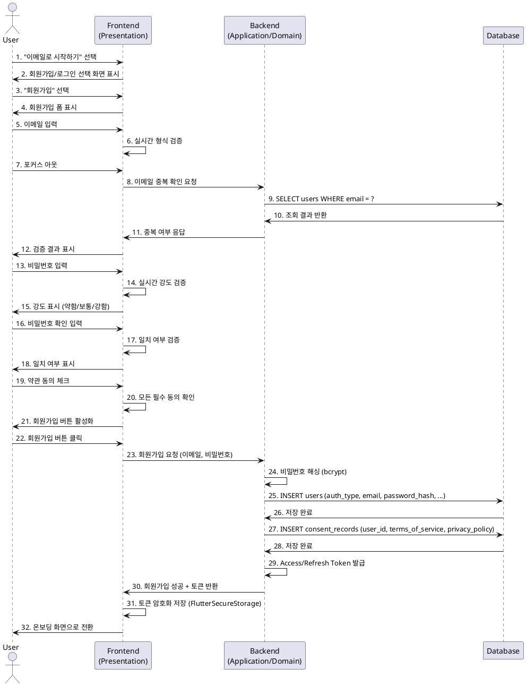
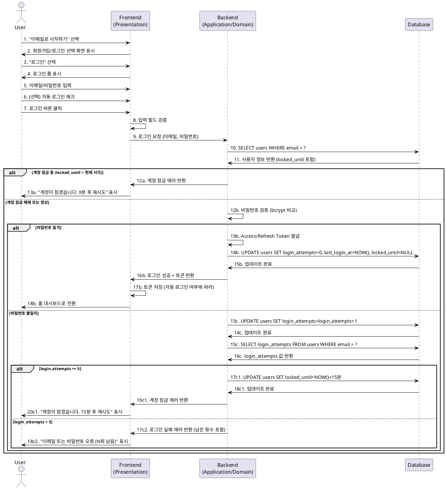
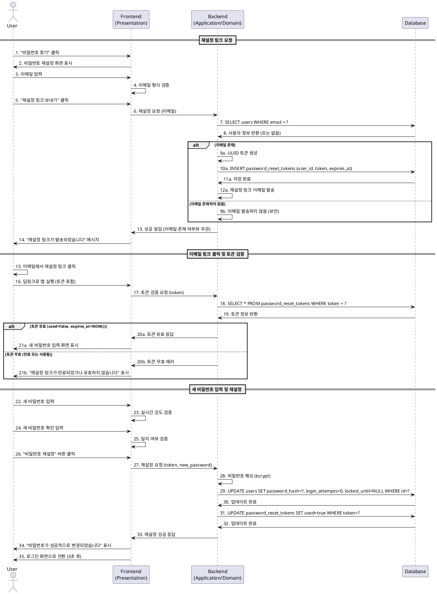

# F-001-B: 이메일/비밀번호 인증 상세 유스케이스

## 목차
1. [이메일/비밀번호 회원가입](#uc-001-이메일비밀번호-회원가입)
2. [이메일/비밀번호 로그인](#uc-002-이메일비밀번호-로그인)
3. [비밀번호 재설정](#uc-003-비밀번호-재설정)

---

## UC-001: 이메일/비밀번호 회원가입

### Primary Actor
신규 사용자

### Precondition
- 사용자가 앱을 설치하고 첫 실행
- 로그인 화면에서 "이메일로 시작하기" 버튼이 표시됨
- 네트워크 연결 가능

### Trigger
사용자가 "이메일로 시작하기" → "회원가입" 선택

### Main Scenario

#### 1. 회원가입 화면 진입
1. 사용자가 로그인 화면에서 "이메일로 시작하기" 버튼 선택
2. 시스템이 회원가입/로그인 선택 화면 표시
3. 사용자가 "회원가입" 선택
4. 시스템이 회원가입 폼 화면 표시

#### 2. 이메일 입력 및 검증
**입력:**
- 이메일 주소 (example@domain.com 형식)

**검증 규칙:**
- 실시간 이메일 형식 검증 (RFC 5322 정규식)
- 포커스 아웃 시 중복 이메일 확인 (Repository 호출)

**처리:**
1. 사용자가 이메일 입력 필드에 포커스
2. 사용자가 이메일 주소 입력
3. 시스템이 실시간으로 이메일 형식 검증
   - 유효하지 않은 형식: 입력 필드 하단에 빨간색 에러 메시지 표시
   - 유효한 형식: 녹색 체크 아이콘 표시
4. 사용자가 포커스 아웃
5. 시스템이 중복 이메일 확인 API 호출
   - 중복 이메일 존재: "이미 가입된 이메일입니다. 로그인하시겠습니까?" 메시지 표시 및 로그인 화면 이동 링크 제공
   - 중복 없음: 다음 단계 진행 가능

#### 3. 비밀번호 입력 및 검증
**입력:**
- 비밀번호 (최소 8자, 영문+숫자 조합 필수)
- 비밀번호 확인

**검증 규칙:**
- 최소 8자 이상
- 영문(대소문자 구분 없음) + 숫자 조합 필수
- 특수문자 선택사항

**비밀번호 강도 분류:**
- 약함(빨강): 최소 조건만 충족 (8자, 영문+숫자)
- 보통(주황): 10자 이상 또는 특수문자 포함
- 강함(초록): 12자 이상 + 특수문자 포함

**처리:**
1. 사용자가 비밀번호 입력 필드에 값 입력
2. 시스템이 실시간으로 비밀번호 강도 검증
   - 조건 미충족: 빨간색 에러 메시지 표시
   - 조건 충족: 강도 표시 (약함/보통/강함) 색상 바 표시
3. 사용자가 비밀번호 확인 필드에 값 입력
4. 시스템이 실시간으로 일치 여부 검증
   - 불일치: 빨간색 "비밀번호가 일치하지 않습니다" 메시지
   - 일치: 녹색 체크 아이콘 표시

#### 4. 약관 동의
**입력:**
- 이용약관 동의 체크박스 (필수)
- 개인정보처리방침 동의 체크박스 (필수)

**처리:**
1. 시스템이 약관 동의 영역 표시
2. 각 약관 텍스트 옆에 "보기" 링크 제공
3. 사용자가 각 체크박스 선택
4. 시스템이 모든 필수 동의 확인
   - 미동의: 회원가입 버튼 비활성화 상태 유지
   - 모두 동의: 회원가입 버튼 활성화

#### 5. 회원가입 처리
**처리 로직:**
1. 사용자가 활성화된 회원가입 버튼 클릭
2. 시스템이 최종 유효성 검증
   - 이메일 형식 재확인
   - 비밀번호 조건 재확인
   - 비밀번호 일치 재확인
   - 약관 동의 재확인
3. **Infrastructure Layer**: 비밀번호 해싱 처리 (bcrypt, salt 자동 생성)
4. **Domain Layer**: User Entity 생성
   - auth_type: 'email'
   - email: 입력된 이메일
   - password_hash: 해싱된 비밀번호
   - email_verified: false
   - login_attempts: 0
   - locked_until: NULL
   - created_at: 현재 시각
   - last_login_at: 현재 시각
5. **Infrastructure Layer**: Repository를 통해 users 테이블에 저장
6. **Infrastructure Layer**: consent_records 테이블에 동의 정보 저장
   - terms_of_service: true
   - privacy_policy: true
   - agreed_at: 현재 시각
7. **Application Layer**: Access Token 발급 (유효기간: 1시간)
8. **Application Layer**: Refresh Token 발급 (유효기간: 30일)
9. **Infrastructure Layer**: 토큰을 FlutterSecureStorage에 암호화 저장
10. **Application Layer**: 로그인 상태 업데이트
11. 시스템이 온보딩 화면(F000)으로 자동 전환

### 출력
- **성공 시:**
  - 자동 로그인 처리
  - 온보딩 화면(UF-F000)으로 이동
  - 환영 메시지 표시 (선택사항)

- **실패 시:**
  - 이메일 중복: "이미 가입된 이메일입니다. 로그인하시겠습니까?" + 로그인 화면 이동 링크
  - 네트워크 오류: "네트워크 연결을 확인해주세요" + 재시도 버튼
  - 서버 오류: "일시적인 오류가 발생했습니다. 잠시 후 다시 시도해주세요"

### Edge Cases

#### EC-001: 이메일 중복
- **상황**: 입력한 이메일이 이미 가입된 이메일
- **처리**: 포커스 아웃 시 즉시 감지
- **출력**: "이미 가입된 이메일입니다. 로그인하시겠습니까?" 메시지 + 로그인 화면 이동 링크

#### EC-002: 비밀번호 불일치
- **상황**: 비밀번호와 비밀번호 확인이 일치하지 않음
- **처리**: 실시간 검증
- **출력**: 빨간색 "비밀번호가 일치하지 않습니다" 에러 메시지

#### EC-003: 약한 비밀번호
- **상황**: 최소 조건만 충족 (8자, 영문+숫자)
- **처리**: 경고 표시하되 가입 허용
- **출력**: "약함" 강도 표시 (빨간색 바)

#### EC-004: 네트워크 오류
- **상황**: 회원가입 중 네트워크 연결 끊김
- **처리**: 에러 메시지 표시
- **출력**: "네트워크 연결을 확인해주세요" + 재시도 버튼

#### EC-005: 입력 중 앱 종료
- **상황**: 회원가입 폼 입력 중 앱 종료
- **처리**: 임시 저장 없이 폐기
- **출력**: 재실행 시 빈 회원가입 폼 표시

#### EC-006: 특수문자 포함 비밀번호
- **상황**: 비밀번호에 특수문자 포함
- **처리**: 허용 (선택사항이므로)
- **출력**: 강도 점수 상향 ("보통" 또는 "강함")

#### EC-007: 서버 응답 지연
- **상황**: 중복 이메일 확인 API 응답 3초 이상 지연
- **처리**: 로딩 인디케이터 표시
- **출력**: 이메일 입력 필드 우측에 스피너 표시

### Business Rules

#### BR-001: 비밀번호 보안
- 비밀번호는 bcrypt 알고리즘으로 해싱하여 저장 (평문 저장 금지)
- Salt는 bcrypt가 자동 생성
- 비밀번호 평문은 절대 로그에 기록하지 않음

#### BR-002: 이메일 유효성
- 이메일 형식은 RFC 5322 정규식 준수
- 대소문자 구분 없음 (저장 시 소문자 변환)
- 중복 이메일 가입 불가

#### BR-003: HTTPS 통신
- 모든 회원가입 API 호출은 HTTPS 필수
- SSL 인증서 검증 활성화

#### BR-004: 토큰 관리
- Access Token 유효기간: 1시간
- Refresh Token 유효기간: 30일
- 토큰은 FlutterSecureStorage에 암호화 저장 (Keychain/Keystore 활용)

#### BR-005: 약관 동의
- 이용약관, 개인정보처리방침 동의는 필수
- 동의 일시 기록 필수 (법적 요구사항)

---

## UC-002: 이메일/비밀번호 로그인

### Primary Actor
재방문 사용자

### Precondition
- 사용자가 이미 이메일/비밀번호로 회원가입 완료
- 로그인 화면이 표시됨
- 네트워크 연결 가능

### Trigger
사용자가 "이메일로 시작하기" → "로그인" 선택

### Main Scenario

#### 1. 로그인 화면 진입
1. 사용자가 로그인 화면에서 "이메일로 시작하기" 버튼 선택
2. 시스템이 회원가입/로그인 선택 화면 표시
3. 사용자가 "로그인" 선택
4. 시스템이 로그인 폼 화면 표시
   - 이메일 입력 필드
   - 비밀번호 입력 필드
   - "자동 로그인" 체크박스 (선택사항)
   - "비밀번호 찾기" 링크
   - "회원가입" 링크
   - "로그인" 버튼

#### 2. 이메일/비밀번호 입력
**입력:**
- 이메일 주소
- 비밀번호
- (선택) 자동 로그인 체크박스

**처리:**
1. 사용자가 이메일 주소 입력
2. 사용자가 비밀번호 입력 (마스킹 처리)
3. (선택) 사용자가 "자동 로그인" 체크박스 선택

#### 3. 로그인 처리
**처리 로직:**
1. 사용자가 "로그인" 버튼 클릭
2. **Presentation Layer**: 입력 필드 비어있지 않은지 검증
   - 빈 필드 존재: "이메일과 비밀번호를 입력해주세요" 에러 메시지
3. **Application Layer**: AuthNotifier를 통한 로그인 요청
4. **Infrastructure Layer**: Repository를 통해 users 테이블 조회
   - 이메일 존재 확인
   - locked_until 확인 (계정 잠금 상태 확인)
5. **계정 잠금 확인:**
   - locked_until이 NULL이 아니고 현재 시각보다 미래: 계정 잠금 상태
   - 잠금 해제 시간까지 남은 시간 계산
   - "계정이 일시적으로 잠겼습니다. X분 X초 후 다시 시도해주세요" 에러 메시지 표시
   - 로그인 실패 처리 (4단계로 리턴)
6. **Domain Layer**: 비밀번호 검증
   - 입력된 비밀번호를 bcrypt로 해싱
   - 저장된 password_hash와 비교
7. **인증 성공 시:**
   - **Infrastructure Layer**: Access Token 발급 (유효기간: 1시간)
   - **Infrastructure Layer**: Refresh Token 발급 (유효기간: 30일)
   - **Infrastructure Layer**: 토큰을 FlutterSecureStorage에 저장
   - **Infrastructure Layer**: users 테이블 업데이트
     * login_attempts = 0 (로그인 시도 횟수 리셋)
     * last_login_at = 현재 시각
     * locked_until = NULL (잠금 해제)
   - **Application Layer**: 로그인 상태 업데이트
   - 자동 로그인 체크 시: Refresh Token 유지 (앱 종료 후에도)
   - 자동 로그인 미체크 시: Access Token만 저장 (앱 종료 시 삭제)
   - 시스템이 홈 대시보드(F006)로 자동 전환
8. **인증 실패 시:**
   - **Infrastructure Layer**: users 테이블 업데이트
     * login_attempts = login_attempts + 1
     * login_attempts >= 5 시: locked_until = 현재 시각 + 15분
   - **Presentation Layer**: 에러 메시지 표시
     * login_attempts < 5: "이메일 또는 비밀번호가 올바르지 않습니다 (5회 중 N회 남음)"
     * login_attempts >= 5: "계정이 일시적으로 잠겼습니다. 15분 후 다시 시도해주세요"

### 출력
- **성공 시:**
  - 홈 대시보드(UF-F006)로 이동
  - 토큰 저장 완료

- **실패 시:**
  - "이메일 또는 비밀번호가 올바르지 않습니다 (5회 중 N회 남음)"
  - "계정이 일시적으로 잠겼습니다. 15분 후 다시 시도해주세요"
  - "네트워크 연결을 확인해주세요"

### Edge Cases

#### EC-001: 잘못된 이메일/비밀번호
- **상황**: 입력한 이메일 또는 비밀번호가 틀림
- **처리**: login_attempts 증가
- **출력**: 보안상 동일한 에러 메시지 ("이메일 또는 비밀번호가 올바르지 않습니다")
- **보안 고려**: 이메일 존재 여부를 노출하지 않음

#### EC-002: 계정 잠금 (5회 실패)
- **상황**: 로그인 5회 연속 실패
- **처리**: locked_until = 현재 시각 + 15분 설정
- **출력**: "계정이 일시적으로 잠겼습니다. 15분 후 다시 시도해주세요" + 타이머 표시

#### EC-003: 잠금 해제 시간 경과 후
- **상황**: 잠금 시간(15분) 경과
- **처리**:
  - 로그인 시 locked_until 확인
  - 현재 시각 > locked_until: 자동으로 login_attempts = 0, locked_until = NULL 리셋
  - 로그인 정상 진행
- **출력**: 정상 로그인 처리

#### EC-004: 이메일 미인증 계정 (Phase 1 고려)
- **상황**: email_verified = false인 계정으로 로그인
- **처리**: Phase 0에서는 무시, Phase 1에서 인증 유도
- **출력**: Phase 0: 정상 로그인, Phase 1: "이메일 인증이 필요합니다" 메시지

#### EC-005: 네트워크 오류
- **상황**: 로그인 중 네트워크 연결 끊김
- **처리**: 에러 메시지 표시
- **출력**: "네트워크 연결을 확인해주세요" + 재시도 버튼

#### EC-006: 자동 로그인 미체크 시
- **상황**: 자동 로그인 체크하지 않고 로그인
- **처리**: Access Token만 메모리에 저장 (영구 저장소에 저장하지 않음)
- **출력**: 앱 종료 후 재실행 시 로그인 화면 표시

#### EC-007: 토큰 갱신 실패
- **상황**: Access Token 만료 후 Refresh Token으로 갱신 시도 실패
- **처리**: 재로그인 유도
- **출력**: "세션이 만료되었습니다. 다시 로그인해주세요" + 로그인 화면 이동

#### EC-008: 동시 다중 기기 로그인
- **상황**: 같은 계정으로 여러 기기에서 로그인
- **처리**: Phase 0에서는 허용 (각 기기 독립적 세션)
- **출력**: 정상 로그인 (충돌 없음)

### Business Rules

#### BR-001: 계정 보안
- 로그인 5회 실패 시 15분간 계정 잠금
- 잠금 해제는 시간 경과 후 자동 처리 (수동 개입 불필요)
- 비밀번호 평문은 절대 로그에 기록하지 않음

#### BR-002: 토큰 관리
- Access Token 유효기간: 1시간
- Refresh Token 유효기간: 30일
- 토큰은 FlutterSecureStorage에 암호화 저장
- 자동 로그인 미체크 시: 앱 종료 시 토큰 삭제

#### BR-003: 자동 로그인
- 자동 로그인 체크 시: Refresh Token을 이용한 자동 로그인
- Refresh Token 만료 시: 재로그인 유도

#### BR-004: 에러 메시지 보안
- 이메일 존재 여부를 노출하지 않음 (동일한 에러 메시지 사용)
- 로그인 실패 시 남은 시도 횟수만 표시

#### BR-005: HTTPS 통신
- 모든 로그인 API 호출은 HTTPS 필수

---

## UC-003: 비밀번호 재설정

### Primary Actor
비밀번호를 잊은 사용자

### Precondition
- 사용자가 이메일/비밀번호로 가입한 계정 보유
- 로그인 화면이 표시됨
- 네트워크 연결 가능

### Trigger
사용자가 로그인 화면에서 "비밀번호 찾기" 링크 클릭

### Main Scenario

#### 1. 비밀번호 재설정 요청
**입력:**
- 등록된 이메일 주소

**처리:**
1. 사용자가 "비밀번호 찾기" 링크 클릭
2. 시스템이 비밀번호 재설정 화면 표시
3. 사용자가 이메일 주소 입력
4. 시스템이 이메일 형식 검증
   - 유효하지 않은 형식: 빨간색 에러 메시지 표시
   - 유효한 형식: 녹색 체크 아이콘 표시
5. 사용자가 "재설정 링크 보내기" 버튼 클릭
6. **Infrastructure Layer**: Repository를 통해 이메일 존재 여부 확인
   - 존재하지 않는 이메일도 동일한 메시지 표시 (보안상 이메일 존재 여부 노출 방지)
7. **Infrastructure Layer**: 재설정 토큰 생성
   - UUID v4 형식 토큰 생성
   - password_reset_tokens 테이블에 저장
     * user_id: 해당 사용자 ID
     * token: 생성된 UUID
     * expires_at: 현재 시각 + 24시간
     * used: false
     * created_at: 현재 시각
8. **Infrastructure Layer**: 이메일 발송
   - 수신자: 입력된 이메일
   - 제목: "[GLP-1 치료 관리] 비밀번호 재설정 안내"
   - 본문: 재설정 링크 포함 (예: https://app.example.com/reset-password?token={UUID})
   - 유효시간 안내: "이 링크는 24시간 동안 유효합니다"
9. **Presentation Layer**: 성공 메시지 표시
   - "재설정 링크가 발송되었습니다. 이메일을 확인해주세요"
   - 이메일 존재 여부와 관계없이 동일한 메시지 (보안)

#### 2. 이메일 링크 클릭 및 토큰 검증
**처리:**
1. 사용자가 이메일에서 재설정 링크 클릭
2. **Infrastructure Layer**: 딥링크 처리 (앱 실행 또는 포그라운드 전환)
3. **Infrastructure Layer**: 토큰 유효성 검증
   - password_reset_tokens 테이블 조회
   - 토큰 존재 여부 확인
   - used = false 확인
   - expires_at > 현재 시각 확인
4. **토큰 유효한 경우:**
   - 새 비밀번호 입력 화면 표시
5. **토큰 무효한 경우:**
   - 에러 화면 표시
   - "재설정 링크가 만료되었거나 유효하지 않습니다"
   - "다시 요청하기" 버튼 제공

#### 3. 새 비밀번호 입력 및 재설정
**입력:**
- 새 비밀번호 (최소 8자, 영문+숫자 조합 필수)
- 새 비밀번호 확인

**검증 규칙:**
- 회원가입 시 비밀번호 검증 규칙과 동일
- 실시간 강도 검증 및 일치 여부 확인

**처리:**
1. 시스템이 새 비밀번호 입력 화면 표시
   - 새 비밀번호 입력 필드
   - 새 비밀번호 확인 입력 필드
   - 비밀번호 강도 표시 (약함/보통/강함)
2. 사용자가 새 비밀번호 입력
3. 시스템이 실시간으로 강도 검증 및 일치 여부 확인
   - 조건 미충족: 빨간색 에러 메시지
   - 조건 충족: 강도 표시 및 녹색 체크
4. 사용자가 "비밀번호 재설정" 버튼 클릭
5. **Infrastructure Layer**: 비밀번호 해싱 처리 (bcrypt)
6. **Infrastructure Layer**: users 테이블 업데이트
   - password_hash: 새로 해싱된 비밀번호
   - login_attempts: 0 (리셋)
   - locked_until: NULL (계정 잠금 해제)
   - last_login_at: 현재 시각 (선택사항)
7. **Infrastructure Layer**: password_reset_tokens 테이블 업데이트
   - used: true (토큰 사용 처리)
8. **Presentation Layer**: 성공 메시지 표시
   - "비밀번호가 성공적으로 변경되었습니다"
   - 로그인 화면으로 자동 전환 (3초 후)

### 출력
- **재설정 링크 요청 성공:**
  - "재설정 링크가 발송되었습니다. 이메일을 확인해주세요"

- **토큰 무효:**
  - "재설정 링크가 만료되었거나 유효하지 않습니다"
  - "다시 요청하기" 버튼

- **재설정 성공:**
  - "비밀번호가 성공적으로 변경되었습니다"
  - 로그인 화면으로 전환

- **실패:**
  - "네트워크 연결을 확인해주세요"
  - "일시적인 오류가 발생했습니다. 잠시 후 다시 시도해주세요"

### Edge Cases

#### EC-001: 존재하지 않는 이메일
- **상황**: 입력한 이메일이 가입되지 않은 이메일
- **처리**: 보안상 동일한 성공 메시지 표시 (이메일 존재 여부 노출 방지)
- **출력**: "재설정 링크가 발송되었습니다. 이메일을 확인해주세요"
- **실제 동작**: 이메일 발송하지 않음

#### EC-002: 토큰 만료 (24시간 경과)
- **상황**: 재설정 링크 발송 후 24시간 경과
- **처리**: 토큰 검증 실패
- **출력**: "재설정 링크가 만료되었습니다. 다시 요청해주세요" + "다시 요청하기" 버튼

#### EC-003: 토큰 이미 사용됨
- **상황**: 같은 재설정 링크를 두 번 클릭
- **처리**: 토큰 검증 실패 (used = true)
- **출력**: "이미 사용된 재설정 링크입니다" + "다시 요청하기" 버튼

#### EC-004: 새 비밀번호가 기존과 동일
- **상황**: 새 비밀번호가 기존 비밀번호와 동일
- **처리**: 허용 (변경 이력 추적 없음)
- **출력**: 정상 재설정 처리

#### EC-005: 비밀번호 재설정 중 앱 종료
- **상황**: 새 비밀번호 입력 중 앱 종료
- **처리**: 토큰 유효하므로 재진입 가능 (used = false 유지)
- **출력**: 재실행 시 재설정 링크 다시 클릭하여 진입

#### EC-006: 여러 번 재설정 요청
- **상황**: 같은 이메일로 재설정 링크를 여러 번 요청
- **처리**: 각 요청마다 새로운 토큰 생성 (기존 토큰은 유효하지만 가장 최근 토큰 권장)
- **출력**: 각 링크 모두 24시간 내 유효 (먼저 사용된 토큰부터 used = true 처리)

#### EC-007: 이메일 발송 실패
- **상황**: SMTP 서버 오류로 이메일 발송 실패
- **처리**: 에러 로그 기록, 사용자에게는 성공 메시지 표시 (보안)
- **출력**: "재설정 링크가 발송되었습니다. 이메일을 확인해주세요"
- **개선**: Phase 1에서 재시도 큐 도입

#### EC-008: 딥링크 처리 실패
- **상황**: 이메일 링크 클릭 시 앱이 실행되지 않음
- **처리**: 웹 브라우저에서 딥링크 처리 또는 앱 설치 안내 페이지 표시
- **출력**: "앱을 열어 비밀번호를 재설정해주세요" 안내

### Business Rules

#### BR-001: 토큰 보안
- 재설정 토큰은 UUID v4 형식 (충분한 엔트로피)
- 토큰은 1회용 (used = true 처리 후 재사용 불가)
- 토큰 유효기간: 24시간

#### BR-002: 이메일 보안
- 이메일 존재 여부를 노출하지 않음 (동일한 성공 메시지)
- 이메일 발송 실패 시에도 사용자에게는 성공 메시지 표시

#### BR-003: 비밀번호 보안
- 새 비밀번호는 bcrypt로 해싱하여 저장
- 비밀번호 평문은 절대 로그에 기록하지 않음

#### BR-004: 계정 잠금 해제
- 비밀번호 재설정 성공 시 login_attempts 리셋 및 locked_until 해제

#### BR-005: HTTPS 통신
- 모든 비밀번호 재설정 API 호출은 HTTPS 필수

---

## Sequence Diagram

### UC-001: 회원가입 Sequence Diagram

### UC-002: 로그인 Sequence Diagram

### UC-003: 비밀번호 재설정 Sequence Diagram

---

## 참고사항

### Phase 0 vs Phase 1 차이점

| 항목 | Phase 0 (Isar Local) | Phase 1 (Supabase) |
|------|---------------------|-------------------|
| 인증 처리 | 자체 구현 (bcrypt) | Supabase Auth 활용 |
| 토큰 관리 | FlutterSecureStorage | Supabase 자동 관리 |
| 이메일 발송 | 로컬 처리 불가 (Phase 1 대기) | Edge Functions + SMTP |
| 이메일 인증 | 미지원 (email_verified 무시) | 필수 (Supabase Auth) |
| 데이터 저장 | Isar (로컬 DB) | PostgreSQL (클라우드) |

### 보안 고려사항

1. **비밀번호 보안**
   - bcrypt 알고리즘 사용 (salt 자동 생성)
   - 평문 비밀번호는 절대 로그에 기록하지 않음
   - HTTPS 통신 필수

2. **토큰 보안**
   - Access Token: 1시간 유효
   - Refresh Token: 30일 유효
   - FlutterSecureStorage에 암호화 저장 (Keychain/Keystore)

3. **계정 보호**
   - 로그인 5회 실패 시 15분 잠금
   - 이메일 존재 여부 노출 방지 (동일한 에러 메시지)

4. **재설정 토큰 보안**
   - UUID v4 형식 (충분한 엔트로피)
   - 1회용 토큰 (used = true 후 재사용 불가)
   - 24시간 유효기간

### 성능 요구사항

- 이메일 중복 확인: 1초 이내 응답
- 로그인 처리: 2초 이내 완료
- 토큰 검증: 500ms 이내 응답
- 비밀번호 해싱: bcrypt cost factor = 12 (보안과 성능 균형)
