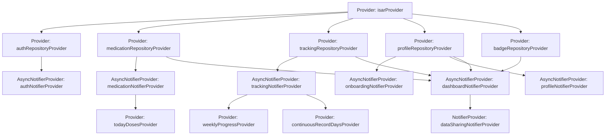

# State Management Design (Flutter/Riverpod)

> GLP-1 치료 관리 MVP의 상태 관리 설계. Riverpod 2.x + 4-Layer Architecture + Repository Pattern.

---

## 1. State Inventory

| Category | State | Type | Feature | Description |
|----------|-------|------|---------|-------------|
| **Domain** | User | `User` | Auth | 사용자 계정 정보 |
| **Domain** | UserProfile | `UserProfile` | F000 | 목표 체중, 주간 목표 설정 |
| **Domain** | DosagePlan | `DosagePlan` | F001 | 투여 계획 |
| **Domain** | DoseSchedule | `List<DoseSchedule>` | F001 | 투여 스케줄 목록 |
| **Domain** | DoseRecord | `List<DoseRecord>` | F001 | 투여 완료 기록 |
| **Domain** | WeightLog | `List<WeightLog>` | F002 | 체중 기록 |
| **Domain** | SymptomLog | `List<SymptomLog>` | F002 | 증상 기록 |
| **Domain** | EmergencySymptomCheck | `List<EmergencySymptomCheck>` | F005 | 심각 증상 체크 기록 |
| **Domain** | BadgeDefinition | `List<BadgeDefinition>` | F006 | 뱃지 정의 (정적) |
| **Domain** | UserBadge | `List<UserBadge>` | F006 | 사용자 뱃지 획득 현황 |
| **Domain** | CopingGuide | `CopingGuide` | F004 | 증상별 대처 가이드 (정적) |
| **UI** | AuthState | `AsyncValue<User?>` | Auth | 인증 상태 |
| **UI** | OnboardingState | `AsyncValue<void>` | F000 | 온보딩 완료 상태 |
| **UI** | DashboardState | `AsyncValue<DashboardData>` | F006 | 대시보드 통합 상태 |
| **UI** | DataSharingMode | `bool` | F003 | 데이터 공유 모드 활성화 |
| **UI** | NotificationEnabled | `bool` | UF-012 | 알림 활성화 상태 |
| **Form** | WeightInput | `double?` | F002 | 체중 입력값 |
| **Form** | SymptomInput | `{String symptomName, int severity, List<String> tags}` | F002 | 증상 입력값 |
| **Form** | DoseInput | `{DateTime date, double doseMg, String? site}` | F001 | 투여 입력값 |
| **Form** | ProfileEditForm | `{String name, double targetWeight, int? periodWeeks}` | UF-008 | 프로필 수정 폼 |
| **Derived** | TodayDoses | `List<DoseRecord>` | F001 | 오늘 투여 기록 (DoseRecord 필터링) |
| **Derived** | WeeklyProgress | `WeeklyGoalProgress` | F006 | 주간 목표 달성률 (기록 개수 계산) |
| **Derived** | ContinuousRecordDays | `int` | F006 | 연속 기록일 (기록 날짜 계산) |
| **Derived** | CurrentWeek | `int` | F006 | 현재 치료 주차 (시작일 기준 계산) |
| **Derived** | InsightMessage | `String?` | F006 | 인사이트 메시지 (데이터 분석 결과) |

---

## 2. State Transitions

| Current State | Trigger | Next State | UI Impact |
|---------------|---------|------------|-----------|
| `AsyncValue.loading()` | 로그인 성공 | `AsyncValue.data(User)` | 홈 대시보드 진입 |
| `AsyncValue.data(User)` | 로그아웃 | `AsyncValue.data(null)` | 로그인 화면 전환 |
| `AsyncValue.loading()` | 온보딩 완료 | `AsyncValue.data(void)` | 투여 계획 생성, 홈 진입 |
| `AsyncValue.data(doses)` | 투여 기록 추가 | `AsyncValue.loading() → data` | 리스트 갱신, 달성률 업데이트 |
| `AsyncValue.data(weights)` | 체중 기록 추가 | `AsyncValue.loading() → data` | 차트 갱신, 대시보드 리렌더링 |
| `AsyncValue.data(symptoms)` | 증상 기록 추가 | `AsyncValue.loading() → data` | 가이드 표시 자동 |
| `DataSharingMode: false` | 공유 모드 활성화 | `DataSharingMode: true` | 읽기 전용 UI 전환 |
| `DataSharingMode: true` | 공유 모드 종료 | `DataSharingMode: false` | 일반 화면 복귀 |
| `AsyncValue.data(plan)` | 투여 계획 수정 | `AsyncValue.loading() → data` | 스케줄 재계산, 대시보드 갱신 |
| `AsyncValue.data(badges)` | 뱃지 조건 달성 | `AsyncValue.data(badges + new)` | 획득 알림 표시 |
| `AsyncValue.data(profile)` | 프로필 수정 | `AsyncValue.loading() → data` | 목표 재계산, 대시보드 갱신 |
| `AsyncValue.data(record)` | 기록 삭제 | `AsyncValue.loading() → data` | 목록 갱신, 통계 재계산 |

---

## 3. Provider Structure



**Provider 선택 기준:**
- `Provider`: Repository, Service (불변)
- `StateNotifierProvider`: 동기 상태 변경
- `AsyncNotifierProvider`: 비동기 CRUD
- `StreamProvider`: Isar watch (실시간 동기화)
- `FutureProvider`: 일회성 비동기 로드

---

## 4. State Classes

### Auth Feature

```dart
// domain/entities/user.dart
class User {
  final String id;
  final String name;
  final String email;
  final String? profileImageUrl;

  User({required this.id, required this.name, required this.email, this.profileImageUrl});
}
```

### Onboarding Feature (F000)

```dart
// domain/entities/user_profile.dart
class UserProfile {
  final String userId;
  final double targetWeightKg;
  final double? targetPeriodWeeks;
  final double? weeklyLossGoalKg;
  final int weeklyWeightRecordGoal;
  final int weeklySymptomRecordGoal;

  UserProfile({
    required this.userId,
    required this.targetWeightKg,
    this.targetPeriodWeeks,
    this.weeklyLossGoalKg,
    this.weeklyWeightRecordGoal = 7,
    this.weeklySymptomRecordGoal = 7,
  });
}

// domain/entities/dosage_plan.dart
class DosagePlan {
  final String id;
  final String userId;
  final String medicationName;
  final DateTime startDate;
  final int cycleDays;
  final double initialDoseMg;
  final List<EscalationStep>? escalationPlan;
  final bool isActive;

  DosagePlan({
    required this.id,
    required this.userId,
    required this.medicationName,
    required this.startDate,
    required this.cycleDays,
    required this.initialDoseMg,
    this.escalationPlan,
    this.isActive = true,
  });
}
```

### Medication Feature (F001)

```dart
// domain/entities/dose_schedule.dart
class DoseSchedule {
  final String id;
  final String dosagePlanId;
  final DateTime scheduledDate;
  final double scheduledDoseMg;
  final TimeOfDay? notificationTime;

  DoseSchedule({
    required this.id,
    required this.dosagePlanId,
    required this.scheduledDate,
    required this.scheduledDoseMg,
    this.notificationTime,
  });
}

// domain/entities/dose_record.dart
class DoseRecord {
  final String id;
  final String? doseScheduleId;
  final String dosagePlanId;
  final DateTime administeredAt;
  final double actualDoseMg;
  final String? injectionSite; // 복부/허벅지/상완
  final bool isCompleted;
  final String? note;

  DoseRecord({
    required this.id,
    this.doseScheduleId,
    required this.dosagePlanId,
    required this.administeredAt,
    required this.actualDoseMg,
    this.injectionSite,
    this.isCompleted = true,
    this.note,
  });
}

// application/notifiers/medication_notifier.dart
class MedicationState {
  final AsyncValue<DosagePlan?> activePlan;
  final AsyncValue<List<DoseSchedule>> schedules;
  final AsyncValue<List<DoseRecord>> records;

  MedicationState({
    required this.activePlan,
    required this.schedules,
    required this.records,
  });
}
```

### Tracking Feature (F002)

```dart
// domain/entities/weight_log.dart
class WeightLog {
  final String id;
  final String userId;
  final DateTime logDate;
  final double weightKg;
  final DateTime createdAt;

  WeightLog({
    required this.id,
    required this.userId,
    required this.logDate,
    required this.weightKg,
    required this.createdAt,
  });
}

// domain/entities/symptom_log.dart
class SymptomLog {
  final String id;
  final String userId;
  final DateTime logDate;
  final String symptomName;
  final int severity; // 1-10
  final int? daysSinceEscalation;
  final bool? isPersistent24h;
  final String? note;
  final List<String> tags;

  SymptomLog({
    required this.id,
    required this.userId,
    required this.logDate,
    required this.symptomName,
    required this.severity,
    this.daysSinceEscalation,
    this.isPersistent24h,
    this.note,
    this.tags = const [],
  });
}

// application/notifiers/tracking_notifier.dart
class TrackingState {
  final AsyncValue<List<WeightLog>> weights;
  final AsyncValue<List<SymptomLog>> symptoms;

  TrackingState({required this.weights, required this.symptoms});
}
```

### Dashboard Feature (F006)

```dart
// application/notifiers/dashboard_notifier.dart
class DashboardData {
  final String userName;
  final int continuousRecordDays;
  final int currentWeek;
  final WeeklyProgress weeklyProgress;
  final NextSchedule nextSchedule;
  final WeeklySummary weeklySummary;
  final List<UserBadge> badges;
  final List<TimelineEvent> timeline;
  final String? insightMessage;

  DashboardData({
    required this.userName,
    required this.continuousRecordDays,
    required this.currentWeek,
    required this.weeklyProgress,
    required this.nextSchedule,
    required this.weeklySummary,
    required this.badges,
    required this.timeline,
    this.insightMessage,
  });
}

class WeeklyProgress {
  final int doseCompletedCount;
  final int doseTargetCount;
  final double doseRate; // 0.0 ~ 1.0
  final int weightRecordCount;
  final int weightTargetCount;
  final double weightRate;
  final int symptomRecordCount;
  final int symptomTargetCount;
  final double symptomRate;

  WeeklyProgress({
    required this.doseCompletedCount,
    required this.doseTargetCount,
    required this.doseRate,
    required this.weightRecordCount,
    required this.weightTargetCount,
    required this.weightRate,
    required this.symptomRecordCount,
    required this.symptomTargetCount,
    required this.symptomRate,
  });
}
```

### Emergency Feature (F005)

```dart
// domain/entities/emergency_symptom_check.dart
class EmergencySymptomCheck {
  final String id;
  final String userId;
  final DateTime checkedAt;
  final List<String> checkedSymptoms;

  EmergencySymptomCheck({
    required this.id,
    required this.userId,
    required this.checkedAt,
    required this.checkedSymptoms,
  });
}
```

### Data Sharing Feature (F003)

```dart
// application/notifiers/data_sharing_notifier.dart
class DataSharingState {
  final bool isActive;
  final DateRange? selectedPeriod;

  DataSharingState({this.isActive = false, this.selectedPeriod});
}
```

---

## 5. Provider Signatures

### Global Providers

```dart
// infrastructure/providers.dart
@riverpod
Isar isar(IsarRef ref);

@riverpod
AuthRepository authRepository(AuthRepositoryRef ref);

@riverpod
MedicationRepository medicationRepository(MedicationRepositoryRef ref);

@riverpod
TrackingRepository trackingRepository(TrackingRepositoryRef ref);

@riverpod
ProfileRepository profileRepository(ProfileRepositoryRef ref);

@riverpod
BadgeRepository badgeRepository(BadgeRepositoryRef ref);
```

### Auth Feature

```dart
// application/notifiers/auth_notifier.dart
@riverpod
class AuthNotifier extends _$AuthNotifier {
  @override
  Future<User?> build();
  Future<void> loginWithKakao();
  Future<void> loginWithNaver();
  Future<void> logout();
}
```

### Onboarding Feature (F000)

```dart
// application/notifiers/onboarding_notifier.dart
@riverpod
class OnboardingNotifier extends _$OnboardingNotifier {
  @override
  Future<void> build();
  Future<void> saveOnboardingData({
    required String name,
    required double currentWeight,
    required double targetWeight,
    int? targetPeriodWeeks,
    required String medicationName,
    required DateTime startDate,
    required int cycleDays,
    required double initialDose,
    List<EscalationStep>? escalationPlan,
  });
}
```

### Medication Feature (F001)

```dart
// application/notifiers/medication_notifier.dart
@riverpod
class MedicationNotifier extends _$MedicationNotifier {
  @override
  Future<MedicationState> build();
  Future<void> recordDose(DoseRecord dose);
  Future<void> updateSchedule(String scheduleId, DateTime newDate);
  Future<void> updateDosagePlan(DosagePlan plan);
  Future<void> deleteDoseRecord(String recordId);
}

@riverpod
List<DoseRecord> todayDoses(TodayDosesRef ref);
```

### Tracking Feature (F002)

```dart
// application/notifiers/tracking_notifier.dart
@riverpod
class TrackingNotifier extends _$TrackingNotifier {
  @override
  Future<TrackingState> build();
  Future<void> saveWeightLog(WeightLog log);
  Future<void> saveSymptomLog(SymptomLog log);
  Future<void> deleteWeightLog(String id);
  Future<void> deleteSymptomLog(String id);
  Future<void> updateWeightLog(String id, double newWeight);
  Future<void> updateSymptomLog(String id, SymptomLog updatedLog);
}

@riverpod
int continuousRecordDays(ContinuousRecordDaysRef ref);
```

### Dashboard Feature (F006)

```dart
// application/notifiers/dashboard_notifier.dart
@riverpod
class DashboardNotifier extends _$DashboardNotifier {
  @override
  Future<DashboardData> build();
  Future<void> refresh();
}

@riverpod
WeeklyProgress weeklyProgress(WeeklyProgressRef ref);

@riverpod
String? insightMessage(InsightMessageRef ref);
```

### Profile Feature (UF-008)

```dart
// application/notifiers/profile_notifier.dart
@riverpod
class ProfileNotifier extends _$ProfileNotifier {
  @override
  Future<UserProfile> build();
  Future<void> updateProfile(UserProfile profile);
  Future<void> updateWeeklyGoals(int weightGoal, int symptomGoal);
}
```

### Data Sharing Feature (F003)

```dart
// application/notifiers/data_sharing_notifier.dart
@riverpod
class DataSharingNotifier extends _$DataSharingNotifier {
  @override
  DataSharingState build();
  void enterSharingMode(DateRange period);
  void exitSharingMode();
}
```

### Emergency Feature (F005)

```dart
// application/notifiers/emergency_notifier.dart
@riverpod
class EmergencyNotifier extends _$EmergencyNotifier {
  @override
  Future<List<EmergencySymptomCheck>> build();
  Future<void> saveSymptomCheck(List<String> symptoms);
}
```

---

## 6. Initial State

```dart
// Auth
const initialAuthState = AsyncValue<User?>.loading();

// Medication
const initialMedicationState = MedicationState(
  activePlan: AsyncValue.loading(),
  schedules: AsyncValue.loading(),
  records: AsyncValue.loading(),
);

// Tracking
const initialTrackingState = TrackingState(
  weights: AsyncValue.loading(),
  symptoms: AsyncValue.loading(),
);

// Dashboard
const initialDashboardState = AsyncValue<DashboardData>.loading();

// Data Sharing
const initialDataSharingState = DataSharingState(isActive: false);
```

---

## 7. Repository Integration Patterns

### Pattern 1: AsyncNotifier + CRUD

```dart
@riverpod
class MedicationNotifier extends _$MedicationNotifier {
  @override
  Future<MedicationState> build() async {
    final repository = ref.watch(medicationRepositoryProvider);
    final plan = await repository.getActiveDosagePlan();
    final schedules = await repository.getDoseSchedules(plan?.id);
    final records = await repository.getDoseRecords(plan?.id);

    return MedicationState(
      activePlan: AsyncValue.data(plan),
      schedules: AsyncValue.data(schedules),
      records: AsyncValue.data(records),
    );
  }

  Future<void> recordDose(DoseRecord dose) async {
    state = const AsyncValue.loading();
    state = await AsyncValue.guard(() async {
      final repository = ref.read(medicationRepositoryProvider);
      await repository.saveDoseRecord(dose);

      // 재조회
      final plan = await repository.getActiveDosagePlan();
      final schedules = await repository.getDoseSchedules(plan?.id);
      final records = await repository.getDoseRecords(plan?.id);

      return MedicationState(
        activePlan: AsyncValue.data(plan),
        schedules: AsyncValue.data(schedules),
        records: AsyncValue.data(records),
      );
    });
  }
}
```

### Pattern 2: StreamProvider (실시간 동기화)

```dart
@riverpod
Stream<List<WeightLog>> weightLogsStream(WeightLogsStreamRef ref) {
  final repository = ref.watch(trackingRepositoryProvider);
  return repository.watchWeightLogs();
}
```

### Pattern 3: Derived Provider (계산 상태)

```dart
@riverpod
int continuousRecordDays(ContinuousRecordDaysRef ref) {
  final trackingState = ref.watch(trackingNotifierProvider).value;
  if (trackingState == null) return 0;

  final allLogs = [
    ...trackingState.weights.value ?? [],
    ...trackingState.symptoms.value ?? [],
  ];

  if (allLogs.isEmpty) return 0;

  // 연속 기록일 계산 로직
  final sortedDates = allLogs
      .map((log) => log.logDate)
      .toSet()
      .toList()
    ..sort((a, b) => b.compareTo(a));

  final today = DateTime.now();
  int days = 0;

  for (var date in sortedDates) {
    if (date.difference(today.subtract(Duration(days: days))).inDays == 0) {
      days++;
    } else {
      break;
    }
  }

  return days;
}
```

---

## 8. Repository Interface 예시

```dart
// domain/repositories/medication_repository.dart
abstract class MedicationRepository {
  Future<DosagePlan?> getActiveDosagePlan();
  Future<List<DoseSchedule>> getDoseSchedules(String? planId);
  Future<List<DoseRecord>> getDoseRecords(String? planId);
  Future<void> saveDosagePlan(DosagePlan plan);
  Future<void> saveDoseRecord(DoseRecord record);
  Future<void> updateDosagePlan(DosagePlan plan);
  Future<void> deleteDoseRecord(String id);
  Stream<List<DoseRecord>> watchDoseRecords();
}

// domain/repositories/tracking_repository.dart
abstract class TrackingRepository {
  Future<List<WeightLog>> getWeightLogs();
  Future<List<SymptomLog>> getSymptomLogs();
  Future<void> saveWeightLog(WeightLog log);
  Future<void> saveSymptomLog(SymptomLog log);
  Future<void> deleteWeightLog(String id);
  Future<void> deleteSymptomLog(String id);
  Future<void> updateWeightLog(String id, double newWeight);
  Future<void> updateSymptomLog(String id, SymptomLog updatedLog);
  Stream<List<WeightLog>> watchWeightLogs();
  Stream<List<SymptomLog>> watchSymptomLogs();
}
```

**Phase 전환 전략:**
- Repository Interface만 의존
- Infrastructure Layer에서 `IsarMedicationRepository` / `SupabaseMedicationRepository` 구현
- Provider DI 변경만으로 전환 완료

---

## 9. 핵심 원칙

### DO ✅
- Repository Interface만 의존, 구현 분리
- DTO는 Infrastructure, Entity는 Domain
- 비즈니스 로직은 Domain Layer에만
- 모든 Repository 호출은 Application Layer
- 모든 비동기 상태는 `AsyncValue<T>` 사용

### DON'T ❌
- Application에서 Isar 직접 사용
- Presentation에서 Repository 직접 호출
- Domain Layer에 Flutter/Isar 의존성
- Provider 의존성 순환
